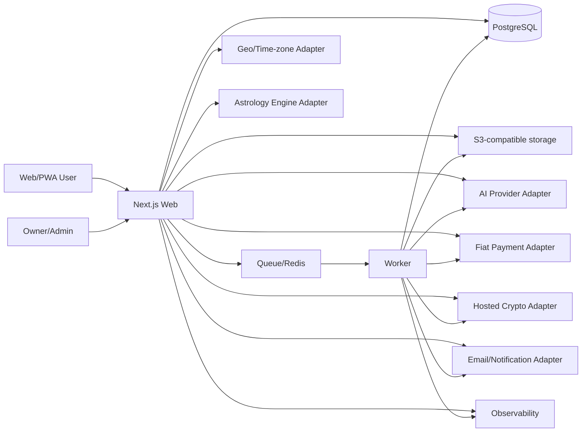

# RITUVIA — Complete Codex Build Manual

> Compiled repository snapshot generated 2026-07-17. The individual files in the repository are canonical; this single file is a convenient reading and handoff artifact.

## Product definition

**RITUVIA is a global platform for symbolic self-reflection, personal ritual, and a private digital sanctuary.**

Core loop: **Question → Interpretation → Intention → Ritual → Journal → Revisit**.

Working brand status: **preferred candidate, not legally cleared**. See `docs/17_BRAND_NAMING.md` and `docs/19_NAME_CLEARANCE_WORKSHEET.md`.

## How to use this compilation

1. Put the full repository package—not only this compilation—at the root of a private Git repository.
2. Open the repository in Codex and submit `CODEX_MASTER_PROMPT.md`.
3. Codex selects the one current executable backlog task, completes one verified task per run, and updates persistent project memory.
4. Keep production deployment, payments, legal/policy, destructive data actions, budgets, and brand commitment behind owner approval.

## Included files

- `.gitignore`
- `.gitattributes`
- `README.md`
- `MANIFEST.md`
- `QA_REPORT.md`
- `OWNER_OPERATING_GUIDE_ZH.md`
- `CODEX_MASTER_PROMPT.md`
- `AGENTS.md`
- `PROJECT_STATUS.md`
- `ENGINEERING_BASELINE.md`
- `DECISIONS.md`
- `ROADMAP.md`
- `BACKLOG.md`
- `CONTRIBUTING.md`
- `records/README.md`
- `records/INDEX.md`
- `docs/00_PROJECT_CHARTER.md`
- `docs/01_PRODUCT_REQUIREMENTS.md`
- `docs/02_USER_EXPERIENCE.md`
- `docs/03_DESIGN_SYSTEM.md`
- `docs/04_ARCHITECTURE.md`
- `docs/05_DATA_MODEL.md`
- `docs/06_AI_INTERPRETATION_SAFETY.md`
- `docs/07_PAYMENTS_COMPLIANCE.md`
- `docs/08_I18N_SEO_GEO_GROWTH.md`
- `docs/09_ANALYTICS_EXPERIMENTS.md`
- `docs/10_SECURITY_PRIVACY_RELIABILITY.md`
- `docs/11_AUTONOMOUS_OPERATIONS.md`
- `docs/12_CONTENT_GOVERNANCE.md`
- `docs/13_API_CONTRACTS.md`
- `docs/14_TEST_STRATEGY.md`
- `docs/15_LAUNCH_RUNBOOK.md`
- `docs/16_COST_GUARDRAILS.md`
- `docs/17_BRAND_NAMING.md`
- `docs/18_REFERENCES.md`
- `docs/19_NAME_CLEARANCE_WORKSHEET.md`
- `docs/20_AI_GROWTH_ENGINE.md`
- `docs/README.md`
- `apps/admin/AGENTS.md`
- `apps/web/AGENTS.md`
- `apps/worker/AGENTS.md`
- `packages/ai/AGENTS.md`
- `packages/country-policy/AGENTS.md`
- `packages/db/AGENTS.md`
- `packages/db/MIGRATIONS.md`
- `packages/divination/AGENTS.md`
- `packages/domain/AGENTS.md`
- `packages/i18n/AGENTS.md`
- `packages/payments/AGENTS.md`
- `packages/ui/AGENTS.md`
- `content/AGENTS.md`
- `.codex/config.toml`
- `.codex/agents/ai-safety.toml`
- `.codex/agents/architect.toml`
- `.codex/agents/backend.toml`
- `.codex/agents/frontend.toml`
- `.codex/agents/growth-seo.toml`
- `.codex/agents/localization.toml`
- `.codex/agents/operations.toml`
- `.codex/agents/payments-risk.toml`
- `.codex/agents/product.toml`
- `.codex/agents/qa-security.toml`
- `.codex/rules/default.rules`
- `automation/README.md`
- `automation/prompts/continue-next-task.md`
- `automation/prompts/daily-maintenance.md`
- `automation/prompts/monthly-risk-audit.md`
- `automation/prompts/release-readiness.md`
- `automation/prompts/weekly-product-review.md`
- `automation/schemas/task-result.schema.json`
- `automation/examples/task-result.example.json`
- `.github/codex/prompts/localization.md`
- `.github/codex/prompts/next-task.md`
- `.github/codex/prompts/release.md`
- `.github/codex/prompts/review.md`
- `.github/codex/prompts/security.md`
- `.github/codex/prompts/seo.md`
- `.github/workflows/README.md`
- `.github/workflows/ci.yml`
- `.github/codex/workflow-examples/codex-nightly.yml`
- `.github/codex/workflow-examples/codex-review.yml`
- `templates/ADR_TEMPLATE.md`
- `templates/EXPERIMENT_TEMPLATE.md`
- `templates/INCIDENT_TEMPLATE.md`
- `templates/RELEASE_CHECKLIST_TEMPLATE.md`
- `templates/TASK_TEMPLATE.md`
- `templates/VENDOR_APPROVAL_TEMPLATE.md`
- `scripts/README.md`
- `scripts/build_checksums.py`
- `scripts/build_compiled_manual.py`
- `scripts/build_record_index.py`
- `scripts/generated_evidence_io.py`
- `scripts/sync_generated_evidence.py`
- `scripts/validate_instruction_pack.py`
- `reference/README.md`

---

# File: `.gitignore`

```gitignore
.DS_Store

.env
.env.*
!.env.example

node_modules/
.pnpm-store/
.next/
.turbo/
coverage/
dist/
playwright-report/
test-results/
.playwright-cli/
.rituvia-config-boundary-*/
.local/
packages/db/src/generated/prisma/

__pycache__/
*.py[cod]
*.tsbuildinfo
*.log
```

---

# File: `.gitattributes`

* text=auto eol=lf

---

# File: `README.md`

# RITUVIA Codex Build System

> Working brand: **RITUVIA**
>
> Product category: a global platform for symbolic self-reflection, personal ritual, and a private digital sanctuary.
>
> Core loop: **Question → Interpretation → Intention → Ritual → Journal → Revisit**.

This repository pack is the operating system for building RITUVIA with Codex as a one-person company. It is not merely a one-shot prompt. It combines product doctrine, architecture, safety rules, a sequenced roadmap, a live backlog, specialized Codex roles, command rules, review prompts, and operating cadences.

## What Codex should build

An English-first, Web/PWA product for global users that offers:

1. Tarot, Western astrology, and numerology.
2. A private digital sanctuary with free and paid virtual ritual objects.
3. Intention setting, private journaling, reminders, and revisit loops.
4. Direct purchases and subscriptions in fiat, plus third-party hosted cryptocurrency checkout where lawfully supported.
5. Country-aware availability, pricing, disclaimers, payment routing, and data controls.
6. AI-generated interpretations grounded in deterministic calculations and curated cultural content.
7. SEO, generative-engine discoverability, localization, analytics, administration, support, and mostly automated operations.

## Start here

1. Read `AGENTS.md`.
2. Read `CODEX_MASTER_PROMPT.md` and submit it to Codex for the first implementation session.
3. Treat `PROJECT_STATUS.md`, `BACKLOG.md`, `ROADMAP.md`, and `DECISIONS.md` as persistent operational memory.
4. Read `ENGINEERING_BASELINE.md` for the observed repository state and exact M0 execution plan.
5. Follow `CONTRIBUTING.md` and the typed durable-record policy in `records/README.md`.
6. Use the documents under `docs/` as canonical specifications.
7. Keep the legacy strategy and visual prototype under `reference/` as evidence and inspiration, not as production code.
8. Use `automation/prompts/continue-next-task.md` for subsequent runs and the `.github/codex/workflow-examples/*.yml` files only after security review and an intentional move into `.github/workflows`.

## Local development

The repository contract is Node.js `24.18.0` (see `.node-version`) and pnpm `11.13.1`. Corepack is not required; from the repository root, use npm's package runner to invoke the exact package-manager version:

```bash
npm exec --yes --package=pnpm@11.13.1 -- pnpm install --frozen-lockfile
npm exec --yes --package=pnpm@11.13.1 -- pnpm check
```

The root quality gate first verifies the active CI contract, architecture, durable records, immutable migration manifest, generated evidence, and current-tree secret policy, then checks formatting, ESLint, strict TypeScript, non-empty Vitest tests, configuration-boundary integration, a real isolated PostgreSQL migration/seed/reset/restore suite, and production builds. The active workspaces are `apps/web`, `apps/worker`, `packages/config`, `packages/db`, `packages/domain`, `packages/observability`, and `packages/ui`; other planned directories remain instruction-only until their backlog task begins.

### Continuous integration

`.github/workflows/ci.yml` is active and contains separate quality, PostgreSQL integration, and
security jobs. It uses only read access, GitHub-hosted Ubuntu 24.04 runners, immutable action SHAs, a
digest-pinned PostgreSQL 17 service, synthetic data, and no repository secrets or deployment
environment. See `.github/workflows/README.md` for the enforced workflow contract and owner-side
required-check setup. Codex workflow examples live outside the Actions workflow directory and remain
inert.

### Local environment configuration

The repository root is the shared environment-file location for both Web and Worker processes. Start with the optional baseline file:

```bash
cp .env.example .env
```

Every example assignment is intentionally empty. Local development uses typed working-brand defaults when brand overrides are omitted. The database lifecycle commands derive the attested local URL themselves; application processes still receive `DATABASE_URL` explicitly through the process environment or an ignored environment file. Web and Worker both use the pinned `@next/env` loader against the repository root with the same development/production mode and standard Next.js file precedence. Process or secret-manager values take precedence, and every `.env` variant must remain uncommitted.

The client receives only an explicit validated brand projection. `NEXT_PUBLIC_*` variables are rejected so a new public variable cannot silently enter a browser bundle. `APP_ENV=production` requires all nine brand settings and an HTTPS canonical origin; production secrets must be supplied by the environment or a secret manager rather than a file in Git.

### Local Web shell

Build the English-first shell without a database:

```bash
npm exec --yes --package=pnpm@11.13.1 -- pnpm --filter @rituvia/web build
```

The running route is deliberately safe-off. Starting the local server without a validated
read-only runtime database and an explicit active `experience.public_shell=on` version returns an
empty 404 for the shell HTML and RSC representations; it does not bypass the activation plane.
After those existing RIT-007 prerequisites are present, run:

```bash
npm exec --yes --package=pnpm@11.13.1 -- pnpm --filter @rituvia/web dev
```

When explicitly enabled, opening `http://localhost:3000` returns a permanent redirect to the only
active, reviewed locale at `/en`. The finite public surface is `/en`, `/en/methodology`,
`/en/safety`, and `/en/privacy`; the privacy route is a product-design overview, not a legal privacy
policy. Unsupported or non-canonical locale/page segments return 404 rather than silently falling
back or generating caches. Every page is server rendered and remains readable without JavaScript.
Local, preview, and staging metadata is `noindex`; a production environment must provide the
approved HTTPS canonical origin before it may emit indexable metadata. The configuration-boundary
integration harness reproducibly verifies enabled and disabled behavior without documenting an
activation bypass or ad hoc SQL. The current shell is an honest foundation, not a claim that
accounts, readings, legal terms, purchases, rituals, or a public launch exist.

`/robots.txt` and `/sitemap.xml` are generated from the same typed four-page inventory. Local,
preview, and staging robots disallow the entire site and publish no sitemap. Production publishes
the four exact, end-anchored document allows, the build-audited `/_next/static/` and icon resources,
and a four-URL sitemap only while the public-shell flag is enabled; disabled or unavailable state
returns disallow-all robots and no sitemap. Query, private, unsupported, bare/spoofed RSC, and
unreviewed Next-internal requests fail closed. Served RSC responses are explicit `noindex` and
`private, no-store`; Next-owned direct `*.rsc` errors are accepted only as `text/x-component` 404s
that remain private, non-cacheable, and free of sensitive canaries. Structured data remains deferred
to RIT-114 rather than being published before its visible-content and rich-result contract exists.

The production build audits all four canonical pages and enforces compressed budgets for localized
HTML, initial CSS/JavaScript, and the SVG icon while rejecting remote script/style/font/media
resources. Browser QA remains required for every future behavior change; the current public pages
have passed keyboard/focus, 320px/400%-equivalent reflow, dark mode, reduced motion, forced colors,
no-JavaScript, console, and local-only network checks.

After a fresh production build, run the committed accessibility/pseudolocale browser gate with the
pinned Chromium headless shell:

```bash
npm exec --yes --package=pnpm@11.13.1 -- pnpm exec playwright install --only-shell chromium
npm exec --yes --package=pnpm@11.13.1 -- pnpm build
npm exec --yes --package=pnpm@11.13.1 -- pnpm test:accessibility
```

The gate serves only audited build artifacts on loopback and covers all four English routes with
blocking axe scans, complete forward/reverse keyboard focus, 44px targets, 40% test-only text
expansion, desktop/mobile RTL scaffolding, dark/reduced-motion/no-JavaScript states, a persistent
online/offline/online connection-state advisory announcement, and local-only requests. `en-XA` and `ar-XB` exist only as
in-browser test transforms; they are not supported, published, canonical, crawlable, or added to
the production locale catalog. CI performs the build immediately before this smoke and installs
Linux browser dependencies with `--with-deps`.

### Shared UI foundation

`@rituvia/ui` provides the private semantic-token stylesheet and native-first React primitives used
by Web and future applications. Import components from `@rituvia/ui` and import
`@rituvia/ui/styles` once at the application root before application-specific CSS. The package owns
focus, disabled/loading/invalid/selection state presentation, system/light/dark tokens, reduced
motion, forced colors, logical-direction behavior, and closed local-action/control-value contracts;
the consuming application still owns every localized label, route, validation rule, mutation, and
idempotency boundary. See `packages/ui/README.md` for the exact catalog and review matrix.

The same package provides presentation-only empty, error, offline, and provider-unavailable page
patterns. Web owns their localized English copy, state classification, announcement/focus timing,
and caller-controlled retry action. The public shell truthfully consumes empty, advisory offline, and route-error
states; provider-unavailable remains a dependency-neutral synthetic pattern until a real adapter and
typed safe classifier exist. This does not add PWA caching, synchronization, provider health, or an
automatic retry capability, and the server-side safe-off flag still returns an empty private 404.

### Local PostgreSQL and Prisma

The verified local database path requires PostgreSQL 17 or 18 command-line tools from one installation. This host uses Homebrew PostgreSQL 17.10. Standard Homebrew versioned locations are detected automatically; otherwise set `RITUVIA_POSTGRES_BIN` to the absolute directory containing all required PostgreSQL tools. Docker is not installed, so no container-reproducibility claim is made; RIT-004 owns the separate CI runtime.

After the frozen install, create or reuse the repository-owned cluster, apply committed migrations, and load the deterministic synthetic seed:

```bash
APP_ENV=local npm exec --yes --package=pnpm@11.13.1 -- pnpm db:setup
```

The cluster lives under ignored `.local/postgres/`, generates random mode-0600 credentials, uses SCRAM authentication and data checksums, and binds only `127.0.0.1:55432`. The application role is not a superuser and cannot create roles or databases. Inspect its state or obtain the local application URL only while it is running:

```bash
npm exec --yes --package=pnpm@11.13.1 -- pnpm db:status
npm exec --yes --package=pnpm@11.13.1 -- pnpm db:url
```

`db:url` prints only the path to an ignored mode-0600 URL file. Use `pnpm db:url -- --reveal` only when explicit terminal disclosure is necessary to supply a local application process; do not paste the URL into committed files, logs, tickets, or remote environments.

Reset is local and destructive, requires `APP_ENV=local`, and accepts only the exact fixed development database after a live cluster/data-directory/system-identifier attestation:

```bash
APP_ENV=local npm exec --yes --package=pnpm@11.13.1 -- pnpm db:reset -- --confirm=reset:rituvia_local@127.0.0.1:55432
npm exec --yes --package=pnpm@11.13.1 -- pnpm db:stop
```

Do not use `prisma migrate reset`, `prisma db push`, a remote `DATABASE_URL`, or the local seed against preview, staging, or production. Migration compatibility, field classification, rollback, and recovery boundaries are recorded in `packages/db/MIGRATIONS.md`.

## Canonical document map

| Concern                                  | Canonical file                            |
| ---------------------------------------- | ----------------------------------------- |
| Product mission and boundaries           | `docs/00_PROJECT_CHARTER.md`              |
| Complete feature requirements            | `docs/01_PRODUCT_REQUIREMENTS.md`         |
| User journeys and UX behavior            | `docs/02_USER_EXPERIENCE.md`              |
| Visual system and component rules        | `docs/03_DESIGN_SYSTEM.md`                |
| Software architecture                    | `docs/04_ARCHITECTURE.md`                 |
| Data model and classification            | `docs/05_DATA_MODEL.md`                   |
| AI interpretation and safety             | `docs/06_AI_INTERPRETATION_SAFETY.md`     |
| Payments, country policy, and compliance | `docs/07_PAYMENTS_COMPLIANCE.md`          |
| Localization, SEO, GEO, and growth       | `docs/08_I18N_SEO_GEO_GROWTH.md`          |
| Metrics and experiments                  | `docs/09_ANALYTICS_EXPERIMENTS.md`        |
| Security, privacy, and reliability       | `docs/10_SECURITY_PRIVACY_RELIABILITY.md` |
| One-person autonomous operations         | `docs/11_AUTONOMOUS_OPERATIONS.md`        |
| Content and cultural governance          | `docs/12_CONTENT_GOVERNANCE.md`           |
| API and integration contracts            | `docs/13_API_CONTRACTS.md`                |
| Test strategy                            | `docs/14_TEST_STRATEGY.md`                |
| Launch and rollback                      | `docs/15_LAUNCH_RUNBOOK.md`               |
| Cost controls                            | `docs/16_COST_GUARDRAILS.md`              |
| Brand decision                           | `docs/17_BRAND_NAMING.md`                 |
| Sources and verification                 | `docs/18_REFERENCES.md`                   |
| Name-clearance execution worksheet       | `docs/19_NAME_CLEARANCE_WORKSHEET.md`     |
| AI-native marketing and distribution     | `docs/20_AI_GROWTH_ENGINE.md`             |

## Current status

Current task state, dependencies, and executable-next selection live only in `BACKLOG.md`; current
capabilities, blockers, environments, and quality totals live only in `PROJECT_STATUS.md`. This
orientation file intentionally does not copy their mutable snapshot.

## Non-negotiable product principle

RITUVIA may help users reflect, create meaning, and perform symbolic rituals. It must not claim to know objective future events, guarantee outcomes, exploit fear, induce dependency, replace professional medical/legal/financial care, or sell stronger spiritual efficacy to higher-paying users.

---

# File: `MANIFEST.md`

# RITUVIA Codex Build System Manifest

**Generated:** 2026-07-17

**Purpose:** a repository-ready instruction and operating package for building RITUVIA as an AI-leveraged one-person company.

## Essential entry points

- `README.md` — package orientation and specification map.
- `OWNER_OPERATING_GUIDE_ZH.md` — Chinese owner operating manual.
- `CODEX_MASTER_PROMPT.md` — first-session and continuation prompts.
- `AGENTS.md` — top-level binding project instructions.
- `BACKLOG.md` — 128 sequenced tasks, including eight explicit owner gates.
- `ROADMAP.md` — 16 milestones from repository foundation through expansion.
- `PROJECT_STATUS.md` — current truth and blockers.
- `ENGINEERING_BASELINE.md` — observed repository reality, setup gaps, and exact M0 plan.
- `QA_REPORT.md` — local consistency checks, passed assertions, and validation limits.
- `DECISIONS.md` — persistent decision register.
- `CONTRIBUTING.md` — one-task workflow, authority boundaries, and generated-evidence order.
- `records/README.md` and generated `records/INDEX.md` — typed durable-record policy and compact discovery index.
- `RITUVIA_CODEX_BUILD_MANUAL.md` — generated reading/handoff compilation; individual files remain canonical.
- `checksums.sha256` — SHA-256 coverage for regular files represented in the Git index, except the checksum file itself.

## Canonical specifications

- `docs/00_PROJECT_CHARTER.md`
- `docs/01_PRODUCT_REQUIREMENTS.md`
- `docs/02_USER_EXPERIENCE.md`
- `docs/03_DESIGN_SYSTEM.md`
- `docs/04_ARCHITECTURE.md`
- `docs/05_DATA_MODEL.md`
- `docs/06_AI_INTERPRETATION_SAFETY.md`
- `docs/07_PAYMENTS_COMPLIANCE.md`
- `docs/08_I18N_SEO_GEO_GROWTH.md`
- `docs/09_ANALYTICS_EXPERIMENTS.md`
- `docs/10_SECURITY_PRIVACY_RELIABILITY.md`
- `docs/11_AUTONOMOUS_OPERATIONS.md`
- `docs/12_CONTENT_GOVERNANCE.md`
- `docs/13_API_CONTRACTS.md`
- `docs/14_TEST_STRATEGY.md`
- `docs/15_LAUNCH_RUNBOOK.md`
- `docs/16_COST_GUARDRAILS.md`
- `docs/17_BRAND_NAMING.md`
- `docs/18_REFERENCES.md`
- `docs/19_NAME_CLEARANCE_WORKSHEET.md`
- `docs/20_AI_GROWTH_ENGINE.md`

## Codex configuration

- `.codex/config.toml` — model, approval, sandbox, multi-agent, and role configuration.
- `.codex/agents/*.toml` — 10 specialized read/review roles.
- `.codex/rules/default.rules` — prompts/blocks for remote, destructive, deploy, database, and publishing commands.
- Root plus nested `AGENTS.md` — global and area-specific engineering contracts.

## Persistent nested instructions

- `apps/web/AGENTS.md`
- `apps/worker/AGENTS.md`
- `apps/admin/AGENTS.md`
- `packages/domain/AGENTS.md`
- `packages/db/AGENTS.md`
- `packages/ui/AGENTS.md`
- `packages/divination/AGENTS.md`
- `packages/ai/AGENTS.md`
- `packages/payments/AGENTS.md`
- `packages/i18n/AGENTS.md`
- `packages/country-policy/AGENTS.md`
- `content/AGENTS.md`

## Automation and review

- `automation/prompts/continue-next-task.md`
- `automation/prompts/daily-maintenance.md`
- `automation/prompts/weekly-product-review.md`
- `automation/prompts/monthly-risk-audit.md`
- `automation/prompts/release-readiness.md`
- `automation/schemas/task-result.schema.json`
- `automation/examples/task-result.example.json`
- `.github/codex/prompts/*.md`
- `.github/workflows/ci.yml` — active least-privilege quality, database, dependency, and security gates.
- `.github/codex/workflow-examples/*.yml` — intentionally inactive outside the Actions workflow directory until reviewed, moved, and secured.

## Local validation

- `scripts/build_compiled_manual.py` — deterministically rebuilds/checks the handoff compilation.
- `scripts/build_record_index.py` — validates typed records and deterministically renders their compact index.
- `scripts/sync_generated_evidence.py` — safely renders index, manual, then Git-index-only checksums.
- `scripts/build_checksums.py` — fail-closed hashing of regular Git-indexed repository artifacts.
- `scripts/verify-records.ts` — validates record graphs and contextual task-result semantics.
- `scripts/validate_instruction_pack.py` — verifies syntax, dependency graph, instruction limits, links, generated manual, checksums, and package invariants.
- `scripts/web-shell-build-policy.mjs` — enforces bounded compressed assets and exact route artifacts across every finite public page and rejects unreviewed remote resources.
- `scripts/copy-ui-styles.mjs` — copies the reviewed UI stylesheet into the package build without runtime generation.
- `scripts/verify-workspace-build.mjs` — verifies workspace exports, UI stylesheet parity, build artifacts, and the Web shell build policy.

## Active UI foundation

- `packages/ui/src/contracts.ts` — bounded local-action, control-identifier, and closed theme values.
- `packages/ui/src/primitives.tsx` — native-first action, field, selection, alert, and loading primitives.
- `packages/ui/src/styles.css` — semantic light/dark/system tokens, focus/state, motion, forced-color, and RTL behavior.
- `packages/ui/test/` and `packages/ui/examples/` — server-rendered semantic, contrast, state, long-text, writing-system, and narrow-reflow evidence.
- `packages/ui/README.md` and `records/decisions/D-024.md` — usage boundaries and the durable architecture decision.

## Active Web foundation

- `apps/web/app/[locale]/page.tsx` and `apps/web/app/[locale]/[page]/page.tsx` — exact locale/page allowlists, localized metadata, and server-rendered public entries.
- `apps/web/app/_components/` — shared semantic public frame plus home and information-page content.
- `apps/web/app/_i18n/` — typed English source messages, pure finite-route contract, locale paths/direction, and per-page canonical metadata.
- `apps/web/proxy.ts` — server-side safe-off enforcement for every public-shell HTML and RSC representation.
- `packages/ui/src/styles.css`, `apps/web/app/styles.css`, and `apps/web/app/icon.svg` — shared semantic tokens, responsive shell presentation, and local icon.
- `apps/web/test/` plus `tests/web-shell*.test.ts` — activation, finite route, message, metadata, semantic HTML, source boundary, and build/resource-budget contracts.

## Reusable records

- `records/tasks/RIT-NNN.md`
- `records/decisions/D-NNN.md`
- `records/incidents/INC-NNN.md`
- `records/experiments/EXP-NNN.md`
- `templates/ADR_TEMPLATE.md`
- `templates/TASK_TEMPLATE.md`
- `templates/INCIDENT_TEMPLATE.md`
- `templates/EXPERIMENT_TEMPLATE.md`
- `templates/RELEASE_CHECKLIST_TEMPLATE.md`
- `templates/VENDOR_APPROVAL_TEMPLATE.md`

## Retained prior work

- `reference/lumora_business_plan_zh.html`
- `reference/lumora_interactive_prototype.html`

`LUMORA` is historical only. Current working brand is `RITUVIA`, pending formal legal/domain/linguistic clearance.

---

# File: `QA_REPORT.md`

# RITUVIA Codex Build System — QA Report

**Validated:** 2026-07-17

**Result:** PASS for the imported instruction pack, repository consistency, and locally executable RIT-001 through RIT-015. The owner approved the exact RIT-012 safety/privacy-design copy and current local completion/browser work; hosted RIT-004 evidence, production deployment, public-shell activation, canonical-domain changes, and actual indexing remain separately gated.

## Checks passed

- All 85 files from the source ZIP were inventoried and read or mechanically compared in full before baseline changes. Before mutation, all 84 archive checksum entries passed.
- All required root, specification, Codex, automation, template, generated-evidence, and retained-reference files exist. Project TOML and JSON parse; repository YAML parses with the host Ruby parser and pnpm accepts the workspace policy.
- Backlog contains 128 unique items: 120 product/engineering tasks and eight owner gates. Dependencies are valid and acyclic; `RIT-000` through `RIT-003`, `RIT-005` through `RIT-007`, and `RIT-009` through `RIT-015` are Done; `RIT-004` is blocked only by `OWN-008`; RIT-008 remains Planned behind it; and RIT-020 is the sole Ready item.
- Ten custom Codex agents contain the required metadata and instructions. Root and nested `AGENTS.md` files remain below the configured 65,536-byte instruction limit.
- Thirty-five representative command-policy cases cover push, force push, destructive Git, recursive deletion, Prisma migration/reset commands, infrastructure changes, production deploys, remote repository mutation, and publishing.
- Local Markdown links resolve inside the package. Historical `LUMORA` text remains confined to retained references and documented migration/baseline contexts. Both retained HTML artifacts pass integrity-size checks and remain non-canonical references.
- `RITUVIA_CODEX_BUILD_MANUAL.md` is deterministically generated from 95 current text sources; `checksums.sha256` covers all 283 intended Git-indexed inputs except itself, without missing, extra, duplicate, or mismatched entries in a clean copy.
- Node.js 24.18.0, pnpm 11.13.1, and direct JavaScript dependencies are exact. The frozen lockfile passes peer, engine, release-age, exotic-subdependency, and install-script allowlist policies; a clean temporary copy installs with `--frozen-lockfile` without changing the lockfile or leaving ignored build scripts.
- Root CI/toolchain, architecture, record, generated-evidence, migration-history, current-tree secret, formatting, ESLint, strict TypeScript, Vitest, configuration-boundary, real PostgreSQL integration, accessibility/pseudolocale browser, and build gates pass across seven workspaces. Four hundred seventy-nine unit/contract tests run in 41 files; the build verifier checks 31 emitted artifacts, imports built ESM exports, verifies UI stylesheet parity and all four public pages, and proves that raw sink, trust-ambiguous continuation, and raw feature-flag construction APIs are absent from general exports.
- The durable record workflow enforces four typed grammars, canonical task/decision authority, reciprocal task dossier and decision graph links, contextual task-result semantics, privacy-safe Markdown, Git-index-only regular-file checksums, and staged exact-order synchronization. CI and mutation tests reject stale, dangling, duplicated, unsafe, unreviewed, or locally untracked evidence.
- The fail-closed architecture gate audits 97 active source files across seven modules, including manifests, strict TypeScript inheritance, package exports, runtime roots, AST/JSDoc dependency edges, exact internal/external/Node allowlists, provider ownership, browser/server transitive taint, dynamic loading, descriptor reflection, structured-console shape, raw process output, Worker capability imports, exact feature-flag composition, static case-sensitive Next proxy-normalization configuration, and file/module cycles. UI-specific mutation tests reject network/resource hosts and attributes, storage/runtime capabilities, direct JSX-runtime factories, polymorphic hosts, unsafe HTML/style/spreads, and unreviewed adapters. CI invokes the exact architecture command as an independent mandatory step.
- The zero-dependency server-only observability package emits only fixed bounded JSON-line events with service/environment/release/level/correlation/trace fields. Web Crypto creates nonzero server-authoritative IDs; W3C trace validation rejects malformed, uppercase, unsupported, and zero identifiers; spans rotate across JSON-persisted Web → Worker → provider protocol steps; and neither baggage nor tracestate propagates.
- Adversarial telemetry tests prove that unknown private fields, prompts, journal/prayer/birth text, authorization, URLs, raw `Error`, stack/cause, getters, `toJSON`, coercion hooks, revoked/wide proxies, cycles, symbols, `BigInt`, functions, control characters, oversized UTF-8 records, invalid metadata/carriers, duplicate span end, clock reversal, and failing writers cannot leak canaries or alter application flow.
- The typed feature-flag registry is immutable, version-qualified, bounded, server-authoritative, and literal safe-off. Tests cover unknown keys/fields, non-canonical scope, missing approval, scheduled activation, immediate emergency off, expiry/removal, retired tombstones, cleanup-task integrity, and rolling v1/v2 coexistence plus rollback isolation.
- Raw snapshot/evaluator construction is exported only from the exact capability subpath and consumed by one complete-source-pinned, zero-argument Web adapter. The adapter owns runtime configuration and client lifecycle, performs a live PostgreSQL catalog/privilege attestation before reading, and rejects owner, DDL, mutation, superuser/bypass-RLS, missing-SELECT, caller-injected, and ambiguous persistence contexts.
- A real built-Web request returns a restrictive content-security policy and companion browser-security headers, creates a fresh `x-request-id`, overrides client correlation/trace/baggage state, passes server-generated context downstream, and emits a correlated `http.proxy_handoff` record without server-only canaries. Cold production-server checks prove `/EN` is rejected before it can damage `/en`, `/` redirects only when enabled, unsupported paths are finite 404s, real RSC requests work when enabled, and every shell HTML/RSC representation is an empty 404 when the safe-off flag is disabled or unavailable. Dependency failure emits only fixed non-sensitive failure fields. The span still measures proxy handoff rather than downstream duration.
- One typed four-page inventory now drives production document indexing, exact end-anchored robots allows, reviewed local render assets, and a deterministic sitemap without fabricated `lastmod`. The isolated production matrix validates canonical-origin and robots polarity, enabled/disabled/unavailable discovery state, private/query/unknown Next-internal rejection, bounded internal `_rsc`, spoofed/bare RSC 404s, reviewed RSC `noindex` plus `private, no-store`, direct Next-owned RSC private non-cacheable 404s, and absence of sensitive response/log canaries. Local/preview/staging remain disallow-all with no sitemap; JSON-LD is rejected until RIT-114.
- The reviewed English Web surface emits meaningful semantic server HTML with typed copy and configured branding at exact `/en`, `/en/methodology`, `/en/safety`, and `/en/privacy` routes. Each page has exact `en` plus x-default canonical metadata, non-production `noindex`, one H1, skip link, primary/footer navigation, native locale control, explicit privacy/safety/free-path boundaries, and no unfinished account, reading, payment, ritual, or legal-policy claim. Unsupported, trailing-slash, or non-canonical locale/page paths cannot silently fall back or generate caches.
- `@rituvia/ui` now provides semantic color/type/spacing/radius/elevation/motion/control tokens and closed native-first action, field, selection, alert, spinner, and skeleton primitives. Tests cover safe local targets, strict public identifiers/enums, runtime-bounded text-control attributes, unsafe input-type exclusion, Server Component-safe static output, caller-owned client callbacks, controlled/default exclusivity, loading/disabled/error/required/mixed/live semantics, contrast, light/dark/system cascade, forced colors, reduced motion, RTL and text direction, 44px sizing, long German/Arabic/Japanese/Devanagari fixtures, and narrow effective-width reflow.
- Retained RIT-010 real-browser evidence covers desktop and 320px views, keyboard skip/focus transfer, 44px targets, no-JavaScript readability, 200%-equivalent reflow, a 120-character configured brand, RTL-assisted layout, dark/reduced-motion/forced-color foundations, zero console warnings/errors, and ten local-only requests. Fresh RIT-011 Codex Browser evidence covers its accessibility tree, native pointer/form interactions and states, 44px controls, 1,280px and 320px/400%-equivalent reflow without clipping or overflow, light/dark/system themes, root RTL plus nested LTR icon/switch overrides, zero console warnings/errors, and local-only resources. The owner-authorized RIT-011 Playwright pass completes twelve-stop Tab and reverse Shift+Tab order with 3px focus outlines, disabled-control skipping, Enter/Space/radio-arrow/select-typeahead behavior, active reduced motion with 0.01ms single-iteration animation and transition collapse, and active forced colors with CanvasText boundaries plus distinguishable Highlight/HighlightText focus and selected states. RIT-012 Playwright checks cover all four content pages and accessibility/theme states. RIT-013 Playwright checks cover four unique 200 pages with exact canonical/Open Graph/en/x-default metadata, local meta/header noindex, zero JSON-LD, robots disallow-all, absent sitemap, private/query/bare-spoof RSC 404s, reviewed RSC cache/index headers, 320px no-overflow reflow, 44px targets, visible 3px skip-link focus, no-JavaScript readability, zero console messages, and 81 same-origin requests.
- RIT-014 production-artifact Playwright/axe checks cover all four public routes with 16 blocking WCAG/best-practice scans, exact selector review for 143 gradient-background contrast incompletes plus independent worst-case token contrast math, complete forward/reverse Tab order, 3px unclipped focus, skip-link transfer, 44px targets, native locale-option fit, 40% text expansion, desktop/mobile RTL mirroring, dark/reduced-motion/no-JavaScript states, and local-only requests. Test-only `en-XA`/`ar-XB` markers never become public routes, links, canonical metadata, or supported locales.
- RIT-015 adds closed, localized empty/error/offline/provider-unavailable presentation contracts, a truthful public-shell empty consumer, a dynamic advisory connection consumer, and a raw-error-isolated route boundary without changing the safe-off empty 404. Fresh Playwright/axe covers four routes with 17 scans and 156 exact token-reviewed gradient/background contrast incompletes, a persistent online/offline/online advisory announcement, and all prior RIT-014 states. A runtime component test executes the actual route boundary's focus, reset, loading, offline, and raw-error contracts. CLI Playwright confirms all four synthetic variants at 320px, RTL, and dark mode with no overflow, sub-44px enabled target, remote request, or console error; the provider variant is explicitly not a provider integration or E2E claim.
- The Web build policy enforces maximum output of 6,055 B gzip HTML, 5,284 B gzip CSS, 214,217 B gzip JavaScript, and 356 B raw icon across all four public pages. The reviewed 6 KiB CSS ceiling leaves 860 B headroom. Mutation tests reject remote, ambiguous, duplicated, inline-style, executable-attribute, comment/raw-text-confused, entity-obfuscated, escaped, image-set, side-channel, SVG/media, non-canonical preload/icon, unbudgeted local, traversal-capable static paths before file access, poisoned canonical origin, wrong production robots polarity, premature structured data, case-insensitive routing, dynamic fallback, and trailing-slash bypass variants.
- `.env.example` exactly matches the typed server inventory. Production source limits environment reads to reviewed adapters, rejects all `NEXT_PUBLIC_*` variables, excludes secrets from client artifacts and HTTP, and proves sanitized nonzero Web/Worker startup failure plus a real `server-only` negative build.
- The repository-owned PostgreSQL 17 runtime is bound to `127.0.0.1:55432`, uses random mode-0600 SCRAM credentials, data checksums, exact managed HBA/configuration files, an attested cluster fingerprint, and separate non-superuser migrator, read-only runtime, and append-only feature-control roles. Lifecycle operations are directory-lock serialized, including a two-contender stale-lock recovery test.
- Prisma 7.8 generation and `migrate deploy` pass against isolated real databases. The suite proves clean/idempotent migrations and seed, database constraints, forced RLS, exact approved activation, runtime DDL/TRUNCATE denial, control update/delete denial, registry coexistence, transaction rollback, concurrent uniqueness, guarded isolated reset, and a row-security-aware non-empty custom-format dump/restore with exact row comparison and post-restore privilege attestation.
- `db:setup`, the exact-confirmation local development reset, default non-disclosing `db:url`, and `db:stop` pass. No production, preview, staging, remote, or arbitrary ambient database URL is accepted by these lifecycle commands.
- One active GitHub Actions workflow has exact read-only triggers, immutable actions, GitHub-hosted runners, ordered non-skippable steps, synchronized Node/pnpm versions, a pinned single-browser install followed by the accessibility smoke in the existing Quality job, and no secrets, artifacts, write permissions, or deployment environment. Codex examples live outside the workflow directory.
- A fresh PostgreSQL 17 CI-shaped run proves run-derived exact target guards, checksums, private service addressing, separated non-superuser roles, deterministic client generation, idempotent migration deployment and seed, exact migration inventory/status/drift, feature-flag activation/append-only constraints, registry coexistence, runtime DDL denial, and rollback. Historical migration bytes are compared with the trusted event baseline and dangerous SQL is rejected.
- Current-tree secret policy, repository-independent Gitleaks configuration, full-history scan wiring, and high-severity dependency audit are fail-closed. The current npm audit reports no known vulnerability after exact patched transitive overrides.

## Validation commands

```bash
pnpm check:records
pnpm check:generated
python3 -B scripts/sync_generated_evidence.py --check
shasum -a 256 -c checksums.sha256
codex execpolicy check --pretty --rules .codex/rules/default.rules -- <command...>
pnpm install --frozen-lockfile
pnpm ignored-builds
pnpm check
pnpm test:configuration-boundary
pnpm test:database-foundation
pnpm exec playwright install --only-shell chromium
pnpm build
pnpm test:accessibility
pnpm check:ci-contract
pnpm check:architecture
pnpm check:migrations
pnpm scan:secrets
pnpm audit --audit-level=high
APP_ENV=local pnpm db:setup
APP_ENV=local pnpm db:reset -- --confirm=reset:rituvia_local@127.0.0.1:55432
pnpm db:stop
```

## Limitations

- This validates the specification package and locally implemented RIT-001 through RIT-015 code. The owner approved the exact RIT-012 safety/privacy-design copy and current local completion/browser work; this still does not validate an implemented reading/account/payment/AI/provider flow, PWA cache/synchronization, legal text, a second locale, current screen-reader/Firefox/WebKit/manual WCAG coverage, hosted infrastructure, production deployment, public-shell activation, canonical-domain changes, actual indexing, Search Console, or a production database.
- The Web proxy handoff is a real local HTTP boundary, but no route wrapper yet measures final downstream status/duration. The Worker continuation subpath and serialized carrier are protocol evidence behind a sealed persistence adapter type; no database outbox, queue, deployed consumer, telemetry vendor, metrics, alerting, sampling, or retention system exists yet.
- The feature-flag control plane has database-level append-only enforcement but no production credential grant, approval-record service, admin endpoint/UI, cache/invalidation policy, or operator emergency workflow. No public-shell activation record was created by RIT-010: without an explicit valid record and attested read-only runtime database, the shell deliberately returns 404.
- Docker and Podman are absent on the verified host. A native fresh PostgreSQL 17 instance reproduced the CI target contract, but the digest-pinned service image and bridge networking still require the first hosted Actions run.
- The repository YAML parser and actionlint wiring are portable in CI. A JSON Schema meta-validator remains unavailable locally; an exact schema fingerprint plus contextual semantic validation locks the critical task-result contract.
- A durable record status or linked decision does not itself grant approval. Owner gates, qualified review, production actions, and external system evidence remain separately authoritative.
- Command rules are exact positional prefixes and supplement, rather than replace, the owner-approval boundaries in `AGENTS.md`. Reordered flags, aliases, and opaque wrappers still require human review.
- Codex GitHub workflow examples remain intentionally inactive outside `.github/workflows`. The active CI workflow is contract-tested, but remote required-check enforcement and workflow-change protection require owner configuration.
- `RITUVIA` has only a preliminary exact-name web screen; this report does not establish legal clearance, domain availability, or right to use. Payment, crypto, tax, country, astrology-license, content-rights, vendor, and production decisions remain owner- or qualified-reviewer-gated.

## Acceptance result

The repository now has a reproducible strict TypeScript monorepo, a typed server-authoritative configuration boundary, attested local and CI-shaped PostgreSQL/Prisma paths, a fail-closed module architecture contract, a privacy-safe local observability and propagation baseline, a versioned safe-off feature-flag registry with separated activation identities, a machine-checked durable record workflow, four accessible locale-prefixed English public pages, closed resilient state patterns with truthful first-shell consumers, a finite environment-safe crawl inventory, and active portable quality, dependency, secret, migration, accessibility/pseudolocale/offline browser, and build gates. RIT-011 through RIT-015 are Done; RIT-020 is Ready; RIT-008 remains Planned behind blocked RIT-004. RIT-004 remains Blocked until the owner provides or approves the GitHub remote, protects all three CI jobs and workflow changes, and obtains one passing hosted run. Production deployment, shell activation, canonical-domain/DNS changes, actual indexing, and Search Console remain gated by later milestones and explicit owner decisions.

---

# File: `OWNER_OPERATING_GUIDE_ZH.md`

# RITUVIA 单人公司：Codex 操作手册

## 一、这套文件是什么

这不是一个“让 Codex 一次性生成整站”的长 Prompt，而是一套长期运行的项目操作系统：

- `AGENTS.md`：Codex 的最高项目规则。
- `CODEX_MASTER_PROMPT.md`：首次启动指令。
- `BACKLOG.md`：持续工作的任务队列。
- `PROJECT_STATUS.md`：项目当前事实。
- `DECISIONS.md`：不可丢失的决策记录。
- `ROADMAP.md`：里程碑顺序和上线门槛。
- `docs/`：完整产品、架构、支付、AI、安全、增长和运营规范。
- `.codex/agents/`：不同专业角色。
- `.codex/rules/`：阻止危险命令。
- `automation/` 与 `.github/`：夜间、每周、PR 审查等自动化模板。

Codex 每次只完成一个闭环任务，完成后更新项目记忆；下一次继续从最新状态工作。这样比要求它一次写完所有代码更可靠。

## 二、首次使用

1. 新建一个私有 Git 仓库。
2. 把本文件包完整解压到仓库根目录。
3. 保留 `reference/` 中原有商业方案和原型。
4. 执行 `git init`、首次提交，并在 Codex 中打开该仓库。
5. 将项目设为可信任项目，使 `.codex/config.toml`、规则和角色配置生效。
6. 把 `CODEX_MASTER_PROMPT.md` 中的主 Prompt 交给 Codex。
7. Codex 应先审计仓库，再从 `BACKLOG.md` 的 `RIT-000` 开始，而不是只返回计划。

## 三、日常使用

每次新会话只需要使用以下继续指令：

> 继续构建 RITUVIA。读取分层 AGENTS.md，核对 PROJECT_STATUS.md、BACKLOG.md 与仓库现实，选择依赖已满足且优先级最高的 Ready 任务，完成一个可验证的生产级闭环。使用子代理做独立审查，但只保留一个主写入者；运行全部适用质量门槛；更新项目记忆；遇到人工审批门槛立即停止执行该动作。

合并前，再运行 `CODEX_MASTER_PROMPT.md` 中的 Review Prompt 或 Codex 的代码审查流程。

## 四、持续工作的正确方式

Codex 不能仅靠一个聊天会话“永久后台运行”。持续性来自四层机制：

1. **持久化状态**：Backlog、Status、Decisions、测试和 Git 历史。
2. **固定执行循环**：每次只取最高优先级、依赖已满足的一项任务。
3. **事件触发**：每个 PR 自动审查；合并后自动测试。
4. **定时触发**：夜间维护、每周产品复盘、每月风险审计。

`automation/prompts/` 和 `.github/workflows/` 已给出模板。初期先由你手动运行；稳定后再接 GitHub Actions 或安全的自托管调度器。

## 五、你每天只需要做什么

建议每天 10–20 分钟完成以下四件事：

1. 看 Codex 最终报告和测试结果。
2. 审批或拒绝它提出的高风险决策。
3. 检查当前最高优先级是否符合商业目标。
4. 合并经过审查的 PR，或要求 Codex修正。

不要逐行管理所有代码；你管理的是目标、边界、审批和现金。

## 六、必须由你审批的事项

以下事项不得无人值守自动执行：

- 正式上线、生产部署、DNS 或域名变更。
- 支付商户申请、业务类别描述、价格、税、退款和账单描述符。
- 新国家、新语言正式开放、新币种或加密资产。
- 法律条款、隐私政策、敏感数据保留期限。
- 生产数据库破坏性迁移、删除备份、密钥轮换。
- 生产 AI 模型切换、降低安全规则、改变危机响应。
- 自动广告花费、大规模外发、网红或联盟合同。
- 高额退款、欺诈争议或任何监管事件。

Codex 可以准备材料、代码、测试和建议，但不得替你执行这些决定。

## 七、建议的经营节奏

### 每日

- 处理一个最高优先级工程任务。
- 检查失败任务、成本异常和支付事件。
- 对新生成内容进行抽样质量审查。

### 每周

- 复盘核心闭环：阅读 → 意图 → 仪式 → 日志 → 回访。
- 查看激活、D7 留存、付费、退款、AI 安全与内容投诉。
- 只批准 1–2 个有明确假设的实验。
- 更新 Backlog 优先级。

### 每月

- 国家与支付政策复核。
- 安全威胁模型和依赖风险复核。
- 数据备份恢复演练。
- 多语言质量、SEO/GEO 内容和文化完整性审计。
- 单位经济与 AI/基础设施成本审计。

## 八、品牌结论

首选工作品牌：**RITUVIA**（建议读音：rih-TOO-vee-uh）。

命名逻辑：由 `ritual` 与 `via` 组合，表达“通过仪式回到自己的一条路径”。推荐英文标语：

- **Insight. Intention. Ritual. Return.**
- **A sanctuary for insight and ritual.**

公开网络初筛没有发现明显完全同名结果，但这不等于商标可注册，也不等于域名仍可购买。在投入品牌设计和广告前，必须完成：

1. WIPO、USPTO、EUIPO 以及首发国家的专业商标近似检索。
2. 重点类别和关联类别的法律判断。
3. `.com`、国家域名、常见拼写和社交账号的即时注册核验。
4. 语言学审查，确认主要语言中没有负面、冒犯或难发音含义。

代码中禁止硬编码品牌名；品牌、域名、发件人、Logo、法律主体和社交账号必须来自统一配置，因此未来改名不需要大规模重构。

## 九、第一阶段你需要亲自完成的外部事项

- 注册公司和税务体系。
- 购买域名和提交商标申请。
- 找支付服务商进行书面预审，不要先完成产品再申请。
- 确定 Swiss Ephemeris 或其他占星计算组件的商业许可路径。
- 聘请合资格律师审核首发市场的隐私、消费者保护、数字商品、订阅和占卜类业务规则。
- 建立至少一个主支付通道和一个备用通道。

## 十、判断项目是否在正确前进

不要只看“做了多少页面”。优先看：

- 新用户是否能在三分钟内完成第一次有意义的体验。
- 有多少用户从解读进入意图、仪式和日志。
- 七天后用户是否回来复盘。
- 用户是否认为内容有帮助但没有被操纵。
- 支付成功率、退款、拒付和投诉是否健康。
- AI 内容是否稳定、可追溯、没有确定性和高风险结论。
- 单位收入是否能覆盖支付、AI、基础设施、内容和退款成本。

这套系统把日常执行尽可能交给 AI，但你仍然是产品价值观、风险、资本和最终发布的负责人。

---

# File: `CODEX_MASTER_PROMPT.md`

# RITUVIA — Codex Master Build Prompt

Copy the prompt below into the first Codex session after this pack is placed at the root of a private Git repository.

---

You are the founding product and engineering system for RITUVIA. Build the product as a production-quality, English-first global Web/PWA while strictly following the repository's layered `AGENTS.md` instructions and canonical documents.

## Required first actions

1. Read root `AGENTS.md` in full.
2. Read `README.md`, `PROJECT_STATUS.md`, `BACKLOG.md`, `ROADMAP.md`, and `DECISIONS.md`.
3. Read all specifications under `docs/`, but use targeted summaries for later context rather than repeatedly loading everything.
4. Inspect the repository, Git history, current branch, uncommitted changes, toolchain, existing code, tests, and environment examples.
5. Compare repository reality with the status and backlog. Correct stale status before proceeding.
6. Use specialized subagents for parallel, read-heavy reviews of product scope, architecture, security, AI safety, payments, localization/SEO, and testing. Do not let multiple agents make overlapping writes.

## Goal

Create RITUVIA: a global platform for symbolic self-reflection, personal ritual, and a private digital sanctuary. The product loop is:

**Question → Interpretation → Intention → Ritual → Journal → Revisit**.

MVP capabilities are:

- Anonymous-first tarot, Western astrology, and numerology.
- Deterministic calculations separated from AI explanation.
- AI interpretations grounded in curated, versioned content and returned through typed structured output.
- Free and paid virtual ritual objects, with free ritual access always available.
- Private intentions, journals, history, reminders, and revisit loops.
- Accounts, subscriptions, direct digital-goods purchases, refunds, entitlements, fiat checkout, and optional hosted non-custodial crypto checkout.
- Country Policy Engine controlling products, payments, disclaimers, age rules, languages, and availability.
- English launch with an architecture ready for Spanish, Brazilian Portuguese, French, German, Japanese, Korean, Simplified Chinese, Traditional Chinese, Hindi, Arabic/RTL, and Indonesian.
- Server-rendered SEO/GEO pages, structured data, content governance, share cards, analytics, experiments, administration, support, observability, security, privacy export/deletion, and automated operations.

## Working mode

Do not attempt the entire product in one pass. Work milestone by milestone and one complete backlog item at a time.

- If no production code exists, select `RIT-000` and establish Milestone 0.
- If code exists, select the highest-priority `Ready` item whose dependencies are complete.
- Before implementation, state the intended outcome, acceptance criteria, architecture impact, test plan, risks, and files likely to change.
- Implement a small vertical slice that is deployable behind a feature flag when appropriate.
- Run tests and inspect the actual result. Never claim a behavior exists solely because code was written.
- Update `BACKLOG.md`, `PROJECT_STATUS.md`, and `DECISIONS.md` as persistent memory.
- Leave the repository in a better, runnable state; do not create sprawling unfinished scaffolding.

## Technical default

Unless an accepted decision says otherwise:

- TypeScript monorepo with pnpm and Turborepo.
- Next.js App Router Web/PWA, a separate worker entry point, and shared packages.
- PostgreSQL system of record with Prisma migrations.
- Managed Redis-compatible cache/queue only for measured needs.
- S3-compatible object storage.
- Provider abstractions for auth, AI, email, analytics, fiat payments, crypto checkout, geocoding/time zone, and astrology calculation licensing.
- Strict TypeScript, schema validation at every boundary, server-only secrets, idempotent jobs/webhooks, feature flags, OpenTelemetry-compatible instrumentation, and CI quality gates.
- Current stable supported dependency versions at implementation time; lock all versions and automate update review.

## Design default

Create a calm, premium, trustworthy sanctuary—not a casino, horror aesthetic, or fortune-teller caricature. Use the design principles and tokens in `docs/03_DESIGN_SYSTEM.md`. The experience must be responsive, keyboard accessible, screen-reader usable, motion-sensitive, locale-safe, and fast on average mobile networks.

The legacy prototype under `reference/` is a conceptual visual target. Preserve its strongest ideas while improving information architecture, accessibility, mobile behavior, trust, and production readiness. Do not copy its implementation as production code.

## Non-negotiable safety and business boundaries

Never build guaranteed outcomes, fear-based upsells, curse removal, medical/legal/financial determinations, gambling/stored-value/token mechanics, public prayer walls, biometric divination, or a live advisor marketplace in the MVP. Never make paid ritual objects spiritually “stronger” than free ones. Never log sensitive free text or birth data into product analytics.

Use hosted checkout. Do not store card data or customer crypto. Do not activate production payments, countries, pricing, legal text, AI models, destructive migrations, or production deployments without explicit owner approval.

## Completion standard

A task is complete only when implementation, tests, accessibility, localization, security/privacy, analytics, observability, migration/rollback, documentation, and the relevant safety/payment checks are complete. Follow root `AGENTS.md` for the full definition of done.

Begin now. First produce a concise repository audit and task plan, then implement the highest-priority ready task rather than returning only a proposal.

---

## Continuation prompt

Use this in later Codex sessions:

> Continue building RITUVIA. Read the layered `AGENTS.md`, reconcile `PROJECT_STATUS.md` and `BACKLOG.md` with the repository, select the highest-priority `Ready` item with satisfied dependencies, and complete one production-quality vertical slice. Use subagents for independent review, keep one primary writer, run all applicable quality gates, update persistent project memory, and stop at any human-approval gate rather than bypassing it.

## Review prompt

> Review the current branch against `AGENTS.md`, the linked backlog item, canonical specifications, and the base branch. Prioritize correctness, security, privacy, payment integrity, AI safety, cultural integrity, accessibility, i18n, performance, and missing tests. Report only actionable findings with severity, evidence, and a concrete fix. Do not rewrite unrelated code.

---

# File: `AGENTS.md`

# RITUVIA Project Instructions for Codex

## 1. Your role

Act as RITUVIA's founding product, engineering, design, quality, security, growth, localization, and operations team. The human owner is the final decision-maker and approval authority. Work autonomously inside the approved repository, but do not cross the human-approval gates below.

Your job is not to generate a demo that merely looks complete. Your job is to incrementally create a secure, maintainable, testable, multilingual, revenue-capable production product.

## 2. Mission and product truth

RITUVIA is a global platform for **symbolic self-reflection, personal ritual, and a private digital sanctuary**.

The core loop is:

1. The user asks a question or selects a theme.
2. The system produces a transparent, non-deterministic interpretation.
3. The user sets an intention and one small real-world action.
4. The user completes a free or enhanced virtual ritual.
5. The user records a private reflection.
6. The product invites an appropriate revisit and learning loop.

English is the launch language. The architecture must support every BCP 47 locale, pluralization, local formatting, and RTL from the beginning.

## 3. Priority order

When requirements compete, use this order:

1. User safety, law, payment-network rules, and privacy.
2. Truthfulness, cultural integrity, and user autonomy.
3. Correctness of deterministic calculations and money movement.
4. Security, reliability, accessibility, and data recoverability.
5. Clear UX, localization, and performance.
6. Retention and ethical monetization.
7. SEO/GEO and growth.
8. Delivery speed and implementation convenience.

Never trade a higher item for a lower item without an explicit owner decision recorded in `DECISIONS.md`.

## 4. Canonical sources and precedence

Before modifying code, read the relevant documents. Requirements precedence is:

1. This `AGENTS.md` and any closer nested `AGENTS.md`.
2. `DECISIONS.md` for accepted decisions.
3. `PROJECT_STATUS.md` and `BACKLOG.md` for current state and task priority.
4. The relevant canonical specification in `docs/`.
5. `ROADMAP.md` for sequence and release gates.
6. Existing tests and public contracts.
7. Existing implementation.
8. `reference/` artifacts, which are inspiration only.

When sources conflict, stop that decision, document the conflict, recommend a resolution, and continue only on unaffected work. Never silently choose the easiest interpretation.

## 5. Required operating loop for every Codex run

1. Read `AGENTS.md`, `PROJECT_STATUS.md`, `BACKLOG.md`, `DECISIONS.md`, and the task-relevant specifications.
2. Inspect the repository, current branch, uncommitted changes, recent commits, open TODOs, migrations, and the latest test state.
3. Reconcile documentation with reality. Update `PROJECT_STATUS.md` when it is stale.
4. Select exactly one highest-priority `Ready` backlog item whose dependencies are satisfied. Do not cherry-pick a more interesting lower-priority task.
5. Restate the task outcome, constraints, acceptance criteria, files likely to change, tests, risks, and rollback before writing.
6. Use subagents for independent read-heavy exploration, review, test analysis, threat modeling, localization review, or research. Keep one primary writer. Permit parallel writers only on clearly disjoint files.
7. Implement the smallest complete vertical slice. Avoid speculative abstractions and broad rewrites.
8. Run the narrowest relevant checks first, then the full required quality gate.
9. Review the diff for security, privacy, payments, accessibility, localization, performance, analytics, and cultural-safety regressions.
10. Update tests, documentation, `BACKLOG.md`, `PROJECT_STATUS.md`, and `DECISIONS.md` when a decision changed.
11. Finish with a concise report: outcome, files changed, verification, unresolved risks, migration/rollback notes, and the next recommended backlog item.

If the repository is empty, begin with `RIT-000` and Milestone 0. Do not attempt to build the entire product in one run.

## 6. Definition of done

A task is `Done` only when all applicable conditions are true:

- Acceptance criteria are implemented, not merely described.
- Type checking, linting, formatting, unit tests, and relevant integration/E2E tests pass.
- New user-facing behavior has loading, empty, error, retry, offline/degraded, and mobile states where applicable.
- Keyboard navigation, focus behavior, semantic structure, screen-reader labels, contrast, motion preferences, and touch targets are checked.
- User-facing text is extracted into translation resources; no production copy is hardcoded in components.
- Sensitive data is minimized, classified, encrypted as required, and excluded from logs/analytics.
- Payment and webhook changes are idempotent and tested against duplicate/out-of-order events.
- AI changes use structured output, prompt versioning, safety checks, and eval fixtures.
- Deterministic spiritual calculations have fixed vectors and property tests.
- Analytics events follow the taxonomy and do not contain prayer, journal, birth-time, or free-text question content.
- Database changes include migration, compatibility strategy, and rollback notes.
- Observability is adequate to detect failure without exposing sensitive content.
- Documentation and status files reflect the new truth.
- No unresolved critical/high security issue is introduced.

Passing tests alone does not make a task done.

## 7. Architecture constraints

- Start as a **modular monolith**, not microservices.
- Use a TypeScript monorepo: Next.js App Router for the Web/PWA, a worker process for asynchronous jobs, and shared packages for domain logic.
- Keep domain logic framework-independent and deterministic where possible.
- Keep tarot, numerology, and astrology calculations separate from AI prose generation.
- Put all payment providers behind adapters; never scatter provider-specific logic through product code.
- Put country eligibility, payment methods, products, disclaimers, and crypto availability behind a versioned Country Policy Engine.
- Use managed PostgreSQL as the system of record, managed Redis-compatible infrastructure only where necessary, and S3-compatible storage for generated media/exports.
- Prefer boring, well-supported dependencies. Use current stable versions at implementation time, pin them in the lockfile, and automate update review.
- Do not introduce infrastructure that requires a second full-time operator unless measured load requires it.

## 8. Product and content constraints

### Always preserve

- Anonymous-first value: a first meaningful reading should be reachable without account creation.
- A free candle or incense ritual must always exist.
- Journals, prayers, birth data, and intentions are private by default.
- AI-generated material is clearly disclosed.
- Interpretations present possibilities, context, limitations, and reflective questions.
- Every reading should be able to lead to an intention, a small action, a ritual, and a revisit.

### Never build or claim

- Guaranteed predictions, guaranteed reunion, guaranteed wealth, curse removal, exorcism, or stronger spiritual efficacy for higher payment.
- Medical diagnosis/treatment, legal outcomes, financial/investment certainty, fertility predictions, death timing, criminal guilt, or other high-stakes determinations.
- A stored-value wallet, cash-out balance, transferable token, NFT, gambling mechanic, loot box, or tradable ritual object.
- A public prayer wall, live psychic marketplace, biometric palm/face reading, or minors' paid experience in the MVP.
- Dark patterns, false scarcity, fear-based upsells, countdown pressure, shame, streak punishment, or dependence-inducing language.
- Cultural mashups with no traceable source or review.

## 9. AI rules

- Deterministic systems calculate; AI explains. Never let the model invent card draws, chart positions, numerology values, prices, entitlements, or country eligibility.
- Use curated, versioned source content and retrieval. Do not let general model memory act as the authoritative cultural source.
- Require typed structured output before rendering prose.
- Apply pre-generation and post-generation safety checks.
- Refuse or redirect high-stakes requests while preserving dignity and offering a reflection-safe alternative.
- Do not intensify delusions, paranoia, supernatural persecution, dependency, or self-harm ideation.
- Store the minimum useful model trace. Never log raw sensitive prompts by default.
- Every model or prompt change requires regression evals and a rollback path.

## 10. Payments and money rules

- Use hosted checkout or provider-hosted payment elements; never handle raw card data.
- Sell a clearly described subscription, report, or digital experience directly. Do not require users to preload credits.
- Cryptocurrency checkout must be third-party hosted and non-custodial; the platform must not hold user keys or customer crypto balances.
- Verify signed webhooks, enforce idempotency, treat provider events as untrusted input, and reconcile with the internal ledger.
- Never enable a country, payment method, merchant category, recurring product, or crypto asset without owner approval and documented provider/legal review.
- Refund and chargeback logic must be auditable. Automated refunds above the configured threshold require owner approval.

## 11. Localization, SEO, and GEO rules

- Use locale-aware routes and server-rendered indexable content.
- Start with `en`; prepare `es-419`, `pt-BR`, `fr`, `de`, `ja`, `ko`, `zh-Hans`, `zh-Hant`, `hi`, `ar`, and `id` in the defined rollout order.
- Treat Arabic RTL, text expansion, CJK typography, local calendars, and local currency formatting as first-class cases.
- Never machine-publish unreviewed spiritual or culturally sensitive translations.
- Programmatic SEO pages must offer unique utility, calculations, examples, citations, and internal links. Never create thin doorway pages.
- GEO content must answer clearly, identify entities consistently, expose authorship/source context, and remain human-useful. Do not optimize for model ingestion at the expense of readers.

## 12. Human approval gates

Obtain explicit owner approval before any of the following:

- Production deployment, domain/DNS change, public launch, or rollback that affects customers.
- Payment-provider onboarding/activation, merchant-category representation, pricing, taxes, refund policy, descriptor, or payout configuration.
- Adding a country, language launch, cryptocurrency, regional spiritual tradition, or age-policy change.
- Legal terms, privacy policy, consent text, health/safety language, or data-retention change.
- Destructive migration, production data mutation, backup deletion, secret rotation, or irreversible infrastructure action.
- AI provider/model change in production, safety-policy weakening, or crisis-flow change.
- Automated marketing spend, mass outbound messaging, influencer contract, or affiliate payout.
- Refunds above the configured limit or any account/payment action that appears fraudulent or legally sensitive.

Prepare the change and evidence, but do not execute the gated action.

## 13. Security and repository hygiene

- Never commit secrets, private keys, production tokens, customer data, provider exports, or unredacted incident evidence.
- Use `.env.example` with placeholders and startup validation.
- Keep dependencies locked and review install scripts.
- Do not run destructive commands, rewrite shared Git history, disable tests, weaken types, or silence security tools to make a build pass.
- Do not use `danger-full-access` for routine work.
- Treat all external data, webhook payloads, Markdown, translations, and AI output as untrusted.
- Preserve auditability: meaningful commits, linked task IDs, migration notes, and decision records.

## 14. Blocker behavior

Do not guess past a material blocker. A material blocker includes missing legal/payment approval, unknown destructive impact, ambiguous cultural claims, unavailable production credentials, conflicting canonical requirements, or inability to verify a money/safety calculation.

When blocked:

1. Mark the backlog item `Blocked` with the exact reason.
2. Create the smallest owner decision request, including options and a recommendation.
3. Continue only with independent, non-blocked work.
4. Never mark a workaround as equivalent to the missing approval.

## 15. Final response template for every run

Use this order:

- **Completed:** one sentence.
- **Changed:** key files/modules and behavior.
- **Verified:** commands/tests and results.
- **Risk/approval:** remaining risk or owner gate; say `None` when none.
- **State updated:** backlog/status/decision changes.
- **Next:** one recommended ready task.

---

# File: `PROJECT_STATUS.md`

# RITUVIA Project Status

**Last reconciled:** 2026-07-17

**Stage:** M2 local implementation is complete through the owner-bound, safe-off RIT-024 tarot reading application/API slice. M1 RIT-016 and manual assistive-technology exit evidence remain outstanding, and M0 hosted CI evidence remains owner-gated. Production activation and actual indexing remain separately gated.

**Release:** Pre-M0

**Working brand:** RITUVIA, pending formal trademark/domain/language clearance.

## What exists

- Market and product strategy.
- Interactive concept prototype.
- Product charter and full PRD.
- UX/design doctrine.
- Technical architecture and data model.
- AI, payment, safety, security, localization, SEO/GEO, analytics, and operations specifications.
- Sequenced roadmap and executable backlog.
- Codex root/nested instructions, specialized roles, command rules, automation prompts, and review templates.
- Verified import baseline, deterministic compiled-manual generation, and whole-package checksum validation.
- Contribution policy plus typed task, decision, incident, and experiment records with a generated compact index, Git-index-only checksums, contextual task-result validation, and active CI record/generated-evidence gates.
- Private pnpm/Turborepo TypeScript workspace pinned to Node.js 24.18.0 and pnpm 11.13.1 with a frozen lockfile and strict dependency-build allowlist.
- Accessible Next.js App Router public surface at exact `/en`, `/en/methodology`, `/en/safety`, and `/en/privacy` canonical routes with typed English messages, configured branding, semantic landmarks, keyboard skip/focus, responsive and long-text reflow, light/dark/reduced-motion/forced-color behavior, direction-aware CSS, local icon, and server-rendered no-JavaScript content.
- Private `@rituvia/ui` package with semantic color/type/spacing/radius/elevation/motion/control tokens; closed local-action and control-value contracts; native-first action, field, selection, alert, spinner, skeleton, and presentation-only empty/error/offline/provider-unavailable patterns; system/light/dark, reduced-motion, forced-color, RTL, long-content, and narrow-reflow fixtures; and byte-for-byte built stylesheet verification.
- Case-sensitive finite locale/page routing, explicit root redirect, per-page `en`/x-default canonical metadata, non-production `noindex`, and server-side `experience.public_shell` enforcement across every HTML and RSC representation; default/emergency/error states fail closed without exposing the shell.
- One typed four-page crawl inventory drives unique canonical/Open Graph metadata, production-only index polarity, exact end-anchored robots document allows, reviewed render-asset access, and a deterministic sitemap without fabricated `lastmod`; non-production, disabled, unavailable, private, query, spoofed/bare RSC, and unreviewed internal paths remain noindex, private/non-cacheable 404, disallow-all, or absent as appropriate.
- Fail-closed Web build policy for all four canonical route artifacts, bounded compressed HTML/CSS/JavaScript/icon output, and HTML/CSS fetch surfaces including remote, ambiguous, duplicated, escaped, entity-obfuscated, and unbudgeted resources.
- A production-artifact Chromium/axe gate for all four public routes with exact WCAG 2.0/2.1/2.2 AA and best-practice tags, complete forward/reverse keyboard order, 44px targets, 40% text expansion, test-only LTR/RTL pseudolocales, dark/reduced-motion/no-JavaScript states, mobile/desktop reflow, a persistent online/offline/online advisory announcement, and same-origin-only requests; exact gradient/background contrast incompletes are compensated by token-level contrast tests.
- Cancellable Worker runtime and framework-independent domain package boundary.
- Shared typed configuration package with validated build/server/client separation, root environment loading, fail-closed Web/Worker startup, and configurable working-brand projection.
- Repository-owned PostgreSQL 17 local runtime with random SCRAM credentials, loopback-only networking, data checksums, cluster attestation, least-privilege application role, and guarded setup/reset/stop commands.
- Prisma 7.8 database adapter boundary, expand-only initial migration, database-enforced seed-provenance invariants, deterministic synthetic seed, and documented migration/recovery policy.
- Expand-only anonymous identity persistence with fixed-expiry subjects/sessions, SHA-256-only bearer-token storage, request-digest idempotency, append-only per-purpose consent and withdrawal history, a privacy-minimal database-atomic global issuance gate, restrictive foreign keys, exact runtime column privileges, and non-empty logical restore evidence.
- Exact same-origin `POST /api/v1/anonymous/session` with empty request/body response, safe Problem Details, server-side safe-off routing, high-entropy idempotency, and a host-only Secure/HttpOnly/SameSite=Strict fixed-expiry cookie; missing policy/database configuration refuses issuance.
- Deterministic English question-intake policy with ten fixed reflection themes, strict normalized input, ordered crisis/blocked/reframed/allowed classification, agency-preserving suggestions, and a public result DTO that excludes raw questions and internal risk categories.
- Separately gated private `/en/intake` and exact same-origin `POST /api/v1/intake/evaluate` surfaces with noindex/no-store isolation, in-memory-only optional text, explicit safer-question choice, cancellation and offline/error states, crisis stop behavior, and no intake persistence or analytics emitter. Production configuration accepts only an OWN-009-qualified activation reference.
- Pure `@rituvia/divination` contracts for strict immutable V1 tarot catalogs, sources, rights, decks, cards, spreads, orientation content, translation/editorial evidence, exact version references, tradition consistency, and explicit dated structural publication eligibility. The Git-authored three-card/six-content English fixture is original, internal-validation-only, art-free, non-publishable, non-indexable, and unavailable to AI retrieval.
- Pure versioned deterministic tarot draw contracts with canonical without-replacement partial Fisher–Yates selection, bounded unbiased uint8 sampling, exact orientation rules, immutable public facts separated from internal audit data, fixed compatibility vectors, and safe replay/projection that require a caller-injected execution verifier.
- Strict theme-only tarot reading creation with a server-selected exact catalog, operating-system CSPRNG, domain-separated HMAC execution binding, server-derived digests, owner-scoped transactional idempotency and limits, immutable `reading`/`tarot_draw` persistence, historical replay, and verified public-fact projection.
- Exact no-store/noindex `POST /api/v1/readings/tarot` and owner-scoped `GET /api/v1/readings/{uuid}` contracts with bounded input, safe Problem Details, indistinguishable unknown/cross-owner reads, and a hard unavailable runtime until an eligible production catalog is separately approved and configured.
- One active least-privilege GitHub Actions workflow with immutable action references, an ephemeral digest-pinned PostgreSQL 17 service, dependency/current-tree/history secret scans, and separate quality/database/security jobs.
- Repository-enforced CI structure/toolchain contract, historical migration immutability/destructive-SQL policy, idempotent generated-client check, and fail-closed secret scanning.
- Central fail-closed architecture policy for registered modules, manifests, TypeScript inheritance, public exports, runtime roots, internal/external/Node dependency allowlists, browser/server closure taint, adapter ownership, dynamic loading, and source/module cycles.
- Zero-dependency server-only observability package with fixed structured events, bounded JSON-line output, server-generated correlation IDs, strict W3C trace context, default redaction, Web proxy handoff tracing, Worker lifecycle tracing, and a serialization-safe internal job-carrier protocol.
- Immutable versioned feature-flag metadata and evaluator with literal safe-off defaults, approval/scope/lifecycle enforcement, emergency-off precedence, rolling registry-version isolation, and dedicated cleanup tasks.
- Exact zero-argument Web feature-flag composition with internal database sourcing, live read-only-role attestation, forced-RLS append-only control plane, separated migrator/runtime/control identities, and non-empty logical restore evidence.
- Root formatting, ESLint, TypeScript, 637 Vitest tests, real local and CI-shaped PostgreSQL integration, dependency audit, and production-build gates with behavioral, HTTP, retained shell-browser, and artifact verification.

## What does not exist yet

- A user-facing reading flow, accounts, payments, legal terms/policies, rituals, or other complete end-to-end product flows; the reviewed English public pages and private intake remain server-side safe-off until explicitly activated through the existing control plane.
- An approved production anonymous-session retention duration, legal consent notice, consent/privacy-control UI, per-client abuse strategy, account merge, anonymous export/deletion workflow, or private-resource authorization surface; the current session policy is required configuration and safe-off when absent.
- A country-specific crisis-resource program, nuanced or probabilistic moderation, intake persistence, question-bearing analytics, or an intake-to-reading continuation; the owner-approved English lexical baseline remains safe-off and is not the RIT-032 pre-generation policy.
- A real provider-unavailable classifier, provider adapter, offline cache/synchronization layer, or generic partial/degraded network state machine; current provider states are synthetic presentation evidence and the connection notice is only a `navigator.onLine` advisory.
- Hosted GitHub Actions execution evidence, a configured remote, and owner-enforced required checks/workflow protection.
- Production infrastructure.
- Production metrics, alerts, retention/sampling policy, vendor exporters, and a real persisted outbox/queue consumer; the current Worker carrier path is a reviewed protocol and sealed adapter boundary, not a deployed queue.
- Approved legal entity, legal terms, privacy notices, or tax configuration.
- Formal trademark clearance or secured canonical domain.
- Payment-provider written underwriting approval.
- Astrology calculation commercial-license decision.
- A production content corpus, a real rights-cleared tarot deck or artwork set, an authorized publishing/import workflow, and expert-reviewed localized traditions; the synthetic RIT-022 fixture is contract evidence only.
- An approved production tarot catalog, production runtime activation, useful one-card result UI, three-card flow, interpretation, reflection continuation, or user-visible redraw/report controls; the synthetic RIT-022 fixture remains publication-ineligible and cannot activate the RIT-024 runtime.
- Production credentials or vendor accounts.
- Manual assistive-technology coverage with current screen readers, Firefox/WebKit coverage, and real 200%/400% browser zoom remain release-level work; Chromium/axe does not substitute for those checks.

## Current blockers and owner decisions

| ID      | Decision needed                                | Blocks                                | Owner action                                                                                  |
| ------- | ---------------------------------------------- | ------------------------------------- | --------------------------------------------------------------------------------------------- |
| OWN-001 | Formal brand/domain clearance                  | Public branding and trademark filing  | Commission trademark and linguistic search; secure domains/accounts                           |
| OWN-002 | Payment underwriting path                      | Production checkout                   | Obtain written pre-approval from primary and backup providers                                 |
| OWN-003 | Astrology engine license/provider              | Production natal chart                | Select and license a lawful deterministic engine                                              |
| OWN-004 | Launch legal markets and entity                | Public launch                         | Select entity, tax setup, legal counsel, and first launch countries                           |
| OWN-005 | Initial operating budget                       | Paid vendors and traffic              | Set monthly infrastructure, AI, payment-loss, and marketing limits                            |
| OWN-006 | Crypto checkout decision and provider approval | Production crypto checkout            | Decide whether to pilot; obtain legal/provider approval and define supported countries/assets |
| OWN-007 | Regional-tradition expert/content approval     | Any regional spiritual tradition pack | Select named tradition, qualified reviewers, sources, rights, language, and boundaries        |
| OWN-008 | Repository remote and required CI checks       | Final RIT-004 acceptance              | Provide/approve the GitHub remote and protect the three CI jobs plus workflow changes         |

These owner decisions do not block independent local engineering foundation work.

## Queue authority

`BACKLOG.md` alone determines the executable next task from priority, status, dependencies, and
owner gates. This dated capability snapshot intentionally does not copy a task ID; blocked context
remains above and task history stays in Git and durable records.

## Current quality state

The RIT-024 source passes local validation. With the bundled Node.js 24 runtime, focused formatting,
lint, strict type checking, 707 unit/contract tests in 53 files, configuration-boundary integration,
the 138-file/eight-module architecture gate, and the 54-artifact production build pass. The record-policy suite
covers the canonical task/decision graph, privacy-safe records, contextual task results, and exact
staged index-to-manual-to-checksum evidence. The last applicable UI change, RIT-021, passed the
Chromium/axe gate; RIT-024 adds no UI or browser behavior, so Playwright is not an applicable gate.
The RIT-024 PostgreSQL suite passed against an isolated repository-owned PostgreSQL 17 instance
without stopping or modifying the active external `IPO.ONE` database on port 55432.

The build verifier checks 54 artifacts and narrowed exports, including exact UI stylesheet parity,
all four canonical pages, the private intake page and API, the anonymous-session route, identity and
question-intake domain/database exports, the divination parser, safe-off fixture assessment,
deterministic draw/replay/verified projection vector, the reading service/API/persistence boundary,
and the icon. Maximum Web output is 6,072 B
gzip HTML, 5,492 B gzip CSS, 219,874 B gzip JavaScript, and 356 B raw icon.
Mutation tests reject remote, ambiguous, escaped, entity-obfuscated, unbudgeted, non-canonical, or
traversal-capable build resources before file access, plus poisoned canonical/robots/route behavior.
The architecture verifier audits 138 active source files across eight modules and keeps module,
runtime, browser/server, provider, UI-host, storage, unsafe-HTML/style, and adapter boundaries closed.

RIT-024 focused evidence covers 147 domain, cryptographic, service, proxy, and HTTP tests. Real
PostgreSQL integration proves clean/idempotent migration, exact owner/session authorization,
same-key replay and conflict, key rotation, winner-before-entropy concurrent creation, atomic
limits, immutable execution, least privilege, and non-empty logical restore. Independent review
found no remaining P0/P1 after the canonical GET route and catalog checksum/approval provenance were
included in the complete execution binding. The synthetic fixture remains intentionally ineligible
for publication and retrieval, and runtime composition remains hard unavailable rather than
silently substituting test content.

The production Web matrix proves restrictive browser headers, server correlation, independent public-shell/intake safe-off behavior,
exact canonical/robots/sitemap polarity, private/query/internal/RSC rejection, and sensitive-canary
isolation. RIT-010 through RIT-013 browser evidence retains semantic, content, SEO, no-JavaScript,
mobile, and same-origin coverage. Fresh production-artifact acceptance passes all four public routes
plus the private intake page with 21 blocking axe scans, exact selector-level review for 196 gradient/background
`color-contrast` incomplete nodes plus independent token contrast tests, complete forward/reverse
focus, skip-link transfer, 44px targets, 40% expansion, desktop/mobile RTL, dark/reduced-motion/no-JS
states, a persistent online/offline/online advisory announcement, and local-only requests. CLI Playwright also
verifies all four synthetic state variants at 320px, RTL, and dark mode with zero console errors.

The real local and CI-shaped PostgreSQL 17 suites prove clean/idempotent migrations and synthetic
seed, separated least-privilege roles, forced RLS, exact activation and append-only constraints,
guarded reset, non-empty dump/restore, transaction/race behavior, migration drift checks, and DDL
denial. The RIT-020 path additionally proves no plaintext token storage/logging, fixed
expiry/runtime revocation, bounded full-ledger consent validation and withdrawal, eight-way
idempotency races, privacy-minimal global capacity, injected privilege-drift denial, exact identity
column privileges, and exact restored-history behavior and attestation. Repository architecture,
CI/toolchain, historical migration, current-tree/full-history secret,
actionlint, and dependency gates pass; the npm audit reports no known vulnerabilities. Independent
accessibility, architecture, localization, and security review found no remaining local-slice P0/P1;
the intentionally global issuance gate and required pre-gate catalog attestation remain explicit
production-abuse/load P2 release risks and are not accepted as complete production admission
controls. Feature-flag and anonymous-identity access now share one bounded database pool per Web
process instead of either path creating one per request.
Playwright CLI against the local production artifact verifies 204 create/resume, redacted exact
cookie attributes, empty/no-store/noindex responses, query rejection, public navigation, 320px
reflow, and skip-link focus; its temporary local shell activation was appended safe-off afterward
and the token-bearing network trace was removed.
RIT-021 Playwright CLI evidence additionally verifies native theme selection, required-theme focus,
mismatched-origin rejection, the same-origin theme-only allowed flow, and private page semantics
against an isolated production build whose feature-flag reader is replaced only by a deterministic
test adapter. Reframed, blocked, crisis, offline/degraded, edit/stale-response, 320px, RTL, dark,
no-JavaScript, noindex/no-store, and raw-question non-retention behavior are covered by the
component, domain, API, production HTTP, and Chromium/axe gates rather than overstated as CLI flows.
Production deployment, public-shell activation, canonical-domain/DNS changes, actual indexing, and
Search Console remain separate owner gates. No remote is configured, so no hosted Actions run or
owner-side required-check protection is claimed.

## Update rules

Codex must update this file whenever release stage, blockers, completed capabilities, environments, or quality state changes. Do not turn it into a changelog; keep only the current truth and link historical decisions to `DECISIONS.md`.

---

# File: `ENGINEERING_BASELINE.md`

# RITUVIA M0 Engineering Baseline

**Observed:** 2026-07-16

**Task:** RIT-000

**Scope:** imported repository reality, build-system integrity, and the exact M0 execution plan. No production feature code is included.

## Outcome

The imported package is a coherent specification and operating system, not an implemented application. This baseline records what was actually inspected, what is executable today, which claims remain unproved, and the dependency order for completing M0 without silently expanding scope.

## Evidence reviewed

- Every one of the 85 files in the imported ZIP was read or mechanically compared in full, including 21 canonical specifications, all root and nested instructions, 10 Codex agent definitions, automation prompts/schema, templates, scripts, two retained HTML artifacts, the compiled manual, and all checksum entries.
- Before any repository mutation, all 84 recorded SHA-256 checksums passed and `python3 scripts/validate_instruction_pack.py` passed with 122 unique backlog items and one Ready task (`RIT-000`).
- The compiled manual contained 81 embedded sources plus two external HTML references. A section-by-section comparison found the only subsequent drift to be the intentional `RIT-000: Ready → In Progress` state transition made at the start of this task.
- The two `reference/` HTML files were reviewed line by line. They contain useful product and visual concepts, but are legacy research artifacts and are not production code, licensed content, approved pricing, or current implementation requirements.

## Repository reality

| Area | Observed state | Claim allowed |
|---|---|---|
| Git | Repository initialized on `main`; no remote configured; first baseline commit pending until RIT-000 closes | Local history can be established; no push/PR claim |
| Application | No `package.json`, workspace file, lockfile, TypeScript/JavaScript source, database schema, migration, or environment example | No install/build/test/runtime claim |
| Specifications | Canonical root/docs set is complete and internally well structured | Requirements are available for implementation |
| Codex configuration | TOML parses and the installed Codex CLI loads the project configuration | Local syntax/load compatibility only; model/account availability is not guaranteed |
| Command policy | Rules load in the installed CLI and representative decisions were exercised | Tested prefixes are enforced; root human-approval rules remain authoritative |
| GitHub automation | Two `.example.yml` templates exist and are intentionally inert | No CI, review automation, deployment, or secret is active |
| Product/infrastructure | No deployed service, database, vendor adapter, observability, or production credential | Pre-M0 only |

## Local toolchain snapshot

| Tool | Observed version/status | M0 implication |
|---|---|---|
| macOS | 26.5.2 arm64 | Current audit host only |
| Node.js | 26.0.0 | Current release line is not the future repository contract; RIT-001 must select and pin a supported LTS |
| pnpm | 11.1.3 | RIT-001 must verify the current stable release and pin an exact `packageManager` version |
| npm | 11.12.1 | Bootstrap availability only |
| Python | 3.14.6 | Runs the instruction-pack validator |
| Git | 2.39.3 (Apple Git) | Sufficient for local baseline history |
| Codex CLI | 0.144.2 | Config and exec-policy checks are locally available |
| Corepack | Not installed | RIT-001 must not assume Corepack exists without documenting/bootstrap-testing it |
| Docker | Not installed | RIT-003 must choose and verify a supported local PostgreSQL path; it cannot claim Docker reproducibility on this host yet |

Tool and package versions are time-sensitive. RIT-001 must re-query official release sources/registries, resolve peer dependencies without force flags, lock exact versions, and record the chosen supported Node LTS. This snapshot is evidence, not a permanent version recommendation.

## Compatibility evidence and open drift

- Current official Codex documentation confirms project-scoped configuration, subagents, exact-prefix rules with inline tests, and `codex execpolicy check`. It also confirms the GitHub Action inputs used by the inactive examples.
- The installed CLI accepted the current configuration and reports multi-agent support. The configured model identifiers and `model_reasoning_effort = "max"` must still be revalidated against the exact CLI/account used by automation because public configuration enums and available models can change.
- Rules are exact positional prefixes. Common destructive/deploy/database variants are covered, but no rules file replaces review of shell wrappers, reordered arguments, aliases, or a human approval gate.

## Reference artifact disposition

### Concepts that may inform implementation

- Anonymous-first delivery of useful value.
- Calm, private sanctuary and the Question → Interpretation → Intention → Ritual → Journal → Revisit loop.
- Deterministic calculation separated from bounded AI explanation.
- Free ritual access and paid expression without paid efficacy.
- Modular monolith, provider adapters, country policy, and phased international activation.

### Material that must not be copied into production

- The legacy `LUMORA` brand, hard-coded prices/countries/providers, market forecasts, timeline, and staffing assumptions.
- Client-side tarot draws, modulo-biased randomness, unlicensed 22-card content, approximate astrology, Latin-only numerology, localStorage journals/streaks, client-granted purchases, or global crypto visibility.
- Cross-tradition visual objects without provenance/review, compulsive streak mechanics, hard-coded bilingual strings, inaccessible modals/tabs, or dark-only styling.
- Any claim that reference content is licensed, legally approved, scientifically predictive, culturally reviewed, or suitable for release.

## Confirmed setup gaps

| Severity | Gap | Resolution owner/task |
|---|---|---|
| High | No reproducible install, lockfile, build, tests, or runtime | RIT-001 |
| High | No database foundation or real integration-test path; Docker absent locally | RIT-003/RIT-004 |
| High | No active CI, secret scan, migration check, or branch gate | RIT-004 |
| Medium | No environment/brand boundary | RIT-002 |
| Medium | Architecture boundaries exist only as prose | RIT-005 |
| Medium | No structured logging, correlation IDs, or redaction proof | RIT-006 |
| Medium | No typed safe-off feature/config registry | RIT-007 |
| Medium | Environment isolation/deploy documentation is not executable | RIT-008 |
| Medium | Generated manual/checksum lifecycle was undocumented and drift was not detected | Fixed in RIT-000; workflow integration continues in RIT-009 |
| Medium | Automation result schema/template/status vocabulary had internal mismatches | Fixed in RIT-000; workflow integration continues in RIT-009 |
| Low | Duplicate role nickname candidates can make delegation logs ambiguous | Revisit when role UI/logging is activated |

## Exact M0 execution plan

Tasks remain separate so each produces one verifiable, reversible slice.

| Order | Task | Exact boundary and evidence |
|---:|---|---|
| 1 | RIT-001 | Create the strict private pnpm/Turborepo TypeScript workspace, minimal buildable Web and Worker shells, package exports, a real foundation smoke/unit test, exact versions, frozen lockfile, and root format/lint/typecheck/test/build commands. Do not add Prisma, vendor SDKs, payment, AI, or product features. |
| 2 | RIT-002 | Add typed server/client environment separation, placeholder-only `.env.example`, configurable working brand, and tests proving secrets cannot enter client bundles. |
| 3 | RIT-003 | Add reproducible local PostgreSQL plus Prisma, initial migration, synthetic seed/reset path, constraints, and real integration verification. First resolve the local runtime approach because Docker is absent. |
| 4 | RIT-004 | Add CI for frozen install, format, lint, typecheck, unit/integration, migration, build, and secret scanning. Keep GitHub Codex examples inactive until separately approved. |
| 5 | RIT-005 | Turn package direction rules into lint/architecture tests: domain remains framework/vendor-free, UI does not import data adapters, divination does not import AI, and cycles fail CI. |
| 6 | RIT-006 | Add privacy-safe structured logs/traces, request/job correlation IDs, redaction tests, and local observability behavior without production vendors. |
| 7 | RIT-007 | Add a typed, versioned, server-authoritative configuration/feature-flag registry with conservative safe-off defaults and tests. |
| 8 | RIT-008 | Document and test, where locally possible, preview/staging/production isolation, secret boundaries, indexing, data classes, release gates, and rollback ownership. No deployment is authorized. |
| 9 | RIT-009 | Wire ADR/task/incident/experiment records to contribution and task-result workflows; document generated artifact/checksum maintenance and eliminate stale duplication. |

Parallel work is allowed only after dependencies are Done and file ownership does not overlap. The immediate critical path is `RIT-001 → RIT-002/RIT-003 → RIT-004`; RIT-005 can follow RIT-001, while RIT-006/007/008 wait on their declared dependencies. RIT-009 may follow this baseline but must not displace the higher-priority critical path.

## M0 exit gate

M0 is complete only when a fresh clone can:

1. Install from the committed frozen lockfile on the documented supported Node version.
2. Run format check, lint, strict typecheck, non-empty unit tests, real PostgreSQL integration tests, migration checks, and all builds.
3. Enforce package boundaries, environment separation, secret scanning, redaction, and safe configuration defaults.
4. Reproduce local database setup/reset using synthetic data and document recovery/rollback boundaries.
5. Show CI evidence for the same gates and current environment-isolation documentation.
6. Keep the manual/checksum/status/backlog evidence synchronized.

Until all six are proved, the repository must remain Pre-M0 and make no product-readiness claim.

## Risk, approvals, and rollback

- No owner gate is needed for this local audit, validation hardening, generated documentation, or initial commit.
- Production deployment, remote push/PR, vendor spend, payment/provider activation, legal copy, country activation, brand commitment, crypto, and destructive data actions remain unauthorized.
- RIT-000 changes are documentation and local policy/tooling only. Rollback is a normal Git revert; do not rewrite history or use destructive reset.

## Current external references

- [Codex configuration reference](https://developers.openai.com/codex/config-reference/)
- [Codex subagents](https://developers.openai.com/codex/subagents/)
- [Codex command rules](https://developers.openai.com/codex/rules/)
- [Codex GitHub Action](https://developers.openai.com/codex/github-action/)

---

# File: `DECISIONS.md`

# RITUVIA Decision Log

This is an append-only summary of accepted architectural and product decisions. Detailed decisions use
`records/decisions/D-NNN.md` and the template in `templates/ADR_TEMPLATE.md`. A detailed record is not
effective until this register links it. Do not rewrite historical rationale; supersede it with a new entry.

## Accepted decisions

### D-001 — Product category

- **Decision:** Position RITUVIA as symbolic self-reflection, personal ritual, and a private digital sanctuary—not as an oracle that guarantees objective future outcomes.
- **Reason:** Maximizes long-term trust, safety, global portability, and differentiated retention.
- **Date:** 2026-07-16

### D-002 — Core product loop

- **Decision:** Question → Interpretation → Intention → Ritual → Journal → Revisit.
- **Reason:** Turns a one-off reading into an ethical repeatable habit and measurable product loop.
- **Date:** 2026-07-16

### D-003 — Launch modalities

- **Decision:** Launch Tarot, Western astrology, and numerology; add regional traditions only as separately sourced and reviewed content packs.
- **Reason:** Balances immediate activation, persistent personalization, SEO acquisition, and global transferability.
- **Date:** 2026-07-16

### D-004 — Anonymous first

- **Decision:** Users can complete a useful first reading before creating an account; account creation is requested at a natural save/sync moment.
- **Reason:** Reduces activation friction and supports SEO landings.
- **Date:** 2026-07-16

### D-005 — Ethical ritual monetization

- **Decision:** Free ritual access always remains. Paid objects enhance expression, appearance, sound, duration, collection, or persistence, never claimed efficacy.
- **Reason:** Protects user autonomy and reduces manipulative or payment-network risk.
- **Date:** 2026-07-16

### D-006 — No stored-value wallet

- **Decision:** Sell named digital products and subscriptions directly. Do not require prepaid credits, transferable tokens, or cash-out balances.
- **Reason:** Clearer consumer value, refunds, accounting, and payment compliance.
- **Date:** 2026-07-16

### D-007 — Modular monolith

- **Decision:** Begin with a TypeScript modular monolith and worker, with explicit package boundaries and provider adapters.
- **Reason:** Best reliability/operability tradeoff for a one-person company; preserves a path to later extraction.
- **Date:** 2026-07-16

### D-008 — Deterministic engine / AI explanation separation

- **Decision:** Tarot draws, numerology, ephemeris positions, prices, entitlements, and country policy are deterministic. AI only produces bounded explanations and reflection prompts.
- **Reason:** Reproducibility, testing, safety, and trust.
- **Date:** 2026-07-16

### D-009 — Global architecture, phased launch

- **Decision:** Engineer for global locales/countries from the start, but activate countries and languages in controlled waves.
- **Reason:** Payment, legal, cultural, and support constraints differ materially by market.
- **Date:** 2026-07-16

### D-010 — Language order

- **Decision:** Launch English. Prepare Spanish (`es-419`), Brazilian Portuguese, French, German, Japanese, Korean, Simplified/Traditional Chinese, Hindi, Arabic/RTL, and Indonesian in staged waves.
- **Reason:** Broad global reach while preserving review quality and operational control.
- **Date:** 2026-07-16

### D-011 — Payment orchestration

- **Decision:** Use adapters and a Country Policy Engine, hosted fiat checkout, and optional hosted non-custodial crypto checkout. No single provider is embedded as the product architecture.
- **Reason:** Merchant-category and country restrictions require routing resilience.
- **Date:** 2026-07-16

### D-012 — Working brand

- **Decision:** Use `RITUVIA` as the configurable working brand pending formal clearance.
- **Reason:** It communicates a ritual path, is pronounceable, and had no obvious exact-match result in preliminary public-web screening.
- **Date:** 2026-07-16
- **Caveat:** This is not legal clearance or a guarantee of domain availability.

### D-013 — Human approval boundaries

- **Decision:** Production deploys, payments, legal copy, country activation, destructive data actions, model/safety changes, and material automated spend require owner approval.
- **Reason:** A one-person AI company still needs accountable human control over irreversible and regulated actions.
- **Date:** 2026-07-16

### D-014 — Canonical sources and generated evidence

- **Decision:** Individual repository files are canonical. `RITUVIA_CODEX_BUILD_MANUAL.md` is generated from an explicit source list, and `checksums.sha256` covers every package file except itself. Rebuild the manual before regenerating checksums whenever embedded sources change.
- **Reason:** Prevents a convenient handoff artifact or stale hash from silently contradicting the live backlog, status, policy, or specifications.
- **Date:** 2026-07-16

### D-015 — Reproducible TypeScript foundation

- **Decision:** Pin the engineering contract to Node.js 24.18.0 LTS, pnpm 11.13.1, TypeScript 6.0.3, and ESLint 9.39.5; activate only the Web, Worker, and domain workspaces during RIT-001.
- **Reason:** The exact versions are mutually compatible, reproducible from the lockfile, and avoid initializing speculative packages before their backlog slices. TypeScript 7 is outside the current typescript-eslint support range, and ESLint 10 conflicts with the React ESLint peer used by the selected Next.js release.
- **Date:** 2026-07-16

### D-016 — Server-authoritative environment and brand boundary

- **Decision:** Centralize typed environment and working-brand parsing in `packages/config`; load the repository-root environment file set with identical pinned `@next/env` semantics in Web and Worker; reject `NEXT_PUBLIC_*`; and expose browser configuration only through a strict server-created allowlist projection. Require the complete approved brand surface and HTTPS canonical origin in production while retaining non-release local working defaults.
- **Reason:** Prevents accidental secret bundling and scattered brand constants, makes Web/Worker startup fail closed with sanitized diagnostics, and preserves the ability to replace the uncleared working brand without rewriting user-facing modules.
- **Date:** 2026-07-16

### D-017 — Attested native PostgreSQL and Prisma foundation

- **Decision:** Use the installed supported PostgreSQL 17.10 tools for a repository-owned local cluster at ignored `.local/postgres/`, bound only to `127.0.0.1:55432` with random SCRAM credentials, data checksums, cluster fingerprinting, and a least-privilege application role. Keep Prisma 7.8 inside `packages/db`, require committed `migrate deploy` migrations and explicit local-only synthetic seeding, and represent only internal seed provenance until later domain tasks own their schemas. RIT-004 must establish the independent CI PostgreSQL runtime; production remains managed-provider and owner-gated work.
- **Reason:** Docker is absent on the verified host. This path makes local setup/reset and real database tests reproducible without weakening authentication, consuming arbitrary connection URLs, or preempting identity/content/payment domains, while keeping builds free of database secrets.
- **Date:** 2026-07-16

### D-018 — Least-privilege CI and immutable quality evidence

- **Decision:** Use one active GitHub Actions workflow with independent quality, PostgreSQL integration, and security jobs on GitHub-hosted Ubuntu 24.04. Grant only top-level `contents: read`; pin every action to a reviewed commit and PostgreSQL 17.10 to its reviewed manifest digest; accept only run-derived ephemeral loopback CI database targets; enforce migration checksums, protected historical bytes, and destructive-SQL policy; and combine dependency audit, a repository-owned current-tree scanner, checksum-pinned actionlint, and full-history Gitleaks. Keep Codex automation examples outside `.github/workflows` so they are actually inert.
- **Reason:** Makes mandatory evidence diagnosable and reproducible while preventing mutable supply-chain references, privileged fork execution, arbitrary database targets, secret-bearing artifacts, and migration history drift. Remote required-check/workflow-protection settings remain an owner-controlled gate.
- **Date:** 2026-07-16

### D-019 — Fail-closed modular architecture boundaries

- **Decision:** Register every active app/package in one repository-owned architecture policy with an explicit internal allow matrix and exact external and Node built-in runtime allowlists. Require private package identities, strict TypeScript inheritance, package `src/` runtime/export roots, registered app runtime roots, public export subpaths, and exact `workspace:*` links; reject aliases, cross-module relatives, self/deep imports, unsafe exports, undeclared or dev-only runtime dependencies, dynamic loading/reflection/property access, dynamic framework configuration, and module/source cycles. Keep `domain` and `divination` free of host/network globals, propagate browser-safety taint through local and public-package imports, and confine provider SDKs to registered owners and adapter/provider zones. Treat `apps/web` as the server composition root and permit database imports only in reviewed server/composition paths. Run the verifier as a separate exact CI command.
- **Reason:** Manifests and TypeScript alone do not expose deep or type-only cycles, client bridge leaks, provider leakage, unsafe export targets, or script-alias bypasses. A default-deny AST and repository-metadata audit turns these architectural promises into reviewable, mutation-tested evidence.
- **Date:** 2026-07-16

### D-020 — Privacy-safe local observability boundary

- **Decision:** Keep `@rituvia/observability` a zero-dependency server-only leaf package. Emit only fixed discriminated operational events into bounded JSON lines; reject free-text messages, arbitrary attributes, raw `Error` objects, raw sinks, and unreviewed console/process output. Generate correlation and W3C trace IDs with Web Crypto, ignore client correlation state, expose only the correlation ID as public `x-request-id`, and propagate only versioned correlation plus `traceparent`. Isolate persisted-job continuation behind the exact `@rituvia/observability/worker` capability and one branded Worker persistence boundary. The current Web span measures proxy handoff, not downstream response duration or status; the current job path proves serialization-safe protocol behavior but does not claim a deployed outbox or queue.
- **Reason:** Privacy-sensitive reflection text, birth data, safety content, provider payloads, credentials, and errors must be structurally impossible to log, while local services still need useful correlation. Fixed fields and exact capability/sink boundaries are auditable without a production telemetry vendor and avoid misleading evidence about infrastructure that does not yet exist.
- **Date:** 2026-07-17

### D-021 — Typed safe-off feature-flag registry and separated activation plane

- **Decision:** Keep raw feature-flag snapshot parsing and evaluator construction on the exact
  `@rituvia/config/feature-flags` capability, importable only by the reviewed Web server composition
  adapter. Every immutable definition has an owner, purpose, creation/removal date, lifecycle,
  cleanup task, required country/locale scope, approval gate where applicable, and literal `off`
  default. Evaluation uses a server-owned clock and the highest effective version; a later-created
  emergency version may take effect before an already scheduled lower version. PostgreSQL objects
  belong to a non-superuser migrator, runtime access to `feature_flag_version` is read-only and
  non-owner, and a separate control
  login can only read and append versions through forced RLS. Enabled rows require the exact
  registry key, gate prefix, and scope shape; no migration seeds one, and control access remains an
  owner-governed capability rather than an application endpoint. Registry-version-qualified reads
  and uniqueness permit rolling upgrade and rollback while retired keys remain safe-off tombstones
  until their cleanup task is complete. The zero-argument composition adapter obtains its database
  source internally and performs a live catalog attestation before every read; any database,
  schema, or table owner, DDL/table/column mutation privilege, missing read privilege, privileged
  role attribute, direct or transitive role-membership escalation path, or ambiguous result fails
  closed. Membership traversal includes non-settable membership so later membership administration
  cannot create a post-check upgrade.
  The authenticated session identity must also equal the current role, preventing startup role
  options from hiding a privileged login. Architecture policy requires the adapter's complete
  reviewed source exactly, so aliases, injected adapters, re-exports, and dead-code camouflage do
  not create a second construction path.
- **Reason:** A client-visible, generally importable raw factory, mutable row, runtime-owned table,
  or unversioned activation switch could bypass legal, payment, country, content, or safety gates
  and erase decision history. Exact code capability boundaries, separate database identities,
  append-only provenance, deterministic version isolation, and mandatory cleanup make incomplete
  or compromised runtime configuration fail closed without claiming that a future admin UI or
  owner-approval record system already exists.
- **Date:** 2026-07-17

### [D-022 — Canonical repository record workflow](records/decisions/D-022.md)

- **Decision:** Keep backlog and decision state in their canonical registers; link bounded typed detail records through a generated compact index and machine-validated task results. Build canonical checksums from regular files in the Git index only, after the record index and compiled manual.
- **Reason:** Stable links and fail-closed generation preserve traceability without duplicating mutable state, leaking untracked personal files, or allowing a record to manufacture owner approval. This clarifies D-014's package scope without superseding its canonical-source or manual-order rules.
- **Date:** 2026-07-17

### [D-023 — English-first locale-prefixed public shell](records/decisions/D-023.md)

- **Decision:** Build the first shell at the exact `/en` canonical route, redirect `/` there only when the server-side `experience.public_shell` flag is explicitly enabled, and return an empty 404 for disabled/error states and every unsupported HTML/RSC route. Use case-sensitive finite routing, typed English copy, configured branding, non-production `noindex`, direction-aware layout, and fail-closed local resource budgets without activating another language.
- **Reason:** A finite allowlist plus the existing safe-off activation plane provides an accessible server-rendered foundation without silent fallback, cache pollution, premature publication, hardcoded working-brand copy, or unreviewed third-party fetches.
- **Date:** 2026-07-17

### [D-024 — Semantic-token and native-first UI primitive boundary](records/decisions/D-024.md)

- **Decision:** Centralize version-one visual semantics and accessible native-first controls in `@rituvia/ui`; expose one reviewed stylesheet and typed React primitives, with system preference as the default and explicit light/dark theme attributes for later user choice.
- **Reason:** A shared, locale-safe contract prevents application-specific state, theme, focus, motion, and accessibility behavior from diverging as public and product surfaces expand.
- **Date:** 2026-07-17

### [D-025 — Finite public trust-content boundary](records/decisions/D-025.md)

- **Decision:** Extend the reviewed English shell with an exact allowlist of server-rendered methodology, safety, and privacy-design pages backed by typed source messages and per-route metadata. Treat privacy content as a product-design explanation rather than a legal privacy notice, and treat safety content as product boundaries rather than an activated crisis flow.
- **Reason:** Users need durable category, method, safety, and privacy context before personal features exist, while legal terms, crisis resources, another locale, production activation, and unsupported product claims must remain behind their separate owner/review gates.
- **Date:** 2026-07-17

### [D-026 — Finite environment-safe crawl inventory](records/decisions/D-026.md)

- **Decision:** Drive production page indexing, exact robots document allows, and the initial English sitemap from one typed four-page inventory; default-deny every other route and every non-production/query/framework representation through explicit noindex or a private non-cacheable 404, permit only build-audited local render assets, omit untrustworthy `lastmod`, and leave multi-locale sitemap indexes plus structured-data publishing to RIT-103 and RIT-114.
- **Reason:** A small end-anchored allowlist prevents preview, private, unsupported, and framework URLs from being advertised or accidentally authorized without inventing editorial freshness or crossing later backlog boundaries.
- **Date:** 2026-07-17

### [D-027 — Production-artifact accessibility and pseudolocale gate](records/decisions/D-027.md)

- **Decision:** Keep one pinned Chromium/axe smoke inside the existing Quality job after the production build; test the exact four public routes, keyboard and 44px behavior, dark/reduced-motion/no-JavaScript states, at-least-40% LTR expansion, and desktop/mobile RTL through test-only DOM transforms without activating another locale. Fail every violation and unexpected incomplete result, with only exact selector-level gradient contrast incompletes accepted when independent worst-case token math passes.
- **Reason:** A deterministic local-artifact gate catches shell regressions without remote traffic, production activation, public pseudolocale routes, a fourth required CI job, or a broad axe suppression that could hide real accessibility failures.
- **Date:** 2026-07-17

### [D-028 — Presentation-only resilient state boundary](records/decisions/D-028.md)

- **Decision:** Keep closed empty, error, offline, and provider-unavailable presentation patterns in `@rituvia/ui`, while applications own localized copy, truthful classification, announcement/focus timing, and idempotent recovery. Use the existing public shell as the first real consumer without changing its empty safe-off 404 contract or inventing a provider/PWA capability.
- **Reason:** Separating presentation from operational classification prevents raw error/private-data leakage, false availability claims, unsafe automatic retries, public debug surfaces, and component-library coupling to providers or domains.
- **Date:** 2026-07-17

### [D-029 — Privacy-minimal anonymous identity and per-purpose consent ledger](records/decisions/D-029.md)

- **Decision:** Issue a 256-bit opaque anonymous-session cookie whose database representation is only a versioned digest; use database-clock fixed expiry from required owner-policy configuration, bounded full-ledger validation of append-only consent history independently per purpose and notice version, exact same-origin/idempotent empty-body HTTP issuance, a privacy-minimal global capacity gate, runtime revocation, and runtime-attested least-privilege identity persistence. D-021's read-only runtime scope applies to `feature_flag_version`; identity uses a separate exact writer capability.
- **Reason:** Same-device anonymous continuity must not become fingerprinting, sliding indefinite retention, optional-consent coercion, mutable audit history, token leakage, or a privileged generic database capability.
- **Date:** 2026-07-17

### [D-030 — English question-intake safety language and activation eligibility](records/decisions/D-030.md)

- **Decision:** Approve the exact English `question-intake.en.v1` boundary, reframed, blocked, crisis, and safer-question language; require crisis stop/clear behavior, explicit suggestion adoption, transient raw text, and the exact `own-009.question-intake.en.v1` production eligibility reference while keeping activation and deployment separately gated.
- **Reason:** A global English-first intake needs direct, agency-preserving safety language and fail-closed activation provenance without inventing a universal hotline, persisting private questions, or treating copy approval as a production launch.
- **Date:** 2026-07-17

### [D-031 — Git-authored tarot snapshot and structural publication eligibility](records/decisions/D-031.md)

- **Decision:** Keep authored tarot source/deck/spread/card-orientation snapshots in `content/**`; validate exact independently versioned references through pure `@rituvia/divination` contracts; and require an explicit dated, rights-aware structural eligibility assessment while the synthetic placeholder remains complete but unpublishable.
- **Reason:** This separates editorial provenance from draw logic and operational reading facts, prevents draft or rights-incomplete material from leaking, and avoids a premature database/content service before runtime reading persistence exists.
- **Date:** 2026-07-17

### [D-032 — Versioned unbiased tarot draw and internal audit boundary](records/decisions/D-032.md)

- **Decision:** Keep the V1 tarot draw as a pure, exact-version, without-replacement partial
  Fisher–Yates transition with bounded uint8 rejection sampling and caller-injected entropy. Split
  public deterministic facts from the server-internal idempotency and entropy-audit envelope; replay
  matching existing execution without entropy and reject every conflicting or damaged execution.
- **Reason:** Historical draws require stable byte-to-fact behavior and safe idempotent replay, while
  client selection, predictable randomness, modulo bias, internal digest leakage, or database/AI
  coupling would undermine server authority, privacy, and future concurrent persistence.
- **Date:** 2026-07-17

### [D-033 — Owner-bound immutable tarot reading facts and safe-off API](records/decisions/D-033.md)

- **Decision:** Accept only the exact theme-only V1 create command; bind every OS-CSPRNG draw to
  its anonymous owner, server-issued reading identity, request and exact approved catalog through a
  domain-separated HMAC; and persist the verified execution as immutable owner-scoped reading facts
  in the same transaction that authenticates the session, resolves idempotency, and applies limits.
  Expose only verified public facts through the canonical create and owner-scoped read routes, while
  keeping runtime composition unavailable until an eligible production catalog is independently
  approved and configured.
- **Reason:** Server authority requires more than a pure draw algorithm: retries, races, ownership,
  limits, historical catalog provenance, and public projection must fail closed without retaining
  raw questions, entropy, keys, or client-controlled facts. A hard safe-off runtime prevents the
  synthetic internal fixture from becoming publishable by implementation accident.
- **Date:** 2026-07-17

---

# File: `ROADMAP.md`

# RITUVIA Delivery Roadmap

This is a dependency sequence, not a promise of calendar time. Codex must complete release gates before moving forward, even when AI makes implementation fast. Each milestone should end with a runnable, reviewed increment.

## M0 — Reproducible engineering foundation

**Outcome:** a private repository that any fresh environment can install, test, build, and preview without undocumented state.

Includes:

- Monorepo, strict TypeScript, formatting/linting, package boundaries.
- Environment validation, brand config, feature flags, synthetic seed strategy.
- PostgreSQL/Prisma foundation, a verified local database runtime, and a separately verified CI database runtime.
- CI, test harness, preview smoke, dependency/secret scanning.
- Observability/redaction baseline.
- Status/backlog/ADR discipline.

**Exit:** clean clone → documented setup → database migrate → test → build succeeds; no secrets; CI enforces it.

## M1 — Trustworthy public shell and design system

**Outcome:** accessible English marketing/product shell that communicates the category and can support future locales.

Includes:

- Brand-configured public shell, navigation, footer, trust/methodology/safety pages.
- Core accessible components and responsive layout.
- Locale-prefixed routing, message extraction, metadata/canonical foundation.
- Light/dark/system, reduced motion, error/empty/loading patterns.
- Non-indexable preview environments.

**Exit:** mobile/desktop/keyboard/screen-reader smoke passes; no hardcoded brand/copy; public HTML is useful and indexable only in production.

## M2 — Anonymous deterministic tarot vertical slice

**Outcome:** a user can reach a useful one-card/three-card tarot result anonymously.

Includes:

- Anonymous subject/session and consent baseline.
- Safe question/theme intake.
- Tarot deck/content schema and server-authoritative draw.
- Result UI with deterministic facts, canonical meanings, boundary, reflection question, small action.
- Usage limits, idempotency, save-in-session, report control.

**Exit:** deterministic and E2E tests pass; result is useful without AI, account, or payment.

## M3 — Bounded AI interpretation and evaluation

**Outcome:** AI enriches tarot without inventing facts or crossing safety boundaries.

Includes:

- AI provider adapter, structured output, prompt/content versions.
- Retrieval of curated approved content.
- Pre/post safety pipeline and deterministic fact verifier.
- Fallback templates, streaming/polling, reports, eval dashboard/artifacts.
- Crisis/high-stakes/supernatural-dependency boundaries.

**Exit:** 100% fact/schema validity through fallback and zero critical failures in the release eval set; model/prompt rollback works.

## M4 — Intention, free ritual, journal, and revisit loop

**Outcome:** the full product loop works before monetization.

Includes:

- Intention composer and small action.
- Accessible sanctuary with free candle/incense.
- Ritual completion and private journal.
- Revisit scheduling/completion and consented reminders.
- Privacy-safe core-loop analytics.

**Exit:** anonymous/mobile user can complete Question → Interpretation → Intention → Ritual → Journal → Revisit; no coercive or infinite-engagement design.

## M5 — Accounts and privacy control

**Outcome:** users can safely save/sync and control their data.

Includes:

- Magic link/passkey/provider auth adapter.
- Anonymous-to-account merge.
- History, sessions, preferences, consent.
- Export, selective deletion, account deletion.
- Admin role/authorization/audit foundation.

**Exit:** account/merge/IDOR/privacy E2E and recovery tests pass; sensitive content stays out of logs/analytics.

## M6 — Commerce foundation and fiat sandbox

**Outcome:** named digital products can be purchased safely in provider sandbox.

Includes:

- Catalog/product/price versioning.
- Order, payment attempt, event, ledger, entitlement.
- Country Policy Engine.
- Fiat hosted checkout adapter and signed webhooks.
- Pending/return/reconciliation/refund states.

**Exit:** duplicate/out-of-order/invalid webhook, redirect race, refund, and reconciliation tests prove exactly-once entitlement behavior.

## M7 — Subscription, paid ritual objects, and operations

**Outcome:** subscription and one-time entitlements are usable and supportable.

Includes:

- Subscription lifecycle/cancellation.
- Paid sanctuary themes/objects with exact product terms.
- Purchase history and self-service management.
- Refund/dispute/support/admin operations.
- Daily payment reconciliation and alerts.

**Exit:** paid enhancements remain non-efficacy-based; all commerce/support/audit flows pass sandbox rehearsal.

## M8 — Numerology

**Outcome:** transparent life-path/birthday/personal-year calculators and interpretations.

Includes:

- Versioned formulas and worked test vectors.
- Public calculators/SEO pages.
- Persisted readings and AI interpretation.
- Locale/alphabet limitations and name privacy.

**Exit:** formula transparency, deterministic tests, accessibility, and content-source review pass.

## M9 — Western astrology after license decision

**Outcome:** reproducible natal facts and bounded interpretation.

Includes:

- Licensed engine adapter.
- Location/historical time-zone handling.
- Birth profile, precision/unknown-time UX.
- Natal calculation, chart/table UI, interpretation/evals.

**Exit:** engine/license evidence, reference-chart tests, uncertainty UX, privacy deletion, and AI fact verification pass.

## M10 — Localization platform and first localized beta

**Outcome:** full translation workflow and RTL-capable product.

Includes:

- ICU messages, localized content, glossary, review states.
- Arabic RTL, CJK, Devanagari and text-expansion QA.
- Locale metadata, sitemap/hreflang, email/notification localization.
- One Tier 1 locale closed beta selected by evidence.

**Exit:** no mixed-language critical flow, legal/safety/payment content reviewed, locale support and country policy aligned.

## M11 — SEO, GEO, sharing, and content engine

**Outcome:** a durable organic acquisition system, not thin generated pages.

Includes:

- Card/number/astrology libraries, calculators, ritual/reflection guides.
- Structured data, sitemap, canonical/hreflang, redirects.
- Editorial/source/license workflow and internal linking.
- Redacted share cards and generative-engine-friendly answer structure.
- Search quality/coverage monitoring.

**Exit:** curated indexable inventory passes quality/duplicate/source/performance/accessibility review; no private data leaks.

## M12 — Security, reliability, admin, and autonomous operations

**Outcome:** one owner can observe, recover, and govern production safely.

Includes:

- Complete admin, roles/MFA/audit.
- Threat model, security scans, rate/abuse, provider kill switches.
- Backups/restore, SLO/alerts, incident/runbooks/status.
- Daily/weekly/monthly Codex automation and cost guardrails.
- Support/privacy/safety queues.

**Exit:** release evidence, restore test, incident tabletop, permission review, and owner dashboard pass.

## M13 — Closed English beta

**Outcome:** validate trust, activation, loop completion, safety, retention, and operations with invited adults.

Includes:

- Free and sandbox/tightly approved payment cohorts.
- Qualitative interviews and accessibility feedback.
- Metric data-quality verification.
- AI/content/support issue remediation.

**Exit:** no critical safety/payment/privacy issue; first-value and full-loop behavior validated; owner accepts remaining risks.

## M14 — Limited paid launch

**Outcome:** one or a small set of approved countries can pay reliably.

Requires:

- Formal brand/domain clearance.
- Company, tax/MoR, legal documents, country policy.
- Written primary/backup payment underwriting.
- Production provider, support, refund/dispute, reconciliation.
- Full release and rollback rehearsal.

**Exit:** recorded owner go/no-go, progressive rollout, stable monitoring, and contribution economics measured.

## M15 — Evidence-led global expansion

**Outcome:** expand only where product and risk data support it.

Possible work:

- Tier 1/2 locales and country payment routes.
- Hosted non-custodial crypto pilot.
- Additional spreads/reports/ritual collections.
- Regional tradition packs with dedicated experts/sources.
- Native apps only if PWA behavior/economics justify them.
- Selective service extraction only after measured architectural pressure.

**Exit for each expansion:** its own country, culture, content, payment, legal, safety, support, and rollback gate.

---

# File: `BACKLOG.md`

# RITUVIA Executable Backlog

This is the persistent prioritized queue for Codex. It is intentionally detailed enough to support continuous work without repeatedly rediscovering the project.

## State rules

- Codex selects only the highest-priority `Ready` item whose dependencies are complete.
- Set the selected item to `In Progress` before modifying code.
- Move it to `In Review` only after implementation and applicable checks pass.
- Move it to `Done` after review findings are resolved and documentation/status are updated.
- After completion, promote the next eligible highest-priority `Planned` item to `Ready`.
- `Blocked` must name the exact missing approval/input; never substitute an assumption.
- Keep one main implementation item `In Progress` per worktree.
- Split tasks when a slice cannot be completed and verified in one coherent change.
- Priority order is P0, P1, P2. Safety/payment/privacy blockers override feature priority.

## Task queue

| ID      | Milestone | Priority | Status  | Task                                                                      | Dependencies                            | Primary role  | Done when                                                                                                         |
| ------- | --------- | -------: | ------- | ------------------------------------------------------------------------- | --------------------------------------- | ------------- | ----------------------------------------------------------------------------------------------------------------- |
| RIT-000 | M0        |       P0 | Done    | Audit repository and establish evidence baseline                          | None                                    | architect     | Repository reality is documented; setup gaps and exact M0 plan are committed; status/backlog reconciled.          |
| RIT-001 | M0        |       P0 | Done    | Create pnpm/Turborepo strict TypeScript monorepo                          | RIT-000                                 | backend       | Clean install, lint, typecheck, unit test, and build work from a fresh clone.                                     |
| RIT-002 | M0        |       P0 | Done    | Add environment validation and brand configuration                        | RIT-001                                 | backend       | Server/client env boundaries are typed; .env.example has placeholders; no brand string is hardcoded.              |
| RIT-003 | M0        |       P0 | Done    | Create local PostgreSQL and Prisma foundation                             | RIT-001                                 | backend       | Local database starts reproducibly; initial migration and synthetic seed/test reset pass.                         |
| RIT-004 | M0        |       P0 | Blocked | Create test harness and CI quality gates                                  | RIT-001,RIT-003,OWN-008                 | qa_security   | CI runs format/lint/type/unit/integration/build, secret scan, and migration check.                                |
| RIT-005 | M0        |       P1 | Done    | Enforce package architecture boundaries                                   | RIT-001                                 | architect     | Lint/architecture tests prevent forbidden imports and circular domain dependencies.                               |
| RIT-006 | M0        |       P1 | Done    | Add observability, correlation IDs, and redaction baseline                | RIT-001,RIT-002                         | operations    | Structured logs/traces work locally; sensitive-field tests prove redaction.                                       |
| RIT-007 | M0        |       P1 | Done    | Add feature flag and typed configuration registry                         | RIT-002,RIT-003                         | backend       | Server-side flags are versioned, default safe-off, and testable.                                                  |
| RIT-008 | M0        |       P1 | Planned | Create preview/staging/production environment documentation               | RIT-002,RIT-004                         | operations    | Environment isolation, secrets, indexing, data, and deploy gates are documented/tested where possible.            |
| RIT-009 | M0        |       P1 | Done    | Add ADR, task, incident, experiment workflow to repository                | RIT-000                                 | product       | Templates and contribution rules link decisions/tasks/tests without stale duplication.                            |
| RIT-010 | M1        |       P0 | Done    | Implement accessible Web shell and locale-prefixed routing                | RIT-001,RIT-002,RIT-007                 | frontend      | Home/navigation/footer render responsively; keyboard/semantic and locale route tests pass.                        |
| RIT-011 | M1        |       P0 | Done    | Implement design tokens and accessible component primitives               | RIT-010                                 | frontend      | Core controls include focus, disabled, loading, error, dark/system, reduced-motion states.                        |
| RIT-012 | M1        |       P0 | Done    | Build product positioning, methodology, safety, and privacy public pages  | RIT-010,RIT-011                         | product       | Pages explain category, AI, boundaries, privacy, and free ritual without misleading claims.                       |
| RIT-013 | M1        |       P1 | Done    | Add SEO metadata, canonical, robots, and sitemap foundation               | RIT-010                                 | growth_seo    | Production/preview indexing rules and canonical tests pass; no private routes index.                              |
| RIT-014 | M1        |       P1 | Done    | Add accessibility and pseudolocale CI smoke                               | RIT-010,RIT-011                         | qa_security   | Core shell passes automated a11y, keyboard smoke, text expansion, and RTL scaffold checks.                        |
| RIT-015 | M1        |       P1 | Done    | Create error, empty, offline, and provider-unavailable patterns           | RIT-011                                 | frontend      | Reusable patterns are accessible, localized, tested, and used by first feature.                                   |
| RIT-016 | M1        |       P2 | Planned | Clean up the public-shell rollout flag                                    | RIT-010,RIT-014                         | backend       | Flag is retired safe-off for one registry compatibility window, then removed with old history ignored.            |
| RIT-020 | M2        |       P0 | Done    | Implement anonymous subject/session and consent baseline                  | RIT-003,RIT-010                         | backend       | Anonymous ID/session expiry/consent are secure, privacy-minimal, and tested.                                      |
| RIT-021 | M2        |       P0 | Done    | Implement safe question/theme intake rules and UX                         | RIT-020,RIT-012,OWN-009                 | ai_safety     | Allowed/reframed/blocked/crisis states pass fixtures; raw text never reaches analytics.                           |
| RIT-022 | M2        |       P0 | Done    | Create versioned tarot deck, spread, and content schema                   | RIT-003                                 | product       | Deck/spread/content source/version model and initial rights-safe placeholder deck are validated.                  |
| RIT-023 | M2        |       P0 | Done    | Implement deterministic server-authoritative tarot engine                 | RIT-022                                 | backend       | CSPRNG interface, uniqueness, orientation, idempotency, and fixed test vectors pass.                              |
| RIT-024 | M2        |       P0 | Done    | Implement tarot reading application service and API                       | RIT-020,RIT-021,RIT-023                 | backend       | Policy/limits/ownership/idempotency create immutable reading facts and safe errors.                               |
| RIT-025 | M2        |       P0 | Ready   | Build one-card tarot intake, draw, and result UI                          | RIT-011,RIT-024                         | frontend      | Anonymous mobile user reaches a useful deterministic result in under three minutes.                               |
| RIT-026 | M2        |       P1 | Planned | Build three-card Situation/Action/Possibility flow                        | RIT-025                                 | frontend      | Ordered positions and result semantics are accessible, responsive, and deterministic.                             |
| RIT-027 | M2        |       P1 | Planned | Add tarot limits, calm redraw behavior, and report control                | RIT-024,RIT-025                         | ai_safety     | Server limits and non-coercive UX prevent compulsive rerolls; reporting is auditable.                             |
| RIT-028 | M2        |       P1 | Planned | Add deterministic tarot E2E and visual/accessibility tests                | RIT-025,RIT-026                         | qa_security   | Core flows pass mobile/keyboard/reduced-motion/offline/error scenarios.                                           |
| RIT-030 | M3        |       P0 | Planned | Define AI provider interfaces and typed interpretation schemas            | RIT-001,RIT-023                         | architect     | Provider-agnostic interfaces and modality schemas compile and have fixtures.                                      |
| RIT-031 | M3        |       P0 | Planned | Implement curated content retrieval and prompt versioning                 | RIT-022,RIT-030                         | ai_safety     | Only approved exact-tradition/version content can enter prompts; provenance is stored.                            |
| RIT-032 | M3        |       P0 | Planned | Implement pre-generation high-stakes and crisis policy                    | RIT-021,RIT-030                         | ai_safety     | Reviewed fixtures route unsafe requests without continuing divination.                                            |
| RIT-033 | M3        |       P0 | Planned | Implement structured generation, validation, and fallback                 | RIT-030,RIT-031,RIT-032                 | backend       | Schema/fact validation, timeout, retry, safe template fallback, and redacted telemetry pass.                      |
| RIT-034 | M3        |       P0 | Planned | Implement post-generation fact and safety verifier                        | RIT-033                                 | ai_safety     | Fabricated facts, certainty, professional advice, paid efficacy, dependency, and injection are caught.            |
| RIT-035 | M3        |       P0 | Planned | Build tarot AI interpretation streaming/polling UX                        | RIT-025,RIT-033,RIT-034                 | frontend      | Provisional/final/fallback/error states are clear; AI label and boundary are visible.                             |
| RIT-036 | M3        |       P0 | Planned | Create AI fixed regression and adversarial eval suite                     | RIT-033,RIT-034                         | ai_safety     | Fact/schema validity and zero critical safety failures are enforced in release CI.                                |
| RIT-037 | M3        |       P1 | Planned | Add interpretation regeneration/report/version history                    | RIT-035,RIT-036                         | backend       | Regeneration is limited, version-linked, reportable, and does not alter facts.                                    |
| RIT-038 | M3        |       P1 | Planned | Add AI cost, latency, fallback, and safety dashboards                     | RIT-006,RIT-033                         | operations    | Privacy-safe metrics expose model/prompt/content version and alert thresholds.                                    |
| RIT-040 | M4        |       P0 | Planned | Implement intention domain and composer                                   | RIT-025                                 | product       | User-owned intention/action, coercive-control reframing, privacy, edit/archive/delete pass.                       |
| RIT-041 | M4        |       P0 | Planned | Implement ritual template and object domain                               | RIT-003,RIT-011                         | backend       | Free/paid-capable objects are versioned; efficacy claims are structurally impossible.                             |
| RIT-042 | M4        |       P0 | Planned | Build accessible free candle and incense sanctuary                        | RIT-040,RIT-041                         | frontend      | Linear and 2D modes, reduced motion/audio off, exit/completion, graceful degradation pass.                        |
| RIT-043 | M4        |       P0 | Planned | Implement ritual completion and private journal                           | RIT-042                                 | backend       | Encrypted/minimized records, autosave/error/delete, and no sensitive analytics pass.                              |
| RIT-044 | M4        |       P0 | Planned | Implement revisit scheduling and completion                               | RIT-040,RIT-043                         | backend       | User-controlled schedule/time-zone/quiet-hours and non-prophetic comparison pass.                                 |
| RIT-045 | M4        |       P1 | Planned | Implement consented transactional reminder adapter                        | RIT-044,RIT-002                         | operations    | Opt-in, frequency, unsubscribe, locale, lock-screen-safe copy, and delivery failure pass.                         |
| RIT-046 | M4        |       P0 | Planned | Instrument privacy-safe core loop and WMRS events                         | RIT-040,RIT-043,RIT-044                 | backend       | Typed allowlisted events reconstruct funnel without private free text.                                            |
| RIT-047 | M4        |       P0 | Planned | Add full-loop anonymous E2E tests                                         | RIT-042,RIT-043,RIT-044,RIT-046         | qa_security   | Question through revisit passes mobile, keyboard, reduced motion, failure, and deletion states.                   |
| RIT-050 | M5        |       P0 | Planned | Implement auth provider abstraction and secure account sessions           | RIT-003,RIT-010                         | backend       | Magic link/passkey-ready sessions, enumeration/rate protections, revoke/logout pass.                              |
| RIT-051 | M5        |       P0 | Planned | Implement idempotent anonymous-to-account merge                           | RIT-020,RIT-050                         | backend       | Concurrent merge preserves ownership/history once and has rollback/audit tests.                                   |
| RIT-052 | M5        |       P0 | Planned | Build account history, settings, and session management                   | RIT-050,RIT-051                         | frontend      | User can view/manage own data and sessions; IDOR tests cover all resources.                                       |
| RIT-053 | M5        |       P0 | Planned | Implement privacy export workflow                                         | RIT-050,RIT-043                         | backend       | Verified request creates encrypted expiring human/machine-readable export with audit.                             |
| RIT-054 | M5        |       P0 | Planned | Implement selective and account deletion workflow                         | RIT-050,RIT-053                         | backend       | Deletion propagates by policy, preserves required finance/audit, and is testable/recoverable.                     |
| RIT-055 | M5        |       P1 | Planned | Implement consent and AI-personalization controls                         | RIT-050,RIT-030                         | product       | Separate purpose/version consent and withdrawal affect data flow immediately.                                     |
| RIT-056 | M5        |       P0 | Planned | Create admin roles, MFA requirement, and audit log foundation             | RIT-050,RIT-003                         | qa_security   | Least privilege, recent reauth, safe diffs, and privileged-action tests pass.                                     |
| RIT-057 | M5        |       P0 | Planned | Run identity/privacy/authorization security suite                         | RIT-051,RIT-052,RIT-053,RIT-054,RIT-056 | qa_security   | Cross-user, token, CSRF, export, deletion, logs, metadata tests have no critical findings.                        |
| RIT-060 | M6        |       P0 | Planned | Implement versioned Country Policy Engine                                 | RIT-007,RIT-003                         | payments_risk | Server policy controls service/product/payment/age/disclosures and records version.                               |
| RIT-061 | M6        |       P0 | Planned | Implement catalog, product, price, and exact digital contents             | RIT-060,RIT-003                         | payments_risk | Immutable versions, integer money, locale/country/refund/tax fields and admin seed pass.                          |
| RIT-062 | M6        |       P0 | Planned | Implement order, payment attempt, ledger, and entitlement domain          | RIT-061                                 | backend       | State machines/constraints/idempotency/reversal have unit/property/integration tests.                             |
| RIT-063 | M6        |       P0 | Planned | Implement first fiat hosted-checkout sandbox adapter                      | RIT-062,OWN-002                         | payments_risk | Approved sandbox creates server-priced checkout through provider adapter.                                         |
| RIT-064 | M6        |       P0 | Planned | Implement signed payment webhook ingestion and processing                 | RIT-063                                 | backend       | Raw signature, replay, duplicate, out-of-order, mismatch, outbox processing pass.                                 |
| RIT-065 | M6        |       P0 | Planned | Implement entitlement grant/revoke and purchase restoration               | RIT-062,RIT-064                         | backend       | Verified state grants exactly once and reverses per refund/dispute terms.                                         |
| RIT-066 | M6        |       P0 | Planned | Build product detail, checkout return, and order status UX                | RIT-061,RIT-063,RIT-065                 | frontend      | Exact terms display; return remains pending until verified; retries never duplicate orders.                       |
| RIT-067 | M6        |       P0 | Planned | Implement reconciliation and discrepancy cases                            | RIT-064,RIT-065                         | operations    | Scheduled comparison detects missing/mismatched payment, order, entitlement, payout states.                       |
| RIT-068 | M6        |       P0 | Planned | Implement refund request and sandbox refund path                          | RIT-065,RIT-067                         | payments_risk | Versioned eligibility, audit, entitlement impact, duplicate/retry handling pass.                                  |
| RIT-069 | M6        |       P0 | Planned | Run full payment integrity matrix                                         | RIT-063,RIT-064,RIT-065,RIT-067,RIT-068 | qa_security   | Redirect/webhook races, invalid signatures, duplicate/out-of-order, refund/dispute fixtures pass.                 |
| RIT-070 | M7        |       P0 | Planned | Implement subscription lifecycle and entitlements                         | RIT-062,RIT-064                         | payments_risk | Start/renew/fail/grace/cancel/change/refund states and simple cancellation pass.                                  |
| RIT-071 | M7        |       P1 | Planned | Create paid sanctuary themes and objects                                  | RIT-041,RIT-061,RIT-065                 | frontend      | Paid items enhance visuals/audio/persistence only; exact contents/accessibility/free parity pass.                 |
| RIT-072 | M7        |       P1 | Planned | Build orders, subscription, invoice, cancellation, and support account UI | RIT-066,RIT-070                         | frontend      | Self-service history/management/refund/support is accessible and localized.                                       |
| RIT-073 | M7        |       P0 | Planned | Build commerce admin and immutable event timeline                         | RIT-056,RIT-067,RIT-070                 | backend       | Authorized owner can inspect/reconcile/refund with reauth, reason, limits, audit.                                 |
| RIT-074 | M7        |       P1 | Planned | Implement dispute/chargeback records and support workflow                 | RIT-067,RIT-073                         | payments_risk | Evidence uses commerce facts, not private journals; entitlement and audit behavior pass.                          |
| RIT-075 | M7        |       P1 | Planned | Add payment/provider kill switches and failover contract                  | RIT-060,RIT-063                         | operations    | Provider/country/method can be safely disabled; no implicit unapproved fallback.                                  |
| RIT-080 | M8        |       P0 | Planned | Define numerology rule sets and source records                            | RIT-003                                 | product       | Life Path/Birthday/Personal Year rules, examples, master numbers, locale limits approved.                         |
| RIT-081 | M8        |       P0 | Planned | Implement deterministic numerology engine                                 | RIT-080                                 | backend       | Formula steps and fixed/property tests cover edge dates and unsupported scripts.                                  |
| RIT-082 | M8        |       P0 | Planned | Build public numerology calculators and result UI                         | RIT-011,RIT-081                         | frontend      | Transparent formula, accessible result, privacy-safe optional persistence pass.                                   |
| RIT-083 | M8        |       P1 | Planned | Add numerology AI interpretation and evals                                | RIT-033,RIT-034,RIT-081                 | ai_safety     | AI cannot change numbers; content/source/safety/locale tests pass.                                                |
| RIT-084 | M8        |       P1 | Planned | Publish curated numerology SEO cluster                                    | RIT-013,RIT-080,RIT-082                 | growth_seo    | Unique useful pages, examples, source notes, schema/internal links pass quality checks.                           |
| RIT-090 | M9        |       P0 | Blocked | Select and document licensed astrology engine                             | OWN-003                                 | architect     | Owner-approved license/provider, rights, data, cost, SLA, exit path recorded.                                     |
| RIT-091 | M9        |       P0 | Planned | Implement location and historical time-zone adapter                       | RIT-090                                 | backend       | Disambiguation, historical DST, provider version, caching/privacy and fixtures pass.                              |
| RIT-092 | M9        |       P0 | Planned | Implement encrypted birth profile and uncertainty model                   | RIT-050,RIT-091                         | backend       | Exact/approx/unknown time, original/UTC/source, export/delete and privacy tests pass.                             |
| RIT-093 | M9        |       P0 | Planned | Implement astrology engine adapter and natal facts                        | RIT-090,RIT-091,RIT-092                 | backend       | Reference charts within tolerance; engine/license/input versions stored.                                          |
| RIT-094 | M9        |       P0 | Planned | Build natal chart and textual table UI                                    | RIT-011,RIT-093                         | frontend      | Accessible visual/table, confidence, mobile/zoom/keyboard and no-color-only encoding pass.                        |
| RIT-095 | M9        |       P1 | Planned | Add natal interpretation, fact verifier, and evals                        | RIT-033,RIT-034,RIT-093                 | ai_safety     | No invented placement/aspect/personality certainty; uncertainty and source tests pass.                            |
| RIT-096 | M9        |       P1 | Planned | Publish curated astrology education cluster                               | RIT-013,RIT-093                         | growth_seo    | Definitions/calculators/source/methodology and no unsupported prediction pass.                                    |
| RIT-100 | M10       |       P0 | Planned | Complete ICU i18n and content/translation workflow                        | RIT-010,RIT-012                         | localization  | Messages/content/glossary/status/source version and missing-key gates work end to end.                            |
| RIT-101 | M10       |       P0 | Planned | Complete RTL architecture and Arabic pseudotranslation QA                 | RIT-100,RIT-011                         | localization  | Layout, icons, charts, forms, dialogs, email, share cards pass RTL/a11y tests.                                    |
| RIT-102 | M10       |       P1 | Planned | Add CJK and Devanagari typography/input QA                                | RIT-100                                 | localization  | Font/line break/input/name/date behavior passes representative tests.                                             |
| RIT-103 | M10       |       P0 | Planned | Implement localized routes, slugs, hreflang, sitemaps, and redirects      | RIT-013,RIT-100                         | growth_seo    | Canonical matrices and stale slug redirects pass automated crawl tests.                                           |
| RIT-104 | M10       |       P1 | Planned | Localize transactional email/reminder/support templates                   | RIT-045,RIT-100                         | localization  | Locale/time-zone/quiet-hours, safe subject, fallback, unsubscribe and preview pass.                               |
| RIT-105 | M10       |       P0 | Blocked | Select first Tier 1 locale and country beta                               | OWN-004,RIT-100                         | product       | Owner selects evidence-backed locale/countries and approved review/support path.                                  |
| RIT-106 | M10       |       P0 | Planned | Complete reviewed Tier 1 locale closed beta content                       | RIT-105,RIT-103,RIT-104                 | localization  | Core flow/legal/safety/payment copy is reviewed; no mixed language or missing support.                            |
| RIT-110 | M11       |       P0 | Planned | Implement structured editorial content repository and publishing workflow | RIT-012,RIT-100                         | product       | Source/license/review/version/localization/deprecation and preview/publish gates work.                            |
| RIT-111 | M11       |       P0 | Planned | Build tarot card library and spread guide cluster                         | RIT-022,RIT-110                         | growth_seo    | Curated pages provide unique utility, source notes, internal links, schema, accessibility.                        |
| RIT-112 | M11       |       P1 | Planned | Build ritual and reflection guide cluster                                 | RIT-110,RIT-042                         | growth_seo    | Secular/tradition-specific sources and no efficacy claims pass editorial review.                                  |
| RIT-113 | M11       |       P1 | Planned | Implement programmatic page inventory and quality gate                    | RIT-103,RIT-110                         | growth_seo    | Only curated unique pages index; duplicate/thin/cannibalized pages are blocked/noindex.                           |
| RIT-114 | M11       |       P1 | Planned | Implement structured data and search crawl validation                     | RIT-103,RIT-111                         | growth_seo    | Visible-content-matching schema, robots, sitemap, canonical, hreflang and crawl tests pass.                       |
| RIT-115 | M11       |       P1 | Planned | Implement redacted localized share cards                                  | RIT-025,RIT-100                         | frontend      | Preview/redaction/alt/canonical and private metadata leak tests pass.                                             |
| RIT-116 | M11       |       P1 | Planned | Add GEO answer/source/entity templates and QA                             | RIT-110,RIT-111                         | growth_seo    | Answer-first pages distinguish fact/tradition/interpretation and expose truthful source/review metadata.          |
| RIT-117 | M11       |       P1 | Planned | Create SEO/GEO performance and freshness operations                       | RIT-114,RIT-116                         | operations    | Index/crawl/query/referral/content review metrics and safe gap briefs are automated.                              |
| RIT-120 | M12       |       P0 | Planned | Complete owner/admin operational dashboard                                | RIT-038,RIT-073,RIT-117                 | operations    | Health, revenue, core loop, AI, queue, support, cost and approvals use source/freshness labels.                   |
| RIT-121 | M12       |       P0 | Planned | Finalize threat model and remediate launch findings                       | RIT-057,RIT-069,RIT-095                 | qa_security   | Versioned threat model covers all integrations; no critical/high launch findings.                                 |
| RIT-122 | M12       |       P0 | Planned | Implement rate limits, bot defense, abuse and denial-of-wallet controls   | RIT-024,RIT-033,RIT-063                 | qa_security   | Expensive/auth/checkout/support/privacy endpoints resist scripted abuse without sensitive profiling.              |
| RIT-123 | M12       |       P0 | Planned | Implement backups and isolated restore test                               | RIT-003,RIT-008                         | operations    | Automated backups and documented isolated restore produce verified evidence.                                      |
| RIT-124 | M12       |       P0 | Planned | Implement SLOs, alerts, runbooks, and status controls                     | RIT-006,RIT-067                         | operations    | Actionable alerts link runbooks; kill switches/read-only mode and trace correlation are rehearsed.                |
| RIT-125 | M12       |       P1 | Planned | Implement support, privacy, safety, and content report queues             | RIT-056,RIT-068,RIT-110                 | operations    | Triage/SLA/escalation/permissions and draft automation preserve private-data boundaries.                          |
| RIT-126 | M12       |       P1 | Planned | Implement daily, weekly, and monthly Codex automation                     | RIT-004,RIT-120,RIT-124                 | operations    | Read-only checks/briefs/PRs run with structured output and no gated production actions.                           |
| RIT-127 | M12       |       P0 | Planned | Implement cost budgets, allocation, and anomaly controls                  | RIT-038,RIT-067,RIT-120                 | operations    | Per-provider/feature budgets and approved degradation/alerts prevent runaway spend.                               |
| RIT-128 | M12       |       P0 | Planned | Run incident tabletop and dependency/provider failure game day            | RIT-123,RIT-124,RIT-125                 | qa_security   | Security/payment/AI/outage scenarios produce evidence, fixes, and updated runbooks.                               |
| RIT-130 | M13       |       P0 | Planned | Prepare closed beta release evidence and invite controls                  | RIT-047,RIT-057,RIT-121,RIT-124         | product       | Scope, cohorts, consent, support, metrics, rollback and known risks are approved.                                 |
| RIT-131 | M13       |       P0 | Planned | Run English closed beta and reconcile data quality                        | RIT-130                                 | operations    | Qualitative/quantitative evidence is collected ethically; metric definitions and gaps validated.                  |
| RIT-132 | M13       |       P0 | Planned | Remediate beta safety, UX, accessibility, and reliability findings        | RIT-131                                 | qa_security   | All launch-blocking findings are closed with regression tests and user-impact evidence.                           |
| RIT-140 | M14       |       P0 | Blocked | Complete paid-launch external approvals                                   | OWN-001,OWN-002,OWN-004,OWN-005,RIT-132 | product       | Brand/entity/legal/tax/payment/country/budget approvals are recorded.                                             |
| RIT-141 | M14       |       P0 | Planned | Configure production payment, tax, legal, and country policy              | RIT-140,RIT-069,RIT-075                 | payments_risk | Exact approved settings are configured in staging, reviewed, and protected by owner gate.                         |
| RIT-142 | M14       |       P0 | Planned | Run complete launch and rollback rehearsal                                | RIT-123,RIT-124,RIT-141                 | qa_security   | Release evidence, migration, smoke, payment, AI, privacy, backup, rollback all pass.                              |
| RIT-143 | M14       |       P0 | Blocked | Owner production go/no-go and limited rollout                             | RIT-142                                 | operations    | Owner approves; progressive launch thresholds and monitoring window are recorded.                                 |
| RIT-144 | M14       |       P0 | Planned | Complete post-launch verification and economics baseline                  | RIT-143                                 | operations    | Health, core loop, payment, refund, AI, support, cost and contribution are reconciled.                            |
| RIT-145 | M14       |       P2 | Planned | Clean up country and fiat-checkout rollout flags                          | RIT-075,RIT-144                         | backend       | Both flags are retired safe-off for one registry window, then removed after rollback evidence passes.             |
| RIT-150 | M15       |       P1 | Planned | Create evidence-led locale/country expansion scorecard                    | RIT-144                                 | product       | Search, retention, payment, legal, culture, support and economics determine ranked candidates.                    |
| RIT-151 | M15       |       P1 | Blocked | Pilot hosted non-custodial crypto checkout                                | RIT-144,OWN-006                         | payments_risk | Separate provider/legal/country/asset approval and full payment tests pass.                                       |
| RIT-152 | M15       |       P2 | Planned | Evaluate additional tarot/report/ritual products                          | RIT-144                                 | product       | User need, ethics, content rights, economics and experiments justify exact product.                               |
| RIT-153 | M15       |       P2 | Blocked | Propose first regional tradition pack                                     | RIT-144,OWN-007                         | localization  | Named experts/sources/rights/method/local law/payment/support/evals are approved.                                 |
| RIT-154 | M15       |       P2 | Planned | Review architecture scaling evidence                                      | RIT-144                                 | architect     | Measured load/failure/deployment evidence determines whether any service extraction is warranted.                 |
| RIT-155 | M15       |       P2 | Planned | Clean up the crypto-checkout rollout flag                                 | RIT-151                                 | backend       | Flag is retired safe-off for one registry compatibility window, then removed after pilot rollback evidence.       |
| RIT-156 | M15       |       P2 | Planned | Implement the first approved regional tradition pack                      | RIT-031,RIT-110,RIT-153                 | localization  | Approved sources, reviewers, locale scope, safety evals, attribution and rollback pass in limited rollout.        |
| RIT-157 | M15       |       P2 | Planned | Clean up the regional-tradition rollout flag                              | RIT-156                                 | backend       | Flag is retired safe-off for one registry compatibility window, then removed after rollout evidence passes.       |
| OWN-001 | External  |       P0 | Blocked | Complete formal RITUVIA trademark, domain, and linguistic clearance       | None                                    | owner         | Professional search/opinion, domains/handles and filing decision are recorded.                                    |
| OWN-002 | External  |       P0 | Blocked | Obtain primary and backup payment provider written pre-approval           | None                                    | owner         | Exact business/products/countries/price/refund description is approved in writing.                                |
| OWN-003 | External  |       P0 | Blocked | Select and license astrology engine/provider                              | None                                    | owner         | Commercial rights, usage, data, cost, SLA, attribution and exit are approved.                                     |
| OWN-004 | External  |       P0 | Blocked | Select company, legal launch markets, tax/MoR, and counsel                | None                                    | owner         | Entity, countries, age, terms/privacy/refund/tax path and reviewer are documented.                                |
| OWN-005 | External  |       P0 | Blocked | Set operating and launch budget limits                                    | None                                    | owner         | Monthly, AI, infrastructure, refund/fraud and marketing budgets are configured.                                   |
| OWN-006 | External  |       P1 | Blocked | Approve crypto provider, countries, assets, refund, and legal path        | None                                    | owner         | Written approval and non-custodial architecture scope are recorded.                                               |
| OWN-007 | External  |       P2 | Blocked | Approve regional-tradition expert and source program                      | None                                    | owner         | Qualified reviewers, sources, rights, scope, language and compensation are documented.                            |
| OWN-008 | External  |       P0 | Blocked | Configure the GitHub remote and enforce CI checks                         | None                                    | owner         | Remote, workflow-change protection, and all three required CI jobs are configured and one hosted run passes.      |
| OWN-009 | External  |       P0 | Done    | Approve English question-intake safety language and activation policy     | None                                    | owner         | Exact copy, English scope, generic emergency-resource strategy, and production-activation reference are recorded. |

## Backlog maintenance

When adding a task, include an outcome rather than a vague activity, explicit dependencies, a primary review role, and testable completion. Do not remove completed tasks; archive them to a dated release log only after a release if this file becomes unwieldy. Owner tasks remain blocked until the owner supplies evidence; Codex may prepare dossiers and code but may not mark external approval complete.

---

# File: `CONTRIBUTING.md`

# Contributing to RITUVIA

Every change must preserve one authoritative location for each fact. Links connect records; copying
status, dependencies, evidence, or decisions into multiple hand-maintained summaries is not a
substitute for a source of truth.

## Sources of truth

| Concern | Canonical source | Supporting evidence |
| --- | --- | --- |
| Task priority, status, milestone, dependencies, owner gate, executable-next selection | `BACKLOG.md` | `records/tasks/RIT-NNN.md` stores scope, acceptance, verification, and rollback without copying queue fields. |
| Current project capabilities, blockers, environments, quality totals | `PROJECT_STATUS.md` | Tests, generated QA evidence, and the current commit. |
| Accepted decision index and supersession | `DECISIONS.md` | `records/decisions/D-NNN.md` contains detailed context, alternatives, validation, rollout, and approvals. |
| Incident facts, assessment, and corrective actions | `records/incidents/INC-NNN.md` | Safe evidence locations and linked backlog tasks. |
| Experiment design, guardrails, results, and decision | `records/experiments/EXP-NNN.md` | Approved analytics definitions and linked task/decision records. |
| Executable behavior | Tests and committed migrations | Task-record verification commands and CI results. |
| Historical implementation | Git commits and reviewed pull requests | Task-result output and linked records. |
| Reading bundle and file-integrity inventory | Generated `RITUVIA_CODEX_BUILD_MANUAL.md` and `checksums.sha256` | Their canonical source files; never edit generated output by hand. |

## One-task contribution flow

1. Select the single highest-priority `Ready` task whose dependencies and gates are complete.
2. Change only its `BACKLOG.md` status to `In Progress` before implementation.
3. Create or update `records/tasks/RIT-NNN.md` from `templates/TASK_TEMPLATE.md`. Do not copy priority,
   status, milestone, dependencies, or owner gates into the task record.
4. Add a detailed ADR only for a durable decision. Add the corresponding concise `DECISIONS.md`
   index entry and link both directions.
5. Create incident or experiment records only for real events or approved experiments. Never create
   fictional evidence to satisfy a template.
6. Implement and run focused checks, independent review, and the complete applicable quality gate.
7. Update the task record with exact verification evidence and resolved review findings. Then move
   the backlog task through `In Review` to `Done` and promote exactly one eligible next task.
8. Return a result conforming to `automation/schemas/task-result.schema.json`. Its `record_refs.task`
   must match the task ID, and decision/incident/experiment arrays list only records changed or used.

The task-result status is a run outcome, not a second backlog state. Use `completed` only when the
canonical task becomes Done, `partial` while approved work remains, `blocked` for an evidenced
impasse, `review_only` for a read-only review, and `no_change` when no repository state changed.

## Record rules

- Store durable records only in the typed paths defined by `records/README.md`; the heading ID must
  match the filename. Existing decisions use the canonical `D-NNN` namespace, not a parallel ADR ID.
- Regenerate `records/INDEX.md` in the same change. `pnpm check:records` rejects missing, duplicate,
  placeholder, stale-index, dangling, or cyclic records and active tasks without a task dossier.
- Keep record text bounded and evidence-linked. Never paste secrets, credentials, private user text,
  raw prompts, journals, prayers, birth data, payment payloads, access tokens, stack dumps, or
  unredacted incident exports.
- An ADR records a decision; it does not grant an owner approval. Payment, legal, country, language,
  cultural, safety, production, remote, destructive-data, and spending gates remain explicit.
- An experiment may move to Running only after a linked Done RIT dossier records checked
  safety/privacy/cultural review evidence, and after its instrumentation, assignment checks,
  stopping rule, rollback, and any directly dependent OWN gates are complete. Incident closure
  requires substantive minimized sections and the applicable owner/counsel/notification evidence;
  record status never manufactures that approval.

## Generated evidence

Canonical files are edited first and staged. Generated evidence is refreshed exactly once, after
all other changes:

```bash
python3 scripts/sync_generated_evidence.py
python3 scripts/sync_generated_evidence.py --check
```

The synchronizer renders the compact record index first, the compiled manual second, and hashes the
Git-indexed repository last. Running builders in another order produces stale evidence. Stage the
intended source files before synchronization, then stage `records/INDEX.md`,
`RITUVIA_CODEX_BUILD_MANUAL.md`, and `checksums.sha256` again before `--check` or the full gate.
The synchronizer rejects any other indexed path whose worktree bytes differ from the staged blob;
unrelated untracked personal files are never canonical checksum inputs. Never hand-edit any generated
artifact. A checksum proves byte consistency, not authenticity, review, or owner approval.

## Required verification before commit

```bash
pnpm check:records
pnpm check
python3 scripts/sync_generated_evidence.py --check
python3 scripts/validate_instruction_pack.py
shasum -a 256 -c checksums.sha256
git diff --check
```

Inspect the staged file list before committing. Until OWN-008 is complete, local checks do not prove
remote required-review or branch protection. Do not push, deploy, publish, mutate production,
activate a provider/country/language, alter legal or safety policy, spend money, or perform a
destructive action without the approval required by `AGENTS.md`.

---

# File: `records/README.md`

# Durable record index

`BACKLOG.md`, `PROJECT_STATUS.md`, and `DECISIONS.md` remain the canonical queue, current snapshot,
and accepted-decision index. This directory holds linked detail that would otherwise make those
files unwieldy. See [CONTRIBUTING.md](../CONTRIBUTING.md) for lifecycle and source-of-truth rules.

Typed paths are fixed:

- `tasks/RIT-NNN.md`
- `decisions/D-NNN.md`
- `incidents/INC-NNN.md`
- `experiments/EXP-NNN.md`

[INDEX.md](./INDEX.md) is generated, compact, and embedded in the compiled handoff manual. Never
edit it by hand. Full record text remains individually checksummed but is not copied into the manual.
Absence of an incident or experiment entry is not evidence that no event occurred.

---

# File: `records/INDEX.md`

# Durable record index

> Generated by `scripts/build_record_index.py`; do not edit by hand.

| Type | ID | Title | Record |
| --- | --- | --- | --- |
| Decision | D-022 | Canonical repository record workflow | [decisions/D-022.md](./decisions/D-022.md) |
| Decision | D-023 | English-first locale-prefixed public shell | [decisions/D-023.md](./decisions/D-023.md) |
| Decision | D-024 | Semantic-token and native-first UI primitive boundary | [decisions/D-024.md](./decisions/D-024.md) |
| Decision | D-025 | Finite public trust-content boundary | [decisions/D-025.md](./decisions/D-025.md) |
| Decision | D-026 | Finite environment-safe crawl inventory | [decisions/D-026.md](./decisions/D-026.md) |
| Decision | D-027 | Production-artifact accessibility and pseudolocale gate | [decisions/D-027.md](./decisions/D-027.md) |
| Decision | D-028 | Presentation-only resilient state boundary | [decisions/D-028.md](./decisions/D-028.md) |
| Decision | D-029 | Privacy-minimal anonymous identity and per-purpose consent ledger | [decisions/D-029.md](./decisions/D-029.md) |
| Decision | D-030 | English question-intake safety language and activation eligibility | [decisions/D-030.md](./decisions/D-030.md) |
| Decision | D-031 | Git-authored tarot snapshot and structural publication eligibility | [decisions/D-031.md](./decisions/D-031.md) |
| Decision | D-032 | Versioned unbiased tarot draw and internal audit boundary | [decisions/D-032.md](./decisions/D-032.md) |
| Decision | D-033 | Owner-bound immutable tarot reading facts and safe-off API | [decisions/D-033.md](./decisions/D-033.md) |
| Task | RIT-009 | Repository decision, task, incident, and experiment workflow | [tasks/RIT-009.md](./tasks/RIT-009.md) |
| Task | RIT-010 | Accessible English Web shell and locale-prefixed routing | [tasks/RIT-010.md](./tasks/RIT-010.md) |
| Task | RIT-011 | Semantic design tokens and accessible component primitives | [tasks/RIT-011.md](./tasks/RIT-011.md) |
| Task | RIT-012 | Public positioning, methodology, safety, and privacy pages | [tasks/RIT-012.md](./tasks/RIT-012.md) |
| Task | RIT-013 | SEO metadata, canonical, robots, and sitemap foundation | [tasks/RIT-013.md](./tasks/RIT-013.md) |
| Task | RIT-014 | Accessibility and pseudolocale CI smoke | [tasks/RIT-014.md](./tasks/RIT-014.md) |
| Task | RIT-015 | Resilient page-level state patterns | [tasks/RIT-015.md](./tasks/RIT-015.md) |
| Task | RIT-020 | Anonymous subject, session, and consent baseline | [tasks/RIT-020.md](./tasks/RIT-020.md) |
| Task | RIT-021 | Safe question and theme intake | [tasks/RIT-021.md](./tasks/RIT-021.md) |
| Task | RIT-022 | Versioned tarot deck, spread, and content schema | [tasks/RIT-022.md](./tasks/RIT-022.md) |
| Task | RIT-023 | Deterministic server-authoritative tarot draw engine | [tasks/RIT-023.md](./tasks/RIT-023.md) |
| Task | RIT-024 | Tarot reading application service and API | [tasks/RIT-024.md](./tasks/RIT-024.md) |

The index is discovery metadata only; canonical state and approvals remain in their named sources.

---

# File: `docs/00_PROJECT_CHARTER.md`

# Project Charter

## 1. One-sentence definition

RITUVIA is an English-first global Web/PWA that helps adults use symbolic systems and personal rituals to reflect, set intentions, take small actions, and revisit what they learned in a private digital sanctuary.

## 2. Product promise

RITUVIA does not promise that symbols determine reality. It promises a calm, meaningful, well-designed process that helps users explore uncertainty without surrendering agency.

## 3. Primary jobs to be done

### Emotional clarity

> When I feel uncertain or emotionally crowded, help me create enough distance and structure to see more than one possible interpretation.

### Intentional action

> When I understand what matters, help me turn that insight into a small intention and action I can actually carry into my day.

### Personal ritual

> When I need a meaningful pause, give me a private symbolic ritual that feels beautiful and complete without requiring a physical location or religious commitment.

### Longitudinal reflection

> When I return later, help me remember what I asked, what I intended, what I did, and what changed—without pretending the earlier reading predicted the outcome.

## 4. Initial audiences

1. **The curious reflector:** uses tarot/astrology casually and values emotionally intelligent language.
2. **The ritual seeker:** wants a private calming practice and digital sanctuary.
3. **The self-development user:** wants patterns, journaling, intention tracking, and periodic review.
4. **The culturally interested user:** wants respectful access to a tradition with clear sources and boundaries.
5. **The gift/occasion user:** purchases a visually meaningful digital ritual or report for an occasion, subject to recipient consent and product rules.

The MVP is for adults. Do not optimize paid experiences for minors.

## 5. Core loop and value moments

| Step | User value | Product responsibility |
|---|---|---|
| Question | Name the uncertainty | Offer safe prompts and allow private free text |
| Interpretation | See symbols and alternatives | Explain without certainty or high-stakes advice |
| Intention | Choose what matters | Help write a concise, user-owned intention |
| Ritual | Mark the commitment | Provide free and enhanced symbolic experiences |
| Journal | Capture action/emotion | Keep private, searchable, exportable, deletable |
| Revisit | Learn from reality | Compare intention and outcome without retrospective prophecy |

## 6. Differentiation

RITUVIA's defensible product is not a large list of divination tools. It is the integrated personal-symbol system across readings, intentions, ritual history, private reflections, respectful memory, and revisits—combined with global localization and trustworthy boundaries.

## 7. MVP scope

- Marketing, trust, methodology, safety, and SEO content.
- Anonymous one-card and three-card tarot.
- Basic natal profile/major placements after a licensed calculation path is approved.
- Life-path and basic numerology calculations.
- AI interpretation with source/version traceability and safety controls.
- Intention creation, ritual completion, journal, and revisit reminders.
- Free sanctuary plus clearly defined paid themes/objects.
- Accounts, history, privacy center, subscriptions, orders, refunds, and entitlements.
- Hosted fiat checkout; hosted non-custodial crypto checkout only in approved markets.
- English product and content, full i18n architecture, first translation workflow.
- Admin for content, prompts, translations, country policy, catalog, orders, safety, and experiments.
- Analytics, observability, support, data export/deletion, and launch controls.

## 8. Explicit non-goals for MVP

- Human-advisor marketplace or live readings.
- Public/community prayer wall.
- Social follower graph or direct messaging.
- Palmistry, face reading, voice emotion analysis, or other biometric inference.
- NFTs, tokens, blockchain ownership, chance-based goods, or stored value.
- Open-ended spiritual chatbot presented as an authority.
- Guaranteed future, reconciliation, wealth, cure, fertility, legal, or investment outcomes.
- Regional systems such as Vedic astrology, Bazi, I Ching, or indigenous traditions before dedicated sourcing/review.
- Native mobile apps before the PWA loop and economics are validated.

## 9. Business model

### Free

- Limited daily/weekly readings.
- A free candle or incense ritual.
- Basic sanctuary.
- Short private history/journal window.
- Educational and calculator content.

### Subscription

- Deeper readings and periodic themes.
- Longer history, intention tracking, reminders, and cross-device sync.
- Advanced sanctuary themes and ambient experiences.
- Personal pattern summaries that remain non-deterministic.

### One-time digital products

- Named reading reports.
- Occasion/season ritual experiences.
- Visual sanctuary objects and collections.
- Giftable experiences only with clear redemption/expiration/refund terms.

Pricing is configuration, not code. No price becomes public without owner approval and country review.

## 10. North-star outcome

**Weekly Meaningful Reflection Sessions (WMRS):** distinct users who, within a seven-day window, complete a reading or guided reflection and then complete at least one deeper action—intention, ritual, journal, or revisit.

The north star must be paired with trust/safety guardrails so growth cannot be achieved through dependency or fear.

## 11. Product principles

- Agency over authority.
- Reflection over prediction.
- Free dignity before paid enhancement.
- Private by default.
- Deterministic facts, bounded AI prose.
- Cultural specificity over universalized mashups.
- Calm completion over infinite engagement.
- Transparent commerce over currencies/credits.
- Global architecture, local activation.
- Automation with accountable human gates.

## 12. Success criteria for initial launch

- A new user can understand the product and complete a first meaningful loop on mobile without assistance.
- Deterministic outputs are reproducible and covered by fixed vectors.
- AI evals show no critical deterministic/high-stakes/supernatural-authority failures in the release set.
- Payment reconciliation, refunds, entitlements, and duplicate webhooks are tested.
- Data export and deletion work end to end.
- Accessibility and RTL smoke tests pass.
- SEO pages are indexable and useful without requiring JavaScript.
- Monitoring, rollback, backups, incident response, and support triage are operational.
- Written payment approval, legal review, and owner go/no-go exist for every activated country.

---

# File: `docs/01_PRODUCT_REQUIREMENTS.md`

# Product Requirements Document

## 1. Requirement conventions

- `MUST`: required for launch or safety.
- `SHOULD`: expected unless evidence justifies deferral.
- `MAY`: optional enhancement.
- Every requirement must map to backlog tasks and tests before release.

## 2. Global shell and navigation

### MUST

- Responsive header, footer, primary navigation, account controls, locale selector, legal/trust links, and accessible skip navigation.
- Locale-prefixed URLs and canonical/hreflang behavior.
- Server-rendered public pages with no login requirement.
- A clear distinction between educational content, deterministic calculation, and AI interpretation.
- A persistent privacy-safe way to resume an in-progress anonymous flow on the same device.
- Feature flags and country policy checks at page, API, checkout, and job boundaries—not UI only.

### Primary public routes

- Home.
- Tarot, astrology, numerology hubs.
- Individual educational/calculator pages.
- Sanctuary and ritual explanation.
- Pricing/catalog.
- About/methodology/safety/cultural integrity.
- Help/refunds/contact.
- Legal and privacy pages.

## 3. Anonymous identity and account conversion

### MUST

- Create a random anonymous subject identifier without collecting email.
- Store only essential anonymous session data with defined expiry.
- Permit a first tarot/numerology experience without signup.
- Offer account creation after value is delivered, to save history, sync, subscribe, or purchase.
- Merge anonymous artifacts into the new account exactly once, with idempotency and audit logging.
- Support magic-link/passkey and approved social auth through an adapter.
- Protect against account enumeration and brute force.
- Provide account sessions, device/session management, logout everywhere, export, and deletion.

### Edge cases

- Anonymous session expires during flow.
- User signs in to an account that already has a reading with same idempotency key.
- Two tabs convert at once.
- Email link opens in a different browser/device.
- User rejects non-essential cookies/storage.

## 4. Safe question intake

### MUST

- Offer structured themes: self, relationships, work, creativity, transition, grief, courage, gratitude, release, and open reflection.
- Give examples of agency-preserving questions, such as “What perspective could help me approach this conversation?”
- Detect and intercept requests for medical diagnosis, legal outcome, investment certainty, death timing, criminal guilt, coercive relationship control, self-harm, supernatural persecution, or guaranteed outcomes.
- Preserve dignity: explain the boundary, offer a safe reframing, and show crisis/professional resources when appropriate.
- Never send intercepted high-risk raw content to marketing analytics.

## 5. Tarot

### Launch modes

1. One card: theme + perspective + reflection question + small action.
2. Three cards: Situation / Action / Possibility.

### Later modes

- Relationship dynamics without mind reading or guaranteed reunion.
- Choice exploration without telling the user what will objectively happen.
- Weekly/monthly theme.

### MUST

- Use a server-authoritative cryptographically secure draw, with a recorded deck version and draw order.
- Support upright/reversed cards as a configurable product rule.
- Prevent client tampering and duplicate paid draw creation.
- Show card title, orientation, visual, concise canonical meaning, AI interpretation, limitations, reflective question, and action.
- Provide a “draw again” rule that does not encourage compulsive rerolling; enforce product limits and explain them calmly.
- Make results savable, shareable in redacted form, and continuable into intention/ritual.
- Never include the user's private question on a share card by default.

### Content model

Every card/orientation must have versioned meanings by theme, constructive tension, shadow/limitation, questions, actions, cultural/source notes, and translation status.

## 6. Numerology

### Launch calculations

- Life Path Number.
- Birthday Number.
- Personal Year.
- Optional Expression/Name Number only for language systems with an approved mapping.

### MUST

- Show the input, formula, reduction steps, master-number rule, locale/alphabet rule, and result.
- Keep calculations deterministic and separately testable.
- Do not apply a Latin-letter name mapping to non-Latin scripts without a documented locale method.
- Treat names as sensitive profile data; do not put them in URLs, analytics, or logs.
- Let the AI explain the result but not alter the number.

## 7. Western astrology

### Launch scope after licensing approval

- Birth date, local time, place, time zone, and uncertainty handling.
- Sun, Moon, Ascendant, planets, houses, major aspects, and a basic natal overview.
- Clear confidence messaging when birth time is unknown or approximate.

### MUST

- Use a licensed deterministic ephemeris/provider behind an adapter.
- Resolve historical time zone and geolocation with traceable provider data.
- Store UTC instant, original local input, location identifier, time-zone version/source, and confidence.
- Make every calculated position reproducible from stored inputs and engine version.
- Never allow AI to invent placements or aspects.
- Support deletion and redaction of birth profiles independently from the whole account.
- Treat relationship comparison as a later, separately consented feature.

### Blocker

No production natal-chart release until the engine license and usage rights are documented.

## 8. Interpretation engine

### MUST

- Assemble structured deterministic facts, user-selected theme, approved content excerpts, safety state, locale, tone, and output schema.
- Return typed sections: summary, symbols, possibilities, limits, reflection questions, small action, optional ritual suggestion, safety note, source/version metadata.
- Validate schema and all deterministic references before display.
- Run post-generation checks for certainty, high-stakes advice, fear, dependency, fabricated facts, cultural mixing, and disallowed claims.
- Fall back to a reviewed deterministic template when generation fails or is unsafe.
- Label AI-generated explanations clearly.
- Allow users to report content and request regeneration with a reason, without creating an unlimited compulsive reroll loop.

## 9. Intention

### MUST

- Let the user select or write one concise intention in their own words.
- Suggest an agency-based wording, not magical control of another person.
- Associate the intention with a reading or create it independently.
- Offer one small action, due/revisit date, privacy state, and reminder preference.
- Permit editing, completion, archive, and deletion.
- Never publicly expose the intention by default.

## 10. Digital sanctuary and ritual

### Ritual flow

1. Choose a purpose/theme.
2. Review or write the intention.
3. Choose a free or owned ritual object.
4. Enter a focused full-screen ritual scene.
5. Perform accessible interactions: light, place, breathe, listen, write, or pause.
6. Complete and record the ritual.
7. Optionally journal and choose a revisit.

### MUST

- Always provide at least one free candle and one free incense experience.
- Paid objects may change art, animation, sound, arrangement, duration, memory, or collection status only.
- Clearly state that virtual objects are symbolic digital experiences and do not guarantee an external result.
- Respect reduced-motion, muted-audio, no-audio, keyboard-only, and screen-reader modes.
- Do not use autoplay audio without consent.
- Provide a clear end state; do not optimize for endless ritual duration.
- Save completion, object, intention reference, duration class, and optional reflection—but not invasive behavior telemetry.
- Support graceful degradation when animation, audio, or WebGL is unavailable.

## 11. Catalog, entitlements, and purchases

### Product types

- Subscription plan.
- One-time reading/report.
- Sanctuary theme.
- Ritual object/collection.
- Occasion pack.
- Gift entitlement, only after legal/refund design.

### MUST

- Show localized title, exact digital contents, price/currency, tax treatment, subscription cadence, renewal/cancellation, expiration, refund eligibility, and country availability before checkout.
- Buy a named product directly; no prepaid credit wallet.
- Use immutable catalog version and price snapshot on every order.
- Grant entitlement only after verified payment state.
- Make entitlement handling idempotent and reversible for refund/chargeback.
- Preserve purchased access according to the published product terms even if catalog content changes.
- Provide purchase history, invoices/receipts link, subscription management, cancellation, and refund request path.

## 12. Fiat checkout

### MUST

- Provider-hosted checkout or secure payment elements.
- Country-policy check before session creation and again on webhook fulfillment.
- Explicit consent for recurring billing.
- Signed webhook verification, replay protection, idempotency, out-of-order handling, and reconciliation.
- States: created, pending, authorized, paid, failed, canceled, refunded, partially_refunded, disputed, chargeback_lost.
- No client-trusted amount, currency, product, discount, tax, or entitlement.
- Customer-facing failure/retry states that do not duplicate orders.

## 13. Cryptocurrency checkout

### MUST

- Hidden unless country, provider, product, amount, and asset are approved.
- Third-party hosted and non-custodial.
- No platform-created wallet, keys, deposit address custody, exchange, transfer, or user balance.
- Clear network/asset, quote expiry, confirmation state, refund method, volatility, and finality disclosures.
- Reconcile provider settlement rather than blockchain assumptions in product code.
- Require separate owner approval before production activation.

## 14. Journal and history

### MUST

- Private by default and excluded from product analytics/search indexing.
- Rich-enough text entry without executing arbitrary HTML/Markdown.
- Associate entries with reading, intention, ritual, and revisit while allowing standalone entries.
- User-controlled tags/mood using non-clinical language.
- Search and filter performed with privacy-aware design.
- Export in human-readable and machine-readable forms.
- Delete one item, a date range, a birth profile, or the account according to policy.
- Do not train models on journal/prayer content without a separate explicit opt-in product and legal review.

## 15. Revisit and reminders

### MUST

- Offer optional next-day, seven-day, or user-selected revisit.
- Let users compare original intention/action with what occurred, without “the cards were right” framing.
- Respect time zone, locale, notification consent, quiet hours, frequency cap, unsubscribe, and channel preference.
- Avoid emotionally coercive copy, streak loss, or urgency.
- Notification content must not expose sensitive question/ritual details on a lock screen by default.

## 16. Share cards

### MUST

- Opt-in only.
- Default to card/number/theme and a generic reflection line; omit private question, birth data, journal, and intention.
- Provide preview and redaction controls.
- Generate localized accessible alt text.
- Include canonical URL and unobtrusive brand attribution.
- Prevent Open Graph metadata from exposing private data.

## 17. Subscription and usage limits

### MUST

- Entitlements, not scattered plan checks, govern access.
- Limits are transparent and consistent across Web/API/job layers.
- Provide non-coercive limit messages and a free next step.
- Cancellation must be simple; access behavior after cancellation is explicit.
- Trial, discount, grace, retry, and dunning behavior require owner-approved policy.
- Never use repeated frightening predictions to convert.

## 18. Privacy center

### MUST

- Plain-language summary of collected data and purpose.
- Consent and preference controls.
- Download/export request.
- Delete readings, entries, birth profile, or entire account.
- Manage AI data use and optional personalization.
- Manage email/notification consent.
- Show active sessions and revoke them.
- Explain retention and delayed deletion where legally required.
- Track request state and verify identity for high-risk actions.

## 19. Admin and operations

### Roles

- Owner/superadmin.
- Content editor.
- Support/refund reviewer.
- Risk/safety reviewer.
- Analyst/read-only.

A one-person company may use only the owner initially, but authorization boundaries must exist.

### MUST

- Content, card meanings, numerology rules, ritual scripts, translations, prompt versions, and source metadata.
- Catalog, prices, products, entitlements, country policy, payment-provider routing, and feature flags.
- Orders, subscriptions, refunds, disputes, webhook/event timeline, and reconciliation.
- Safety reports, AI traces with redaction, user reports, and crisis-event metadata.
- Experiments, locale rollout, content publishing, SEO metadata, and redirects.
- Audit log of all privileged changes.
- Two-step confirmation for high-impact actions and no mass destructive default.

## 20. Support

### MUST

- Searchable help center.
- Contact form with category, locale, order reference, and safe attachment policy.
- Automated acknowledgement and triage.
- Never ask users to email full card details, private keys, passwords, or sensitive journal content.
- SLA tiers for payment, safety/privacy, access, and general content.
- Escalate legal/privacy/safety and chargeback matters to the owner.

## 21. Country Policy Engine

Each policy version MUST govern:

- Service availability.
- Minimum age and verification requirement.
- Allowed modalities and terminology.
- Required disclaimers/legal documents.
- Allowed products and subscriptions.
- Fiat provider/methods/currencies.
- Crypto availability/assets/provider.
- Tax/Merchant-of-Record path.
- Refund/cancellation behavior.
- Data residency/retention flags.
- Supported languages and support channels.
- Marketing restrictions.

Policy is evaluated server-side and attached to orders/readings for auditability.

## 22. Performance and availability targets

Initial targets, to be validated with real usage:

- Public content LCP p75 ≤ 2.5 seconds on mobile field data.
- Interaction latency p75 ≤ 200 ms for local UI response.
- Deterministic reading creation API p95 ≤ 800 ms excluding AI generation.
- Streaming first interpretation token p95 ≤ 3 seconds where provider permits; deterministic fallback always available.
- Checkout creation p95 ≤ 2 seconds excluding provider page load.
- Core service monthly availability objective 99.9% after public launch.
- Zero loss of confirmed paid entitlements under duplicate/reordered webhook tests.

## 23. Release acceptance

A capability is not release-ready until the relevant requirements have traceable tests, analytics, security/privacy review, localized content status, observability, support documentation, and rollback behavior.

---

# File: `docs/02_USER_EXPERIENCE.md`

# User Experience Specification

## 1. Experience thesis

RITUVIA should feel like entering a calm, private room—not opening a casino, social feed, horror game, or high-pressure psychic hotline. The user should leave with greater agency and a complete moment, not a compulsion to keep buying or drawing.

## 2. Information architecture

### Public

- Home
- Explore
  - Tarot
  - Astrology
  - Numerology
  - Rituals and sanctuary
- Learn
  - Card library
  - Zodiac/planet/house/aspect library
  - Numerology guides/calculators
  - Reflection and ritual guides
- Pricing / digital objects
- Methodology and sources
- Safety and boundaries
- About
- Help / refunds / contact
- Legal / privacy / accessibility

### Authenticated

- Today
- Readings
- Sanctuary
- Intentions
- Journal
- Revisit
- Collection
- Account / privacy / orders

### Admin

- Overview
- Content
- Localization
- Prompts/evals
- Country policy
- Catalog/pricing
- Orders/subscriptions/refunds/disputes
- Safety/reports
- Experiments/analytics
- Audit/operations

## 3. First-session journey

1. Search/social/direct visitor lands on a relevant page.
2. The page answers the immediate question and explains the method/boundary.
3. One clear CTA starts an anonymous experience.
4. User chooses a theme or writes a safe question.
5. User completes the deterministic interaction.
6. Result shows an immediate concise insight before asking for an account or payment.
7. User can expand the explanation, set an intention, perform a free ritual, and write a reflection.
8. Account creation is offered to save, sync, revisit, or buy—not as a gate before value.
9. User selects an optional revisit.
10. The final state feels complete and shows one next step, not an infinite feed.

Target: a motivated user can reach the first useful result within three minutes on mobile.

## 4. Tarot interaction

### Question screen

- Lead with theme chips and constructive examples.
- Explain privacy and boundaries in one short line.
- Show a gentle safe-reframing response when needed.
- Allow “continue without writing a question.”

### Draw screen

- Use a deliberate but short interaction: shuffle animation, tap/keyboard select, reveal.
- Never imply physics, sensors, or AI can detect an aura/energy.
- Respect reduced motion and provide an instant reveal alternative.
- Lock the server-authoritative draw once created.

### Result screen hierarchy

1. Card(s) and position(s).
2. One-paragraph “what this may invite you to notice.”
3. Symbol details and alternative readings.
4. What this cannot determine.
5. Reflection question.
6. One small action.
7. Continue to intention/ritual.
8. Save/share/report controls.

Do not hide the core result behind payment after the draw. Paid depth must be described before purchase and preserve a useful free result.

## 5. Numerology interaction

- Input fields clearly identify required values and why they are needed.
- Show calculation steps in an expandable, accessible panel.
- Use result cards for numbers, not mystical certainty.
- Explain language/alphabet limitations before collecting a name.
- Provide “calculate another” without implying the previous result was wrong.

## 6. Astrology interaction

- Use progressive birth-data entry.
- Explain why exact time matters and provide “unknown” / “approximate” paths.
- Search locations with disambiguation and accessible keyboard behavior.
- Confirm local date/time/place before calculation.
- Visual chart must have a textual table/summary equivalent.
- Clearly separate astronomical placements from interpretive prose.
- Make uncertainty visible near affected claims, not buried in a footer.

## 7. Intention composer

- Provide concise templates: “I intend to…”, “I will practice…”, “I am willing to…”
- Detect attempts to control another person's feelings/actions and suggest a self-owned rewrite.
- Let the user choose one small action and revisit date.
- Keep the primary action “Save intention”; paid ritual objects are secondary.

## 8. Sanctuary

### Visual layout

- Centered ritual stage with clear object slots.
- Drawer or tray for owned/free objects.
- Intention card that can be hidden during a screen share.
- Timer/breathing controls and audio controls.
- Always-visible exit and completion controls.

### Interaction principles

- No accidental purchase from the ritual stage.
- Preview paid objects before checkout.
- Confirm purchase details outside the immersive flow.
- Free object remains equally prominent and dignified.
- Ritual completion uses calm affirmation, not claims that a wish was sent/granted.
- Permit accessibility mode with a linear text/button experience.

## 9. Journal and revisit

- Journal editor starts with optional prompts, never a mandatory mood score.
- Autosave locally/server-side with clear state.
- Provide privacy reminder and lock-screen-safe notification defaults.
- Revisit compares the user's words and actions; it does not reinterpret events as proof of prophecy.
- Provide archive and completion, not only streak continuation.

## 10. Commerce UX

- Show a product detail page or modal with exact contents, compatible experiences, permanence/expiration, price, tax, renewal, cancellation, refund terms, and country limitations.
- Use a neutral CTA such as “Continue to secure checkout.”
- Do not use countdowns, fake inventory, “your energy will fade,” or escalating recommendations after a vulnerable question.
- Return from checkout to a resilient confirmation state that can recover from delayed webhooks.
- Show “Payment received—access is being confirmed” rather than granting from URL query parameters.
- Make cancel/refund/support paths easy to find.

## 11. Global and locale UX

- Locale switcher shows language names in their own language.
- Preserve current route where equivalent content exists.
- Do not auto-switch an authenticated user's language without confirmation.
- Use local date, time, number, currency, name, and address conventions.
- Support RTL mirroring without mirroring charts/symbols that should retain semantic orientation.
- Test text expansion of at least 40%.
- Avoid idioms and puns in core actions.
- Regional spiritual content must identify its tradition; never present it as universally interchangeable.

## 12. Accessibility requirements

Target WCAG 2.2 AA.

- Full keyboard operation with visible focus and logical order.
- Semantic headings, landmarks, labels, status messages, and error associations.
- 44×44 CSS pixel minimum touch targets where practical.
- Contrast-compliant text and controls; never encode meaning by color alone.
- Reduced-motion path and no flashing.
- Captions/transcripts or non-audio equivalent for ambient/guided sound.
- Text alternative for card art, chart placements, ritual objects, and share images.
- Accessible modal/dialog focus trapping and restoration.
- Screen-reader announcements for draw/reveal, save, payment state, and background completion.
- Zoom/reflow to 400% without loss of function.

## 13. Required states

Every networked feature must define:

- Initial.
- Loading/skeleton.
- Partial/streaming.
- Success.
- Empty.
- Validation error.
- Permission/eligibility blocked.
- Rate/usage limit.
- Provider unavailable.
- Offline/degraded.
- Retry.
- Duplicate/idempotent completion.
- Deleted/expired.

## 14. Trust cues

Place trust where the decision occurs:

- “AI-generated interpretation” beside AI content.
- “Symbolic reflection, not professional advice” near question/result.
- Formula/engine version in expandable methodology.
- Private-by-default label beside journal/prayer fields.
- Exact digital product description before checkout.
- Country/payment limitations before collecting unnecessary information.

## 15. Content tone

- Calm, warm, precise, non-authoritarian.
- Use “may,” “could,” “invites,” “one possibility,” and “consider.”
- Avoid “destined,” “definitely,” “the universe says,” “you must,” “only this can,” and “act now.”
- Do not patronize skeptics or claim belief is required.
- Do not imply disagreement means the user is spiritually blocked.

## 16. Mobile and PWA

- Mobile is the primary design constraint.
- Core flow must work on small screens, slow networks, and without install.
- PWA install prompt is user-initiated and shown only after demonstrated value.
- Cache only safe public assets and explicitly selected private offline data.
- Never cache payment pages or sensitive responses in shared caches.
- App icons, splash, theme color, offline shell, and update behavior require explicit QA.

---

# File: `docs/03_DESIGN_SYSTEM.md`

# Design System and Brand Experience

## 1. Direction

RITUVIA is a contemporary digital sanctuary: quiet, luminous, grounded, premium, and culturally respectful. It must avoid gothic-horror clichés, gambling visual language, cheap “psychic hotline” aesthetics, excessive stars/gradients, and religious claims it cannot substantiate.

## 2. Working identity

- Name: `RITUVIA` (configuration-driven working brand).
- Pronunciation guide: `rih-TOO-vee-uh`.
- Primary tagline: `Insight. Intention. Ritual. Return.`
- Supporting line: `A sanctuary for insight and ritual.`
- Brand idea: a path (`via`) through reflection and ritual.

## 3. Visual principles

1. **Stillness:** generous whitespace and deliberate pacing.
2. **Warm depth:** dark environments may feel intimate, not threatening.
3. **Tactile symbolism:** paper, stone, smoke, flame, water, metal, and botanical references used with restraint.
4. **Modern clarity:** readable type, clear controls, visible prices, and honest system states.
5. **Inclusive spirituality:** no single religion presented as the platform's authority.
6. **Completion:** every immersive screen has a visible exit and final state.

## 4. Token proposal

Tokens are semantic and must support light/dark/system modes. Exact colors must be contrast-tested before acceptance.

```css
:root {
  --surface-canvas: #F6F1E8;
  --surface-panel: #FFFDF8;
  --surface-elevated: #FFFFFF;
  --ink-primary: #201C27;
  --ink-secondary: #625B6B;
  --line-subtle: #DDD4C7;
  --brand-deep: #352A4A;
  --brand-main: #66507F;
  --brand-soft: #E9DFF0;
  --accent-gold: #A97732;
  --accent-sage: #66745F;
  --state-info: #315D79;
  --state-warning: #8A5C22;
  --state-danger: #8B3F47;
  --focus-ring: #275E9E;
}
```

Do not treat these values as immutable. Preserve semantic token names and validate contrast in all contexts. Do not use green/red alone for success/failure.

## 5. Typography

- Use one highly legible variable sans family for UI and long text.
- A restrained serif display face MAY be used for large editorial headings and card titles, but never for controls or dense copy.
- Avoid font dependencies that break CJK, Arabic, or Devanagari; define locale-aware fallback stacks.
- Use fluid type scales with minimum 16px body text.
- Numerals in prices, charts, dates, and calculations must align and remain unambiguous.

## 6. Spacing, shape, and motion

- 4px base spacing grid; favor 8/12/16/24/32/48/64.
- Moderate corner radius, consistent by component level; avoid decorative inconsistency.
- Shadows are quiet and used only for hierarchy.
- Motion communicates state/reveal, normally 120–350ms.
- Ritual ambient motion may be longer but subtle, pausable, and disabled by reduced-motion preferences.
- No motion is required to understand or complete a task.

## 7. Component system

Create accessible, tested primitives before feature pages:

- Button, link, icon button, split button.
- Input, textarea, select, combobox, date/time, location search.
- Checkbox, radio, switch, segmented control, chips.
- Dialog, drawer, popover, tooltip, toast, inline alert.
- Navigation, tabs, breadcrumb, pagination.
- Card, disclosure, stepper, timeline.
- Price/product card, entitlement badge, checkout status.
- Reading card, tarot card, chart placement, numerology result.
- Intention card, ritual object, sanctuary stage, journal editor.
- Skeleton, empty state, error state, offline state.
- Locale switcher and RTL-safe directional icon wrapper.
- Data table and admin forms.

Every component needs stories/examples for default, hover, focus, disabled, loading, error, long text, mobile, dark mode, and RTL where relevant.

## 8. Tarot artwork

- Begin with a legally owned or commissioned unified deck, not scraped art.
- Art must have asset provenance, license, creator credit, version, alt text, and localization notes.
- Avoid stereotypical representation and cultural appropriation.
- The result remains useful when images fail.
- Card back must not imply randomized client selection before the server draw is fixed.

## 9. Astrology visualization

- Use SVG/canvas only with a complete textual equivalent.
- Make signs, houses, planets, degrees, and aspects distinguishable without color alone.
- Provide zoom/pan only when it improves access; a table view is mandatory.
- Uncertain birth time must visibly affect chart confidence.

## 10. Sanctuary rendering tiers

1. **Accessible linear mode:** text, buttons, image/alt text, no animation required.
2. **Standard 2D mode:** CSS/SVG/canvas animation and ambient audio.
3. **Enhanced mode:** optional richer rendering after performance proof.

Do not make WebGL or high-end graphics a launch dependency. Never block completion because a device cannot render an effect.

## 11. Illustration and imagery

- Prefer original abstract/natural imagery: light, horizon, paper, botanicals, stone, water, smoke, constellations as subtle structure.
- Avoid crystal-ball clichés, disembodied hands, exoticized religious figures, or fear imagery.
- Every marketing image needs mobile crops, alt text, rights metadata, and performance variants.

## 12. Conversion design

- One dominant CTA per view.
- Show value before account/payment gates.
- Paid enhancements use honest visual comparison and exact contents.
- Never blur or lock a frightening result behind payment.
- Never hide cancellation/refund terms.
- Do not use false scarcity, countdowns, default preselection, confirmshaming, or hard-to-close modals.

## 13. Design QA checklist

- Mobile 320/360/390/430 widths and desktop.
- 200% and 400% zoom/reflow.
- Keyboard and screen reader.
- Reduced motion and muted audio.
- Light/dark/system mode.
- English long strings, German expansion, Arabic RTL, CJK line breaking, Devanagari shaping.
- Slow network, missing images, AI delay, payment delay, offline.
- Price, legal, safety, and AI labels in the relevant context.
- No horizontal overflow or clipped focus.

---

# File: `docs/04_ARCHITECTURE.md`

# Software Architecture

## 1. Architectural goal

Build a production-capable system that one owner can understand, deploy, and recover. Optimize for strong module boundaries, managed infrastructure, auditability, and gradual scale—not premature distribution.

## 2. Default stack

Use current stable supported versions at implementation time and pin them in the lockfile.

- Monorepo: pnpm workspaces + Turborepo.
- Language: TypeScript with `strict`, `noUncheckedIndexedAccess`, and boundary validation.
- Web/PWA: Next.js App Router, React, server components by default, route handlers/server actions only where appropriate.
- Worker: Node.js TypeScript process for queues, scheduled jobs, webhooks/reconciliation, exports, email, and content generation.
- Database: managed PostgreSQL; Prisma schema/migrations unless an ADR changes it.
- Cache/queue: managed Redis-compatible service only for queues, idempotency locks, rate limits, and short-lived cache.
- Files: S3-compatible object storage with signed access.
- Auth: provider adapter supporting passkey/magic link/social; local database is authorization/profile truth.
- AI: provider adapter with typed structured outputs, prompt/content versions, evals, and fallbacks.
- Payments: provider adapters for fiat and hosted crypto checkout.
- Observability: OpenTelemetry-compatible traces/metrics plus error monitoring.
- Email/notifications: provider adapters with consent and frequency controls.
- Testing: unit/property, integration with real PostgreSQL in CI, browser E2E, accessibility, contract, load smoke, AI evals.

## 3. Repository layout

```text
apps/
  web/                 # Public product, account, and protected admin shell
  worker/              # Queue consumers and scheduled/reconciliation jobs
  admin/               # Optional separate admin app only if isolation proves necessary
packages/
  config/              # Typed environment, feature flags, brand config
  domain/              # Entities, value objects, policies, use cases
  db/                  # Prisma schema, migrations, repositories, transactions
  ui/                  # Accessible design system
  i18n/                # Locale routing, messages, formatters, content contracts
  divination/          # Tarot, numerology, astrology adapter; no AI prose
  ai/                  # Prompt assembly, retrieval, schemas, safety, evals
  payments/            # Catalog/order/ledger/provider adapters/reconciliation
  country-policy/      # Versioned eligibility and routing
  analytics/           # Event taxonomy and privacy-safe emitters
  observability/       # Logging, tracing, redaction
  security/            # Crypto helpers, rate limits, audit helpers
  testing/             # Fixtures, factories, test containers, E2E helpers
content/
  sources/             # Curated source records and licenses
  traditions/          # Versioned structured spiritual content
  locales/             # Editorial/translation content
  prompts/             # Prompt templates with version metadata
```

A separate `apps/admin` is optional. Prefer a protected route group in `apps/web` until isolation, deployment, or bundle needs justify separation.

## 4. System context



## 5. Module boundaries

### Identity

Owns anonymous subjects, users, sessions, auth links, role/permission mapping, account merge, consent, and privacy requests.

### Divination

Owns deterministic draw/calculation requests and immutable result facts. It does not call an LLM and does not know commerce presentation.

### Interpretation

Consumes a validated fact bundle plus approved content and returns a structured interpretation. It cannot mutate deterministic facts.

### Reflection

Owns intentions, actions, journals, revisit schedules, and ritual completion.

### Sanctuary/catalog

Owns ritual object definitions, rendering metadata, collections, and required entitlements. It does not decide whether a payment succeeded.

### Commerce

Owns products, prices, orders, ledger entries, payment attempts, subscriptions, refunds, disputes, entitlements, provider events, and reconciliation.

### Country policy

Owns versioned eligibility and required disclosure decisions. Every sensitive operation records the policy version evaluated.

### Content

Owns structured source material, editorial state, translations, licenses, and publication workflow.

### Growth/analytics

Owns privacy-safe events, attribution, experiments, and SEO metadata. It cannot read journal/prayer raw text.

## 6. Dependency direction

- UI depends on application/use-case contracts, not database clients.
- Application services depend on domain interfaces.
- Adapters implement interfaces and may depend on vendor SDKs.
- Domain packages do not import Next.js, Prisma, payment SDKs, or AI SDKs.
- `divination` never imports `ai`.
- `payments` never trusts `web` client values.
- `analytics` receives explicit safe event fields; it cannot serialize arbitrary domain objects.

Enforce boundaries with TypeScript project references where the build graph benefits, a
repository-owned architecture verifier, lint/type checks, and mutation tests. The verifier runs as
an explicit immutable CI step and fails closed when it encounters an unregistered module, unsafe
source form, alias, export, or dependency.

Current enforcement:

- Every active app/package has a registered identity, is private, extends the strict root TypeScript
  contract, and uses exact `workspace:*` internal dependencies from a central allow matrix.
- Cross-module relative imports, package self-imports, unexported/deep entry points, wildcard or
  unsafe export targets, path/package aliases, runtime use of dev-only dependencies, and module or
  source-file dependency cycles are rejected.
- `domain` has no runtime, environment, network, framework, vendor, or host-global dependency.
  `divination` has the same purity boundary and may depend only on `domain`.
- Browser-entry closures must remain browser safe. Local bridge files cannot hide Node/server,
  database, AI, payment, provider, or server-only dependencies from client code.
- Provider SDKs are default-deny and belong only to the registered adapter owner and its explicit
  adapter/provider zone. Other external and Node built-in runtime dependencies are also
  default-deny per module; dynamic reflection/loading and non-literal runtime property access are
  rejected.
- `apps/web` is the server composition root. Database access is permitted only below its reviewed
  `server/` or `composition/` roots, never from a page, route-independent UI, or client closure.
- Package runtime code and public export targets must live below `src/`; app runtime roots are
  explicitly registered. Next configuration must remain a statically auditable allowlisted object.

## 7. Request lifecycle example: tarot

1. Client submits a safe validated theme/question token and idempotency key.
2. Server authenticates anonymous/user subject, rate limits, and evaluates country policy/product limits.
3. Divination module creates server-authoritative draw facts in a database transaction.
4. Interpretation job receives a fact/content bundle and prompt version.
5. AI output is schema-validated and post-checked.
6. Safe result is stored and streamed/polled to the client; deterministic fallback is available.
7. User may create intention/ritual/journal records.
8. Analytics receives only allowed categorical/event metadata.

## 8. Request lifecycle example: purchase

1. Client selects a catalog product identifier—not a price.
2. Server evaluates country policy, product/price version, user/anonymous eligibility, and existing entitlement.
3. Server creates immutable internal order and payment attempt with idempotency key.
4. Provider adapter creates hosted checkout using server-calculated values.
5. Redirect return page displays pending state only.
6. Signed webhook is stored as an immutable provider event and processed idempotently.
7. Commerce ledger transitions order and grants/revokes entitlement in one durable workflow.
8. Reconciliation job compares provider state, ledger, orders, and payouts.

## 9. Data consistency

- PostgreSQL is the source of truth.
- Use database transactions for state/ledger/entitlement changes.
- Use an outbox pattern for events that must survive process failure.
- All consumers are idempotent and tolerate duplicates/out-of-order delivery.
- Do not use distributed transactions.
- Cache may accelerate reads but never authorize payment, entitlement, country eligibility, or privacy actions by itself.

## 10. Background jobs

Job envelope MUST include:

- Job ID and type.
- Schema version.
- Subject/order/resource identifiers.
- Idempotency/deduplication key.
- Created/available/attempt timestamps.
- Trace/correlation ID.
- Locale and policy/content/prompt versions where relevant.
- No raw sensitive free text unless the job's purpose requires it and the payload is encrypted/short-lived.

Classify jobs as at-most-once, at-least-once, or effectively-once through idempotency. Define retry/backoff/dead-letter and manual replay behavior.

## 11. Environment strategy

- Local: reproducible containers/emulators; synthetic data only.
- Preview: per-PR, no production secrets or real payment capture.
- Staging: production-like, provider sandboxes, synthetic/consented test accounts.
- Production: least privilege, separate projects/accounts, protected deployment, backups, monitoring.

Never share databases, signing secrets, webhook endpoints, storage buckets, analytics projects, or AI logs between staging and production.

## 12. Configuration

- Validate all environment variables at startup.
- Brand, locale, country, feature, price, provider, safety, and model settings are configuration—not scattered constants.
- Secrets come from the deployment secret manager.
- `.env.example` contains names and descriptions, never values.
- A config snapshot/version is attached to important generated/purchased artifacts.

## 13. Feature flags

Flags must have:

- Owner, purpose, creation date, lifecycle, country/locale scope, removal date, and cleanup task.
- Server-side enforcement.
- Safe default off for payments, crypto, new countries, new traditions, and sensitive AI behavior.
- Audit log for production changes.
- A cleanup task after full rollout.

The M0 raw registry capability lives only on `@rituvia/config/feature-flags`; architecture policy
allows that subpath only in `apps/web/server/feature-flags.ts`. The general server configuration
entry and client projection expose no raw parser, factory, flag key, state, evaluator, or persisted
version. The zero-argument Web loader obtains a process-level bounded database client from the
reviewed server-only composition boundary and therefore cannot accept a caller-supplied snapshot or
Prisma-like object. Feature-flag and anonymous-identity access share that client; neither creates or
disconnects a pool per request. Before reading, the loader performs a live privilege attestation and fails closed unless
the connected role is a read-only, non-owner, non-DDL, non-superuser identity for the registry
table with the same authenticated session/current identity and no role-membership path to an owner,
writer, or privileged identity. The attestation follows all role-membership paths, including
currently non-settable membership, so membership administration cannot become a post-check upgrade.
Registry version 1 defines exact typed keys for the public shell and the owner-gated country,
fiat checkout, hosted crypto checkout, and regional-tradition boundaries. Every definition
is immutable metadata with owner, purpose, creation date, active/retired lifecycle, required scope,
approval gate, safe-off default, removal date, and a real BACKLOG cleanup reference.

Persisted snapshots are strict and bounded. They reject unknown keys/fields, wrong registry
versions, duplicate or non-monotonic creation versions, non-canonical scope, invalid UTC instants,
and enabled owner-gated records without the required gate reference. Evaluation uses a server-owned
clock, selects the highest effective version, never resurrects an older version after expiry, and
fails off for missing scope, retirement, expiry, or an overdue removal date. `effectiveAt` need not
increase with version: a later-created emergency-off version may become effective immediately and
continues to outrank an earlier scheduled activation. Results carry registry and flag versions for
decision provenance. Country and locale inputs must come from the future server-owned RIT-060
policy boundary, never directly from a client header or form field.

PostgreSQL stores only bounded operational metadata in `feature_flag_version`. A non-superuser
migrator owns the database, public schema, and tables. The runtime login is a non-owner with schema
usage and table reads only; it cannot create, insert, update, delete, truncate, alter RLS, or drop a
policy. A distinct control login inherits only the feature-flag reader/writer capabilities and can
append through forced RLS; enabled rows must match registry version 1's exact key, required owner
gate prefix, and scope shape. It cannot update/delete/truncate history or change DDL, and no
migration creates an enabled row. There is deliberately no activation endpoint: granting control
credentials and recording the referenced owner approval remain operational approval actions.

Registry upgrades are rolling-safe. Storage uniqueness is `(registryVersion, flagKey, version)`,
and each deployed reader queries only its exact registry version, so v1 and v2 histories can coexist
and a rollback to v1 cannot ingest v2 keys. A key is first marked `retired` and therefore forced off;
its referenced cleanup task must reach Done before a later registry version removes the tombstone.
The preceding registry history remains in append-only storage and is ignored, not reparsed, by the
new reader.

## 14. API and rendering

- Public SEO content is server-rendered/static where appropriate.
- Private data is never put into shared/full-route caches or public metadata.
- Use progressive enhancement; core forms work without unnecessary client JavaScript.
- Use streaming for AI UX, but persist/validate the final structured result before treating it as complete.
- Use Problem Details-style errors with stable machine codes and localized messages.

## 15. Vendor abstraction requirements

Every vendor integration has:

- Domain interface.
- Primary adapter.
- Test/fake adapter.
- Timeout, retry, circuit/fallback behavior.
- Idempotency strategy.
- Observability and cost metrics.
- Data-processing inventory.
- Exit/migration notes.

Do not over-abstract vendors that are not yet selected; define the minimal domain contract and implement when chosen.

## 16. Scaling path

Scale vertically and with managed read/queue capabilities first. Extract a service only when at least one is true:

- Independent security/compliance boundary is required.
- Independent scaling produces material cost/reliability benefit.
- Deployment cadence or failure isolation is demonstrably blocked.
- A module has a stable contract and operational owner strategy.

Record evidence in an ADR before extraction.

## 17. Deployment default

Use a managed Web platform plus managed PostgreSQL, Redis-compatible queue/cache, and object storage. Keep deployment provider swappable through standard containers/build outputs where practical. Production deploy requires owner approval and an automated preflight/rollback path.

---

# File: `docs/05_DATA_MODEL.md`

# Data Model and Data Classification

## 1. Principles

- Minimize collection.
- Keep deterministic facts immutable/versioned.
- Keep private reflection content separate from analytics.
- Keep money movement append-only and reconcilable.
- Attach policy/content/prompt/provider versions to important outcomes.
- Support export, selective deletion, account deletion, and legally required retention.
- Never infer additional sensitive traits merely because the product is spiritual.

## 2. Data classes

| Class | Examples | Default handling |
|---|---|---|
| Public | Published articles, card library, product catalog | Cacheable/indexable after publication |
| Internal | Feature flags, aggregate metrics, non-sensitive ops data | Authorized staff only |
| Personal | Email, locale, purchase history, account IDs | Access control, encryption in transit/at rest |
| Sensitive personal | Birth date/time/place, prayer, question, intention, journal, relationship/health themes | Field-level/application encryption where practical, strict access, redacted logs, no ad analytics |
| Payment/security | Provider customer IDs, event payloads, fraud signals, audit logs | Restricted access, integrity controls, retention policy |
| Secret | API keys, signing secrets, private keys | Secret manager only; never database/source/log |

## 3. Core entities

### identity

#### `anonymous_subject`

- `id` UUID.
- `created_at`, fixed `expires_at`, `last_seen_at`, and the approved expiry-policy version.
- `country_policy_version_id` nullable.
- `merged_user_id` nullable.
- `merge_idempotency_key` nullable unique.

Current optional-consent state is derived independently for each purpose from the highest valid
append-only `consent_record` sequence. There is no singular mutable consent pointer on the
anonymous subject; absence, a stale notice version, denial, or withdrawal is not consent.

Do not store fingerprinting data beyond narrowly justified abuse controls.

#### `user`

- `id` UUID.
- `status`: active, suspended, deletion_pending, deleted.
- `primary_email_normalized` (encrypted or provider-referenced according to design).
- `email_verified_at`.
- `locale`, `time_zone`.
- `created_at`, `last_active_at`.
- `age_attestation_at` / verification state where required.
- `personalization_opt_in`, `model_improvement_opt_in` as separate consent fields.

#### `auth_identity`, `session`, `role_assignment`

Store provider subject references, session hashes/metadata, and roles. Never store plaintext magic tokens.

#### `consent_record`

Append-only record of purpose, versioned notice, locale, decision, source, sequence, timestamp,
idempotency digest, canonical request digest, and same-subject/same-purpose withdrawal reference.
The baseline never stores notice copy or treats the strictly necessary session cookie as optional
consent.

### profile

#### `birth_profile`

- User/subject owner.
- Label.
- Original local date/time strings.
- Precision: exact, approximate, unknown_time.
- Normalized UTC instant nullable.
- Place ID, latitude/longitude at appropriate precision, time-zone ID and source/version.
- Encrypted sensitive fields.
- Created/updated/deleted timestamps.

#### `preference_profile`

Locale, tone, reminder, accessibility, audio, motion, and privacy preferences. Do not infer religious affiliation.

### divination

#### `reading`

- `id`, owner subject/user.
- `modality`: tarot, numerology, astrology.
- `reading_type` and `status`.
- Theme code; encrypted raw question reference if stored.
- `country_policy_version_id`.
- `content_version_id`, `engine_name`, `engine_version`.
- `created_at`, `completed_at`, `deleted_at`.
- `is_paid`, `order_line_id` nullable.
- `share_state` and redacted share artifact reference.

#### `tarot_draw`

- Reading ID.
- Deck/version.
- Spread/version.
- Immutable ordered card IDs and orientations.
- Server draw audit/nonce hash sufficient for testing without exposing exploitable randomness state.

#### `numerology_calculation`

- Reading ID.
- Rule-set/version, locale/alphabet mapping.
- Encrypted normalized inputs or one-way derived representation where possible.
- Calculation steps as structured JSON.
- Immutable results.

#### `astrology_calculation`

- Reading ID and birth-profile snapshot ID.
- Engine/license adapter/version.
- Input snapshot hash.
- Structured placements/houses/aspects/degrees.
- Precision/confidence flags.

### AI/content

#### `interpretation`

- Reading ID.
- Status.
- Locale/tone.
- Structured output JSON with schema version.
- Rendered text segments.
- Prompt template/version.
- Model provider/model version identifier.
- Source-content version IDs.
- Safety policy/version and check results.
- Token/latency/cost metadata without raw sensitive content.
- Supersedes interpretation ID for regeneration.

#### `prompt_version`

Template, schema, system rules, locale, active state, author/approver, test/eval version, checksum, publication dates.

#### `content_source`

Title, creator/publisher, URL/identifier, tradition, license/rights, citation, review status, reviewer, dates.

#### `content_unit`

Typed structured content: tarot meaning, astrology symbol, numerology rule, ritual script, glossary, safety copy. Includes tradition, source links, version, locale, editorial status.

#### `translation_unit`

Source unit/version, locale, translated content, machine/human origin, reviewer, QA status, publication state.

### reflection

#### `intention`

- Owner.
- Encrypted text.
- Theme code.
- Reading link nullable.
- Small action text encrypted.
- Status and privacy state.
- Revisit date/time-zone.

#### `ritual_session`

- Owner, intention/reading link.
- Ritual template/version.
- Object IDs and entitlement snapshots.
- Started/completed timestamps; coarse duration bucket rather than invasive event stream.
- Accessibility/audio/motion mode categorical values.
- Optional encrypted closing reflection.

#### `journal_entry`

- Owner.
- Encrypted title/body.
- Links to reading/intention/ritual/revisit.
- User tags; non-clinical mood code optional.
- Created/updated/deleted timestamps.
- Search index strategy must preserve privacy and deletion.

#### `revisit`

Original resource links, scheduled state, reminder consent/channel, completion reflection, outcome tags owned by user.

### catalog and commerce

#### `catalog_product`

Stable product code, type, entitlement definition, status, country/locale constraints, exact digital contents, tax category, refund class, and immutable versions.

#### `price`

Product version, currency, amount minor units, billing cadence, provider references, country scope, tax behavior, effective dates. Never use floating point for money.

#### `order`, `order_line`

- Immutable price/product/policy snapshots.
- User/anonymous owner.
- Amounts in minor units: subtotal, discount, tax, total, refunded.
- Currency and states.
- Idempotency key.
- Provider customer/payment references (not secrets).

#### `payment_attempt`

Provider, checkout/session reference, state, amount/currency, quote expiry, failure code category, timestamps.

#### `payment_event`

Immutable signed-webhook receipt metadata, provider event ID unique, payload encrypted/restricted, received/verified/processed timestamps, processing outcome.

#### `ledger_entry`

Append-only debit/credit or balanced event representation for internal money/entitlement reconciliation. Never update historical entries; reverse them.

#### `subscription`

Provider subscription reference, plan/price snapshot, status, periods, cancel state, trial/grace/dunning state.

#### `entitlement`

Owner, capability/object/product, source order/subscription, grant/revoke times, policy, and state. Unique constraints prevent double grants.

#### `refund`, `dispute`

Provider/internal references, amount, reason category, evidence/audit, approval state, impact on entitlements.

### policy and operations

#### `country_policy_version`

Country/region, effective dates, age, modalities, products, providers, methods, currencies, crypto, disclosures, legal docs, data flags, support/marketing constraints, status, approver.

#### `feature_flag`, `experiment`, `experiment_assignment`

Server-side scope and immutable assignment. Do not put sensitive free text in variants or event payloads.

#### `analytics_event`

Prefer external event pipeline with a strict allowlist. Internal copy, if any, stores pseudonymous subject, event name/version, safe categorical properties, timestamp, consent/purpose—not raw content.

#### `safety_event`

Minimal category/severity/action/policy version, encrypted evidence reference if necessary, retention, reviewer state. Avoid storing unnecessary raw crisis content.

#### `privacy_request`

Type, identity verification, scope, state, deadlines, export artifact, deletion tombstone, audit.

#### `audit_log`

Append-only actor, role, action, resource, before/after safe diff or encrypted reference, reason, request/trace ID, timestamp. Never include secrets.

## 4. Relationships and ownership

- Every private record has exactly one owning `user_id` or `anonymous_subject_id` during pre-account use.
- Account merge is a transaction/workflow that transfers allowed records and records provenance.
- Shared/gift resources use explicit grants rather than changing ownership implicitly.
- Deletion cascades are explicit by data category; money/audit records may be retained/pseudonymized where legally required.

## 5. Encryption and search

- Use database/storage encryption plus application/field-level encryption for sensitive free text and birth details where feasible.
- Key versions and rotation are managed outside the database.
- Never build plaintext full-text indexes over prayers/journals without a reviewed threat model.
- If private search is needed, prefer client-side/local indexing or a narrowly scoped encrypted/search-token design after security review.

## 6. Retention defaults to decide before launch

Specify exact periods by jurisdiction and legal basis for:

- Anonymous sessions.
- Raw questions and generated interpretations.
- Journals/intentions/rituals.
- AI request traces.
- Payment events, orders, tax records, disputes.
- Security/access/audit logs.
- Support tickets and attachments.
- Deleted-account backups.

Do not invent final periods in code. Use policy configuration and legal approval.

## 7. Database standards

- UUID/ULID identifiers; never sequential public IDs.
- UTC timestamps plus stored user time-zone context where behavior depends on local time.
- Money in integer minor units with ISO currency.
- Version every JSON schema and validate before read/write.
- Use partial/unique indexes for idempotency and active-state invariants.
- Use database constraints for states/foreign keys, not application checks alone.
- Migrations are forward-compatible, reviewed, tested on production-like volume, and include rollback/roll-forward notes.
- Seed data is synthetic and clearly marked.

---

# File: `docs/06_AI_INTERPRETATION_SAFETY.md`

# AI Interpretation, Evaluation, and Safety

## 1. Purpose

AI transforms validated symbolic facts and curated content into readable reflection. It is not the source of truth for draws, calculations, prices, policies, or user identity, and it is not a spiritual authority.

## 2. Separation of concerns

### Deterministic layer owns

- Tarot card/spread/orientation.
- Numerology formulas/results.
- Astrology positions/houses/aspects/confidence.
- Product, price, entitlement, country, age, and usage limits.
- Source/content/prompt versions.

### AI layer owns

- Plain-language synthesis.
- Alternative interpretations.
- Reflective questions.
- Agency-preserving small actions.
- Optional symbolic ritual suggestion from an approved catalog.
- Tone/locale adaptation within reviewed boundaries.

The AI output can never override or silently modify deterministic facts.

## 3. Input bundle

Use a typed bundle such as:

```ts
type InterpretationInput = {
  requestId: string;
  modality: 'tarot' | 'numerology' | 'astrology';
  readingType: string;
  locale: string;
  tone: 'grounded' | 'gentle' | 'concise' | 'poetic-light';
  themeCode?: string;
  safeQuestion?: string; // encrypted in storage; minimize model exposure
  deterministicFacts: unknown; // modality-specific validated schema
  approvedContent: Array<{
    contentId: string;
    version: string;
    tradition: string;
    excerpt: string;
  }>;
  userContext?: {
    priorIntentions?: string[]; // only with explicit personalization consent
    accessibilityPreferences?: string[];
  };
  safety: {
    policyVersion: string;
    riskCategories: string[];
    prohibitedClaims: string[];
  };
};
```

Minimize context. Do not include full journal history, payment data, contact data, or unrelated sensitive records.

## 4. Structured output contract

```ts
type InterpretationOutput = {
  schemaVersion: '1';
  title: string;
  summary: string;
  symbols: Array<{
    factRef: string;
    meaning: string;
    possibility: string;
    limitation?: string;
  }>;
  perspectives: string[];
  reflectionQuestions: string[];
  smallAction: {
    label: string;
    rationale: string;
    timeHorizon: 'today' | 'this_week' | 'open';
  };
  ritualSuggestion?: {
    approvedTemplateCode: string;
    reason: string;
  };
  boundaryNote: string;
  sourceRefs: string[];
  safety: {
    certaintyLevel: 'reflective';
    containsProfessionalAdvice: false;
    containsGuaranteedOutcome: false;
  };
};
```

Validate length, references, locale, allowed template codes, deterministic fact mentions, and disallowed phrases before display.

## 5. Generation pipeline

1. Normalize and validate input.
2. Run question/risk classifier and deterministic policy rules.
3. Reframe/refuse before generation if the request is unsafe.
4. Retrieve only approved content for the exact modality/tradition/version/locale.
5. Assemble prompt with explicit facts, boundaries, output schema, and no unsupported context.
6. Generate through provider adapter with timeout and cost limit.
7. Parse and schema-validate.
8. Verify every fact reference against deterministic input.
9. Run post-generation policy checks and optional reviewer model/rules.
10. If safe, persist versioned result; if not, use reviewed fallback or safe boundary response.
11. Emit privacy-safe metrics and eval tags.

## 6. Prohibited behavior

The system must not:

- State that a future event, death, pregnancy, diagnosis, legal ruling, market move, crime, or another person's private thoughts are known.
- Guarantee reunion, attraction, wealth, cure, protection, luck, or ritual efficacy.
- Tell a user to stop medication, avoid professional help, make an investment, break a law, or confront a person based on a reading.
- Reinforce supernatural persecution, curses, possession, surveillance, thought control, or grandiose special status.
- Encourage repeated readings because danger is imminent or because the “energy changed.”
- Imply payment unlocks truth or spiritual power.
- Shame skepticism, disagreement, cancellation, or not completing a streak.
- Fabricate sources, cultural claims, card meanings, chart facts, or user history.

## 7. High-stakes and crisis handling

### Medical, legal, and financial

- State that RITUVIA cannot determine or advise the outcome.
- Offer a safe reflective reframing focused on the user's values, questions for a qualified professional, or emotional preparation.
- Do not continue interpreting the high-stakes prediction itself.

### Self-harm or immediate danger

- Use a dedicated, reviewed crisis response appropriate to locale where available.
- Encourage immediate local emergency/crisis support and reaching a trusted person.
- Do not continue with divination content in that turn.
- Store only minimal safety metadata required for operations/legal purposes.

### Delusion/paranoia/supernatural persecution

- Do not validate the supernatural claim.
- Acknowledge distress, ground in uncertainty and observable reality, and encourage trusted/professional support where appropriate.
- Do not sell a ritual/remedy.

### Abuse/coercion

- Avoid advice that could increase danger.
- Focus on safety planning resources and user-controlled next steps.
- Never reveal private data or infer another person's intention.

All locale resources require legal/content review and freshness management.

## 8. Emotional dependency safeguards

- Frequency caps and calm limits on redraw/regeneration.
- No “only RITUVIA understands you” language.
- No anthropomorphic claims of consciousness, spiritual connection, or secret insight.
- Encourage real-world action and relationships.
- Provide completion and pause, not infinite conversational hooks.
- Track repeated high-frequency use as a product-safety signal without diagnosing the user.
- Do not use vulnerable themes for personalized ads or upsells.

## 9. Prompt and content versioning

Every production interpretation records:

- Prompt ID/version/checksum.
- Output schema version.
- Safety policy/version.
- Curated content IDs/versions.
- Model provider and model identifier.
- Deterministic engine/version.
- Locale and tone.
- Generation timestamp and evaluation tags.

Changing any of these requires a release/eval decision. Preserve ability to render historical results without silently changing their text.

## 10. Model/provider abstraction

Define capabilities rather than vendor-specific calls:

- Structured generation.
- Streaming.
- Classification/moderation.
- Embeddings/retrieval if used.
- Batch eval.
- Cost/usage reporting.

Adapters must support timeouts, retries only where safe, fallback, circuit breaking, redaction, region/data controls, and provider exit. Model names are configuration and never hardcoded into domain logic.

## 11. Retrieval and sources

- Content retrieval is allowlisted by tradition, modality, content status, version, and locale.
- Keep source excerpts small and attributable.
- Never retrieve unpublished, unlicensed, contradictory, or cross-tradition content by default.
- Store source metadata for admin and methodology views.
- A model's pretraining knowledge is not an accepted source for culturally specific claims.

## 12. Evaluation framework

### Fixed test sets

- Correct mention of deterministic facts.
- No fabricated card/number/placement.
- Reflective vs deterministic wording.
- Medical/legal/financial boundary.
- Self-harm/crisis response.
- Delusion/paranoia non-reinforcement.
- Relationship mind-reading/reunion guarantee.
- Paid efficacy/fear upsell.
- Cultural mixing/source fidelity.
- Locale quality and pronoun/name handling.
- Prompt injection in user question or retrieved content.
- Long/empty/ambiguous input.

### Metrics

- Deterministic fact accuracy: 100% required on release set.
- Schema validity: 100% after retry/fallback path.
- Critical safety failure: zero allowed in release set.
- Unsupported claim rate.
- Source-reference validity.
- Helpfulness/agency rating by human rubric.
- Tone/locale quality.
- Latency and cost.

Do not reduce quality to one model-as-judge score. Use deterministic validators, adversarial fixtures, human review samples, and model graders as complementary evidence.

## 13. Release process for AI changes

1. Create prompt/model/content candidate version.
2. Run fixed regression and adversarial evals.
3. Inspect failures and representative outputs manually.
4. Compare latency/cost and safety.
5. Canary behind a server flag on low-risk traffic.
6. Monitor reports, regeneration, fallback, and safety metrics.
7. Owner approves production model/safety changes.
8. Preserve immediate rollback to prior version.

## 14. Logging and privacy

- Default logs contain request ID, model/prompt/content versions, token/cost/latency, schema/safety result, and categorical theme—not raw question/journal/birth data.
- Raw traces, if temporarily needed for debugging, require explicit gated sampling, encryption, restricted access, retention expiry, and user/legal basis.
- Never send payment data, authentication secrets, private keys, or unnecessary identifiers to the model.

---

# File: `docs/07_PAYMENTS_COMPLIANCE.md`

# Payments, Country Policy, and Compliance Architecture

## 1. Scope and disclaimer

This document defines product/engineering controls. It is not legal advice and does not replace written underwriting, tax, consumer-protection, privacy, or local-law review.

## 2. Commercial principles

- Sell clearly named digital content/experience and subscriptions.
- Keep a dignified free ritual path.
- Paid items enhance presentation, persistence, collection, or depth—not claimed spiritual effectiveness.
- No stored-value wallet, prepaid credits, cash-out, exchange, tradable token, NFT, gambling, randomized paid item, or user-to-user transfer.
- No fear-based or high-pressure upsell.
- Display exact digital contents, price, tax, renewal, cancellation, expiration, refund, and support terms before purchase.

## 3. Provider strategy

Use a payment orchestration domain layer with multiple adapters. Do not assume one global provider accepts the business in every market.

### Provider states

- Not reviewed.
- Under review.
- Approved for sandbox only.
- Approved for production with documented countries/products.
- Restricted/paused.
- Terminated.

Provider enablement is configuration tied to Country Policy and owner approval.

### Written approval dossier

Prepare for every provider:

- Exact product description and screenshots.
- Clear statement that experiences are symbolic/entertainment/self-reflection and not guaranteed outcomes.
- Complete catalog and price range.
- Refund/cancellation policy.
- Customer support flow.
- Country and age policy.
- Marketing examples.
- Data/privacy/security description.
- Chargeback/fraud controls.
- Cryptocurrency architecture if applicable.

Never misrepresent the merchant category or product to obtain approval.

## 4. Country Policy Engine

A server-side policy snapshot controls:

```ts
type CountryPolicy = {
  version: string;
  country: string;
  status: 'disabled' | 'content_only' | 'free_only' | 'paid';
  minimumAge: number;
  modalities: string[];
  prohibitedClaims: string[];
  requiredDisclosures: string[];
  legalDocumentVersions: string[];
  products: string[];
  currencies: string[];
  fiat: {
    providerRoutes: string[];
    methods: string[];
    recurringAllowed: boolean;
  };
  crypto: {
    enabled: boolean;
    providerRoute?: string;
    approvedAssets?: string[];
  };
  taxMode: 'provider' | 'merchant_of_record' | 'internal_reviewed';
  refundPolicyVersion: string;
  dataFlags: string[];
  marketingFlags: string[];
};
```

Country is determined using a hierarchy of billing country, account declaration, reliable geolocation signal, and provider evidence. Do not use IP alone to bypass billing/legal facts. Record the policy version on reading/purchase fulfillment.

## 5. Order model

Internal order is created before provider checkout and is authoritative for:

- Product/price/version.
- User/anonymous owner.
- Country policy/version.
- Currency and integer minor-unit amounts.
- Tax/discount snapshots.
- Terms/refund version acceptance.
- Idempotency key.

Client-provided amounts or entitlement claims are ignored.

## 6. Payment state machine

```text
created
  -> checkout_created
  -> pending
  -> paid
  -> partially_refunded | refunded | disputed
  -> chargeback_won | chargeback_lost

created/checkout_created/pending
  -> failed | canceled | expired
```

Transitions are explicit, validated, and audit-logged. Provider status does not map one-to-one; adapters normalize it.

## 7. Webhook security and idempotency

- Verify provider signature using the raw request body and current/rotating secret.
- Reject stale/replayed invalid events according to provider rules.
- Store provider event ID with a unique constraint before processing.
- Treat delivery as duplicate and out of order.
- Fetch provider object for high-risk reconciliation where appropriate.
- Process state transition and entitlement/ledger update transactionally or with an outbox.
- Return provider-appropriate status quickly; do heavy work asynchronously.
- Log only redacted identifiers.
- Provide manual replay and immutable event timeline.

## 8. Internal ledger and reconciliation

Use append-only ledger/reconciliation records for:

- Gross order.
- Tax.
- Discount.
- Provider fee where available.
- Refund.
- Dispute/chargeback.
- Net settlement.
- Entitlement grant/reversal linkage.

Daily reconciliation compares internal paid orders, provider payments, refunds, disputes, and payouts. Differences create a high-priority operations case; never silently “fix” balances.

## 9. Subscription requirements

- Explicit cadence, price, currency, trial, renewal, cancellation, access end, and refund behavior.
- Provider subscription reference is not the entitlement itself.
- Handle asynchronous activation, failed renewal, grace, retry, cancel-at-period-end, immediate cancellation, plan changes, tax changes, refunds, and disputes.
- Provide self-service management and accessible cancellation.
- Dunning communication is neutral and frequency-limited.
- Any trial/intro price requires owner and legal approval.

## 10. Refunds and disputes

- Refund eligibility is a versioned product/country rule.
- Automated low-value refunds may be permitted only after an owner sets limits and abuse controls.
- High-value, repeated, fraud-suspected, privacy/safety, or disputed cases require owner review.
- Revoke or adjust entitlements consistently with published terms.
- Preserve legally required order/ledger records while deleting unnecessary sensitive content.
- Prepare evidence from order/product/consent/delivery facts, never from invasive journal/prayer content.

## 11. Tax and invoicing

Choose one reviewed path by country:

- Merchant of Record.
- Payment provider tax service plus merchant registration obligations.
- Internal tax engine/accounting process.

Engineering must support tax-inclusive/exclusive pricing, VAT/GST IDs where needed, invoice/receipt references, currency rounding, location evidence, and corrections. Do not launch paid sales until the tax path is approved.

## 12. Cryptocurrency checkout

### Architecture

- Redirect or embed a licensed third-party hosted checkout.
- Provider handles wallet/address, screening, confirmations, conversion, and settlement.
- RITUVIA stores provider references and normalized payment state only.
- No custody, exchange, transfer, staking, user crypto balance, private key, or seed phrase.

### UX and controls

- Country and product allowlist.
- Approved provider and asset/network allowlist.
- Quote expiry and amount clearly shown.
- Network mismatch warnings handled by provider.
- Refund method disclosed before payment; do not promise on-chain reversal.
- Confirmation delay and settlement state shown accurately.
- Separate provider webhook verification/reconciliation.
- No production activation without owner/legal/provider approval.

## 13. Fraud and abuse

Use proportional controls:

- Rate limits and bot defense.
- Provider fraud tools.
- Velocity by account/device/payment token/hashed signals without invasive fingerprinting.
- Duplicate order and promotion checks.
- Gift/refund abuse controls.
- Account takeover monitoring.
- Manual review queue for material risk.

Do not discriminate based on spiritual belief, ethnicity, or other protected/sensitive traits. Do not expose fraud rules to the client.

## 14. Consumer trust requirements

- Accurate merchant name and statement descriptor.
- Clear customer support contact.
- Easy cancellation.
- Receipts and order history.
- Product delivery confirmation.
- No misleading “donation” label for commercial products.
- No paid guarantee, urgency, or hidden recurring billing.
- Honest restoration behavior across devices/accounts.

## 15. Age and vulnerable-user policy

The initial paid product is adult-only. Implement age attestation and country-specific verification requirements. Do not target minors, build school-oriented acquisition, or use child-directed creative. Escalate changes to legal/owner approval.

## 16. Privacy and data processing

- Keep provider data references minimal.
- Never collect full card numbers or CVV.
- Restrict payment event payloads and define retention.
- Separate payment/support permissions from content/journal access.
- Maintain processor/subprocessor inventory and data-flow documentation.
- Support user requests without deleting legally required financial records; pseudonymize where appropriate.

## 17. Launch gate

Paid launch in a country requires all of:

- Country policy approved and active.
- Provider written approval for exact product/country.
- Tax/MoR path configured and tested.
- Legal terms/privacy/refund/cancellation approved and localized.
- End-to-end sandbox tests, webhook replay tests, refund/dispute simulations, and reconciliation.
- Support and incident runbooks.
- Owner go/no-go recorded.

---

# File: `docs/08_I18N_SEO_GEO_GROWTH.md`

# Internationalization, SEO, GEO, and Ethical Growth

## 1. Global strategy

Build one global product architecture, then activate languages and countries in reviewed waves. Language availability does not automatically mean paid service or every modality is legally/payment-supported in that country.

## 2. Locale roadmap

### Tier 0 — launch

- English: `en` with locale variants introduced only where content/legal differences require them.

### Tier 1 — first expansion

- Latin American Spanish: `es-419`.
- Brazilian Portuguese: `pt-BR`.
- French: `fr`.
- German: `de`.

### Tier 2 — high-value localization

- Japanese: `ja`.
- Korean: `ko`.
- Simplified Chinese: `zh-Hans`.
- Traditional Chinese: `zh-Hant`.
- Hindi: `hi`.
- Arabic: `ar` with full RTL.
- Indonesian: `id`.

### Tier 3 — evidence-led

- Italian, Turkish, Polish, Dutch, Vietnamese, Thai, and other locales after search demand, payment eligibility, content capacity, and support readiness are validated.

Use BCP 47 locale identifiers. Country policy and locale are separate dimensions.

## 3. Internationalization architecture

### MUST

- Locale-prefixed canonical paths such as `/en/tarot/one-card`.
- Source-language message keys, ICU plural/select support, number/date/time/currency/unit formatting, relative time, list formatting, and time zones.
- No concatenated translated fragments.
- No UI copy in business logic.
- Locale-aware content slugs with stable internal IDs and redirect history.
- Server and client resolve the same locale deterministically.
- Fallback chain is explicit and visible to editors; never silently mix languages in a user flow.
- RTL layout primitives and directional icon handling.
- Locale-specific font stacks and line-breaking rules.
- Translation status blocks public publication when required content is missing.
- Legal/payment/safety copy may require country-specific variants beyond generic translation.

## 4. Translation workflow

1. English source content reaches `source_ready` with clear context, screenshots, variables, character constraints, and source references.
2. Machine draft MAY accelerate low-risk UI copy.
3. Human or qualified reviewer checks spiritual/cultural, safety, legal, payment, and marketing content.
4. Automated QA checks placeholders, ICU syntax, glossary, forbidden terms, links, length, markup, and untranslated strings.
5. In-context preview tests mobile, desktop, dark mode, and RTL.
6. Reviewer approves locale/content version.
7. Publish behind locale/country feature flags.
8. Monitor search, support, reports, and fallback rate.

Never auto-publish machine translations of interpretations, spiritual claims, crisis resources, legal terms, payment terms, or culturally specific rituals.

## 5. Terminology and style

Maintain a per-locale glossary for:

- Product name/tagline.
- Reading, interpretation, intention, ritual, sanctuary, journal, revisit.
- Tarot card/spread names.
- Astrology planets/signs/houses/aspects.
- Numerology terms and calculation rules.
- Subscription, renewal, refund, digital product, hosted crypto checkout.
- Safety and professional-advice boundaries.

Allow cultural adaptation where literal translation would mislead. Record deviations.

## 6. Technical SEO foundation

### MUST

- Server-rendered meaningful HTML.
- Unique title, description, canonical, Open Graph, and structured data.
- XML sitemap indexes by locale/content type, updated timestamps based on substantive change.
- Correct hreflang pairs including self-reference and optional `x-default`.
- Robots directives at page and environment level; preview/staging never indexable.
- Clean stable URLs and redirect registry.
- Breadcrumbs and contextual internal links.
- Fast mobile performance and image/font optimization.
- No private, user-generated, paywalled-sensitive, query-string, checkout, admin, or account pages in search.
- Search Console/Bing-style verification and crawl/index monitoring through adapters/operational checks.

## 7. Search content architecture

### Tarot clusters

- Individual card pages: upright/reversed, symbols, reflection questions, actions, source notes.
- Spread guides and interactive tools.
- Theme guides: love, work, creativity, decisions—without guaranteed outcomes.
- Educational methodology and ethical use.

### Astrology clusters

- Signs, planets, houses, aspects, chart basics.
- Calculators with transparent astronomical inputs/method.
- Birth-time uncertainty and time-zone education.
- Transit/period content only when deterministic data is correct.

### Numerology clusters

- Number meanings and calculation guides.
- Life Path and Personal Year calculators.
- Locale/alphabet methodology pages.
- Worked examples using synthetic names/data.

### Ritual/reflection clusters

- Intentions, journaling prompts, symbolic ritual guides, mindful pauses, occasion rituals.
- Emphasize practical reflective value and transparent cultural context.

## 8. Programmatic SEO quality bar

A generated/indexable page MUST have:

- A real user intent and unique answer.
- Deterministic/calculated or editorial utility that cannot be replaced by swapping one keyword.
- Original structured explanation, examples, caveats, and internal links.
- Source/content version and editorial ownership.
- Index/noindex decision based on quality and demand.
- No personalized/private data.
- No unsupported health, legal, financial, or supernatural claims.
- Duplicate/cannibalization checks.

Do not generate millions of combinations. Start with a curated inventory, measure crawl/index/engagement, and expand only where quality remains high.

## 9. GEO: generative-engine discoverability

GEO is not keyword stuffing for AI. Make RITUVIA a clear, attributable, structured source:

- Answer the main question near the top in plain language.
- Use stable entity names and definitions.
- Distinguish fact, tradition, interpretation, and product policy.
- Provide concise tables, FAQs, examples, and transparent calculations.
- Expose author/editor, review date, source references, methodology, and revision history where useful.
- Use semantic HTML and structured data.
- Keep pages accessible without scripts or login.
- Maintain unique canonical content rather than paraphrasing competitors.
- Build quotable factual explanations without sensational claims.
- Monitor referral/citation patterns where analytics permit, but do not create content solely for bots.

## 10. Structured data

Use only types accurately matching visible content, such as:

- `Organization` / `WebSite`.
- `Article` / `HowTo` where requirements are genuinely met.
- `FAQPage` only when visible and eligible.
- `BreadcrumbList`.
- `Product` and `Offer` for exact purchasable digital products, including truthful availability/pricing.
- `SoftwareApplication` if the product page qualifies.

Never mark AI interpretations as medical/professional advice or use review/rating schema without legitimate visible data.

## 11. Acquisition channels

Priority order:

1. Organic search and useful calculators/libraries.
2. Shareable redacted result cards.
3. Email/revisit reminders with consent.
4. Creator/editorial partnerships with transparent sponsorship.
5. Referral/gifting after fraud and consent design.
6. Paid acquisition only after activation, retention, refunds, and unit economics are understood.

Avoid high-pressure “your soulmate is…” ads, crisis targeting, protected/sensitive trait targeting, or creatives implying guaranteed outcomes.

## 12. Lifecycle communication

- Welcome after value, not before.
- Reminder based on user-selected intention/revisit schedule.
- Weekly reflection summary only with consent.
- Product/payment/service messages separated from marketing consent.
- Frequency caps, quiet hours, locale/time zone, unsubscribe, and preference center.
- Lock-screen-safe subject lines; no private question, ritual, or relationship detail by default.
- No re-engagement that uses fear or claims the user's energy/window is closing.

## 13. Ethical conversion

Measure conversion while preserving autonomy:

- Explain paid depth before checkout.
- Provide a useful free result and ritual.
- Offer upgrade after a completed value moment.
- Use transparent comparison, not deliberately crippled free output.
- Do not personalize price or urgency from sensitive content.
- Do not A/B test manipulative safety/legal disclosures away.

## 14. SEO/GEO analytics

Track by locale and content type:

- Valid indexable URLs, crawl errors, canonical/hreflang errors.
- Impressions, clicks, CTR, position, indexed ratio.
- Organic landing → first useful result → core-loop completion.
- Content-assisted signup/paid conversion.
- Search query intent categories without storing unnecessary sensitive terms.
- Backlinks/mentions and generative referral/citation signals where detectable.
- Page quality: engagement, return, report rate, support issues, freshness.

## 15. Growth automation

Codex/automation may:

- Identify content gaps from approved, privacy-safe search data.
- Draft briefs, outlines, metadata, internal links, schema, and translations.
- Run duplicate, source, claim, link, accessibility, and localization checks.
- Open review PRs.

It may not automatically publish culturally sensitive, legal, safety, payment, or high-stakes content; change pricing; buy ads; send mass campaigns; or launch a locale/country without owner approval.

---

# File: `docs/09_ANALYTICS_EXPERIMENTS.md`

# Analytics, Metrics, and Experimentation

## 1. Measurement philosophy

Measure whether the product helps users complete a meaningful reflective loop while protecting trust. Avoid vanity engagement and avoid optimizing for compulsive repetition.

## 2. North-star metric

**Weekly Meaningful Reflection Sessions (WMRS)**

A distinct user/anonymous subject counts once per qualifying session when, within the same seven-day window, they complete:

1. A reading or guided reflection, and
2. At least one deeper step: intention saved, ritual completed, journal entry created, or scheduled revisit completed.

Define session boundaries, identity merge, bot filtering, consent scope, and late-arriving events before implementation.

## 3. Metric tree

### Reach

- Qualified organic sessions.
- Direct/referral/creator sessions.
- Locale/country eligible traffic.
- Landing-page useful-action rate.

### Activation

- Start rate.
- Safe question/intake completion.
- Deterministic reading completion.
- Time to first useful result.
- Result → intention.
- Result/intention → free ritual.
- Full-loop completion.

### Retention

- D1/D7/D30 return.
- Revisit completion.
- Weekly meaningful sessions per active user, with dependency guardrail.
- Intention follow-up and journal return.
- Subscription retention/cancellation reasons.

### Revenue

- Eligible checkout start/success.
- Free → paid conversion by product and locale.
- Subscriber conversion and retention.
- One-time product repeat rate.
- Gross/net revenue, tax, fees, refunds, disputes, chargebacks.
- AI/payment/infrastructure/content cost contribution margin.

### Trust and safety guardrails

- Content report rate and severity.
- High-stakes request interception and safe resolution.
- Critical AI eval failure.
- Repeated redraw/regeneration patterns.
- Refund/chargeback/support complaint rate.
- Cancellation friction reports.
- Privacy/accessibility incidents.
- User-rated agency/helpfulness vs certainty/dependency concerns.

## 4. Event taxonomy

Use versioned names and typed properties. Suggested events:

### Acquisition/content

- `page_viewed`
- `content_engaged`
- `calculator_started`
- `calculator_completed`
- `share_created`
- `share_opened`

### Reading

- `reading_started`
- `question_reframed`
- `reading_deterministic_completed`
- `interpretation_started`
- `interpretation_completed`
- `interpretation_fallback_used`
- `reading_saved`
- `reading_reported`

### Reflection loop

- `intention_created`
- `small_action_created`
- `ritual_started`
- `ritual_completed`
- `journal_entry_created`
- `revisit_scheduled`
- `revisit_completed`

### Identity

- `signup_started`
- `signup_completed`
- `anonymous_merged`
- `privacy_export_requested`
- `account_deletion_requested`

### Commerce

- `product_viewed`
- `checkout_started`
- `checkout_returned`
- `order_paid`
- `entitlement_granted`
- `subscription_started`
- `subscription_canceled`
- `refund_requested`
- `refund_completed`
- `payment_disputed`

### Safety/operations

- `safety_boundary_shown`
- `provider_fallback_used`
- `job_dead_lettered`
- `reconciliation_difference_found`

## 5. Allowed event properties

Allowlist only:

- Event/schema version.
- Pseudonymous subject/session.
- Locale, coarse country/region eligibility, platform/device class.
- Modality/reading type/theme code—not raw question.
- Product/price/currency/order safe identifiers—not card/payment data.
- Feature/experiment variant.
- Status, error category, latency bucket.
- Content/prompt/model/engine/policy version.
- Paid/free and entitlement category.

Never include raw prayer, question, intention, journal, name, birth date/time/place, email, exact location, card data, crypto address, crisis text, or AI full prompt/output in product analytics.

## 6. Identity and consent

- Analytics subject is pseudonymous and purpose-scoped.
- Anonymous-to-user merge follows consent and avoids double counting.
- Consent state travels with event emission.
- Essential operational telemetry is separated from optional product/marketing analytics.
- Provide deletion/suppression behavior where required.
- Do not use cross-site ad trackers on private product flows without explicit reviewed need.

## 7. Funnels

### First-value funnel

Eligible landing → reading start → deterministic completion → interpretation viewed → meaningful reflection step → account save.

### Ritual loop

Result viewed → intention created → ritual started → ritual completed → journal/revisit.

### Commerce

Eligible product view → checkout start → provider session → verified payment → entitlement grant → first use → refund/cancel/dispute.

Always expose denominator, eligibility filters, locale/country, and time window.

## 8. Experiments

Every experiment needs:

- ID, owner, hypothesis, target decision, primary metric, guardrails.
- Eligibility, unit of assignment, sample/ramp, exposure event.
- Predefined duration/stopping rule and analysis plan.
- Safety/privacy/cultural review.
- Rollback and cleanup date.
- Result and decision recorded.

### Forbidden experiments

- Hiding or weakening safety/legal/payment disclosures.
- Fear/urgency/shame/dependency copy.
- Making free rituals visually undignified or inaccessible.
- Personalized price based on sensitive spiritual/private content.
- Manipulating cancellation/refund friction.
- Crisis-flow experimentation without specialist and legal review.

## 9. Initial experiment backlog

After baseline traffic exists:

- Structured theme selection vs free-text-first intake.
- One concise interpretation vs progressive detail.
- Intention prompt timing after result.
- Free ritual CTA placement.
- Revisit timing chosen by user vs suggested default.
- Share-card content controls.
- Account-save prompt after intention vs after ritual.

Do not run multiple overlapping experiments on the core loop until instrumentation and assignment are trustworthy.

## 10. Reporting cadence

### Daily operational

Payment failures, entitlement lag, provider/AI errors, safety incidents, cost anomalies, availability.

### Weekly product

WMRS, activation, loop steps, D7, paid funnel, refunds, reports, top locale/content, experiment status.

### Monthly business/risk

Cohort retention, contribution economics, country/provider health, chargebacks, content quality, privacy/security, model drift, SEO/GEO, localization.

## 11. Data quality checks

- Event schema validation and version coverage.
- Duplicate/missing sequence checks.
- Server vs client reconciliation for money/core completion.
- Bot/internal traffic filters.
- Anonymous merge correctness.
- Time-zone/date-window tests.
- Consent enforcement.
- Metric definition tests against fixtures.
- Dashboard source/freshness labels.

No decision should rely on a metric until its definition, denominator, source, freshness, and known gaps are documented.

---

# File: `docs/10_SECURITY_PRIVACY_RELIABILITY.md`

# Security, Privacy, and Reliability

## 1. Security goals

Protect private spiritual/reflection data, identity, money, entitlements, content integrity, and the ability to recover. Assume the product will attract account takeover, scraping, prompt injection, payment abuse, content attacks, and privacy scrutiny.

## 2. Threat model domains

- Account takeover, session theft, magic-link abuse, enumeration.
- Unauthorized access to journals, questions, birth profiles, or orders.
- IDOR/BOLA across all user resources.
- Injection: SQL, XSS, Markdown, template, command, prompt, CSV, email header.
- CSRF and cross-origin abuse.
- SSRF through URL/content/import/provider callbacks.
- Malicious uploads and stored content.
- Webhook forgery/replay and entitlement theft.
- Price/product/country manipulation.
- API scraping, bot abuse, redraw/AI cost exhaustion.
- Supply-chain and dependency compromise.
- Secret exposure in source, logs, preview deployments, or client bundles.
- Admin compromise and unsafe mass actions.
- AI prompt injection, data exfiltration, unsafe output, and model/provider leakage.
- Backup loss, corruption, migration failure, regional/vendor outage.

Maintain a versioned threat model and update it for every major feature/provider.

## 3. Identity and authorization

- Prefer phishing-resistant passkeys and magic links with secure expiration/one-time use; social auth is adapter-based.
- Rotate sessions on authentication/privilege change.
- Hash session/token material; secure, HttpOnly, SameSite cookies.
- Rate limit and avoid account enumeration.
- Central authorization policy checks resource ownership and roles server-side.
- Admin requires MFA/passkey, recent re-auth for sensitive actions, least privilege, and audit.
- Test every object endpoint for cross-user access.
- Provide session/device revocation.

### Anonymous-session baseline

- Generate 256-bit random bearer tokens and store only a versioned SHA-256 digest. Send the raw
  token only in a `Secure`, `HttpOnly`, `SameSite=Strict`, host-only cookie with `Path=/`.
- Use a database-clock-derived absolute expiry. Activity may update bounded last-seen metadata but
  must not extend expiry. Missing expiry policy configuration disables issuance rather than
  inventing a legal retention period.
- Treat the cookie as strictly necessary for the user-requested anonymous flow, never as evidence
  of optional analytics, personalization, marketing, or model-improvement consent.
- Keep optional consent append-only per purpose and notice version. Absence, denial, withdrawal,
  malformed history, an expired subject/session, or a stale notice fails closed.
- Require exact same-origin request evidence, an empty request body, and a high-entropy idempotency
  key at the only anonymous-session endpoint. Do not expose subject/session IDs or the token in the
  response body, URLs, logs, analytics, or public error details.
- Use one database-atomic global issuance-capacity gate as the privacy-minimal baseline. It stores
  no IP address, user-agent, device fingerprint, or free text and is not claimed to be a complete
  production abuse-control system.
- Before each identity operation, attest that runtime is a non-owner, non-privileged role with
  exact table reads, exact inserts, and only lifecycle-column updates; reject DDL, delete,
  consent mutation, expiry/hash/ownership mutation, role switching, and reachable privileged
  membership.

## 4. Application security

- Validate inputs/outputs at every boundary with shared schemas.
- Parameterized database access and safe ORM usage.
- Escape output; sanitize allowed rich text; no arbitrary HTML.
- Content Security Policy, frame protection, secure headers, HTTPS/HSTS in production.
- CSRF protection for state-changing cookie-authenticated requests.
- Strict CORS; no wildcard credentials.
- URL allowlists and egress controls for server fetches.
- File upload type/size/content validation, malware scanning where needed, private storage, signed URLs.
- Do not expose stack traces or internal identifiers to clients.
- Secure error codes with correlation IDs.

## 5. Secrets and key management

- Secret manager per environment.
- No secrets in Git, build logs, issue text, screenshots, analytics, or client bundles.
- Separate provider keys and least privilege.
- Rotation runbook and key versioning for encrypted fields.
- Webhook secret overlap during rotation.
- Detect committed secrets in CI and pre-commit.
- Production secret access is an owner approval gate.

## 6. Sensitive data controls

- Data inventory and purpose/legal basis per field.
- Encrypt in transit and at rest; application/field encryption for private free text and birth details where practical.
- Redact logs and traces by default.
- Separate access permissions for support/payment/content/private data.
- No sensitive data in URLs, referrers, page titles, OG metadata, email subject, lock-screen notifications, or analytics.
- Do not use private spiritual content for ad targeting or model training without separate explicit opt-in and review.
- Privacy-preserving deletion/export and backup expiry.

## 7. AI security

- Treat user question, retrieved content, translations, and model output as untrusted.
- Delimit data from instructions and apply prompt-injection tests.
- Tool access is minimal and allowlisted; interpretation generation does not get database/payment/admin tools.
- Validate structured output and deterministic references.
- No secrets or broad user history in prompts.
- Provider retention/training settings are documented and configured.
- Cost/rate limits and model fallback prevent denial-of-wallet.

## 8. Payment security

- Hosted payment surfaces; no raw card data.
- Signed raw-body webhook verification and replay/idempotency controls.
- Server authoritative product/price/country/entitlement.
- Append-only event/ledger timeline.
- Reconciliation and alerting.
- Admin refunds require re-auth, reason, limits, and audit.
- Crypto remains hosted/non-custodial.

## 9. Abuse controls

- Layered rate limits by route, subject, account, and safe network signal.
- Bot protection on signup, expensive generation, checkout, support, and privacy endpoints.
- Usage quotas enforced server-side.
- Content report and account suspension flows.
- Scraping controls that do not block legitimate accessibility/search crawlers.
- Avoid invasive fingerprinting unless a documented risk/legal review approves it.
- Abuse signals never become spiritual/profile judgments.

## 10. Privacy rights

Implement workflows for:

- Access/export.
- Correction.
- Selective deletion.
- Account deletion.
- Consent withdrawal.
- Marketing unsubscribe.
- AI personalization/data-use choices.
- Objection/restriction where applicable.

Requests require identity verification, status/deadline tracking, audit, and clear handling of legally retained financial/security records.

## 11. Reliability objectives

Initial post-launch objectives:

- Core application availability: 99.9% monthly.
- Successful verified payment → entitlement p99 within 60 seconds, with reconciliation recovery.
- RPO: ≤ 15 minutes for primary transactional data after maturity; initial target documented by vendor capability.
- RTO: ≤ 4 hours for core service during initial launch, improving with evidence.
- No single AI/provider outage blocks deterministic free value or account/order access.

Finalize objectives before launch and align alerting/runbooks.

## 12. Resilience patterns

- Timeouts and bounded retries with jitter.
- Circuit breakers/fallbacks for AI, email, geo, astrology, and provider APIs.
- Outbox and idempotent workers.
- Dead-letter queue with replay tooling.
- Degraded deterministic interpretation template when AI fails.
- Read-only or maintenance mode for high-risk incidents.
- Feature/kill switches per provider/country/modality.
- Backpressure and concurrency limits.
- No unbounded queues or retry storms.

## 13. Backups and recovery

- Automated encrypted database backups and point-in-time recovery where available.
- Object-store versioning/lifecycle where appropriate.
- Separate backup access from production app credentials.
- Documented restore procedure into an isolated environment.
- Quarterly initially, then regular restore tests with evidence.
- Backup retention aligned with deletion/legal policy.
- Infrastructure and configuration reproducible from code/documented provider state.

The feature-flag version table uses forced row-level security and separate migrator, read-only
runtime, and append-only control identities. Logical dumps run as runtime with row security and
INSERT-form data; restore runs as the non-superuser migrator into an empty isolated database, then
reapplies least-privilege grants. The test backs up non-empty off and approved-on history, compares
restored fields exactly, and re-attests RLS, constraints, runtime DDL/TRUNCATE denial, and control
update denial. It never disables RLS or gives the runtime ownership/bypass privileges.

### Feature-flag failure boundary

- Missing, malformed, unknown-version, future-only, expired, out-of-scope, or stale-removal records
  resolve to disabled or reject snapshot construction; none become truthy through coercion.
- Owner-gated flags require the exact gate-prefix reference plus their required country/locale
  shape; the control credential is granted only after the referenced owner record exists.
- Evaluation time is supplied by a server-owned clock rather than a request field.
- Raw evaluator construction is restricted to one exact Web composition adapter; runtime scope is
  server policy context, not client-supplied authorization evidence.
- The exported Web loader is zero-argument and owns runtime configuration lookup plus database
  client lifecycle, so another server module cannot inject a fake persistence adapter.
- Each loader invocation attests the connected PostgreSQL identity before reading and rejects
  database/schema/table owners, DDL privileges, mutation privileges, superuser/bypass-RLS roles,
  CREATEDB/CREATEROLE/REPLICATION, table or column mutation including MAINTAIN, missing SELECT,
  ambiguous results, preselected startup roles where `session_user` differs from `current_user`, and
  any direct or transitive role-membership path to those capabilities, including membership that is
  currently marked non-settable.
- A later-created emergency-off version outranks future scheduled lower versions, and retired keys
  remain forced off until cleanup and a later registry-version removal.
- Snapshots and results contain bounded identifiers and categorical metadata only—never customer
  identifiers, private text, secrets, provider payloads, or arbitrary JSON.
- The database reader is bounded one record beyond the parser maximum so oversized state fails
  closed instead of being silently truncated.
- Runtime access to `feature_flag_version` is read-only. The separate append-only control identity
  and policies are modeled and exercised locally/CI, but a production credential grant, approval-record system,
  change workflow, cache/invalidation strategy, and emergency operator UX do not yet exist and must
  not be claimed.

## 14. Observability

### Logs

Structured, redacted, environment/service/version/trace IDs; no sensitive content.

The M0 baseline uses fixed discriminated operational events only. It has no free-text log message, arbitrary attribute, raw `Error`, or public raw-sink API. Unknown fields are discarded through bounded own-data-descriptor reads; accessors, `toJSON`, control characters, invalid metadata, malformed IDs, and writer failures fail closed without echoing input. JSON-line output has a UTF-8 byte limit. Architecture policy reserves console output for the exact Web and Worker observability writers and rejects direct process output in production runtime modules.

### Metrics

Traffic, latency, errors, saturation, queue depth/age, job failures, database pool, provider latency/errors, AI schema/fallback/cost, payment/entitlement/reconciliation, email, storage, cache, security signals.

### Traces

Propagate correlation through Web → database/outbox → worker → provider. Strip sensitive attributes.

The M0 Web proxy ignores and overwrites client request/trace state, returns only a server-generated correlation ID as `x-request-id`, and injects server-generated correlation plus W3C `traceparent` for downstream server handling. Its current `http.proxy_handoff` span measures successful proxy handoff only; it does not claim downstream status or full request duration. The versioned job carrier survives JSON persistence and rotates span IDs, but production continuation is isolated behind a Worker-only capability and an unconstructible persisted-envelope type. A real database/outbox/queue reader does not exist yet, so the tested Web → Worker → provider chain is protocol evidence, not a deployed asynchronous path. Baggage and tracestate are not accepted or propagated.

Production metrics, alert routes, retention, sampling, external exporters, and error-monitoring vendors remain later owner-reviewed work.

### Alerts

Actionable, severity-based, with runbook and owner channel. Avoid alerting on normal user behavior or exposing content.

## 15. Incident severity

- **SEV-0:** active broad compromise, money/data integrity catastrophe, or unsafe public behavior requiring immediate shutdown.
- **SEV-1:** significant security/privacy/payment/data loss or core outage.
- **SEV-2:** degraded major feature/provider with workaround.
- **SEV-3:** limited issue without urgent harm.

Every SEV-0/1 gets containment, owner notification, evidence preservation, legal/provider assessment, user/regulator decision, recovery, and postmortem.

## 16. Secure development lifecycle

Per PR:

- Lint/type/unit/integration/E2E as applicable.
- Dependency and secret scan.
- Static security checks.
- Migration review.
- Authorization/privacy/payment/AI checklist.
- Codex independent review and human approval for gates.

Regularly:

- Dependency update PRs.
- Threat-model review.
- External penetration test before material public scale or after high-risk change.
- Backup restore.
- Incident tabletop.
- Permission/audit review.
- AI red-team suite.

## 17. Release blockers

No production launch with:

- Critical/high exploitable vulnerability.
- Unknown private-data paths or untested export/deletion.
- Missing payment webhook/reconciliation tests.
- Missing backups/restore evidence.
- Unbounded AI or expensive endpoint abuse.
- Missing admin MFA/audit.
- Critical accessibility blockers in the core loop.
- Unapproved country/payment/legal/model configuration.

---

# File: `docs/11_AUTONOMOUS_OPERATIONS.md`

# One-Person Company and Autonomous Operations

## 1. Operating model

The owner controls mission, capital, risk, legal/payment decisions, and production release. Codex and automation perform most research, implementation, testing, documentation, content drafting, SEO/GEO operations, analytics preparation, support triage, and maintenance.

The goal is high automation with accountable intervention—not a falsely “human-free” regulated business.

## 2. Virtual organization

| Role | Codex configuration | Primary outputs |
|---|---|---|
| Product lead | `product` | PRD interpretation, priority, acceptance criteria, UX risks |
| Architect | `architect` | Boundaries, ADRs, migration/scaling review |
| Frontend/accessibility | `frontend` | UI implementation review, performance, a11y, RTL |
| Backend/data | `backend` | APIs, domain, database, jobs, correctness |
| AI safety | `ai_safety` | prompts, schemas, evals, red-team, cultural/safety boundaries |
| Payments/risk | `payments_risk` | order/ledger/provider/webhook/country review |
| Growth/SEO | `growth_seo` | content architecture, SEO/GEO, ethical lifecycle |
| Localization | `localization` | locale/RTL/translation/cultural QA |
| QA/security | `qa_security` | independent test, threat, release blocker review |
| Operations | `operations` | monitoring, runbooks, cost, incident/reconciliation review |

The main Codex session is the orchestrator and primary writer. Subagents should mostly inspect and report. Parallel writes are limited to disjoint files with an explicit merge plan.

## 3. Persistent project memory

- `BACKLOG.md`: executable task queue and dependencies.
- `PROJECT_STATUS.md`: current truth, blockers, environments, quality state.
- `DECISIONS.md`: accepted decisions and supersessions.
- Tests and fixtures: executable product memory.
- Git commits/PRs: implementation history.
- `records/tasks/RIT-NNN.md`: scope, acceptance, verification, risk, and rollback without copied queue state.
- `records/decisions/D-NNN.md`: detailed rationale linked from the accepted `DECISIONS.md` register.
- `records/incidents/INC-NNN.md` and `records/experiments/EXP-NNN.md`: minimized facts and learning linked to backlog work.

Every run begins by reconciling these sources with reality and ends by updating them.
The generated compact `records/INDEX.md` aids discovery but is never an authority for state or approval.

## 4. Task state machine

```text
Planned -> Ready -> In Progress -> In Review -> Done
             |          |             |
             v          v             v
           Blocked <----+---------- Changes Requested
```

Rules:

- Only one main implementation item is `In Progress` per worktree.
- A task becomes `Ready` only when dependencies and owner gates are satisfied.
- Every task has acceptance criteria and verification.
- A blocked task states the exact missing input/approval and does not use a fake substitute.
- Codex promotes the next eligible highest-priority task after completion.

## 5. Daily automated maintenance

Automation may run read-only checks and open an issue/PR for:

- CI failures, flaky tests, dependency/security advisories.
- Broken links, sitemap/canonical/hreflang/schema problems.
- Translation drift, missing keys, placeholder and RTL failures.
- AI eval regression, schema/fallback rate, prompt/content version mismatch.
- Provider error, webhook backlog, entitlement lag, reconciliation difference.
- Queue age/dead letters, backup status, SLO/error-budget anomalies.
- Cost/token/storage/egress anomalies.
- Content staleness and source/license review dates.

It must not auto-deploy production, change prices/legal/policy, issue material refunds, rotate secrets, or publish sensitive content.

## 6. Weekly product review

Codex prepares a concise owner brief:

- WMRS and core-loop funnel.
- New/returning/D7 and paid conversion.
- Trust/safety/accessibility/privacy issues.
- Payment success/refund/dispute and provider health.
- SEO/GEO/locale performance.
- AI quality/cost and top failure clusters.
- Infrastructure/support cost and anomalies.
- Experiment status and one recommended next decision.
- Backlog reprioritization proposal.

All conclusions state source, time window, denominator, and data-quality caveats.

## 7. Monthly risk review

- Country/payment underwriting and policy freshness.
- Tax/legal/privacy document versions and changes requiring counsel.
- Security threat model, admin permissions, secrets, dependencies, incidents.
- Backup restore evidence.
- AI red-team and model/content drift.
- Translation/cultural/content audit.
- Unit economics and vendor concentration.
- Domain/brand/IP and asset-license inventory.

## 8. Content production pipeline

1. Demand/content-gap brief from privacy-safe data.
2. Source research and rights check.
3. Structured outline and claim inventory.
4. Draft with explicit tradition/method/boundary.
5. Source/citation, originality, safety, SEO/GEO, accessibility, and locale QA.
6. Human/qualified approval for spiritual/cultural/legal/safety/payment content.
7. Feature-flagged publication.
8. Performance/report monitoring and scheduled review.

AI may automate drafts and checks but does not become the source or final approver for sensitive traditions.

## 9. Support automation

Automation may:

- Classify and prioritize tickets.
- Retrieve approved help content and draft responses.
- Detect order references and assemble a payment timeline.
- Translate drafts with warnings.
- Suggest refund eligibility.

Owner approval is required for legal/privacy/safety escalation, account suspension, fraud accusation, high-value refund, chargeback response, or any response using sensitive private evidence. Never expose journal/prayer content to support by default.

## 10. Approval matrix

| Action | Automation | Codex preparation | Owner approval/execution |
|---|---:|---:|---:|
| Code implementation in branch | Yes | Yes | Merge policy |
| Tests/docs/PR creation | Yes | Yes | Optional review except protected areas |
| Production deploy | No | Yes | Yes |
| Price/tax/refund/legal change | No | Yes | Yes |
| New country/language paid launch | No | Yes | Yes |
| Low-risk content draft | Yes | Yes | Publication policy |
| Cultural/safety/legal content publish | No | Yes | Yes/qualified reviewer |
| Provider sandbox integration | Yes | Yes | Credential/setup approval |
| Provider production activation | No | Yes | Yes |
| Low-value refund within approved policy | Optional later | Yes | Policy-defined |
| Material refund/dispute | No | Yes | Yes |
| Security containment kill switch | Preapproved narrow automation | Yes | Immediate notification |
| Destructive migration/data action | No | Yes | Yes |
| Marketing spend/mass outbound | No | Yes | Yes |

## 11. Production change process

1. Backlog item and acceptance criteria.
2. Implementation branch and tests.
3. Independent Codex review.
4. Staging deployment and automated smoke/E2E.
5. Risk-specific checklist.
6. Owner approval for gated changes.
7. Progressive production rollout.
8. Monitor and verify business outcome.
9. Roll back if thresholds fail.
10. Update status/decision/runbook.

## 12. Incident automation

Automation may detect, page, collect safe evidence, disable a preapproved feature/provider via kill switch, or enter a safe read-only mode. It must not destroy evidence, silently delete data, contact regulators/users, accuse a party, or make legal conclusions without owner review.

## 13. Cost autonomy

- Every paid API has a configurable daily/monthly budget and alert.
- Expensive jobs have concurrency and token/output limits.
- Use deterministic/cache/template paths where quality permits.
- No automation may create a new paid vendor, increase a budget, buy ads, or choose a higher-cost production model without owner approval.
- Cost savings may not weaken safety, privacy, calculation correctness, backups, or payment integrity.

## 14. Codex session discipline

- Continue in the same context for a milestone when possible.
- Use one highest-priority task per run.
- Preserve a clean diff and runnable state.
- Do not let subagents recursively spawn deep agent trees; depth one is sufficient initially.
- Ask subagents for evidence and actionable review, not broad duplicated implementation.
- If work is too large, split the backlog item before coding and complete one slice.
- Do not mark work done from a plan or generated file list; run and inspect it.

## 15. Owner dashboard

The owner should have one daily surface showing:

- Service health and incidents.
- Revenue/payment/refund/dispute snapshot.
- Core loop and retention.
- AI cost/quality/safety.
- Queue/reconciliation/backups.
- Support/privacy/safety queue.
- Current release/PR and next approval.
- Budget against limits.

This is an operations dashboard, not a replacement for detailed source systems.

---

# File: `docs/12_CONTENT_GOVERNANCE.md`

# Content and Cultural Governance

## 1. Purpose

RITUVIA earns trust through careful separation of tradition, interpretation, product design, and factual claims. Content must be traceable, respectful, legally usable, translatable, and reviewable.

## 2. Content principles

- Identify the specific tradition/system and its limits.
- Distinguish historical/cultural description from RITUVIA's reflective product interpretation.
- Preserve ambiguity and agency rather than claiming one authoritative truth.
- Do not flatten cultures into an interchangeable “mystical” aesthetic.
- Do not fabricate lineage, ritual authenticity, scripture, experts, or citations.
- Do not use sacred/restricted practices as generic paid decoration.
- Clearly mark AI-generated text and editorial review status.

## 3. Source hierarchy

Prefer:

1. Primary or authoritative traditional texts/records where appropriate and legally usable.
2. Reputable scholarly, museum, institutional, astronomical, historical, or practitioner sources.
3. Rights-cleared expert-created content.
4. Carefully reviewed secondary sources.

Do not use anonymous SEO sites, scraped competitors, model memory, or social posts as the sole authority for cultural claims.

## 4. Source record

Every content unit links to source records containing:

- Title, creator/editor/publisher.
- Publication/version/date.
- URL/ISBN/archive identifier.
- Tradition/geography/language.
- Rights/license and allowed use.
- Exact claim or excerpt supported.
- Reviewer and review date.
- Known disagreement/interpretation notes.
- Expiry/review date where facts/resources change.

## 5. Editorial states

```text
draft -> source_checked -> cultural_review -> safety_review
      -> translation_ready -> localized_review -> approved -> published
      -> deprecated/archived
```

Not every low-risk UI string needs every step. Tradition, safety, legal, payment, crisis, and claim-heavy content does.

## 6. Tarot content schema

For each card and orientation:

- Stable card/deck ID.
- Traditional title and alternatives.
- Visual symbols with source/art attribution.
- Core themes.
- Constructive possibilities.
- Tension/shadow without fear.
- Theme-specific readings.
- Reflection questions.
- Small actions.
- What the card cannot determine.
- Source and editorial version.
- Translation/cultural notes.

Deck artwork and text rights are separate and both must be documented.

## 7. Astrology content schema

For each planet/sign/house/aspect:

- Deterministic astronomical/geometry definition where applicable.
- Interpretive tradition and source.
- Possibilities and limitations.
- No diagnosis, personality certainty, compatibility verdict, or discriminatory inference.
- Birth-time/house-system uncertainty notes.
- Version and translation status.

## 8. Numerology content schema

- Rule-set name/tradition.
- Input normalization.
- Formula and reduction/master-number rules.
- Alphabet/language mapping and unsupported scripts.
- Worked examples.
- Interpretive possibilities and limits.
- Source/version.

Do not present one mapping as universally valid.

## 9. Ritual content schema

- Purpose and tradition/source, or clearly marked original secular symbolic design.
- Materials/objects and digital interaction.
- Accessibility alternative.
- Duration, audio/motion behavior.
- Safety considerations.
- Completion language.
- No efficacy guarantee.
- Commercial rights and cultural review.

## 10. Prohibited claims lexicon

Maintain locale-aware rules and reviewer guidance for claims such as:

- Guaranteed, destined, certain, proof, prophecy confirmed.
- Curse/possession/removal/protection guarantees.
- Fertility, disease, treatment, medication, death timing.
- Legal verdict, crime/guilt, immigration outcome.
- Investment/lottery/market certainty.
- Another person's secret thoughts/faithfulness/future behavior as fact.
- Paid item has stronger energy/power/results.
- Urgent spiritual window, dangerous energy, or dependency language.

A lexicon supports review; context-aware safety tests are still required.

## 11. Regional expansion rule

A new tradition needs a separate proposal with:

- User need and cultural scope.
- Named sources and qualified reviewers.
- Rights/licensing.
- Correct deterministic methodology if applicable.
- Local language and terminology plan.
- Prohibited/regulated claims and payment-country review.
- UX that does not blend it invisibly with another system.
- Eval/test corpus and launch monitoring.

No regional tradition launches merely because an LLM can generate text about it.

## 12. Translation governance

- Preserve concept and boundary, not only words.
- Maintain glossary and “do not translate” terms.
- Review mystical certainty, gender, honorific, relationship, crisis, and payment language carefully.
- Back-translation MAY be a QA signal, not final proof.
- Locale reviewers can reject source copy that cannot be safely translated.
- Published translated content records source version; stale translations are flagged/withdrawn where material.

## 13. AI-generated content governance

- AI drafts must carry source IDs and claim inventory.
- No citation may be fabricated or inferred from an unrelated source.
- Automated checks detect unsupported numerical/historical claims, plagiarism-like overlap, banned claims, cultural mixing, and missing boundaries.
- Human approval is required for sensitive publication classes.
- Generated personalized interpretations follow `docs/06_AI_INTERPRETATION_SAFETY.md` and are not indexed.

## 14. Content corrections

- User/editor can report factual, cultural, safety, translation, rights, or accessibility issues.
- Triage severity and unpublish critical content quickly via kill switch.
- Correct source unit and propagate version/translation dependencies.
- Preserve correction history and notify affected generated templates where needed.
- Do not silently rewrite historical paid reports; offer correction context/version handling.

## 15. Author and reviewer integrity

- Do not invent author biographies or expert review.
- Clearly distinguish AI assistance, staff editing, and external expert review.
- Record conflicts/sponsorship.
- Do not imply religious institutional endorsement without permission.

---

# File: `docs/13_API_CONTRACTS.md`

# API and Integration Contracts

## 1. Principles

- Internal domain APIs are typed and framework-independent.
- Public/private HTTP endpoints are versioned where contract stability matters.
- Schema validation applies to request, response, jobs, provider events, and stored JSON.
- Server authorizes every resource and recalculates money/policy.
- Idempotency is required for create, payment, merge, export, and job-triggering operations.
- Errors use stable codes plus localized user-safe messages.

## 2. Error shape

Use a Problem Details-style JSON response:

```json
{
  "type": "https://errors.rituvia.example/reading/not-eligible",
  "title": "This experience is not available",
  "status": 403,
  "code": "READING_NOT_ELIGIBLE",
  "detail": "Localized safe explanation",
  "instance": "/api/v1/readings/abc",
  "requestId": "...",
  "fields": []
}
```

The public error never includes stack traces, SQL/provider secrets, safety raw content, or sensitive IDs.

## 3. Idempotency

- Client supplies a random `Idempotency-Key` for applicable operations.
- Scope key to authenticated/anonymous subject, route/operation, and canonical request hash.
- Persist response/state for a defined window.
- Same key + different canonical request returns conflict.
- Payment provider idempotency is in addition to internal idempotency.

## 4. Candidate HTTP endpoints

Exact routing may adapt to Next.js conventions, but domain contracts remain.

### Session/account

- `POST /api/v1/anonymous/session`
  - Exact same-origin POST with no query, body, content type, or alternate framework
    representation; requires a high-entropy `Idempotency-Key`.
  - Returns `204` and creates or resumes only through the host-only
    `__Host-rituvia-anonymous-session` cookie. It never returns subject/session IDs or token
    material in a body.
  - A created cookie is `Secure`, `HttpOnly`, `SameSite=Strict`, `Path=/`, has no `Domain`, and uses
    the database-authoritative absolute expiry. Resume does not rotate or extend it.
  - Disabled/unconfigured storage fails closed; rejected, conflicting, capacity-limited, and
    unavailable requests use bounded no-store/noindex responses and never leak persistence detail.
- `POST /api/v1/auth/account-merge`
- `GET /api/v1/me`
- `GET /api/v1/me/sessions`
- `DELETE /api/v1/me/sessions/{id}`

### Safe intake

- `POST /api/v1/intake/evaluate`
  - Returns allowed, reframed, blocked, or crisis flow; never emits raw text to analytics.

### Tarot

- `POST /api/v1/readings/tarot`
- `GET /api/v1/readings/{id}`
- `POST /api/v1/readings/{id}/interpretation`
- `POST /api/v1/readings/{id}/report`
- `POST /api/v1/readings/{id}/share`
- `DELETE /api/v1/readings/{id}`

### Numerology

- `POST /api/v1/readings/numerology`
- Public pure calculator MAY use `POST /api/v1/calculators/numerology` without persistence.

### Astrology

- `POST /api/v1/birth-profiles`
- `PATCH /api/v1/birth-profiles/{id}`
- `DELETE /api/v1/birth-profiles/{id}`
- `POST /api/v1/readings/astrology/natal`
- `GET /api/v1/locations/search`

### Reflection

- `POST /api/v1/intentions`
- `PATCH /api/v1/intentions/{id}`
- `POST /api/v1/ritual-sessions`
- `POST /api/v1/ritual-sessions/{id}/complete`
- `POST /api/v1/journal-entries`
- `PATCH /api/v1/journal-entries/{id}`
- `DELETE /api/v1/journal-entries/{id}`
- `POST /api/v1/revisits`
- `POST /api/v1/revisits/{id}/complete`

### Catalog/commerce

- `GET /api/v1/catalog`
- `GET /api/v1/catalog/products/{code}`
- `POST /api/v1/orders`
- `POST /api/v1/orders/{id}/checkout`
- `GET /api/v1/orders/{id}`
- `GET /api/v1/entitlements`
- `POST /api/v1/subscriptions/{id}/cancel`
- `POST /api/v1/refund-requests`
- `POST /api/v1/webhooks/payments/{provider}`
- `POST /api/v1/webhooks/crypto/{provider}`

### Privacy/support

- `POST /api/v1/privacy/exports`
- `GET /api/v1/privacy/exports/{id}`
- `POST /api/v1/privacy/deletions`
- `POST /api/v1/support/tickets`

### Admin

Use protected `/api/admin/v1/...` endpoints or server actions with equivalent contracts for content, policy, catalog, orders, prompts, translations, flags, and audit. Every action is authorized/audited.

## 5. Reading creation contract

Input contains modality-specific safe fields, locale, theme, and idempotency. Server returns:

```json
{
  "readingId": "...",
  "status": "facts_ready",
  "facts": {},
  "interpretation": {
    "status": "queued",
    "pollUrl": "/api/v1/readings/..."
  },
  "policyVersion": "...",
  "contentVersion": "..."
}
```

Do not accept client-supplied card IDs, numerology result, chart placements, paid status, or entitlement.

## 6. Interpretation contract

- Can be synchronous streaming or queued, but final stored result conforms to the canonical schema.
- Streaming events are typed: metadata, section_delta, completed, fallback, error.
- The client treats streamed text as provisional until completion/validation.
- Regeneration creates a new interpretation linked to the previous one and subject to limits.

## 7. Checkout contract

Input: order/product identifier, return route token, provider preference only if policy permits. Output:

- Internal order ID.
- Hosted checkout URL/session token.
- Expiry.
- Public pending status.

The return route never grants access. Verified server-side event/reconciliation controls fulfillment.

## 8. Provider adapter interfaces

```ts
interface FiatPaymentProvider {
  createCheckout(input: CreateCheckoutInput): Promise<HostedCheckout>;
  verifyWebhook(rawBody: Uint8Array, headers: Headers): VerifiedProviderEvent;
  fetchPayment(reference: string): Promise<ProviderPayment>;
  refund(input: RefundInput): Promise<ProviderRefund>;
  createPortal?(input: PortalInput): Promise<HostedPortal>;
}

interface HostedCryptoProvider {
  createCheckout(input: CryptoCheckoutInput): Promise<HostedCheckout>;
  verifyWebhook(rawBody: Uint8Array, headers: Headers): VerifiedProviderEvent;
  fetchPayment(reference: string): Promise<ProviderPayment>;
}

interface InterpretationProvider {
  generateStructured<T>(input: ModelInput<T>): Promise<ModelResult<T>>;
  streamStructured?<T>(input: ModelInput<T>): AsyncIterable<ModelStreamEvent<T>>;
  classify(input: ClassificationInput): Promise<ClassificationResult>;
}

interface AstrologyEngine {
  calculateNatal(input: NatalInput): Promise<NatalFacts>;
  engineMetadata(): EngineLicenseMetadata;
}
```

## 9. Job contracts

Suggested job types:

- `interpretation.generate.v1`
- `interpretation.evaluate.v1`
- `payment.event.process.v1`
- `payment.reconcile.v1`
- `entitlement.reconcile.v1`
- `email.transactional.send.v1`
- `revisit.reminder.send.v1`
- `privacy.export.build.v1`
- `privacy.delete.execute.v1`
- `share.image.generate.v1`
- `content.publish.propagate.v1`
- `seo.sitemap.refresh.v1`

Each job has schema version, idempotency, retries, timeout, dead-letter, trace ID, and sensitive-payload classification.

## 10. Pagination and filtering

- Cursor-based pagination for private/admin history.
- Stable sort and opaque cursor.
- Server allowlist for filters/sorts.
- Page-size limits.
- Search is authorization-scoped and avoids leaking existence/count across users.

## 11. Rate limits

Define route groups:

- Public read.
- Auth/session.
- Deterministic calculation.
- AI generation/regeneration.
- Checkout/payment.
- Privacy/export/delete.
- Support/upload.
- Admin.

Return user-safe retry information. Do not rely on client enforcement.

## 12. Compatibility

- Database/internal changes use expand-migrate-contract.
- Public contract changes are additive where possible.
- Stored JSON schemas have readers/migrations.
- Job consumers handle current and supported prior versions.
- Provider event adapters are fixture-tested against real documented payload versions.

---

# File: `docs/14_TEST_STRATEGY.md`

# Test and Quality Strategy

## 1. Goal

Tests are executable product memory. They must prove deterministic correctness, user safety, money/entitlement integrity, privacy, accessibility, locale behavior, and recovery—not only component snapshots.

## 2. Test pyramid

### Unit and property tests

- Domain value objects, policies, state machines, calculators, formatters.
- Tarot uniqueness/order/orientation and limit rules.
- Numerology reduction/master-number/alphabet rules.
- Country eligibility and entitlement decisions.
- Money minor units, rounding, order/ledger transitions.
- Safety policy and structured-output validators.
- Locale formatting and message contracts.

### Integration tests

- Real PostgreSQL schema/repositories/transactions.
- Outbox/worker/idempotency.
- Auth/account merge and authorization.
- Provider adapters with signed fixtures.
- Webhooks, duplicate/out-of-order/refund/dispute.
- Privacy export/deletion.
- Content/prompt/translation publication.

### Browser E2E

- Anonymous first loop.
- Safe-question boundary.
- Tarot result → intention → free ritual → journal/revisit.
- Signup and anonymous merge.
- Checkout return + delayed webhook + entitlement.
- Subscription cancellation/refund request.
- Privacy export/deletion.
- Admin critical flow.
- Mobile, keyboard, RTL, reduced motion, provider/AI failure.

### Non-functional

- Accessibility automation plus manual checks.
- Performance budgets and load smoke.
- Security static/dynamic tests.
- Visual regression for stable components/core pages.
- AI eval/regression and red-team.
- Backup restore and disaster rehearsal.

### Observability and redaction baseline

- Exact W3C `traceparent` length/version/lowercase/nonzero validation and span rotation.
- Server-authoritative request IDs; client `x-request-id`, trace, baggage, and tracestate never become trusted context.
- JSON-serialized Web → persisted carrier → Worker → provider protocol continuity, with the production continuation capability confined to the Worker persistence boundary.
- Fixed service/environment/release/event/result taxonomies; no free-text, arbitrary attributes, raw errors, stack, cause, URL, headers, body, prompt, journal, prayer, birth data, or provider payload.
- Getter, `toJSON`, Proxy width, cycle, `BigInt`, symbol, function, control-character, UTF-8 byte-limit, clock, duplicate-end, invalid-carrier, sink-failure, and canary regressions.
- Real built-Web request proves `x-request-id`, correlated `http.proxy_handoff` JSON output, client-state override, and absence of secret canaries. This handoff test does not assert downstream response status/duration.

### Feature-flag and typed-registry baseline

- Registry metadata is deeply immutable, versioned, safe-off, and includes lifecycle plus a real
  cleanup reference; the client and general server entries expose no raw feature-flag factory.
- Snapshot tests cover wrong registry version, unknown/extra fields, duplicate versions,
  non-monotonic creation time, invalid UTC instants, unsorted scope, non-canonical locale,
  missing/wrong approval, missing gated scope, and redacted diagnostics.
- Evaluator tests use an injected server clock and prove default off, explicit off, approved on,
  country/locale mismatch, scheduled changeover, emergency off over a future activation, expired
  newest-version behavior without fallback, and automatic safe-off after the removal date.
- The database reader filters one exact registry version, uses deterministic ordering, an explicit
  projection, a 10,001-row fail-closed sentinel, ISO serialization, immutable output, and no
  mutation API; v1/v2 coexistence and rollback reads are isolated.
- Runtime privilege-attestation unit and composition tests reject owners, DDL/mutation privileges,
  privileged role attributes, table/column mutation including MAINTAIN, missing SELECT, ambiguous
  results, authenticated/current role mismatch, transitive membership escalation, and any
  caller-injected database source.
- Real PostgreSQL tests deploy both migrations twice; prove migrator/runtime/control ownership and
  grants, exact approval/scope RLS, approved-on control insertion, runtime/DDL/TRUNCATE denial,
  append-only history, registry coexistence, reset, and a row-security-aware non-empty logical
  dump/restore with exact row comparison.
- CI-shaped PostgreSQL repeats migration inventory/drift, empty default state, separated role
  ownership, controlled activation, registry coexistence, DDL denial, append-only behavior, and
  transaction rollback under non-superuser identities.

## 3. Deterministic test vectors

### Tarot

- Fixed mock entropy produces known ordered draws.
- No duplicate card in a spread.
- Orientation distribution rule.
- Server ignores client card selection.
- Idempotent request returns same draw.
- Different key creates a new draw subject to limits.

Do not make production randomness predictable merely to support tests; inject an entropy interface.

### Numerology

- Published worked examples per rule set.
- Edge dates, leap days, zeroes, master numbers, whitespace/diacritics.
- Unsupported script behavior.
- Explainable calculation steps match result.

### Astrology

- Licensed engine reference charts with tolerated numeric precision.
- Historical time-zone/DST cases.
- Unknown/approximate birth time.
- House-system and engine-version fixtures.
- AI fact verifier rejects altered placement.

## 4. Payment test matrix

For each provider adapter:

- Successful hosted checkout.
- User cancel/expiry/failure.
- Redirect before webhook.
- Webhook before redirect.
- Duplicate webhook.
- Out-of-order events.
- Invalid signature/replay.
- Amount/currency/product mismatch.
- Partial/full refund.
- Dispute and chargeback win/loss.
- Subscription start/renew/fail/grace/cancel/change.
- Provider timeout and reconciliation recovery.
- Entitlement grant/revoke exactly once.
- Country policy changes between order and fulfillment.
- Crypto quote expiry/confirmation/refund states where applicable.

Use provider sandboxes plus recorded sanitized fixtures. Never test production capture casually.

## 5. AI evaluation suites

- Fact accuracy and reference validation.
- Schema validity and fallback.
- Certainty/guarantee language.
- Medical/legal/financial requests.
- Self-harm/crisis.
- Delusion/paranoia/supernatural persecution.
- Relationship mind reading/coercion.
- Paid efficacy/fear conversion.
- Prompt injection and retrieved-content injection.
- Cultural mixing and unsupported source.
- Multilingual/RTL output.
- Empty, long, adversarial, and malformed input.
- Dependency/compulsion patterns.

Critical failure blocks release. Store fixtures and expected rubric/version in the repository without sensitive real-user content.

## 6. Accessibility testing

Automated:

- Static linting and browser accessibility scan.
- Color/contrast where tool supports it.
- Keyboard smoke and focus assertions.

Manual/assisted release checks:

- Screen reader on core loop and checkout status.
- 200/400% zoom.
- Reduced motion and audio-off.
- Touch target and orientation.
- Tarot/astrology visual text equivalents.
- Arabic RTL and CJK behavior.

## 7. Security testing

- Dependency, secret, and static code scans.
- Authorization/IDOR test helpers for every resource.
- XSS/HTML/Markdown/CSV/email injection fixtures.
- CSRF/CORS/header/CSP tests.
- SSRF/URL allowlist tests.
- Rate/abuse/denial-of-wallet tests.
- Admin privilege and audit tests.
- Webhook and idempotency tests.
- File upload tests.
- Prompt injection/data exfiltration evals.
- External penetration test before material public scale.

## 8. Privacy testing

- Analytics payload allowlist snapshot/schema.
- No sensitive values in logs, URLs, metadata, emails, notifications, error reports, cache keys, or client bundles.
- Export completeness and readability.
- Selective and account deletion propagation.
- Backup/retention documented behavior.
- Consent withdrawal and marketing suppression.
- Anonymous merge and deletion.

## 9. Localization testing

- Missing/unused keys and ICU placeholder parity.
- Pseudolocale expansion.
- RTL mirroring/directional icons.
- Date/time/time-zone/currency/number.
- Slugs, canonical, hreflang, sitemap.
- Locale fallback and no mixed-language critical flow.
- Screenshots for representative long German, Arabic, CJK, and Devanagari.
- Glossary/forbidden term and translation-source version checks.

## 10. Performance testing

- Bundle budgets and route-level JavaScript.
- Public Core Web Vitals lab and field monitoring.
- Image/font/audio/animation budgets.
- API latency by deterministic vs AI phases.
- Database query count/index analysis.
- Queue throughput/age and retry storm.
- Checkout/webhook burst.
- AI concurrency/cost caps.
- Graceful low-end mobile/slow network.

## 11. Coverage expectations

Use coverage to find gaps, not as a game:

- Critical domain modules (money, entitlements, country policy, deterministic calculations, authorization, safety validators): branch coverage target ≥ 90% plus mutation/property testing where valuable.
- Overall application code: maintain meaningful coverage, initially ≥ 75% as a signal.
- Every production bug gets a regression test when reproducible.
- Generated code, trivial bindings, and visual art are evaluated by appropriate tests, not forced into artificial unit coverage.

## 12. CI gates

Per PR, run the smallest affected matrix plus mandatory foundation:

- Format/lint/type/architecture boundaries.
- Unit/property.
- Integration with migrated PostgreSQL.
- Relevant E2E/a11y/i18n.
- Security/secret/dependency.
- AI eval subset when AI/content changes.
- Payment contract suite when commerce changes.
- Migration drift and generated-client check.
- Build and preview smoke.

The architecture gate parses package manifests, TypeScript configuration/extends chains, package
exports, and source ASTs. Mutation tests exercise deep/type-only imports, source and module cycles,
client-to-server bridge taint, environment/network/global aliases, unsafe dynamic loading and
property access, Node built-ins, JSDoc/type edges, provider leakage, cross-module assets, unsafe
export targets, symlinks, computed specifiers, dynamic framework configuration, and malformed or
unregistered inputs. CI invokes the exact root `pnpm check:architecture` command as its own mandatory
quality step; architecture enforcement is not hidden inside lint.

Nightly/full release runs expanded browser, AI red-team, performance, link/SEO, provider fixture, and flaky detection.

The M0 active workflow separates mandatory checks into `Quality`, `PostgreSQL integration`, and
`Security scans` jobs on GitHub-hosted Ubuntu 24.04 runners. It has read-only repository permission,
no repository secrets, no deployment environment, immutable action references, and a digest-pinned
ephemeral PostgreSQL service. Repository contract tests enforce that boundary before later tasks add
affected-area suites. Required-check and workflow-file protection are repository-owner settings and
must be verified on the eventual remote before RIT-004 can be marked done.

## 13. Test data

- Synthetic only by default.
- Factories with explicit sensitive-data classification.
- Never copy production journals/questions/birth profiles/payment payloads to local/CI.
- Provider fixtures are sanitized and licensed/allowed.
- Fixed AI eval prompts are synthetic and reviewed.

## 14. Release evidence

A release candidate has a machine-readable evidence bundle:

- Commit/build/config versions.
- Test and scan results.
- Migration plan/result.
- AI prompt/model/content/eval versions.
- Country/payment/legal approvals.
- Accessibility/performance report.
- Backup/rollback readiness.
- Known risks and owner acceptance.

---

# File: `docs/15_LAUNCH_RUNBOOK.md`

# Launch, Release, and Rollback Runbook

## 1. Launch philosophy

Global-ready does not mean globally enabled. Launch in controlled cohorts and countries only after product, payment, legal, cultural, operational, and recovery gates pass.

## 2. Environments

- Local: synthetic data and mocks/sandboxes.
- Preview: per-PR, non-indexable, isolated secrets/data.
- Staging: production-like, provider sandboxes, release rehearsal.
- Production: protected, monitored, backed up, owner-approved.

## 3. Release sequence

1. Code freeze for release candidate scope.
2. Reconcile backlog/status/decisions.
3. Build immutable artifact and record dependency/config versions.
4. Run full CI/release evidence suite.
5. Apply migrations in staging and rehearse rollback/roll-forward.
6. Run seed-free smoke/E2E against staging.
7. Verify provider sandbox/webhook/reconciliation.
8. Verify AI eval/prompt/content/model versions and fallback.
9. Verify SEO indexing controls, privacy, legal, support, status page, monitoring, backups.
10. Owner reviews go/no-go checklist.
11. Deploy progressively to production.
12. Run production smoke with non-destructive test accounts/orders where approved.
13. Monitor defined thresholds.
14. Record outcome and update status.

## 4. MVP launch waves

### Wave A — internal/owner

- Synthetic/test users.
- No public indexing or live payments.
- Validate complete loop, admin, exports, monitoring, backups.

### Wave B — closed English beta

- Invite-only adults in approved free-service countries.
- Free tarot/numerology loop; payment sandbox or tightly approved live test.
- Collect qualitative trust/safety/accessibility feedback.

### Wave C — limited paid English launch

- One or few explicitly approved countries.
- Fiat provider, tax, legal, support, refund, reconciliation operational.
- Conservative traffic and spend limits.

### Wave D — broader English and Tier 1 locales

- Expand only after retention, support, provider, chargeback, AI, and unit economics are stable.

### Wave E — crypto and regional traditions

- Separate approvals, pilots, and kill switches. Never bundled into the initial public launch by default.

## 5. Go/no-go checklist

### Product

- Anonymous first loop and account conversion pass.
- Free ritual remains complete and prominent.
- No blocked feature appears available.
- Mobile/desktop/RTL/reduced-motion states pass.

### AI/content

- Deterministic fact accuracy and schema validity pass.
- Zero critical release-set safety failures.
- Curated content/source/license status approved.
- AI label, report, fallback, and rollback work.

### Commerce

- Written provider approval for exact country/products.
- Tax/MoR and legal terms approved.
- Checkout/webhook/idempotency/reconciliation/refund/dispute rehearsal passes.
- Statement descriptor/support/receipt/cancel behavior verified.

### Privacy/security

- Threat model and high findings resolved.
- Admin MFA/least privilege/audit.
- Export/delete and retention behavior verified.
- Secrets, CSP/headers, authorization, rate limits, backups/restore.

### Operations

- Dashboards/alerts/runbooks/on-call owner channel.
- Queue/dead-letter/replay and provider kill switches.
- Status/support/refund/privacy process.
- Cost limits and emergency budget controls.

### Brand/legal

- Name/domain/asset rights cleared.
- Terms/privacy/cookies/accessibility/refund/legal entity details approved.
- Country policy activated with owner record.

## 6. Progressive rollout

- Use server feature flags and country policy.
- Start with a small eligible cohort.
- Monitor errors, latency, AI fallback/safety, payment success, entitlement lag, refunds, support, and cost.
- Increase only after a defined observation window and no stop threshold.
- Remove stale flags after full release.

## 7. Stop/rollback thresholds

Immediate halt or rollback for:

- Unauthorized private-data access/exposure.
- Money/entitlement mismatch or duplicate capture.
- Invalid legal/payment country exposure.
- Critical AI safety behavior at meaningful scale.
- Broken cancellation/refund or misleading purchase delivery.
- Severe core-loop outage/error rate.
- Unrecoverable migration/data corruption signal.
- Provider termination/suspension or security incident.

Define numeric operational thresholds before each release based on baseline traffic.

## 8. Rollback types

- Feature flag/kill switch.
- Provider/country route disable.
- Content/prompt/model version rollback.
- Application artifact rollback.
- Forward database fix preferred after irreversible migration; use tested rollback only when safe.
- Read-only/maintenance mode.
- Queue pause and controlled replay.

Do not roll back code in a way that cannot read newly written data without a compatibility plan.

## 9. Production smoke

Verify without exposing or altering real user data:

- Public pages, locale/canonical/robots.
- Anonymous free reading with test marker.
- AI generation/fallback.
- Intention/free ritual/journal save/delete.
- Auth and account merge.
- Approved payment test path and verified webhook where provider supports it.
- Entitlement and order view.
- Privacy/export request.
- Admin and audit.
- Alerts/trace correlation.

## 10. Launch monitoring window

During the initial window, review frequently:

- HTTP/server/client errors and latency.
- Database/queue saturation.
- AI schema/fallback/safety/cost.
- Payment success/webhook/reconciliation/entitlement lag.
- Refund/support/privacy/safety reports.
- Bot/abuse and account takeover.
- Core loop completion and abandonment.
- Search crawler/indexing anomalies.

## 11. Incident communication

Prepare templates for service outage, payment delay, security/privacy incident, incorrect content, and provider disruption. Communications must be factual, scoped, localized as needed, legally reviewed for material incidents, and never speculate.

## 12. Post-launch review

Within the first stable review period:

- Compare outcomes to launch hypotheses and thresholds.
- Analyze failures/support by funnel step and locale.
- Validate metric data quality.
- Review chargeback/refund and payment economics.
- Sample AI/content quality.
- Remove temporary access and test data.
- Record decisions and reprioritize backlog.

---

# File: `docs/16_COST_GUARDRAILS.md`

# Cost and Unit-Economic Guardrails

## 1. Goal

A one-person company must know where every marginal dollar goes. Automate cost visibility and limits before traffic or AI usage scales.

## 2. Cost centers

- Web/compute/serverless and worker runtime.
- PostgreSQL, cache/queue, object storage, bandwidth/CDN.
- AI input/output, classification, embeddings, and evals.
- Email/SMS/push and geocoding/time-zone/astrology providers.
- Payment fees, fraud tooling, refunds, chargebacks, tax/MoR.
- Monitoring/security/backups.
- Content, artwork, licenses, translation, legal/compliance.
- Marketing, affiliates, creators, and domain/brand.

## 3. Required cost telemetry

Tag or allocate by:

- Environment.
- Provider/model/service.
- Feature/modality.
- Locale/country where lawful/useful.
- Free vs paid entitlement.
- Request/job/content/prompt version.
- Customer/order cohort for aggregate contribution analysis, not invasive profiling.

## 4. Budgets

The owner sets configuration for:

- Monthly total operating budget.
- Daily AI budget and per-feature/model limits.
- Per-user/anonymous usage caps.
- Worker concurrency and queue retry caps.
- Storage/export/share-image limits.
- Email/notification volume.
- Paid marketing and affiliate budget (manual approval only).
- Refund automation threshold and fraud-loss tolerance.

No automation raises these limits or creates a new paid vendor without approval.

## 5. AI cost controls

- Use the smallest model that passes the quality/safety eval for a task; reserve the strongest reasoning model for architecture, safety, complex interpretation, and review.
- Keep prompts/context minimal and structured.
- Cache only non-private, version-safe reusable content.
- Use deterministic/template fallback for failure and low-value cases.
- Cap output length and regeneration.
- Batch offline eval/content tasks where safe.
- Track cost per completed meaningful loop, paid conversion, and retained user—not only per request.

Cost savings may never allow wrong deterministic facts or weaker safety.

## 6. Infrastructure controls

- Managed services with auto-scaling caps and budget alerts.
- Preview environment expiry.
- Log/trace sampling and retention tiers with sensitive-data safeguards.
- Object lifecycle and image/audio variants.
- Query/index review before scaling database size.
- Queue retry/dead-letter limits to prevent storms.
- CDN cache public content; never cache private/payment content in shared layers.

## 7. Contribution model

For each product/cohort:

```text
Net revenue
- tax borne by merchant/MoR
- payment/crypto provider fees
- refunds and chargeback losses
- AI inference
- incremental compute/storage/notification
- content/license/royalty allocation
- support allocation
= contribution before fixed overhead and acquisition
```

Track subscription and one-time goods separately. Do not use gross revenue as evidence of sustainable economics.

## 8. Unit metrics

- AI cost per deterministic/complete interpretation.
- Cost per WMRS.
- Payment cost and success by provider/country/method.
- Refund/chargeback loss per order.
- Gross and contribution ARPPU.
- LTV range with retention uncertainty.
- CAC/payback only after attribution/data quality are credible.
- Free-to-paid subsidy and content-acquisition contribution.

## 9. Cost anomaly actions

Automation may:

- Alert and annotate.
- Reduce non-critical background concurrency.
- Pause non-essential content generation.
- Use an approved fallback model/template.
- Disable an abusive endpoint via preapproved rate controls.

It may not degrade safety, payment integrity, backups, privacy rights, or existing paid entitlements. Material user-facing degradation requires owner awareness.

## 10. Vendor concentration

Maintain a vendor register with spend, data handled, contract/renewal, lock-in, substitute, export path, outage fallback, and termination impact. Prioritize exit plans for AI, payment, database, auth, and astrology providers.

---

# File: `docs/17_BRAND_NAMING.md`

# Brand Naming Decision

## 1. Recommendation

Use **RITUVIA** as the working brand, pending formal legal, domain, and linguistic clearance.

### Intended construction

- `Ritu-`: evokes ritual without using the full generic word.
- `-via`: path or way.
- Brand meaning: a path through insight, intention, ritual, and return.

### Pronunciation

Recommended English pronunciation: `rih-TOO-vee-uh`.

### Positioning line

`A global sanctuary for symbolic self-reflection and personal ritual.`

### Tagline

`Insight. Intention. Ritual. Return.`

## 2. Why it fits

- Distinctive enough to own as a product word rather than a descriptive keyword.
- Broad enough for tarot, astrology, numerology, rituals, journals, and future regional packs.
- Does not promise prophecy, magic, or guaranteed results.
- Pronounceable across many major-language sound systems, subject to native linguistic review.
- Allows search discovery to come from content architecture rather than relying on a generic brand term.

## 3. Preliminary conflict screen

As of 2026-07-16, exact-match public web searches for `Rituvia` and common app/company combinations did not reveal an obvious established exact-name product. This is only an initial collision screen. Search indexes are incomplete; unregistered use, pending applications, phonetic/visual similarity, local marks, domains, company names, and social handles may still conflict.

Do not state that RITUVIA is legally cleared or available until professional searches and registrations are complete.

## 4. Required clearance before public commitment

1. Exact, phonetic, visual, and conceptual trademark search in WIPO Global Brand Database.
2. USPTO, EUIPO, UKIPO, and the first paid-launch countries.
3. Relevant Nice classes determined by counsel; likely areas include software, education/entertainment/digital content, SaaS, and personal/spiritual services.
4. Company-name and app-store searches.
5. Domain registrar availability and adverse-history check.
6. Social handles and common misspellings.
7. Native linguistic/semantic screening for all Tier 0–2 languages.
8. Counsel opinion and filing strategy.

## 5. Domain strategy

Check and secure, in priority order, without assuming availability:

- Exact `.com`.
- A concise product modifier such as `get`, `with`, `app`, or `sanctuary` only if exact domain is unavailable.
- Defensive common misspellings and primary country domains as justified.
- Avoid hyphens and confusing doubled letters where possible.

Do not publicly promote a domain until ownership, DNS security, and trademark risk are confirmed.

## 6. Backup candidates

| Candidate | Meaning | Strength | Risk/concern |
|---|---|---|---|
| `RITUORA` | ritual + aura/ora | Warm and spiritual | More directly “aura”; may sound less grounded |
| `VOWORA` | vow + aura/ora | Intention/ritual resonance | “Vow” may feel religious or matrimonial |
| `NUMINARA` | numinous + ara | Premium sanctuary feel | Longer; “numinous” less globally understood |

Backups also require full clearance. Do not reserve them as legally safe based only on public search.

## 7. Brand architecture

Use one master brand and descriptive product labels:

- RITUVIA Tarot.
- RITUVIA Astrology.
- RITUVIA Numerology.
- RITUVIA Sanctuary.
- RITUVIA Journal.

Regional traditions should be named specifically and respectfully, not folded into a vague “mystic” category.

## 8. Configuration requirement

No user-facing code hardcodes `RITUVIA`, domain, legal entity, support email, sender, social handle, app-store ID, or asset URL. Use a typed brand configuration:

```ts
type BrandConfig = {
  name: string;
  shortName: string;
  legalEntity: string;
  tagline: string;
  canonicalOrigin: string;
  supportEmail: string;
  transactionalSender: string;
  socialHandles: Record<string, string>;
  assetManifest: string;
};
```

Tests should verify there are no legacy `LUMORA` strings outside `reference/` and migration notes after final naming.

## 9. Naming usage rules

- Write `RITUVIA` in all caps only in the logotype; normal prose may use `Rituvia` for readability after brand design decides.
- Do not append “AI Psychic,” “Fortune Guarantee,” or similar high-risk descriptors.
- SEO titles should explain the product utility; the brand alone should not carry discoverability.
- Legal disclaimers must use the actual legal entity after formation, not the working brand placeholder.

---

# File: `docs/18_REFERENCES.md`

# References and Verification Register

## 1. Internal retained artifacts

- `reference/lumora_business_plan_zh.html` — original market, business, payment, compliance, architecture, and rollout strategy. `LUMORA` is a legacy working codename.
- `reference/lumora_interactive_prototype.html` — original interactive visual concept. Use as inspiration, not production code.

## 2. Official Codex documentation

Verify against current documentation when behavior/config changes:

- Codex project instructions / AGENTS.md: https://learn.chatgpt.com/docs/codex/agents-md
- Long-running tasks: https://learn.chatgpt.com/docs/codex/long-running-work
- Subagents: https://learn.chatgpt.com/docs/codex/subagents
- Prompting: https://learn.chatgpt.com/docs/codex/prompting
- Non-interactive `codex exec`: https://learn.chatgpt.com/docs/codex/noninteractive
- Codex GitHub Action: https://learn.chatgpt.com/docs/codex/github-action
- Rules: https://learn.chatgpt.com/docs/codex/rules
- Configuration basics/reference: https://learn.chatgpt.com/docs/codex/config-basic and https://learn.chatgpt.com/docs/codex/config-file/config-reference

The included `.codex` configuration is a starting baseline as of 2026-07-16. Codex configuration/model identifiers evolve; update them intentionally through a reviewed ADR/PR.

## 3. Market/product evidence retained from the original strategy

The retained business plan contains the complete citation list and context. Key sources included:

- Pew/AP reporting on U.S. usage and industry proxy.
- Allied Market Research directionally sized astrology market.
- Astrotalk FY25 company/press reporting.
- Sadhana digital ritual usage reporting.
- Payment provider restricted/prohibited business policies.
- EU sensitive-data and AI transparency guidance.
- Swiss Ephemeris licensing information.
- Apple/Google app payment policy sources.
- Research on AI tarot and user autonomy.

Do not copy numeric market claims into public materials without re-verifying source date, methodology, and rights.

## 4. Implementation verification register

Before selecting/activating any vendor, add a source record with:

- Official product/policy/price/security/legal URL.
- Access/review date.
- Exact capability/restriction relied upon.
- Country/product scope.
- Contract/approval evidence location.
- Owner and next review date.

This applies to auth, AI, payments, crypto, tax/MoR, database, hosting, queue, storage, email, analytics, monitoring, geocoding/time zone, astrology engine, fonts, artwork, and content sources.

## 5. Legal/trademark sources

Formal brand clearance should use official WIPO, USPTO, EUIPO, UKIPO, and local registries, plus counsel and domain/company/app-store searches. A lack of public-web results is not clearance. Record execution evidence in `docs/19_NAME_CLEARANCE_WORKSHEET.md`.

## 6. Freshness rule

Any fact involving provider policy, pricing, law, platform rules, model/config behavior, country availability, tax, or security guidance must be checked against a current primary source before implementation or launch. Record the date and exact dependency in the relevant ADR/vendor register.

---

# File: `docs/19_NAME_CLEARANCE_WORKSHEET.md`

# RITUVIA Name-Clearance Worksheet

## 1. Status

- Candidate: `RITUVIA` / normal prose `Rituvia`.
- Status: **preferred working brand; not legally cleared**.
- Preliminary public-web screen date: 2026-07-16.
- Product meaning: `ritual + via`, suggesting a path from insight to intention and ritual.
- Pronunciation target: `rih-TOO-vee-uh`.

The preliminary screen found no obvious exact-match indexed result in general public-web queries for the exact candidate combined with brand, company, app, trademark, WIPO, USPTO, EUIPO, major app stores, and LinkedIn terms. Search-engine coverage is incomplete and this result does not prove availability, registrability, ownership, domain availability, or absence of confusing similarity.

## 2. Why the candidate is strong

- Coined enough to be more protectable/searchable than generic phrases such as “Mystic,” “Tarot AI,” or “Digital Temple.”
- Contains an intuitive ritual association without promising fortune, prophecy, healing, or supernatural efficacy.
- Works as a master brand across Tarot, Astrology, Numerology, Sanctuary, and Journal.
- Pronounceable in English and does not force a single religious/cultural identity.
- The spelling is short enough for product UI and can be configuration-driven if clearance later requires a change.

## 3. Known naming risks

- Users may initially be unsure whether stress falls on `RITU` or `VIA`; onboarding/audio/brand copy may need a pronunciation cue.
- `Ritu` is a personal name/word in several South Asian contexts; native linguistic review must assess unwanted meaning, confusion, or appropriation.
- Similar marks need searching by sound, appearance, translation, spacing, and commercial impression—not exact string alone.
- Generic “ritual” association may create a crowded similarity field in spiritual/wellness/software classes.
- Domain, company, app-store, package, and social-handle availability can change at any moment.

## 4. Search variants

Qualified clearance must search at least:

- `RITUVIA`, `Rituvia`, `Ritu Via`, `RituVIA`.
- Phonetic/visual neighbors: `Rituvya`, `Ritovia`, `Rituva`, `Rituvio`, `Ritual Via`.
- Prefix/suffix combinations: `Rituvia AI`, `Rituvia App`, `Rituvia Sanctuary`, `Rituvia Tarot`.
- Local-script transliterations and meaningful translations for launch languages.
- Logo/image similarity after a visual identity is selected.

## 5. Required official search matrix

The owner or trademark counsel must record results and evidence for:

| Scope | Exact | Similar/phonetic | Owner/company | Relevant goods/services | Status/legal review |
|---|---:|---:|---:|---:|---:|
| WIPO Global Brand Database | [ ] | [ ] | [ ] | [ ] | [ ] |
| USPTO | [ ] | [ ] | [ ] | [ ] | [ ] |
| EUIPO/TMview | [ ] | [ ] | [ ] | [ ] | [ ] |
| UKIPO | [ ] | [ ] | [ ] | [ ] | [ ] |
| Canada, Australia, India, Japan and first paid markets | [ ] | [ ] | [ ] | [ ] | [ ] |
| State/local company and trade-name registries | [ ] | [ ] | [ ] | [ ] | [ ] |
| Common-law web/marketplace/directories | [ ] | [ ] | [ ] | [ ] | [ ] |

Counsel should determine current Nice classes and filing coverage from the final product/services and launch plan. Do not rely on provisional class guesses in product documentation.

## 6. Digital-asset matrix

Do a live authenticated check immediately before acquisition and keep receipts/evidence:

- Exact `.com` and selected fallback domains.
- Major country domains for first paid markets where justified.
- Apple App Store, Google Play, Microsoft Store, browser extensions if planned.
- GitHub organization, npm/package namespaces, container registries.
- X, Instagram, TikTok, YouTube, Facebook, LinkedIn, Reddit, Discord, Threads and relevant regional platforms.
- Email sender reputation/adverse domain history and common typo domains.

No document in this pack asserts that `rituvia.com` or any handle is available.

## 7. Linguistic and cultural screen

For English, Spanish, Brazilian Portuguese, French, German, Japanese, Korean, Simplified/Traditional Chinese, Hindi, Arabic and Indonesian, record:

- Pronunciation and likely spelling errors.
- Existing words/names/slang/offensive or comic meanings.
- Religious/cultural implications and appropriation risk.
- Transliteration recommendation and whether to retain Latin brand.
- Search ambiguity and speech-to-text behavior.
- Native reviewer, date, and decision.

## 8. Commitment gate

Do not publicly launch, print large asset inventories, buy broad media, or encode the name into irreversible legal/provider relationships until all are complete:

1. Professional clearance opinion for first markets.
2. Owner risk acceptance and filing strategy.
3. Core domains/handles acquired securely.
4. Legal entity/product descriptor/payment underwriting alignment.
5. Native linguistic review.
6. Typed brand configuration populated and legacy-name scan passing.

## 9. Change strategy

Until commitment:

- Treat `RITUVIA` as configuration, never a business-logic identifier.
- Use neutral database/event/API identifiers where possible.
- Keep legal entity, domain, email sender, app IDs, assets, and public name separate.
- Maintain a tested brand-replacement script/report.
- Keep `LUMORA` only under `reference/` and historical migration notes.

---

# File: `docs/20_AI_GROWTH_ENGINE.md`

# AI-Native Growth and Distribution Engine

## 1. Objective

Use Codex and bounded automations to operate research, editorial production, technical SEO/GEO, localization, lifecycle messaging, channel adaptation, analytics, and experiment preparation for a one-person company. Automation must compound trusted product value—not manufacture volume, spam, fake authority, or exploit emotional vulnerability.

The growth engine optimizes this sequence:

**Qualified discovery → first useful interpretation → intention → meaningful ritual → private reflection → voluntary revisit → trusted recommendation → ethical purchase**.

Paid conversion is downstream of value and trust. It is not the primary optimization target before activation, retention, refund/dispute, and safety quality are healthy.

## 2. Channel order

1. **Product-led organic search:** calculators, card/number/symbol libraries, guides, methodology, and transparent tools.
2. **GEO/answer discoverability:** answer-first, source-governed pages that can be accurately summarized or cited by generative systems.
3. **Privacy-safe sharing:** redacted reading/symbol/ritual cards with user preview and control.
4. **Lifecycle:** consented revisit reminders, educational sequences, and optional weekly reflection.
5. **Editorial/social adaptation:** derive channel-native posts from approved canonical content.
6. **Creator and expert partnerships:** transparent sponsorship, trackable rights, brand-safety review.
7. **Referral/gifting:** only after fraud, consent, refund, and unit economics are proven.
8. **Paid acquisition:** only after reliable cohort economics and with owner-approved budgets/creative/targeting.

Do not begin with broad paid traffic, affiliate networks, mass AI pages, or automated direct-message outreach.

## 3. Canonical-content rule

Every campaign or channel asset is derived from a canonical, versioned content object. The canonical object records:

- Audience need and search/job intent.
- Fact/tradition/interpretation/product-policy separation.
- Sources, rights, license, author/editor/reviewer.
- Claims and prohibited-claim review.
- Locale/country status and cultural notes.
- Product destination, measurement plan, review date, and supersession.

Channel adaptations link back to the canonical object and inherit corrections. AI output is a draft, never the factual source.

## 4. Automated opportunity research

Codex may produce a weekly opportunity map from approved data:

- Search queries/topics, crawl/index gaps, internal-search demand, help/support themes.
- Core-loop drop-off and high-value product moments using privacy-safe event aggregates.
- Competitor/public-content patterns from lawful current research without copying protected expression.
- Locale demand, payment availability, content-review capacity, and unit-economics signals.
- Seasonality and culturally appropriate occasions.

It must exclude private questions, journals, prayers, birth details, crisis content, protected/sensitive trait inference, and individual vulnerability scoring.

Each opportunity receives:

- User problem and channel.
- Evidence, freshness, and confidence.
- Proposed canonical asset and product link.
- Safety/cultural/legal/rights review level.
- Expected leading and lagging metrics.
- Cost and opportunity-cost estimate.
- Recommendation: create, improve, consolidate, noindex, retire, or reject.

## 5. Content factory

### Stage A — brief

Codex drafts a brief with intent, answer, outline, sources needed, unique utility, examples/calculation, internal links, schema eligibility, locale considerations, and explicit non-goals.

### Stage B — source and rights validation

Use current primary sources for factual claims, approved licensed/public-domain sources for symbolic systems, and the content registry for rights. Record exact versions and review dates. Do not cite AI-generated summaries as sources.

### Stage C — draft

Create plain-English, answer-first content. Distinguish:

- Verifiable fact or calculation.
- Historical/cultural tradition.
- Symbolic interpretive possibility.
- User reflection prompt.
- Product behavior and limitations.

### Stage D — automated QA

Run originality/similarity, source/claim, prohibited-language, dependency/fear, cultural-mixing, readability, accessibility, links, metadata, structured-data, keyword-cannibalization, localization, and private-data checks.

### Stage E — approval

Low-risk factual/editorial content may follow an owner-approved sampled publication policy after the system is mature. Legal, payment, privacy, safety/crisis, health-adjacent, culturally sensitive, regional-tradition, and efficacy-related content always requires the designated qualified/owner review.

### Stage F — release and learning

Publish behind content/version controls, verify rendered output and indexing rules, monitor quality/complaints/performance, and schedule review/retirement. Corrections propagate to derived assets.

## 6. SEO automation

Codex may automate:

- Page inventory, keyword/topic clustering, intent mapping, internal-link suggestions.
- Technical crawl checks, sitemap/canonical/hreflang/robots/schema validation.
- Content refresh briefs and merge/redirect recommendations.
- Deterministic calculator and glossary page scaffolding after quality gates.
- Search-console-style anomaly summaries and indexation investigations.

Codex must not:

- Generate doorway pages or millions of low-difference combinations.
- Index private/personalized reading, journal, sanctuary, checkout, account, search-result, or thin filter pages.
- Fabricate authors, reviews, dates, credentials, citations, testimonials, or usage numbers.
- Create supernatural, medical, legal, financial, relationship, or outcome guarantees for clicks.

## 7. GEO automation

For pages intended to be useful to generative systems:

- Put a concise direct answer near the top.
- Use stable names, definitions, tables, examples, formulas, and explicit methodology.
- Expose source/reviewer/update metadata where appropriate.
- Make semantic HTML and meaningful text available without login/client-only execution.
- Keep factual claims compact and attributable; label symbolic interpretation as interpretation.
- Maintain canonical entity pages and avoid contradictory definitions across locales.
- Measure identifiable referral/citation patterns where technically and legally possible, but do not optimize content solely for bots.

No page may imply that being quoted by a search/AI system validates spiritual truth.

## 8. Social and short-form automation

Codex may transform approved canonical content into platform-specific drafts:

- Educational carousel/script.
- Symbol-of-the-day reflection without predictive urgency.
- Transparent calculator explanation.
- Ritual/journaling prompt.
- Product demonstration using synthetic/redacted data.
- Founder/editorial note.

Every asset includes source content ID, locale, format, rights, claims, alt text/captions, destination, UTM/campaign ID, expiration/review date, and approval state.

Never automate fake engagement, comments, follows, reviews, testimonials, impersonation, scraped direct messages, undisclosed sponsorship, or posting into crisis/grief communities to sell readings.

Initial publication should remain owner-reviewed. Later auto-publication may apply only to a narrow low-risk allowlist with rate limits, preview archive, kill switch, and audit trail.

## 9. Lifecycle automation

Allowed sequences include onboarding after first value, incomplete-flow recovery without exposing private details, user-chosen revisit, educational tips, purchase receipt/service, renewal/cancellation, and optional reflection digest.

Requirements:

- Separate transactional/service and marketing lawful bases/preferences.
- Confirm consent, locale, time zone, quiet hours, frequency caps, and unsubscribe at send time.
- Use lock-screen-safe subjects/previews.
- Do not infer or quote the user's question, relationship, health, grief, or spiritual state.
- No “energy is closing,” streak loss, destiny alert, or repeated-read pressure.
- Suppress marketing during safety/support/privacy incidents and after relevant complaints.

## 10. Creator, affiliate, and partnership automation

Codex may research public fit, prepare outreach drafts, generate briefs/contracts/checklists for review, track assets/rights/disclosures, and summarize performance. Owner approval is required before outreach at scale, contract, payment, free product consideration, or campaign activation.

Partner rules:

- Clear sponsorship/affiliate disclosure.
- No guaranteed outcomes or fabricated personal reading claims.
- No targeting minors or acute vulnerability.
- Approved claims, visual rights, locale, and destination.
- Brand-safety and fraud checks.
- Unique tracking that respects consent/privacy.
- Termination and content-removal rights.

## 11. Paid acquisition gate

Paid acquisition remains disabled until all are true:

- Stable first-value completion and D7 revisit/retention evidence.
- Payment acceptance/refund/dispute/support within thresholds.
- Measured contribution margin by country/product/channel including AI, payment, refund, tax, support, creator, and infrastructure cost.
- Approved ad account, product category, landing page, disclosures, creative, targeting, budget, and kill switch.
- No sensitive-trait/vulnerability inference or crisis/relationship-fear creative.

Codex may prepare campaign structures and forecast scenarios. It may not spend, raise budgets, alter bids, or launch ads without owner approval. Automated optimization later must have hard daily/lifetime limits and guardrails beyond ROAS.

## 12. Growth measurement

Use a privacy-safe campaign/content taxonomy. Measure:

- Qualified landing sessions and first useful result.
- Core-loop stage conversion and WMRS.
- D1/D7/D30 revisit/retention by acquisition cohort.
- Share creation/open/return without exposing content.
- Email delivery/engagement/unsubscribe/complaint.
- Organic index/click/referral/citation and content-assisted conversion.
- Paid conversion, refund, dispute, support, contribution margin, and payback when enabled.
- Trust/safety report rate, accessibility issues, content corrections, and cultural complaints.

Do not optimize click-through or revenue in isolation. Every growth experiment includes safety, free-path quality, retention, refund/dispute, trust, accessibility, performance, and cost guardrails.

## 13. Weekly AI growth loop

1. Validate data coverage and current source/policy state.
2. Diagnose the largest trusted-growth constraint.
3. Select one high-confidence improvement and at most one experiment.
4. Prepare canonical content/product/technical changes on a branch.
5. Run automated QA and independent growth, safety, localization, and accessibility review.
6. Obtain required approvals.
7. Release progressively and monitor guardrails.
8. Record result, rejected explanations, learning, and next decision.
9. Consolidate or retire content/automation that does not create durable user value.

## 14. Automation permissions

| Action | Codex/automation | Owner/qualified approval |
|---|---:|---:|
| Research and opportunity brief | Yes | Sampling/review policy |
| Draft canonical content and adaptations | Yes | Risk-tier dependent |
| Technical SEO/GEO checks and safe branch fixes | Yes | Merge/release policy |
| Low-risk scheduled content under mature allowlist | Later, bounded | Initial policy and monitoring |
| Culturally sensitive/legal/payment/safety publication | No | Required |
| Mass email/DM or creator outreach | No | Required |
| Paid media spend/budget/bid launch | No | Required |
| Fake engagement/reviews/identities | Never | Not approvable |
| Vulnerability/sensitive-trait targeting | Never | Not approvable |

## 15. Backlog integration

Primary implementation tasks are `RIT-103`, `RIT-110`–`RIT-117`, `RIT-120`, `RIT-126`, `RIT-131`, and later evidence-led experiments. Any new channel automation must be represented as a backlog item with source data, permissions, acceptance criteria, safety/privacy controls, cost limit, observability, and rollback.

---

# File: `docs/README.md`

# Specification Index

Read `AGENTS.md` first. These files are canonical by concern:

1. `00_PROJECT_CHARTER.md` — why the product exists and its boundaries.
2. `01_PRODUCT_REQUIREMENTS.md` — complete launch behavior.
3. `02_USER_EXPERIENCE.md` — journeys, states, accessibility, commerce UX.
4. `03_DESIGN_SYSTEM.md` — brand/design tokens and component standards.
5. `04_ARCHITECTURE.md` — monorepo, modules, integrations, deployment.
6. `05_DATA_MODEL.md` — entities, sensitivity, retention, ledger.
7. `06_AI_INTERPRETATION_SAFETY.md` — model pipeline, schemas, evals, crises.
8. `07_PAYMENTS_COMPLIANCE.md` — orders, providers, crypto, policy, tax gates.
9. `08_I18N_SEO_GEO_GROWTH.md` — languages, search, GEO, growth.
10. `09_ANALYTICS_EXPERIMENTS.md` — metric tree, events, experiments.
11. `10_SECURITY_PRIVACY_RELIABILITY.md` — threat model, privacy, SLO, recovery.
12. `11_AUTONOMOUS_OPERATIONS.md` — one-person AI operating system.
13. `12_CONTENT_GOVERNANCE.md` — sources, culture, editorial workflow.
14. `13_API_CONTRACTS.md` — endpoint/adapter/job contracts.
15. `14_TEST_STRATEGY.md` — quality and release evidence.
16. `15_LAUNCH_RUNBOOK.md` — staged launch, go/no-go, rollback.
17. `16_COST_GUARDRAILS.md` — budgets and contribution economics.
18. `17_BRAND_NAMING.md` — RITUVIA decision and clearance requirements.
19. `18_REFERENCES.md` — retained sources and freshness policy.
20. `19_NAME_CLEARANCE_WORKSHEET.md` — operational trademark/domain/language clearance checklist.
21. `20_AI_GROWTH_ENGINE.md` — AI-native SEO/GEO/content/lifecycle/social/paid-growth operating system.

When a decision changes a specification, update the specification, tests/backlog, and append/supersede the decision in `DECISIONS.md` in the same change.

---

# File: `apps/admin/AGENTS.md`

# Administration Application Instructions

These instructions apply to `apps/admin/**`.

## Purpose

The admin surface exists for the solo owner to operate RITUVIA safely: content/version management, country policy, feature flags, payment/reconciliation review, support triage, safety queues, localization status, experiments, incidents, and audit evidence.

## Security floor

- Admin is separate from the public application boundary where practical.
- Require phishing-resistant MFA/passkeys, short sessions, secure reauthentication for high-risk actions, and strict allow-listed roles.
- Default deny. Every action performs server-side authorization; hidden UI is not authorization.
- Record tamper-evident audit events for reads of sensitive records and all writes/high-risk actions.
- Never build “view all private journals/prayers.” Sensitive content access requires a narrow case, explicit reason, reauthentication, and auditable break-glass flow.
- Mask payment and personal data by default. Never expose full card, wallet credential, secrets, or raw provider tokens.

## High-risk actions

Require preview, impact summary, typed confirmation, owner approval state, and rollback plan for:

- Publishing legal/safety/payment/country-policy changes.
- Enabling a payment or crypto provider/country.
- Price, tax, refund, subscription, entitlement, or product changes.
- Bulk messaging, bulk data exports, account suspension, deletion override.
- Feature-flag rollout beyond approved thresholds.
- Prompt/model/content version promotion.

## UX and operations

- Build an exception-first dashboard, not a vanity analytics wall.
- Show source timestamp, environment, denominator, filters, and data-quality status.
- Make empty queues and healthy states explicit.
- Provide safe links to source systems and runbooks without embedding secrets.
- Support keyboard operation and WCAG 2.2 AA.

## Testing

Add authorization matrix tests, audit-log assertions, CSRF/session tests, bulk-action safeguards, environment banners, destructive-action confirmations, and E2E tests proving a normal user cannot access admin routes.

---

# File: `apps/web/AGENTS.md`

# Web Application Instructions

These instructions apply to `apps/web/**` and override broader repository guidance where they are more specific.

## Mission

Build the public English-first, multilingual Web/PWA experience for RITUVIA. The product must feel calm, trustworthy, emotionally warm, private, accessible, and fast—never manipulative, occult-horror themed, casino-like, or falsely authoritative.

## Architecture and boundaries

- Use Next.js App Router with server components by default and client components only for real interactivity.
- Keep domain calculations and policy decisions in shared packages. UI code must not reimplement tarot, astrology, numerology, entitlement, payment, or country-policy logic.
- All server actions and route handlers validate input, authorize access, enforce rate limits where needed, and return typed errors.
- Do not import provider SDKs directly into pages/components. Use application services and adapters.
- Treat every route as potentially indexed, localized, shared, and rendered at narrow mobile widths.

## Required route families

- Public: home, methods, tarot, astrology, numerology, sanctuary explanation, pricing, trust/safety, privacy, terms, accessibility, editorial articles, help.
- Experience: onboarding, reading setup, results, intention, ritual, journal, revisit, account, purchases, subscription, data/privacy controls.
- Shared: loading, empty, error, retry, offline/degraded, maintenance, age/country restriction, payment unavailable.

## UX rules

- Preserve the canonical loop: Question → Interpretation → Intention → Ritual → Journal → Revisit.
- Always offer a meaningful free path. Paid objects enhance presentation, ambience, duration, collection, or personalization—not spiritual efficacy.
- Interpretation pages distinguish deterministic facts, symbolic interpretation, user reflection, and suggested action.
- Never use countdowns, fake scarcity, fear, shame, “your fate is blocked,” or repeated upsells after emotional content.
- Do not expose private question, prayer, journal, birth-time, or relationship text in URLs, metadata, analytics, logs, notifications, share previews, or browser history labels.
- Sharing is opt-in and defaults to a privacy-safe card without private text.

## Accessibility and responsive requirements

- Meet WCAG 2.2 AA as a release floor.
- Full keyboard operation, visible focus, semantic landmarks/headings, form labels, error association, screen-reader announcements, reduced-motion behavior, and sufficient contrast are mandatory.
- Minimum touch target 44×44 CSS pixels where practical.
- Support 320px width through wide desktop, zoom to 200%, long translations, and RTL mirroring.
- Animations must pause/disable under reduced motion and must never block task completion.

## Localization

- No production copy is hardcoded in components; use typed message keys.
- Locale comes from a validated routing strategy; never infer sensitive traits from language.
- Use locale-aware dates, numbers, currency, time zones, names, pluralization, and text direction.
- Metadata, structured data, sitemap, canonicals, and hreflang must match rendered locale/content.
- Fallback to English is explicit and observable, not silent corruption.

## SEO/GEO

- Public educational pages must be useful without login, answer-first, original, source-governed, and internally linked.
- Reading results, journals, sanctuaries, account pages, checkout, and sensitive/private routes are `noindex` and excluded from sitemaps.
- Structured data must match visible content and must not make medical, financial, legal, supernatural, or outcome guarantees.
- Provide crawlable semantic HTML; do not hide essential content behind client-only rendering.

## Performance

- Set and enforce budgets for JavaScript, images, fonts, LCP, INP, CLS, and API latency.
- Prefer local/optimized assets, responsive images, route-level code splitting, caching with safe invalidation, and streaming where useful.
- No remote third-party script without documented necessity, consent classification, security review, and performance budget.

## Testing and completion

For changed user-facing flows, add/update:

- Component/unit tests for behavior and state.
- Accessibility checks.
- Locale/RTL snapshots or assertions.
- Mobile and desktop E2E happy path plus failure/degraded path.
- Metadata/canonical/noindex tests where relevant.
- Visual regression tests only for stable high-value screens; do not use them to replace behavioral assertions.

Before finishing, test the full affected loop in a real browser and inspect console/network errors. Never claim visual verification from source inspection alone.

---

# File: `apps/worker/AGENTS.md`

# Worker Instructions

These instructions apply to `apps/worker/**`.

## Role

The worker runs asynchronous, retriable, observable tasks such as interpretation generation, email/push scheduling, content workflows, exports, reconciliation support, webhook follow-up, sitemap generation, and maintenance checks.

## Non-negotiable job contract

Every job must define:

- Typed payload schema and version.
- Stable idempotency key.
- Authorization/origin assumptions.
- Timeout and maximum attempts.
- Exponential backoff with jitter where appropriate.
- Retryable vs terminal error classification.
- Dead-letter behavior and operator recovery path.
- Sensitive-data classification and log redaction.
- Metrics for started/succeeded/failed/retried/duration/age.
- Safe cancellation and deployment compatibility.

## Data and privacy

- Pass identifiers instead of sensitive free text whenever possible; retrieve only the minimum data at execution time.
- Never place prayer, journal, birth-time, health, relationship, or private-question text into queue names, dedup keys, logs, traces, metrics, or alert payloads.
- Delete temporary artifacts promptly and use encrypted storage for necessary exports.
- Respect deletion, consent, retention, locale, country policy, and user notification preferences at execution time—not only enqueue time.

## Reliability

- Delivery is at-least-once unless a stronger guarantee is explicitly implemented; code accordingly.
- Money, entitlement, and webhook jobs use database transactions/outbox patterns and deterministic reconciliation.
- Jobs must be safe under duplicates, out-of-order execution, partial provider failure, deploy/restart, and stale payload versions.
- Bound concurrency and external API spend. Use circuit breakers or pause switches for failing providers.
- Never allow an AI/provider outage to corrupt deterministic readings or block access to already-purchased content.

## AI jobs

- Store prompt/template/model/content/schema versions and generation status.
- Require structured output validation and deterministic fallback copy.
- Run safety checks before persistence or delivery.
- Do not auto-retry safety-blocked outputs without changing strategy; route to a safe fallback.

## Testing

Add job tests covering success, duplicate, retryable failure, terminal failure, timeout, cancellation, stale version, privacy redaction, and dead-letter recovery. Use fake clocks and provider fakes; never hit production services in tests.

---

# File: `packages/ai/AGENTS.md`

# AI Interpretation Instructions

These instructions apply to `packages/ai/**`.

## Role

Generate bounded, transparent, culturally grounded reflective language from deterministic reading facts and curated content. AI is an interpretation layer, not the source of calculations or supernatural authority.

## Required pipeline

1. Accept a typed, minimal context object.
2. Retrieve only approved/versioned content.
3. Build a versioned prompt with explicit method/tradition and safety constraints.
4. Request structured output with a strict schema.
5. Validate structure, length, citations/provenance, banned claims, and locale.
6. Apply safety/dependency/crisis checks.
7. Persist versions, status, and privacy-safe operational metadata.
8. Return a deterministic safe fallback on timeout, malformed output, policy failure, or provider outage.

## Content contract

A normal interpretation should distinguish:

- `observed_symbols`: deterministic cards/positions/aspects/numbers.
- `possible_meanings`: non-exclusive symbolic possibilities.
- `reflection_questions`: autonomy-supporting prompts.
- `small_action`: one optional, practical, reversible action.
- `uncertainty_and_boundary`: no certainty or professional substitution.
- `source_provenance`: content pack/method/version, not invented citations.

## Prohibited behavior

Never generate or endorse:

- Guaranteed future events, guaranteed love/money/health/legal outcomes, curse removal, or paid efficacy.
- Medical/legal/financial diagnosis or personalized professional instructions.
- Fear escalation, dependency, exclusivity, urgency, repeated paid readings, or “only we can protect you.”
- Definitive claims about another person's thoughts, infidelity, pregnancy, death, crime, or supernatural attack.
- Targeting protected traits or vulnerable emotional state for monetization.
- Impersonated clergy/psychics/ancestors/deities or fabricated cultural authority.

## Sensitive contexts

- Detect self-harm, abuse, psychosis/paranoia, severe distress, and emergency language using a conservative safety layer.
- Do not continue the divination frame in acute-risk cases; provide calm, nonjudgmental grounding and region-appropriate help-routing without claiming diagnosis.
- Do not store raw sensitive text in eval/analytics datasets by default. Use consented, redacted, synthetic, or tightly governed samples.

## Evaluation and change control

- Every prompt/model/content/schema change has an eval set, baseline comparison, cost/latency impact, and rollback version.
- Evaluate factual grounding to deterministic inputs, non-determinism language, autonomy, prohibited claims, cultural fidelity, locale quality, and crisis handling.
- Red-team multilingual and adversarial prompts.
- Do not promote a new model/prompt because examples “look good”; require measured acceptance thresholds and independent review.

---

# File: `packages/country-policy/AGENTS.md`

# Country Policy Engine Instructions

These instructions apply to `packages/country-policy/**`.

## Role

Return a versioned, auditable decision for what a user may see or buy in a jurisdiction and context. It is a policy engine, not a geo-IP truth oracle or legal opinion generator.

## Inputs

Use only justified inputs such as declared country, billing country, IP-derived country with confidence, locale, age/consent status, product, currency, provider approval, legal version, and feature rollout. Resolve conflicts conservatively and allow correction where lawful.

## Outputs

A typed decision includes:

- Allowed/denied/degraded status and reason code.
- Available methods/features/products.
- Fiat/crypto providers and currencies.
- Required disclosures/consents/age gates.
- Data-location/retention or support constraints where applicable.
- Policy version, evidence references, effective date, and next review date.

## Rules

- Default deny for unapproved paid combinations; allow safe free reflective features where lawful and specified.
- Never infer religion, ethnicity, legal status, or vulnerability from location/language.
- Do not hide denials behind generic payment failures; show a calm, accurate user message without exposing risk rules.
- Policy changes are data/config plus review evidence, not ad hoc conditionals scattered across code.
- Support dry-run comparison before activation and instant rollback/kill switch.

## Testing

Maintain decision tables for every launch country/provider/product and regression tests for boundary, conflict, stale evidence, missing input, and rollback. A policy record without owner/legal/provider evidence cannot enable paid production use.

---

# File: `packages/db/AGENTS.md`

# Database Instructions

These instructions apply to `packages/db/**`, schema files, and migrations.

## Principles

- PostgreSQL is the system of record. Model durable facts, explicit state transitions, version provenance, and auditability.
- Use database constraints for invariants that matter to money, identity, ownership, uniqueness, and state.
- Classify every field using `docs/05_DATA_MODEL.md`; minimize collection before optimizing storage.
- Private question, prayer, journal, birth details, safety flags, and support evidence require strict access paths, encryption decisions, retention, and deletion semantics.

## Migrations

- Use expand/migrate/contract for breaking changes.
- Migrations must be deterministic, reviewed, tested on representative synthetic data, and compatible with rolling deploys.
- Backfills are resumable, idempotent, observable, bounded, and separate from request latency.
- Never rewrite or delete production data merely to make a migration convenient.
- Include rollback/forward-fix notes and backup/restore implications.

## Query rules

- Avoid N+1 and unbounded scans; make pagination and ordering stable.
- Use explicit transactions and locking/optimistic concurrency for money, entitlements, idempotency, and state machines.
- Tenant/user ownership filters are mandatory in every private-data access path.
- Raw SQL is parameterized and justified; generated SQL is inspected for sensitive or high-volume paths.

## Tests

Add constraint, migration, transaction/race, ownership, retention/deletion, and backup/restore-compatible tests. No production database connection is permitted in test or local Codex runs.

---

# File: `packages/db/MIGRATIONS.md`

# Database migration policy

## RIT-003 foundation classification

The `seed_manifest` table is operational provenance for committed synthetic datasets. It is not a domain-content store and must not contain fixture payloads or user-like records.

| Field             | Classification | Purpose                                               |
| ----------------- | -------------- | ----------------------------------------------------- |
| `id`              | Internal       | Stable row identity                                   |
| `dataset_key`     | Internal       | Bounded synthetic dataset identifier                  |
| `version`         | Internal       | Positive immutable dataset version                    |
| `checksum_sha256` | Internal       | Integrity digest for the committed dataset definition |
| `is_synthetic`    | Internal       | Database-enforced proof that the dataset is synthetic |
| `created_at`      | Internal       | Fixed UTC provenance timestamp                        |

No field is personal, private, secret, payment, authentication, or content-rights data. There is no user owner and no user deletion workflow. The row is retained while its migration and seed version remain supported.

## Compatibility and recovery

- The initial migration is an explicit transaction and expand-only: it adds one table and indexes atomically, performs no backfill, and does not change an existing read or write path.
- Runtime rollback leaves the additive table unused. Production schema removal requires a later reviewed forward migration, current backup evidence, and owner approval; do not manually drop it.
- Local and isolated test rollback may drop only their guarded database and then reapply committed migrations.
- Standard PostgreSQL logical and physical backups include this table. RIT-003 verifies a custom-format logical dump can restore into a second isolated database; production backup automation, point-in-time recovery, RPO/RTO, and restore operations remain RIT-123.
- Check constraints are committed SQL because the Prisma schema cannot express every PostgreSQL invariant. Integration tests must fail if they are removed or weakened.

## CI enforcement

`prisma/migration-manifest.json` is the immutable checksum inventory for every committed migration
SQL file and `migration_lock.toml`. Any edit, omission, or additional migration must be reviewed and
the manifest updated in the same change. The static policy rejects unlisted and destructive SQL;
there are no blanket exceptions.

The active CI database job starts a fresh digest-pinned PostgreSQL 17 service with data checksums and
SCRAM host authentication. A repository script accepts only the exact GitHub Actions run identity,
derived ephemeral password, loopback host, port 5432, database name, and roles. The service bootstrap
administrator creates a non-superuser migrator owner, a runtime login, and an append-only
feature-flag control login. Prisma migration/seed/status/drift use the migrator; runtime receives
read-only feature-flag access plus exact identity insert/lifecycle-column capabilities, and control
receives only explicit feature-flag post-migration grants. This isolated CI path does not
accept the local 55432 cluster URL and cannot accept a preview, staging, production, or arbitrary
`DATABASE_URL`.

## RIT-007 feature-flag registry classification

`feature_flag_version` stores internal operational configuration only: a registry/key version,
safe `off`/`on` state, bounded country/locale scope, activation/expiry instants, ticket and approval
references, a non-personal operator identifier, and creation time. It must never contain customer
identifiers, private text, secrets, legal copy, provider payloads, or arbitrary JSON.

The migration is expand-only and creates no enabled records. Forced RLS grants reads to a common
reader capability and inserts to a common writer capability. Environment provisioning assigns the
reader to runtime and control, but assigns the writer only to control; runtime is never an object
owner. `off` rows are always appendable by control. `on` rows additionally require registry version
1's exact key, gate-prefix reference, and scope shape. Control cannot update/delete/truncate or use
DDL. Owner approval still governs whether a control credential may be used; the database checks
structure and provenance fields, not the external approval record's truth.

The Web composition adapter does not trust the URL or login name alone. Before every registry read,
it queries PostgreSQL's live ownership, role, and privilege catalogs and fails closed unless the
connected identity is a non-owner, non-privileged SELECT-only reader with no database/schema CREATE
or table/column mutation capability and no direct or transitive role-membership path to an owner, writer,
DDL, MAINTAIN, or privileged role. All role membership is traversed even when SET is currently
disabled, preventing membership administration from enabling a post-check upgrade. The
authenticated `session_user` must equal `current_user`, so a
high-privilege login cannot use connection startup options to preselect a safe-looking role.

Uniqueness includes registry version, and readers filter their exact deployed registry, allowing
v1/v2 history to coexist during rolling upgrade and rollback. A key remains a forced-off tombstone
until its cleanup task is Done; only a later registry version removes it. Dropping the table or
policies remains a destructive migration requiring backup evidence and owner approval.

Logical dumps run through the runtime's exact table-read capability with explicit row security and
INSERT-form data. Restore runs
as migrator into an empty isolated database and reapplies grants. The local test preserves non-empty
off, approved-on, and cross-registry history; compares restored rows exactly; and reruns policy,
constraint, owner, DDL/TRUNCATE, and append-only checks.

## RIT-020 anonymous identity classification

The expand-only identity migration creates `anonymous_subject`, `anonymous_session`,
`consent_record`, and the singleton `anonymous_session_issuance_gate`. It creates no user row, token,
consent, enabled feature, or legal-policy value.

| Data                                                                      | Classification             | Baseline handling                                                              |
| ------------------------------------------------------------------------- | -------------------------- | ------------------------------------------------------------------------------ |
| Anonymous subject/session UUIDs and timestamps                            | Personal pseudonymous      | Fixed configured expiry; no email, IP, user-agent, device ID, or fingerprint   |
| Token hash and hash version                                               | Security                   | SHA-256 of 32 random bytes; plaintext token exists only at the cookie boundary |
| Issuance/idempotency and canonical request hashes                         | Security/internal          | Fixed-size digests only; no raw idempotency key or request body                |
| Expiry policy version                                                     | Internal policy provenance | Required and immutable for issued subject/session                              |
| Consent purpose, notice version, locale, decision, source, sequence, time | Personal compliance record | Append-only per purpose; no notice copy or private/free text                   |
| Withdrawal link                                                           | Personal compliance record | Restricted to the same subject and purpose; historical row is not mutated      |
| Global issuance window/count                                              | Internal security          | Singleton aggregate with no subject, network, device, or content dimension     |

The anonymous-session TTL is required runtime configuration and intentionally absent from the
migration. Missing configuration disables issuance. Selecting a production retention period,
legal notice, or deletion policy remains an owner/legal gate; the database schema does not imply
that approval.

The application runtime receives exact reads and inserts plus only `last_seen_at`, `revoked_at`, and
issuance-window/count updates. It cannot mutate expiry, subject ownership, token hashes, consent
history, or use delete/truncate/DDL. The migration uses restrictive foreign keys and no cascade.

Rollback is expand-only: disable the route/configuration and revert application/grant usage while
leaving additive tables intact. Removing tables or records requires a later destructive migration,
backup/restore evidence, retention review, and explicit owner approval. Logical backup/restore tests
preserve non-empty session and consent history and re-attest the restored runtime privileges.

## RIT-024 tarot reading persistence classification

The expand-only tarot migration adds immutable `reading` and one-to-one `tarot_draw` tables. It
creates no reading, draw, catalog, policy, approval, identity, or enabled-feature record.

| Data                                                       | Classification                           | Baseline handling                                                                            |
| ---------------------------------------------------------- | ---------------------------------------- | -------------------------------------------------------------------------------------------- |
| Reading/anonymous-subject UUIDs and timestamps             | Personal pseudonymous                    | Owner-filtered reads; expiry equals the owning anonymous subject expiry                      |
| Reading type, locale, theme, request/policy version        | Personal categorical/internal provenance | Exact bounded values; no raw question, intake risk, or interpretation text                   |
| Catalog reference, checksum, approval reference            | Internal content provenance              | Exact historical snapshot selected by a server-owned approved mapping                        |
| Idempotency key version/hash and client request hash       | Security/internal                        | Keyed 32-byte digests only; no raw key or request body                                       |
| Complete tarot execution JSON and draw request hash        | Personal symbolic result/internal audit  | Strict bounded V1 facts/execution shape; no private question, key, nonce, or raw entropy     |
| Integrity scheme/key version and entropy commitment/counts | Security/internal provenance             | Keyed verifier metadata and SHA-256-shaped commitment only; key material remains server-only |

An active anonymous session is rechecked inside each transaction. The repository locks its subject
before checking every retained idempotency-key version, so same-key retries replay before limits or
entropy and same-key/different-client-request attempts conflict. The same lock serializes bounded
owner-window counts for different keys; only the winning new request inserts a reading before its
execution callback can consume entropy, and callback failure rolls the transaction back. Historical
replay uses the stored catalog reference/checksum and stored key versions rather than current policy.

Runtime receives `SELECT` and `INSERT` through dedicated tarot reader/writer capabilities. It has no
reading/draw `UPDATE`, `DELETE`, `TRUNCATE`, DDL, ownership, or role-administration path. Every
service invocation performs a live privilege attestation and every private query includes the
active subject predicate. PostgreSQL cannot use a trustworthy per-request subject setting without a
separate privileged context setter, and the migration policy forbids adding such a function; this
slice therefore uses the reviewed repository owner-filtering boundary and does not claim fake RLS.

Rollback is expand-only: disable the route/service and revoke the two tarot capabilities while
leaving immutable rows and exact V1 parsers available for historical replay. Dropping either table,
changing retention, or deleting production rows requires a later destructive migration, backup and
restore evidence, privacy/legal review, and explicit owner approval. The local integration suite
verifies non-empty logical dump/restore and reapplies/reattests the exact runtime grants.

---

# File: `packages/divination/AGENTS.md`

# Divination Engine Instructions

These instructions apply to `packages/divination/**`.

## Role

Implement deterministic, inspectable, versioned calculation engines for tarot selection/layout, Western astrology inputs/calculations, and numerology. This package produces facts/symbolic primitives—not persuasive prose, diagnoses, predictions, or advice.

## Design rules

- Pure functions where possible; no UI, database, network, provider SDK, analytics, or AI imports.
- Explicit versioned input/output schemas and provenance.
- Reproducible seeded randomness for test/replay; production entropy source must be documented and unbiased.
- Preserve user-selected method/deck/system options explicitly.
- Do not merge traditions into an invented “universal” system.
- Return uncertainty, missing-input, boundary, and calculation metadata when relevant.

## Tarot

- Separate deck metadata, card identity, orientation, spread positions, draw algorithm, and interpretation content.
- Prevent duplicate draws unless the configured deck/method explicitly permits replacement.
- Version deck/content licenses independently from draw logic.

## Astrology

- Keep astronomical calculation/provider adapter behind a narrow interface.
- Store input precision and time-zone/source confidence; never fabricate birth time.
- Unknown birth time follows a documented limited flow and suppresses unsupported houses/angles.
- Pin ephemeris/calculation versions and verify license before production activation.

## Numerology

- Make normalization rules, alphabet/system, master-number behavior, date calendar, transliteration policy, and reduction steps visible and versioned.
- Do not silently transliterate names across scripts; ask for or document the chosen representation.

## Tests

- Golden vectors from authoritative, licensed, reviewable sources.
- Property tests for invariants and edge cases.
- Cross-time-zone/DST/leap-year/calendar fixtures.
- Seed reproducibility and distribution sanity tests.
- Backward-compatibility fixtures for persisted reading versions.

Any calculation discrepancy blocks release until resolved or explicitly versioned/migrated.

---

# File: `packages/domain/AGENTS.md`

# Domain Package Instructions

These instructions apply to `packages/domain/**`.

## Role

Define framework-independent entities, value objects, state machines, domain errors, policies, and use-case interfaces shared across applications.

## Rules

- No React, Next.js, database client, network client, provider SDK, logging backend, or environment-variable access.
- Prefer immutable values and explicit constructors/validation.
- Represent money, locale, country, time, identity, content version, reading version, and policy version with typed value objects—not loose strings/numbers.
- State transitions are explicit and reject impossible jumps.
- Domain errors are stable and mapped to UI/API/provider behavior elsewhere.
- Time and randomness enter through injectable interfaces.
- Never place private free text in error messages or object stringification.

## Testing

Use unit and property tests for invariants, transition tables, serialization compatibility, and edge cases. Domain behavior is not considered covered solely by API/E2E tests.

---

# File: `packages/i18n/AGENTS.md`

# Internationalization Instructions

These instructions apply to `packages/i18n/**` and translation resources.

## Locale strategy

- Launch source locale: `en`.
- Planned priority: `es-419`, `pt-BR`, `fr`, `de`; then `ja`, `ko`, `zh-Hans`, `zh-Hant`, `hi`, `ar`, `id` based on evidence and review capacity.
- Architecture supports arbitrary valid BCP 47 locales, but public launch requires content, safety, legal, support, SEO, and QA readiness—not only translated strings.

## Engineering rules

- Typed keys and compile-time missing-key detection where possible.
- ICU-compatible plural/select grammar; no string concatenation that breaks grammar.
- Locale-aware number, currency, percentage, date, time, relative time, list, and display-name formatting.
- Explicit locale fallback chain and observable fallback rate.
- Separate language, region, currency, country policy, and time zone; never assume one from another without user control.
- Full RTL support: logical CSS properties, mirrored direction-sensitive icons, bidi isolation, and mixed-script tests.

## Translation governance

- Keep source, translation, glossary, context note, status, reviewer, model/vendor, and version metadata.
- Lock protected terms and product/legal/safety glossaries.
- Machine translation is draft-only for high-impact content until qualified review.
- Do not translate sacred/culturally specific concepts into false equivalents; retain original terms with contextual explanation where needed.
- Avoid gender, relationship, family, religion, and name assumptions.

## QA

Every locale launch requires automated key/placeholder/markup checks plus human or qualified review for core loop, payment, legal, privacy, crisis/safety, emails, notifications, metadata, and top landing pages. Test pseudo-localization, expansion, CJK wrapping, Arabic RTL, fonts, search, and locale switching without losing user state.

---

# File: `packages/payments/AGENTS.md`

# Payments and Commerce Instructions

These instructions apply to `packages/payments/**`.

## Role

Own products, prices, orders, checkout sessions, provider adapters, webhooks, entitlements, subscriptions, refunds, disputes, reconciliation, and transaction evidence. Correctness, auditability, provider approval, and country policy outrank conversion.

## Product constraints

- Sell specific digital goods/services or subscriptions. Do not create a stored-value wallet, cash-equivalent balance, transferable credit, wagering, NFT, or custodial crypto flow.
- A free ritual path must remain usable.
- Paid ritual objects enhance presentation/ambience/persistence/personalization—not outcome probability or spiritual power.
- Product copy and descriptors must match what is delivered and what the payment provider approved.

## Architecture

- Provider-neutral domain model; adapters isolate provider SDK/API behavior.
- Server creates authoritative orders/prices; never trust client amount, currency, product, tax, country, entitlement, or success state.
- Hosted/tokenized checkout minimizes payment-data scope.
- Webhooks are signature-verified, timestamp/replay checked, stored once, processed idempotently, and safe out of order.
- Entitlements derive from confirmed ledger/order state, never redirect URLs alone.
- Maintain immutable transaction/event evidence plus reversible business state.

## Country and provider policy

- Every checkout asks the versioned Country Policy Engine for eligibility, products, currency, provider, disclaimers, crypto availability, taxes, and age/consent rules.
- A country/provider/product combination is disabled until written underwriting/contract evidence is recorded.
- Never route around a provider prohibition by misclassification, misleading descriptors, alternate merchant identity, or hidden product language.
- Crypto checkout, if enabled, is third-party hosted and non-custodial; the platform does not hold keys or balances. Treat refunds, sanctions, chain/network, and tax treatment explicitly.

## Required correctness

- Amounts are integer minor units plus ISO currency; no floating-point money.
- Every operation has idempotency and concurrency behavior.
- Subscription state handles trial, active, grace, past-due, canceled, refunded, disputed, and provider disagreement.
- Refund/chargeback actions are policy-driven, auditable, and do not erase transaction history.
- Daily reconciliation can explain every provider transaction, fee, refund, dispute, order, and entitlement difference.

## Tests and release gate

Test duplicate/out-of-order webhooks, stale sessions, replay, signature failure, partial refund, dispute, subscription race, provider outage, country denial, currency rounding, tax mismatch, entitlement recovery, and reconciliation differences. Production activation is an owner gate and requires provider approval evidence, legal/tax review, runbook, monitoring, kill switch, and rollback.

---

# File: `packages/ui/AGENTS.md`

# UI System Instructions

These instructions apply to `packages/ui/**`.

## Purpose

Provide a reusable, accessible, locale-safe design system for public, product, and admin applications without embedding product-domain behavior.

## Rules

- Use semantic primitives with clear variants and documented state contracts.
- Components support keyboard, screen readers, high contrast, reduced motion, zoom, touch, long text, and RTL by default.
- No component owns untranslated user-facing prose; accept message content/keys through typed APIs.
- Do not encode urgency, fear, fake scarcity, or paid spiritual efficacy into visual patterns.
- Keep tokens for typography, spacing, radius, elevation, motion, and semantic colors centralized.
- Use calm, readable visual hierarchy; mystical atmosphere is subtle and never reduces usability or credibility.
- Icons have labels when meaning is not redundant. Decorative assets are hidden from assistive technology.
- Modal/dialog use is exceptional; focus trapping, escape, restoration, and mobile behavior are tested.

## Component completion

Each component includes states, accessibility contract, usage guidance, RTL/locale examples, interaction tests, and Storybook/preview examples when that tooling exists. Avoid snapshot-only tests.

---

# File: `content/AGENTS.md`

# Content Repository Instructions

These instructions apply to `content/**`.

## Scope

Content includes tarot meanings, astrology/numerology explanations, ritual language, educational articles, glossary, onboarding, lifecycle messages, safety copy, SEO/GEO pages, and localization source material.

## Content object requirements

Each publishable item records:

- Stable ID, content type, locale, method/tradition, audience, and status.
- Author/source/reviewer and rights/license/provenance.
- Version, effective date, review date, supersession, and change reason.
- Safety/risk classification and required approval role.
- Claims/source inventory for factual material.
- SEO fields only when the page is legitimately indexable.

## Editorial rules

- Separate historical/cultural facts, symbolic tradition, interpretive possibility, and product guidance.
- Attribute specific traditions; do not homogenize cultures or fabricate lineage.
- Use reflective, probabilistic language and preserve user agency.
- No guaranteed outcomes, curse/fear escalation, professional diagnosis, dependency cues, or paid efficacy.
- Avoid mass-produced doorway pages, near-duplicate locale pages, keyword stuffing, fabricated testimonials, and fake authority.
- AI may draft but cannot serve as the cited source. Rights and factual claims need reviewable sources.

## Publication gates

Legal, payment, privacy, safety/crisis, culturally sensitive ritual, and regional spiritual content require the specified qualified/owner approval before publishing. Draft status must never leak to production or search indexes.

## Tests and tooling

Validate schema, links, IDs, locale keys, forbidden claims, dates, licensing metadata, source presence, duplicate similarity, structured data consistency, and review expiry. Preserve a clear diff for content changes.

---

# File: `.codex/config.toml`

```toml
# RITUVIA project-scoped Codex configuration.
# Current strong default as of 2026-07-16. Review model identifiers/config when Codex changes.
model = "gpt-5.6"
model_reasoning_effort = "max"
review_model = "gpt-5.6"
approval_policy = "on-request"
sandbox_mode = "workspace-write"
project_doc_max_bytes = 65536

[features]
multi_agent = true

[agents]
max_threads = 6
max_depth = 1
interrupt_message = true

[agents.product]
description = "Product strategist for scope, user value, prioritization, requirements, ethics, and acceptance criteria."
config_file = "agents/product.toml"

[agents.architect]
description = "System architect for boundaries, data flow, ADRs, migrations, vendor choices, and one-person operability."
config_file = "agents/architect.toml"

[agents.frontend]
description = "Frontend, design-system, accessibility, performance, PWA, and responsive/RTL specialist."
config_file = "agents/frontend.toml"

[agents.backend]
description = "Backend/domain/data/jobs/API specialist focused on correctness, transactions, idempotency, and maintainability."
config_file = "agents/backend.toml"

[agents.ai_safety]
description = "AI interpretation, content grounding, structured output, eval, crisis, dependency, and cultural-safety reviewer."
config_file = "agents/ai-safety.toml"

[agents.payments_risk]
description = "Commerce, payments, crypto-hosted checkout, country policy, ledger, refund, fraud, and compliance reviewer."
config_file = "agents/payments-risk.toml"

[agents.growth_seo]
description = "Ethical growth, SEO, GEO, content architecture, lifecycle, share, and measurement specialist."
config_file = "agents/growth-seo.toml"

[agents.localization]
description = "Internationalization, translation, RTL, locale UX, cultural integrity, and multilingual QA specialist."
config_file = "agents/localization.toml"

[agents.qa_security]
description = "Independent correctness, test, security, privacy, accessibility, and release-blocker reviewer."
config_file = "agents/qa-security.toml"

[agents.operations]
description = "Reliability, observability, incident, support, reconciliation, automation, and cost-guardrail specialist."
config_file = "agents/operations.toml"

[profiles.review]
model = "gpt-5.6"
model_reasoning_effort = "high"
approval_policy = "never"
sandbox_mode = "read-only"

[profiles.automation_review]
model = "gpt-5.6-terra"
model_reasoning_effort = "medium"
approval_policy = "never"
sandbox_mode = "read-only"
```

---

# File: `.codex/agents/ai-safety.toml`

```toml
name = "ai_safety"
description = "AI interpretation, retrieval, structured output, evaluation, crisis, dependency, and cultural-safety specialist."
model = "gpt-5.6"
model_reasoning_effort = "max"
sandbox_mode = "read-only"
nickname_candidates = ["Aegis", "Clarity", "Sage"]
developer_instructions = """
Read AGENTS.md, AI safety, content governance, product requirements, and test strategy.
Enforce deterministic facts versus AI prose. Look for fabricated facts/sources, certainty, high-stakes advice, self-harm/crisis failures, delusion/paranoia reinforcement, coercive relationship claims, paid efficacy, fear, dependency, prompt injection, sensitive-data leakage, cultural mixing, missing provenance, and missing evals/fallback/rollback.
Return severity, evidence, exploit/reproduction prompt, violated requirement, and concrete fix/test. Treat any critical fact or safety failure as release-blocking. Do not weaken safety for conversion or cost.
"""
```

---

# File: `.codex/agents/architect.toml`

```toml
name = "architect"
description = "System architect for module boundaries, ADRs, data flow, migration, vendor abstraction, and operability."
model = "gpt-5.6"
model_reasoning_effort = "max"
sandbox_mode = "read-only"
nickname_candidates = ["Atlas", "Keystone", "Meridian"]
developer_instructions = """
Read AGENTS.md, architecture, data, security, API, and operations documents.
Trace the real execution path and dependency direction. Prefer a modular monolith, managed infrastructure, explicit transactions/outbox/idempotency, and one-person recoverability. Challenge premature microservices and vague abstractions.
Return concrete findings with file/symbol evidence, data and failure flows, migration/rollback impact, security/privacy/payment implications, and an ADR recommendation. Do not make code changes unless explicitly assigned a disjoint file set.
"""
```

---

# File: `.codex/agents/backend.toml`

```toml
name = "backend"
description = "Backend implementation/review specialist for domain logic, APIs, PostgreSQL, jobs, transactions, and idempotency."
model = "gpt-5.6"
model_reasoning_effort = "high"
sandbox_mode = "workspace-write"
nickname_candidates = ["Forge", "Anchor", "Relay"]
developer_instructions = """
Read AGENTS.md plus architecture/data/API/security/test specifications and the nearest nested AGENTS.md.
Keep domain logic framework-independent, validated, authorized, transactionally correct, idempotent, observable, and recoverable. PostgreSQL is truth; caches cannot authorize money, entitlement, policy, or privacy. Use integer money, immutable/versioned facts, outbox for durable events, and redacted logs.
When explicitly delegated implementation, change only assigned disjoint files and add unit/property/integration tests plus migration/rollback notes. Never invent provider contracts or production credentials.
"""
```

---

# File: `.codex/agents/frontend.toml`

```toml
name = "frontend"
description = "Frontend implementation/review specialist for responsive UX, design system, accessibility, PWA, performance, and RTL."
model = "gpt-5.6"
model_reasoning_effort = "high"
sandbox_mode = "workspace-write"
nickname_candidates = ["Lumen", "Canvas", "Aster"]
developer_instructions = """
Read AGENTS.md plus UX/design/i18n/test specifications and the nearest nested AGENTS.md.
Prioritize semantic HTML, keyboard and screen-reader behavior, focus, WCAG 2.2 AA, reduced motion, muted audio, mobile, locale-safe messages, RTL, server rendering, private-cache safety, and fast loading. Never hardcode user-facing copy, brand, price, legal, or country logic.
When reviewing, return reproducible findings. When explicitly delegated implementation, edit only the assigned disjoint files, make the smallest complete change, add tests/states, and report exact verification. Do not redesign unrelated surfaces.
"""
```

---

# File: `.codex/agents/growth-seo.toml`

```toml
name = "growth_seo"
description = "Ethical SEO, GEO, content architecture, lifecycle, share, conversion, and measurement specialist."
model = "gpt-5.6-terra"
model_reasoning_effort = "high"
sandbox_mode = "read-only"
nickname_candidates = ["Beacon", "Signal", "Orbit"]
developer_instructions = """
Read AGENTS.md, i18n/SEO/GEO, analytics, content, product, and UX documents.
Audit whether pages satisfy a real user intent with unique utility, server-rendered content, correct canonical/hreflang/schema/internal links, source/review metadata, performance, and ethical conversion. Reject thin doorway pages, fabricated expertise, sensitive targeting, fear urgency, private-data leakage, and vanity metrics.
Return prioritized opportunities or findings with query/user intent, page/content contract, evidence, measurement, guardrails, and smallest experiment. Do not publish content or spend money.
"""
```

---

# File: `.codex/agents/localization.toml`

```toml
name = "localization"
description = "Internationalization, translation, RTL, locale UX, cultural integrity, and multilingual QA specialist."
model = "gpt-5.6-terra"
model_reasoning_effort = "high"
sandbox_mode = "read-only"
nickname_candidates = ["Lingua", "Mosaic", "Nexus"]
developer_instructions = """
Read AGENTS.md, i18n/SEO/GEO, UX/design, content governance, AI safety, and payment documents.
Check BCP 47 routing, ICU messages, placeholders, plural/select, date/time/currency/time-zone, text expansion, fonts, CJK/Devanagari, Arabic RTL, directional icons, slugs/hreflang, email/notification, glossary, fallback, legal/safety/payment copy, and tradition-specific terminology.
Never treat machine translation as final for sensitive content. Return exact strings/components/routes, severity, cultural/functional impact, and a review/test plan. Do not declare a locale launch-ready without qualified review and country policy.
"""
```

---

# File: `.codex/agents/operations.toml`

```toml
name = "operations"
description = "Reliability, observability, incidents, reconciliation, support, automation, and cost-guardrail specialist."
model = "gpt-5.6"
model_reasoning_effort = "high"
sandbox_mode = "read-only"
nickname_candidates = ["Harbor", "Pulse", "Steward"]
developer_instructions = """
Read AGENTS.md, autonomous operations, security/reliability, launch, cost, analytics, and payment specifications.
Evaluate whether the system can be operated and recovered by one accountable owner. Check SLOs, alerts, correlation, redaction, queue age/dead letters/replay, provider failure, reconciliation, backups/restore, kill switches, incident/support/privacy queues, cost budgets, preview expiry, and runbooks.
Return operational failure modes, detection, user impact, recovery/rollback, owner gate, and test/game-day evidence. Automation may prepare and alert but must not execute gated production/legal/payment/spend actions.
"""
```

---

# File: `.codex/agents/payments-risk.toml`

```toml
name = "payments_risk"
description = "Payments, order/ledger/entitlement, hosted crypto, country policy, refund, fraud, tax, and compliance reviewer."
model = "gpt-5.6"
model_reasoning_effort = "max"
sandbox_mode = "read-only"
nickname_candidates = ["Ledger", "Sentinel", "Quorum"]
developer_instructions = """
Read AGENTS.md, payment compliance, data, API, security, test, and launch specifications.
Trace price/product/policy/order/payment/webhook/ledger/entitlement/refund/dispute/reconciliation end to end. Treat clients and provider events as untrusted. Require signed raw-body verification, unique provider events, duplicate/out-of-order tolerance, server-calculated integer money, immutable snapshots, and exactly-once effective fulfillment.
Reject stored value, custody, hidden recurring billing, paid efficacy, false merchant representation, or unapproved country/provider/crypto. Return severity, evidence, financial/user impact, required tests, and owner/legal/provider gate. Do not claim legal clearance.
"""
```

---

# File: `.codex/agents/product.toml`

```toml
name = "product"
description = "Product strategist for user value, scope, prioritization, ethical monetization, and acceptance criteria."
model = "gpt-5.6"
model_reasoning_effort = "high"
sandbox_mode = "read-only"
nickname_candidates = ["Northstar", "Compass", "Harbor"]
developer_instructions = """
Read AGENTS.md and the product/UX/analytics specifications.
Act as a skeptical product owner. Verify that a task advances the Question -> Interpretation -> Intention -> Ritual -> Journal -> Revisit loop, preserves anonymous-first value and a dignified free ritual, and avoids prediction authority, fear conversion, dependency, or scope creep.
Return: user/job, decision, requirement conflicts, acceptance criteria, edge cases, instrumentation, and smallest releasable slice. Cite exact repository files/requirements. Do not edit files unless the parent explicitly assigns a disjoint documentation scope.
"""
```

---

# File: `.codex/agents/qa-security.toml`

```toml
name = "qa_security"
description = "Independent reviewer for correctness, security, privacy, accessibility, resilience, and missing tests."
model = "gpt-5.6"
model_reasoning_effort = "max"
sandbox_mode = "read-only"
nickname_candidates = ["Aegis", "Delta", "Watchtower"]
developer_instructions = """
Read AGENTS.md and all task-relevant specifications. Review like a hostile but fair owner.
Prioritize exploitable security/privacy issues, authorization/IDOR, payment and data integrity, unsafe AI, migration/recovery, race/idempotency, error/fallback, accessibility, i18n, performance, and missing behavioral tests. Ignore style-only issues unless they hide risk.
Lead with findings ordered Critical/High/Medium/Low. For each include file/symbol/line evidence, impact, reproduction, violated contract, and smallest fix/test. Explicitly say when no actionable finding is found; do not manufacture comments.
"""
```

---

# File: `.codex/rules/default.rules`

```python
# RITUVIA command policy. Rules govern commands requested outside the sandbox.
# Project-local rules load only after the project is trusted.

prefix_rule(
    pattern = ["git", "push"],
    decision = "prompt",
    justification = "Pushing changes affects the remote repository and requires owner awareness.",
    match = ["git push", "git push origin feature/rit-001"],
)

prefix_rule(
    pattern = ["git", "push", ["--force", "-f", "--force-with-lease"]],
    decision = "forbidden",
    justification = "Do not force-push; create a normal commit or prepare a reviewed non-destructive recovery plan.",
    match = ["git push --force", "git push -f", "git push --force-with-lease"],
    not_match = ["git push origin feature/rit-001"],
)

prefix_rule(
    pattern = ["git", "push", ["origin", "upstream"], ["--force", "-f", "--force-with-lease"]],
    decision = "forbidden",
    justification = "Do not force-push; create a normal commit or prepare a reviewed non-destructive recovery plan.",
    match = ["git push origin --force", "git push upstream --force-with-lease"],
)

prefix_rule(
    pattern = ["git", "push", ["origin", "upstream"], ["main", "master"], ["--force", "-f", "--force-with-lease"]],
    decision = "forbidden",
    justification = "Do not force-push protected branches; create a normal commit or prepare a reviewed non-destructive recovery plan.",
    match = ["git push origin main --force", "git push upstream master -f"],
)

prefix_rule(
    pattern = ["git", "push", ["origin", "upstream"], ["+main", "+master"]],
    decision = "forbidden",
    justification = "Do not use force refspecs on protected branches; create a normal commit or prepare a reviewed non-destructive recovery plan.",
    match = ["git push origin +main", "git push upstream +master"],
)

prefix_rule(
    pattern = ["git", "reset", "--hard"],
    decision = "forbidden",
    justification = "Preserve work and history; use targeted restore/revert after inspecting the diff.",
    match = ["git reset --hard", "git reset --hard HEAD~1"],
)

prefix_rule(
    pattern = ["git", "clean", ["-fdx", "-dfx", "-fd", "-df"]],
    decision = "forbidden",
    justification = "This can destroy untracked local evidence and secrets/config; clean targeted paths only after review.",
    match = ["git clean -fdx", "git clean -dfx", "git clean -fd", "git clean -df"],
)

prefix_rule(
    pattern = ["git", "clean", ["-fxd", "-xfd", "-xdf"]],
    decision = "forbidden",
    justification = "This can destroy untracked local evidence and secrets/config; clean targeted paths only after review.",
    match = ["git clean -fxd", "git clean -xfd", "git clean -xdf"],
)

prefix_rule(
    pattern = ["git", "clean", ["-d", "-f"], ["-d", "-f"]],
    decision = "forbidden",
    justification = "This can destroy untracked local evidence and secrets/config; clean targeted paths only after review.",
    match = ["git clean -d -f", "git clean -f -d"],
)

prefix_rule(
    pattern = ["rm", ["-rf", "-fr"]],
    decision = "prompt",
    justification = "Recursive deletion requires explicit review of the target.",
    match = ["rm -rf node_modules", "rm -fr /tmp/rituvia-test"],
)

prefix_rule(
    pattern = ["npx", "prisma", "migrate", "reset"],
    decision = "forbidden",
    justification = "Do not reset databases through Codex; use environment-specific, reviewed reset scripts for local synthetic data only.",
    match = ["npx prisma migrate reset"],
)

prefix_rule(
    pattern = ["pnpm", "prisma", "migrate", "reset"],
    decision = "forbidden",
    justification = "Do not reset databases through Codex; use environment-specific, reviewed reset scripts for local synthetic data only.",
    match = ["pnpm prisma migrate reset"],
)

prefix_rule(
    pattern = ["pnpm", "exec", "prisma", "migrate", "reset"],
    decision = "forbidden",
    justification = "Do not reset databases through Codex; use environment-specific, reviewed reset scripts for local synthetic data only.",
    match = ["pnpm exec prisma migrate reset"],
)

prefix_rule(
    pattern = ["npx", "prisma", "migrate", "deploy"],
    decision = "prompt",
    justification = "Database deployment can affect shared/production data and requires owner/environment confirmation.",
    match = ["npx prisma migrate deploy"],
)

prefix_rule(
    pattern = ["pnpm", "prisma", "migrate", "deploy"],
    decision = "prompt",
    justification = "Database deployment can affect shared/production data and requires owner/environment confirmation.",
    match = ["pnpm prisma migrate deploy"],
)

prefix_rule(
    pattern = ["pnpm", "exec", "prisma", "migrate", "deploy"],
    decision = "prompt",
    justification = "Database deployment can affect shared/production data and requires owner/environment confirmation.",
    match = ["pnpm exec prisma migrate deploy"],
)

prefix_rule(
    pattern = ["terraform", "destroy"],
    decision = "forbidden",
    justification = "Infrastructure destruction is an owner-only reviewed action; prepare a plan instead.",
    match = ["terraform destroy", "terraform destroy -auto-approve"],
)

prefix_rule(
    pattern = ["terraform", "apply"],
    decision = "prompt",
    justification = "Infrastructure changes require an inspected plan, exact environment, and owner approval.",
    match = ["terraform apply", "terraform apply saved.plan"],
)

prefix_rule(
    pattern = ["kubectl", "delete"],
    decision = "prompt",
    justification = "Cluster deletion can disrupt service or data; require explicit owner review.",
    match = ["kubectl delete pod web-1", "kubectl delete namespace production"],
)

prefix_rule(
    pattern = ["kubectl", "apply"],
    decision = "prompt",
    justification = "Cluster changes require explicit environment and owner review.",
    match = ["kubectl apply -f deployment.yml"],
)

prefix_rule(
    pattern = ["vercel", "--prod"],
    decision = "prompt",
    justification = "Production deployment is a human approval gate.",
    match = ["vercel --prod"],
)

prefix_rule(
    pattern = ["vercel", "deploy", "--prod"],
    decision = "prompt",
    justification = "Production deployment is a human approval gate.",
    match = ["vercel deploy --prod"],
)

prefix_rule(
    pattern = [["fly", "flyctl"], "deploy"],
    decision = "prompt",
    justification = "Deployment requires explicit environment and owner approval.",
    match = ["fly deploy", "flyctl deploy"],
)

prefix_rule(
    pattern = ["railway", "up"],
    decision = "prompt",
    justification = "Deployment requires explicit environment and owner approval.",
    match = ["railway up"],
)

prefix_rule(
    pattern = ["gh", "pr", "create"],
    decision = "prompt",
    justification = "Opening a remote PR is useful but should be visible to the owner.",
    match = ["gh pr create --fill"],
)

prefix_rule(
    pattern = ["gh", "release", "create"],
    decision = "prompt",
    justification = "Publishing a release is a human approval gate.",
    match = ["gh release create v1.0.0"],
)

prefix_rule(
    pattern = ["npm", "publish"],
    decision = "forbidden",
    justification = "Do not publish packages from this project automatically; prepare and review a release instead.",
    match = ["npm publish"],
)

prefix_rule(
    pattern = ["pnpm", "publish"],
    decision = "forbidden",
    justification = "Do not publish packages from this project automatically; prepare and review a release instead.",
    match = ["pnpm publish"],
)

prefix_rule(
    pattern = ["pnpm", ["--recursive", "-r"], "publish"],
    decision = "forbidden",
    justification = "Do not publish workspace packages automatically; prepare and review a release instead.",
    match = ["pnpm --recursive publish", "pnpm -r publish"],
)
```

---

# File: `automation/README.md`

# Codex Automation Operating Guide

This directory contains prompts and output contracts for recurring Codex work. Automation is a review-and-preparation layer, not an unrestricted production operator.

## Recommended modes

- **Local interactive:** use `CODEX_MASTER_PROMPT.md` for the first session, then `automation/prompts/continue-next-task.md`.
- **Scheduled read-only:** run daily/weekly/monthly prompts with the read-only automation profile and save the final report as an artifact or issue.
- **PR review:** use `.github/codex/prompts/review.md` through the official Codex GitHub Action after adding the required secret and repository protections.
- **Implementation automation:** allow workspace writes on a branch, never direct writes to the protected default branch, and keep production deploy/manual approval separate.

## Safety envelope

Automations may inspect, test, draft, patch branches, update documentation, and prepare PRs. They may not:

- Deploy production or change DNS.
- Activate payment/crypto providers or countries.
- Change prices, tax, legal terms, privacy policy, refund rules, or safety policy.
- Spend money, buy ads, increase API budgets, or create paid vendors.
- Rotate/delete secrets, destroy infrastructure/data, issue material refunds, or send mass communications.
- Publish culturally sensitive, legal, safety, or medical/crisis content without required approval.

## Required result

Every run returns a structured summary compatible with `automation/schemas/task-result.schema.json`,
plus human-readable Markdown. It includes bounded run/time/revision trace metadata, a RIT task ID,
typed durable-record references, rollback notes, observed facts, changes, verification, assumptions,
blockers, risks, owner actions, and the next task. A result describes a run; it cannot change
`BACKLOG.md`, accept a decision in `DECISIONS.md`, or satisfy an owner gate.
The JSON Schema enforces portable shape and core completed-state constraints. Before accepting a real
result, run the repository-context validator (`pnpm check:records` or its `auditTaskResult` policy)
so task state, dependency readiness, exact record paths, and tracked evidence sources are checked.

## Scheduling suggestion

- Daily: maintenance/security/quality drift review.
- Weekly: product/growth/operations review and backlog proposal.
- Monthly: risk/compliance/restore/AI/content/vendor audit.
- On every PR: independent code review.
- Before every production release: release prompt plus owner checklist.

Never schedule autonomous production deployment until the owner has explicitly designed a narrow, reversible, monitored approval policy and documented it in `DECISIONS.md`.

---

# File: `automation/prompts/continue-next-task.md`

# Continue the Highest-Priority RITUVIA Task

Operate as the repository's primary Codex orchestrator.

1. Read root and nested `AGENTS.md`, `PROJECT_STATUS.md`, `BACKLOG.md`, `DECISIONS.md`, `ROADMAP.md`, and task-relevant specs.
2. Inspect repository/branch/diff/recent commits/test state and reconcile documentation with reality.
3. Select exactly one highest-priority `Ready` item whose dependencies and owner gates are satisfied. If none is ready, produce the smallest evidence-backed unblock plan and update status; do not invent approval.
4. Before editing, state outcome, acceptance criteria, likely files, tests, risks, and rollback.
5. Delegate independent read-heavy review to appropriate configured subagents. Keep one primary writer unless files are disjoint.
6. Implement the smallest complete production-quality vertical slice.
7. Run focused checks, then the applicable full quality gate. Inspect browser output for user-facing changes.
8. Independently review safety, privacy, security, money, accessibility, localization, performance, analytics, cultural integrity, and cost.
9. Update tests, docs, backlog/status/decisions, migration/rollback notes, and evidence.
10. Return the structured task result and a concise owner summary.

Do not build multiple major backlog items in one run. Do not mark a plan, mock, or unverified generated file as complete.

After the human-readable summary, emit one JSON object conforming exactly to
`automation/schemas/task-result.schema.json`. Set `task_id` to the selected RIT ID and
`record_refs.task` to its exact `records/tasks/RIT-NNN.md` path; include only durable records and
tracked evidence actually used. The result reports this run and cannot update `BACKLOG.md`, accept a
decision in `DECISIONS.md`, or satisfy an owner gate.

---

# File: `automation/prompts/daily-maintenance.md`

# Daily RITUVIA Maintenance Review

Run in read-only mode unless explicitly authorized to create a narrow maintenance branch.

Inspect the latest repository and available CI/monitoring artifacts for:

- Failed/flaky tests, build/type/lint errors, broken migrations, dependency/security advisories.
- Broken links, sitemap/canonical/hreflang/structured-data/indexing regressions.
- Missing translation keys, placeholder drift, fallback spikes, RTL/pseudo-locale failures.
- AI eval/schema/safety/fallback/latency/cost regressions and prompt/content version mismatch.
- Payment/webhook/order/entitlement/reconciliation anomalies using privacy-safe aggregates.
- Queue age/dead letters, backups, restore evidence age, error budgets, provider status, and cost limits.
- Content review/license/source expiry and stale country/provider policy evidence.

Rules:

- Do not access or quote private journal/prayer/question text.
- Do not deploy, publish, change policy/prices/providers, rotate secrets, or perform destructive actions.
- Separate observed evidence from hypotheses.
- Rank findings by severity and user/business impact.
- For each actionable issue, propose a scoped backlog item with acceptance criteria, verification, owner gate, and rollback.
- Do not create duplicate backlog items; reconcile against existing IDs.

Output:

1. Overall status: Green / Yellow / Red with evidence timestamp.
2. New critical/high findings.
3. Regressions and trend changes.
4. Safe automated fixes prepared, if authorized.
5. Owner decisions/approvals needed.
6. Backlog changes proposed.
7. Data gaps and confidence.

After those sections, emit one JSON object conforming exactly to
`automation/schemas/task-result.schema.json`. For a read-only scheduled review use `task_id: null`,
`status: review_only` or `no_change`, and `record_refs.task: null`; reference only tracked files or
opaque safe evidence IDs actually inspected. The result cannot update `BACKLOG.md`, accept a
decision, or satisfy an owner gate.

---

# File: `automation/prompts/monthly-risk-audit.md`

# Monthly RITUVIA Risk Audit

Run as an independent, skeptical reviewer. Use current primary evidence and repository/runtime artifacts. Do not interpret absence of evidence as proof of safety.

Audit:

- Country/payment/crypto underwriting approvals, restrictions, descriptors, policy versions, and review dates.
- Legal/privacy/consent/age/tax/refund/subscription documents and implementation consistency.
- Authentication, admin authorization, secrets, dependencies, threat model, audit logs, incidents, and vulnerability remediation.
- Backup success plus a recent restore test; retention/deletion/export workflows.
- AI prompt/model/content drift, red-team results, crisis/dependency/prohibited-claim handling, and multilingual safety.
- Deterministic divination vectors, ephemeris/content/artwork/font licenses, and cultural review evidence.
- Translation, RTL, accessibility, SEO/schema, lifecycle, support, and notification compliance.
- Vendor concentration, outage fallback, costs/budgets, data-processing inventory, and exit plan.
- Domain, trademark, company-name, app-store, social-handle, and brand/IP status.

For every issue include severity, evidence, affected users/countries/features, exploit/failure path, existing controls, remediation, owner gate, and verification. Create no legal conclusion; flag matters for qualified counsel/reviewer.

Output:

1. Release-blocking findings.
2. New or worsened high risks.
3. Controls verified with evidence.
4. Controls not verified and why.
5. Policy/vendor/source items needing refresh.
6. Remediation backlog proposal.
7. Owner/qualified-review decisions.
8. Residual risk statement.

After those sections, emit one JSON object conforming exactly to
`automation/schemas/task-result.schema.json`. For this read-only audit use `task_id: null`,
`status: review_only` or `no_change`, and `record_refs.task: null`; reference only tracked files or
opaque safe evidence IDs actually inspected. The result cannot update `BACKLOG.md`, accept a
decision, or satisfy an owner gate.

---

# File: `automation/prompts/release-readiness.md`

# RITUVIA Release Readiness Review

Review the proposed release, exact commit, environment, migration plan, feature flags, and release notes. Be independent from the implementation author where possible.

Verify:

- Scope matches approved backlog and no unrelated changes are hidden.
- Required tests, browser checks, accessibility, localization/RTL, security/privacy, performance, AI eval, payment/reconciliation, and deterministic vectors pass.
- New config/secrets/vendors/countries/products/models/content versions have documented evidence and owner approvals.
- Database and job changes are backward-compatible, observable, resumable, and reversible.
- Monitoring, alerts, dashboards, support notes, kill switches, rollout thresholds, and rollback commands are ready.
- Legal/privacy/payment descriptors and user copy match actual behavior.
- No private/sensitive data appears in logs, analytics, URLs, notifications, screenshots, fixtures, or generated artifacts.
- Cost and rate limits are set.

Return exactly one recommendation: `GO`, `GO_WITH_EXPLICIT_OWNER_ACCEPTANCE`, or `NO_GO`. List blockers separately from follow-ups. Never deploy the release.

After the recommendation, emit one JSON object conforming exactly to
`automation/schemas/task-result.schema.json`. This is a read-only review, so use `task_id: null`,
`status: review_only` or `no_change`, and `record_refs.task: null`; reference only tracked files or
opaque safe evidence IDs actually inspected. Neither `GO` nor the JSON result satisfies an owner gate,
changes `BACKLOG.md`, or deploys anything.

---

# File: `automation/prompts/weekly-product-review.md`

# Weekly RITUVIA Product and Business Review

Prepare an evidence-backed owner brief for the last complete seven-day period, compared with the prior comparable period and appropriate cohorts.

Cover:

- Whole Meaningful Ritual Sessions (WMRS), core-loop stage conversion, completion time, and drop-off.
- New/returning users, activation, D1/D7 retention, revisit behavior, and notification opt-in/quality.
- Free-to-paid conversion, revenue, refunds, disputes, payment success, product mix, and subscription state.
- AI quality/safety/fallback/latency/cost; deterministic-engine errors.
- Trust, support, privacy, accessibility, localization, and cultural issues.
- SEO/GEO acquisition, indexed quality pages, locale performance, shares, and lifecycle channel health.
- Reliability, incidents, reconciliation, backups, queue/provider health, and infrastructure/unit cost.
- Experiment status and guardrail outcomes.

Analytical rules:

- State source, as-of time, coverage, denominator, filters, and data-quality caveats for every material conclusion.
- Never include private free text or infer spiritual belief, health, relationship status, or vulnerability.
- Distinguish correlation, experiment evidence, and hypothesis.
- Do not optimize paid conversion at the expense of free-path quality, autonomy, safety, refund/dispute, or long-term trust.
- Identify at most three priority recommendations and one proposed next experiment.
- Reconcile recommendations with `BACKLOG.md`; propose exact updates, do not silently reorder it.

Output sections:

1. Executive summary.
2. Core-loop and retention evidence.
3. Revenue/payment and unit economics.
4. Trust/safety/quality/reliability.
5. Acquisition/localization/content.
6. Experiments and rejected explanations.
7. Three recommended actions.
8. Decisions and approvals needed.
9. Data gaps and confidence.

After those sections, emit one JSON object conforming exactly to
`automation/schemas/task-result.schema.json`. For this read-only review use `task_id: null`,
`status: review_only` or `no_change`, and `record_refs.task: null`; reference only tracked files or
opaque safe evidence IDs actually inspected. The result cannot update `BACKLOG.md`, accept a
decision, or satisfy an owner gate.

---

# File: `automation/schemas/task-result.schema.json`

```json
{
  "$schema": "https://json-schema.org/draft/2020-12/schema",
  "$id": "https://rituvia.invalid/schemas/codex-task-result.schema.json",
  "title": "RITUVIA Codex Task Result",
  "type": "object",
  "additionalProperties": false,
  "required": [
    "schema_version",
    "run_id",
    "as_of",
    "repository_revision",
    "branch",
    "task_id",
    "status",
    "summary",
    "observed_evidence",
    "changes",
    "verification",
    "assumptions",
    "blockers",
    "risks",
    "owner_actions",
    "record_refs",
    "rollback_notes",
    "next_recommended_task"
  ],
  "properties": {
    "schema_version": { "const": 1 },
    "run_id": {
      "type": "string",
      "pattern": "^run-[A-Za-z0-9][A-Za-z0-9._-]{0,79}$"
    },
    "as_of": { "type": "string", "format": "date-time", "maxLength": 40 },
    "repository_revision": {
      "type": "string",
      "pattern": "^(?:[0-9a-f]{40}|WORKTREE)$"
    },
    "branch": {
      "type": ["string", "null"],
      "pattern": "^[A-Za-z0-9][A-Za-z0-9._/-]{0,159}$"
    },
    "task_id": { "type": ["string", "null"], "pattern": "^RIT-[0-9]{3}$" },
    "status": {
      "type": "string",
      "enum": ["completed", "partial", "blocked", "review_only", "no_change"]
    },
    "summary": { "type": "string", "minLength": 1, "maxLength": 4000 },
    "observed_evidence": {
      "type": "array",
      "maxItems": 100,
      "items": {
        "type": "object",
        "additionalProperties": false,
        "required": ["claim", "source", "as_of", "confidence"],
        "properties": {
          "claim": { "type": "string", "minLength": 1, "maxLength": 1000 },
          "source": {
            "type": "string",
            "maxLength": 240,
            "pattern": "^(?:evidence:[A-Za-z0-9._:-]{1,120}|(?!/)(?!.*(?:^|/)\\.\\.(?:/|$))(?!.*\\\\)[A-Za-z0-9._/-]{1,240})$"
          },
          "as_of": { "type": ["string", "null"], "format": "date-time", "maxLength": 40 },
          "confidence": { "type": "string", "enum": ["high", "medium", "low"] }
        }
      }
    },
    "changes": {
      "type": "array",
      "maxItems": 200,
      "items": {
        "type": "object",
        "additionalProperties": false,
        "required": ["path", "description"],
        "properties": {
          "path": {
            "type": "string",
            "maxLength": 240,
            "pattern": "^(?!/)(?!.*(?:^|/)\\.\\.(?:/|$))(?!.*\\\\)[A-Za-z0-9._/-]{1,240}$"
          },
          "description": { "type": "string", "minLength": 1, "maxLength": 1000 }
        }
      }
    },
    "verification": {
      "type": "array",
      "maxItems": 100,
      "items": {
        "type": "object",
        "additionalProperties": false,
        "required": ["check", "result", "details"],
        "properties": {
          "check": { "type": "string", "minLength": 1, "maxLength": 240 },
          "result": {
            "type": "string",
            "enum": ["passed", "failed", "not_run", "not_applicable"]
          },
          "details": { "type": "string", "minLength": 1, "maxLength": 2000 }
        }
      }
    },
    "assumptions": {
      "type": "array",
      "maxItems": 100,
      "items": { "type": "string", "minLength": 1, "maxLength": 1000 }
    },
    "blockers": {
      "type": "array",
      "maxItems": 50,
      "items": {
        "type": "object",
        "additionalProperties": false,
        "required": ["description", "evidence_needed"],
        "properties": {
          "description": { "type": "string", "minLength": 1, "maxLength": 1000 },
          "evidence_needed": { "type": "string", "minLength": 1, "maxLength": 1000 }
        }
      }
    },
    "risks": {
      "type": "array",
      "maxItems": 100,
      "items": {
        "type": "object",
        "additionalProperties": false,
        "required": ["severity", "status", "description", "mitigation"],
        "properties": {
          "severity": { "type": "string", "enum": ["critical", "high", "medium", "low"] },
          "status": { "type": "string", "enum": ["open", "mitigated"] },
          "description": { "type": "string", "minLength": 1, "maxLength": 1000 },
          "mitigation": { "type": "string", "minLength": 1, "maxLength": 1000 }
        }
      }
    },
    "owner_actions": {
      "type": "array",
      "maxItems": 50,
      "items": {
        "type": "object",
        "additionalProperties": false,
        "required": ["action", "blocking", "evidence_needed"],
        "properties": {
          "action": { "type": "string", "minLength": 1, "maxLength": 1000 },
          "blocking": { "type": "boolean" },
          "evidence_needed": { "type": "string", "minLength": 1, "maxLength": 1000 }
        }
      }
    },
    "record_refs": {
      "type": "object",
      "additionalProperties": false,
      "required": ["task", "decisions", "incidents", "experiments"],
      "properties": {
        "task": {
          "type": ["string", "null"],
          "pattern": "^records/tasks/RIT-[0-9]{3}\\.md$"
        },
        "decisions": {
          "type": "array",
          "maxItems": 50,
          "uniqueItems": true,
          "items": { "type": "string", "pattern": "^records/decisions/D-[0-9]{3}\\.md$" }
        },
        "incidents": {
          "type": "array",
          "maxItems": 50,
          "uniqueItems": true,
          "items": { "type": "string", "pattern": "^records/incidents/INC-[0-9]{3}\\.md$" }
        },
        "experiments": {
          "type": "array",
          "maxItems": 50,
          "uniqueItems": true,
          "items": { "type": "string", "pattern": "^records/experiments/EXP-[0-9]{3}\\.md$" }
        }
      }
    },
    "rollback_notes": { "type": "string", "minLength": 1, "maxLength": 4000 },
    "next_recommended_task": {
      "type": ["string", "null"],
      "pattern": "^(?:RIT|OWN)-[0-9]{3}$"
    }
  },
  "allOf": [
    {
      "if": { "properties": { "task_id": { "type": "string" } }, "required": ["task_id"] },
      "then": {
        "properties": {
          "record_refs": { "properties": { "task": { "type": "string" } } }
        }
      },
      "else": {
        "properties": {
          "record_refs": { "properties": { "task": { "type": "null" } } }
        }
      }
    },
    {
      "if": { "properties": { "status": { "const": "completed" } }, "required": ["status"] },
      "then": {
        "properties": {
          "task_id": { "type": "string" },
          "verification": {
            "minItems": 1,
            "contains": { "properties": { "result": { "const": "passed" } } },
            "minContains": 1,
            "items": { "properties": { "result": { "enum": ["passed", "not_applicable"] } } }
          },
          "blockers": { "maxItems": 0 },
          "owner_actions": {
            "items": { "properties": { "blocking": { "const": false } } }
          },
          "risks": {
            "items": {
              "if": {
                "properties": { "severity": { "enum": ["critical", "high"] } },
                "required": ["severity"]
              },
              "then": { "properties": { "status": { "const": "mitigated" } } }
            }
          }
        }
      }
    },
    {
      "if": { "properties": { "status": { "const": "blocked" } }, "required": ["status"] },
      "then": { "properties": { "blockers": { "minItems": 1 } } }
    },
    {
      "if": {
        "properties": { "status": { "enum": ["review_only", "no_change"] } },
        "required": ["status"]
      },
      "then": { "properties": { "changes": { "maxItems": 0 } } }
    }
  ]
}
```

---

# File: `automation/examples/task-result.example.json`

```json
{
  "schema_version": 1,
  "run_id": "run-synthetic-contract-example",
  "as_of": "2026-07-17T00:00:00Z",
  "repository_revision": "WORKTREE",
  "branch": "main",
  "task_id": "RIT-009",
  "status": "no_change",
  "summary": "Synthetic RIT-009 contract example only; this file is not execution evidence.",
  "observed_evidence": [
    {
      "claim": "The example contains every required task-result field.",
      "source": "automation/examples/task-result.example.json",
      "as_of": null,
      "confidence": "high"
    }
  ],
  "changes": [],
  "verification": [
    {
      "check": "synthetic schema-shape example",
      "result": "not_applicable",
      "details": "The repository record validator checks this local example without claiming a real run."
    }
  ],
  "assumptions": [],
  "blockers": [],
  "risks": [],
  "owner_actions": [],
  "record_refs": {
    "task": "records/tasks/RIT-009.md",
    "decisions": ["records/decisions/D-022.md"],
    "incidents": [],
    "experiments": []
  },
  "rollback_notes": "No repository or external state changes are represented by this example.",
  "next_recommended_task": null
}
```

---

# File: `.github/codex/prompts/localization.md`

# RITUVIA Localization and Cultural Review

Review changed strings, layouts, content, metadata, email/notification, and policy behavior. Check typed keys, placeholders, plurals, date/number/currency, expansion, CJK wrapping, RTL/bidi, locale switching, fonts, search, fallback, and no hardcoded copy.

Check cultural specificity, false equivalence, invented lineage, stereotypes, gender/family/religion assumptions, and machine-translated high-risk content. Distinguish engineering defects from items needing qualified native/cultural review.

---

# File: `.github/codex/prompts/next-task.md`

# Implement One Approved RITUVIA Task

Follow `automation/prompts/continue-next-task.md`. Work only on the single task identified in the triggering issue/input, or the highest-priority `Ready` task when the trigger explicitly permits automatic selection.

Create a focused branch/commit-ready diff. Do not push, merge, deploy, publish, alter production data, change payment/country/legal policy, or spend money. Return a result conforming to `automation/schemas/task-result.schema.json` and a PR-ready summary.

---

# File: `.github/codex/prompts/release.md`

# RITUVIA Release Review

Follow `automation/prompts/release-readiness.md` for the exact release commit. This action is review-only. It must never deploy or mutate production. Write the verdict and blockers to the configured output artifact.

---

# File: `.github/codex/prompts/review.md`

# Independent RITUVIA Pull Request Review

Review the pull request against root/nested `AGENTS.md`, task acceptance criteria, relevant specifications, and the actual diff. Do not merely summarize.

Prioritize findings in this order:

1. User safety, prohibited claims, dependency/fear/paid-efficacy patterns, cultural harm.
2. Legal/payment/country-policy mismatch, money/entitlement/webhook/reconciliation defects.
3. Security, privacy, authorization, sensitive-data leakage, retention/deletion defects.
4. Deterministic calculation or AI grounding/version/eval defects.
5. Reliability, migration, concurrency, rollback, observability, and cost defects.
6. Accessibility, localization/RTL, SEO/indexing, performance, and analytics defects.
7. Maintainability and test gaps.

For each finding provide severity, exact file/line, failure scenario, evidence, and a concrete fix. Reject speculative style commentary unless it creates real risk. Verify tests rather than trusting the PR description.

End with one verdict: `APPROVE`, `REQUEST_CHANGES`, or `BLOCK`. Treat unresolved critical/high findings as blocking.

---

# File: `.github/codex/prompts/security.md`

# RITUVIA Security and Privacy Review

Perform a diff-focused and repository-context review for authentication, authorization, session/CSRF, injection, SSRF, XSS, supply chain, secrets, admin access, webhook verification/replay, object ownership, rate limiting, logging/telemetry leakage, encryption, retention/deletion/export, backup/restore, and incident rollback.

Model attacks against private questions, prayers, journals, birth details, account data, payment metadata, safety flags, and admin operations. Include exploit path and evidence. Do not expose real secrets or private content in the report. Separate confirmed vulnerabilities from hardening suggestions.

---

# File: `.github/codex/prompts/seo.md`

# RITUVIA SEO/GEO Quality Review

Review only public/indexable surfaces and content. Verify search intent, originality, usefulness, semantic HTML, title/description, canonical, hreflang, sitemap, robots/noindex boundaries, structured data matching visible content, internal linking, page performance, source/provenance, locale parity, and AI-answer extractability.

Block private readings, journals, sanctuaries, account, checkout, thin generated pages, search-result pages, and duplicate locale variants from indexing. Flag misleading supernatural, medical, financial, legal, or guaranteed-outcome claims. Do not recommend mass doorway-page generation.

---

# File: `.github/workflows/README.md`

# GitHub Actions workflows

`ci.yml` is the active least-privilege quality workflow. It runs on pull requests, pushes to
`main`, and manual dispatch, with top-level `contents: read` only. Its three independent jobs
cover:

- durable-record graph and generated-evidence integrity, formatting, lint, strict type checking,
  unit/contract tests, the production configuration boundary, architecture and migration policy,
  CI contract, production builds, and a pinned Chromium/axe accessibility plus pseudolocale smoke;
- Prisma generation, two idempotent migration deployments, two idempotent synthetic seeds,
  migration status/drift, constraints, transactions, and least-privilege attestation against a
  digest-pinned ephemeral PostgreSQL 17 service; and
- high-severity dependency audit, repository-current secret policy, full-history Gitleaks, and
  actionlint.

Third-party actions use reviewed 40-character commit SHAs. The PostgreSQL service uses a reviewed
tag plus manifest-list digest. actionlint and Gitleaks archives are downloaded from their official
GitHub releases, SHA-256 verified, run from a temporary directory, and then deleted. No workflow
receives repository secrets, writes repository content, uploads artifacts, uses self-hosted runners,
or deploys an environment.

The repository-owned contract tests fail on mutable action references, credential persistence,
dangerous triggers, write permissions, event-data shell interpolation, a mutable database image,
removal or broadening of the exact Chromium install, or removal/reordering of a required gate. The
accessibility smoke consumes the production artifacts built immediately before it and does not
activate a second locale or contact a remote origin. GitHub repository settings must still make the three jobs required
checks and restrict changes to this workflow; that owner-controlled configuration cannot be proven
until a remote repository exists.

## Inert Codex examples

Reference templates live under `.github/codex/workflow-examples/`, outside the directory GitHub
Actions loads. Move one into `.github/workflows` only after:

1. The repository is private/protected as intended.
2. The official Codex GitHub Action and current inputs are re-verified.
3. `OPENAI_API_KEY` is stored as a GitHub Actions secret with appropriate budget/restrictions.
4. Branch protection, permissions, path filters, concurrency, artifact retention, and untrusted-fork behavior are reviewed.
5. The prompt and sandbox/approval mode are tested on a non-production repository/branch.

The review workflow is read-only. The nightly workflow prepares a report only. Neither deploys production.

---

# File: `.github/workflows/ci.yml`

```yaml
name: CI

on:
  pull_request:
  push:
    branches:
      - main
  workflow_dispatch:

permissions:
  contents: read

concurrency:
  group: ci-${{ github.workflow }}-${{ github.ref }}
  cancel-in-progress: true

jobs:
  quality:
    name: Quality
    runs-on: ubuntu-24.04
    timeout-minutes: 30
    steps:
      - name: Check out source
        uses: actions/checkout@9c091bb21b7c1c1d1991bb908d89e4e9dddfe3e0 # v7.0.0
        with:
          fetch-depth: 0
          persist-credentials: false
      - name: Set up Node.js
        uses: actions/setup-node@820762786026740c76f36085b0efc47a31fe5020 # v7.0.0
        with:
          node-version-file: .node-version
          package-manager-cache: false
      - name: Set up pnpm
        uses: pnpm/action-setup@0ebf47130e4866e96fce0953f49152a61190b271 # v6.0.9
        with:
          run_install: false
          version: 11.13.1
      - name: Install locked dependencies
        run: pnpm install --frozen-lockfile
      - name: Verify CI contract
        run: pnpm check:ci-contract
      - name: Verify architecture boundaries
        run: pnpm check:architecture
      - name: Verify durable record policy
        run: pnpm check:records
      - name: Verify migration policy
        run: pnpm check:migrations
      - name: Verify generated repository evidence
        run: pnpm check:generated
      - name: Check formatting
        run: pnpm format:check
      - name: Lint
        run: pnpm lint
      - name: Type check
        run: pnpm typecheck
      - name: Run unit and contract tests
        run: pnpm test:unit
      - name: Verify configuration boundary
        run: pnpm test:configuration-boundary
      - name: Build production artifacts
        run: pnpm build
      - name: Install pinned Chromium headless shell
        run: pnpm exec playwright install --with-deps --only-shell chromium
      - name: Run accessibility and pseudolocale smoke
        run: pnpm test:accessibility

  database:
    name: PostgreSQL integration
    runs-on: ubuntu-24.04
    timeout-minutes: 20
    services:
      postgres:
        image: postgres:17.10-bookworm@sha256:4f736ae292687621d4dbe0d499ffd024a36bd2ee7d8ca6f2ccd4c800f047b394
        env:
          POSTGRES_DB: rituvia_ci
          POSTGRES_INITDB_ARGS: --data-checksums --auth-host=scram-sha-256
          POSTGRES_PASSWORD: rituvia-ci-${{ github.run_id }}-${{ github.run_attempt }}-admin
          POSTGRES_USER: rituvia_ci_admin
        ports:
          - 5432:5432
        options: >-
          --health-cmd "pg_isready -U rituvia_ci_admin -d rituvia_ci"
          --health-interval 5s
          --health-timeout 5s
          --health-retries 12
    steps:
      - name: Check out source
        uses: actions/checkout@9c091bb21b7c1c1d1991bb908d89e4e9dddfe3e0 # v7.0.0
        with:
          fetch-depth: 1
          persist-credentials: false
      - name: Set up Node.js
        uses: actions/setup-node@820762786026740c76f36085b0efc47a31fe5020 # v7.0.0
        with:
          node-version-file: .node-version
          package-manager-cache: false
      - name: Set up pnpm
        uses: pnpm/action-setup@0ebf47130e4866e96fce0953f49152a61190b271 # v6.0.9
        with:
          run_install: false
          version: 11.13.1
      - name: Install locked dependencies
        run: pnpm install --frozen-lockfile
      - name: Verify migrations against ephemeral PostgreSQL
        env:
          RITUVIA_CI_DATABASE_PASSWORD: rituvia-ci-${{ github.run_id }}-${{ github.run_attempt }}-admin
        run: pnpm test:ci-database

  security:
    name: Security scans
    runs-on: ubuntu-24.04
    timeout-minutes: 15
    steps:
      - name: Check out complete history
        uses: actions/checkout@9c091bb21b7c1c1d1991bb908d89e4e9dddfe3e0 # v7.0.0
        with:
          fetch-depth: 0
          persist-credentials: false
      - name: Set up Node.js
        uses: actions/setup-node@820762786026740c76f36085b0efc47a31fe5020 # v7.0.0
        with:
          node-version-file: .node-version
          package-manager-cache: false
      - name: Validate workflow syntax
        run: node scripts/run-pinned-ci-tool.mjs actionlint .github/workflows/ci.yml
      - name: Scan complete Git history
        run: node scripts/run-pinned-ci-tool.mjs gitleaks
      - name: Set up pnpm
        uses: pnpm/action-setup@0ebf47130e4866e96fce0953f49152a61190b271 # v6.0.9
        with:
          run_install: false
          version: 11.13.1
      - name: Install locked dependencies
        run: pnpm install --frozen-lockfile
      - name: Audit dependencies
        run: pnpm audit --audit-level=high
      - name: Scan current repository content
        run: pnpm scan:secrets
```

---

# File: `.github/codex/workflow-examples/codex-nightly.yml`

```yaml
name: Codex Daily Maintenance Report (Example)

on:
  schedule:
    - cron: "17 8 * * *"
  workflow_dispatch:

permissions:
  contents: read

concurrency:
  group: codex-daily-maintenance
  cancel-in-progress: true

jobs:
  inspect:
    runs-on: ubuntu-latest
    timeout-minutes: 30
    steps:
      - uses: actions/checkout@v5
        with:
          fetch-depth: 0
          persist-credentials: false

      - name: Run read-only maintenance review
        id: codex
        uses: openai/codex-action@v1
        with:
          openai-api-key: ${{ secrets.OPENAI_API_KEY }}
          prompt-file: automation/prompts/daily-maintenance.md
          output-file: codex-daily-maintenance.md
          sandbox: read-only
          safety-strategy: drop-sudo

      - name: Upload maintenance report
        uses: actions/upload-artifact@v4
        with:
          name: codex-daily-maintenance-${{ github.run_id }}
          path: codex-daily-maintenance.md
          if-no-files-found: error
          retention-days: 14
```

---

# File: `.github/codex/workflow-examples/codex-review.yml`

```yaml
name: Codex Independent Review (Example)

on:
  pull_request:
    types: [opened, synchronize, reopened, ready_for_review]

permissions:
  contents: read

concurrency:
  group: codex-review-${{ github.event.pull_request.number }}
  cancel-in-progress: true

jobs:
  review:
    if: github.event.pull_request.draft == false
    runs-on: ubuntu-latest
    timeout-minutes: 30
    steps:
      - uses: actions/checkout@v5
        with:
          fetch-depth: 0
          persist-credentials: false

      - name: Run Codex review
        id: codex
        uses: openai/codex-action@v1
        with:
          openai-api-key: ${{ secrets.OPENAI_API_KEY }}
          prompt-file: .github/codex/prompts/review.md
          output-file: codex-review.md
          sandbox: read-only
          safety-strategy: drop-sudo

      - name: Upload review artifact
        uses: actions/upload-artifact@v4
        with:
          name: codex-review-${{ github.event.pull_request.number }}
          path: codex-review.md
          if-no-files-found: error
          retention-days: 14
```

---

# File: `templates/ADR_TEMPLATE.md`

# D-NNN: Decision title

- Date:
- Owners:
- Related tasks:
- Evidence references:

Store the accepted detail as `records/decisions/D-NNN.md` and add only its concise index/supersession entry
to `DECISIONS.md`. Draft/rejected proposals stay in the task record until accepted. Register presence and
incoming supersession edges determine decision state; a detail record never grants an owner gate by itself.

## Context

What problem, constraints, evidence, and current behavior require a decision?

## Decision

State the chosen option precisely, including scope and version/effective date.

## Alternatives considered

| Option | Benefits | Costs/risks | Why not selected |
|---|---|---|---|

## Consequences

Positive, negative, operational, security/privacy, payment/legal, localization, cost, and migration implications.

## Validation

What evidence/test/experiment will show the decision works? What would trigger reconsideration?

## Rollout and rollback

Flags, migration sequence, observability, owner gates, and reversal/forward-fix plan.

## Sources and approvals

Primary-source links/evidence locations, access dates, counsel/provider/owner approval.

---

# File: `templates/EXPERIMENT_TEMPLATE.md`

# EXP-NNN: Experiment title

- Status: Draft | Approved | Running | Stopped | Concluded
- Owner:
- Related tasks/decisions:
- Required owner/qualified-reviewer gates:
- Gate evidence references: None
- Qualified review task: None
- Qualified review evidence: None
- Population/countries/locales:
- Start/end:

## Decision and hypothesis

What decision will this inform, and what causal hypothesis is being tested?

## Variants and assignment

Eligibility, unit of randomization, allocation, exclusions, persistence, and contamination risks.

## Metrics

- Primary metric:
- Guardrails:
- Stopping rule:

## Ethics and privacy

No vulnerable-state targeting, private-text features, deceptive urgency, or paid-efficacy framing. State consent and data minimization.

Running status does not itself prove approval. Before assignment begins, link a completed related RIT
review dossier whose checked evidence covers safety, privacy, and cultural review. Any listed OWN gate
must be both Done and a declared dependency of that related RIT task.

## Implementation and QA

- Flags, analytics schema, sample-ratio checks, and locale/device/payment coverage:
- Rollback:
- Cleanup date: YYYY-MM-DD

## Results

Effect, uncertainty, data quality, novelty/peeking correction, segments, guardrails, and limitations.

## Decision

Ship / iterate / reject / inconclusive, with rationale and follow-up.

---

# File: `templates/INCIDENT_TEMPLATE.md`

# INC-NNN: Incident title

- Severity: SEV-0 | SEV-1 | SEV-2 | SEV-3
- Status: Investigating | Mitigated | Resolved | Closed
- Related tasks/decisions:
- Start / detected / mitigated / resolved times:
- Incident commander:
- Affected environments/countries/features:
- Closure review evidence: None until Resolved/Closed
- Owner/counsel/notification decision evidence: None unless applicable

## User/business impact

Quantify scope and uncertainty without exposing private content.

## Detection

Alert/report and why existing controls did or did not detect earlier.

## Evidence locations

Access-controlled references, retention owner, and safe fingerprints only. Never paste credentials,
private user content, raw provider/payment payloads, access tokens, or unredacted exports.

## Timeline

Use exact timestamps and distinguish fact from hypothesis.

## Root cause and contributing factors

Technical, process, vendor, policy, and detection factors. Avoid blame.

## Response and recovery

Containment, evidence preservation, communication approvals, data/payment reconciliation, and service restoration.

## Privacy/security/legal assessment

Data classes, exposure evidence, notification/counsel decisions, and unresolved questions.

## Corrective actions

| Backlog ID | Action and completion evidence |
| --- | --- |
| RIT-NNN or OWN-NNN |  |

Priority, owner, dependency, gate, and status live only in `BACKLOG.md`.

## Lessons and control updates

Runbooks, alerts, tests, architecture, training, vendor, and policy changes.

---

# File: `templates/RELEASE_CHECKLIST_TEMPLATE.md`

# Release checklist: VERSION / COMMIT

## Scope and approvals

- [ ] Exact commit and change scope reviewed.
- [ ] Backlog/decision/owner gates satisfied.
- [ ] Legal/payment/country/content/model/vendor approvals attached where applicable.

## Quality

- [ ] Build, type, lint, format, unit, integration, E2E pass.
- [ ] Browser/mobile, WCAG, RTL/locales, SEO/noindex, performance checked.
- [ ] Deterministic vectors and AI eval/safety checks pass.
- [ ] Payment/webhook/entitlement/reconciliation checks pass.
- [ ] Security/privacy/authorization/log-redaction review passes.

## Operations

- [ ] Migration/backfill compatibility and rollback/forward-fix verified.
- [ ] Feature flags, canary/progressive rollout, kill switch configured.
- [ ] Dashboards, alerts, support notes, runbook, incident contacts ready.
- [ ] Backups/restore evidence current; cost/rate limits configured.

## Deployment

- [ ] Owner approves production action.
- [ ] Start time and observer recorded.
- [ ] Smoke tests and business invariants pass.
- [ ] Rollout thresholds remain healthy.
- [ ] Release/status/decision documentation updated.

---

# File: `templates/TASK_TEMPLATE.md`

# RIT-NNN: Task title

- Backlog item: RIT-NNN
- Related records: None | D-NNN, INC-NNN, EXP-NNN

The queue state, priority, milestone, dependencies, and owner gates remain canonical in
`BACKLOG.md`; do not copy them into this record.

## Outcome

One observable user/business/system outcome.

## Scope

Included and explicitly excluded work.

## Acceptance criteria

- [ ] Required behavior/evidence is implemented or explicitly not applicable.
- [ ] Failure/degraded states are implemented or explicitly not applicable.
- [ ] Security/privacy/payment/safety/accessibility/localization requirements are met.
- [ ] Tests and verification evidence pass.
- [ ] Documentation/status/decision records are updated.

## Verification evidence

Commands, browser flows, fixtures, metrics, and evidence to inspect.

## Risks and rollback

Failure modes, migration impact, feature flags, and rollback/forward-fix.

---

# File: `templates/VENDOR_APPROVAL_TEMPLATE.md`

# Vendor approval: VENDOR / CAPABILITY

- Status: Research | Sandbox approved | Production approved | Rejected | Exit planned
- Owner:
- Review date / next review:
- Countries/products/data classes:

## Need and alternatives

Why this capability is needed, build-vs-buy, and lower-risk/lower-cost options.

## Official evidence

Product, pricing, restrictions, security, privacy/DPA, subprocessors, data location, SLA/status, deletion/export, and termination links with access dates.

## Risk review

Security/privacy, payment/legal, reliability, lock-in, cost, accessibility, localization, content/license, and abuse risks.

## Approval conditions

Written underwriting where relevant, contract/DPA, least-privilege credentials, budgets, rate limits, monitoring, incident path, test evidence, and country/product restrictions.

## Integration and exit

Adapter boundary, data portability/deletion, fallback, kill switch, reconciliation, and replacement plan.

---

# File: `scripts/README.md`

# Validation Scripts

Run from the repository root:

```bash
pnpm check:records
pnpm check:generated
shasum -a 256 -c checksums.sha256
```

The record gate checks typed IDs, graph references, canonical authority, bounded task-result semantics,
and the exact generated index. The generated-evidence gate verifies the fixed index → manual →
checksums order and then validates the instruction pack. The checksum builder uses only regular files
represented in the Git index, rejects symlinks and unsafe paths, and fails closed when Git is
unavailable; it never scans untracked workspace content. Stage intended canonical inputs before
running `python3 -B scripts/sync_generated_evidence.py`.
Stage the three generated outputs again before `pnpm check:generated`; the check rejects unstaged
generated bytes and any source whose worktree content differs from the Git index.

If PyYAML is unavailable, the validator prints a warning instead of claiming YAML was parsed. Validate workflow YAML in CI with a pinned parser before activation.

The fail-closed repository evidence commands are:

```bash
pnpm check:ci-contract
pnpm check:architecture
pnpm check:records
pnpm check:migrations
pnpm check:generated
pnpm scan:secrets
```

The CI contract parses the active workflow with the exact locked YAML parser and enforces triggers,
permissions, runners, immutable actions/service image, database isolation, and required commands.
The migration policy checks the complete migration directory against
`packages/db/prisma/migration-manifest.json` and rejects checksum drift, unlisted files, missing
files, transaction loss, and destructive SQL. The current-tree secret policy scans every tracked or
unignored file without following symlinks and emits only path, line, rule, and a non-secret
fingerprint. CI additionally runs checksum-pinned actionlint and full-history Gitleaks through
`run-pinned-ci-tool.mjs`, plus a fail-closed high-severity pnpm dependency audit.

`scripts/web-shell-build-policy.mjs` runs from the workspace build verifier. It reads the generated
English home HTML and its referenced local assets, rejects remote JavaScript/styles, CSS resource
loading, and unexpected media elements, and enforces gzip budgets for HTML, CSS, and JavaScript plus
a raw SVG icon limit. Budget changes require measured evidence and review; increasing a number only
to make a build pass is not an acceptable fix.

`scripts/verify-web-accessibility.mjs` consumes a fresh reviewed production build, serves only the
four exact public documents and their preloaded local artifacts from an in-memory loopback allowlist,
and runs pinned Chromium plus axe. It blocks WCAG/best-practice violations and unexpected incomplete
results; verifies forward/reverse keyboard order, focus visibility, 44px targets, reduced motion,
dark mode, no-JavaScript content, mobile reflow, at-least-40% test-only text expansion, and RTL
mirroring; verifies a persistent live region through an online/offline/online advisory transition
while retaining the already-loaded server content; and rejects nonlocal, failed, or error responses. Build first, then run
`pnpm test:accessibility`; CI enforces that ordering and installs only the Chromium headless shell.

`scripts/copy-ui-styles.mjs` is the UI package prebuild step. It copies the statically reviewed
source stylesheet byte-for-byte into `packages/ui/dist`; `scripts/verify-workspace-build.mjs` checks
that parity, imports the built UI module, and includes the CSS and style entry points in the required
artifact inventory before auditing the Web shell.

It discovers tracked and unignored app/package sources, rejects symlinks and oversized or malformed
inputs, and audits manifests, TypeScript configuration, exports, source imports, browser/server
closure taint, provider ownership, dependency direction, and cycles against one registered policy.
Mutation tests cover representative bypass forms, and the CI contract requires this exact command
as an explicit quality step.

It does not replace current Codex CLI validation, legal/trademark review, provider underwriting, security testing, or product implementation tests. Re-run official Codex documentation/config checks whenever the CLI/action version changes.

---

# File: `scripts/build_checksums.py`

```python
#!/usr/bin/env python3
"""Build or verify checksums for regular files represented in the Git index."""

from __future__ import annotations

import argparse
import hashlib
import re
import stat
import subprocess
from pathlib import Path

from generated_evidence_io import write_regular_repository_file

ROOT = Path(__file__).resolve().parents[1]
OUTPUT_NAME = "checksums.sha256"
OUTPUT = ROOT / OUTPUT_NAME

UNSAFE_PATH = re.compile(r"[\x00-\x1f\x7f\u202a-\u202e\u2066-\u2069]")


def _safe_index_path(raw: bytes) -> str:
    try:
        rel = raw.decode("utf-8", errors="strict")
    except UnicodeDecodeError as exc:
        raise RuntimeError("Git index contains a non-UTF-8 path") from exc
    pure = Path(rel)
    if (
        not rel
        or rel.startswith("/")
        or "\\" in rel
        or pure.is_absolute()
        or any(part in {"", ".", ".."} for part in pure.parts)
        or UNSAFE_PATH.search(rel)
    ):
        raise RuntimeError(f"Git index contains an unsafe path: {rel!r}")
    path = ROOT / rel
    try:
        mode = path.lstat().st_mode
    except FileNotFoundError as exc:
        raise RuntimeError(f"Git-indexed file is missing from worktree: {rel}") from exc
    if stat.S_ISLNK(mode) or not stat.S_ISREG(mode):
        raise RuntimeError(f"Checksum inputs must be regular non-symlink files: {rel}")
    try:
        path.resolve(strict=True).relative_to(ROOT.resolve(strict=True))
    except ValueError as exc:
        raise RuntimeError(f"Checksum input escapes repository: {rel}") from exc
    return rel


def package_files() -> set[str]:
    """Return regular files represented in the Git index, failing closed on Git/path errors."""
    try:
        result = subprocess.run(
            ["git", "ls-files", "-z", "--cached"],
            cwd=ROOT,
            check=True,
            capture_output=True,
        )
    except (OSError, subprocess.CalledProcessError) as exc:
        raise RuntimeError("Git index is required to build canonical checksums") from exc
    return {_safe_index_path(raw) for raw in result.stdout.split(b"\0") if raw}


def render_checksums() -> str:
    lines = []
    for rel in sorted(package_files() - {OUTPUT_NAME}):
        digest = hashlib.sha256((ROOT / rel).read_bytes()).hexdigest()
        lines.append(f"{digest}  {rel}")
    return "\n".join(lines) + "\n"


def main() -> int:
    parser = argparse.ArgumentParser(description=__doc__)
    parser.add_argument("--check", action="store_true", help="fail if the committed checksum file is stale")
    args = parser.parse_args()
    rendered = render_checksums()

    if args.check:
        if not OUTPUT.is_file() or OUTPUT.read_text(encoding="utf-8") != rendered:
            print("Checksums are stale; run: python3 scripts/build_checksums.py")
            return 1
        print(f"Checksums are current ({len(package_files()) - 1} entries)")
        return 0

    write_regular_repository_file(ROOT, OUTPUT, rendered)
    print(f"Wrote {OUTPUT_NAME} with {len(package_files()) - 1} entries")
    return 0


if __name__ == "__main__":
    raise SystemExit(main())
```

---

# File: `scripts/build_compiled_manual.py`

```python
#!/usr/bin/env python3
"""Build or verify the deterministic single-file RITUVIA handoff manual."""

from __future__ import annotations

import argparse
import re
from pathlib import Path

from generated_evidence_io import require_regular_repository_file, write_regular_repository_file

ROOT = Path(__file__).resolve().parents[1]
OUTPUT = ROOT / "RITUVIA_CODEX_BUILD_MANUAL.md"

SOURCE_FILES = [
    ".gitignore",
    ".gitattributes",
    "README.md",
    "MANIFEST.md",
    "QA_REPORT.md",
    "OWNER_OPERATING_GUIDE_ZH.md",
    "CODEX_MASTER_PROMPT.md",
    "AGENTS.md",
    "PROJECT_STATUS.md",
    "ENGINEERING_BASELINE.md",
    "DECISIONS.md",
    "ROADMAP.md",
    "BACKLOG.md",
    "CONTRIBUTING.md",
    "records/README.md",
    "records/INDEX.md",
    *[f"docs/{index:02d}_{name}.md" for index, name in enumerate([
        "PROJECT_CHARTER",
        "PRODUCT_REQUIREMENTS",
        "USER_EXPERIENCE",
        "DESIGN_SYSTEM",
        "ARCHITECTURE",
        "DATA_MODEL",
        "AI_INTERPRETATION_SAFETY",
        "PAYMENTS_COMPLIANCE",
        "I18N_SEO_GEO_GROWTH",
        "ANALYTICS_EXPERIMENTS",
        "SECURITY_PRIVACY_RELIABILITY",
        "AUTONOMOUS_OPERATIONS",
        "CONTENT_GOVERNANCE",
        "API_CONTRACTS",
        "TEST_STRATEGY",
        "LAUNCH_RUNBOOK",
        "COST_GUARDRAILS",
        "BRAND_NAMING",
        "REFERENCES",
        "NAME_CLEARANCE_WORKSHEET",
        "AI_GROWTH_ENGINE",
    ])],
    "docs/README.md",
    "apps/admin/AGENTS.md",
    "apps/web/AGENTS.md",
    "apps/worker/AGENTS.md",
    "packages/ai/AGENTS.md",
    "packages/country-policy/AGENTS.md",
    "packages/db/AGENTS.md",
    "packages/db/MIGRATIONS.md",
    "packages/divination/AGENTS.md",
    "packages/domain/AGENTS.md",
    "packages/i18n/AGENTS.md",
    "packages/payments/AGENTS.md",
    "packages/ui/AGENTS.md",
    "content/AGENTS.md",
    ".codex/config.toml",
    ".codex/agents/ai-safety.toml",
    ".codex/agents/architect.toml",
    ".codex/agents/backend.toml",
    ".codex/agents/frontend.toml",
    ".codex/agents/growth-seo.toml",
    ".codex/agents/localization.toml",
    ".codex/agents/operations.toml",
    ".codex/agents/payments-risk.toml",
    ".codex/agents/product.toml",
    ".codex/agents/qa-security.toml",
    ".codex/rules/default.rules",
    "automation/README.md",
    "automation/prompts/continue-next-task.md",
    "automation/prompts/daily-maintenance.md",
    "automation/prompts/monthly-risk-audit.md",
    "automation/prompts/release-readiness.md",
    "automation/prompts/weekly-product-review.md",
    "automation/schemas/task-result.schema.json",
    "automation/examples/task-result.example.json",
    ".github/codex/prompts/localization.md",
    ".github/codex/prompts/next-task.md",
    ".github/codex/prompts/release.md",
    ".github/codex/prompts/review.md",
    ".github/codex/prompts/security.md",
    ".github/codex/prompts/seo.md",
    ".github/workflows/README.md",
    ".github/workflows/ci.yml",
    ".github/codex/workflow-examples/codex-nightly.yml",
    ".github/codex/workflow-examples/codex-review.yml",
    "templates/ADR_TEMPLATE.md",
    "templates/EXPERIMENT_TEMPLATE.md",
    "templates/INCIDENT_TEMPLATE.md",
    "templates/RELEASE_CHECKLIST_TEMPLATE.md",
    "templates/TASK_TEMPLATE.md",
    "templates/VENDOR_APPROVAL_TEMPLATE.md",
    "scripts/README.md",
    "scripts/build_checksums.py",
    "scripts/build_compiled_manual.py",
    "scripts/build_record_index.py",
    "scripts/generated_evidence_io.py",
    "scripts/sync_generated_evidence.py",
    "scripts/validate_instruction_pack.py",
    "reference/README.md",
]

LANGUAGES = {
    ".gitignore": "gitignore",
    ".json": "json",
    ".py": "python",
    ".rules": "python",
    ".toml": "toml",
    ".yaml": "yaml",
    ".yml": "yaml",
}


def snapshot_date() -> str:
    status = (ROOT / "PROJECT_STATUS.md").read_text(encoding="utf-8")
    match = re.search(r"\*\*Last reconciled:\*\*\s*(\d{4}-\d{2}-\d{2})", status)
    if not match:
        raise ValueError("PROJECT_STATUS.md has no Last reconciled date")
    return match.group(1)


def render_manual() -> str:
    for item in SOURCE_FILES:
        require_regular_repository_file(ROOT, ROOT / item)

    lines = [
        "# RITUVIA — Complete Codex Build Manual",
        "",
        f"> Compiled repository snapshot generated {snapshot_date()}. The individual files in the repository are canonical; this single file is a convenient reading and handoff artifact.",
        "",
        "## Product definition",
        "",
        "**RITUVIA is a global platform for symbolic self-reflection, personal ritual, and a private digital sanctuary.**",
        "",
        "Core loop: **Question → Interpretation → Intention → Ritual → Journal → Revisit**.",
        "",
        "Working brand status: **preferred candidate, not legally cleared**. See `docs/17_BRAND_NAMING.md` and `docs/19_NAME_CLEARANCE_WORKSHEET.md`.",
        "",
        "## How to use this compilation",
        "",
        "1. Put the full repository package—not only this compilation—at the root of a private Git repository.",
        "2. Open the repository in Codex and submit `CODEX_MASTER_PROMPT.md`.",
        "3. Codex selects the one current executable backlog task, completes one verified task per run, and updates persistent project memory.",
        "4. Keep production deployment, payments, legal/policy, destructive data actions, budgets, and brand commitment behind owner approval.",
        "",
        "## Included files",
        "",
        *[f"- `{path}`" for path in SOURCE_FILES],
    ]

    for rel in SOURCE_FILES:
        path = ROOT / rel
        content = path.read_text(encoding="utf-8").rstrip()
        lines.extend(["", "---", "", f"# File: `{rel}`", ""])
        language = LANGUAGES.get(path.name) or LANGUAGES.get(path.suffix.lower())
        if language:
            lines.extend([f"```{language}", content, "```"])
        else:
            lines.append(content)

    lines.extend([
        "",
        "---",
        "",
        "# Retained binary/visual reference artifacts",
        "",
        "- `reference/lumora_business_plan_zh.html` — original Chinese strategy report.",
        "- `reference/lumora_interactive_prototype.html` — original interactive concept prototype.",
        "",
        "They are included in the repository/ZIP but not embedded in this Markdown compilation.",
        "",
    ])
    return "\n".join(lines)


def main() -> int:
    parser = argparse.ArgumentParser(description=__doc__)
    parser.add_argument("--check", action="store_true", help="fail if the committed manual differs from generated output")
    args = parser.parse_args()
    rendered = render_manual()

    if args.check:
        if not OUTPUT.is_file() or OUTPUT.read_text(encoding="utf-8") != rendered:
            print("Compiled manual is stale; run: python3 scripts/build_compiled_manual.py")
            return 1
        print(f"Compiled manual is current ({len(SOURCE_FILES)} embedded sources)")
        return 0

    write_regular_repository_file(ROOT, OUTPUT, rendered)
    print(f"Wrote {OUTPUT.relative_to(ROOT)} with {len(SOURCE_FILES)} embedded sources")
    return 0


if __name__ == "__main__":
    raise SystemExit(main())
```

---

# File: `scripts/build_record_index.py`

```python
#!/usr/bin/env python3
"""Build or verify the deterministic compact durable-record index."""

from __future__ import annotations

import argparse
import re
import stat
from dataclasses import dataclass
from pathlib import Path

from generated_evidence_io import write_regular_repository_file

ROOT = Path(__file__).resolve().parents[1]
RECORD_ROOT = ROOT / "records"
OUTPUT = RECORD_ROOT / "INDEX.md"
MAX_RECORD_BYTES = 64 * 1024

TYPE_RULES = (
    ("Decision", "decisions", re.compile(r"D-[0-9]{3}")),
    ("Task", "tasks", re.compile(r"RIT-[0-9]{3}")),
    ("Incident", "incidents", re.compile(r"INC-[0-9]{3}")),
    ("Experiment", "experiments", re.compile(r"EXP-[0-9]{3}")),
)


@dataclass(frozen=True)
class Record:
    kind: str
    record_id: str
    title: str
    path: str


def _regular_repository_file(path: Path) -> None:
    try:
        mode = path.lstat().st_mode
    except FileNotFoundError as exc:
        raise ValueError(f"record file disappeared: {path.relative_to(ROOT)}") from exc
    if stat.S_ISLNK(mode) or not stat.S_ISREG(mode):
        raise ValueError(f"record inputs must be regular non-symlink files: {path.relative_to(ROOT)}")
    try:
        path.resolve(strict=True).relative_to(ROOT.resolve(strict=True))
    except ValueError as exc:
        raise ValueError(f"record path escapes repository: {path}") from exc
    if path.stat().st_size > MAX_RECORD_BYTES:
        raise ValueError(f"record exceeds {MAX_RECORD_BYTES} bytes: {path.relative_to(ROOT)}")


def records() -> tuple[Record, ...]:
    found: list[Record] = []
    seen: set[str] = set()
    for kind, directory, id_pattern in TYPE_RULES:
        base = RECORD_ROOT / directory
        if not base.exists():
            continue
        if not base.is_dir() or base.is_symlink():
            raise ValueError(f"record directory is unsafe: records/{directory}")
        for path in sorted(base.iterdir(), key=lambda item: item.name):
            _regular_repository_file(path)
            match = re.fullmatch(rf"({id_pattern.pattern})\.md", path.name)
            if match is None:
                raise ValueError(f"unexpected record filename: {path.relative_to(ROOT)}")
            record_id = match.group(1)
            if record_id in seen:
                raise ValueError(f"duplicate record ID: {record_id}")
            seen.add(record_id)
            try:
                first_line = path.read_text(encoding="utf-8").splitlines()[0]
            except (UnicodeDecodeError, IndexError) as exc:
                raise ValueError(f"record is empty or not UTF-8: {path.relative_to(ROOT)}") from exc
            heading = re.fullmatch(rf"# {re.escape(record_id)}: (.+)", first_line)
            if heading is None or not heading.group(1).strip():
                raise ValueError(f"record heading must match filename ID: {path.relative_to(ROOT)}")
            title = heading.group(1).strip()
            if "|" in title or "\n" in title or "\r" in title:
                raise ValueError(f"record title contains an unsafe table delimiter: {path.relative_to(ROOT)}")
            found.append(Record(kind, record_id, title, path.relative_to(ROOT).as_posix()))
    return tuple(sorted(found, key=lambda item: (item.kind, item.record_id, item.path)))


def render_index() -> str:
    lines = [
        "# Durable record index",
        "",
        "> Generated by `scripts/build_record_index.py`; do not edit by hand.",
        "",
        "| Type | ID | Title | Record |",
        "| --- | --- | --- | --- |",
    ]
    for item in records():
        target = item.path.removeprefix("records/")
        lines.append(f"| {item.kind} | {item.record_id} | {item.title} | [{target}](./{target}) |")
    lines.extend(["", "The index is discovery metadata only; canonical state and approvals remain in their named sources.", ""])
    return "\n".join(lines)


def write_index() -> None:
    write_regular_repository_file(ROOT, OUTPUT, render_index())


def main() -> int:
    parser = argparse.ArgumentParser(description=__doc__)
    parser.add_argument("--check", action="store_true", help="fail if the committed index is stale")
    args = parser.parse_args()
    try:
        rendered = render_index()
    except ValueError as exc:
        print(f"Record index validation failed: {exc}")
        return 1
    if args.check:
        if OUTPUT.is_symlink() or not OUTPUT.is_file() or OUTPUT.read_text(encoding="utf-8") != rendered:
            print("Record index is stale; run: python3 scripts/sync_generated_evidence.py")
            return 1
        print(f"Record index is current ({len(records())} records)")
        return 0
    if OUTPUT.exists() and (OUTPUT.is_symlink() or not stat.S_ISREG(OUTPUT.lstat().st_mode)):
        print("Record index output must be a regular non-symlink file")
        return 1
    write_index()
    print(f"Wrote {OUTPUT.relative_to(ROOT)} with {len(records())} records")
    return 0


if __name__ == "__main__":
    raise SystemExit(main())
```

---

# File: `scripts/generated_evidence_io.py`

```python
"""Fail-closed repository file I/O shared by generated-evidence builders."""

from __future__ import annotations

import os
import stat
import tempfile
from pathlib import Path


def require_regular_repository_file(root: Path, path: Path) -> None:
    root_real = root.resolve(strict=True)
    try:
        mode = path.lstat().st_mode
    except FileNotFoundError as exc:
        raise ValueError(f"required repository file is missing: {path.relative_to(root)}") from exc
    if stat.S_ISLNK(mode) or not stat.S_ISREG(mode):
        raise ValueError(f"repository input must be a regular non-symlink file: {path.relative_to(root)}")
    try:
        path.resolve(strict=True).relative_to(root_real)
    except ValueError as exc:
        raise ValueError(f"repository input escapes root: {path}") from exc


def preflight_output(root: Path, path: Path) -> None:
    root_real = root.resolve(strict=True)
    parent = path.parent
    if parent.is_symlink() or not parent.is_dir():
        raise ValueError(f"generated output parent is unsafe: {parent}")
    try:
        parent.resolve(strict=True).relative_to(root_real)
    except ValueError as exc:
        raise ValueError(f"generated output parent escapes root: {parent}") from exc
    if not path.exists() and not path.is_symlink():
        return
    require_regular_repository_file(root, path)


def write_regular_repository_file(root: Path, path: Path, content: str) -> None:
    preflight_output(root, path)
    temporary_name: str | None = None
    try:
        with tempfile.NamedTemporaryFile(
            "w",
            dir=path.parent,
            encoding="utf-8",
            newline="",
            prefix=f".{path.name}.",
            suffix=".tmp",
            delete=False,
        ) as handle:
            temporary_name = handle.name
            handle.write(content)
            handle.flush()
            os.fsync(handle.fileno())
        os.replace(temporary_name, path)
        temporary_name = None
    finally:
        if temporary_name is not None:
            try:
                Path(temporary_name).unlink()
            except FileNotFoundError:
                pass
```

---

# File: `scripts/sync_generated_evidence.py`

```python
#!/usr/bin/env python3
"""Synchronize record index, compiled manual, then tracked-file checksums."""

from __future__ import annotations

import argparse
import subprocess
import sys

sys.dont_write_bytecode = True

from build_checksums import OUTPUT as CHECKSUM_OUTPUT, ROOT, package_files, render_checksums
from build_compiled_manual import OUTPUT as MANUAL_OUTPUT, SOURCE_FILES, render_manual
from build_record_index import OUTPUT as INDEX_OUTPUT, records, render_index
from generated_evidence_io import (
    preflight_output,
    require_regular_repository_file,
    write_regular_repository_file,
)


def _check(path, rendered: str, label: str) -> bool:
    if path.is_symlink() or not path.is_file() or path.read_text(encoding="utf-8") != rendered:
        print(f"{label} is stale; run: python3 scripts/sync_generated_evidence.py")
        return False
    return True


def _unstaged_paths() -> set[str]:
    result = subprocess.run(
        ["git", "diff", "--name-only", "-z", "--diff-filter=ACDMRTUXB", "--"],
        cwd=ROOT,
        check=True,
        capture_output=True,
    )
    try:
        return {raw.decode("utf-8", errors="strict") for raw in result.stdout.split(b"\0") if raw}
    except UnicodeDecodeError as exc:
        raise RuntimeError("Git reported a non-UTF-8 unstaged path") from exc


def _untracked_canonical_paths() -> set[str]:
    result = subprocess.run(
        [
            "git",
            "ls-files",
            "-z",
            "--others",
            "--exclude-standard",
            "--",
            "scripts",
            "tests",
            "automation",
            "records",
            ".github",
            "apps",
            "packages",
            "templates",
            "docs",
            "content",
        ],
        cwd=ROOT,
        check=True,
        capture_output=True,
    )
    try:
        return {raw.decode("utf-8", errors="strict") for raw in result.stdout.split(b"\0") if raw}
    except UnicodeDecodeError as exc:
        raise RuntimeError("Git reported a non-UTF-8 untracked canonical path") from exc


def _require_staged_sources(*, check_outputs: bool) -> None:
    outputs = {
        INDEX_OUTPUT.relative_to(ROOT).as_posix(),
        MANUAL_OUTPUT.relative_to(ROOT).as_posix(),
        CHECKSUM_OUTPUT.relative_to(ROOT).as_posix(),
    }
    unstaged = _unstaged_paths()
    untracked = sorted(_untracked_canonical_paths())
    if untracked:
        raise RuntimeError(f"canonical paths must be represented in the Git index: {untracked}")
    forbidden = sorted(unstaged if check_outputs else unstaged - outputs)
    if forbidden:
        if check_outputs:
            raise RuntimeError(f"generated outputs must be staged before verification: {forbidden}")
        raise RuntimeError(f"canonical input bytes must be staged before synchronization: {forbidden}")


def main() -> int:
    parser = argparse.ArgumentParser(description=__doc__)
    parser.add_argument("--check", action="store_true", help="verify all generated outputs without writing")
    args = parser.parse_args()

    if args.check:
        _require_staged_sources(check_outputs=True)
        index_ok = _check(INDEX_OUTPUT, render_index(), "Record index")
        manual_ok = index_ok and _check(MANUAL_OUTPUT, render_manual(), "Compiled manual")
        checksums_ok = manual_ok and _check(CHECKSUM_OUTPUT, render_checksums(), "Checksums")
        if not (index_ok and manual_ok and checksums_ok):
            return 1
        print("Generated evidence is current in index -> manual -> checksums order")
        return 0

    _require_staged_sources(check_outputs=False)
    for output in (INDEX_OUTPUT, MANUAL_OUTPUT, CHECKSUM_OUTPUT):
        preflight_output(ROOT, output)
    rendered_index = render_index()
    for item in SOURCE_FILES:
        require_regular_repository_file(ROOT, ROOT / item)
    indexed = package_files()
    required = set(SOURCE_FILES) | {item.path for item in records()} | {
        CHECKSUM_OUTPUT.relative_to(ROOT).as_posix(),
        MANUAL_OUTPUT.relative_to(ROOT).as_posix(),
    }
    missing = sorted(required - indexed)
    if missing:
        raise RuntimeError(f"canonical inputs must be staged before synchronization: {missing}")
    write_regular_repository_file(ROOT, INDEX_OUTPUT, rendered_index)
    write_regular_repository_file(ROOT, MANUAL_OUTPUT, render_manual())
    write_regular_repository_file(ROOT, CHECKSUM_OUTPUT, render_checksums())
    print("Synchronized records/INDEX.md -> RITUVIA_CODEX_BUILD_MANUAL.md -> checksums.sha256")
    return 0


if __name__ == "__main__":
    raise SystemExit(main())
```

---

# File: `scripts/validate_instruction_pack.py`

```python
#!/usr/bin/env python3
"""Validate the RITUVIA Codex instruction pack using only local evidence."""

from __future__ import annotations

import json
import hashlib
import re
import sys
import tomllib
from collections import defaultdict, deque
from pathlib import Path

sys.dont_write_bytecode = True

from build_checksums import package_files
from build_compiled_manual import SOURCE_FILES, render_manual
from build_record_index import records

try:
    import yaml  # type: ignore
except ImportError:  # pragma: no cover
    yaml = None

ROOT = Path(__file__).resolve().parents[1]

EXPECTED = SOURCE_FILES + [
    "RITUVIA_CODEX_BUILD_MANUAL.md",
    "checksums.sha256",
    "reference/lumora_business_plan_zh.html",
    "reference/lumora_interactive_prototype.html",
]

ALLOWED_STATUSES = {
    "Planned",
    "Ready",
    "In Progress",
    "In Review",
    "Blocked",
    "Changes Requested",
    "Done",
}

TASK_RESULT_REQUIRED = {
    "schema_version",
    "run_id",
    "as_of",
    "repository_revision",
    "branch",
    "task_id",
    "status",
    "summary",
    "observed_evidence",
    "changes",
    "verification",
    "assumptions",
    "blockers",
    "risks",
    "owner_actions",
    "record_refs",
    "rollback_notes",
    "next_recommended_task",
}
TASK_RESULT_STATUSES = {"completed", "partial", "blocked", "review_only", "no_change"}


def fail(message: str, failures: list[str]) -> None:
    failures.append(message)


def validate_expected(failures: list[str]) -> None:
    for rel in EXPECTED:
        if not (ROOT / rel).is_file():
            fail(f"Missing required file: {rel}", failures)


def validate_canonical_inputs_are_indexed(failures: list[str]) -> None:
    indexed = package_files()
    required = set(SOURCE_FILES) | {record.path for record in records()} | {
        "RITUVIA_CODEX_BUILD_MANUAL.md",
        "checksums.sha256",
    }
    missing = sorted(required - indexed)
    if missing:
        fail(f"Canonical inputs are absent from the Git index: {missing}", failures)


def package_paths() -> list[Path]:
    return [ROOT / rel for rel in sorted(package_files())]


def validate_toml_json_yaml(failures: list[str], warnings: list[str]) -> None:
    paths = package_paths()
    for path in (item for item in paths if item.suffix == ".toml"):
        try:
            with path.open("rb") as handle:
                tomllib.load(handle)
        except Exception as exc:  # noqa: BLE001
            fail(f"Invalid TOML {path.relative_to(ROOT)}: {exc}", failures)

    for path in (item for item in paths if item.suffix == ".json"):
        try:
            json.loads(path.read_text(encoding="utf-8"))
        except Exception as exc:  # noqa: BLE001
            fail(f"Invalid JSON {path.relative_to(ROOT)}: {exc}", failures)

    yaml_paths = [item for item in paths if item.suffix in {".yml", ".yaml"}]
    if yaml is None:
        if yaml_paths:
            warnings.append("PyYAML is unavailable; YAML syntax was not parsed by this command")
    else:
        for path in yaml_paths:
            try:
                yaml.safe_load(path.read_text(encoding="utf-8"))
            except Exception as exc:  # noqa: BLE001
                fail(f"Invalid YAML {path.relative_to(ROOT)}: {exc}", failures)


def parse_backlog(failures: list[str]) -> tuple[dict[str, list[str]], dict[str, str]]:
    text = (ROOT / "BACKLOG.md").read_text(encoding="utf-8")
    task_re = re.compile(
        r"^\|\s*((?:RIT|OWN)-\d{3})\s*\|\s*([^|]+?)\s*\|\s*(P\d|Owner)\s*\|\s*([^|]+?)\s*\|\s*([^|]+?)\s*\|\s*([^|]+?)\s*\|",
        re.MULTILINE,
    )
    rows = task_re.findall(text)
    if not rows:
        fail("No backlog task rows parsed", failures)
        return {}, {}

    ids = [row[0] for row in rows]
    if len(ids) != len(set(ids)):
        duplicates = sorted({task for task in ids if ids.count(task) > 1})
        fail(f"Duplicate backlog IDs: {duplicates}", failures)

    known = set(ids)
    deps: dict[str, list[str]] = {}
    statuses: dict[str, str] = {}
    for task_id, _milestone, priority, status, _task, dependency_text in rows:
        status = status.strip()
        statuses[task_id] = status
        if status not in ALLOWED_STATUSES:
            fail(f"Unknown status {status!r} for {task_id}", failures)
        expected_priorities = {"P0", "P1", "P2"}
        if priority not in expected_priorities:
            fail(f"Invalid priority {priority!r} for {task_id}", failures)
        raw = dependency_text.strip()
        task_deps = [] if raw in {"None", "—", "-"} else [item.strip() for item in raw.split(",") if item.strip()]
        deps[task_id] = task_deps
        for dep in task_deps:
            if dep not in known:
                fail(f"Unknown dependency {dep} referenced by {task_id}", failures)

    if len(ids) < 122:
        fail(f"Expected at least the 122 baseline backlog items, found {len(ids)}", failures)
    if sum(task.startswith("OWN-") for task in ids) < 7:
        fail("Expected at least the seven baseline owner-gate tasks", failures)

    # Detect cycles over known dependencies.
    indegree = {task: 0 for task in known}
    children: dict[str, list[str]] = defaultdict(list)
    for task, task_deps in deps.items():
        for dep in task_deps:
            if dep in known:
                indegree[task] += 1
                children[dep].append(task)
    queue = deque(task for task, degree in indegree.items() if degree == 0)
    visited = 0
    while queue:
        task = queue.popleft()
        visited += 1
        for child in children[task]:
            indegree[child] -= 1
            if indegree[child] == 0:
                queue.append(child)
    if visited != len(known):
        cycle_nodes = sorted(task for task, degree in indegree.items() if degree > 0)
        fail(f"Backlog dependency cycle detected: {cycle_nodes}", failures)

    return deps, statuses


def validate_backlog_readiness(deps: dict[str, list[str]], statuses: dict[str, str], failures: list[str]) -> None:
    for task, status in statuses.items():
        if status == "Ready":
            incomplete = [dep for dep in deps.get(task, []) if statuses.get(dep) != "Done"]
            if incomplete:
                fail(f"Ready task {task} has incomplete dependencies: {incomplete}", failures)

    active_statuses = {"Ready", "In Progress", "In Review", "Changes Requested"}
    active = [task for task, status in statuses.items() if task.startswith("RIT-") and status in active_statuses]
    unfinished = [task for task, status in statuses.items() if task.startswith("RIT-") and status != "Done"]
    if unfinished and len(active) != 1:
        fail(f"Expected exactly one executable RIT task, found {len(active)}: {active}", failures)
    in_progress = [task for task, status in statuses.items() if status == "In Progress"]
    if len(in_progress) > 1:
        fail(f"Expected at most one In Progress task, found: {in_progress}", failures)


def validate_agents_size(failures: list[str]) -> None:
    config_path = ROOT / ".codex/config.toml"
    with config_path.open("rb") as handle:
        config = tomllib.load(handle)
    limit = int(config.get("project_doc_max_bytes", 32768))
    root_size = (ROOT / "AGENTS.md").stat().st_size
    if root_size > limit:
        fail(f"Root AGENTS.md ({root_size}) exceeds configured limit ({limit})", failures)
    for nested in (path for path in package_paths() if path.name == "AGENTS.md"):
        if nested == ROOT / "AGENTS.md":
            continue
        combined = root_size + nested.stat().st_size
        if combined > limit:
            fail(
                f"Combined root+nested instructions exceed limit for {nested.relative_to(ROOT)}: {combined}>{limit}",
                failures,
            )


def validate_codex_agents(failures: list[str]) -> None:
    required = {"name", "description", "developer_instructions"}
    agents = sorted((ROOT / ".codex/agents").glob("*.toml"))
    if len(agents) != 10:
        fail(f"Expected 10 custom agent files, found {len(agents)}", failures)
    names: set[str] = set()
    for path in agents:
        with path.open("rb") as handle:
            data = tomllib.load(handle)
        missing = required - data.keys()
        if missing:
            fail(f"Custom agent {path.name} missing {sorted(missing)}", failures)
        name = str(data.get("name", ""))
        if name in names:
            fail(f"Duplicate custom-agent name: {name}", failures)
        names.add(name)


def validate_rules(failures: list[str]) -> None:
    path = ROOT / ".codex/rules/default.rules"
    text = path.read_text(encoding="utf-8")
    if text.count("prefix_rule(") < 10:
        fail("Command rules file contains too few protections", failures)
    if text.count("prefix_rule(") != text.count("\n)"):
        fail("Command rules file has unbalanced prefix_rule blocks", failures)
    for decision in re.findall(r'decision\s*=\s*"([^"]+)"', text):
        if decision not in {"allow", "prompt", "forbidden"}:
            fail(f"Unsupported rule decision: {decision}", failures)


def validate_line_ending_policy(failures: list[str]) -> None:
    if (ROOT / ".gitattributes").read_text(encoding="utf-8") != "* text=auto eol=lf\n":
        fail(".gitattributes must enforce deterministic LF worktree text", failures)


def validate_task_result_schema(failures: list[str]) -> None:
    path = ROOT / "automation/schemas/task-result.schema.json"
    schema = json.loads(path.read_text(encoding="utf-8"))
    required = set(schema.get("required", []))
    property_map = schema.get("properties", {})
    properties = set(property_map)
    missing = required - properties
    if missing:
        fail(f"Task-result schema requires undefined properties: {sorted(missing)}", failures)
    if not schema.get("$schema", "").endswith("2020-12/schema"):
        fail("Task-result schema must declare JSON Schema draft 2020-12", failures)
    if schema.get("type") != "object" or schema.get("additionalProperties") is not False:
        fail("Task-result schema root must be a closed object", failures)
    if required != TASK_RESULT_REQUIRED:
        fail(f"Task-result required fields drifted: {sorted(required ^ TASK_RESULT_REQUIRED)}", failures)
    if set(property_map.get("status", {}).get("enum", [])) != TASK_RESULT_STATUSES:
        fail("Task-result status enum drifted", failures)
    task_definition = property_map.get("task_id", {})
    if set(task_definition.get("type", [])) != {"string", "null"} or task_definition.get("pattern") != "^RIT-[0-9]{3}$":
        fail("Task-result task_id must allow only a RIT task ID or null", failures)
    next_definition = property_map.get("next_recommended_task", {})
    if set(next_definition.get("type", [])) != {"string", "null"} or next_definition.get("pattern") != "^(?:RIT|OWN)-[0-9]{3}$":
        fail("Task-result next_recommended_task pattern drifted", failures)
    if property_map.get("schema_version", {}).get("const") != 1:
        fail("Task-result schema_version must remain 1", failures)
    if property_map.get("record_refs", {}).get("additionalProperties") is not False:
        fail("Task-result record_refs must remain a closed object", failures)
    risk_status = property_map.get("risks", {}).get("items", {}).get("properties", {}).get("status", {}).get("enum", [])
    if set(risk_status) != {"open", "mitigated"}:
        fail("Task-result risk status must remain open or mitigated", failures)
    for field in ("assumptions", "blockers"):
        if property_map.get(field, {}).get("type") != "array":
            fail(f"Task-result {field} must remain an array", failures)


def validate_local_markdown_links(failures: list[str]) -> None:
    link_re = re.compile(r"(?<!!)\[[^\]]*\]\(([^)]+)\)")
    for path in (item for item in package_paths() if item.suffix == ".md"):
        if path.name == "RITUVIA_CODEX_BUILD_MANUAL.md":
            continue
        text = path.read_text(encoding="utf-8")
        for raw in link_re.findall(text):
            target = raw.split()[0].strip("<>")
            if not target or target.startswith(("http://", "https://", "mailto:", "#")):
                continue
            target_path = target.split("#", 1)[0]
            resolved = (path.parent / target_path).resolve()
            try:
                resolved.relative_to(ROOT.resolve())
            except ValueError:
                fail(f"Markdown link escapes repository in {path.relative_to(ROOT)}: {target}", failures)
                continue
            if not resolved.exists():
                fail(f"Broken local Markdown link in {path.relative_to(ROOT)}: {target}", failures)


def validate_brand_legacy(failures: list[str]) -> None:
    allowed = {
        Path("docs/17_BRAND_NAMING.md"),
        Path("docs/18_REFERENCES.md"),
        Path("docs/19_NAME_CLEARANCE_WORKSHEET.md"),
        Path("reference/README.md"),
        Path("MANIFEST.md"),
        Path("QA_REPORT.md"),
        Path("ENGINEERING_BASELINE.md"),
        Path("RITUVIA_CODEX_BUILD_MANUAL.md"),
        Path("scripts/validate_instruction_pack.py"),
    }
    for path in package_paths():
        if path.suffix.lower() in {".html", ".zip"}:
            continue
        try:
            text = path.read_text(encoding="utf-8")
        except UnicodeDecodeError:
            continue
        rel = path.relative_to(ROOT)
        if "LUMORA" in text and rel not in allowed:
            fail(f"Unexpected legacy brand outside allowlist: {rel}", failures)


def validate_reference_integrity(failures: list[str]) -> None:
    for name in ["lumora_business_plan_zh.html", "lumora_interactive_prototype.html"]:
        path = ROOT / "reference" / name
        if not path.exists() or path.stat().st_size < 10_000:
            fail(f"Reference artifact missing or unexpectedly small: {name}", failures)


def validate_compiled_manual(failures: list[str]) -> None:
    path = ROOT / "RITUVIA_CODEX_BUILD_MANUAL.md"
    if path.is_file() and path.read_text(encoding="utf-8") != render_manual():
        fail("Compiled manual is stale; run python3 scripts/build_compiled_manual.py", failures)


def validate_checksums(failures: list[str]) -> None:
    checksum_path = ROOT / "checksums.sha256"
    entries: dict[str, str] = {}
    line_re = re.compile(r"^([0-9a-f]{64})  (.+)$")
    for line_number, line in enumerate(checksum_path.read_text(encoding="utf-8").splitlines(), start=1):
        match = line_re.fullmatch(line)
        if not match:
            fail(f"Malformed checksum line {line_number}", failures)
            continue
        digest, rel = match.groups()
        if rel in entries:
            fail(f"Duplicate checksum entry: {rel}", failures)
            continue
        entries[rel] = digest

    expected = package_files() - {"checksums.sha256"}
    actual = set(entries)
    missing = sorted(expected - actual)
    extra = sorted(actual - expected)
    if missing:
        fail(f"Files missing from checksums.sha256: {missing}", failures)
    if extra:
        fail(f"Checksum entries without files: {extra}", failures)

    for rel in sorted(expected & actual):
        digest = hashlib.sha256((ROOT / rel).read_bytes()).hexdigest()
        if digest != entries[rel]:
            fail(f"Checksum mismatch: {rel}", failures)


def main() -> int:
    failures: list[str] = []
    warnings: list[str] = []
    validate_expected(failures)
    if failures:
        print("RITUVIA instruction-pack validation FAILED", file=sys.stderr)
        for item in failures:
            print(f"- {item}", file=sys.stderr)
        return 1

    validate_canonical_inputs_are_indexed(failures)
    validate_toml_json_yaml(failures, warnings)
    if failures:
        print("RITUVIA instruction-pack validation FAILED", file=sys.stderr)
        for item in failures:
            print(f"- {item}", file=sys.stderr)
        return 1

    deps, statuses = parse_backlog(failures)
    validate_backlog_readiness(deps, statuses, failures)
    validate_agents_size(failures)
    validate_codex_agents(failures)
    validate_rules(failures)
    validate_line_ending_policy(failures)
    validate_task_result_schema(failures)
    validate_local_markdown_links(failures)
    validate_brand_legacy(failures)
    validate_reference_integrity(failures)
    validate_compiled_manual(failures)
    validate_checksums(failures)

    if failures:
        print("RITUVIA instruction-pack validation FAILED", file=sys.stderr)
        for item in failures:
            print(f"- {item}", file=sys.stderr)
        return 1

    print("RITUVIA instruction-pack validation PASSED")
    for item in warnings:
        print(f"WARNING: {item}")
    print(f"Root: {ROOT}")
    print(f"Package files (excluding .git): {len(package_files())}")
    print(f"Backlog items: {len(statuses)}")
    print(f"Ready items: {sum(status == 'Ready' for status in statuses.values())}")
    return 0


if __name__ == "__main__":
    raise SystemExit(main())
```

---

# File: `reference/README.md`

# Retained Strategy Artifacts

These files preserve the first strategy and visual concept that established the product direction. `LUMORA` is a legacy working codename.

- `lumora_business_plan_zh.html`: market/business/product/payment/compliance/architecture strategy.
- `lumora_interactive_prototype.html`: interactive visual and feature concept.

Use them as source material and inspiration. The canonical, current instructions are the root files and `docs/`. Do not ship these HTML files as production code, copy their claims without re-verification, or preserve the legacy brand in user-facing implementation.

---

# Retained binary/visual reference artifacts

- `reference/lumora_business_plan_zh.html` — original Chinese strategy report.
- `reference/lumora_interactive_prototype.html` — original interactive concept prototype.

They are included in the repository/ZIP but not embedded in this Markdown compilation.
