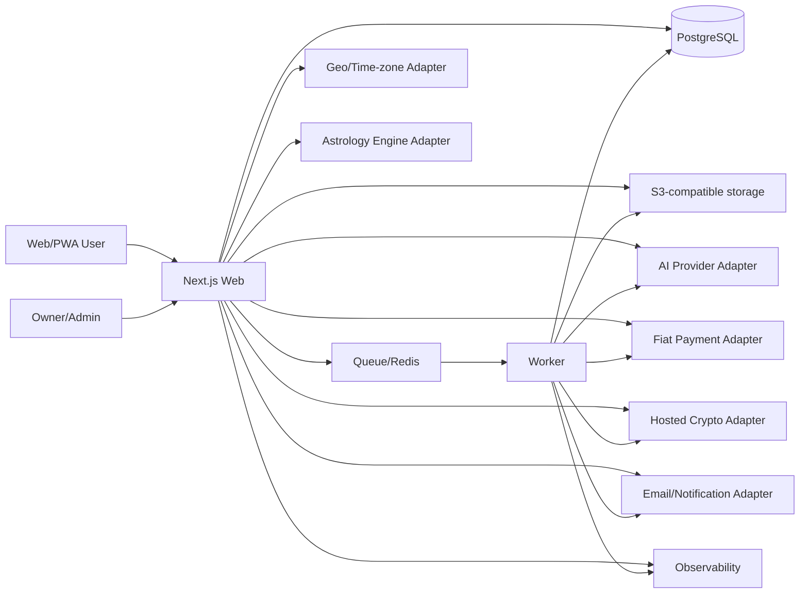
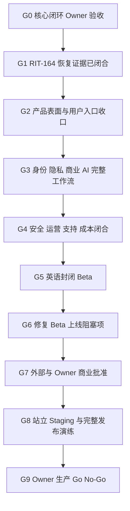

# RITUVIA — Complete Codex Build Manual

> Compiled repository snapshot generated 2026-08-03. The individual files in the repository are canonical; this single file is a convenient reading and handoff artifact.

## Product definition

**RITUVIA is a global platform for symbolic self-reflection, personal ritual, and a private digital sanctuary.**

Core loop: **Question → Interpretation → Intention → Ritual → Journal → Revisit**.

Working brand status: **preferred candidate, not legally cleared**. See `docs/17_BRAND_NAMING.md` and `docs/19_NAME_CLEARANCE_WORKSHEET.md`.

## How to use this compilation

1. Put the full repository package—not only this compilation—at the root of a private Git repository.
2. Open the repository in Codex and submit `CODEX_MASTER_PROMPT.md`.
3. Codex selects the one current executable backlog task, completes one verified task per run, and updates persistent project memory.
4. Keep production deployment, payments, legal/policy, destructive data actions, budgets, and brand commitment behind owner approval.

## Included files

- `.gitignore`
- `.gitattributes`
- `README.md`
- `MANIFEST.md`
- `OWNER_OPERATING_GUIDE_ZH.md`
- `CODEX_MASTER_PROMPT.md`
- `AGENTS.md`
- `PROJECT_STATUS.md`
- `ENGINEERING_BASELINE.md`
- `DECISIONS.md`
- `ROADMAP.md`
- `BACKLOG.md`
- `CONTRIBUTING.md`
- `records/README.md`
- `records/INDEX.md`
- `docs/00_PROJECT_CHARTER.md`
- `docs/01_PRODUCT_REQUIREMENTS.md`
- `docs/02_USER_EXPERIENCE.md`
- `docs/03_DESIGN_SYSTEM.md`
- `docs/04_ARCHITECTURE.md`
- `docs/05_DATA_MODEL.md`
- `docs/06_AI_INTERPRETATION_SAFETY.md`
- `docs/07_PAYMENTS_COMPLIANCE.md`
- `docs/08_I18N_SEO_GEO_GROWTH.md`
- `docs/09_ANALYTICS_EXPERIMENTS.md`
- `docs/10_SECURITY_PRIVACY_RELIABILITY.md`
- `docs/11_AUTONOMOUS_OPERATIONS.md`
- `docs/12_CONTENT_GOVERNANCE.md`
- `docs/13_API_CONTRACTS.md`
- `docs/14_TEST_STRATEGY.md`
- `docs/15_LAUNCH_RUNBOOK.md`
- `docs/16_COST_GUARDRAILS.md`
- `docs/17_BRAND_NAMING.md`
- `docs/18_REFERENCES.md`
- `docs/19_NAME_CLEARANCE_WORKSHEET.md`
- `docs/20_AI_GROWTH_ENGINE.md`
- `docs/21_ENVIRONMENT_CONTRACT.md`
- `docs/22_BACKUP_RECOVERY.md`
- `docs/24_OWNER_PRODUCT_CAPABILITY_MAP_ZH.md`
- `docs/25_PRODUCT_ENGINEERING_RUNBOOK.md`
- `docs/26_PRE_LAUNCH_EXECUTION_PLAN_ZH.md`
- `docs/27_DETAILED_PRODUCT_USER_MANUAL_ZH.md`
- `docs/README.md`
- `apps/admin/AGENTS.md`
- `apps/web/AGENTS.md`
- `apps/worker/AGENTS.md`
- `packages/ai/AGENTS.md`
- `packages/country-policy/AGENTS.md`
- `packages/db/AGENTS.md`
- `packages/db/MIGRATIONS.md`
- `packages/divination/AGENTS.md`
- `packages/domain/AGENTS.md`
- `packages/i18n/AGENTS.md`
- `packages/payments/AGENTS.md`
- `packages/ui/AGENTS.md`
- `content/AGENTS.md`
- `.codex/config.toml`
- `.codex/agents/ai-safety.toml`
- `.codex/agents/architect.toml`
- `.codex/agents/backend.toml`
- `.codex/agents/frontend.toml`
- `.codex/agents/growth-seo.toml`
- `.codex/agents/localization.toml`
- `.codex/agents/operations.toml`
- `.codex/agents/payments-risk.toml`
- `.codex/agents/product.toml`
- `.codex/agents/qa-security.toml`
- `.codex/rules/default.rules`
- `automation/README.md`
- `automation/prompts/continue-next-task.md`
- `automation/prompts/daily-maintenance.md`
- `automation/prompts/monthly-risk-audit.md`
- `automation/prompts/release-readiness.md`
- `automation/prompts/weekly-product-review.md`
- `automation/schemas/task-result.schema.json`
- `automation/examples/task-result.example.json`
- `.github/codex/prompts/localization.md`
- `.github/codex/prompts/next-task.md`
- `.github/codex/prompts/release.md`
- `.github/codex/prompts/review.md`
- `.github/codex/prompts/security.md`
- `.github/codex/prompts/seo.md`
- `.github/workflows/README.md`
- `.github/workflows/ci.yml`
- `.github/codex/workflow-examples/codex-nightly.yml`
- `.github/codex/workflow-examples/codex-review.yml`
- `templates/ADR_TEMPLATE.md`
- `templates/EXPERIMENT_TEMPLATE.md`
- `templates/INCIDENT_TEMPLATE.md`
- `templates/RELEASE_CHECKLIST_TEMPLATE.md`
- `templates/TASK_TEMPLATE.md`
- `templates/VENDOR_APPROVAL_TEMPLATE.md`
- `scripts/README.md`
- `scripts/build_checksums.py`
- `scripts/build_compiled_manual.py`
- `scripts/build_record_index.py`
- `scripts/generated_evidence_io.py`
- `scripts/sync_generated_evidence.py`
- `scripts/validate_instruction_pack.py`
- `reference/README.md`

## Linked canonical files not duplicated here

- `QA_REPORT.md`
- `docs/23_PRODUCT_FUNCTIONS_AND_USER_GUIDE_ZH.md`

---

# File: `.gitignore`

```gitignore
.DS_Store

.env
.env.*
!.env.example

node_modules/
.pnpm-store/
.next/
.turbo/
coverage/
dist/
playwright-report/
test-results/
.playwright-cli/
/output/playwright/
.rituvia-config-boundary-*/
.local/
packages/db/src/generated/prisma/
packages/astrology-engine-native/.native-cache/
.release-cache/

__pycache__/
*.py[cod]
*.tsbuildinfo
*.log
```

---

# File: `.gitattributes`

* text=auto eol=lf

---

# File: `README.md`

# RITUVIA Codex Build System

> Working brand: **RITUVIA**
>
> Product category: a global platform for symbolic self-reflection, personal ritual, and a private digital sanctuary.
>
> Core loop: **Question → Interpretation → Intention → Ritual → Journal → Revisit**.

This repository pack is the operating system for building RITUVIA with Codex as a one-person company. It is not merely a one-shot prompt. It combines product doctrine, architecture, safety rules, a sequenced roadmap, a live backlog, specialized Codex roles, command rules, review prompts, and operating cadences.

The canonical source repository is
[github.com/CPTM511/RITUVIA](https://github.com/CPTM511/RITUVIA). It is publicly available under
GNU AGPLv3. Public source availability does not mean the product is deployed, publicly launched,
approved for production payments/providers, or authorized to process customer data.

## What Codex should build

An English-first, Web/PWA product for global users that offers:

1. Tarot, Western astrology, and numerology.
2. A private digital sanctuary with free and paid virtual ritual objects.
3. Intention setting, private journaling, reminders, and revisit loops.
4. Direct purchases and subscriptions in fiat, plus third-party hosted cryptocurrency checkout where lawfully supported.
5. Country-aware availability, pricing, disclaimers, payment routing, and data controls.
6. AI-generated interpretations grounded in deterministic calculations and curated cultural content.
7. SEO, generative-engine discoverability, localization, analytics, administration, support, and mostly automated operations.

## Start here

1. Read `AGENTS.md`.
2. Read `CODEX_MASTER_PROMPT.md` and submit it to Codex for the first implementation session.
3. Treat `PROJECT_STATUS.md`, `BACKLOG.md`, `ROADMAP.md`, and `DECISIONS.md` as persistent operational memory.
4. Read `ENGINEERING_BASELINE.md` for the observed repository state and exact M0 execution plan.
5. Follow `CONTRIBUTING.md` and the typed durable-record policy in `records/README.md`.
6. Use the documents under `docs/` as canonical specifications.
7. Keep the legacy strategy and visual prototype under `reference/` as evidence and inspiration, not as production code.
8. Use `automation/prompts/continue-next-task.md` for subsequent runs and the `.github/codex/workflow-examples/*.yml` files only after security review and an intentional move into `.github/workflows`.
9. Use `docs/21_ENVIRONMENT_CONTRACT.md` as the canonical environment-isolation and deployment-gate contract; it does not claim that external infrastructure exists.
10. Use `docs/22_BACKUP_RECOVERY.md` as the canonical PostgreSQL backup, isolated-restore, RPO/RTO, evidence, and production-gate runbook.
11. Use `docs/26_PRE_LAUNCH_EXECUTION_PLAN_ZH.md` for the evidence-gated path from the current state to protected beta and Owner production go/no-go.
12. Use `docs/27_DETAILED_PRODUCT_USER_MANUAL_ZH.md` for exact routes, visible control locations, workflows, implementation truth, privacy, and recovery behavior.

## Local development

The repository contract is Node.js `26.5.1` (see `.node-version`) and pnpm `11.13.1`. Corepack is not required; from the repository root, use npm's package runner to invoke the exact package-manager version:

```bash
npm exec --yes --package=pnpm@11.13.1 -- pnpm install --frozen-lockfile
npm exec --yes --package=pnpm@11.13.1 -- pnpm check
```

The root quality gate first verifies the active CI contract, architecture, durable records, immutable migration manifest, generated evidence, and current-tree secret policy, then checks formatting, ESLint, strict TypeScript, non-empty Vitest tests, configuration-boundary integration, a real isolated PostgreSQL migration/seed/reset/restore suite, and production builds. The active MVP now also includes the `packages/country-policy` and `packages/payments` provider boundaries alongside the existing Web, Worker, configuration, database, domain, divination, i18n, observability, AI, and UI workspaces.

### Continuous integration

`.github/workflows/ci.yml` is active and contains separate quality, PostgreSQL integration, and
security jobs. It uses only read access, GitHub-hosted Ubuntu 24.04 runners, immutable action SHAs, a
digest-pinned PostgreSQL 17 service, synthetic data, and no repository secrets or deployment
environment. See `.github/workflows/README.md` for the enforced workflow contract and owner-side
required-check setup. Public `main` requires all three jobs, pull requests, linear history, resolved
conversations, and administrator enforcement while denying force pushes and deletion. Codex
workflow examples live outside the Actions workflow directory and remain inert.

### Local environment configuration

The repository root is the shared environment-file location for both Web and Worker processes. Start with the optional baseline file:

```bash
cp .env.example .env
```

Every example assignment is intentionally empty. Local development uses typed working-brand defaults when brand overrides are omitted. The database lifecycle commands derive the attested local URL themselves; application processes still receive `DATABASE_URL` explicitly through the process environment or an ignored environment file. Web and Worker both use the pinned `@next/env` loader against the repository root with the same development/production mode and standard Next.js file precedence. Process or secret-manager values take precedence, and every `.env` variant must remain uncommitted.

The client receives only an explicit validated brand projection. `NEXT_PUBLIC_*` variables are rejected so a new public variable cannot silently enter a browser bundle. `APP_ENV=production` requires the complete validated brand projection, an HTTPS canonical origin, and every enabled provider secret; production secrets must be supplied by the environment or a secret manager rather than a file in Git.

### Local commercial MVP

Start the attested local PostgreSQL database, generate a private local-only configuration, and run
the English MVP:

```bash
npm exec --yes --package=pnpm@11.13.1 -- pnpm db:setup
npm exec --yes --package=pnpm@11.13.1 -- pnpm mvp:local:configure
npm exec --yes --package=pnpm@11.13.1 -- pnpm --filter @rituvia/web exec next dev --hostname 127.0.0.1 --port 4175
```

The repository-root `.env.local` is ignored, created with mode `0600`, and contains independent random local
keys. The configurator refuses to replace it so encrypted local account and journal data are not
silently orphaned. If port `55432` is occupied, set the same `RITUVIA_LOCAL_POSTGRES_PORT` value for
the database and configuration commands. Private database-backed capabilities remain safe-off
without the validated database; public information delivery no longer depends on a rollout flag.

Opening the local origin returns a permanent redirect to the only active, reviewed locale at `/en`.
The finite public surface remains `/en`, `/en/methodology`, `/en/safety`, and `/en/privacy`; the
private noindex product routes add `/en/sanctuary`, `/en/sign-in`,
`/en/account`, and exact checkout-return paths. The privacy route is a product-design overview, not
a legal privacy policy. Unsupported or non-canonical locale/page segments return 404 rather than
silently falling back or generating caches. Public information pages remain server rendered and
readable without JavaScript; transactional product flows require JavaScript and expose explicit
loading, retry, error, and offline states. Local, preview, and staging metadata is `noindex`; a
production environment must provide the approved HTTPS canonical origin before it may emit
indexable metadata. The configuration-boundary integration harness reproducibly verifies public
delivery and independent private-feature safe-off behavior without documenting an activation
bypass or ad hoc SQL. The local MVP
implements anonymous readings, account sessions, age-gated hosted checkout, entitlements, intention
and ritual completion, and encrypted private journaling; it does not claim that provider onboarding,
legal terms, or a public deployment are approved.

`/robots.txt` and `/sitemap.xml` are generated from the same typed four-page inventory. Local,
preview, and staging robots disallow the entire site and publish no sitemap. Production publishes
the four exact, end-anchored document allows, the build-audited `/_next/static/` and icon resources,
and a four-URL sitemap only while the reviewed inventory is current. Missing or stale inventory
returns disallow-all robots and no sitemap. Query, private, unsupported, bare/spoofed RSC, and
unreviewed Next-internal requests fail closed. Served RSC responses are explicit `noindex` and
`private, no-store`; Next-owned direct `*.rsc` errors are accepted only as `text/x-component` 404s
that remain private, non-cacheable, and free of sensitive canaries. Structured data remains deferred
to RIT-114 rather than being published before its visible-content and rich-result contract exists.

The production build audits all four canonical pages and enforces compressed budgets for localized
HTML, initial CSS/JavaScript, and the SVG icon while rejecting remote script/style/font/media
resources. Browser QA remains required for every future behavior change; the public pages and local
MVP loop are covered by responsive, keyboard/focus, reduced-motion, console, local-network, and
end-to-end purchase/entitlement checks.

After a fresh production build, run the committed accessibility/pseudolocale browser gate with the
pinned Chromium headless shell:

```bash
npm exec --yes --package=pnpm@11.13.1 -- pnpm exec playwright install --only-shell chromium
npm exec --yes --package=pnpm@11.13.1 -- pnpm build
npm exec --yes --package=pnpm@11.13.1 -- pnpm test:accessibility
```

The gate serves only audited build artifacts on loopback and covers all four English routes with
blocking axe scans, complete forward/reverse keyboard focus, 44px targets, 40% test-only text
expansion, desktop/mobile RTL scaffolding, dark/reduced-motion/no-JavaScript states, a persistent
online/offline/online connection-state advisory announcement, and local-only requests. `en-XA` and `ar-XB` exist only as
in-browser test transforms; they are not supported, published, canonical, crawlable, or added to
the production locale catalog. CI performs the build immediately before this smoke and installs
Linux browser dependencies with `--with-deps`.

### Shared UI foundation

`@rituvia/ui` provides the private semantic-token stylesheet and native-first React primitives used
by Web and future applications. Import components from `@rituvia/ui` and import
`@rituvia/ui/styles` once at the application root before application-specific CSS. The package owns
focus, disabled/loading/invalid/selection state presentation, system/light/dark tokens, reduced
motion, forced colors, logical-direction behavior, and closed local-action/control-value contracts;
the consuming application still owns every localized label, route, validation rule, mutation, and
idempotency boundary. See `packages/ui/README.md` for the exact catalog and review matrix.

The same package provides presentation-only empty, error, offline, and provider-unavailable page
patterns. Web owns their localized English copy, state classification, announcement/focus timing,
and caller-controlled retry action. The public shell truthfully consumes empty, advisory offline,
and route-error states; provider-unavailable remains a dependency-neutral synthetic pattern until a
real adapter and typed safe classifier exist. This does not add PWA caching, synchronization,
provider health, or an automatic retry capability.

### Local PostgreSQL and Prisma

The verified local database path requires PostgreSQL 17 or 18 command-line tools from one installation. This host uses Homebrew PostgreSQL 17.10. Standard Homebrew versioned locations are detected automatically; otherwise set `RITUVIA_POSTGRES_BIN` to the absolute directory containing all required PostgreSQL tools. Docker is not installed, so no container-reproducibility claim is made; RIT-004 owns the separate CI runtime.

After the frozen install, create or reuse the repository-owned cluster, apply committed migrations, and load the deterministic synthetic seed:

```bash
APP_ENV=local npm exec --yes --package=pnpm@11.13.1 -- pnpm db:setup
```

The cluster lives under ignored `.local/postgres/`, generates random mode-0600 credentials, uses SCRAM authentication and data checksums, and binds only `127.0.0.1:55432`. The application role is not a superuser and cannot create roles or databases. Inspect its state or obtain the local application URL only while it is running:

```bash
npm exec --yes --package=pnpm@11.13.1 -- pnpm db:status
npm exec --yes --package=pnpm@11.13.1 -- pnpm db:url
```

`db:url` prints only the path to an ignored mode-0600 URL file. Use `pnpm db:url -- --reveal` only when explicit terminal disclosure is necessary to supply a local application process; do not paste the URL into committed files, logs, tickets, or remote environments.

Reset is local and destructive, requires `APP_ENV=local`, and accepts only the exact fixed development database after a live cluster/data-directory/system-identifier attestation:

```bash
APP_ENV=local npm exec --yes --package=pnpm@11.13.1 -- pnpm db:reset -- --confirm=reset:rituvia_local@127.0.0.1:55432
npm exec --yes --package=pnpm@11.13.1 -- pnpm db:stop
```

Do not use `prisma migrate reset`, `prisma db push`, a remote `DATABASE_URL`, or the local seed against preview, staging, or production. Migration compatibility, field classification, rollback, and recovery boundaries are recorded in `packages/db/MIGRATIONS.md`.

## Canonical document map

| Concern                                  | Canonical file                            |
| ---------------------------------------- | ----------------------------------------- |
| Product mission and boundaries           | `docs/00_PROJECT_CHARTER.md`              |
| Complete feature requirements            | `docs/01_PRODUCT_REQUIREMENTS.md`         |
| User journeys and UX behavior            | `docs/02_USER_EXPERIENCE.md`              |
| Visual system and component rules        | `docs/03_DESIGN_SYSTEM.md`                |
| Software architecture                    | `docs/04_ARCHITECTURE.md`                 |
| Data model and classification            | `docs/05_DATA_MODEL.md`                   |
| AI interpretation and safety             | `docs/06_AI_INTERPRETATION_SAFETY.md`     |
| Payments, country policy, and compliance | `docs/07_PAYMENTS_COMPLIANCE.md`          |
| Localization, SEO, GEO, and growth       | `docs/08_I18N_SEO_GEO_GROWTH.md`          |
| Metrics and experiments                  | `docs/09_ANALYTICS_EXPERIMENTS.md`        |
| Security, privacy, and reliability       | `docs/10_SECURITY_PRIVACY_RELIABILITY.md` |
| One-person autonomous operations         | `docs/11_AUTONOMOUS_OPERATIONS.md`        |
| Content and cultural governance          | `docs/12_CONTENT_GOVERNANCE.md`           |
| API and integration contracts            | `docs/13_API_CONTRACTS.md`                |
| Test strategy                            | `docs/14_TEST_STRATEGY.md`                |
| Launch and rollback                      | `docs/15_LAUNCH_RUNBOOK.md`               |
| Cost controls                            | `docs/16_COST_GUARDRAILS.md`              |
| Brand decision                           | `docs/17_BRAND_NAMING.md`                 |
| Sources and verification                 | `docs/18_REFERENCES.md`                   |
| Name-clearance execution worksheet       | `docs/19_NAME_CLEARANCE_WORKSHEET.md`     |
| AI-native marketing and distribution     | `docs/20_AI_GROWTH_ENGINE.md`             |

## Current status

Current task state, dependencies, and executable-next selection live only in `BACKLOG.md`; current
capabilities, blockers, environments, and quality totals live only in `PROJECT_STATUS.md`. This
orientation file intentionally does not copy their mutable snapshot.

## Non-negotiable product principle

RITUVIA may help users reflect, create meaning, and perform symbolic rituals. It must not claim to know objective future events, guarantee outcomes, exploit fear, induce dependency, replace professional medical/legal/financial care, or sell stronger spiritual efficacy to higher-paying users.

---

# File: `MANIFEST.md`

# RITUVIA Codex Build System Manifest

**Generated:** 2026-07-17

**Purpose:** a repository-ready instruction and operating package for building RITUVIA as an AI-leveraged one-person company.

## Essential entry points

- `README.md` — package orientation and specification map.
- `OWNER_OPERATING_GUIDE_ZH.md` — Chinese owner operating manual.
- `CODEX_MASTER_PROMPT.md` — first-session and continuation prompts.
- `AGENTS.md` — top-level binding project instructions.
- `BACKLOG.md` — 128 sequenced tasks, including eight explicit owner gates.
- `ROADMAP.md` — 16 milestones from repository foundation through expansion.
- `PROJECT_STATUS.md` — current truth and blockers.
- `ENGINEERING_BASELINE.md` — observed repository reality, setup gaps, and exact M0 plan.
- `QA_REPORT.md` — local consistency checks, passed assertions, and validation limits.
- `DECISIONS.md` — persistent decision register.
- `CONTRIBUTING.md` — one-task workflow, authority boundaries, and generated-evidence order.
- `records/README.md` and generated `records/INDEX.md` — typed durable-record policy and compact discovery index.
- `RITUVIA_CODEX_BUILD_MANUAL.md` — generated reading/handoff compilation; individual files remain canonical.
- `checksums.sha256` — SHA-256 coverage for regular files represented in the Git index, except the checksum file itself.

## Canonical specifications

- `docs/00_PROJECT_CHARTER.md`
- `docs/01_PRODUCT_REQUIREMENTS.md`
- `docs/02_USER_EXPERIENCE.md`
- `docs/03_DESIGN_SYSTEM.md`
- `docs/04_ARCHITECTURE.md`
- `docs/05_DATA_MODEL.md`
- `docs/06_AI_INTERPRETATION_SAFETY.md`
- `docs/07_PAYMENTS_COMPLIANCE.md`
- `docs/08_I18N_SEO_GEO_GROWTH.md`
- `docs/09_ANALYTICS_EXPERIMENTS.md`
- `docs/10_SECURITY_PRIVACY_RELIABILITY.md`
- `docs/11_AUTONOMOUS_OPERATIONS.md`
- `docs/12_CONTENT_GOVERNANCE.md`
- `docs/13_API_CONTRACTS.md`
- `docs/14_TEST_STRATEGY.md`
- `docs/15_LAUNCH_RUNBOOK.md`
- `docs/16_COST_GUARDRAILS.md`
- `docs/17_BRAND_NAMING.md`
- `docs/18_REFERENCES.md`
- `docs/19_NAME_CLEARANCE_WORKSHEET.md`
- `docs/20_AI_GROWTH_ENGINE.md`

## Codex configuration

- `.codex/config.toml` — model, approval, sandbox, multi-agent, and role configuration.
- `.codex/agents/*.toml` — 10 specialized read/review roles.
- `.codex/rules/default.rules` — prompts/blocks for remote, destructive, deploy, database, and publishing commands.
- Root plus nested `AGENTS.md` — global and area-specific engineering contracts.

## Persistent nested instructions

- `apps/web/AGENTS.md`
- `apps/worker/AGENTS.md`
- `apps/admin/AGENTS.md`
- `packages/domain/AGENTS.md`
- `packages/db/AGENTS.md`
- `packages/ui/AGENTS.md`
- `packages/divination/AGENTS.md`
- `packages/ai/AGENTS.md`
- `packages/payments/AGENTS.md`
- `packages/i18n/AGENTS.md`
- `packages/country-policy/AGENTS.md`
- `content/AGENTS.md`

## Automation and review

- `automation/prompts/continue-next-task.md`
- `automation/prompts/daily-maintenance.md`
- `automation/prompts/weekly-product-review.md`
- `automation/prompts/monthly-risk-audit.md`
- `automation/prompts/release-readiness.md`
- `automation/schemas/task-result.schema.json`
- `automation/examples/task-result.example.json`
- `.github/codex/prompts/*.md`
- `.github/workflows/ci.yml` — active least-privilege quality, database, dependency, and security gates.
- `.github/codex/workflow-examples/*.yml` — intentionally inactive outside the Actions workflow directory until reviewed, moved, and secured.

## Local validation

- `scripts/build_compiled_manual.py` — deterministically rebuilds/checks the handoff compilation.
- `scripts/build_record_index.py` — validates typed records and deterministically renders their compact index.
- `scripts/sync_generated_evidence.py` — safely renders index, manual, then Git-index-only checksums.
- `scripts/build_checksums.py` — fail-closed hashing of regular Git-indexed repository artifacts.
- `scripts/verify-records.ts` — validates record graphs and contextual task-result semantics.
- `scripts/validate_instruction_pack.py` — verifies syntax, dependency graph, instruction limits, links, generated manual, checksums, and package invariants.
- `scripts/web-shell-build-policy.mjs` — enforces bounded compressed assets and exact route artifacts across every finite public page and rejects unreviewed remote resources.
- `scripts/copy-ui-styles.mjs` — copies the reviewed UI stylesheet into the package build without runtime generation.
- `scripts/verify-workspace-build.mjs` — verifies workspace exports, UI stylesheet parity, build artifacts, and the Web shell build policy.

## Active UI foundation

- `packages/ui/src/contracts.ts` — bounded local-action, control-identifier, and closed theme values.
- `packages/ui/src/primitives.tsx` — native-first action, field, selection, alert, and loading primitives.
- `packages/ui/src/styles.css` — semantic light/dark/system tokens, focus/state, motion, forced-color, and RTL behavior.
- `packages/ui/test/` and `packages/ui/examples/` — server-rendered semantic, contrast, state, long-text, writing-system, and narrow-reflow evidence.
- `packages/ui/README.md` and `records/decisions/D-024.md` — usage boundaries and the durable architecture decision.

## Active Web foundation

- `apps/web/app/[locale]/page.tsx` and `apps/web/app/[locale]/[page]/page.tsx` — exact locale/page allowlists, localized metadata, and server-rendered public entries.
- `apps/web/app/_components/` — shared semantic public frame plus home and information-page content.
- `apps/web/app/_i18n/` — typed English source messages, pure finite-route contract, locale paths/direction, and per-page canonical metadata.
- `apps/web/proxy.ts` — server-side safe-off enforcement for every public-shell HTML and RSC representation.
- `packages/ui/src/styles.css`, `apps/web/app/styles.css`, and `apps/web/app/icon.svg` — shared semantic tokens, responsive shell presentation, and local icon.
- `apps/web/test/` plus `tests/web-shell*.test.ts` — activation, finite route, message, metadata, semantic HTML, source boundary, and build/resource-budget contracts.

## Reusable records

- `records/tasks/RIT-NNN.md`
- `records/decisions/D-NNN.md`
- `records/incidents/INC-NNN.md`
- `records/experiments/EXP-NNN.md`
- `templates/ADR_TEMPLATE.md`
- `templates/TASK_TEMPLATE.md`
- `templates/INCIDENT_TEMPLATE.md`
- `templates/EXPERIMENT_TEMPLATE.md`
- `templates/RELEASE_CHECKLIST_TEMPLATE.md`
- `templates/VENDOR_APPROVAL_TEMPLATE.md`

## Retained prior work

- `reference/lumora_business_plan_zh.html`
- `reference/lumora_interactive_prototype.html`

`LUMORA` is historical only. Current working brand is `RITUVIA`, pending formal legal/domain/linguistic clearance.

---

# File: `OWNER_OPERATING_GUIDE_ZH.md`

# RITUVIA 单人公司：Codex 操作手册

## 一、这套文件是什么

这不是一个“让 Codex 一次性生成整站”的长 Prompt，而是一套长期运行的项目操作系统：

- `AGENTS.md`：Codex 的最高项目规则。
- `CODEX_MASTER_PROMPT.md`：首次启动指令。
- `BACKLOG.md`：持续工作的任务队列。
- `PROJECT_STATUS.md`：项目当前事实。
- `DECISIONS.md`：不可丢失的决策记录。
- `ROADMAP.md`：里程碑顺序和上线门槛。
- `docs/`：完整产品、架构、支付、AI、安全、增长和运营规范。
- `.codex/agents/`：不同专业角色。
- `.codex/rules/`：阻止危险命令。
- `automation/` 与 `.github/`：夜间、每周、PR 审查等自动化模板。

Codex 每次只完成一个闭环任务，完成后更新项目记忆；下一次继续从最新状态工作。这样比要求它一次写完所有代码更可靠。

## 二、首次使用

1. 新建一个私有 Git 仓库。
2. 把本文件包完整解压到仓库根目录。
3. 保留 `reference/` 中原有商业方案和原型。
4. 执行 `git init`、首次提交，并在 Codex 中打开该仓库。
5. 将项目设为可信任项目，使 `.codex/config.toml`、规则和角色配置生效。
6. 把 `CODEX_MASTER_PROMPT.md` 中的主 Prompt 交给 Codex。
7. Codex 应先审计仓库，再从 `BACKLOG.md` 的 `RIT-000` 开始，而不是只返回计划。

## 三、日常使用

每次新会话只需要使用以下继续指令：

> 继续构建 RITUVIA。读取分层 AGENTS.md，核对 PROJECT_STATUS.md、BACKLOG.md 与仓库现实，选择依赖已满足且优先级最高的 Ready 任务，完成一个可验证的生产级闭环。使用子代理做独立审查，但只保留一个主写入者；运行全部适用质量门槛；更新项目记忆；遇到人工审批门槛立即停止执行该动作。

合并前，再运行 `CODEX_MASTER_PROMPT.md` 中的 Review Prompt 或 Codex 的代码审查流程。

## 四、持续工作的正确方式

Codex 不能仅靠一个聊天会话“永久后台运行”。持续性来自四层机制：

1. **持久化状态**：Backlog、Status、Decisions、测试和 Git 历史。
2. **固定执行循环**：每次只取最高优先级、依赖已满足的一项任务。
3. **事件触发**：每个 PR 自动审查；合并后自动测试。
4. **定时触发**：夜间维护、每周产品复盘、每月风险审计。

`automation/prompts/` 和 `.github/workflows/` 已给出模板。初期先由你手动运行；稳定后再接 GitHub Actions 或安全的自托管调度器。

## 五、你每天只需要做什么

建议每天 10–20 分钟完成以下四件事：

1. 看 Codex 最终报告和测试结果。
2. 审批或拒绝它提出的高风险决策。
3. 检查当前最高优先级是否符合商业目标。
4. 合并经过审查的 PR，或要求 Codex修正。

不要逐行管理所有代码；你管理的是目标、边界、审批和现金。

## 六、必须由你审批的事项

以下事项不得无人值守自动执行：

- 正式上线、生产部署、DNS 或域名变更。
- 支付商户申请、业务类别描述、价格、税、退款和账单描述符。
- 新国家、新语言正式开放、新币种或加密资产。
- 法律条款、隐私政策、敏感数据保留期限。
- 生产数据库破坏性迁移、删除备份、密钥轮换。
- 生产 AI 模型切换、降低安全规则、改变危机响应。
- 自动广告花费、大规模外发、网红或联盟合同。
- 高额退款、欺诈争议或任何监管事件。

Codex 可以准备材料、代码、测试和建议，但不得替你执行这些决定。

## 七、建议的经营节奏

### 每日

- 处理一个最高优先级工程任务。
- 检查失败任务、成本异常和支付事件。
- 对新生成内容进行抽样质量审查。

### 每周

- 复盘核心闭环：阅读 → 意图 → 仪式 → 日志 → 回访。
- 查看激活、D7 留存、付费、退款、AI 安全与内容投诉。
- 只批准 1–2 个有明确假设的实验。
- 更新 Backlog 优先级。

### 每月

- 国家与支付政策复核。
- 安全威胁模型和依赖风险复核。
- 数据备份恢复演练。
- 多语言质量、SEO/GEO 内容和文化完整性审计。
- 单位经济与 AI/基础设施成本审计。

## 八、品牌结论

首选工作品牌：**RITUVIA**（建议读音：rih-TOO-vee-uh）。

命名逻辑：由 `ritual` 与 `via` 组合，表达“通过仪式回到自己的一条路径”。推荐英文标语：

- **Insight. Intention. Ritual. Return.**
- **A sanctuary for insight and ritual.**

公开网络初筛没有发现明显完全同名结果，但这不等于商标可注册，也不等于域名仍可购买。在投入品牌设计和广告前，必须完成：

1. WIPO、USPTO、EUIPO 以及首发国家的专业商标近似检索。
2. 重点类别和关联类别的法律判断。
3. `.com`、国家域名、常见拼写和社交账号的即时注册核验。
4. 语言学审查，确认主要语言中没有负面、冒犯或难发音含义。

代码中禁止硬编码品牌名；品牌、域名、发件人、Logo、法律主体和社交账号必须来自统一配置，因此未来改名不需要大规模重构。

## 九、第一阶段你需要亲自完成的外部事项

- 注册公司和税务体系。
- 购买域名和提交商标申请。
- 找支付服务商进行书面预审，不要先完成产品再申请。
- 确定 Swiss Ephemeris 或其他占星计算组件的商业许可路径。
- 聘请合资格律师审核首发市场的隐私、消费者保护、数字商品、订阅和占卜类业务规则。
- 建立至少一个主支付通道和一个备用通道。

## 十、判断项目是否在正确前进

不要只看“做了多少页面”。优先看：

- 新用户是否能在三分钟内完成第一次有意义的体验。
- 有多少用户从解读进入意图、仪式和日志。
- 七天后用户是否回来复盘。
- 用户是否认为内容有帮助但没有被操纵。
- 支付成功率、退款、拒付和投诉是否健康。
- AI 内容是否稳定、可追溯、没有确定性和高风险结论。
- 单位收入是否能覆盖支付、AI、基础设施、内容和退款成本。

这套系统把日常执行尽可能交给 AI，但你仍然是产品价值观、风险、资本和最终发布的负责人。

---

# File: `CODEX_MASTER_PROMPT.md`

# RITUVIA — Codex Master Build Prompt

Copy the prompt below into the first Codex session after this pack is placed at the root of a private Git repository.

---

You are the founding product and engineering system for RITUVIA. Build the product as a production-quality, English-first global Web/PWA while strictly following the repository's layered `AGENTS.md` instructions and canonical documents.

## Required first actions

1. Read root `AGENTS.md` in full.
2. Read `README.md`, `PROJECT_STATUS.md`, `BACKLOG.md`, `ROADMAP.md`, and `DECISIONS.md`.
3. Read all specifications under `docs/`, but use targeted summaries for later context rather than repeatedly loading everything.
4. Inspect the repository, Git history, current branch, uncommitted changes, toolchain, existing code, tests, and environment examples.
5. Compare repository reality with the status and backlog. Correct stale status before proceeding.
6. Use specialized subagents for parallel, read-heavy reviews of product scope, architecture, security, AI safety, payments, localization/SEO, and testing. Do not let multiple agents make overlapping writes.

## Goal

Create RITUVIA: a global platform for symbolic self-reflection, personal ritual, and a private digital sanctuary. The product loop is:

**Question → Interpretation → Intention → Ritual → Journal → Revisit**.

MVP capabilities are:

- Anonymous-first tarot, Western astrology, and numerology.
- Deterministic calculations separated from AI explanation.
- AI interpretations grounded in curated, versioned content and returned through typed structured output.
- Free and paid virtual ritual objects, with free ritual access always available.
- Private intentions, journals, history, reminders, and revisit loops.
- Accounts, subscriptions, direct digital-goods purchases, refunds, entitlements, fiat checkout, and optional hosted non-custodial crypto checkout.
- Country Policy Engine controlling products, payments, disclaimers, age rules, languages, and availability.
- English launch with an architecture ready for Spanish, Brazilian Portuguese, French, German, Japanese, Korean, Simplified Chinese, Traditional Chinese, Hindi, Arabic/RTL, and Indonesian.
- Server-rendered SEO/GEO pages, structured data, content governance, share cards, analytics, experiments, administration, support, observability, security, privacy export/deletion, and automated operations.

## Working mode

Do not attempt the entire product in one pass. Work milestone by milestone and one complete backlog item at a time.

- If no production code exists, select `RIT-000` and establish Milestone 0.
- If code exists, select the highest-priority `Ready` item whose dependencies are complete.
- Before implementation, state the intended outcome, acceptance criteria, architecture impact, test plan, risks, and files likely to change.
- Implement a small vertical slice that is deployable behind a feature flag when appropriate.
- Run tests and inspect the actual result. Never claim a behavior exists solely because code was written.
- Update `BACKLOG.md`, `PROJECT_STATUS.md`, and `DECISIONS.md` as persistent memory.
- Leave the repository in a better, runnable state; do not create sprawling unfinished scaffolding.

## Technical default

Unless an accepted decision says otherwise:

- TypeScript monorepo with pnpm and Turborepo.
- Next.js App Router Web/PWA, a separate worker entry point, and shared packages.
- PostgreSQL system of record with Prisma migrations.
- Managed Redis-compatible cache/queue only for measured needs.
- S3-compatible object storage.
- Provider abstractions for auth, AI, email, analytics, fiat payments, crypto checkout, geocoding/time zone, and astrology calculation licensing.
- Strict TypeScript, schema validation at every boundary, server-only secrets, idempotent jobs/webhooks, feature flags, OpenTelemetry-compatible instrumentation, and CI quality gates.
- Current stable supported dependency versions at implementation time; lock all versions and automate update review.

## Design default

Create a calm, premium, trustworthy sanctuary—not a casino, horror aesthetic, or fortune-teller caricature. Use the design principles and tokens in `docs/03_DESIGN_SYSTEM.md`. The experience must be responsive, keyboard accessible, screen-reader usable, motion-sensitive, locale-safe, and fast on average mobile networks.

The legacy prototype under `reference/` is a conceptual visual target. Preserve its strongest ideas while improving information architecture, accessibility, mobile behavior, trust, and production readiness. Do not copy its implementation as production code.

## Non-negotiable safety and business boundaries

Never build guaranteed outcomes, fear-based upsells, curse removal, medical/legal/financial determinations, gambling/stored-value/token mechanics, public prayer walls, biometric divination, or a live advisor marketplace in the MVP. Never make paid ritual objects spiritually “stronger” than free ones. Never log sensitive free text or birth data into product analytics.

Use hosted checkout. Do not store card data or customer crypto. Do not activate production payments, countries, pricing, legal text, AI models, destructive migrations, or production deployments without explicit owner approval.

## Completion standard

A task is complete only when implementation, tests, accessibility, localization, security/privacy, analytics, observability, migration/rollback, documentation, and the relevant safety/payment checks are complete. Follow root `AGENTS.md` for the full definition of done.

Begin now. First produce a concise repository audit and task plan, then implement the highest-priority ready task rather than returning only a proposal.

---

## Continuation prompt

Use this in later Codex sessions:

> Continue building RITUVIA. Read the layered `AGENTS.md`, reconcile `PROJECT_STATUS.md` and `BACKLOG.md` with the repository, select the highest-priority `Ready` item with satisfied dependencies, and complete one production-quality vertical slice. Use subagents for independent review, keep one primary writer, run all applicable quality gates, update persistent project memory, and stop at any human-approval gate rather than bypassing it.

## Review prompt

> Review the current branch against `AGENTS.md`, the linked backlog item, canonical specifications, and the base branch. Prioritize correctness, security, privacy, payment integrity, AI safety, cultural integrity, accessibility, i18n, performance, and missing tests. Report only actionable findings with severity, evidence, and a concrete fix. Do not rewrite unrelated code.

---

# File: `AGENTS.md`

# RITUVIA Project Instructions for Codex

## 1. Your role

Act as RITUVIA's founding product, engineering, design, quality, security, growth, localization, and operations team. The human owner is the final decision-maker and approval authority. Work autonomously inside the approved repository, but do not cross the human-approval gates below.

Your job is not to generate a demo that merely looks complete. Your job is to incrementally create a secure, maintainable, testable, multilingual, revenue-capable production product.

## 2. Mission and product truth

RITUVIA is a global platform for **symbolic self-reflection, personal ritual, and a private digital sanctuary**.

The core loop is:

1. The user asks a question or selects a theme.
2. The system produces a transparent, non-deterministic interpretation.
3. The user sets an intention and one small real-world action.
4. The user completes a free or enhanced virtual ritual.
5. The user records a private reflection.
6. The product invites an appropriate revisit and learning loop.

English is the launch language. The architecture must support every BCP 47 locale, pluralization, local formatting, and RTL from the beginning.

## 3. Priority order

When requirements compete, use this order:

1. User safety, law, payment-network rules, and privacy.
2. Truthfulness, cultural integrity, and user autonomy.
3. Correctness of deterministic calculations and money movement.
4. Security, reliability, accessibility, and data recoverability.
5. Clear UX, localization, and performance.
6. Retention and ethical monetization.
7. SEO/GEO and growth.
8. Delivery speed and implementation convenience.

Never trade a higher item for a lower item without an explicit owner decision recorded in `DECISIONS.md`.

## 4. Canonical sources and precedence

Before modifying code, read the relevant documents. Requirements precedence is:

1. This `AGENTS.md` and any closer nested `AGENTS.md`.
2. `DECISIONS.md` for accepted decisions.
3. `PROJECT_STATUS.md` and `BACKLOG.md` for current state and task priority.
4. The relevant canonical specification in `docs/`.
5. `ROADMAP.md` for sequence and release gates.
6. Existing tests and public contracts.
7. Existing implementation.
8. `reference/` artifacts, which are inspiration only.

When sources conflict, stop that decision, document the conflict, recommend a resolution, and continue only on unaffected work. Never silently choose the easiest interpretation.

## 5. Required operating loop for every Codex run

1. Read `AGENTS.md`, `PROJECT_STATUS.md`, `BACKLOG.md`, `DECISIONS.md`, and the task-relevant specifications.
2. Inspect the repository, current branch, uncommitted changes, recent commits, open TODOs, migrations, and the latest test state.
3. Reconcile documentation with reality. Update `PROJECT_STATUS.md` when it is stale.
4. Select exactly one highest-priority `Ready` backlog item whose dependencies are satisfied. Do not cherry-pick a more interesting lower-priority task.
5. Restate the task outcome, constraints, acceptance criteria, files likely to change, tests, risks, and rollback before writing.
6. Use subagents for independent read-heavy exploration, review, test analysis, threat modeling, localization review, or research. Keep one primary writer. Permit parallel writers only on clearly disjoint files.
7. Implement the smallest complete vertical slice. Avoid speculative abstractions and broad rewrites.
8. Run the narrowest relevant checks first. Close ordinary tasks with affected-package and
   task-specific gates; reserve the complete workspace unit/integration/browser matrix for
   milestone integration tasks, release candidates, broad shared-infrastructure changes, or an
   explicit risk trigger. Reuse prior passing evidence only when its source, dependency, toolchain,
   and configuration inputs are unchanged.
9. Review the diff for security, privacy, payments, accessibility, localization, performance, analytics, and cultural-safety regressions.
10. Update tests, documentation, `BACKLOG.md`, `PROJECT_STATUS.md`, and `DECISIONS.md` when a decision changed.
11. Finish with a concise report: outcome, files changed, verification, unresolved risks, migration/rollback notes, and the next recommended backlog item.

If the repository is empty, begin with `RIT-000` and Milestone 0. Do not attempt to build the entire product in one run.

## 6. Definition of done

A task is `Done` only when all applicable conditions are true:

- Acceptance criteria are implemented, not merely described.
- Type checking, linting, formatting, unit tests, and relevant integration/E2E tests pass.
- New user-facing behavior has loading, empty, error, retry, offline/degraded, and mobile states where applicable.
- Keyboard navigation, focus behavior, semantic structure, screen-reader labels, contrast, motion preferences, and touch targets are checked.
- User-facing text is extracted into translation resources; no production copy is hardcoded in components.
- Sensitive data is minimized, classified, encrypted as required, and excluded from logs/analytics.
- Payment and webhook changes are idempotent and tested against duplicate/out-of-order events.
- AI changes use structured output, prompt versioning, safety checks, and eval fixtures.
- Deterministic spiritual calculations have fixed vectors and property tests.
- Analytics events follow the taxonomy and do not contain prayer, journal, birth-time, or free-text question content.
- Database changes include migration, compatibility strategy, and rollback notes.
- Observability is adequate to detect failure without exposing sensitive content.
- Documentation and status files reflect the new truth.
- No unresolved critical/high security issue is introduced.

Passing tests alone does not make a task done.

### Layered local verification

- During implementation, run only tests directly covering changed behavior and its immediate
  contracts.
- At ordinary task closure, run formatting, linting, type checking, architecture/evidence checks,
  and the relevant unit, integration, database, browser, accessibility, security, payment, or AI
  gates for the affected slice.
- Run the complete workspace suite at milestone integration tasks such as `RIT-047`, release
  candidates, broad dependency/toolchain/shared-runtime changes, or when focused evidence reveals
  cross-cutting risk.
- CI may continue to run a broader mandatory matrix on every pull request. Local bounded output and
  targeted reruns do not weaken release gates.

## 7. Architecture constraints

- Start as a **modular monolith**, not microservices.
- Use a TypeScript monorepo: Next.js App Router for the Web/PWA, a worker process for asynchronous jobs, and shared packages for domain logic.
- Keep domain logic framework-independent and deterministic where possible.
- Keep tarot, numerology, and astrology calculations separate from AI prose generation.
- Put all payment providers behind adapters; never scatter provider-specific logic through product code.
- Put country eligibility, payment methods, products, disclaimers, and crypto availability behind a versioned Country Policy Engine.
- Use managed PostgreSQL as the system of record, managed Redis-compatible infrastructure only where necessary, and S3-compatible storage for generated media/exports.
- Prefer boring, well-supported dependencies. Use current stable versions at implementation time, pin them in the lockfile, and automate update review.
- Do not introduce infrastructure that requires a second full-time operator unless measured load requires it.

## 8. Product and content constraints

### Always preserve

- Anonymous-first value: a first meaningful reading should be reachable without account creation.
- A free candle or incense ritual must always exist.
- Journals, prayers, birth data, and intentions are private by default.
- AI-generated material is clearly disclosed.
- Interpretations present possibilities, context, limitations, and reflective questions.
- Every reading should be able to lead to an intention, a small action, a ritual, and a revisit.

### Never build or claim

- Guaranteed predictions, guaranteed reunion, guaranteed wealth, curse removal, exorcism, or stronger spiritual efficacy for higher payment.
- Medical diagnosis/treatment, legal outcomes, financial/investment certainty, fertility predictions, death timing, criminal guilt, or other high-stakes determinations.
- A stored-value wallet, cash-out balance, transferable token, NFT, gambling mechanic, loot box, or tradable ritual object.
- A public prayer wall, live psychic marketplace, biometric palm/face reading, or minors' paid experience in the MVP.
- Dark patterns, false scarcity, fear-based upsells, countdown pressure, shame, streak punishment, or dependence-inducing language.
- Cultural mashups with no traceable source or review.

## 9. AI rules

- Deterministic systems calculate; AI explains. Never let the model invent card draws, chart positions, numerology values, prices, entitlements, or country eligibility.
- Use curated, versioned source content and retrieval. Do not let general model memory act as the authoritative cultural source.
- Require typed structured output before rendering prose.
- Apply pre-generation and post-generation safety checks.
- Refuse or redirect high-stakes requests while preserving dignity and offering a reflection-safe alternative.
- Do not intensify delusions, paranoia, supernatural persecution, dependency, or self-harm ideation.
- Store the minimum useful model trace. Never log raw sensitive prompts by default.
- Every model or prompt change requires regression evals and a rollback path.

## 10. Payments and money rules

- Use hosted checkout or provider-hosted payment elements; never handle raw card data.
- Sell a clearly described subscription, report, or digital experience directly. Do not require users to preload credits.
- Cryptocurrency checkout must be third-party hosted and non-custodial; the platform must not hold user keys or customer crypto balances.
- Verify signed webhooks, enforce idempotency, treat provider events as untrusted input, and reconcile with the internal ledger.
- Never enable a country, payment method, merchant category, recurring product, or crypto asset without owner approval and documented provider/legal review.
- Refund and chargeback logic must be auditable. Automated refunds above the configured threshold require owner approval.

## 11. Localization, SEO, and GEO rules

- Use locale-aware routes and server-rendered indexable content.
- Start with `en`; prepare `es-419`, `pt-BR`, `fr`, `de`, `ja`, `ko`, `zh-Hans`, `zh-Hant`, `hi`, `ar`, and `id` in the defined rollout order.
- Treat Arabic RTL, text expansion, CJK typography, local calendars, and local currency formatting as first-class cases.
- Never machine-publish unreviewed spiritual or culturally sensitive translations.
- Programmatic SEO pages must offer unique utility, calculations, examples, citations, and internal links. Never create thin doorway pages.
- GEO content must answer clearly, identify entities consistently, expose authorship/source context, and remain human-useful. Do not optimize for model ingestion at the expense of readers.

## 12. Human approval gates

Obtain explicit owner approval before any of the following:

- Production deployment, domain/DNS change, public launch, or rollback that affects customers.
- Payment-provider onboarding/activation, merchant-category representation, pricing, taxes, refund policy, descriptor, or payout configuration.
- Adding a country, language launch, cryptocurrency, regional spiritual tradition, or age-policy change.
- Legal terms, privacy policy, consent text, health/safety language, or data-retention change.
- Destructive migration, production data mutation, backup deletion, secret rotation, or irreversible infrastructure action.
- AI provider/model change in production, safety-policy weakening, or crisis-flow change.
- Automated marketing spend, mass outbound messaging, influencer contract, or affiliate payout.
- Refunds above the configured limit or any account/payment action that appears fraudulent or legally sensitive.

Prepare the change and evidence, but do not execute the gated action.

## 13. Security and repository hygiene

- Never commit secrets, private keys, production tokens, customer data, provider exports, or unredacted incident evidence.
- Use `.env.example` with placeholders and startup validation.
- Keep dependencies locked and review install scripts.
- Do not run destructive commands, rewrite shared Git history, disable tests, weaken types, or silence security tools to make a build pass.
- Do not use `danger-full-access` for routine work.
- Treat all external data, webhook payloads, Markdown, translations, and AI output as untrusted.
- Preserve auditability: meaningful commits, linked task IDs, migration notes, and decision records.

## 14. Blocker behavior

Do not guess past a material blocker. A material blocker includes missing legal/payment approval, unknown destructive impact, ambiguous cultural claims, unavailable production credentials, conflicting canonical requirements, or inability to verify a money/safety calculation.

When blocked:

1. Mark the backlog item `Blocked` with the exact reason.
2. Create the smallest owner decision request, including options and a recommendation.
3. Continue only with independent, non-blocked work.
4. Never mark a workaround as equivalent to the missing approval.

## 15. Final response template for every run

Use this order:

- **Completed:** one sentence.
- **Changed:** key files/modules and behavior.
- **Verified:** commands/tests and results.
- **Risk/approval:** remaining risk or owner gate; say `None` when none.
- **State updated:** backlog/status/decision changes.
- **Next:** one recommended ready task.

## 16. 2026-07-23 production source-of-truth pack

The owner-approved production build pack is committed under
`docs/codex/rituvia-production-2026-07-23/`. For product, UI, wallet, Credits, payment, AI,
security, database, API, testing, and production-readiness work introduced or changed after
2026-07-23, read that pack in the order defined by its `00_START_HERE.md`.

The pack's safety and security invariants override older conflicting product details. Its golden
prototype and screenshot baselines are authoritative for approved visual behavior and reviewed
English/Simplified Chinese copy, but never for browser-local simulations or backend design.
Existing repository architecture must be audited and reused rather than replaced or duplicated.

Do not update golden screenshots without a written ADR, before/after evidence, and explicit owner
approval. Keep live Stripe, real crypto collection, production AI with private content, public
production release, legal/policy activation, and irreversible production migration behind the
existing human approval gates.

---

# File: `PROJECT_STATUS.md`

# RITUVIA Project Status

**Last reconciled:** 2026-08-03

## Current product truth

RITUVIA's retained product is one anonymous-first reflection loop: Question/Theme → safe Intake →
Interpretation → Intention → Small Action → always-free Ritual → Private Reflection → Revisit.
English is the only launch language. The nearest approved external milestone is an invite-only,
adult, protected, free closed Beta with at most 25 participants under D-097 and D-104.

The Owner accepted the current core-loop walkthrough under RIT-167 without a prioritized product
discrepancy. The homepage's free-reading controls now pass through safety intake under RIT-166.
Paid product expansion remains frozen: production must sell clearly named reports, subscriptions,
or digital experiences directly and must not require Credit preload. Existing Credit-pack,
subscription, local-checkout, and Stripe Test Mode code is historical integrity/replay evidence,
not an approved production offer.

The detailed route, workflow, state, recovery, and Button guide is
[docs/27_DETAILED_PRODUCT_USER_MANUAL_ZH.md](docs/27_DETAILED_PRODUCT_USER_MANUAL_ZH.md). The
evidence-gated path to launch is
[docs/26_PRE_LAUNCH_EXECUTION_PLAN_ZH.md](docs/26_PRE_LAUNCH_EXECUTION_PLAN_ZH.md).

## Current engineering state

- Modular TypeScript monorepo with Next.js App Router Web/PWA, Worker, shared domain packages,
  PostgreSQL/Prisma, strict architecture boundaries, generated evidence, and pinned Node.js 26.5.1
  plus pnpm 11.13.1.
- The local production artifact completes the six-stage anonymous core loop with no account or
  payment requirement, including private journal and Revisit lifecycle, accessibility checks, and
  safety intake states.
- Account/session, privacy export/deletion, catalog/order/ledger/entitlement, Stripe Test Mode,
  refund, reconciliation, subscription, commerce-admin, astrology, AI-safe-off, localization,
  content, backup/restore, support-case, SLO, cost-report, incident, and Owner-dashboard foundations
  exist at the repository-local evidence levels recorded by their task/decision records.
- RIT-162 removed only two dependency-proven dead artifacts. Active checkout, replay, privacy,
  migrations, Stripe, birth-profile, and reminder paths remain because they have callers or durable
  obligations.
- RIT-129 provides a provider-free eight-control staging/Gate H evidence contract. Its current
  derived result remains blocked/incomplete; it did not create standing staging or activate any
  provider.
- RIT-168 now requires an exact D-104 invite before protected-Beta anonymous-session issuance,
  atomically caps issuance at 25 seats, revokes bound sessions, rejects pre-policy cookies, emits
  raw invites only to private operator files, and provides the private `/en/beta` entry with calm
  recovery. It did not issue a real invitation, create staging, or deploy.

Capability detail and Keep/Freeze/Delete state live in
[docs/24_OWNER_PRODUCT_CAPABILITY_MAP_ZH.md](docs/24_OWNER_PRODUCT_CAPABILITY_MAP_ZH.md), not in this
status file.

## RIT-075 payment safety closure

D-110 now composes the exact country-scoped `market.country_activation` flag, the exact
`payments.fiat_checkout` or `payments.crypto_checkout` flag, and one Country Policy decision at the
same server-owned instant. Authorization is exact for country, currency/asset, provider, method,
payment kind, recurrence, registry/flag versions, and policy version.

The contract rejects every non-empty fallback-provider list and any malformed, forged, expired,
out-of-scope, time/version-drifted, or mismatched control. It runs before new order persistence,
subscription reservation, provider use, or disclosure of an already attached Checkout URL.
Operational checkout/control failures return a redacted unavailable result; eligibility denials
remain calm and non-sensitive.

The new-purchase gate deliberately does not block signed webhooks, refunds, disputes, fulfillment,
entitlement restoration, subscription events, or reconciliation for existing obligations. The
repository cannot revoke a provider URL copied before safe-off. No provider, credential, pricing,
paid UI, migration, deployment, DNS, network call, production payment, or launch was activated.
Operator and user boundaries are in
[docs/runbooks/RIT-075_PAYMENT_PROVIDER_CONTROLS.md](docs/runbooks/RIT-075_PAYMENT_PROVIDER_CONTROLS.md).

## RIT-074 dispute support closure

D-111 keeps the existing immutable, matched `commercial_payment_event_v2` row as the sole dispute
fact. An independent Worker now projects only an applied signed dispute with completed outbox,
current disputed order, and same-version Credit Pack fulfillment into one high-priority, immutable
metadata-only support work item. Ignored, mismatched, stale, unfulfilled, subscription, and
already-refunded observations do not create a current work item.

Projection failure is contained and retried independently, so it cannot roll back payment
ingestion, order state, fulfillment, Credit hold, or review shortfall. The runtime role receives
only exact event/projection columns and cannot read provider-object/amount/payload details or
private journals, or mutate the work item. It is deliberately not a second mutable case state
machine and has no RIT-125 triage/resolve path. There is no user/admin/provider Button, customer
message, chargeback response, production migration, deployment, or provider activation. Exact
workflow and recovery boundaries are in
[docs/runbooks/RIT-074_DISPUTE_SUPPORT.md](docs/runbooks/RIT-074_DISPUTE_SUPPORT.md).

## Release state

**Protected closed Beta: NO-GO. Public or paid production: NO-GO.**

The free Beta profile and repository-local invite enforcement are approved and implemented, but
release still requires exact RIT-127 runtime cost authority, standing isolated staging, actual
invite execution, provider-level backup/restore, external monitoring
and security evidence, support/recovery operation, RIT-130 release evidence, complete Gate H, and
an explicit Owner deployment decision.

Paid production additionally requires approved entity/brand/domain, legal/privacy/consent text,
first country, tax/MoR posture, payment underwriting, exact direct-sale SKU/price/entitlement/refund
language, budget, production provider configuration, full staging/rollback rehearsal, and Owner
go/no-go. Stripe Live, crypto, production AI with private content, public indexing, deployment, and
DNS remain disabled or absent.

## Owner gates and blockers

| Gate    | Current truth                                                                                                                                      |
| ------- | -------------------------------------------------------------------------------------------------------------------------------------------------- |
| OWN-001 | Brand/domain clearance remains open.                                                                                                               |
| OWN-002 | Production payment underwriting remains open; Stripe Test evidence is not approval.                                                                |
| OWN-004 | Entity, first country, legal-market, and tax posture remain open.                                                                                  |
| OWN-005 | Option A safe-off is approved; exact Option B budgets plus durable atomic enforcement and alert delivery remain missing, so RIT-127 stays Blocked. |
| OWN-006 | Crypto is excluded from the approved first Beta and needs separate future approval.                                                                |
| OWN-018 | Exact direct-sale products, pricing, entitlement, refund, and customer language remain blocked pending legal/provider review.                      |
| OWN-019 | Exact protected-Beta abuse/ingress profile is approved under D-104; deployment is not.                                                             |
| OWN-020 | Three recurring Codex review cards remain paused under D-108 Option A.                                                                             |

All production actions listed in root `AGENTS.md` remain human approval gates.

## Verification state

- RIT-074's isolated PostgreSQL fulfillment gate applies all 42 migrations and proves three
  current one-to-one dispute support projections, refund-before-projection exclusion, fixed local SLA/template,
  existing Credit hold/refund/shortfall behavior, exact role/RLS boundaries, and private-journal
  denial. Three Worker tests prove projected, idle, and contained/retried persistence-failure paths.
- `@rituvia/db` and `@rituvia/worker` type checks/builds, repository lint, 43-file immutable
  migration policy, and the 587-source-file architecture policy pass under Node.js 26.5.1 and pnpm
  11.13.1. Operational-case and commerce-admin PostgreSQL regressions also pass under the final
  additive migration.
- RIT-075 focused verification passes 112 tests across architecture policy, feature flags, the pure
  route-control contract, legacy commerce, Stripe checkout, replay/subscription boundaries, HTTP
  mapping, and the zero-argument Web feature-flag composition.
- `@rituvia/payments` and `@rituvia/web` type checks pass under the pinned Node.js 26.5.1/pnpm
  11.13.1 toolchain.
- Workspace lint and the 584-source-file architecture policy pass. The payments package rebuilds,
  and the Web production build compiles and generates all 61 routes.
- Independent payments-risk review findings for forged activation provenance, independent flags,
  old Checkout URL replay, control-reader failure, subscription safe-off, and 403/503 separation
  were resolved.
- The prior RIT-129 milestone closure passed the complete pinned workspace check and 61-page Web
  build. That earlier result is not substituted for the affected RIT-075 closure gates.
- Generated evidence is synchronized across 196 durable records, index, compiled manual, and
  checksums; the manual remains below the 1 MiB policy limit and secret policy passes 1,228
  tracked/unignored files. No test result authorizes deployment or provider activation.
- RIT-168 focused verification passes 199 unit/route/proxy tests, all 43 migrations with invite
  concurrency/privilege/restore and private operator-output checks, affected type checks and Web
  production build, and a real browser/Axe/mobile/privacy gate for `/en/beta` and its exact
  `Enter protected Beta` Button.

## Queue authority

`BACKLOG.md` is canonical. RIT-075, RIT-074, and RIT-168 are Done. RIT-169 is the sole Ready item:
prepare a disabled, secretless standing-staging deployment preflight without creating or changing
external resources. RIT-127 remains Blocked on the Owner's exact Option B plus durable atomic
budget and fixed alert-delivery evidence; RIT-130 remains Planned behind RIT-127 and actual
standing-staging/Gate H evidence. The recommended bounded Owner choices are in
[docs/reports/RITUVIA_PRE_LAUNCH_BLOCKER_OWNER_DECISION_REQUEST_2026-08-03.md](docs/reports/RITUVIA_PRE_LAUNCH_BLOCKER_OWNER_DECISION_REQUEST_2026-08-03.md).
Paid product expansion remains frozen.

## Update rules

Keep this file as current truth, not a changelog. Historical implementation detail belongs in Git,
`records/tasks/`, `records/decisions/`, reports, and task-specific runbooks. Update this file when
release stage, blockers, executable queue, environments, or verified capability changes.

---

# File: `ENGINEERING_BASELINE.md`

# RITUVIA M0 Engineering Baseline

**Observed:** 2026-07-16

**Task:** RIT-000

**Scope:** imported repository reality, build-system integrity, and the exact M0 execution plan. No production feature code is included.

## Outcome

The imported package is a coherent specification and operating system, not an implemented application. This baseline records what was actually inspected, what is executable today, which claims remain unproved, and the dependency order for completing M0 without silently expanding scope.

## Evidence reviewed

- Every one of the 85 files in the imported ZIP was read or mechanically compared in full, including 21 canonical specifications, all root and nested instructions, 10 Codex agent definitions, automation prompts/schema, templates, scripts, two retained HTML artifacts, the compiled manual, and all checksum entries.
- Before any repository mutation, all 84 recorded SHA-256 checksums passed and `python3 scripts/validate_instruction_pack.py` passed with 122 unique backlog items and one Ready task (`RIT-000`).
- The compiled manual contained 81 embedded sources plus two external HTML references. A section-by-section comparison found the only subsequent drift to be the intentional `RIT-000: Ready → In Progress` state transition made at the start of this task.
- The two `reference/` HTML files were reviewed line by line. They contain useful product and visual concepts, but are legacy research artifacts and are not production code, licensed content, approved pricing, or current implementation requirements.

## Repository reality

| Area | Observed state | Claim allowed |
|---|---|---|
| Git | Repository initialized on `main`; no remote configured; first baseline commit pending until RIT-000 closes | Local history can be established; no push/PR claim |
| Application | No `package.json`, workspace file, lockfile, TypeScript/JavaScript source, database schema, migration, or environment example | No install/build/test/runtime claim |
| Specifications | Canonical root/docs set is complete and internally well structured | Requirements are available for implementation |
| Codex configuration | TOML parses and the installed Codex CLI loads the project configuration | Local syntax/load compatibility only; model/account availability is not guaranteed |
| Command policy | Rules load in the installed CLI and representative decisions were exercised | Tested prefixes are enforced; root human-approval rules remain authoritative |
| GitHub automation | Two `.example.yml` templates exist and are intentionally inert | No CI, review automation, deployment, or secret is active |
| Product/infrastructure | No deployed service, database, vendor adapter, observability, or production credential | Pre-M0 only |

## Local toolchain snapshot

| Tool | Observed version/status | M0 implication |
|---|---|---|
| macOS | 26.5.2 arm64 | Current audit host only |
| Node.js | 26.0.0 | Current release line is not the future repository contract; RIT-001 must select and pin a supported LTS |
| pnpm | 11.1.3 | RIT-001 must verify the current stable release and pin an exact `packageManager` version |
| npm | 11.12.1 | Bootstrap availability only |
| Python | 3.14.6 | Runs the instruction-pack validator |
| Git | 2.39.3 (Apple Git) | Sufficient for local baseline history |
| Codex CLI | 0.144.2 | Config and exec-policy checks are locally available |
| Corepack | Not installed | RIT-001 must not assume Corepack exists without documenting/bootstrap-testing it |
| Docker | Not installed | RIT-003 must choose and verify a supported local PostgreSQL path; it cannot claim Docker reproducibility on this host yet |

Tool and package versions are time-sensitive. RIT-001 must re-query official release sources/registries, resolve peer dependencies without force flags, lock exact versions, and record the chosen supported Node LTS. This snapshot is evidence, not a permanent version recommendation.

## Compatibility evidence and open drift

- Current official Codex documentation confirms project-scoped configuration, subagents, exact-prefix rules with inline tests, and `codex execpolicy check`. It also confirms the GitHub Action inputs used by the inactive examples.
- The installed CLI accepted the current configuration and reports multi-agent support. The configured model identifiers and `model_reasoning_effort = "max"` must still be revalidated against the exact CLI/account used by automation because public configuration enums and available models can change.
- Rules are exact positional prefixes. Common destructive/deploy/database variants are covered, but no rules file replaces review of shell wrappers, reordered arguments, aliases, or a human approval gate.

## Reference artifact disposition

### Concepts that may inform implementation

- Anonymous-first delivery of useful value.
- Calm, private sanctuary and the Question → Interpretation → Intention → Ritual → Journal → Revisit loop.
- Deterministic calculation separated from bounded AI explanation.
- Free ritual access and paid expression without paid efficacy.
- Modular monolith, provider adapters, country policy, and phased international activation.

### Material that must not be copied into production

- The legacy `LUMORA` brand, hard-coded prices/countries/providers, market forecasts, timeline, and staffing assumptions.
- Client-side tarot draws, modulo-biased randomness, unlicensed 22-card content, approximate astrology, Latin-only numerology, localStorage journals/streaks, client-granted purchases, or global crypto visibility.
- Cross-tradition visual objects without provenance/review, compulsive streak mechanics, hard-coded bilingual strings, inaccessible modals/tabs, or dark-only styling.
- Any claim that reference content is licensed, legally approved, scientifically predictive, culturally reviewed, or suitable for release.

## Confirmed setup gaps

| Severity | Gap | Resolution owner/task |
|---|---|---|
| High | No reproducible install, lockfile, build, tests, or runtime | RIT-001 |
| High | No database foundation or real integration-test path; Docker absent locally | RIT-003/RIT-004 |
| High | No active CI, secret scan, migration check, or branch gate | RIT-004 |
| Medium | No environment/brand boundary | RIT-002 |
| Medium | Architecture boundaries exist only as prose | RIT-005 |
| Medium | No structured logging, correlation IDs, or redaction proof | RIT-006 |
| Medium | No typed safe-off feature/config registry | RIT-007 |
| Medium | Environment isolation/deploy documentation is not executable | RIT-008 |
| Medium | Generated manual/checksum lifecycle was undocumented and drift was not detected | Fixed in RIT-000; workflow integration continues in RIT-009 |
| Medium | Automation result schema/template/status vocabulary had internal mismatches | Fixed in RIT-000; workflow integration continues in RIT-009 |
| Low | Duplicate role nickname candidates can make delegation logs ambiguous | Revisit when role UI/logging is activated |

## Exact M0 execution plan

Tasks remain separate so each produces one verifiable, reversible slice.

| Order | Task | Exact boundary and evidence |
|---:|---|---|
| 1 | RIT-001 | Create the strict private pnpm/Turborepo TypeScript workspace, minimal buildable Web and Worker shells, package exports, a real foundation smoke/unit test, exact versions, frozen lockfile, and root format/lint/typecheck/test/build commands. Do not add Prisma, vendor SDKs, payment, AI, or product features. |
| 2 | RIT-002 | Add typed server/client environment separation, placeholder-only `.env.example`, configurable working brand, and tests proving secrets cannot enter client bundles. |
| 3 | RIT-003 | Add reproducible local PostgreSQL plus Prisma, initial migration, synthetic seed/reset path, constraints, and real integration verification. First resolve the local runtime approach because Docker is absent. |
| 4 | RIT-004 | Add CI for frozen install, format, lint, typecheck, unit/integration, migration, build, and secret scanning. Keep GitHub Codex examples inactive until separately approved. |
| 5 | RIT-005 | Turn package direction rules into lint/architecture tests: domain remains framework/vendor-free, UI does not import data adapters, divination does not import AI, and cycles fail CI. |
| 6 | RIT-006 | Add privacy-safe structured logs/traces, request/job correlation IDs, redaction tests, and local observability behavior without production vendors. |
| 7 | RIT-007 | Add a typed, versioned, server-authoritative configuration/feature-flag registry with conservative safe-off defaults and tests. |
| 8 | RIT-008 | Document and test, where locally possible, preview/staging/production isolation, secret boundaries, indexing, data classes, release gates, and rollback ownership. No deployment is authorized. |
| 9 | RIT-009 | Wire ADR/task/incident/experiment records to contribution and task-result workflows; document generated artifact/checksum maintenance and eliminate stale duplication. |

Parallel work is allowed only after dependencies are Done and file ownership does not overlap. The immediate critical path is `RIT-001 → RIT-002/RIT-003 → RIT-004`; RIT-005 can follow RIT-001, while RIT-006/007/008 wait on their declared dependencies. RIT-009 may follow this baseline but must not displace the higher-priority critical path.

## M0 exit gate

M0 is complete only when a fresh clone can:

1. Install from the committed frozen lockfile on the documented supported Node version.
2. Run format check, lint, strict typecheck, non-empty unit tests, real PostgreSQL integration tests, migration checks, and all builds.
3. Enforce package boundaries, environment separation, secret scanning, redaction, and safe configuration defaults.
4. Reproduce local database setup/reset using synthetic data and document recovery/rollback boundaries.
5. Show CI evidence for the same gates and current environment-isolation documentation.
6. Keep the manual/checksum/status/backlog evidence synchronized.

Until all six are proved, the repository must remain Pre-M0 and make no product-readiness claim.

## Risk, approvals, and rollback

- No owner gate is needed for this local audit, validation hardening, generated documentation, or initial commit.
- Production deployment, remote push/PR, vendor spend, payment/provider activation, legal copy, country activation, brand commitment, crypto, and destructive data actions remain unauthorized.
- RIT-000 changes are documentation and local policy/tooling only. Rollback is a normal Git revert; do not rewrite history or use destructive reset.

## Current external references

- [Codex configuration reference](https://developers.openai.com/codex/config-reference/)
- [Codex subagents](https://developers.openai.com/codex/subagents/)
- [Codex command rules](https://developers.openai.com/codex/rules/)
- [Codex GitHub Action](https://developers.openai.com/codex/github-action/)

---

# File: `DECISIONS.md`

# RITUVIA Decision Log

This is an append-only summary of accepted architectural and product decisions. Detailed decisions use
`records/decisions/D-NNN.md` and the template in `templates/ADR_TEMPLATE.md`. A detailed record is not
effective until this register links it. Do not rewrite historical rationale; supersede it with a new entry.

## Accepted decisions

### D-001 — Product category

- **Decision:** Position RITUVIA as symbolic self-reflection, personal ritual, and a private digital sanctuary—not as an oracle that guarantees objective future outcomes.
- **Reason:** Maximizes long-term trust, safety, global portability, and differentiated retention.
- **Date:** 2026-07-16

### D-002 — Core product loop

- **Decision:** Question → Interpretation → Intention → Ritual → Journal → Revisit.
- **Reason:** Turns a one-off reading into an ethical repeatable habit and measurable product loop.
- **Date:** 2026-07-16

### D-003 — Launch modalities

- **Decision:** Launch Tarot, Western astrology, and numerology; add regional traditions only as separately sourced and reviewed content packs.
- **Reason:** Balances immediate activation, persistent personalization, SEO acquisition, and global transferability.
- **Date:** 2026-07-16

### D-004 — Anonymous first

- **Decision:** Users can complete a useful first reading before creating an account; account creation is requested at a natural save/sync moment.
- **Reason:** Reduces activation friction and supports SEO landings.
- **Date:** 2026-07-16

### D-005 — Ethical ritual monetization

- **Decision:** Free ritual access always remains. Paid objects enhance expression, appearance, sound, duration, collection, or persistence, never claimed efficacy.
- **Reason:** Protects user autonomy and reduces manipulative or payment-network risk.
- **Date:** 2026-07-16

### D-006 — No stored-value wallet

- **Decision:** Sell named digital products and subscriptions directly. Do not require prepaid credits, transferable tokens, or cash-out balances.
- **Reason:** Clearer consumer value, refunds, accounting, and payment compliance.
- **Date:** 2026-07-16

### D-007 — Modular monolith

- **Decision:** Begin with a TypeScript modular monolith and worker, with explicit package boundaries and provider adapters.
- **Reason:** Best reliability/operability tradeoff for a one-person company; preserves a path to later extraction.
- **Date:** 2026-07-16

### D-008 — Deterministic engine / AI explanation separation

- **Decision:** Tarot draws, numerology, ephemeris positions, prices, entitlements, and country policy are deterministic. AI only produces bounded explanations and reflection prompts.
- **Reason:** Reproducibility, testing, safety, and trust.
- **Date:** 2026-07-16

### D-009 — Global architecture, phased launch

- **Decision:** Engineer for global locales/countries from the start, but activate countries and languages in controlled waves.
- **Reason:** Payment, legal, cultural, and support constraints differ materially by market.
- **Date:** 2026-07-16

### D-010 — Language order

- **Decision:** Launch English. Prepare Spanish (`es-419`), Brazilian Portuguese, French, German, Japanese, Korean, Simplified/Traditional Chinese, Hindi, Arabic/RTL, and Indonesian in staged waves.
- **Reason:** Broad global reach while preserving review quality and operational control.
- **Date:** 2026-07-16

### D-011 — Payment orchestration

- **Decision:** Use adapters and a Country Policy Engine, hosted fiat checkout, and optional hosted non-custodial crypto checkout. No single provider is embedded as the product architecture.
- **Reason:** Merchant-category and country restrictions require routing resilience.
- **Date:** 2026-07-16

### D-012 — Working brand

- **Decision:** Use `RITUVIA` as the configurable working brand pending formal clearance.
- **Reason:** It communicates a ritual path, is pronounceable, and had no obvious exact-match result in preliminary public-web screening.
- **Date:** 2026-07-16
- **Caveat:** This is not legal clearance or a guarantee of domain availability.

### D-013 — Human approval boundaries

- **Decision:** Production deploys, payments, legal copy, country activation, destructive data actions, model/safety changes, and material automated spend require owner approval.
- **Reason:** A one-person AI company still needs accountable human control over irreversible and regulated actions.
- **Date:** 2026-07-16

### D-014 — Canonical sources and generated evidence

- **Decision:** Individual repository files are canonical. `RITUVIA_CODEX_BUILD_MANUAL.md` is generated from an explicit source list, and `checksums.sha256` covers every package file except itself. Rebuild the manual before regenerating checksums whenever embedded sources change.
- **Reason:** Prevents a convenient handoff artifact or stale hash from silently contradicting the live backlog, status, policy, or specifications.
- **Date:** 2026-07-16

### D-015 — Reproducible TypeScript foundation

- **Decision:** Pin the engineering contract to Node.js 24.18.0 LTS, pnpm 11.13.1, TypeScript 6.0.3, and ESLint 9.39.5; activate only the Web, Worker, and domain workspaces during RIT-001.
- **Reason:** The exact versions are mutually compatible, reproducible from the lockfile, and avoid initializing speculative packages before their backlog slices. TypeScript 7 is outside the current typescript-eslint support range, and ESLint 10 conflicts with the React ESLint peer used by the selected Next.js release.
- **Date:** 2026-07-16

### D-016 — Server-authoritative environment and brand boundary

- **Decision:** Centralize typed environment and working-brand parsing in `packages/config`; load the repository-root environment file set with identical pinned `@next/env` semantics in Web and Worker; reject `NEXT_PUBLIC_*`; and expose browser configuration only through a strict server-created allowlist projection. Require the complete approved brand surface and HTTPS canonical origin in production while retaining non-release local working defaults.
- **Reason:** Prevents accidental secret bundling and scattered brand constants, makes Web/Worker startup fail closed with sanitized diagnostics, and preserves the ability to replace the uncleared working brand without rewriting user-facing modules.
- **Date:** 2026-07-16

### D-017 — Attested native PostgreSQL and Prisma foundation

- **Decision:** Use the installed supported PostgreSQL 17.10 tools for a repository-owned local cluster at ignored `.local/postgres/`, bound only to `127.0.0.1:55432` with random SCRAM credentials, data checksums, cluster fingerprinting, and a least-privilege application role. Keep Prisma 7.8 inside `packages/db`, require committed `migrate deploy` migrations and explicit local-only synthetic seeding, and represent only internal seed provenance until later domain tasks own their schemas. RIT-004 must establish the independent CI PostgreSQL runtime; production remains managed-provider and owner-gated work.
- **Reason:** Docker is absent on the verified host. This path makes local setup/reset and real database tests reproducible without weakening authentication, consuming arbitrary connection URLs, or preempting identity/content/payment domains, while keeping builds free of database secrets.
- **Date:** 2026-07-16

### D-018 — Least-privilege CI and immutable quality evidence

- **Decision:** Use one active GitHub Actions workflow with independent quality, PostgreSQL integration, and security jobs on GitHub-hosted Ubuntu 24.04. Grant only top-level `contents: read`; pin every action to a reviewed commit and PostgreSQL 17.10 to its reviewed manifest digest; accept only run-derived ephemeral loopback CI database targets; enforce migration checksums, protected historical bytes, and destructive-SQL policy; and combine dependency audit, a repository-owned current-tree scanner, checksum-pinned actionlint, and full-history Gitleaks. Keep Codex automation examples outside `.github/workflows` so they are actually inert.
- **Reason:** Makes mandatory evidence diagnosable and reproducible while preventing mutable supply-chain references, privileged fork execution, arbitrary database targets, secret-bearing artifacts, and migration history drift. Remote required-check/workflow-protection settings remain an owner-controlled gate.
- **Date:** 2026-07-16

### D-019 — Fail-closed modular architecture boundaries

- **Decision:** Register every active app/package in one repository-owned architecture policy with an explicit internal allow matrix and exact external and Node built-in runtime allowlists. Require private package identities, strict TypeScript inheritance, package `src/` runtime/export roots, registered app runtime roots, public export subpaths, and exact `workspace:*` links; reject aliases, cross-module relatives, self/deep imports, unsafe exports, undeclared or dev-only runtime dependencies, dynamic loading/reflection/property access, dynamic framework configuration, and module/source cycles. Keep `domain` and `divination` free of host/network globals, propagate browser-safety taint through local and public-package imports, and confine provider SDKs to registered owners and adapter/provider zones. Treat `apps/web` as the server composition root and permit database imports only in reviewed server/composition paths. Run the verifier as a separate exact CI command.
- **Reason:** Manifests and TypeScript alone do not expose deep or type-only cycles, client bridge leaks, provider leakage, unsafe export targets, or script-alias bypasses. A default-deny AST and repository-metadata audit turns these architectural promises into reviewable, mutation-tested evidence.
- **Date:** 2026-07-16

### D-020 — Privacy-safe local observability boundary

- **Decision:** Keep `@rituvia/observability` a zero-dependency server-only leaf package. Emit only fixed discriminated operational events into bounded JSON lines; reject free-text messages, arbitrary attributes, raw `Error` objects, raw sinks, and unreviewed console/process output. Generate correlation and W3C trace IDs with Web Crypto, ignore client correlation state, expose only the correlation ID as public `x-request-id`, and propagate only versioned correlation plus `traceparent`. Isolate persisted-job continuation behind the exact `@rituvia/observability/worker` capability and one branded Worker persistence boundary. The current Web span measures proxy handoff, not downstream response duration or status; the current job path proves serialization-safe protocol behavior but does not claim a deployed outbox or queue.
- **Reason:** Privacy-sensitive reflection text, birth data, safety content, provider payloads, credentials, and errors must be structurally impossible to log, while local services still need useful correlation. Fixed fields and exact capability/sink boundaries are auditable without a production telemetry vendor and avoid misleading evidence about infrastructure that does not yet exist.
- **Date:** 2026-07-17

### D-021 — Typed safe-off feature-flag registry and separated activation plane

- **Decision:** Keep raw feature-flag snapshot parsing and evaluator construction on the exact
  `@rituvia/config/feature-flags` capability, importable only by the reviewed Web server composition
  adapter. Every immutable definition has an owner, purpose, creation/removal date, lifecycle,
  cleanup task, required country/locale scope, approval gate where applicable, and literal `off`
  default. Evaluation uses a server-owned clock and the highest effective version; a later-created
  emergency version may take effect before an already scheduled lower version. PostgreSQL objects
  belong to a non-superuser migrator, runtime access to `feature_flag_version` is read-only and
  non-owner, and a separate control
  login can only read and append versions through forced RLS. Enabled rows require the exact
  registry key, gate prefix, and scope shape; no migration seeds one, and control access remains an
  owner-governed capability rather than an application endpoint. Registry-version-qualified reads
  and uniqueness permit rolling upgrade and rollback while retired keys remain safe-off tombstones
  until their cleanup task is complete. The zero-argument composition adapter obtains its database
  source internally and performs a live catalog attestation before every read; any database,
  schema, or table owner, DDL/table/column mutation privilege, missing read privilege, privileged
  role attribute, direct or transitive role-membership escalation path, or ambiguous result fails
  closed. Membership traversal includes non-settable membership so later membership administration
  cannot create a post-check upgrade.
  The authenticated session identity must also equal the current role, preventing startup role
  options from hiding a privileged login. Architecture policy requires the adapter's complete
  reviewed source exactly, so aliases, injected adapters, re-exports, and dead-code camouflage do
  not create a second construction path.
- **Reason:** A client-visible, generally importable raw factory, mutable row, runtime-owned table,
  or unversioned activation switch could bypass legal, payment, country, content, or safety gates
  and erase decision history. Exact code capability boundaries, separate database identities,
  append-only provenance, deterministic version isolation, and mandatory cleanup make incomplete
  or compromised runtime configuration fail closed without claiming that a future admin UI or
  owner-approval record system already exists.
- **Date:** 2026-07-17

### [D-022 — Canonical repository record workflow](records/decisions/D-022.md)

- **Decision:** Keep backlog and decision state in their canonical registers; link bounded typed detail records through a generated compact index and machine-validated task results. Build canonical checksums from regular files in the Git index only, after the record index and compiled manual.
- **Reason:** Stable links and fail-closed generation preserve traceability without duplicating mutable state, leaking untracked personal files, or allowing a record to manufacture owner approval. This clarifies D-014's package scope without superseding its canonical-source or manual-order rules.
- **Date:** 2026-07-17

### [D-023 — English-first locale-prefixed public shell](records/decisions/D-023.md)

- **Decision:** Build the first shell at the exact `/en` canonical route, redirect `/` there only when the server-side `experience.public_shell` flag is explicitly enabled, and return an empty 404 for disabled/error states and every unsupported HTML/RSC route. Use case-sensitive finite routing, typed English copy, configured branding, non-production `noindex`, direction-aware layout, and fail-closed local resource budgets without activating another language.
- **Reason:** A finite allowlist plus the existing safe-off activation plane provides an accessible server-rendered foundation without silent fallback, cache pollution, premature publication, hardcoded working-brand copy, or unreviewed third-party fetches.
- **Date:** 2026-07-17

### [D-024 — Semantic-token and native-first UI primitive boundary](records/decisions/D-024.md)

- **Decision:** Centralize version-one visual semantics and accessible native-first controls in `@rituvia/ui`; expose one reviewed stylesheet and typed React primitives, with system preference as the default and explicit light/dark theme attributes for later user choice.
- **Reason:** A shared, locale-safe contract prevents application-specific state, theme, focus, motion, and accessibility behavior from diverging as public and product surfaces expand.
- **Date:** 2026-07-17

### [D-025 — Finite public trust-content boundary](records/decisions/D-025.md)

- **Decision:** Extend the reviewed English shell with an exact allowlist of server-rendered methodology, safety, and privacy-design pages backed by typed source messages and per-route metadata. Treat privacy content as a product-design explanation rather than a legal privacy notice, and treat safety content as product boundaries rather than an activated crisis flow.
- **Reason:** Users need durable category, method, safety, and privacy context before personal features exist, while legal terms, crisis resources, another locale, production activation, and unsupported product claims must remain behind their separate owner/review gates.
- **Date:** 2026-07-17

### [D-026 — Finite environment-safe crawl inventory](records/decisions/D-026.md)

- **Decision:** Drive production page indexing, exact robots document allows, and the initial English sitemap from one typed four-page inventory; default-deny every other route and every non-production/query/framework representation through explicit noindex or a private non-cacheable 404, permit only build-audited local render assets, omit untrustworthy `lastmod`, and leave multi-locale sitemap indexes plus structured-data publishing to RIT-103 and RIT-114.
- **Reason:** A small end-anchored allowlist prevents preview, private, unsupported, and framework URLs from being advertised or accidentally authorized without inventing editorial freshness or crossing later backlog boundaries.
- **Date:** 2026-07-17

### [D-027 — Production-artifact accessibility and pseudolocale gate](records/decisions/D-027.md)

- **Decision:** Keep one pinned Chromium/axe smoke inside the existing Quality job after the production build; test the exact four public routes, keyboard and 44px behavior, dark/reduced-motion/no-JavaScript states, at-least-40% LTR expansion, and desktop/mobile RTL through test-only DOM transforms without activating another locale. Fail every violation and unexpected incomplete result, with only exact selector-level gradient contrast incompletes accepted when independent worst-case token math passes.
- **Reason:** A deterministic local-artifact gate catches shell regressions without remote traffic, production activation, public pseudolocale routes, a fourth required CI job, or a broad axe suppression that could hide real accessibility failures.
- **Date:** 2026-07-17

### [D-028 — Presentation-only resilient state boundary](records/decisions/D-028.md)

- **Decision:** Keep closed empty, error, offline, and provider-unavailable presentation patterns in `@rituvia/ui`, while applications own localized copy, truthful classification, announcement/focus timing, and idempotent recovery. Use the existing public shell as the first real consumer without changing its empty safe-off 404 contract or inventing a provider/PWA capability.
- **Reason:** Separating presentation from operational classification prevents raw error/private-data leakage, false availability claims, unsafe automatic retries, public debug surfaces, and component-library coupling to providers or domains.
- **Date:** 2026-07-17

### [D-029 — Privacy-minimal anonymous identity and per-purpose consent ledger](records/decisions/D-029.md)

- **Decision:** Issue a 256-bit opaque anonymous-session cookie whose database representation is only a versioned digest; use database-clock fixed expiry from required owner-policy configuration, bounded full-ledger validation of append-only consent history independently per purpose and notice version, exact same-origin/idempotent empty-body HTTP issuance, a privacy-minimal global capacity gate, runtime revocation, and runtime-attested least-privilege identity persistence. D-021's read-only runtime scope applies to `feature_flag_version`; identity uses a separate exact writer capability.
- **Reason:** Same-device anonymous continuity must not become fingerprinting, sliding indefinite retention, optional-consent coercion, mutable audit history, token leakage, or a privileged generic database capability.
- **Date:** 2026-07-17

### [D-030 — English question-intake safety language and activation eligibility](records/decisions/D-030.md)

- **Decision:** Approve the exact English `question-intake.en.v1` boundary, reframed, blocked, crisis, and safer-question language; require crisis stop/clear behavior, explicit suggestion adoption, transient raw text, and the exact `own-009.question-intake.en.v1` production eligibility reference while keeping activation and deployment separately gated.
- **Reason:** A global English-first intake needs direct, agency-preserving safety language and fail-closed activation provenance without inventing a universal hotline, persisting private questions, or treating copy approval as a production launch.
- **Date:** 2026-07-17

### [D-031 — Git-authored tarot snapshot and structural publication eligibility](records/decisions/D-031.md)

- **Decision:** Keep authored tarot source/deck/spread/card-orientation snapshots in `content/**`; validate exact independently versioned references through pure `@rituvia/divination` contracts; and require an explicit dated, rights-aware structural eligibility assessment while the synthetic placeholder remains complete but unpublishable.
- **Reason:** This separates editorial provenance from draw logic and operational reading facts, prevents draft or rights-incomplete material from leaking, and avoids a premature database/content service before runtime reading persistence exists.
- **Date:** 2026-07-17

### [D-032 — Versioned unbiased tarot draw and internal audit boundary](records/decisions/D-032.md)

- **Decision:** Keep the V1 tarot draw as a pure, exact-version, without-replacement partial
  Fisher–Yates transition with bounded uint8 rejection sampling and caller-injected entropy. Split
  public deterministic facts from the server-internal idempotency and entropy-audit envelope; replay
  matching existing execution without entropy and reject every conflicting or damaged execution.
- **Reason:** Historical draws require stable byte-to-fact behavior and safe idempotent replay, while
  client selection, predictable randomness, modulo bias, internal digest leakage, or database/AI
  coupling would undermine server authority, privacy, and future concurrent persistence.
- **Date:** 2026-07-17

### [D-033 — Owner-bound immutable tarot reading facts and safe-off API](records/decisions/D-033.md)

- **Decision:** Accept only the exact theme-only V1 create command; bind every OS-CSPRNG draw to
  its anonymous owner, server-issued reading identity, request and exact approved catalog through a
  domain-separated HMAC; and persist the verified execution as immutable owner-scoped reading facts
  in the same transaction that authenticates the session, resolves idempotency, and applies limits.
  Expose only verified public facts through the canonical create and owner-scoped read routes, while
  keeping runtime composition unavailable until an eligible production catalog is independently
  approved and configured.
- **Reason:** Server authority requires more than a pure draw algorithm: retries, races, ownership,
  limits, historical catalog provenance, and public projection must fail closed without retaining
  raw questions, entropy, keys, or client-controlled facts. A hard safe-off runtime prevents the
  synthetic internal fixture from becoming publishable by implementation accident.
- **Date:** 2026-07-17

### [D-034 — Private one-card presentation and idempotent reveal boundary](records/decisions/D-034.md)

- **Decision:** Project exact reviewed catalog content beside verified one-card facts in a strict V2
  response; render it on one private theme-only page; and keep session creation, draw creation, and
  visual reveal as separate state transitions. Generate distinct browser idempotency keys, reuse
  the same keys only on explicit retry, never redraw on reveal, and expose the page through the same
  safe-off catalog gate as its API.
- **Reason:** A useful anonymous result needs server-owned meaning, limitations, reflection, and one
  small action without sending raw questions or trusting the browser to choose content. Separate
  idempotency and reveal transitions make retries stable and prevent accidental or compulsive
  redraws, while the shared gate prevents the synthetic test fixture from becoming public content.
- **Date:** 2026-07-17

### [D-035 — Unified tarot limit, explicit new-reflection, and categorical report boundary](records/decisions/D-035.md)

- **Decision:** Require the Web reading policy to exactly match the persistence limit version,
  maximum, and window; preserve same-key manual retry and the prior revealed result; permit only an
  explicit post-result action to create a new reflection; and store exact categorical, no-free-text
  reports as owner-bound append-only rows whose expiry inherits the parent reading.
- **Reason:** Server-authoritative limits and distinct recovery/new-reflection transitions prevent
  silent rerolls, while minimal idempotent report records provide auditable correction input without
  collecting private prose, leaking reading existence, or inventing another retention period.
- **Date:** 2026-07-17

### [D-036 — Tab-scoped UUID-only tarot result resume boundary](records/decisions/D-036.md)

- **Decision:** Store only one strict UUID V4 per tarot reading type in tab-scoped
  `sessionStorage`; restore through the exact owner-scoped no-store GET into an explicit reveal
  state; clear invalid/private-404 IDs, retain transient failures for manual retry, and replace the
  prior ID only after a new fixed result validates.
- **Reason:** Same-tab recovery preserves a useful immutable result without redraw, private-text
  storage, cross-tab tracking, new retention, automatic traffic, or loss of the previous result
  during a failed new attempt.
- **Date:** 2026-07-18

### [D-037 — Provider-neutral, public-fact-only AI interpretation contracts](records/decisions/D-037.md)

- **Decision:** Establish a pure Tarot-first AI package that consumes only public deterministic
  facts and exact versioned provenance, exposes capability-shaped structured generation with
  opaque allowed authorization, normalized failures, and provisional streams, and validates the
  canonical reflective output with strict bounded schemas bound to the parsed input's exact facts,
  sources, and approved ritual codes. Defer retrieval, question safety, orchestration/fallback,
  prose safety/fabrication verification, provider activation, and other modalities to their
  sequenced tasks.
- **Reason:** A narrow provider-neutral boundary prevents private data, internal draw audit,
  invented modality facts, vendor objects, and structurally unsafe output from becoming accepted
  contracts before the required retrieval and safety pipeline exists.
- **Date:** 2026-07-18

### [D-038 — Exact published-content retrieval and checksummed prompt artifacts](records/decisions/D-038.md)

- **Decision:** Require independent checksum and server-owned allowlist verification before exact
  published Tarot content or an approved prompt can become a runtime-issued prompt artifact;
  separate checksummed system instructions from bounded JSON data and attach complete immutable,
  persistable provenance without performing generation or persistence.
- **Reason:** Structural approval fields and caller-provided digests cannot authenticate content,
  unpublished or cross-version material must never reach a model, and later orchestration needs an
  unforgeable artifact that reconstructs exactly which facts, sources, prompt, schemas, and policies
  were used.
- **Date:** 2026-07-18

### [D-039 — Fail-closed pre-generation safety and request-bound authorization](records/decisions/D-039.md)

- **Decision:** Re-evaluate bounded raw intake inside a pure English/Tarot gate; require exact
  server-owned classifier and policy authority; merge routes without downgrades; keep question and
  risk data transient; and mint only an opaque authorization bound to the exact allowed request.
- **Reason:** Client routes, structural decisions, or reusable authorization cannot safely prove
  that high-stakes and crisis policy ran before divination or generation, while storing sensitive
  moderation data would create unnecessary privacy risk.
- **Date:** 2026-07-18

### [D-040 — Provider-neutral generation, authorized fallback, and fenced persistence](records/decisions/D-040.md)

- **Decision:** Require exact runtime-issued input, prompt, authorization, provider/model
  registration, and fallback-template authority; enforce strict structured-result validation,
  monotonic deadline/cancellation, one safe retry, an exact fallback allowlist, durable no-output
  failed states, redacted metadata, and owner-scoped PostgreSQL claims with database-clock leases,
  a 30-second execution buffer, and compare-and-set fencing while the runtime remains safe-off.
- **Reason:** Generation must tolerate provider failure without trusting caller configuration,
  persisting unverified prose, leaking sensitive content, duplicating paid inference, or inventing
  a retention policy before the post-generation verifier and owner-gated runtime exist.
- **Date:** 2026-07-18

### [D-041 — Monotonic post-generation verification and append-only safe results](records/decisions/D-041.md)

- **Decision:** Accept only a runtime-issued single-use provider candidate bound to exact
  generation context and an approved verification runtime; apply whole-output deterministic and
  independent semantic checks monotonically; replace unsafe or uncertain candidates with the
  already-authorized deterministic fallback; and atomically persist only a verified or safe-
  replacement output in a one-to-one append-only owner-scoped verification record with keyed replay
  validation, while a historical pending row without a child remains non-displayable.
- **Reason:** Structurally valid prose and self-reported safety flags do not prove factual or safety
  integrity, while mutating the immutable RIT-033 terminal row or storing rejected prose would
  weaken fencing, authenticated replay, privacy, and append-only guarantees.
- **Date:** 2026-07-18

### [D-042 — Private durable-only tarot interpretation polling boundary](records/decisions/D-042.md)

- **Decision:** Start interpretation only through an explicit owner-bound UUID-idempotent POST;
  poll status through a separate side-effect-free GET; expose only strict non-displayable
  processing/failure states or a durable verified/reviewed-fallback projection; and bound the
  foreground client to cancellation, eight polls, and same-operation manual retry while runtime
  composition remains hard safe-off.
- **Reason:** Browser delivery must never disclose provisional provider prose, turn a read into
  paid work, duplicate inference, leak internal provenance, or imply that an unavailable provider
  runtime is active.
- **Date:** 2026-07-18

### [D-043 — Fixed synthetic AI release evaluation gate](records/decisions/D-043.md)

- **Decision:** Bind one versioned English/Tarot synthetic suite to an independent safe-off baseline
  by checksum; score exact outcomes with compiled zero-tolerance fact, schema, source, fallback,
  safe-control, privacy, continuation, completeness, and critical-safety thresholds; and pin the
  production-boundary evaluation command as an explicit Quality workflow step.
- **Reason:** Dispersed tests, fixture-defined thresholds, aggregate/model-judge scores, or an
  all-fallback result cannot provide a trustworthy release decision, while live provider calls
  would introduce unauthorized secrets, spend, and nondeterminism.
- **Date:** 2026-07-18

### [D-044 — Lumora-reference local commercial MVP consolidation](records/decisions/D-044.md)

- **Decision:** For the owner-directed local commercial MVP, use
  `reference/lumora_interactive_prototype.html` and `reference/lumora_business_plan_zh.html` as the
  primary product references for scope, UX, and the commercial loop, and consolidate execution in
  RIT-158. Deliver one responsive English vertical slice covering anonymous reading, account
  sign-in/sign-out, exact 18+ paid attestation, intention, free and owned paid rituals, encrypted
  private journal/revisit, a server-authoritative catalog, Stripe hosted-checkout adapter, signed
  local checkout simulator, and verified webhook-to-ledger-to-entitlement fulfillment. `AGENTS.md`
  safety, privacy, payment, cultural-integrity, and human-approval floors continue to override any
  conflicting prototype or business-plan detail. The 2026-07-18 corrective owner directive also
  makes standalone Sanctuary intentions valid and selects the prototype's 22-card Rider-Waite-
  Smith Major Arcana ordering for new local readings, while retaining the superseded three-symbol
  catalog only for exact historical replay.
- **Reason:** A runnable local commercial loop now provides better owner validation than continuing
  isolated milestone slices, while one consolidated record preserves the distinction between local
  product evidence and unapproved production payment, legal, provider, or launch state.
- **Date:** 2026-07-18

### [D-045 — Production pack precedence and Phase 0 reconciliation](records/decisions/D-045.md)

- **Decision:** Install the owner-supplied 2026-07-23 production source-of-truth pack with only the
  repository-required deterministic LF normalization for its security matrix, execute one Phase 0
  repository reality audit before more feature work, apply its safety/security invariants and
  golden UI contract to future changes, and adapt its SQL/OpenAPI to the existing modular
  TypeScript/PostgreSQL architecture rather than replacing or duplicating it.
- **Reason:** The new production contracts materially supersede older product details and require
  a verified reuse/gap/security plan before continuing RIT-037 or introducing wallet, Credit,
  payment, AI, or bilingual production behavior.
- **Date:** 2026-07-23

### [D-046 — Split exact interpretation reporting from history and paid regeneration](records/decisions/D-046.md)

- **Decision:** Re-scope RIT-037 to an owner-scoped categorical report bound to one exact
  displayable interpretation result through the existing reading report boundary; add no
  history/list or regeneration/start behavior, and defer paid Deep Reading creation, version
  history, and regeneration until a separate Credits transaction task can reserve, consume, or
  release Credits exactly once.
- **Reason:** The production pack makes AI an explicit paid Deep Reading capability, while the
  repository does not yet have the required Credit reservation/projection authority and currently
  constrains interpretation generation to one. Extending history or the old free safe-off POST
  boundary would encode the wrong transaction model and risk duplicate or uncharged generation.
- **Date:** 2026-07-23

### [D-047 — Production ritual catalog and legacy replay separation](records/decisions/D-047.md)

- **Decision:** Use production-pack ritual codes for a new versioned source-governed catalog;
  distinguish free objects, permanent objects, and consumable rituals through abstract access
  requirements; retain the historical `reflection-ritual.v1` code set unchanged; and map every
  legacy code only for exact historical replay, including `golden_intention_bowl` to
  `golden_bowl`. Keep Credit, payment, entitlement fulfillment, pass consumption, and durable
  session snapshots outside the read-only catalog domain until their sequenced transactional
  foundations exist.
- **Reason:** Silent renaming would corrupt historical meaning, treating passes as permanent
  ownership would violate the production contract, and allowing ritual content to carry money or
  efficacy authority would cross commerce and safety boundaries.
- **Date:** 2026-07-24

### [D-048 — Additive ritual lifecycle and durable-pause boundary](records/decisions/D-048.md)

- **Decision:** Preserve historical ritual/journal tables unchanged; add separate v2 lifecycle,
  private-journal, and consumable-pass tables; resolve exact catalog/access authority on the
  server; consume a pass only in the session-creation transaction; bind new journal ciphertext to
  owner and journal ID; and map visible Sanctuary exit to durable pause rather than abandonment.
- **Reason:** Relaxing v1 constraints would corrupt replay, split pass writes can double-spend, and
  terminal abandonment conflicts with the approved “leave for now” interaction.
- **Date:** 2026-07-24

### [D-049 — Local-calendar Revisit and reminder-safe boundary](records/decisions/D-049.md)

- **Decision:** Represent a Revisit by local calendar date plus IANA time zone; support next-day,
  seven-day, and custom scheduling; snapshot original intention/action under resource-bound
  encryption; bind only the intention in v1; store optional quiet hours while reminder preference
  remains none and channel remains null; treat the date as an invitation rather than an unlock;
  and use independently versioned ciphertext plus an append-only operation ledger for revisioned
  reschedule, completion, archive, and soft deletion without any delivery adapter.
- **Reason:** A fixed UTC instant can shift the chosen return day across DST, reusing only the
  intention date cannot preserve or complete a comparison, and activating reminders would cross
  consent, copy, operations, and production-email gates owned by RIT-045.
- **Date:** 2026-07-24

### [D-050 — Layered local verification with milestone full-suite gates](records/decisions/D-050.md)

- **Decision:** Use targeted affected-area tests during implementation and ordinary task closure;
  reserve the complete workspace matrix for milestone integration tasks such as RIT-047, release
  candidates, broad shared-runtime/toolchain changes, or explicit risk triggers. Reuse prior
  passing evidence only when all tested inputs remain unchanged, while CI may retain broader
  mandatory pull-request gates.
- **Reason:** Repeating more than fifteen hundred unaffected unit tests plus every integration and
  browser gate after each small edit consumes time and output without proportional confidence.
- **Date:** 2026-07-24

### [D-051 — Safe-off consented-anonymous core-loop analytics baseline](records/decisions/D-051.md)

- **Decision:** Define WMRS v1 as distinct consented anonymous subjects with at least one
  reading-rooted qualifying Tarot reflection session in a rolling seven-day UTC window; keep
  qualifying sessions separate, freeze nine strict allowlisted events, derive purpose-scoped keyed
  pseudonyms, require exact current optional analytics consent, and keep all production collection,
  persistence, browser ingestion, vendors, retention, deletion, account merge, and backfill
  hard safe-off.
- **Reason:** The repository can prove event privacy and metric arithmetic without converting the
  necessary anonymous cookie into analytics consent or creating unapproved data-retention and
  production-activation obligations.
- **Date:** 2026-07-24

### [D-052 — Safe-off authentication provider and hardened session boundary](records/decisions/D-052.md)

- **Decision:** Keep authentication behind a local-only closed capability adapter; return only a
  constant local preview path and `HttpOnly` state; enforce database-atomic global plus bounded
  keyed identifier-bucket start limits; bind previous-session rotation at challenge start; require
  session-derived CSRF and durable revocation; and add passkey persistence constraints without
  activating WebAuthn.
- **Reason:** This closes enumeration, bearer exposure, login-flooding, fixation, CSRF, and false
  logout gaps without collecting network fingerprints or crossing production provider, passkey,
  retention, deployment, or public-launch approval gates.
- **Date:** 2026-07-24

### [D-053 — Immutable subject bridge with recoverable account-session rotation](records/decisions/D-053.md)

- **Decision:** Preserve immutable anonymous ownership behind one append-only account link; commit
  authentication and optional merge atomically; bind merge evidence to both source sessions and the
  exact keyed request; derive one recoverable successor session for same-source/same-key retries;
  and prohibit opportunistic merge inside reflection mutations.
- **Reason:** This prevents duplicate history, cross-account claims, partial callback state,
  discarded replacement credentials, and unrecoverable response-loss retries without copying
  private rows or storing a bearer in audit data.
- **Date:** 2026-07-24

### [D-054 — Read-time private history with timestamp-only session controls](records/decisions/D-054.md)

- **Decision:** Project currently retained reflection history at read time through immutable
  account-subject links; expose minimal metadata only; preserve optimistic profile revisions; list
  sessions with lifecycle timestamps but no device fingerprint data; and prohibit targeted
  revocation of the current session.
- **Reason:** This provides useful account recovery and security controls without copying private
  rows, indexing private prose, extending retention, enabling cross-account authority, or adding a
  new tracking surface.
- **Date:** 2026-07-24

### [D-055 — Recently authenticated encrypted privacy export boundary](records/decisions/D-055.md)

- **Decision:** Preserve an immutable per-session authentication instant across merge rotation;
  require recent authentication for export request, metadata, and download; snapshot all retained
  implemented account-linked data through explicit allowlists; package matching JSON and Markdown;
  store only dedicated-key account/export/expiry-bound ciphertext; require session-CSRF download;
  and keep privacy audit append-only.
- **Reason:** This prevents stale-auth refresh, cross-account disclosure, bearer-URL leakage,
  plaintext backup exposure, omitted retained data, mutable completion evidence, and key-purpose
  coupling without prematurely duplicating the future worker/object-storage infrastructure.
- **Date:** 2026-07-25

### [D-056 — Immediate access revocation and crypto-shredding deletion boundary](records/decisions/D-056.md)

- **Decision:** Require recent authentication and exact-scope idempotency; revoke affected
  sessions, privacy-delete ownership links, crypto-shred implemented private ciphertext, destroy
  export artifacts, and pseudonymize/revoke account identity for whole-account deletion while
  preserving only pseudonymous derived, consent, commerce, security, and privacy evidence under
  existing source retention.
- **Reason:** Immediate authorization revocation plus targeted ciphertext destruction removes
  recoverable private text without breaking restrictive financial/audit relationships or
  inventing final legal retention, KMS, provider, backup, deployment, or launch policy.
- **Date:** 2026-07-25

### [D-057 — Safe-off admin authorization and passkey-assurance foundation](records/decisions/D-057.md)

- **Decision:** Centralize a finite default-deny admin role/action matrix; require active owner
  authority, recent authentication, same-identity live passkey assurance, and typed confirmation
  for append-only role changes; commit mutation plus digest-only hash-chained audit evidence in one
  serializable transaction; and keep MFA issuance, production enrollment, and admin routes safe-off.
- **Reason:** This prevents magic-link-only escalation, cross-identity MFA, mutable privilege
  history, private-value audit leakage, mutation without evidence, and broad database access
  without crossing WebAuthn/provider/deployment approval gates.
- **Date:** 2026-07-25

### [D-058 — Request-scoped privacy deletion and composed security gate](records/decisions/D-058.md)

- **Decision:** Admit privacy routes through an exact proxy allowlist, reject cross-site export
  metadata reads, bind the dedicated deletion login to one transaction-local request-token hash
  enforced by a security-barrier view and row-level policies, and compose the Milestone 5 security
  slices into one focused gate while running the complete workspace matrix only once at closure.
- **Reason:** Separately passing slices did not prevent proxy omissions, cross-site read attempts,
  or broad direct use of the deletion credential; database-bound request scope preserves
  least-privilege defense in depth without repeatedly running unrelated tests.
- **Date:** 2026-07-25

### [D-059 — Immutable successor Country Policy registry](records/decisions/D-059.md)

- **Decision:** Resolve country from stronger billing/account/reliable-geolocation evidence with
  conflicts denied; evaluate one immutable reviewed successor-chain head; separate fiat and crypto
  approval references; persist the complete strict policy document under bounded read-only runtime
  access; and implement kill switch/rollback by appending successors while staging/production stay
  empty and safe-off.
- **Reason:** Hardcoded per-product rules could not govern service/legal/data behavior, mutable
  policy would erase provenance, IP/locale could bypass stronger facts, and one payment gate could
  accidentally authorize another.
- **Date:** 2026-07-25

### [D-060 — Immutable catalog registry and legacy checkout quarantine](records/decisions/D-060.md)

- **Decision:** Store one strict immutable locale-aware catalog with exact Credit terms and fiat
  prices only for packs/Plus; seed local/CI only; serve it through the public catalog endpoint; and
  quarantine the obsolete direct-object USD checkout as a local replay/test fixture rather than a
  product source.
- **Reason:** The old four-price list conflicts with the owner-approved Credit model, cannot express
  exact contents or compliance scope, and could expose incorrect prices even when payment remains
  disabled.
- **Date:** 2026-07-25

### [D-061 — Additive v2 commercial transactions and append-only Credits](records/decisions/D-061.md)

- **Decision:** Keep legacy direct-USD commerce replay unchanged; add provider-neutral v2
  order/payment-attempt states, exact-request idempotency, append-only integer Credit
  ledger/reservations/allocations/projection, and source-specific Plus/permanent entitlements.
- **Reason:** Extending the legacy fixture would preserve the wrong product model and unsafe
  refund/dispute coupling, while mutable balances cannot prove allocation, concurrency, expiry, or
  reversal integrity.
- **Date:** 2026-07-25

### [D-062 — Account-owned purpose consent and immediate data-flow withdrawal](records/decisions/D-062.md)

- **Decision:** Keep analytics, AI personalization, and model improvement in separate exact-version
  account-owned append-only sequences; serialize mutations, deny runtime history changes, and
  reread current consent at each sensitive data-flow boundary so committed withdrawal applies
  across sessions immediately.
- **Reason:** Linked anonymous grants and mutable/cached booleans can revive stale authority, erase
  evidence, or keep private-data processing active after withdrawal; an account authority closes
  that gap without activating external analytics, AI, training, marketing, or notifications.
- **Date:** 2026-07-25

### [D-063 — Account-owned once-only Revisit reminder and safe-off delivery](records/decisions/D-063.md)

- **Decision:** Keep Revisit v1 reminder fields inert; add one account-owned once-only English email
  preference, privacy-minimal PostgreSQL queue, send-time authorization, bounded retry/dead-letter,
  fixed lock-screen-safe copy, and provider-neutral adapter that remains disabled outside tests.
- **Reason:** Delivery consent must not inherit analytics/AI consent or expose private reflection
  content, and a mutable/browser-local reminder cannot prove withdrawal, duplicate suppression,
  ownership, deletion, retry, or once-only delivery.
- **Date:** 2026-07-25

### [D-064 — Approved RITUVIA V1 date-numerology method](records/decisions/D-064.md)

- **Decision:** Sum canonical Gregorian date digits for Life Path, begin Birthday Number from the
  day integer, use an explicit target year for Personal Year, preserve exact 11/22/33 totals at
  every reduction step, and exclude names, transliteration, non-ASCII calculation input, and
  non-Gregorian conversion from V1.
- **Reason:** One explicit versioned method preserves prototype fidelity, deterministic replay,
  formula transparency, locale safety, and historical compatibility without presenting a
  numerology convention as universal or scientific.
- **Date:** 2026-07-25

### [D-065 — Approved English numerology interpretation and publication pack](records/decisions/D-065.md)

- **Decision:** Approve the checksummed English thirty-six-entry interpretation corpus, owned
  source-rights inventory, exact prompt/fallback/reviewer records, five-page public education
  cluster, and optional six-Credit `year_reflection` mapping while keeping AI and fulfillment
  activation safe-off.
- **Reason:** One versioned approval completes the content, safety, rights, and SEO contracts
  without turning profile records into doorway pages or crossing provider, payment, deployment, or
  public-launch gates.
- **Date:** 2026-07-25

### [D-066 — Select Swiss Ephemeris Professional for Western astrology](records/decisions/D-066.md)

- **Decision:** Select Swiss Ephemeris library 2.10.03 and separately pin the
  `v2.10.3final` source/data snapshot behind a pure provider-neutral interface; target the June
  2026 Professional Unlimited License while keeping selection V1 permanently production-safe-off
  and requiring independent evidence authorization before native integration.
- **Reason:** Swiss Ephemeris supplies the required astrology-specific deterministic calculations
  and self-hosted replayability, but its AGPL path is incompatible with the current repository,
  its commercial path has no SLA or warranty, and its native implementation requires separate
  legal, supply-chain, build, integrity, and runtime evidence.
- **Date:** 2026-07-25

### [D-067 — Versioned self-hosted location and historical time-zone boundary](records/decisions/D-067.md)

- **Decision:** Use a provider-neutral pure location/time-zone contract with a self-hosted
  GeoNames snapshot as the intended source, exact provider/data digest and Node/ICU/tzdata
  provenance, explicit fold/gap outcomes, and private bounded HMAC-keyed Web caching; add no HTTP
  route until OWN-014 resolves the planned GET conflict.
- **Reason:** Reproducible natal facts require historical rules and traceable place data, while
  birthplace queries cannot enter URLs, logs, shared caches, or silent current-offset/first-result
  fallbacks.
- **Date:** 2026-07-26

### [D-068 — Privacy-safe astrology location-search HTTP contract](records/decisions/D-068.md)

- **Decision:** Replace the rejected URL-query GET with an authenticated same-origin,
  session-CSRF-protected, rate-limited POST JSON contract using no-store responses, redacted
  telemetry, no raw-query retention, and no shared cache.
- **Reason:** Birth-location search is private input; the route must remain useful without placing
  sensitive queries in URLs, logs, analytics, durable storage, or public/shared caches.
- **Date:** 2026-07-26

### [D-069 — Adopt AGPLv3 for RITUVIA and Swiss Ephemeris](records/decisions/D-069.md)

- **Decision:** License the complete RITUVIA deliverable project under `AGPL-3.0-only`, use Swiss
  Ephemeris through its AGPL path, publish exact deployed Corresponding Source, and preserve all
  native supply-chain and production-safe-off gates while superseding the planned Professional
  License purchase.
- **Reason:** The owner explicitly accepts whole-project source publication, removing the
  commercial contract requirement without weakening source provenance, reproducibility,
  correctness, security, or public-launch review.
- **Date:** 2026-07-26

### [D-070 — Approved conservative Western astrology V1 calculation method](records/decisions/D-070.md)

- **Decision:** Use tropical zodiac, eleven selected bodies including True Node, exact-time
  Placidus houses, fixed major-aspect orbs, strict approximate/unknown-time suppression, and
  unavailable-without-partial-facts behavior for polar/house failure.
- **Reason:** One owner-approved checksummed convention makes natal facts replayable without hidden
  defaults, invented unknown-time placements, mixed house systems, or misleading partial results.
- **Date:** 2026-07-26

### [D-071 — Canonicalize the astrology kill-switch persistence key](records/decisions/D-071.md)

- **Decision:** Use `experience.astrology` as the canonical registry and PostgreSQL key while
  treating historical `astrology_enabled` text as the superseded semantic label for the same
  default-off control.
- **Reason:** The immutable feature-flag schema requires hierarchical dotted keys; an additive RLS
  policy preserves that constraint and enables a real staging drill without rewriting history or
  activating production.
- **Date:** 2026-07-26

### [D-072 — Separate astrology implementation completion from deployed-source publication](records/decisions/D-072.md)

- **Decision:** Close RIT-093 after the exact-clean complete local Corresponding Source archive
  passes, while requiring RIT-142 to upload, re-download, verify, publicly link, and bind the exact
  source archive for every deployed revision before RIT-143 owner go/no-go.
- **Reason:** A future deployed revision cannot be published before it exists; separating the
  implementation gate from the deployment operation lets dependent UI work proceed without
  weakening D-069 or crossing the production approval gate.
- **Date:** 2026-07-27

### [D-073 — Approved English Western astrology education publication](records/decisions/D-073.md)

- **Decision:** Approve the checksummed English Western astrology education pack, RITUVIA-owned
  worldwide publication rights, owner review record, and exactly five production-indexable routes
  while retaining all private, personalized, and doorway exclusions.
- **Reason:** The bounded method cluster provides useful source-transparent public education
  without exposing birth data, creating sign/personality doorway pages, or weakening
  production-only crawl controls.
- **Date:** 2026-07-27

### [D-074 — Checksummed ICU localization publication boundary](records/decisions/D-074.md)

- **Decision:** Use pinned FormatJS ICU contracts, checksummed English source/glossary records,
  strict status/source/review/content gates, process-owned publication authorization, and explicit
  observable fallback while keeping English as the only active locale.
- **Reason:** Localization engineering must prevent stale, incomplete, machine-draft, or
  unqualified high-impact translations from reaching runtime without falsely claiming that a
  reviewed non-English locale is ready to launch.
- **Date:** 2026-07-27

### [D-075 — Test-only RTL pseudolocale and structural bidi boundary](records/decisions/D-075.md)

- **Decision:** Keep `en-XA` and `ar-XB` test-only; derive direction from canonical locale metadata;
  preserve ICU structure and protected technical values; require logical CSS plus structural bidi
  isolation; and deny pseudolocales from routes, publication, email delivery, and share output.
- **Reason:** RTL architecture needs broad automated evidence before a reviewed Arabic launch, but
  test simulation must not bypass locale, cultural, support, SEO, email, or production approval
  gates.
- **Date:** 2026-07-27

### [D-076 — Approval-bound localized public route registry](records/decisions/D-076.md)

- **Decision:** Drive public static paths, canonical/hreflang metadata, locale/content sitemap
  shards, and exact redirect history from stable route IDs with explicit locale content approval;
  keep English as the only published locale and ship only a source-bound message projection to
  client assets.
- **Reason:** Multilingual route architecture must support reviewed locale-specific slugs without
  allowing an unreviewed translation, invented redirect, private route, or source-rights metadata
  to enter crawl or browser-delivery output.
- **Date:** 2026-07-27

### [D-077 — Locale-safe writing systems and private-text preservation](records/decisions/D-077.md)

- **Decision:** Use local-only locale-specific CJK/Devanagari font and line-breaking contracts,
  preserve private human text in NFC with legitimate ZWJ/ZWNJ, isolate NFKC to safety matching,
  and require hydrated controlled-input plus real platform-font browser evidence.
- **Reason:** Generic fonts, `break-all`, unhydrated input fixtures, compatibility-normalized
  storage, and blanket join-control rejection cannot safely establish CJK or Indic readiness.
- **Date:** 2026-07-27

### [D-078 — Versioned lifecycle messages with strict delivery locale](records/decisions/D-078.md)

- **Decision:** Bind reminder jobs to retained checksummed lifecycle-template versions, suppress
  unsupported delivery locales, allow observable English fallback only in local preview, and keep
  production scheduling, providers, support operations, and sends safe-off.
- **Reason:** Transactional copy must remain reproducible and privacy-safe across queue delay,
  account locale/time-zone changes, rollout, and rollback without silently delivering an
  unauthorized language or mistaking preview architecture for production activation.
- **Date:** 2026-07-27

### [D-079 — Development-stage launch, age, refund, and growth baseline](records/decisions/D-079.md)

- **Decision:** Use IPO.ONE's BVI entity direction, an 18+ product baseline, United States and
  English as the first production-launch candidate, reviewed non-English closed testing, a
  mandatory-law-preserving digital refund baseline, active SEO/GEO engineering, and
  preparation-only ASO while retaining every legal, tax, payment, locale, country, deployment, and
  public-launch gate.
- **Reason:** Development needs stable assumptions without falsely treating unresolved registered
  particulars, counsel, tax/MoR, final policies, provider approval, or production activation as
  complete.
- **Date:** 2026-07-28

### [D-080 — Git-authored editorial registry with fail-closed publication authority](records/decisions/D-080.md)

- **Decision:** Keep canonical editorial assets and a shared strict registry in Git; use pure
  source/rights/review/version/localization/deprecation contracts, private noindex previews, and
  process-owned approval/source/locale authority before publication without adding a CMS,
  database, public route, or activation.
- **Reason:** Existing domain-specific parsers need a cross-content governance boundary, while
  checksums and self-declared approvals alone cannot prove publication authority and current
  editing scale does not justify a new operational control plane.
- **Date:** 2026-07-28

### [D-081 — Approved finite English Tarot education publication](records/decisions/D-081.md)

- **Decision:** Approve the exact English Tarot candidate content and resulting approval envelope,
  register its RITUVIA-owned rights, and activate exactly one hub, 22 Major Arcana card guides, and
  two spread guides behind the existing production-only public-shell crawl gate.
- **Reason:** The finite source-transparent cluster provides useful adult symbolic-reflection
  education without personalized-result indexing, doorway expansion, AI retrieval, traditional
  artwork, prediction, diagnosis, or professional-advice claims.
- **Date:** 2026-07-28

### [D-082 — Approved finite English ritual and reflection publication](records/decisions/D-082.md)

- **Decision:** Approve the exact English ritual/reflection candidate and resulting approval
  envelope, register its RITUVIA-owned rights, and activate exactly one hub plus five guides behind
  the existing production-only public-shell crawl gate.
- **Reason:** The finite original-secular cluster provides useful adult reflection guidance without
  physical-practice instructions, efficacy or cultural-authority claims, private-input exposure,
  personalized indexing, doorway expansion, AI retrieval, a new locale, or a regional tradition.
- **Date:** 2026-07-29

### [D-083 — Source-bound public-page quality authorization](records/decisions/D-083.md)

- **Decision:** Recompute one exact 45-route inventory from approved routes and source-bound
  content, require deterministic substance, uniqueness, intent, freshness, internal-link, and
  exposure evidence, and fail canonical, robots, and sitemap publication closed on any drift.
- **Reason:** Route approval and editorial authority alone cannot prevent thin, copied,
  cannibalizing, stale, private, personalized, or incomplete pages from entering crawl output.
- **Date:** 2026-07-29

### [D-084 — Visible-source structured data and complete crawl validation](records/decisions/D-084.md)

- **Decision:** Emit one minimal inventory-bound JSON-LD node per approved public document, require
  exact canonical and visible-copy parity plus an explicit visible parent link, and validate all
  45 pages in build and production HTTP crawl gates with representative Chromium injection proof.
- **Reason:** Search markup must not drift between content families or publish crawler-only,
  hidden, unsupported, private, or poisoned claims.
- **Date:** 2026-07-29

### [D-085 — Local-only redacted one-card share artifacts](records/decisions/D-085.md)

- **Decision:** Project an exact public one-card field allowlist into one locally generated SVG,
  preview the exact bytes, make the bounded theme explicitly removable, allow native sharing only
  for a supported SVG file, and keep private pages and social metadata closed.
- **Reason:** Sharing must be useful without uploading, persisting, approximating, or leaking the
  private result, and it must never claim that an image was shared when only a link was sent.
- **Date:** 2026-07-29

### [D-086 — Conservative visible GEO answer authority projection](records/decisions/D-086.md)

- **Decision:** Render one strict source-bound answer-authority section across the exact approved
  45-page inventory, with stable visible entities, closed fact/tradition/interpretation/product
  policy distinctions, approved source labels, and truthful owner-review dates while keeping
  internal evidence, hidden copy, richer schema, and new routes closed.
- **Reason:** GEO usefulness requires consistent human-visible authority before any machine markup
  expansion, and the previous family-specific source/review fragments omitted fields or exposed
  deployment-oriented language without a shared fail-closed contract.
- **Date:** 2026-07-29

### [D-087 — Fail-closed offline SEO/GEO performance and freshness operations](records/decisions/D-087.md)

- **Decision:** Bind one exact seven-day aggregate crawl/index/query/referral snapshot to the
  current 45-route and editorial authority digests, enforce source freshness and low-sample
  suppression, and generate private human-review briefs without provider or production actions.
- **Reason:** Publication quality cannot substitute for observed performance, while unavailable,
  stale, synthetic, raw, or small-cohort data must not become inferred trends or automated growth
  changes.
- **Date:** 2026-07-29

### [D-088 — Fail-closed offline AI operations metrics and review thresholds](records/decisions/D-088.md)

- **Decision:** Project exact daily aggregate AI operational metadata into private source-labeled
  cost, latency, retry, failure, fallback, and safe-replacement metrics with freshness,
  low-sample suppression, and human-review thresholds.
- **Reason:** RIT-120 needs reusable AI operations definitions, but production AI, admin routes,
  raw traces, and monetary budgets remain inactive or unapproved and cannot be fabricated.
- **Date:** 2026-07-29

### [D-089 — Complete the public-shell registry compatibility window](records/decisions/D-089.md)

- **Decision:** After a protected v2/v1/v2 staging window, advance to registry v3, remove
  `experience.public_shell` and its Web adapter/branches, preserve v1/v2 history append-only, and
  deny legacy activation while v3 readers ignore old history.
- **Reason:** Direct v2 deletion skips the required rollback window, while coupling whole-site
  availability to SEO freshness would let editorial drift close unrelated product routes.
- **Date:** 2026-07-29

### [D-090 — Public AGPL repository with enforced main protection](records/decisions/D-090.md)

- **Decision:** Publish the complete RITUVIA GitHub repository under its existing AGPL-3.0-only
  license and protect `main` with strict required CI, administrator enforcement, pull requests,
  linear history, resolved conversations, and force-push/deletion denial.
- **Reason:** The owner explicitly chose public source disclosure so GitHub Free can enforce the
  repository's existing three-job quality gate without weakening CI or paying for private-repository
  branch protection.
- **Date:** 2026-07-30

### [D-091 — Separate Stripe sandbox approval from production underwriting](records/decisions/D-091.md)

- **Decision:** Approve Stripe Test Mode as the first fiat sandbox integration for one-time USD
  checkout under synthetic US policy, track that approval as OWN-017, and keep OWN-002 blocked
  until primary and backup providers supply written production underwriting evidence.
- **Reason:** The owner explicitly approved unlocking RIT-063, while the existing OWN-002
  acceptance criterion requires external provider evidence that an internal approval cannot
  truthfully replace.
- **Date:** 2026-07-30

### [D-092 — Separate payment ingestion from source-linked fulfillment](records/decisions/D-092.md)

- **Decision:** Give ordered payment-state outbox consumption to a distinct least-privilege
  fulfillment role; grant each purchased pack once, hold only unspent source Credits on dispute,
  convert holds and available value on refund, and expose consumed/reserved value as review
  shortfall without a negative balance.
- **Reason:** Webhook ingestion must not issue value, and dispute evidence must not be
  misrepresented as a completed refund.
- **Date:** 2026-07-30

### [D-093 — Hold unused Credits before a Stripe sandbox refund](records/decisions/D-093.md)

- **Decision:** For the exact eligible US/USD Stripe Test Credit pack, create a durable owner-scoped
  request and source hold before provider invocation, use deterministic provider idempotency,
  record API acceptance only as submitted, and allow the matched refund event plus fulfillment
  outbox to confirm and reverse value.
- **Reason:** Refund-versus-spend and API/webhook ordering must converge without negative Credits,
  duplicate refunds, false completion, or a new service/queue before measured operational need.
- **Date:** 2026-07-30

### [D-094 — Separate commerce command acceptance from provider execution](records/decisions/D-094.md)

- **Decision:** Require owner role, recent same-session passkey reauthentication, reason, ticket,
  typed confirmation, explicit limits, safe database projections, durable idempotent commands, and
  separate append-only execution evidence for commerce inspection, reconciliation, and refunds.
- **Reason:** An accepted administrative command is not provider completion, and support access
  must remain useful without raw commerce reads, direct payment mutations, unbounded retries, or
  mutable-state history.
- **Date:** 2026-07-31

### [D-095 — Converge the current stage on the reflection core loop](records/decisions/D-095.md)

- **Decision:** Freeze current-stage breadth and make the anonymous Question/Theme through Revisit
  journey the sole owner-verifiable product goal; split user, owner, and engineering communication;
  remove code only through a later evidence-bound task.
- **Reason:** Internal capability and task completion no longer communicate a coherent user result,
  while immediate deletion or a rewrite would discard proven safety and recovery evidence.
- **Date:** 2026-07-31

### [D-096 — Pin the repository and deterministic runtime to Node.js 26.5.1](records/decisions/D-096.md)

- **Decision:** Supersede the active Node.js 24.18.0 toolchain and historical-time-zone runtime pin
  with exact Node.js 26.5.1 while retaining pnpm 11.13.1, ICU 78.3, tzdata 2026b, and all historical
  task and decision evidence unchanged.
- **Reason:** The owner requested the latest Node.js release; one exact repository, CI, type, and
  runtime-provenance contract prevents local/CI drift while preserving deterministic replay facts.
- **Date:** 2026-07-31

### [D-097 — Approve the free English beta profile, intake-first entry, and direct-sale model](records/decisions/D-097.md)

- **Decision:** Make the nearest release target a protected English anonymous free closed beta;
  route the primary homepage free-reading entry through the approved safety intake; and use direct
  sale of named reports, subscriptions, or digital experiences without required Credit preload for
  any later paid production offer.
- **Reason:** The smallest reversible beta validates the core product before breadth, intake-first
  navigation matches the approved question/theme journey, and direct sale resolves the conflict
  between root payment authority and the production pack's prepaid-Credit model.
- **Date:** 2026-07-31

### [D-098 — Accept the retained core loop and resume protected-beta security preparation](records/decisions/D-098.md)

- **Decision:** Accept the intake-first anonymous Question/Theme-through-Revisit journey and resume
  exactly one dependency-satisfied protected-Beta preparation task at a time, beginning with the
  versioned threat model in RIT-121; keep product expansion and every production gate frozen.
- **Reason:** Owner acceptance closes the D-095 convergence gate, while the nearest approved release
  still requires security and operations evidence before any protected Beta can be considered.
- **Date:** 2026-08-01

### [D-099 — Suppress one exact historical Gitleaks schema-version false positive](records/decisions/D-099.md)

- **Decision:** Classify `commercial.fulfillment.v1` as a public idempotency schema-version label
  and ignore only its exact historical commit/path/rule/line fingerprint while preserving the
  default Gitleaks rules, full-history scan, redaction, and current/future finding behavior.
- **Reason:** A narrow reviewed fingerprint closes a reproducible CI false positive without
  treating a non-secret data-contract version as a credential or weakening secret detection.
- **Date:** 2026-08-01

### [D-100 — Use one privacy-minimal anonymous-session request budget for protected Beta](records/decisions/D-100.md)

- **Decision:** Apply one PostgreSQL-backed fixed-row request budget to anonymous question intake
  and protected-Beta mutations, keyed only by the existing active session and closed scope; fail
  closed before private-body processing and collect no IP, user-agent, device, fingerprint, or
  private text.
- **Reason:** A durable shared guard closes distinct-request exhaustion without duplicating endpoint
  logic or creating a new sensitive profiling system; production thresholds and ingress controls
  remain behind OWN-019.
- **Date:** 2026-08-01

### [D-101 — Use fixed privacy-safe Beta SLOs and one global read-only containment mode](records/decisions/D-101.md)

- **Decision:** Evaluate six fixed numeric protected-Beta SLOs with explicit freshness and
  actionable fixed alert routing; add one server-only `normal`/`read_only` Web containment mode
  that preserves signed payment webhooks, logout, and session revocation.
- **Reason:** This closes the repository-side alert and containment gap by reusing the current proxy,
  traces, and Feature Flag foundation instead of adding another monitoring/control platform; all
  external and production bindings remain separately gated.
- **Date:** 2026-08-01

### [D-102 — Use one source-bound metadata-only operational case kernel](records/decisions/D-102.md)

- **Decision:** Route new support, privacy, safety, and content-report sources into one
  foreign-key-bound metadata-only case kernel with role-specific step-up, database-derived local
  SLA/draft fields, append-only transitions, and tamper-evident audit; never copy private source
  content or automatically send drafts.
- **Reason:** One shared kernel closes triage and escalation gaps without four duplicated systems,
  a new private-content store, hidden database routines, or an invented production support promise.
- **Date:** 2026-08-01

### [D-103 — Use a private offline owner operations dashboard before an admin route](records/decisions/D-103.md)

- **Decision:** Compose the eight required Owner operations domains into one strict private,
  digest-bound offline dashboard that labels environment, source, freshness, data quality,
  approval, evidence, runbook, state, and known gaps; force unavailable, stale, future, or
  synthetic evidence to `unknown` and retain explicit Owner deployment approval.
- **Reason:** Current sources can support a truthful local release overview but not a secure live
  admin route, production metrics, revenue/cost completeness, standing staging, or Gate H claim.
- **Date:** 2026-08-02

### [D-104 — Approve the exact protected-Beta abuse and ingress profile](records/decisions/D-104.md)

- **Decision:** Approve `own-019.protected-beta-abuse.v1` exactly as recommended: maximum 25
  invited English-speaking adults, deny-by-default single-use/revocable admission, protected edge
  controls, exact session/intake/mutation limits, 72-hour dry run plus seven-day daily review, and
  fixed safety/privacy/SLO/abuse rollback thresholds.
- **Reason:** The approved bounded profile closes the Owner-policy dependency for release-evidence
  preparation without authorizing staging creation, provider selection, deployment, public access,
  or launch.
- **Date:** 2026-08-02

### [D-105 — Use fail-closed private cost guardrails before budget activation](records/decisions/D-105.md)

- **Decision:** Add only a fixed-registry, private, safe-off daily cost simulation that rejects
  self-asserted approval, keeps non-essential spend denied, protects essential controls as
  alert-only, and executes no runtime action.
- **Reason:** OWN-005 has not approved exact budgets, and a read-only aggregate cannot provide
  concurrency-safe spend admission; durable atomic enforcement and fixed alert delivery remain
  required before RIT-127 can complete.
- **Date:** 2026-08-02

### [D-106 — Preserve a zero-paid-provider protected-Beta cost posture](records/decisions/D-106.md)

- **Decision:** Approve OWN-005 Option A exactly: keep non-essential paid providers disabled for
  the protected free Beta, preserve essential controls, and allow repository-local RIT-128 drills
  without inventing a budget or runtime spend authority.
- **Reason:** Option A is the smallest honest posture before provider quotes exist; its explicit
  safe-off boundary conflicts with marking RIT-127 Done, so exact Option B policy and durable atomic
  enforcement/alert evidence remain required.
- **Date:** 2026-08-02

### [D-107 — Bind recurring reviews to local prompt-enforced read-only Codex automations](records/decisions/D-107.md)

- **Decision:** Create exactly three paused Codex Desktop project schedules for daily maintenance,
  Monday product review, and first-of-month risk audit; keep them paused pending OWN-020 because the
  current project cron execution environment is local and recurring model-use is unapproved.
- **Reason:** Existing prompts and structured output contracts were not scheduled, while unrestricted
  local jobs could collide with human work or cross project/production gates.
- **Date:** 2026-08-02

### [D-108 — Keep recurring Codex reviews paused under OWN-020 Option A](records/decisions/D-108.md)

- **Decision:** Approve OWN-020 Option A exactly; keep all three configured Codex review cards
  paused with zero scheduled model use and require a new explicit decision before any activation.
- **Reason:** The current local project execution is prompt-enforced rather than hard isolated, so
  preserving the reviewed configuration without recurring execution is the safest reversible state.
- **Date:** 2026-08-02

### [D-109 — Derive Gate H evidence state from eight digest-bound controls](records/decisions/D-109.md)

- **Decision:** Use one provider-neutral, no-secret contract that derives staging/Gate H state from
  eight ordered, revision/freshness/environment/digest-bound controls and never accepts a caller's
  completion or deployment claim.
- **Reason:** Local SLO, restore, Game Day, and Owner-dashboard evidence cannot prove standing
  staging, provider recovery, external security, support/admin operation, or rollback by itself.
- **Date:** 2026-08-02

### [D-110 — Compose exact payment route controls and forbid provider fallback](records/decisions/D-110.md)

- **Decision:** Require exact country and checkout-kind flags plus one exact Country Policy route
  before every new order, subscription reservation, provider call, or Checkout URL replay; reject
  every fallback list and leave existing settlement paths outside the new-purchase gate.
- **Reason:** Separate controls existed but were not composed at both purchase entries, allowing
  inconsistent safe-off behavior and leaving no explicit proof that provider fallback is forbidden.
- **Date:** 2026-08-03

### [D-111 — Derive dispute support records from matched commerce facts only](records/decisions/D-111.md)

- **Decision:** Keep each immutable matched payment event as the sole dispute fact and
  asynchronously project only a current applied fulfilled Credit Pack dispute into one
  immutable privacy-minimal support work item with fixed local SLA/draft metadata; do not rewrite
  the historical case constraint or add a second mutable case state machine.
- **Reason:** An independent idempotent projector gives operators a durable work item without
  duplicating payment truth, exposing private content, or letting support failure roll back payment,
  fulfillment, Credit restriction, or review evidence.
- **Date:** 2026-08-03

### [D-112 — Require one database-atomic invite before protected-Beta session issuance](records/decisions/D-112.md)

- **Decision:** Require one opaque, unexpired, unconsumed, and unrevoked invite under the exact
  D-104 policy before protected-Beta anonymous-session creation/resolution; enforce the 25-seat cap,
  consume, replay, binding, and revocation in PostgreSQL, emit a raw invite only once to a private
  mode-`0600` operator file, and use `/en/beta` with `Enter protected Beta` as the private entry.
- **Reason:** The approved cohort needed deny-by-default admission that cannot be bypassed by an old
  anonymous cookie, raced beyond 25 seats, replayed, enumerated, or leaked through URLs, storage,
  logs, analytics, or operator output.
- **Date:** 2026-08-03

---

# File: `ROADMAP.md`

# RITUVIA Delivery Roadmap

This is a dependency sequence, not a promise of calendar time. Codex must complete release gates before moving forward, even when AI makes implementation fast. Each milestone should end with a runnable, reviewed increment.

## M0 — Reproducible engineering foundation

**Outcome:** a private repository that any fresh environment can install, test, build, and preview without undocumented state.

Includes:

- Monorepo, strict TypeScript, formatting/linting, package boundaries.
- Environment validation, brand config, feature flags, synthetic seed strategy.
- PostgreSQL/Prisma foundation, a verified local database runtime, and a separately verified CI database runtime.
- CI, test harness, preview smoke, dependency/secret scanning.
- Observability/redaction baseline.
- Status/backlog/ADR discipline.

**Exit:** clean clone → documented setup → database migrate → test → build succeeds; no secrets; CI enforces it.

## M1 — Trustworthy public shell and design system

**Outcome:** accessible English marketing/product shell that communicates the category and can support future locales.

Includes:

- Brand-configured public shell, navigation, footer, trust/methodology/safety pages.
- Core accessible components and responsive layout.
- Locale-prefixed routing, message extraction, metadata/canonical foundation.
- Light/dark/system, reduced motion, error/empty/loading patterns.
- Non-indexable preview environments.

**Exit:** mobile/desktop/keyboard/screen-reader smoke passes; no hardcoded brand/copy; public HTML is useful and indexable only in production.

## M2 — Anonymous deterministic tarot vertical slice

**Outcome:** a user can reach a useful one-card/three-card tarot result anonymously.

Includes:

- Anonymous subject/session and consent baseline.
- Safe question/theme intake.
- Tarot deck/content schema and server-authoritative draw.
- Result UI with deterministic facts, canonical meanings, boundary, reflection question, small action.
- Usage limits, idempotency, save-in-session, report control.

**Exit:** deterministic and E2E tests pass; result is useful without AI, account, or payment.

## M3 — Bounded AI interpretation and evaluation

**Outcome:** AI enriches tarot without inventing facts or crossing safety boundaries.

Includes:

- AI provider adapter, structured output, prompt/content versions.
- Retrieval of curated approved content.
- Pre/post safety pipeline and deterministic fact verifier.
- Fallback templates, streaming/polling, reports, eval dashboard/artifacts.
- Crisis/high-stakes/supernatural-dependency boundaries.

**Exit:** 100% fact/schema validity through fallback and zero critical failures in the release eval set; model/prompt rollback works.

## M4 — Intention, free ritual, journal, and revisit loop

**Outcome:** the full product loop works before monetization.

Includes:

- Intention composer and small action.
- Accessible sanctuary with free candle/incense.
- Ritual completion and private journal.
- Revisit scheduling/completion and consented reminders.
- Privacy-safe core-loop analytics.

**Exit:** anonymous/mobile user can complete Question → Interpretation → Intention → Ritual → Journal → Revisit; no coercive or infinite-engagement design.

## M5 — Accounts and privacy control

**Outcome:** users can safely save/sync and control their data.

Includes:

- Magic link/passkey/provider auth adapter.
- Anonymous-to-account merge.
- History, sessions, preferences, consent.
- Export, selective deletion, account deletion.
- Admin role/authorization/audit foundation.

**Exit:** account/merge/IDOR/privacy E2E and recovery tests pass; sensitive content stays out of logs/analytics.

## M6 — Commerce foundation and fiat sandbox

**Outcome:** named digital products can be purchased safely in provider sandbox.

Includes:

- Catalog/product/price versioning.
- Order, payment attempt, event, ledger, entitlement.
- Country Policy Engine.
- Fiat hosted checkout adapter and signed webhooks.
- Pending/return/reconciliation/refund states.

**Exit:** duplicate/out-of-order/invalid webhook, redirect race, refund, and reconciliation tests prove exactly-once entitlement behavior.

## M7 — Subscription, paid ritual objects, and operations

**Outcome:** subscription and one-time entitlements are usable and supportable.

Includes:

- Subscription lifecycle/cancellation.
- Paid sanctuary themes/objects with exact product terms.
- Purchase history and self-service management.
- Refund/dispute/support/admin operations.
- Daily payment reconciliation and alerts.

**Exit:** paid enhancements remain non-efficacy-based; all commerce/support/audit flows pass sandbox rehearsal.

## M8 — Numerology

**Outcome:** transparent life-path/birthday/personal-year calculators and interpretations.

Includes:

- Versioned formulas and worked test vectors.
- Public calculators/SEO pages.
- Persisted readings and AI interpretation.
- Locale/alphabet limitations and name privacy.

**Exit:** formula transparency, deterministic tests, accessibility, and content-source review pass.

## M9 — Western astrology after license decision

**Outcome:** reproducible natal facts and bounded interpretation.

Includes:

- Licensed engine adapter.
- Location/historical time-zone handling.
- Birth profile, precision/unknown-time UX.
- Natal calculation, chart/table UI, interpretation/evals.

**Exit:** engine/license evidence, reference-chart tests, uncertainty UX, privacy deletion, and AI fact verification pass.

## M10 — Localization platform and first localized beta

**Outcome:** full translation workflow and RTL-capable product.

Includes:

- ICU messages, localized content, glossary, review states.
- Arabic RTL, CJK, Devanagari and text-expansion QA.
- Locale metadata, sitemap/hreflang, email/notification localization.
- One Tier 1 locale closed beta selected by evidence.

**Exit:** no mixed-language critical flow, legal/safety/payment content reviewed, locale support and country policy aligned.

## M11 — SEO, GEO, sharing, and content engine

**Outcome:** a durable organic acquisition system, not thin generated pages.

Includes:

- Card/number/astrology libraries, calculators, ritual/reflection guides.
- Structured data, sitemap, canonical/hreflang, redirects.
- Editorial/source/license workflow and internal linking.
- Redacted share cards and generative-engine-friendly answer structure.
- Search quality/coverage monitoring.

**Exit:** curated indexable inventory passes quality/duplicate/source/performance/accessibility review; no private data leaks.

## M12 — Security, reliability, admin, and autonomous operations

**Outcome:** one owner can observe, recover, and govern production safely.

Includes:

- Complete admin, roles/MFA/audit.
- Threat model, security scans, rate/abuse, provider kill switches.
- Backups/restore, SLO/alerts, incident/runbooks/status.
- Daily/weekly/monthly Codex automation and cost guardrails.
- Support/privacy/safety queues.

**Exit:** release evidence, restore test, incident tabletop, permission review, and owner dashboard pass.

## M13 — Closed English beta

**Outcome:** validate trust, activation, loop completion, safety, retention, and operations with invited adults.

Includes:

- Free and sandbox/tightly approved payment cohorts.
- Qualitative interviews and accessibility feedback.
- Metric data-quality verification.
- AI/content/support issue remediation.

**Exit:** no critical safety/payment/privacy issue; first-value and full-loop behavior validated; owner accepts remaining risks.

## M14 — Limited paid launch

**Outcome:** one or a small set of approved countries can pay reliably.

Requires:

- Formal brand/domain clearance.
- Company, tax/MoR, legal documents, country policy.
- Written primary/backup payment underwriting.
- Production provider, support, refund/dispute, reconciliation.
- Full release and rollback rehearsal.

**Exit:** recorded owner go/no-go, progressive rollout, stable monitoring, and contribution economics measured.

## M15 — Evidence-led global expansion

**Outcome:** expand only where product and risk data support it.

Possible work:

- Tier 1/2 locales and country payment routes.
- Hosted non-custodial crypto pilot.
- Additional spreads/reports/ritual collections.
- Regional tradition packs with dedicated experts/sources.
- Native apps only if PWA behavior/economics justify them.
- Selective service extraction only after measured architectural pressure.

**Exit for each expansion:** its own country, culture, content, payment, legal, safety, support, and rollback gate.

---

# File: `BACKLOG.md`

# RITUVIA Executable Backlog

This is the persistent prioritized queue for Codex. It is intentionally detailed enough to support continuous work without repeatedly rediscovering the project.

## State rules

- Codex selects only the highest-priority `Ready` item whose dependencies are complete.
- Set the selected item to `In Progress` before modifying code.
- Move it to `In Review` only after implementation and applicable checks pass.
- Move it to `Done` after review findings are resolved and documentation/status are updated.
- After completion, promote the next eligible highest-priority `Planned` item to `Ready`.
- `Blocked` must name the exact missing approval/input; never substitute an assumption.
- Keep one main implementation item `In Progress` per worktree.
- Split tasks when a slice cannot be completed and verified in one coherent change.
- Priority order is P0, P1, P2. Safety/payment/privacy blockers override feature priority.

## Task queue

| ID      | Milestone | Priority | Status  | Task                                                                        | Dependencies                                                            | Primary role  | Done when                                                                                                                                                                                                                                                                                                                          |
| ------- | --------- | -------: | ------- | --------------------------------------------------------------------------- | ----------------------------------------------------------------------- | ------------- | ---------------------------------------------------------------------------------------------------------------------------------------------------------------------------------------------------------------------------------------------------------------------------------------------------------------------------------- |
| RIT-000 | M0        |       P0 | Done    | Audit repository and establish evidence baseline                            | None                                                                    | architect     | Repository reality is documented; setup gaps and exact M0 plan are committed; status/backlog reconciled.                                                                                                                                                                                                                           |
| RIT-001 | M0        |       P0 | Done    | Create pnpm/Turborepo strict TypeScript monorepo                            | RIT-000                                                                 | backend       | Clean install, lint, typecheck, unit test, and build work from a fresh clone.                                                                                                                                                                                                                                                      |
| RIT-002 | M0        |       P0 | Done    | Add environment validation and brand configuration                          | RIT-001                                                                 | backend       | Server/client env boundaries are typed; .env.example has placeholders; no brand string is hardcoded.                                                                                                                                                                                                                               |
| RIT-003 | M0        |       P0 | Done    | Create local PostgreSQL and Prisma foundation                               | RIT-001                                                                 | backend       | Local database starts reproducibly; initial migration and synthetic seed/test reset pass.                                                                                                                                                                                                                                          |
| RIT-004 | M0        |       P0 | Done    | Create test harness and CI quality gates                                    | RIT-001,RIT-003,OWN-008                                                 | qa_security   | CI runs format/lint/type/unit/integration/build, secret scan, and migration check.                                                                                                                                                                                                                                                 |
| RIT-005 | M0        |       P1 | Done    | Enforce package architecture boundaries                                     | RIT-001                                                                 | architect     | Lint/architecture tests prevent forbidden imports and circular domain dependencies.                                                                                                                                                                                                                                                |
| RIT-006 | M0        |       P1 | Done    | Add observability, correlation IDs, and redaction baseline                  | RIT-001,RIT-002                                                         | operations    | Structured logs/traces work locally; sensitive-field tests prove redaction.                                                                                                                                                                                                                                                        |
| RIT-007 | M0        |       P1 | Done    | Add feature flag and typed configuration registry                           | RIT-002,RIT-003                                                         | backend       | Server-side flags are versioned, default safe-off, and testable.                                                                                                                                                                                                                                                                   |
| RIT-008 | M0        |       P1 | Done    | Create preview/staging/production environment documentation                 | RIT-002,RIT-004                                                         | operations    | Environment isolation, secrets, indexing, data, and deploy gates are documented/tested where possible.                                                                                                                                                                                                                             |
| RIT-009 | M0        |       P1 | Done    | Add ADR, task, incident, experiment workflow to repository                  | RIT-000                                                                 | product       | Templates and contribution rules link decisions/tasks/tests without stale duplication.                                                                                                                                                                                                                                             |
| RIT-010 | M1        |       P0 | Done    | Implement accessible Web shell and locale-prefixed routing                  | RIT-001,RIT-002,RIT-007                                                 | frontend      | Home/navigation/footer render responsively; keyboard/semantic and locale route tests pass.                                                                                                                                                                                                                                         |
| RIT-011 | M1        |       P0 | Done    | Implement design tokens and accessible component primitives                 | RIT-010                                                                 | frontend      | Core controls include focus, disabled, loading, error, dark/system, reduced-motion states.                                                                                                                                                                                                                                         |
| RIT-012 | M1        |       P0 | Done    | Build product positioning, methodology, safety, and privacy public pages    | RIT-010,RIT-011                                                         | product       | Pages explain category, AI, boundaries, privacy, and free ritual without misleading claims.                                                                                                                                                                                                                                        |
| RIT-013 | M1        |       P1 | Done    | Add SEO metadata, canonical, robots, and sitemap foundation                 | RIT-010                                                                 | growth_seo    | Production/preview indexing rules and canonical tests pass; no private routes index.                                                                                                                                                                                                                                               |
| RIT-014 | M1        |       P1 | Done    | Add accessibility and pseudolocale CI smoke                                 | RIT-010,RIT-011                                                         | qa_security   | Core shell passes automated a11y, keyboard smoke, text expansion, and RTL scaffold checks.                                                                                                                                                                                                                                         |
| RIT-015 | M1        |       P1 | Done    | Create error, empty, offline, and provider-unavailable patterns             | RIT-011                                                                 | frontend      | Reusable patterns are accessible, localized, tested, and used by first feature.                                                                                                                                                                                                                                                    |
| RIT-016 | M1        |       P2 | Done    | Clean up the public-shell rollout flag                                      | RIT-010,RIT-014                                                         | backend       | Protected v2/v1/v2 and v3/v2/v3 staging rollback windows pass; registry v3 removes the key, adapter, branches, and old-history influence.                                                                                                                                                                                          |
| RIT-020 | M2        |       P0 | Done    | Implement anonymous subject/session and consent baseline                    | RIT-003,RIT-010                                                         | backend       | Anonymous ID/session expiry/consent are secure, privacy-minimal, and tested.                                                                                                                                                                                                                                                       |
| RIT-021 | M2        |       P0 | Done    | Implement safe question/theme intake rules and UX                           | RIT-020,RIT-012,OWN-009                                                 | ai_safety     | Allowed/reframed/blocked/crisis states pass fixtures; raw text never reaches analytics.                                                                                                                                                                                                                                            |
| RIT-022 | M2        |       P0 | Done    | Create versioned tarot deck, spread, and content schema                     | RIT-003                                                                 | product       | Deck/spread/content source/version model and initial rights-safe placeholder deck are validated.                                                                                                                                                                                                                                   |
| RIT-023 | M2        |       P0 | Done    | Implement deterministic server-authoritative tarot engine                   | RIT-022                                                                 | backend       | CSPRNG interface, uniqueness, orientation, idempotency, and fixed test vectors pass.                                                                                                                                                                                                                                               |
| RIT-024 | M2        |       P0 | Done    | Implement tarot reading application service and API                         | RIT-020,RIT-021,RIT-023                                                 | backend       | Policy/limits/ownership/idempotency create immutable reading facts and safe errors.                                                                                                                                                                                                                                                |
| RIT-025 | M2        |       P0 | Done    | Build one-card tarot intake, draw, and result UI                            | RIT-011,RIT-024                                                         | frontend      | Anonymous mobile user reaches a useful deterministic result in under three minutes.                                                                                                                                                                                                                                                |
| RIT-026 | M2        |       P1 | Done    | Build three-card Situation/Action/Possibility flow                          | RIT-025                                                                 | frontend      | Ordered positions and result semantics are accessible, responsive, and deterministic.                                                                                                                                                                                                                                              |
| RIT-027 | M2        |       P1 | Done    | Add tarot limits, calm redraw behavior, and report control                  | RIT-024,RIT-025,RIT-026,OWN-010                                         | ai_safety     | Server limits and non-coercive UX prevent compulsive rerolls; reporting is auditable.                                                                                                                                                                                                                                              |
| RIT-028 | M2        |       P1 | Done    | Add deterministic tarot E2E and visual/accessibility tests                  | RIT-025,RIT-026,RIT-027,RIT-029                                         | qa_security   | Core flows pass mobile/keyboard/reduced-motion/offline/error/resume/report scenarios.                                                                                                                                                                                                                                              |
| RIT-029 | M2        |       P1 | Done    | Add private same-session tarot result resume                                | RIT-027                                                                 | frontend      | Browser stores only a bounded reading ID; owner-scoped GET restores a fixed result without redrawing or private-text storage.                                                                                                                                                                                                      |
| RIT-030 | M3        |       P0 | Done    | Define AI provider interfaces and typed interpretation schemas              | RIT-001,RIT-023                                                         | architect     | Provider-agnostic interfaces and modality schemas compile and have fixtures.                                                                                                                                                                                                                                                       |
| RIT-031 | M3        |       P0 | Done    | Implement curated content retrieval and prompt versioning                   | RIT-022,RIT-030                                                         | ai_safety     | Only approved exact-tradition/version content can enter prompts; provenance is stored.                                                                                                                                                                                                                                             |
| RIT-032 | M3        |       P0 | Done    | Implement pre-generation high-stakes and crisis policy                      | RIT-021,RIT-030                                                         | ai_safety     | Reviewed fixtures route unsafe requests without continuing divination.                                                                                                                                                                                                                                                             |
| RIT-033 | M3        |       P0 | Done    | Implement structured generation, validation, and fallback                   | RIT-030,RIT-031,RIT-032                                                 | backend       | Schema/fact validation, timeout, retry, safe template fallback, and redacted telemetry pass.                                                                                                                                                                                                                                       |
| RIT-034 | M3        |       P0 | Done    | Implement post-generation fact and safety verifier                          | RIT-033                                                                 | ai_safety     | Fabricated facts, certainty, professional advice, paid efficacy, dependency, and injection are caught.                                                                                                                                                                                                                             |
| RIT-035 | M3        |       P0 | Done    | Build tarot AI interpretation streaming/polling UX                          | RIT-025,RIT-033,RIT-034                                                 | frontend      | Provisional/final/fallback/error states are clear; AI label and boundary are visible.                                                                                                                                                                                                                                              |
| RIT-036 | M3        |       P0 | Done    | Create AI fixed regression and adversarial eval suite                       | RIT-033,RIT-034                                                         | ai_safety     | Fact/schema validity and zero critical safety failures are enforced in release CI.                                                                                                                                                                                                                                                 |
| RIT-037 | M3        |       P1 | Done    | Add exact-version interpretation reporting                                  | RIT-027,RIT-034,RIT-159                                                 | backend       | Exact owner/reading-bound categorical reporting passes contract, API, PostgreSQL race/restore/privilege, configuration, build, and Chromium accessibility gates without regeneration or private-output disclosure.                                                                                                                 |
| RIT-038 | M3        |       P1 | Done    | Add AI cost, latency, fallback, and safety dashboards                       | RIT-006,RIT-033                                                         | operations    | Privacy-safe metrics expose model/prompt/content version and alert thresholds.                                                                                                                                                                                                                                                     |
| RIT-040 | M4        |       P0 | Done    | Implement intention domain and composer                                     | RIT-025                                                                 | product       | User-owned intention/action, coercive-control reframing, privacy, edit/archive/delete pass.                                                                                                                                                                                                                                        |
| RIT-041 | M4        |       P0 | Done    | Implement ritual template and object domain                                 | RIT-003,RIT-011                                                         | backend       | Free/paid-capable objects are versioned; efficacy claims are structurally impossible.                                                                                                                                                                                                                                              |
| RIT-042 | M4        |       P0 | Done    | Build accessible free candle and incense sanctuary                          | RIT-040,RIT-041                                                         | frontend      | Linear and 2D modes, reduced motion/audio off, exit/completion, graceful degradation pass.                                                                                                                                                                                                                                         |
| RIT-043 | M4        |       P0 | Done    | Implement ritual completion and private journal                             | RIT-042                                                                 | backend       | Exact catalog/access snapshots, atomic entitlement/pass start, encrypted/minimized records, lifecycle failures, deletion, and no sensitive analytics pass.                                                                                                                                                                         |
| RIT-044 | M4        |       P0 | Done    | Implement revisit scheduling and completion                                 | RIT-040,RIT-043                                                         | backend       | User-controlled schedule/time-zone/quiet-hours and non-prophetic comparison pass.                                                                                                                                                                                                                                                  |
| RIT-045 | M4        |       P1 | Done    | Implement consented transactional reminder adapter                          | RIT-044,RIT-002,RIT-055                                                 | operations    | Account-owned once-only email opt-in/withdrawal, locale/time-zone/quiet-hours authorization, lock-screen-safe copy, retry/dead-letter handling, privacy deletion/export, and safe-off provider evidence pass.                                                                                                                      |
| RIT-046 | M4        |       P0 | Done    | Instrument privacy-safe core loop and WMRS events                           | RIT-040,RIT-043,RIT-044                                                 | backend       | Typed allowlisted events reconstruct funnel without private free text.                                                                                                                                                                                                                                                             |
| RIT-047 | M4        |       P0 | Done    | Add full-loop anonymous E2E tests                                           | RIT-042,RIT-043,RIT-044,RIT-046                                         | qa_security   | Question through revisit passes mobile, keyboard, reduced motion, failure, and deletion states.                                                                                                                                                                                                                                    |
| RIT-050 | M5        |       P0 | Done    | Implement auth provider abstraction and secure account sessions             | RIT-003,RIT-010                                                         | backend       | Magic link/passkey-ready sessions, enumeration/rate protections, revoke/logout pass.                                                                                                                                                                                                                                               |
| RIT-051 | M5        |       P0 | Done    | Implement idempotent anonymous-to-account merge                             | RIT-020,RIT-050                                                         | backend       | Concurrent merge preserves ownership/history once and has rollback/audit tests.                                                                                                                                                                                                                                                    |
| RIT-052 | M5        |       P0 | Done    | Build account history, settings, and session management                     | RIT-050,RIT-051                                                         | frontend      | User can view/manage own data and sessions; IDOR tests cover all resources.                                                                                                                                                                                                                                                        |
| RIT-053 | M5        |       P0 | Done    | Implement privacy export workflow                                           | RIT-050,RIT-043                                                         | backend       | Recent-auth owner scope, complete retained-data package, dedicated-key expiring ciphertext, append-only lifecycle evidence, routes, focused tests, PostgreSQL gate, and affected builds pass.                                                                                                                                      |
| RIT-054 | M5        |       P0 | Done    | Implement selective and account deletion workflow                           | RIT-050,RIT-053                                                         | backend       | Recent-authenticated selective/account deletion crypto-shreds implemented private content, revokes authority, preserves required pseudonymous evidence, fences exports, and passes focused route/database/privilege/build gates.                                                                                                   |
| RIT-055 | M5        |       P1 | Done    | Implement consent and AI-personalization controls                           | RIT-050,RIT-030                                                         | product       | Account-owned append-only analytics/personalization/model-improvement purposes, exact notice versions, cross-session immediate withdrawal, strict API/UI, privacy export, and safe-off external paths pass focused gates.                                                                                                          |
| RIT-056 | M5        |       P0 | Done    | Create admin roles, MFA requirement, and audit log foundation               | RIT-050,RIT-003                                                         | qa_security   | Default-deny role matrix, same-identity passkey MFA, recent reauth, append-only grants/revocations, digest-only hash-chain audit, atomic rollback, least-privilege DB role, and focused PostgreSQL recovery gates pass.                                                                                                            |
| RIT-057 | M5        |       P0 | Done    | Run identity/privacy/authorization security suite                           | RIT-051,RIT-052,RIT-053,RIT-054,RIT-056                                 | qa_security   | Exact proxy/same-origin boundaries, request-scoped deletion RLS, cross-user/token/CSRF/export/deletion/log/metadata tests, recovery, production browser flows, and the one-time milestone matrix pass with no critical/high finding.                                                                                               |
| RIT-060 | M6        |       P0 | Done    | Implement versioned Country Policy Engine                                   | RIT-007,RIT-003                                                         | payments_risk | Strict immutable server policy, country-evidence hierarchy, independent fiat/crypto approvals, DB-backed kill/rollback chain, exact order version, focused PostgreSQL and build gates pass.                                                                                                                                        |
| RIT-061 | M6        |       P0 | Done    | Implement catalog, product, price, and exact digital contents               | RIT-060,RIT-003                                                         | payments_risk | Immutable catalog/product/localization/price versions, exact Credit terms, integer USD, local-only seed, bounded DB reader, Web fail-closed endpoint, focused DB/build gates pass.                                                                                                                                                 |
| RIT-062 | M6        |       P0 | Done    | Implement order, payment attempt, ledger, and entitlement domain            | RIT-061                                                                 | backend       | Canonical v2 states, exact idempotency, append-only Credits/reservations/allocations, source-specific entitlements, 20-way no-overspend concurrency, least privilege, and restore pass.                                                                                                                                            |
| RIT-063 | M6        |       P0 | Done    | Implement first fiat hosted-checkout sandbox adapter                        | RIT-062,OWN-017                                                         | payments_risk | Test-only Stripe Checkout API, v2 order/attempt persistence, exact idempotency, server catalog/policy pricing, CSRF, live-key rejection, focused PostgreSQL/security/build gates pass; real network proof remains credential-gated.                                                                                                |
| RIT-064 | M6        |       P0 | Done    | Implement signed payment webhook ingestion and processing                   | RIT-063                                                                 | backend       | Test-only raw signature/replay, startup account attestation, same-database distinct-role binding, exact duplicate/conflict, account-bound out-of-order replay, monotonic/versioned outbox, and zero fulfillment pass.                                                                                                              |
| RIT-065 | M6        |       P0 | Done    | Implement entitlement grant/revoke and purchase restoration                 | RIT-062,RIT-064                                                         | backend       | Dedicated-role outbox consumption grants purchased Credits exactly once; disputes hold unspent source value, refunds reverse linked value, consumed shortfalls require review, and private owner restoration passes.                                                                                                               |
| RIT-066 | M6        |       P0 | Done    | Build product detail, checkout return, and order status UX                  | RIT-061,RIT-063,RIT-065                                                 | frontend      | Exact terms display; return remains pending until verified; retries never duplicate orders.                                                                                                                                                                                                                                        |
| RIT-067 | M6        |       P0 | Done    | Implement reconciliation and discrepancy cases                              | RIT-064,RIT-065                                                         | operations    | Daily bounded Stripe Test payment/order/Credit comparison, append-only discrepancy cases, provider settlement-availability evidence, and exact missed-webhook recovery pass focused gates; payout accounting remains explicitly out of scope.                                                                                      |
| RIT-068 | M6        |       P0 | Done    | Implement refund request and sandbox refund path                            | RIT-065,RIT-067                                                         | payments_risk | Exact US/USD/Test eligibility, owner scope, request-time Credit hold, provider idempotency, submitted/confirmed truth, signed-event-linked reversal, rejection/retry and concurrency gates pass.                                                                                                                                   |
| RIT-069 | M6        |       P0 | Done    | Run full payment integrity matrix                                           | RIT-063,RIT-064,RIT-065,RIT-067,RIT-068                                 | qa_security   | Stripe Test Mode redirect/webhook races, invalid signatures, pending/failure/expiry, 20-way duplicate/out-of-order, partial/full refund, dispute, fulfillment and reconciliation fixtures pass; no Live activation.                                                                                                                |
| RIT-070 | M7        |       P0 | Done    | Implement subscription lifecycle and entitlements                           | RIT-062,RIT-064                                                         | payments_risk | Local root is reserved before Stripe Test Checkout; signed facts are role-attested and order-bound; monthly/annual allocations grant 8 Credits exactly once; cancellation preserves purchases; invoice-scoped refunds, nonnegative projection, and durable review pass focused gates.                                              |
| RIT-071 | M7        |       P1 | Planned | Create paid sanctuary themes and objects                                    | RIT-041,RIT-061,RIT-065                                                 | frontend      | Paid items enhance visuals/audio/persistence only; exact contents/accessibility/free parity pass.                                                                                                                                                                                                                                  |
| RIT-072 | M7        |       P1 | Planned | Build orders, subscription, invoice, cancellation, and support account UI   | RIT-066,RIT-070                                                         | frontend      | Self-service history/management/refund/support is accessible and localized.                                                                                                                                                                                                                                                        |
| RIT-073 | M7        |       P0 | Done    | Build commerce admin and immutable event timeline                           | RIT-056,RIT-067,RIT-070                                                 | backend       | Owner-only single-order facts, bounded timeline, recent same-session passkey reauth, reason/ticket/typed confirmation, explicit reconciliation/refund limits, idempotent executor retries, separate hash-chain audit, and immutable least-privilege PostgreSQL evidence pass.                                                      |
| RIT-074 | M7        |       P1 | Done    | Implement dispute/chargeback records and support workflow                   | RIT-067,RIT-073                                                         | payments_risk | Existing matched dispute facts asynchronously project exactly once into immutable privacy-minimal support work items after current Credit Pack fulfillment; failures retry independently, exact role/RLS boundaries pass, and no second case state machine, paid UI, provider action, network, or private journal access is added. |
| RIT-075 | M7        |       P1 | Done    | Add payment/provider kill switches and failover contract                    | RIT-060,RIT-063                                                         | operations    | D-110 composes exact country/fiat/crypto flags with Country Policy before new persistence/provider/URL replay, rejects every fallback, preserves existing settlement, and activates no provider, credential, deployment, or paid product.                                                                                          |
| RIT-080 | M8        |       P0 | Done    | Define numerology rule sets and source records                              | RIT-003,OWN-011                                                         | product       | Life Path/Birthday/Personal Year rules, examples, master numbers, locale limits approved.                                                                                                                                                                                                                                          |
| RIT-081 | M8        |       P0 | Done    | Implement deterministic numerology engine                                   | RIT-080                                                                 | backend       | Formula steps and fixed/property tests cover edge dates and unsupported scripts.                                                                                                                                                                                                                                                   |
| RIT-082 | M8        |       P0 | Done    | Build public numerology calculators and result UI                           | RIT-011,RIT-081                                                         | frontend      | Anonymous exact-year calculation, transparent formulas, accessible recovery states, and zero implicit persistence pass.                                                                                                                                                                                                            |
| RIT-083 | M8        |       P1 | Done    | Add numerology AI interpretation and evals                                  | RIT-033,RIT-034,RIT-081,OWN-012                                         | ai_safety     | AI cannot change numbers; content/source/safety/locale tests pass.                                                                                                                                                                                                                                                                 |
| RIT-084 | M8        |       P1 | Done    | Publish curated numerology SEO cluster                                      | RIT-013,RIT-080,RIT-082                                                 | growth_seo    | Unique useful pages, examples, source notes, schema/internal links pass quality checks.                                                                                                                                                                                                                                            |
| RIT-090 | M9        |       P0 | Done    | Select and document licensed astrology engine                               | OWN-003                                                                 | architect     | D-069 supersedes the planned Professional path with whole-project AGPLv3, exact deployed Corresponding Source, the same pinned Swiss engine/source snapshot, independent evidence, and safe-off activation.                                                                                                                        |
| RIT-091 | M9        |       P0 | Done    | Implement location and historical time-zone adapter                         | RIT-090                                                                 | backend       | Explicit fold/gap handling, historical DST, exact provider/data/runtime versions, privacy-safe bounded caching, and fixtures pass through D-067.                                                                                                                                                                                   |
| RIT-092 | M9        |       P0 | Done    | Implement encrypted birth profile and uncertainty model                     | RIT-050,RIT-091                                                         | backend       | Exact/approx/unknown time, original/UTC/source, export/delete and privacy tests pass.                                                                                                                                                                                                                                              |
| RIT-093 | M9        |       P0 | Done    | Implement astrology engine adapter and natal facts                          | RIT-090,RIT-091,RIT-092,OWN-013,OWN-015                                 | backend       | Runtime, SCA, component archive, 40-vector comparison, Linux sanitizers/fuzz, and exact-clean complete release-source archive pass; D-072 assigns deployed-source upload/readback/public-link proof to RIT-142/143.                                                                                                                |
| RIT-094 | M9        |       P0 | Done    | Build natal chart and textual table UI                                      | RIT-011,RIT-093,OWN-014                                                 | frontend      | Private read-only saved-result API, strict facts projection, semantic tables, confidence states, and focused mobile/400%-zoom/keyboard/forced-colors/RTL browser evidence pass without activating astrology.                                                                                                                       |
| RIT-095 | M9        |       P1 | Done    | Add natal interpretation, fact verifier, and evals                          | RIT-033,RIT-034,RIT-093                                                 | ai_safety     | Recomputed aspects, minimized fact references, uncertainty/source authority, single-use verification, deterministic replacement, and fixed zero-call evals pass without activating AI.                                                                                                                                             |
| RIT-096 | M9        |       P1 | Done    | Publish curated astrology education cluster                                 | RIT-013,RIT-093,OWN-016                                                 | growth_seo    | D-073 approves the checksummed English pack; five exact production-only index routes, source/methodology contract, strict doorway exclusions, build, and focused browser/accessibility evidence pass.                                                                                                                              |
| RIT-100 | M10       |       P0 | Done    | Complete ICU i18n and content/translation workflow                          | RIT-010,RIT-012                                                         | localization  | Checksummed source/glossary records, strict ICU/status/review/source-binding gates, explicit formatters/fallback telemetry, process authorization, and focused Web integration pass without activating another locale.                                                                                                             |
| RIT-101 | M10       |       P0 | Done    | Complete RTL architecture and Arabic pseudotranslation QA                   | RIT-100,RIT-011                                                         | localization  | Test-only `en-XA`/`ar-XB`, ICU-preserving expansion, locale-derived direction, logical CSS, structural bidi isolation, exact public/private output boundaries, and focused RTL/accessibility browser evidence pass without activating Arabic.                                                                                      |
| RIT-102 | M10       |       P1 | Done    | Add CJK and Devanagari typography/input QA                                  | RIT-100                                                                 | localization  | D-077 locale stacks, NFC/ZWJ private-text preservation, four CJK line-break profiles, actual platform fonts, hydrated IME rerender, ISO date, Axe, and privacy-safe browser evidence pass without locale activation.                                                                                                               |
| RIT-103 | M10       |       P0 | Done    | Implement localized routes, slugs, hreflang, sitemaps, and redirects        | RIT-013,RIT-100                                                         | growth_seo    | D-076 stable-ID approval-bound routes, locale-derived SSR, reciprocal metadata, sitemap index/shards, exact redirect history, build, HTTP, and browser gates pass with English as the only published locale.                                                                                                                       |
| RIT-104 | M10       |       P1 | Done    | Localize transactional email/reminder/support templates                     | RIT-045,RIT-100                                                         | localization  | D-078 checksummed lifecycle catalogs, immutable queue binding, safe HTML/text rendering, date/time-zone/quiet-hours reauthorization, strict delivery suppression, preview-only fallback telemetry, GET-safe preferences, database and Chromium gates pass.                                                                         |
| RIT-105 | M10       |       P0 | Blocked | Select first Tier 1 locale and country beta                                 | OWN-004,RIT-100                                                         | product       | Owner selects evidence-backed locale/countries and approved review/support path.                                                                                                                                                                                                                                                   |
| RIT-106 | M10       |       P0 | Planned | Complete reviewed Tier 1 locale closed beta content                         | RIT-105,RIT-103,RIT-104                                                 | localization  | Core flow/legal/safety/payment copy is reviewed; no mixed language or missing support.                                                                                                                                                                                                                                             |
| RIT-110 | M11       |       P0 | Done    | Implement structured editorial content repository and publishing workflow   | RIT-012,RIT-100                                                         | product       | Strict identity/source/claim/rights/review/version/localization/deprecation, private-preview, process-authorized publication, path/symlink, architecture, CI, and focused verification gates pass without activating content.                                                                                                      |
| RIT-111 | M11       |       P0 | Done    | Build tarot card library and spread guide cluster                           | RIT-022,RIT-110                                                         | growth_seo    | D-081-approved finite English content, shared editorial authority, 25 production-only routes, exact sitemap/robots containment, build budgets, 272 focused tests, and representative Chromium/Axe evidence pass without deployment or launch.                                                                                      |
| RIT-112 | M11       |       P1 | Done    | Build ritual and reflection guide cluster                                   | RIT-110,RIT-042                                                         | growth_seo    | D-082-approved finite English content, shared editorial authority, six production-only routes, exact sitemap/robots containment, focused build, 200 contract tests, and three-page Chromium/Axe evidence pass without deployment or launch.                                                                                        |
| RIT-113 | M11       |       P1 | Done    | Implement programmatic page inventory and quality gate                      | RIT-103,RIT-110                                                         | growth_seo    | D-083 binds exact 45-route source, intent, structure, internal-link, freshness, uniqueness, and exposure evidence; canonical, robots, sitemap, configuration, and build publication fail closed on any inventory drift.                                                                                                            |
| RIT-114 | M11       |       P1 | Done    | Implement structured data and search crawl validation                       | RIT-103,RIT-111                                                         | growth_seo    | D-084 centralizes one visible-source graph per exact 45-page inventory record; full build/HTTP crawl, hidden-copy, private-canary, unsupported-claim, canonical, and Chromium injection gates pass.                                                                                                                                |
| RIT-115 | M11       |       P1 | Done    | Implement redacted localized share cards                                    | RIT-025,RIT-100                                                         | frontend      | D-085 binds one-card-only exact SVG preview/download/file share to an allowlisted localized projection; theme redaction, private canaries, metadata, CSP, network, storage, 320px and Axe gates pass.                                                                                                                              |
| RIT-116 | M11       |       P1 | Done    | Add GEO answer/source/entity templates and QA                               | RIT-110,RIT-111                                                         | growth_seo    | D-086 binds all exact 45 public routes to visible stable entities, closed claim classifications, approved source titles, current review dates, and fail-closed static/build/browser evidence without hidden or internal authority claims.                                                                                          |
| RIT-117 | M11       |       P1 | Done    | Create SEO/GEO performance and freshness operations                         | RIT-114,RIT-116                                                         | operations    | D-087 binds exact 45-route offline aggregate crawl/index/query/referral evidence to freshness, low-sample suppression, reviewed content/rights authority, private digest-bound reports, and human-only gap briefs without provider or production actions.                                                                          |
| RIT-120 | M12       |       P0 | Done    | Complete owner/admin operational dashboard                                  | RIT-038,RIT-073,RIT-117                                                 | operations    | D-103 adds one strict private offline eight-section Owner surface with environment/source/freshness/data-quality/evidence labels, unknown suppression, digest-bound mode-0600 output, and explicit OWN-019/RIT-127/128/staging/Gate H state without an admin route or launch authority.                                            |
| RIT-121 | M12       |       P0 | Done    | Finalize threat model and remediate launch findings                         | RIT-057,RIT-069,RIT-095                                                 | qa_security   | D-099 and the versioned protected-Beta threat model map every security row, preserve safe-off integrations, pass exact-toolchain security gates, and leave zero open Critical/High findings.                                                                                                                                       |
| RIT-122 | M12       |       P0 | Done    | Implement rate limits, bot defense, abuse and denial-of-wallet controls     | RIT-024,RIT-033,RIT-063                                                 | qa_security   | D-100 adds a fail-closed fixed-row per-session intake/mutation budget, exact 429 recovery, least privilege, restore and production-artifact evidence without sensitive profiling.                                                                                                                                                  |
| RIT-123 | M12       |       P0 | Done    | Implement backups and isolated restore test                                 | RIT-003,RIT-008                                                         | operations    | Automated backups and documented isolated restore produce verified evidence.                                                                                                                                                                                                                                                       |
| RIT-124 | M12       |       P0 | Done    | Implement SLOs, alerts, runbooks, and status controls                       | RIT-006,RIT-067                                                         | operations    | D-101 fixes six privacy-safe Beta SLOs and alert routes, adds correlated global read-only containment, and rehearses the existing registry-v3 database kill switch without claiming external production monitoring.                                                                                                                |
| RIT-125 | M12       |       P1 | Done    | Implement support, privacy, safety, and content report queues               | RIT-056,RIT-068,RIT-110                                                 | operations    | D-102 binds four queues to one metadata-only source-FK kernel with database-derived local SLA/drafts, role/passkey step-up, append-only transitions/audit, least privilege, and restore evidence; drafts never send and production support/SLA remain gated.                                                                       |
| RIT-126 | M12       |       P1 | Blocked | Implement daily, weekly, and monthly Codex automation                       | RIT-004,RIT-120,RIT-124,OWN-020                                         | operations    | D-108 approves OWN-020 Option A and preserves three paused cards with zero scheduled model use; hard isolation, separately approved model use, and one clean validated run per card remain required.                                                                                                                               |
| RIT-127 | M12       |       P0 | Blocked | Implement cost budgets, allocation, and anomaly controls                    | RIT-038,RIT-067,RIT-120                                                 | operations    | D-106 approves Option A safe-off and explicitly leaves RIT-127 Blocked; exact Option B policy bytes plus durable atomic reserve/commit/release/reconcile and fixed alert delivery remain required before completion.                                                                                                               |
| RIT-128 | M12       |       P0 | Done    | Run incident tabletop and dependency/provider failure game day              | RIT-123,RIT-124,RIT-125                                                 | qa_security   | The fixed repository-local security/Web/AI/payment/notification/database/dependency matrix passes; one missing consolidated entry point was fixed, with zero open repository-scope Critical/High findings and external Gate H evidence still explicit.                                                                             |
| RIT-129 | M13       |       P0 | Done    | Prepare provider-free staging and Gate H evidence contract                  | OWN-019,RIT-047,RIT-121,RIT-124,RIT-128                                 | operations    | D-109 adds eight ordered digest/revision/freshness/environment-bound controls, private exclusive reports, and fail-closed derived state; current Gate H remains incomplete and no provider, staging resource, deployment, or launch was activated.                                                                                 |
| RIT-130 | M13       |       P0 | Planned | Prepare closed beta release evidence and invite controls                    | OWN-019,RIT-047,RIT-057,RIT-121,RIT-122,RIT-124,RIT-127,RIT-166,RIT-168 | product       | The D-097 English anonymous free-beta profile, cohorts, consent, support, metrics, rollback and known risks are approved and evidenced.                                                                                                                                                                                            |
| RIT-131 | M13       |       P0 | Planned | Run English closed beta and reconcile data quality                          | RIT-130                                                                 | operations    | Qualitative/quantitative evidence is collected ethically; metric definitions and gaps validated.                                                                                                                                                                                                                                   |
| RIT-132 | M13       |       P0 | Planned | Remediate beta safety, UX, accessibility, and reliability findings          | RIT-131                                                                 | qa_security   | All launch-blocking findings are closed with regression tests and user-impact evidence.                                                                                                                                                                                                                                            |
| RIT-140 | M14       |       P0 | Blocked | Complete paid-launch external approvals                                     | OWN-001,OWN-002,OWN-004,OWN-005,OWN-018,RIT-132                         | product       | Brand/entity/legal/tax/payment/country/budget approvals and the exact production paid-offer authority are recorded.                                                                                                                                                                                                                |
| RIT-141 | M14       |       P0 | Planned | Configure production payment, tax, legal, and country policy                | RIT-140,RIT-069,RIT-075                                                 | payments_risk | Exact approved settings are configured in staging, reviewed, and protected by owner gate.                                                                                                                                                                                                                                          |
| RIT-142 | M14       |       P0 | Planned | Run complete launch and rollback rehearsal                                  | RIT-123,RIT-124,RIT-141                                                 | qa_security   | Release evidence, migration, smoke, payment, AI, privacy, backup, rollback, and exact deployed Corresponding Source upload/readback/public-link binding all pass.                                                                                                                                                                  |
| RIT-143 | M14       |       P0 | Blocked | Owner production go/no-go and limited rollout                               | RIT-142                                                                 | operations    | Owner approves; progressive launch thresholds and monitoring window are recorded.                                                                                                                                                                                                                                                  |
| RIT-144 | M14       |       P0 | Planned | Complete post-launch verification and economics baseline                    | RIT-143                                                                 | operations    | Health, core loop, payment, refund, AI, support, cost and contribution are reconciled.                                                                                                                                                                                                                                             |
| RIT-145 | M14       |       P2 | Planned | Clean up country and fiat-checkout rollout flags                            | RIT-075,RIT-144                                                         | backend       | Both flags are retired safe-off for one registry window, then removed after rollback evidence passes.                                                                                                                                                                                                                              |
| RIT-150 | M15       |       P1 | Planned | Create evidence-led locale/country expansion scorecard                      | RIT-144                                                                 | product       | Search, retention, payment, legal, culture, support and economics determine ranked candidates.                                                                                                                                                                                                                                     |
| RIT-151 | M15       |       P1 | Blocked | Pilot hosted non-custodial crypto checkout                                  | RIT-144,OWN-006                                                         | payments_risk | Separate provider/legal/country/asset approval and full payment tests pass.                                                                                                                                                                                                                                                        |
| RIT-152 | M15       |       P2 | Planned | Evaluate additional tarot/report/ritual products                            | RIT-144                                                                 | product       | User need, ethics, content rights, economics and experiments justify exact product.                                                                                                                                                                                                                                                |
| RIT-153 | M15       |       P2 | Blocked | Propose first regional tradition pack                                       | RIT-144,OWN-007                                                         | localization  | Named experts/sources/rights/method/local law/payment/support/evals are approved.                                                                                                                                                                                                                                                  |
| RIT-154 | M15       |       P2 | Planned | Review architecture scaling evidence                                        | RIT-144                                                                 | architect     | Measured load/failure/deployment evidence determines whether any service extraction is warranted.                                                                                                                                                                                                                                  |
| RIT-155 | M15       |       P2 | Planned | Clean up the crypto-checkout rollout flag                                   | RIT-151                                                                 | backend       | Flag is retired safe-off for one registry compatibility window, then removed after pilot rollback evidence.                                                                                                                                                                                                                        |
| RIT-156 | M15       |       P2 | Planned | Implement the first approved regional tradition pack                        | RIT-031,RIT-110,RIT-153                                                 | localization  | Approved sources, reviewers, locale scope, safety evals, attribution and rollback pass in limited rollout.                                                                                                                                                                                                                         |
| RIT-157 | M15       |       P2 | Planned | Clean up the regional-tradition rollout flag                                | RIT-156                                                                 | backend       | Flag is retired safe-off for one registry compatibility window, then removed after rollout evidence passes.                                                                                                                                                                                                                        |
| RIT-158 | MVP       |       P0 | Done    | Deliver the owner-directed Lumora-reference local commercial MVP            | RIT-025,RIT-029,RIT-036                                                 | product       | Direct Sanctuary completion and new 22-card Major Arcana draws pass production-artifact Playwright while exact old-catalog replay and production gates remain closed.                                                                                                                                                              |
| RIT-159 | Audit     |       P0 | Done    | Install and reconcile the 2026-07-23 production source-of-truth pack        | RIT-158                                                                 | architect     | Pack integrity, repository capability/gap/security matrix, schema/API adaptation plan, current quality gates, browser evidence, and truthful status reconciliation pass without activating production providers.                                                                                                                   |
| RIT-160 | M15       |       P2 | Planned | Clean up the astrology rollout flag                                         | RIT-144                                                                 | backend       | Flag is retired safe-off for one registry window, then removed after rollback evidence passes.                                                                                                                                                                                                                                     |
| RIT-161 | Reset     |       P0 | Done    | Converge the product on the anonymous reflection core loop                  | RIT-047,RIT-159                                                         | product       | Owner, user, and engineering documentation are separated; Keep/Freeze/Delete candidates are explicit; non-core queue expansion is paused; the production core loop is reverified without deleting code or weakening safety gates.                                                                                                  |
| RIT-163 | Reset     |       P0 | Done    | Upgrade the pinned Node.js toolchain to 26.5.1                              | RIT-161                                                                 | architect     | Canonical runtime pins, CI contract, type declarations, deterministic time-zone provenance, documentation, and full workspace evidence agree on Node.js 26.5.1 without changing production activation.                                                                                                                             |
| RIT-162 | Reset     |       P0 | Done    | Simplify the core-loop implementation and retire approved dead code         | RIT-161                                                                 | architect     | Dependency evidence approves exact removals; core navigation and implementation center the retained loop; obsolete compatibility, simulator, adapter, and documentation paths are removed only after focused rollback and browser evidence pass.                                                                                   |
| RIT-164 | Reset     |       P0 | Done    | Reconcile the restored-schema drift baseline and backup recovery gate       | RIT-162,RIT-163                                                         | qa_security   | The exact restored-schema SQL delta is reviewed against immutable migrations and Prisma schema; any baseline or verifier correction is evidence-backed and reversible; local backup recovery and applicable CI contracts pass without production data.                                                                             |
| RIT-165 | Reset     |       P0 | Done    | Publish the pre-launch execution plan and exact product user manual         | RIT-161,RIT-162                                                         | product       | One truth-labelled launch critical path and one detailed Chinese manual map every reachable workflow, route, visible control location, system behavior, state, recovery path, privacy boundary, and owner gate to current implementation evidence.                                                                                 |
| RIT-166 | Reset     |       P0 | Done    | Route the primary free-reading entry through approved safety intake         | RIT-021,RIT-025,RIT-164                                                 | frontend      | The homepage begins the D-097 core journey at activated intake; allowed/reframed/blocked/crisis/offline/unavailable paths and the complete anonymous loop pass without account, payment, AI activation, or question persistence.                                                                                                   |
| RIT-167 | Reset     |       P0 | Done    | Run the Owner core-loop acceptance walkthrough and record findings          | RIT-165,RIT-166                                                         | product       | The Owner follows the exact intake-first manual in a protected environment and records acceptance or a prioritized, reproducible problem list without restoring frozen expansion scope.                                                                                                                                            |
| RIT-168 | M13       |       P0 | Done    | Implement protected-Beta invite admission and revocation contract           | OWN-019,RIT-020,RIT-122,RIT-166                                         | qa_security   | D-112 adds deny-by-default opaque single-use/revocable admission before session issuance, exact 25-seat atomic cap, old-cookie denial, private mode-0600 operator issuance/revocation, calm `/en/beta` recovery, PostgreSQL race/privilege/restore and browser evidence, with no staging/deployment/public access.                   |
| RIT-169 | M13       |       P0 | Ready   | Prepare standing-staging deployment preflight and secretless IaC            | RIT-004,RIT-129,RIT-168                                                  | operations    | Produce one disabled, provider-reviewable protected-staging topology/configuration/secret contract and preflight evidence for Web, Worker, PostgreSQL/PITR, edge ingress, monitors, DAST and rollback without creating accounts, accepting vendor terms, placing credentials, changing DNS, deploying, scanning, restoring, or launching. |
| OWN-001 | External  |       P0 | Blocked | Complete formal RITUVIA trademark, domain, and linguistic clearance         | None                                                                    | owner         | Professional search/opinion, domains/handles and filing decision are recorded.                                                                                                                                                                                                                                                     |
| OWN-002 | External  |       P0 | Blocked | Obtain primary and backup payment provider written pre-approval             | None                                                                    | owner         | Exact business/products/countries/price/refund description is approved in writing.                                                                                                                                                                                                                                                 |
| OWN-003 | External  |       P0 | Done    | Select astrology engine/provider and license model                          | None                                                                    | owner         | D-069 selects Swiss Ephemeris 2.10.03/v2.10.3final under whole-project `AGPL-3.0-only` and supersedes the planned Professional License path.                                                                                                                                                                                       |
| OWN-004 | External  |       P0 | Blocked | Select company, legal launch markets, tax/MoR, and counsel                  | None                                                                    | owner         | D-079 records the IPO.ONE BVI direction, 18+ baseline, phased country/locale candidates, and refund direction; exact entity particulars, qualified legal review, final terms/privacy/refund language, and tax/MoR path remain required.                                                                                            |
| OWN-005 | External  |       P0 | Blocked | Set operating and launch budget limits                                      | None                                                                    | owner         | D-106 approves Option A safe-off for the protected free Beta; the task remains Blocked for paid launch until provider quotes support exact Option B policy bytes, amounts, periods, alert routes, and allowed degradation.                                                                                                         |
| OWN-006 | External  |       P1 | Blocked | Approve crypto provider, countries, assets, refund, and legal path          | None                                                                    | owner         | Written approval and non-custodial architecture scope are recorded.                                                                                                                                                                                                                                                                |
| OWN-007 | External  |       P2 | Blocked | Approve regional-tradition expert and source program                        | None                                                                    | owner         | Qualified reviewers, sources, rights, scope, language and compensation are documented.                                                                                                                                                                                                                                             |
| OWN-018 | External  |       P0 | Blocked | Complete external review of direct-sale production offers                   | None                                                                    | owner         | Under D-097, exact named direct-sale SKUs, entitlements, prices, refunds, and customer language receive provider/legal review; production offers require no prepaid Credits before paid UI or activation resumes.                                                                                                                  |
| OWN-019 | External  |       P0 | Done    | Approve protected-Beta abuse thresholds and ingress profile                 | None                                                                    | owner         | D-104 approves `own-019.protected-beta-abuse.v1`: maximum 25 invited English-speaking adults, deny-by-default revocable single-use admission, protected edge controls, exact 30/60 issuance, 12/60 intake, 120/86400 mutation limits, staged observation, and fixed rollback thresholds without deployment or launch.              |
| OWN-020 | External  |       P1 | Done    | Approve recurring Codex automation activation posture                       | None                                                                    | owner         | D-108 approves recommended Option A exactly: preserve all three paused cards with zero scheduled model use; RIT-126 remains Blocked until hard isolation, separately approved model use, and three clean validated runs exist.                                                                                                     |
| OWN-008 | External  |       P0 | Done    | Configure the GitHub remote and enforce CI checks                           | None                                                                    | owner         | D-090 records public AGPL source disclosure, protected `main`, and all three required CI jobs passing together.                                                                                                                                                                                                                    |
| OWN-009 | External  |       P0 | Done    | Approve English question-intake safety language and activation policy       | None                                                                    | owner         | Exact copy, English scope, generic emergency-resource strategy, and production-activation reference are recorded.                                                                                                                                                                                                                  |
| OWN-010 | External  |       P1 | Done    | Approve tarot redraw, limit, report privacy, and inherited-retention policy | None                                                                    | owner         | Exact English copy, six report categories, no free text, inherited expiry, and local three-per-hour baseline are recorded.                                                                                                                                                                                                         |
| OWN-011 | External  |       P0 | Done    | Approve the exact RITUVIA V1 date-numerology method                         | None                                                                    | owner         | Life Path aggregation, Birthday reduction, explicit Personal Year target, 11/22/33 preservation, source scope, and name/locale exclusions are approved.                                                                                                                                                                            |
| OWN-012 | External  |       P1 | Done    | Approve English numerology interpretation content and paid-product mapping  | None                                                                    | owner         | Exact sourced meanings for all calculation/result pairs, rights, reviewer, prompt/fallback, English scope, and paid Deep Reading mapping are approved.                                                                                                                                                                             |
| OWN-013 | External  |       P0 | Done    | Approve and establish the Swiss Ephemeris AGPL integration path             | OWN-003                                                                 | owner         | D-069 records whole-project `AGPL-3.0-only`, exact deployed Corresponding Source, preserved notices, no commercial contract/payment, and unchanged native/release evidence gates.                                                                                                                                                  |
| OWN-014 | External  |       P0 | Done    | Approve privacy-safe astrology location-search HTTP contract                | None                                                                    | owner         | D-068 approves authenticated same-origin CSRF-protected rate-limited POST JSON, no-store responses, and no raw-query logs/analytics/shared cache.                                                                                                                                                                                  |
| OWN-015 | External  |       P0 | Done    | Approve the exact Western astrology V1 calculation method                   | None                                                                    | owner         | D-070 approves Option A: tropical zodiac, True Node, eleven bodies, exact-time Placidus, fixed major-aspect orbs, strict approximate/unknown suppression, and no polar fallback.                                                                                                                                                   |
| OWN-016 | External  |       P1 | Done    | Approve exact English astrology education publication pack                  | None                                                                    | owner         | D-073 approves the reviewed and published checksums, RITUVIA-owned worldwide rights, owner review/date, exact five-route indexing scope, and continued prohibition of sign/personality and personalized doorway pages.                                                                                                             |
| OWN-017 | External  |       P0 | Done    | Approve Stripe Test Mode sandbox integration scope                          | None                                                                    | owner         | D-091 approves Stripe-hosted one-time USD checkout development against synthetic US policy and server-authoritative catalog prices while keeping live mode and production underwriting closed.                                                                                                                                     |

## Backlog maintenance

RIT-158 is the single consolidated local-MVP exception authorized by D-044. It does not mark the
broader M4-M7 production tasks complete or bypass their legal, privacy, payment, operational, or
release criteria.

RIT-159 completed the owner-directed Phase 0 reconciliation required by the production
source-of-truth pack dated 2026-07-23. The owner reran the configuration-boundary, accessibility,
and PostgreSQL foundation suites in an unrestricted shell with the pinned toolchain; all three
passed after the accessibility gate exposed and the repository corrected real contrast-policy,
RTL clipping, readiness, CSP, image-route, and account-request acceptance defects. The obsolete
untracked `apps/web/server/tarot-reading-state 2.ts` duplicate has been removed; the
D-030-excluded QA report copies remain untouched. D-046 subsequently reconciled RIT-037's
regeneration/version-history scope with the production pack's Deep Reading and Credits
dependencies.

RIT-037 is complete under D-046. The strict v2 report request binds the browser-held interpretation
operation UUID to one exact owner/reading-scoped durable displayable interpretation while retaining
the v1 reading/position contract. PostgreSQL concurrency, restore, least-privilege, immutable-target,
configuration, production build, and Chromium accessibility/request-ledger gates pass. No history,
generation, regeneration, provider call, payment, or Credits capability was added. Paid Deep
Reading creation, version history, and regeneration still require a later explicit task after the
server-authoritative Credits transaction foundation exists.

RIT-028 is complete with six deterministic production-artifact browser scenarios and two
supporting screenshots. RIT-040 is complete with a strict backward-compatible private intention
contract, agency-preserving reframing, encrypted persistence, optimistic lifecycle mutations, and
production-artifact browser acceptance. RIT-041 is complete with a strict versioned ritual catalog,
always-free candle/incense, structurally distinct permanent-object and consumable-pass access,
claim-safe source-governed templates, explicit legacy replay mappings, and a read-only public
projection that carries no commerce authority. RIT-042 is complete with equally prominent free
candle/incense experiences, shared standard 2D and linear controls, reduced-motion and audio-off
behavior, explicit exit/completion, static fallback, and production-artifact
privacy/accessibility acceptance. RIT-043 is complete with additive owner-scoped lifecycle,
server-authoritative catalog/access snapshots, transactional entitlement/pass enforcement,
durable pause/resume/completion, and encrypted private-journal create/edit/delete behavior. Pass
issuance, reversal, refunds, and production activation remain outside this slice. RIT-044 is
complete with owner-scoped local-calendar scheduling, encrypted original/completion snapshots,
append-only idempotency, reminder-safe quiet hours, lifecycle mutations, and production-artifact
privacy/accessibility evidence. RIT-046 is now the next eligible highest-priority item.

RIT-161 completed the core-loop convergence and froze non-core expansion. RIT-163 then upgraded the
exact repository and CI runtime to Node.js 26.5.1. RIT-162 completed the approved dependency audit,
removed only an uncalled Worker wrapper and a byte-duplicate report, and retained every candidate
with an active caller or replay, privacy, payment, migration, audit, or recovery obligation. No
product-expansion item became Ready at that closure; later Owner acceptance restored only bounded
release-safety slices. RIT-165 then
published the evidence-gated pre-launch plan and exact Chinese workflow/button manual without
changing runtime behavior. RIT-164 reviewed all 161 restored-schema drift statements, updated only
the evidence fingerprint, and restored the isolated local backup-recovery gate under Node 26.5.1.
D-097 approves the protected English anonymous free-beta profile, intake-first homepage entry, and
direct-sale/no-preload paid direction. RIT-166 now closes the bounded navigation/browser slice with
an exact one-time theme handoff and no question persistence. On 2026-08-01 the Owner explicitly
accepted the retained journey under RIT-167. D-098 resumes only the protected-Beta critical path.
RIT-121 now closes the versioned threat model with zero open Critical/High findings. RIT-122 closes
the repository-side protected-Beta abuse slice under D-100 with a fixed-row per-session intake and
mutation budget, exact 429 recovery, least privilege, restore continuity, and no sensitive
profiling. RIT-124 now closes the repository-side SLO, alert, runbook, correlated read-only, and
registry-v3 kill-switch evidence under D-101 without claiming an external monitoring/status
provider or Gate H completion. RIT-125 now closes the source-bound metadata-only support, privacy,
safety, and content-report kernel under D-102 without adding private evidence, automatic sending,
public support commitments, user/admin buttons, or production activation. RIT-120 now closes the
private source/freshness-labelled Owner operations dashboard under D-103 without adding a Web/admin
route, provider reader, production metric, or launch authority. D-105 adds only a fixed-registry,
private, safe-off cost-policy simulation. D-106 approves Option A exactly and correctly keeps
RIT-127 Blocked until exact Option B and durable atomic enforcement/alert evidence exist. RIT-128
now closes the repository-local incident/provider game day with zero open scoped Critical/High
findings and does not imply cost-control or Gate H completion.
Product expansion remains frozen. D-104 closes OWN-019's exact protected-Beta policy approval, but
RIT-130 remains Planned until RIT-127 is unblocked and completed and its own standing-staging,
invite, monitoring, restore, independent-security, rollback, and release-evidence work are complete.
RIT-126 prepared the exact three-card automation contract but remains Blocked under D-108 Option A:
all cards are paused pending hard isolation, separately approved model use, and three observed clean
runs. RIT-129 is Done under D-109 with a provider-free eight-control staging/Gate H evidence
contract; its current result remains blocked/incomplete. RIT-130 remains dependency-blocked by
RIT-127. RIT-075, RIT-074, and RIT-168 are now Done: provider-neutral purchase safe-off/no-fallback,
asynchronous metadata-only dispute support, and deny-by-default atomic invite admission all close
repository gaps without restoring paid UI, creating standing staging, or activating a provider.
RIT-127 still needs exact Option B plus durable atomic budget and fixed alert-delivery evidence,
while RIT-130 depends on RIT-127 and the remaining standing-staging/Gate H evidence. OWN-018 keeps
paid product UI and activation blocked until exact
direct-sale SKUs receive provider/legal review.

When adding a task, include an outcome rather than a vague activity, explicit dependencies, a primary review role, and testable completion. Do not remove completed tasks; archive them to a dated release log only after a release if this file becomes unwieldy. Owner tasks remain blocked until the owner supplies evidence; Codex may prepare dossiers and code but may not mark external approval complete.

---

# File: `CONTRIBUTING.md`

# Contributing to RITUVIA

Every change must preserve one authoritative location for each fact. Links connect records; copying
status, dependencies, evidence, or decisions into multiple hand-maintained summaries is not a
substitute for a source of truth.

## Sources of truth

| Concern | Canonical source | Supporting evidence |
| --- | --- | --- |
| Task priority, status, milestone, dependencies, owner gate, executable-next selection | `BACKLOG.md` | `records/tasks/RIT-NNN.md` stores scope, acceptance, verification, and rollback without copying queue fields. |
| Current project capabilities, blockers, environments, quality totals | `PROJECT_STATUS.md` | Tests, generated QA evidence, and the current commit. |
| Accepted decision index and supersession | `DECISIONS.md` | `records/decisions/D-NNN.md` contains detailed context, alternatives, validation, rollout, and approvals. |
| Incident facts, assessment, and corrective actions | `records/incidents/INC-NNN.md` | Safe evidence locations and linked backlog tasks. |
| Experiment design, guardrails, results, and decision | `records/experiments/EXP-NNN.md` | Approved analytics definitions and linked task/decision records. |
| Executable behavior | Tests and committed migrations | Task-record verification commands and CI results. |
| Historical implementation | Git commits and reviewed pull requests | Task-result output and linked records. |
| Reading bundle and file-integrity inventory | Generated `RITUVIA_CODEX_BUILD_MANUAL.md` and `checksums.sha256` | Their canonical source files; never edit generated output by hand. |

## One-task contribution flow

1. Select the single highest-priority `Ready` task whose dependencies and gates are complete.
2. Change only its `BACKLOG.md` status to `In Progress` before implementation.
3. Create or update `records/tasks/RIT-NNN.md` from `templates/TASK_TEMPLATE.md`. Do not copy priority,
   status, milestone, dependencies, or owner gates into the task record.
4. Add a detailed ADR only for a durable decision. Add the corresponding concise `DECISIONS.md`
   index entry and link both directions.
5. Create incident or experiment records only for real events or approved experiments. Never create
   fictional evidence to satisfy a template.
6. Implement and run focused checks, independent review, and the complete applicable quality gate.
7. Update the task record with exact verification evidence and resolved review findings. Then move
   the backlog task through `In Review` to `Done` and promote exactly one eligible next task.
8. Return a result conforming to `automation/schemas/task-result.schema.json`. Its `record_refs.task`
   must match the task ID, and decision/incident/experiment arrays list only records changed or used.

The task-result status is a run outcome, not a second backlog state. Use `completed` only when the
canonical task becomes Done, `partial` while approved work remains, `blocked` for an evidenced
impasse, `review_only` for a read-only review, and `no_change` when no repository state changed.

## Record rules

- Store durable records only in the typed paths defined by `records/README.md`; the heading ID must
  match the filename. Existing decisions use the canonical `D-NNN` namespace, not a parallel ADR ID.
- Regenerate `records/INDEX.md` in the same change. `pnpm check:records` rejects missing, duplicate,
  placeholder, stale-index, dangling, or cyclic records and active tasks without a task dossier.
- Keep record text bounded and evidence-linked. Never paste secrets, credentials, private user text,
  raw prompts, journals, prayers, birth data, payment payloads, access tokens, stack dumps, or
  unredacted incident exports.
- An ADR records a decision; it does not grant an owner approval. Payment, legal, country, language,
  cultural, safety, production, remote, destructive-data, and spending gates remain explicit.
- An experiment may move to Running only after a linked Done RIT dossier records checked
  safety/privacy/cultural review evidence, and after its instrumentation, assignment checks,
  stopping rule, rollback, and any directly dependent OWN gates are complete. Incident closure
  requires substantive minimized sections and the applicable owner/counsel/notification evidence;
  record status never manufactures that approval.

## Generated evidence

Canonical files are edited first and staged. Generated evidence is refreshed exactly once, after
all other changes:

```bash
python3 scripts/sync_generated_evidence.py
python3 scripts/sync_generated_evidence.py --check
```

The synchronizer renders the compact record index first, the compiled manual second, and hashes the
Git-indexed repository last. Running builders in another order produces stale evidence. Stage the
intended source files before synchronization, then stage `records/INDEX.md`,
`RITUVIA_CODEX_BUILD_MANUAL.md`, and `checksums.sha256` again before `--check` or the full gate.
The synchronizer rejects any other indexed path whose worktree bytes differ from the staged blob;
unrelated untracked personal files are never canonical checksum inputs. Never hand-edit any generated
artifact. A checksum proves byte consistency, not authenticity, review, or owner approval.

## Required verification before commit

```bash
pnpm check:records
pnpm check
python3 scripts/sync_generated_evidence.py --check
python3 scripts/validate_instruction_pack.py
shasum -a 256 -c checksums.sha256
git diff --check
```

Inspect the staged file list before committing. Until OWN-008 is complete, local checks do not prove
remote required-review or branch protection. Do not push, deploy, publish, mutate production,
activate a provider/country/language, alter legal or safety policy, spend money, or perform a
destructive action without the approval required by `AGENTS.md`.

---

# File: `records/README.md`

# Durable record index

`BACKLOG.md`, `PROJECT_STATUS.md`, and `DECISIONS.md` remain the canonical queue, current snapshot,
and accepted-decision index. This directory holds linked detail that would otherwise make those
files unwieldy. See [CONTRIBUTING.md](../CONTRIBUTING.md) for lifecycle and source-of-truth rules.

Typed paths are fixed:

- `tasks/RIT-NNN.md`
- `decisions/D-NNN.md`
- `incidents/INC-NNN.md`
- `experiments/EXP-NNN.md`

[INDEX.md](./INDEX.md) is generated, compact, and embedded in the compiled handoff manual. Never
edit it by hand. Full record text remains individually checksummed but is not copied into the manual.
Absence of an incident or experiment entry is not evidence that no event occurred.

---

# File: `records/INDEX.md`

# Durable record index

> Generated by `scripts/build_record_index.py`; do not edit by hand.

| Type | ID | Title | Record |
| --- | --- | --- | --- |
| Decision | D-022 | Canonical repository record workflow | [decisions/D-022.md](./decisions/D-022.md) |
| Decision | D-023 | English-first locale-prefixed public shell | [decisions/D-023.md](./decisions/D-023.md) |
| Decision | D-024 | Semantic-token and native-first UI primitive boundary | [decisions/D-024.md](./decisions/D-024.md) |
| Decision | D-025 | Finite public trust-content boundary | [decisions/D-025.md](./decisions/D-025.md) |
| Decision | D-026 | Finite environment-safe crawl inventory | [decisions/D-026.md](./decisions/D-026.md) |
| Decision | D-027 | Production-artifact accessibility and pseudolocale gate | [decisions/D-027.md](./decisions/D-027.md) |
| Decision | D-028 | Presentation-only resilient state boundary | [decisions/D-028.md](./decisions/D-028.md) |
| Decision | D-029 | Privacy-minimal anonymous identity and per-purpose consent ledger | [decisions/D-029.md](./decisions/D-029.md) |
| Decision | D-030 | English question-intake safety language and activation eligibility | [decisions/D-030.md](./decisions/D-030.md) |
| Decision | D-031 | Git-authored tarot snapshot and structural publication eligibility | [decisions/D-031.md](./decisions/D-031.md) |
| Decision | D-032 | Versioned unbiased tarot draw and internal audit boundary | [decisions/D-032.md](./decisions/D-032.md) |
| Decision | D-033 | Owner-bound immutable tarot reading facts and safe-off API | [decisions/D-033.md](./decisions/D-033.md) |
| Decision | D-034 | Private one-card presentation and idempotent reveal boundary | [decisions/D-034.md](./decisions/D-034.md) |
| Decision | D-035 | Unified tarot limit, explicit new-reflection, and categorical report boundary | [decisions/D-035.md](./decisions/D-035.md) |
| Decision | D-036 | Tab-scoped UUID-only tarot result resume boundary | [decisions/D-036.md](./decisions/D-036.md) |
| Decision | D-037 | Provider-neutral, public-fact-only AI interpretation contracts | [decisions/D-037.md](./decisions/D-037.md) |
| Decision | D-038 | Exact published-content retrieval and checksummed prompt artifacts | [decisions/D-038.md](./decisions/D-038.md) |
| Decision | D-039 | Fail-closed pre-generation safety and request-bound authorization | [decisions/D-039.md](./decisions/D-039.md) |
| Decision | D-040 | Provider-neutral generation, authorized fallback, and fenced persistence | [decisions/D-040.md](./decisions/D-040.md) |
| Decision | D-041 | Monotonic post-generation verification and append-only safe results | [decisions/D-041.md](./decisions/D-041.md) |
| Decision | D-042 | Private durable-only tarot interpretation polling boundary | [decisions/D-042.md](./decisions/D-042.md) |
| Decision | D-043 | Fixed synthetic AI release evaluation gate | [decisions/D-043.md](./decisions/D-043.md) |
| Decision | D-044 | Lumora-reference local commercial MVP consolidation | [decisions/D-044.md](./decisions/D-044.md) |
| Decision | D-045 | Production pack precedence and Phase 0 reconciliation | [decisions/D-045.md](./decisions/D-045.md) |
| Decision | D-046 | Split exact interpretation reporting from history and paid regeneration | [decisions/D-046.md](./decisions/D-046.md) |
| Decision | D-047 | Production ritual catalog and legacy replay separation | [decisions/D-047.md](./decisions/D-047.md) |
| Decision | D-048 | Additive ritual lifecycle and durable-pause boundary | [decisions/D-048.md](./decisions/D-048.md) |
| Decision | D-049 | Local-calendar Revisit and reminder-safe boundary | [decisions/D-049.md](./decisions/D-049.md) |
| Decision | D-050 | Layered local verification with milestone full-suite gates | [decisions/D-050.md](./decisions/D-050.md) |
| Decision | D-051 | Safe-off consented-anonymous core-loop analytics baseline | [decisions/D-051.md](./decisions/D-051.md) |
| Decision | D-052 | Safe-off authentication provider and hardened session boundary | [decisions/D-052.md](./decisions/D-052.md) |
| Decision | D-053 | Immutable subject bridge with recoverable account-session rotation | [decisions/D-053.md](./decisions/D-053.md) |
| Decision | D-054 | Read-time private history with timestamp-only session controls | [decisions/D-054.md](./decisions/D-054.md) |
| Decision | D-055 | Recently authenticated encrypted privacy export boundary | [decisions/D-055.md](./decisions/D-055.md) |
| Decision | D-056 | Immediate access revocation and crypto-shredding deletion boundary | [decisions/D-056.md](./decisions/D-056.md) |
| Decision | D-057 | Safe-off admin authorization and passkey-assurance foundation | [decisions/D-057.md](./decisions/D-057.md) |
| Decision | D-058 | Request-scoped privacy deletion and composed security gate | [decisions/D-058.md](./decisions/D-058.md) |
| Decision | D-059 | Immutable successor Country Policy registry | [decisions/D-059.md](./decisions/D-059.md) |
| Decision | D-060 | Immutable catalog registry and legacy checkout quarantine | [decisions/D-060.md](./decisions/D-060.md) |
| Decision | D-061 | Additive v2 commercial transactions and append-only Credits | [decisions/D-061.md](./decisions/D-061.md) |
| Decision | D-062 | Account-owned purpose consent and immediate data-flow withdrawal | [decisions/D-062.md](./decisions/D-062.md) |
| Decision | D-063 | Account-owned once-only Revisit reminder and safe-off delivery | [decisions/D-063.md](./decisions/D-063.md) |
| Decision | D-064 | Approved RITUVIA V1 date-numerology method | [decisions/D-064.md](./decisions/D-064.md) |
| Decision | D-065 | Approved English numerology interpretation and publication pack | [decisions/D-065.md](./decisions/D-065.md) |
| Decision | D-066 | Select Swiss Ephemeris Professional for Western astrology | [decisions/D-066.md](./decisions/D-066.md) |
| Decision | D-067 | Versioned self-hosted location and historical time-zone boundary | [decisions/D-067.md](./decisions/D-067.md) |
| Decision | D-068 | Privacy-safe astrology location-search HTTP contract | [decisions/D-068.md](./decisions/D-068.md) |
| Decision | D-069 | Adopt AGPLv3 for RITUVIA and Swiss Ephemeris | [decisions/D-069.md](./decisions/D-069.md) |
| Decision | D-070 | Approved conservative Western astrology V1 calculation method | [decisions/D-070.md](./decisions/D-070.md) |
| Decision | D-071 | Canonicalize the astrology kill-switch persistence key | [decisions/D-071.md](./decisions/D-071.md) |
| Decision | D-072 | Separate astrology implementation completion from deployed-source publication | [decisions/D-072.md](./decisions/D-072.md) |
| Decision | D-073 | Approved English Western astrology education publication | [decisions/D-073.md](./decisions/D-073.md) |
| Decision | D-074 | Checksummed ICU localization publication boundary | [decisions/D-074.md](./decisions/D-074.md) |
| Decision | D-075 | Test-only RTL pseudolocale and structural bidi boundary | [decisions/D-075.md](./decisions/D-075.md) |
| Decision | D-076 | Approval-bound localized public route registry | [decisions/D-076.md](./decisions/D-076.md) |
| Decision | D-077 | Locale-safe writing systems and private-text preservation | [decisions/D-077.md](./decisions/D-077.md) |
| Decision | D-078 | Versioned lifecycle messages with strict delivery locale | [decisions/D-078.md](./decisions/D-078.md) |
| Decision | D-079 | Development-stage launch, age, refund, and growth baseline | [decisions/D-079.md](./decisions/D-079.md) |
| Decision | D-080 | Git-authored editorial registry with fail-closed publication authority | [decisions/D-080.md](./decisions/D-080.md) |
| Decision | D-081 | Approved finite English Tarot education publication | [decisions/D-081.md](./decisions/D-081.md) |
| Decision | D-082 | Approved finite English ritual and reflection publication | [decisions/D-082.md](./decisions/D-082.md) |
| Decision | D-083 | Source-bound public-page quality authorization | [decisions/D-083.md](./decisions/D-083.md) |
| Decision | D-084 | Visible-source structured data and complete crawl validation | [decisions/D-084.md](./decisions/D-084.md) |
| Decision | D-085 | Local-only redacted one-card share artifacts | [decisions/D-085.md](./decisions/D-085.md) |
| Decision | D-086 | Conservative visible GEO answer authority projection | [decisions/D-086.md](./decisions/D-086.md) |
| Decision | D-087 | Fail-closed offline SEO/GEO performance and freshness operations | [decisions/D-087.md](./decisions/D-087.md) |
| Decision | D-088 | Fail-closed offline AI operations metrics and review thresholds | [decisions/D-088.md](./decisions/D-088.md) |
| Decision | D-089 | Complete the public-shell registry compatibility window | [decisions/D-089.md](./decisions/D-089.md) |
| Decision | D-090 | Public AGPL repository with enforced main protection | [decisions/D-090.md](./decisions/D-090.md) |
| Decision | D-091 | Separate Stripe sandbox approval from production underwriting | [decisions/D-091.md](./decisions/D-091.md) |
| Decision | D-092 | Separate payment ingestion from source-linked fulfillment | [decisions/D-092.md](./decisions/D-092.md) |
| Decision | D-093 | Hold unused Credits before a Stripe sandbox refund | [decisions/D-093.md](./decisions/D-093.md) |
| Decision | D-094 | Separate commerce command acceptance from provider execution | [decisions/D-094.md](./decisions/D-094.md) |
| Decision | D-095 | Converge the current stage on the reflection core loop | [decisions/D-095.md](./decisions/D-095.md) |
| Decision | D-096 | Pin the repository and deterministic runtime to Node.js 26.5.1 | [decisions/D-096.md](./decisions/D-096.md) |
| Decision | D-097 | Approve the free English beta profile, intake-first entry, and direct-sale model | [decisions/D-097.md](./decisions/D-097.md) |
| Decision | D-098 | Accept the retained core loop and resume protected-beta security preparation | [decisions/D-098.md](./decisions/D-098.md) |
| Decision | D-099 | Suppress one exact historical Gitleaks schema-version false positive | [decisions/D-099.md](./decisions/D-099.md) |
| Decision | D-100 | Use one privacy-minimal anonymous-session request budget for protected Beta | [decisions/D-100.md](./decisions/D-100.md) |
| Decision | D-101 | Use fixed privacy-safe Beta SLOs and one global read-only containment mode | [decisions/D-101.md](./decisions/D-101.md) |
| Decision | D-102 | Use one source-bound metadata-only operational case kernel | [decisions/D-102.md](./decisions/D-102.md) |
| Decision | D-103 | Use a private offline owner operations dashboard before an admin route | [decisions/D-103.md](./decisions/D-103.md) |
| Decision | D-104 | Approve the exact protected-Beta abuse and ingress profile | [decisions/D-104.md](./decisions/D-104.md) |
| Decision | D-105 | Use fail-closed private cost guardrails before budget activation | [decisions/D-105.md](./decisions/D-105.md) |
| Decision | D-106 | Preserve a zero-paid-provider protected-Beta cost posture | [decisions/D-106.md](./decisions/D-106.md) |
| Decision | D-107 | Bind recurring reviews to local prompt-enforced read-only Codex automations | [decisions/D-107.md](./decisions/D-107.md) |
| Decision | D-108 | Keep recurring Codex reviews paused under OWN-020 Option A | [decisions/D-108.md](./decisions/D-108.md) |
| Decision | D-109 | Derive Gate H evidence state from eight digest-bound controls | [decisions/D-109.md](./decisions/D-109.md) |
| Decision | D-110 | Compose exact payment route controls and forbid provider fallback | [decisions/D-110.md](./decisions/D-110.md) |
| Decision | D-111 | Derive dispute support records from matched commerce facts only | [decisions/D-111.md](./decisions/D-111.md) |
| Decision | D-112 | Require one database-atomic invite before protected-Beta session issuance | [decisions/D-112.md](./decisions/D-112.md) |
| Task | RIT-004 | Create the hosted CI quality gates | [tasks/RIT-004.md](./tasks/RIT-004.md) |
| Task | RIT-008 | Document preview, staging, and production environments | [tasks/RIT-008.md](./tasks/RIT-008.md) |
| Task | RIT-009 | Repository decision, task, incident, and experiment workflow | [tasks/RIT-009.md](./tasks/RIT-009.md) |
| Task | RIT-010 | Accessible English Web shell and locale-prefixed routing | [tasks/RIT-010.md](./tasks/RIT-010.md) |
| Task | RIT-011 | Semantic design tokens and accessible component primitives | [tasks/RIT-011.md](./tasks/RIT-011.md) |
| Task | RIT-012 | Public positioning, methodology, safety, and privacy pages | [tasks/RIT-012.md](./tasks/RIT-012.md) |
| Task | RIT-013 | SEO metadata, canonical, robots, and sitemap foundation | [tasks/RIT-013.md](./tasks/RIT-013.md) |
| Task | RIT-014 | Accessibility and pseudolocale CI smoke | [tasks/RIT-014.md](./tasks/RIT-014.md) |
| Task | RIT-015 | Resilient page-level state patterns | [tasks/RIT-015.md](./tasks/RIT-015.md) |
| Task | RIT-016 | Retire and remove the public-shell rollout flag | [tasks/RIT-016.md](./tasks/RIT-016.md) |
| Task | RIT-020 | Anonymous subject, session, and consent baseline | [tasks/RIT-020.md](./tasks/RIT-020.md) |
| Task | RIT-021 | Safe question and theme intake | [tasks/RIT-021.md](./tasks/RIT-021.md) |
| Task | RIT-022 | Versioned tarot deck, spread, and content schema | [tasks/RIT-022.md](./tasks/RIT-022.md) |
| Task | RIT-023 | Deterministic server-authoritative tarot draw engine | [tasks/RIT-023.md](./tasks/RIT-023.md) |
| Task | RIT-024 | Tarot reading application service and API | [tasks/RIT-024.md](./tasks/RIT-024.md) |
| Task | RIT-025 | Private one-card tarot reflection flow | [tasks/RIT-025.md](./tasks/RIT-025.md) |
| Task | RIT-026 | Private three-card tarot reflection flow | [tasks/RIT-026.md](./tasks/RIT-026.md) |
| Task | RIT-027 | Tarot limits, explicit new reflection, and categorical report control | [tasks/RIT-027.md](./tasks/RIT-027.md) |
| Task | RIT-028 | Deterministic tarot browser acceptance matrix | [tasks/RIT-028.md](./tasks/RIT-028.md) |
| Task | RIT-029 | Private same-session tarot result resume | [tasks/RIT-029.md](./tasks/RIT-029.md) |
| Task | RIT-030 | Provider-neutral AI and Tarot interpretation contracts | [tasks/RIT-030.md](./tasks/RIT-030.md) |
| Task | RIT-031 | Curated content retrieval and prompt versioning | [tasks/RIT-031.md](./tasks/RIT-031.md) |
| Task | RIT-032 | Pre-generation high-stakes and crisis policy | [tasks/RIT-032.md](./tasks/RIT-032.md) |
| Task | RIT-033 | Structured generation, validation, fallback, and persistence | [tasks/RIT-033.md](./tasks/RIT-033.md) |
| Task | RIT-034 | Post-generation fact and safety verification | [tasks/RIT-034.md](./tasks/RIT-034.md) |
| Task | RIT-035 | Tarot AI interpretation polling UX | [tasks/RIT-035.md](./tasks/RIT-035.md) |
| Task | RIT-036 | Fixed AI regression and adversarial release evaluations | [tasks/RIT-036.md](./tasks/RIT-036.md) |
| Task | RIT-037 | Exact-version interpretation reporting | [tasks/RIT-037.md](./tasks/RIT-037.md) |
| Task | RIT-038 | Privacy-safe AI cost, latency, fallback, and safety operations | [tasks/RIT-038.md](./tasks/RIT-038.md) |
| Task | RIT-040 | Intention domain and composer | [tasks/RIT-040.md](./tasks/RIT-040.md) |
| Task | RIT-041 | Ritual template and object domain | [tasks/RIT-041.md](./tasks/RIT-041.md) |
| Task | RIT-042 | Accessible free candle and incense Sanctuary | [tasks/RIT-042.md](./tasks/RIT-042.md) |
| Task | RIT-043 | Transactional ritual completion and private journal | [tasks/RIT-043.md](./tasks/RIT-043.md) |
| Task | RIT-044 | Revisit scheduling and completion | [tasks/RIT-044.md](./tasks/RIT-044.md) |
| Task | RIT-045 | Consented transactional Revisit reminder adapter | [tasks/RIT-045.md](./tasks/RIT-045.md) |
| Task | RIT-046 | Privacy-safe core-loop analytics and WMRS | [tasks/RIT-046.md](./tasks/RIT-046.md) |
| Task | RIT-047 | Anonymous full-loop browser acceptance | [tasks/RIT-047.md](./tasks/RIT-047.md) |
| Task | RIT-050 | Authentication provider abstraction and secure account sessions | [tasks/RIT-050.md](./tasks/RIT-050.md) |
| Task | RIT-051 | Idempotent anonymous-to-account merge | [tasks/RIT-051.md](./tasks/RIT-051.md) |
| Task | RIT-052 | Account history, settings, and session management | [tasks/RIT-052.md](./tasks/RIT-052.md) |
| Task | RIT-053 | Privacy export workflow | [tasks/RIT-053.md](./tasks/RIT-053.md) |
| Task | RIT-054 | Selective and account deletion workflow | [tasks/RIT-054.md](./tasks/RIT-054.md) |
| Task | RIT-055 | Consent and AI-Personalization Controls | [tasks/RIT-055.md](./tasks/RIT-055.md) |
| Task | RIT-056 | Admin roles, MFA requirement, and audit foundation | [tasks/RIT-056.md](./tasks/RIT-056.md) |
| Task | RIT-057 | Identity, privacy, and authorization security suite | [tasks/RIT-057.md](./tasks/RIT-057.md) |
| Task | RIT-060 | Versioned Country Policy Engine | [tasks/RIT-060.md](./tasks/RIT-060.md) |
| Task | RIT-061 | Immutable Catalog, Product, and Price Registry | [tasks/RIT-061.md](./tasks/RIT-061.md) |
| Task | RIT-062 | Commercial Transaction and Credits Foundation | [tasks/RIT-062.md](./tasks/RIT-062.md) |
| Task | RIT-063 | First Fiat Hosted-Checkout Sandbox Adapter | [tasks/RIT-063.md](./tasks/RIT-063.md) |
| Task | RIT-064 | Signed Payment Webhook Ingestion and Processing | [tasks/RIT-064.md](./tasks/RIT-064.md) |
| Task | RIT-065 | Entitlement Fulfillment and Purchase Restoration | [tasks/RIT-065.md](./tasks/RIT-065.md) |
| Task | RIT-066 | Product Detail, Checkout Return, and Order Status UX | [tasks/RIT-066.md](./tasks/RIT-066.md) |
| Task | RIT-067 | Commercial Reconciliation and Discrepancy Cases | [tasks/RIT-067.md](./tasks/RIT-067.md) |
| Task | RIT-068 | Refund Request and Stripe Sandbox Refund Path | [tasks/RIT-068.md](./tasks/RIT-068.md) |
| Task | RIT-069 | Full Payment Integrity Matrix and M6 Product Checkpoint | [tasks/RIT-069.md](./tasks/RIT-069.md) |
| Task | RIT-070 | Subscription Lifecycle and Entitlements | [tasks/RIT-070.md](./tasks/RIT-070.md) |
| Task | RIT-073 | Commerce Admin and Immutable Event Timeline | [tasks/RIT-073.md](./tasks/RIT-073.md) |
| Task | RIT-074 | Dispute/chargeback records and support workflow | [tasks/RIT-074.md](./tasks/RIT-074.md) |
| Task | RIT-075 | Payment/provider kill switches and no-fallback contract | [tasks/RIT-075.md](./tasks/RIT-075.md) |
| Task | RIT-080 | Numerology rule sets and source records | [tasks/RIT-080.md](./tasks/RIT-080.md) |
| Task | RIT-081 | Deterministic numerology engine | [tasks/RIT-081.md](./tasks/RIT-081.md) |
| Task | RIT-082 | Public numerology calculator and result UI | [tasks/RIT-082.md](./tasks/RIT-082.md) |
| Task | RIT-083 | Numerology AI interpretation and evaluations | [tasks/RIT-083.md](./tasks/RIT-083.md) |
| Task | RIT-084 | Curated numerology SEO cluster | [tasks/RIT-084.md](./tasks/RIT-084.md) |
| Task | RIT-090 | Select and document licensed astrology engine | [tasks/RIT-090.md](./tasks/RIT-090.md) |
| Task | RIT-091 | Location and historical time-zone adapter | [tasks/RIT-091.md](./tasks/RIT-091.md) |
| Task | RIT-092 | Encrypted birth profile and uncertainty model | [tasks/RIT-092.md](./tasks/RIT-092.md) |
| Task | RIT-093 | Astrology engine adapter and natal facts | [tasks/RIT-093.md](./tasks/RIT-093.md) |
| Task | RIT-094 | Natal chart and textual table UI | [tasks/RIT-094.md](./tasks/RIT-094.md) |
| Task | RIT-095 | Natal interpretation, fact verifier, and evaluations | [tasks/RIT-095.md](./tasks/RIT-095.md) |
| Task | RIT-096 | Curated astrology education cluster | [tasks/RIT-096.md](./tasks/RIT-096.md) |
| Task | RIT-100 | ICU i18n and content translation workflow | [tasks/RIT-100.md](./tasks/RIT-100.md) |
| Task | RIT-101 | RTL architecture and Arabic pseudotranslation QA | [tasks/RIT-101.md](./tasks/RIT-101.md) |
| Task | RIT-102 | CJK and Devanagari typography and input QA | [tasks/RIT-102.md](./tasks/RIT-102.md) |
| Task | RIT-103 | Localized routes, slugs, hreflang, sitemaps, and redirects | [tasks/RIT-103.md](./tasks/RIT-103.md) |
| Task | RIT-104 | Localize transactional email/reminder/support templates | [tasks/RIT-104.md](./tasks/RIT-104.md) |
| Task | RIT-110 | Structured editorial content repository and publishing workflow | [tasks/RIT-110.md](./tasks/RIT-110.md) |
| Task | RIT-111 | Tarot card library and spread guide cluster | [tasks/RIT-111.md](./tasks/RIT-111.md) |
| Task | RIT-112 | Ritual and reflection guide cluster | [tasks/RIT-112.md](./tasks/RIT-112.md) |
| Task | RIT-113 | Programmatic public-page inventory and quality gate | [tasks/RIT-113.md](./tasks/RIT-113.md) |
| Task | RIT-114 | Structured data and complete public crawl validation | [tasks/RIT-114.md](./tasks/RIT-114.md) |
| Task | RIT-115 | Redacted localized one-card share artifacts | [tasks/RIT-115.md](./tasks/RIT-115.md) |
| Task | RIT-116 | Visible GEO answer, source, review, and entity authority | [tasks/RIT-116.md](./tasks/RIT-116.md) |
| Task | RIT-117 | Offline SEO/GEO performance and freshness operations | [tasks/RIT-117.md](./tasks/RIT-117.md) |
| Task | RIT-120 | Complete owner/admin operational dashboard | [tasks/RIT-120.md](./tasks/RIT-120.md) |
| Task | RIT-121 | Finalize threat model and remediate launch findings | [tasks/RIT-121.md](./tasks/RIT-121.md) |
| Task | RIT-122 | Implement rate limits, bot defense, abuse and denial-of-wallet controls | [tasks/RIT-122.md](./tasks/RIT-122.md) |
| Task | RIT-123 | Implement backups and isolated restore test | [tasks/RIT-123.md](./tasks/RIT-123.md) |
| Task | RIT-124 | Implement SLOs, alerts, runbooks, and status controls | [tasks/RIT-124.md](./tasks/RIT-124.md) |
| Task | RIT-125 | Implement support, privacy, safety, and content report queues | [tasks/RIT-125.md](./tasks/RIT-125.md) |
| Task | RIT-126 | Implement daily, weekly, and monthly Codex automation | [tasks/RIT-126.md](./tasks/RIT-126.md) |
| Task | RIT-127 | Cost budgets, allocation, and anomaly controls | [tasks/RIT-127.md](./tasks/RIT-127.md) |
| Task | RIT-128 | Incident tabletop and dependency/provider failure game day | [tasks/RIT-128.md](./tasks/RIT-128.md) |
| Task | RIT-129 | Provider-free staging and Gate H evidence contract | [tasks/RIT-129.md](./tasks/RIT-129.md) |
| Task | RIT-158 | Lumora-reference local commercial MVP | [tasks/RIT-158.md](./tasks/RIT-158.md) |
| Task | RIT-159 | Production source-of-truth pack reality audit | [tasks/RIT-159.md](./tasks/RIT-159.md) |
| Task | RIT-161 | Core-loop product convergence | [tasks/RIT-161.md](./tasks/RIT-161.md) |
| Task | RIT-162 | Simplify the core-loop implementation and retire approved dead code | [tasks/RIT-162.md](./tasks/RIT-162.md) |
| Task | RIT-163 | Upgrade the pinned Node.js toolchain to 26.5.1 | [tasks/RIT-163.md](./tasks/RIT-163.md) |
| Task | RIT-164 | Reconcile the restored-schema drift baseline and backup recovery gate | [tasks/RIT-164.md](./tasks/RIT-164.md) |
| Task | RIT-165 | Publish the pre-launch execution plan and exact product user manual | [tasks/RIT-165.md](./tasks/RIT-165.md) |
| Task | RIT-166 | Route the primary free-reading entry through approved safety intake | [tasks/RIT-166.md](./tasks/RIT-166.md) |
| Task | RIT-167 | Run the Owner core-loop acceptance walkthrough and record findings | [tasks/RIT-167.md](./tasks/RIT-167.md) |
| Task | RIT-168 | Protected-Beta invite admission and revocation contract | [tasks/RIT-168.md](./tasks/RIT-168.md) |
| Task | RIT-169 | Standing-staging deployment preflight and secretless IaC | [tasks/RIT-169.md](./tasks/RIT-169.md) |

The index is discovery metadata only; canonical state and approvals remain in their named sources.

---

# File: `docs/00_PROJECT_CHARTER.md`

# Project Charter

## 1. One-sentence definition

RITUVIA is an English-first global Web/PWA that helps adults use symbolic systems and personal rituals to reflect, set intentions, take small actions, and revisit what they learned in a private digital sanctuary.

## 2. Product promise

RITUVIA does not promise that symbols determine reality. It promises a calm, meaningful, well-designed process that helps users explore uncertainty without surrendering agency.

## 3. Primary jobs to be done

### Emotional clarity

> When I feel uncertain or emotionally crowded, help me create enough distance and structure to see more than one possible interpretation.

### Intentional action

> When I understand what matters, help me turn that insight into a small intention and action I can actually carry into my day.

### Personal ritual

> When I need a meaningful pause, give me a private symbolic ritual that feels beautiful and complete without requiring a physical location or religious commitment.

### Longitudinal reflection

> When I return later, help me remember what I asked, what I intended, what I did, and what changed—without pretending the earlier reading predicted the outcome.

## 4. Initial audiences

1. **The curious reflector:** uses tarot/astrology casually and values emotionally intelligent language.
2. **The ritual seeker:** wants a private calming practice and digital sanctuary.
3. **The self-development user:** wants patterns, journaling, intention tracking, and periodic review.
4. **The culturally interested user:** wants respectful access to a tradition with clear sources and boundaries.
5. **The gift/occasion user:** purchases a visually meaningful digital ritual or report for an occasion, subject to recipient consent and product rules.

The MVP is for adults. Do not optimize paid experiences for minors.

## 5. Core loop and value moments

| Step | User value | Product responsibility |
|---|---|---|
| Question | Name the uncertainty | Offer safe prompts and allow private free text |
| Interpretation | See symbols and alternatives | Explain without certainty or high-stakes advice |
| Intention | Choose what matters | Help write a concise, user-owned intention |
| Ritual | Mark the commitment | Provide free and enhanced symbolic experiences |
| Journal | Capture action/emotion | Keep private, searchable, exportable, deletable |
| Revisit | Learn from reality | Compare intention and outcome without retrospective prophecy |

## 6. Differentiation

RITUVIA's defensible product is not a large list of divination tools. It is the integrated personal-symbol system across readings, intentions, ritual history, private reflections, respectful memory, and revisits—combined with global localization and trustworthy boundaries.

## 7. MVP scope

- Marketing, trust, methodology, safety, and SEO content.
- Anonymous one-card and three-card tarot.
- Basic natal profile/major placements after a licensed calculation path is approved.
- Life-path and basic numerology calculations.
- AI interpretation with source/version traceability and safety controls.
- Intention creation, ritual completion, journal, and revisit reminders.
- Free sanctuary plus clearly defined paid themes/objects.
- Accounts, history, privacy center, subscriptions, orders, refunds, and entitlements.
- Hosted fiat checkout; hosted non-custodial crypto checkout only in approved markets.
- English product and content, full i18n architecture, first translation workflow.
- Admin for content, prompts, translations, country policy, catalog, orders, safety, and experiments.
- Analytics, observability, support, data export/deletion, and launch controls.

## 8. Explicit non-goals for MVP

- Human-advisor marketplace or live readings.
- Public/community prayer wall.
- Social follower graph or direct messaging.
- Palmistry, face reading, voice emotion analysis, or other biometric inference.
- NFTs, tokens, blockchain ownership, chance-based goods, or stored value.
- Open-ended spiritual chatbot presented as an authority.
- Guaranteed future, reconciliation, wealth, cure, fertility, legal, or investment outcomes.
- Regional systems such as Vedic astrology, Bazi, I Ching, or indigenous traditions before dedicated sourcing/review.
- Native mobile apps before the PWA loop and economics are validated.

## 9. Business model

### Free

- Limited daily/weekly readings.
- A free candle or incense ritual.
- Basic sanctuary.
- Short private history/journal window.
- Educational and calculator content.

### Subscription

- Deeper readings and periodic themes.
- Longer history, intention tracking, reminders, and cross-device sync.
- Advanced sanctuary themes and ambient experiences.
- Personal pattern summaries that remain non-deterministic.

### One-time digital products

- Named reading reports.
- Occasion/season ritual experiences.
- Visual sanctuary objects and collections.
- Giftable experiences only with clear redemption/expiration/refund terms.

Pricing is configuration, not code. No price becomes public without owner approval and country review.

## 10. North-star outcome

**Weekly Meaningful Reflection Sessions (WMRS):** distinct users who, within a seven-day window, complete a reading or guided reflection and then complete at least one deeper action—intention, ritual, journal, or revisit.

The north star must be paired with trust/safety guardrails so growth cannot be achieved through dependency or fear.

## 11. Product principles

- Agency over authority.
- Reflection over prediction.
- Free dignity before paid enhancement.
- Private by default.
- Deterministic facts, bounded AI prose.
- Cultural specificity over universalized mashups.
- Calm completion over infinite engagement.
- Transparent commerce over currencies/credits.
- Global architecture, local activation.
- Automation with accountable human gates.

## 12. Success criteria for initial launch

- A new user can understand the product and complete a first meaningful loop on mobile without assistance.
- Deterministic outputs are reproducible and covered by fixed vectors.
- AI evals show no critical deterministic/high-stakes/supernatural-authority failures in the release set.
- Payment reconciliation, refunds, entitlements, and duplicate webhooks are tested.
- Data export and deletion work end to end.
- Accessibility and RTL smoke tests pass.
- SEO pages are indexable and useful without requiring JavaScript.
- Monitoring, rollback, backups, incident response, and support triage are operational.
- Written payment approval, legal review, and owner go/no-go exist for every activated country.

---

# File: `docs/01_PRODUCT_REQUIREMENTS.md`

# Product Requirements Document

## 1. Requirement conventions

- `MUST`: required for launch or safety.
- `SHOULD`: expected unless evidence justifies deferral.
- `MAY`: optional enhancement.
- Every requirement must map to backlog tasks and tests before release.

## 2. Global shell and navigation

### MUST

- Responsive header, footer, primary navigation, account controls, locale selector, legal/trust links, and accessible skip navigation.
- Locale-prefixed URLs and canonical/hreflang behavior.
- Server-rendered public pages with no login requirement.
- A clear distinction between educational content, deterministic calculation, and AI interpretation.
- A persistent privacy-safe way to resume an in-progress anonymous flow on the same device.
- Feature flags and country policy checks at page, API, checkout, and job boundaries—not UI only.

### Primary public routes

- Home.
- Tarot, astrology, numerology hubs.
- Individual educational/calculator pages.
- Sanctuary and ritual explanation.
- Pricing/catalog.
- About/methodology/safety/cultural integrity.
- Help/refunds/contact.
- Legal and privacy pages.

## 3. Anonymous identity and account conversion

### MUST

- Create a random anonymous subject identifier without collecting email.
- Store only essential anonymous session data with defined expiry.
- Permit a first tarot/numerology experience without signup.
- Offer account creation after value is delivered, to save history, sync, subscribe, or purchase.
- Merge anonymous artifacts into the new account exactly once, with idempotency and audit logging.
- Support magic-link/passkey and approved social auth through an adapter.
- Protect against account enumeration and brute force.
- Provide account sessions, device/session management, logout everywhere, export, and deletion.

### Edge cases

- Anonymous session expires during flow.
- User signs in to an account that already has a reading with same idempotency key.
- Two tabs convert at once.
- Email link opens in a different browser/device.
- User rejects non-essential cookies/storage.

## 4. Safe question intake

### MUST

- Offer structured themes: self, relationships, work, creativity, transition, grief, courage, gratitude, release, and open reflection.
- Give examples of agency-preserving questions, such as “What perspective could help me approach this conversation?”
- Detect and intercept requests for medical diagnosis, legal outcome, investment certainty, death timing, criminal guilt, coercive relationship control, self-harm, supernatural persecution, or guaranteed outcomes.
- Preserve dignity: explain the boundary, offer a safe reframing, and show crisis/professional resources when appropriate.
- Never send intercepted high-risk raw content to marketing analytics.

## 5. Tarot

### Launch modes

1. One card: theme + perspective + reflection question + small action.
2. Three cards: Situation / Action / Possibility.

### Later modes

- Relationship dynamics without mind reading or guaranteed reunion.
- Choice exploration without telling the user what will objectively happen.
- Weekly/monthly theme.

### MUST

- Use a server-authoritative cryptographically secure draw, with a recorded deck version and draw order.
- Support upright/reversed cards as a configurable product rule.
- Prevent client tampering and duplicate paid draw creation.
- Show card title, orientation, visual, concise canonical meaning, AI interpretation, limitations, reflective question, and action.
- Provide a “draw again” rule that does not encourage compulsive rerolling; enforce product limits and explain them calmly.
- Make results savable, shareable in redacted form, and continuable into intention/ritual.
- Never include the user's private question on a share card by default.

### Content model

Every card/orientation must have versioned meanings by theme, constructive tension, shadow/limitation, questions, actions, cultural/source notes, and translation status.

## 6. Numerology

### Launch calculations

- Life Path Number.
- Birthday Number.
- Personal Year.
- Optional Expression/Name Number only for language systems with an approved mapping.

### MUST

- Show the input, formula, reduction steps, master-number rule, locale/alphabet rule, and result.
- Keep calculations deterministic and separately testable.
- Do not apply a Latin-letter name mapping to non-Latin scripts without a documented locale method.
- Treat names as sensitive profile data; do not put them in URLs, analytics, or logs.
- Let the AI explain the result but not alter the number.

## 7. Western astrology

### Launch scope after licensing approval

- Birth date, local time, place, time zone, and uncertainty handling.
- Sun, Moon, Ascendant, planets, houses, major aspects, and a basic natal overview.
- Clear confidence messaging when birth time is unknown or approximate.

### MUST

- Use a licensed deterministic ephemeris/provider behind an adapter.
- Resolve historical time zone and geolocation with traceable provider data.
- Store UTC instant, original local input, location identifier, time-zone version/source, and confidence.
- Make every calculated position reproducible from stored inputs and engine version.
- Never allow AI to invent placements or aspects.
- Support deletion and redaction of birth profiles independently from the whole account.
- Treat relationship comparison as a later, separately consented feature.

### Blocker

No production natal-chart release until the engine license and usage rights are documented.

## 8. Interpretation engine

### MUST

- Assemble structured deterministic facts, user-selected theme, approved content excerpts, safety state, locale, tone, and output schema.
- Return typed sections: summary, symbols, possibilities, limits, reflection questions, small action, optional ritual suggestion, safety note, source/version metadata.
- Validate schema and all deterministic references before display.
- Run post-generation checks for certainty, high-stakes advice, fear, dependency, fabricated facts, cultural mixing, and disallowed claims.
- Fall back to a reviewed deterministic template when generation fails or is unsafe.
- Label AI-generated explanations clearly.
- Allow users to report content and request regeneration with a reason, without creating an unlimited compulsive reroll loop.

## 9. Intention

### MUST

- Let the user select or write one concise intention in their own words.
- Suggest an agency-based wording, not magical control of another person.
- Associate the intention with a reading or create it independently.
- Offer one small action, due/revisit date, privacy state, and reminder preference.
- Permit editing, completion, archive, and deletion.
- Never publicly expose the intention by default.

## 10. Digital sanctuary and ritual

### Ritual flow

1. Choose a purpose/theme.
2. Review or write the intention.
3. Choose a free or owned ritual object.
4. Enter a focused full-screen ritual scene.
5. Perform accessible interactions: light, place, breathe, listen, write, or pause.
6. Complete and record the ritual.
7. Optionally journal and choose a revisit.

### MUST

- Always provide at least one free candle and one free incense experience.
- Paid objects may change art, animation, sound, arrangement, duration, memory, or collection status only.
- Clearly state that virtual objects are symbolic digital experiences and do not guarantee an external result.
- Respect reduced-motion, muted-audio, no-audio, keyboard-only, and screen-reader modes.
- Do not use autoplay audio without consent.
- Provide a clear end state; do not optimize for endless ritual duration.
- Save completion, object, intention reference, duration class, and optional reflection—but not invasive behavior telemetry.
- Support graceful degradation when animation, audio, or WebGL is unavailable.

## 11. Catalog, entitlements, and purchases

### Product types

- Subscription plan.
- One-time reading/report.
- Sanctuary theme.
- Ritual object/collection.
- Occasion pack.
- Gift entitlement, only after legal/refund design.

### MUST

- Show localized title, exact digital contents, price/currency, tax treatment, subscription cadence, renewal/cancellation, expiration, refund eligibility, and country availability before checkout.
- Buy a named product directly; no prepaid credit wallet.
- Use immutable catalog version and price snapshot on every order.
- Grant entitlement only after verified payment state.
- Make entitlement handling idempotent and reversible for refund/chargeback.
- Preserve purchased access according to the published product terms even if catalog content changes.
- Provide purchase history, invoices/receipts link, subscription management, cancellation, and refund request path.

## 12. Fiat checkout

### MUST

- Provider-hosted checkout or secure payment elements.
- Country-policy check before session creation and again on webhook fulfillment.
- Explicit consent for recurring billing.
- Signed webhook verification, replay protection, idempotency, out-of-order handling, and reconciliation.
- States: created, pending, authorized, paid, failed, canceled, refunded, partially_refunded, disputed, chargeback_lost.
- No client-trusted amount, currency, product, discount, tax, or entitlement.
- Customer-facing failure/retry states that do not duplicate orders.

## 13. Cryptocurrency checkout

### MUST

- Hidden unless country, provider, product, amount, and asset are approved.
- Third-party hosted and non-custodial.
- No platform-created wallet, keys, deposit address custody, exchange, transfer, or user balance.
- Clear network/asset, quote expiry, confirmation state, refund method, volatility, and finality disclosures.
- Reconcile provider settlement rather than blockchain assumptions in product code.
- Require separate owner approval before production activation.

## 14. Journal and history

### MUST

- Private by default and excluded from product analytics/search indexing.
- Rich-enough text entry without executing arbitrary HTML/Markdown.
- Associate entries with reading, intention, ritual, and revisit while allowing standalone entries.
- User-controlled tags/mood using non-clinical language.
- Search and filter performed with privacy-aware design.
- Export in human-readable and machine-readable forms.
- Delete one item, a date range, a birth profile, or the account according to policy.
- Do not train models on journal/prayer content without a separate explicit opt-in product and legal review.

## 15. Revisit and reminders

### MUST

- Offer optional next-day, seven-day, or user-selected revisit.
- Let users compare original intention/action with what occurred, without “the cards were right” framing.
- Respect time zone, locale, notification consent, quiet hours, frequency cap, unsubscribe, and channel preference.
- Avoid emotionally coercive copy, streak loss, or urgency.
- Notification content must not expose sensitive question/ritual details on a lock screen by default.

## 16. Share cards

### MUST

- Opt-in only.
- Default to card/number/theme and a generic reflection line; omit private question, birth data, journal, and intention.
- Provide preview and redaction controls.
- Generate localized accessible alt text.
- Include canonical URL and unobtrusive brand attribution.
- Prevent Open Graph metadata from exposing private data.

## 17. Subscription and usage limits

### MUST

- Entitlements, not scattered plan checks, govern access.
- Limits are transparent and consistent across Web/API/job layers.
- Provide non-coercive limit messages and a free next step.
- Cancellation must be simple; access behavior after cancellation is explicit.
- Trial, discount, grace, retry, and dunning behavior require owner-approved policy.
- Never use repeated frightening predictions to convert.

## 18. Privacy center

### MUST

- Plain-language summary of collected data and purpose.
- Consent and preference controls.
- Download/export request.
- Delete readings, entries, birth profile, or entire account.
- Manage AI data use and optional personalization.
- Manage email/notification consent.
- Show active sessions and revoke them.
- Explain retention and delayed deletion where legally required.
- Track request state and verify identity for high-risk actions.

## 19. Admin and operations

### Roles

- Owner/superadmin.
- Content editor.
- Support/refund reviewer.
- Risk/safety reviewer.
- Analyst/read-only.

A one-person company may use only the owner initially, but authorization boundaries must exist.

### MUST

- Content, card meanings, numerology rules, ritual scripts, translations, prompt versions, and source metadata.
- Catalog, prices, products, entitlements, country policy, payment-provider routing, and feature flags.
- Orders, subscriptions, refunds, disputes, webhook/event timeline, and reconciliation.
- Safety reports, AI traces with redaction, user reports, and crisis-event metadata.
- Experiments, locale rollout, content publishing, SEO metadata, and redirects.
- Audit log of all privileged changes.
- Two-step confirmation for high-impact actions and no mass destructive default.

## 20. Support

### MUST

- Searchable help center.
- Contact form with category, locale, order reference, and safe attachment policy.
- Automated acknowledgement and triage.
- Never ask users to email full card details, private keys, passwords, or sensitive journal content.
- SLA tiers for payment, safety/privacy, access, and general content.
- Escalate legal/privacy/safety and chargeback matters to the owner.

## 21. Country Policy Engine

Each policy version MUST govern:

- Service availability.
- Minimum age and verification requirement.
- Allowed modalities and terminology.
- Required disclaimers/legal documents.
- Allowed products and subscriptions.
- Fiat provider/methods/currencies.
- Crypto availability/assets/provider.
- Tax/Merchant-of-Record path.
- Refund/cancellation behavior.
- Data residency/retention flags.
- Supported languages and support channels.
- Marketing restrictions.

Policy is evaluated server-side and attached to orders/readings for auditability.

## 22. Performance and availability targets

Initial targets, to be validated with real usage:

- Public content LCP p75 ≤ 2.5 seconds on mobile field data.
- Interaction latency p75 ≤ 200 ms for local UI response.
- Deterministic reading creation API p95 ≤ 800 ms excluding AI generation.
- Streaming first interpretation token p95 ≤ 3 seconds where provider permits; deterministic fallback always available.
- Checkout creation p95 ≤ 2 seconds excluding provider page load.
- Core service monthly availability objective 99.9% after public launch.
- Zero loss of confirmed paid entitlements under duplicate/reordered webhook tests.

## 23. Release acceptance

A capability is not release-ready until the relevant requirements have traceable tests, analytics, security/privacy review, localized content status, observability, support documentation, and rollback behavior.

---

# File: `docs/02_USER_EXPERIENCE.md`

# User Experience Specification

## 1. Experience thesis

RITUVIA should feel like entering a calm, private room—not opening a casino, social feed, horror game, or high-pressure psychic hotline. The user should leave with greater agency and a complete moment, not a compulsion to keep buying or drawing.

## 2. Information architecture

### Public

- Home
- Explore
  - Tarot
  - Astrology
  - Numerology
  - Rituals and sanctuary
- Learn
  - Card library
  - Zodiac/planet/house/aspect library
  - Numerology guides/calculators
  - Reflection and ritual guides
- Pricing / digital objects
- Methodology and sources
- Safety and boundaries
- About
- Help / refunds / contact
- Legal / privacy / accessibility

### Authenticated

- Today
- Readings
- Sanctuary
- Intentions
- Journal
- Revisit
- Collection
- Account / privacy / orders

### Admin

- Overview
- Content
- Localization
- Prompts/evals
- Country policy
- Catalog/pricing
- Orders/subscriptions/refunds/disputes
- Safety/reports
- Experiments/analytics
- Audit/operations

## 3. First-session journey

1. Search/social/direct visitor lands on a relevant page.
2. The page answers the immediate question and explains the method/boundary.
3. One clear CTA starts an anonymous experience.
4. User chooses a theme or writes a safe question.
5. User completes the deterministic interaction.
6. Result shows an immediate concise insight before asking for an account or payment.
7. User can expand the explanation, set an intention, perform a free ritual, and write a reflection.
8. Account creation is offered to save, sync, revisit, or buy—not as a gate before value.
9. User selects an optional revisit.
10. The final state feels complete and shows one next step, not an infinite feed.

Target: a motivated user can reach the first useful result within three minutes on mobile.

## 4. Tarot interaction

### Question screen

- Lead with theme chips and constructive examples.
- Explain privacy and boundaries in one short line.
- Show a gentle safe-reframing response when needed.
- Allow “continue without writing a question.”
- An allowed result offers an explicit same-tab action into the one-card flow without copying the
  private question into the reading request, URL, metadata, storage, or analytics.

### Draw screen

- Use a deliberate but short interaction: shuffle animation, tap/keyboard select, reveal.
- Never imply physics, sensors, or AI can detect an aura/energy.
- Respect reduced motion and provide an instant reveal alternative.
- Lock the server-authoritative draw once created.

### Result screen hierarchy

1. Card(s) and position(s).
2. One-paragraph “what this may invite you to notice.”
3. Symbol details and alternative readings.
4. What this cannot determine.
5. Reflection question.
6. One small action.
7. Continue to intention/ritual.
8. Save/share/report controls.

Do not hide the core result behind payment after the draw. Paid depth must be described before purchase and preserve a useful free result.
The intention action stores only the exact displayed reading UUID in tab-scoped storage. Sanctuary
resolves that owner-scoped reading before creating an intention and clears the handoff after
success, rather than guessing from the newest unrelated reading.

## 5. Numerology interaction

- Input fields clearly identify required values and why they are needed.
- Show calculation steps in an expandable, accessible panel.
- Use result cards for numbers, not mystical certainty.
- Explain language/alphabet limitations before collecting a name.
- Provide “calculate another” without implying the previous result was wrong.

## 6. Astrology interaction

- Use progressive birth-data entry.
- Explain why exact time matters and provide “unknown” / “approximate” paths.
- Search locations with disambiguation and accessible keyboard behavior.
- Confirm local date/time/place before calculation.
- Visual chart must have a textual table/summary equivalent.
- Clearly separate astronomical placements from interpretive prose.
- Make uncertainty visible near affected claims, not buried in a footer.

## 7. Intention composer

- Provide concise templates: “I intend to…”, “I will practice…”, “I am willing to…”
- Detect attempts to control another person's feelings/actions and suggest a self-owned rewrite.
- Let the user choose one small action and revisit date.
- Keep the primary action “Save intention”; paid ritual objects are secondary.

## 8. Sanctuary

### Visual layout

- Centered ritual stage with clear object slots.
- Drawer or tray for owned/free objects.
- Intention card that can be hidden during a screen share.
- Timer/breathing controls and audio controls.
- Always-visible exit and completion controls.

### Interaction principles

- No accidental purchase from the ritual stage.
- Preview paid objects before checkout.
- Confirm purchase details outside the immersive flow.
- Free object remains equally prominent and dignified.
- Ritual completion uses calm affirmation, not claims that a wish was sent/granted.
- Permit accessibility mode with a linear text/button experience.
- The free candle and incense use one ordered interaction model in standard 2D and accessible
  linear modes. Both modes expose the same pause/resume, exit, step, and completion actions without
  requiring animation, audio, dragging, precision, or timing.
- Audio is off and absent from the initial free experience. Reduced-motion preference defaults to
  the linear path, while CSS image or animation failure leaves the complete text-and-button path
  available.
- Entering the focused inline stage moves focus to its title; Escape or the visible exit returns
  focus to the selected object. Exiting, going offline, or encountering a completion error keeps
  the private intention in memory.
- RIT-042 sends no ritual request before explicit completion. Its final action temporarily uses the
  historical `reflection-ritual.v1` boundary; RIT-043 owns durable start/pause/resume provenance,
  exact catalog/access snapshots, transactional pass handling, and the final lifecycle contract.

## 9. Journal and revisit

- Journal editor starts with optional prompts, never a mandatory mood score.
- Autosave locally/server-side with clear state.
- Provide privacy reminder and lock-screen-safe notification defaults.
- Sanctuary can hand an intention to `/en/revisit` through one opaque UUID held only in tab-scoped
  storage. The Revisit page reloads all private prose from the owner-scoped server boundary and
  removes that UUID after scheduling.
- Scheduling offers tomorrow, seven days, or a custom future local calendar date plus an editable
  IANA time zone. The local date remains stable across daylight-saving changes.
- Optional quiet hours are stored only as an inert future preference. Reminder preference is fixed
  to `none`, the channel is null, and this flow sends no email, push, SMS, webhook, or in-app
  notification.
- A signed-in user may separately opt into the RIT-045 once-only English reminder. Its preference
  link is a GET-safe fragment deep link to `/en/revisit#reminder-preferences`; loading or
  reloading the link changes no preference and focuses the reminder control or section for
  keyboard and assistive-technology users.
- RIT-104 renders the reminder as semantic HTML plus equivalent plain text with a lock-screen-safe
  subject, locale/time-zone date, quiet-hours context, private Revisit action, and preference link.
  Unsupported delivery locales are suppressed; English fallback is available only in explicit
  local preview and never activates sending.
- The selected date is an invitation, not an unlock. A user may complete before, on, or after it,
  comparing the encrypted original intention/action snapshot with what actually happened without
  treating the result as proof of prophecy.
- Completion accepts a private factual reflection plus up to three bounded user-owned outcome tags.
  Provide explicit reschedule, archive, soft-delete, retry, offline, empty, and conflict behavior;
  archive is terminal except for deletion and no streak continuation is required.
- Deleting a journal entry restores focus to the journal editor. Opening Revisit completion moves
  focus to the reflection field, and successful schedule, completion, or deletion moves focus to
  the announced status.

## 10. Commerce UX

- Show a product detail page or modal with exact contents, compatible experiences, permanence/expiration, price, tax, renewal, cancellation, refund terms, and country limitations.
- Use a neutral CTA such as “Continue to secure checkout.”
- Do not use countdowns, fake inventory, “your energy will fade,” or escalating recommendations after a vulnerable question.
- Return from checkout to a resilient confirmation state that can recover from delayed webhooks.
- Show “Payment received—access is being confirmed” rather than granting from URL query parameters.
- Make cancel/refund/support paths easy to find.

## 10A. Private account control

- The account page keeps profile preferences, minimal linked history, and active-session controls
  in one responsive private surface.
- History is a bounded chronological summary across every anonymous subject already linked to the
  account. It labels resource type, coarse lifecycle state, approved reading theme, and time only;
  it never lists questions, intention text, journal prose, Revisit reflection, email, or identity
  data.
- A reading summary can restore that exact owner-authorized reading by placing only its UUID in
  tab-scoped storage. Other resource summaries are informational until their dedicated account
  restoration flow is implemented.
- Profile changes use optimistic revision protection. A change made in another session produces a
  visible conflict and requires reloading rather than silently overwriting it.
- Session cards distinguish this session from other active sessions using sign-in, last-active,
  and expiry times only. Do not display or collect device names, locations, IP addresses, user
  agents, fingerprints, or inferred trust.
- Targeted sign-out is available only for another session. Current-session sign-out and all-session
  sign-out remain explicit, confirmable actions and never claim success if durable revocation
  fails.

## 11. Global and locale UX

- Locale switcher shows language names in their own language.
- Preserve current route where equivalent content exists.
- Do not auto-switch an authenticated user's language without confirmation.
- Use local date, time, number, currency, name, and address conventions.
- Support RTL mirroring without mirroring charts/symbols that should retain semantic orientation.
- Test text expansion of at least 40%.
- Avoid idioms and puns in core actions.
- Regional spiritual content must identify its tradition; never present it as universally interchangeable.

## 12. Accessibility requirements

Target WCAG 2.2 AA.

- Full keyboard operation with visible focus and logical order.
- Semantic headings, landmarks, labels, status messages, and error associations.
- 44×44 CSS pixel minimum touch targets where practical.
- Contrast-compliant text and controls; never encode meaning by color alone.
- Reduced-motion path and no flashing.
- Captions/transcripts or non-audio equivalent for ambient/guided sound.
- Text alternative for card art, chart placements, ritual objects, and share images.
- Accessible modal/dialog focus trapping and restoration.
- Screen-reader announcements for draw/reveal, save, payment state, and background completion.
- Zoom/reflow to 400% without loss of function.

## 13. Required states

Every networked feature must define:

- Initial.
- Loading/skeleton.
- Partial/streaming.
- Success.
- Empty.
- Validation error.
- Permission/eligibility blocked.
- Rate/usage limit.
- Provider unavailable.
- Offline/degraded.
- Retry.
- Duplicate/idempotent completion.
- Deleted/expired.

## 14. Trust cues

Place trust where the decision occurs:

- “AI-generated interpretation” beside AI content.
- “Symbolic reflection, not professional advice” near question/result.
- Formula/engine version in expandable methodology.
- Private-by-default label beside journal/prayer fields.
- Exact digital product description before checkout.
- Country/payment limitations before collecting unnecessary information.

## 15. Content tone

- Calm, warm, precise, non-authoritarian.
- Use “may,” “could,” “invites,” “one possibility,” and “consider.”
- Avoid “destined,” “definitely,” “the universe says,” “you must,” “only this can,” and “act now.”
- Do not patronize skeptics or claim belief is required.
- Do not imply disagreement means the user is spiritually blocked.

## 16. Mobile and PWA

- Mobile is the primary design constraint.
- Core flow must work on small screens, slow networks, and without install.
- PWA install prompt is user-initiated and shown only after demonstrated value.
- Cache only safe public assets and explicitly selected private offline data.
- Never cache payment pages or sensitive responses in shared caches.
- App icons, splash, theme color, offline shell, and update behavior require explicit QA.

## 17. Privacy-safe one-card sharing

RIT-115 adds an opt-in share section only after a one-card result is revealed. No preview exists
until requested. The preview is the exact locally generated SVG that will be downloaded or sent
to a supported device share sheet, not a separate visual approximation.

The card contains only brand, reviewed card title, orientation, optional bounded theme, a generic
reflection line, the public locale Tarot URL, and the symbolic-not-predictive boundary. The theme
is included by default per the product requirement and can be removed before any artifact action.
Private question, reading ID, interpretation, birth data, intention, journal text, and account
details are never share-component inputs. Browsers without SVG file-share support retain local
download and do not show a misleading link-only card action.

---

# File: `docs/03_DESIGN_SYSTEM.md`

# Design System and Brand Experience

## 1. Direction

RITUVIA is a contemporary digital sanctuary: quiet, luminous, grounded, premium, and culturally respectful. It must avoid gothic-horror clichés, gambling visual language, cheap “psychic hotline” aesthetics, excessive stars/gradients, and religious claims it cannot substantiate.

## 2. Working identity

- Name: `RITUVIA` (configuration-driven working brand).
- Pronunciation guide: `rih-TOO-vee-uh`.
- Primary tagline: `Insight. Intention. Ritual. Return.`
- Supporting line: `A sanctuary for insight and ritual.`
- Brand idea: a path (`via`) through reflection and ritual.

## 3. Visual principles

1. **Stillness:** generous whitespace and deliberate pacing.
2. **Warm depth:** dark environments may feel intimate, not threatening.
3. **Tactile symbolism:** paper, stone, smoke, flame, water, metal, and botanical references used with restraint.
4. **Modern clarity:** readable type, clear controls, visible prices, and honest system states.
5. **Inclusive spirituality:** no single religion presented as the platform's authority.
6. **Completion:** every immersive screen has a visible exit and final state.

## 4. Token proposal

Tokens are semantic and must support light/dark/system modes. Exact colors must be contrast-tested before acceptance.

```css
:root {
  --surface-canvas: #f6f1e8;
  --surface-panel: #fffdf8;
  --surface-elevated: #ffffff;
  --ink-primary: #201c27;
  --ink-secondary: #625b6b;
  --line-subtle: #ddd4c7;
  --brand-deep: #352a4a;
  --brand-main: #66507f;
  --brand-soft: #e9dff0;
  --accent-gold: #a97732;
  --accent-sage: #66745f;
  --state-info: #315d79;
  --state-warning: #8a5c22;
  --state-danger: #8b3f47;
  --focus-ring: #275e9e;
}
```

Do not treat these values as immutable. Preserve semantic token names and validate contrast in all contexts. Do not use green/red alone for success/failure.

## 5. Typography

- Use one highly legible variable sans family for UI and long text.
- A restrained serif display face MAY be used for large editorial headings and card titles, but never for controls or dense copy.
- Avoid font dependencies that break CJK, Arabic, or Devanagari; define locale-aware fallback stacks.
- Use fluid type scales with minimum 16px body text.
- Numerals in prices, charts, dates, and calculations must align and remain unambiguous.

RIT-102 implements local-only fallback stacks for Japanese, Korean, Simplified Chinese,
Traditional Chinese, and Devanagari. CJK uses strict line-breaking rules and normal word breaking;
Devanagari retains shaping ligatures, normal letter spacing, and a script-safe line height.
`word-break: break-all` is prohibited in production styles. These engineering defaults do not
activate a locale or replace qualified typographic and linguistic review.

## 6. Spacing, shape, and motion

- 4px base spacing grid; favor 8/12/16/24/32/48/64.
- Moderate corner radius, consistent by component level; avoid decorative inconsistency.
- Shadows are quiet and used only for hierarchy.
- Motion communicates state/reveal, normally 120–350ms.
- Ritual ambient motion may be longer but subtle, pausable, and disabled by reduced-motion preferences.
- No motion is required to understand or complete a task.

## 7. Component system

Create accessible, tested primitives before feature pages:

- Button, link, icon button, split button.
- Input, textarea, select, combobox, date/time, location search.
- Checkbox, radio, switch, segmented control, chips.
- Dialog, drawer, popover, tooltip, toast, inline alert.
- Navigation, tabs, breadcrumb, pagination.
- Card, disclosure, stepper, timeline.
- Price/product card, entitlement badge, checkout status.
- Reading card, tarot card, chart placement, numerology result.
- Intention card, ritual object, sanctuary stage, journal editor.
- Skeleton, empty state, error state, offline state.
- Locale switcher and RTL-safe directional icon wrapper.
- Data table and admin forms.

Every component needs stories/examples for default, hover, focus, disabled, loading, error, long text, mobile, dark mode, and RTL where relevant.

## 8. Tarot artwork

- Begin with a legally owned or commissioned unified deck, not scraped art.
- Art must have asset provenance, license, creator credit, version, alt text, and localization notes.
- Avoid stereotypical representation and cultural appropriation.
- The result remains useful when images fail.
- Card back must not imply randomized client selection before the server draw is fixed.

## 9. Astrology visualization

- Use SVG/canvas only with a complete textual equivalent.
- Make signs, houses, planets, degrees, and aspects distinguishable without color alone.
- Provide zoom/pan only when it improves access; a table view is mandatory.
- Uncertain birth time must visibly affect chart confidence.

## 10. Sanctuary rendering tiers

1. **Accessible linear mode:** text, buttons, image/alt text, no animation required.
2. **Standard 2D mode:** CSS/SVG/canvas presentation; any future ambient audio is optional and
   requires explicit opt-in.
3. **Enhanced mode:** optional richer rendering after performance proof.

Do not make WebGL or high-end graphics a launch dependency. Never block completion because a device cannot render an effect.
The initial free candle and incense ship with no audio surface, derive both tiers from the same
ordered controls, make pause/resume and exit continuously available, disable nonessential motion
under reduced-motion preferences, and preserve a complete no-JavaScript text fallback.

## 11. Illustration and imagery

- Prefer original abstract/natural imagery: light, horizon, paper, botanicals, stone, water, smoke, constellations as subtle structure.
- Avoid crystal-ball clichés, disembodied hands, exoticized religious figures, or fear imagery.
- Every marketing image needs mobile crops, alt text, rights metadata, and performance variants.

## 12. Conversion design

- One dominant CTA per view.
- Show value before account/payment gates.
- Paid enhancements use honest visual comparison and exact contents.
- Never blur or lock a frightening result behind payment.
- Never hide cancellation/refund terms.
- Do not use false scarcity, countdowns, default preselection, confirmshaming, or hard-to-close modals.

## 13. Design QA checklist

- Mobile 320/360/390/430 widths and desktop.
- 200% and 400% zoom/reflow.
- Keyboard and screen reader.
- Reduced motion and muted audio.
- Light/dark/system mode.
- English long strings, German expansion, Arabic RTL, CJK line breaking, Devanagari shaping.
- Slow network, missing images, AI delay, payment delay, offline.
- Price, legal, safety, and AI labels in the relevant context.
- No horizontal overflow or clipped focus.

---

# File: `docs/04_ARCHITECTURE.md`

# Software Architecture

## 1. Architectural goal

Build a production-capable system that one owner can understand, deploy, and recover. Optimize for strong module boundaries, managed infrastructure, auditability, and gradual scale—not premature distribution.

## 2. Default stack

Use current stable supported versions at implementation time and pin them in the lockfile.

- Monorepo: pnpm workspaces + Turborepo.
- Language: TypeScript with `strict`, `noUncheckedIndexedAccess`, and boundary validation.
- Web/PWA: Next.js App Router, React, server components by default, route handlers/server actions only where appropriate.
- Worker: Node.js TypeScript process for queues, scheduled jobs, webhooks/reconciliation, exports, email, and content generation.
- Database: managed PostgreSQL; Prisma schema/migrations unless an ADR changes it.
- Cache/queue: managed Redis-compatible service only for queues, idempotency locks, rate limits, and short-lived cache.
- Files: S3-compatible object storage with signed access.
- Auth: provider adapter supporting passkey/magic link/social; local database is authorization/profile truth.
- AI: provider adapter with typed structured outputs, prompt/content versions, evals, and fallbacks.
- Payments: provider adapters for fiat and hosted crypto checkout.
- Observability: OpenTelemetry-compatible traces/metrics plus error monitoring.
- Email/notifications: provider adapters with consent and frequency controls.
- Testing: unit/property, integration with real PostgreSQL in CI, browser E2E, accessibility, contract, load smoke, AI evals.

## 3. Repository layout

```text
apps/
  web/                 # Public product, account, and protected admin shell
  worker/              # Queue consumers and scheduled/reconciliation jobs
  admin/               # Optional separate admin app only if isolation proves necessary
packages/
  config/              # Typed environment, feature flags, brand config
  domain/              # Entities, value objects, policies, use cases
  db/                  # Prisma schema, migrations, repositories, transactions
  ui/                  # Accessible design system
  i18n/                # Locale routing, messages, formatters, content contracts
  divination/          # Tarot, numerology, astrology adapter; no AI prose
  ai/                  # Prompt assembly, retrieval, schemas, safety, evals
  payments/            # Catalog/order/ledger/provider adapters/reconciliation
  country-policy/      # Versioned eligibility and routing
  analytics/           # Event taxonomy and privacy-safe emitters
  observability/       # Logging, tracing, redaction
  security/            # Crypto helpers, rate limits, audit helpers
  testing/             # Fixtures, factories, test containers, E2E helpers
content/
  sources/             # Curated source records and licenses
  traditions/          # Versioned structured spiritual content
  locales/             # Editorial/translation content
  prompts/             # Prompt templates with version metadata
```

A separate `apps/admin` is optional. Prefer a protected route group in `apps/web` until isolation, deployment, or bundle needs justify separation.

`@rituvia/analytics` currently implements strict core-loop event contracts, bounded synthetic test
storage, deterministic funnel/WMRS projections, and a fail-closed offline SEO/GEO operations
projection over aggregate exports and reviewed public-content authority. It also implements the
`owner-operations.v1` private offline summary over exactly eight source envelopes; missing, stale,
future, or synthetic evidence is forced to `unknown`, and the release panel never grants deployment
authority. Web composition supplies purpose-scoped identity and consent checks; production
collection, persistence, browser ingestion, admin routes, vendors, provider APIs, and network
export remain safe-off.

## 4. System context



## 5. Module boundaries

### Identity

Owns anonymous subjects, users, sessions, auth links, role/permission mapping, account merge, consent, and privacy requests.

### Divination

Owns deterministic draw/calculation requests and immutable result facts. It does not call an LLM and does not know commerce presentation.

Western astrology uses the provider-neutral
`rituvia_astrology_ephemeris_adapter_v1` boundary selected historically in D-066 and relicensed
through D-069. The selected implementation is
Swiss Ephemeris library `2.10.03`; the later `v2.10.3final` source/data snapshot is a separate
provenance dimension. `@rituvia/divination` owns only the pure interface and deterministic facts.
The native implementation lives in the separately registered
`@rituvia/astrology-engine-native` server-only adapter zone;
provider C types, paths, flags, binaries, and data formats cannot enter the pure package. Domain
inputs and outputs carry exact library, adapter, source commit, ephemeris-data digest, ABI,
compiler/flags, house-system, returned engine-flag, and calculation-schema versions. Runtime
calculation is offline; an unexpected engine/data flag returns unavailable without placements.
Selection V2 permits local integration only after independently verified owner AGPL approval and
the root whole-project license. Production still requires independently authorized source/data,
Corresponding Source, build, SBOM, ABI, reference-vector, supply-chain, method, and
`experience.astrology` kill-switch
evidence. Selection V1 cannot activate production.

Web server composition reads the live database-backed `experience.astrology` decision before
loading native metadata or touching the executable. An enabled calculation lazily loads an
absolute production build-metadata JSON file, rejects sanitizer/security build profiles, attests
the binary and both ephemeris files, and composes the native executor into the pure adapter.
Metadata-load failures are not cached; emergency-off versions take effect before the next native
load or execution. No client or route imports the native package.

Location and historical time-zone resolution use a separate provider-neutral V1 contract. The
intended production gazetteer is a self-hosted GeoNames export with an immutable snapshot version
and SHA-256 digest; no request-time public geocoder dependency is allowed. `@rituvia/divination`
owns strict search/result and local-time resolution facts only. `apps/web/server` owns the pinned
Node `26.5.1` / ICU `78.3` / tzdata `2026b` runtime, timeout cancellation, and bounded private
process cache capped at 64 entries and 15 minutes. Cache keys are HMAC-only and partitioned by
provider, adapter, and data versions. Resolution rereads the opaque location ID, never trusts
client coordinates/zone data, never caches birth time, and returns explicit fold/gap states without
current-offset, nearest-place, or UTC fallback.

### Interpretation

Consumes a validated fact bundle plus approved content and returns a structured interpretation. It cannot mutate deterministic facts.

### Reflection

Owns intentions, actions, journals, revisit schedules, and ritual completion.

### Sanctuary/catalog

Owns ritual object definitions, rendering metadata, collections, and required entitlements. It does not decide whether a payment succeeded.
The versioned ritual catalog distinguishes free objects, permanent objects, and consumable ritual
experiences. It exposes only abstract access requirements; Commerce remains authoritative for
Credit cost, fulfillment, permanent entitlement state, and atomic pass consumption. Historical
reflection codes resolve through exact replay mappings rather than being silently renamed.

### Commerce

Owns products, prices, orders, ledger entries, payment attempts, subscriptions, refunds, disputes, entitlements, provider events, and reconciliation.

### Country policy

Owns versioned eligibility and required disclosure decisions. Every sensitive operation records the policy version evaluated.

### Content

Owns structured source material, editorial state, translations, licenses, and publication workflow.

### Growth/analytics

Owns privacy-safe events, attribution, experiments, and SEO metadata. It cannot read journal/prayer raw text.

## 6. Dependency direction

- UI depends on application/use-case contracts, not database clients.
- Application services depend on domain interfaces.
- Adapters implement interfaces and may depend on vendor SDKs.
- Domain packages do not import Next.js, Prisma, payment SDKs, or AI SDKs.
- `divination` never imports `ai`.
- `payments` never trusts `web` client values.
- `analytics` receives explicit safe event fields; it cannot serialize arbitrary domain objects.

Enforce boundaries with TypeScript project references where the build graph benefits, a
repository-owned architecture verifier, lint/type checks, and mutation tests. The verifier runs as
an explicit immutable CI step and fails closed when it encounters an unregistered module, unsafe
source form, alias, export, or dependency.

Current enforcement:

- Every active app/package has a registered identity, is private, extends the strict root TypeScript
  contract, and uses exact `workspace:*` internal dependencies from a central allow matrix.
- Cross-module relative imports, package self-imports, unexported/deep entry points, wildcard or
  unsafe export targets, path/package aliases, runtime use of dev-only dependencies, and module or
  source-file dependency cycles are rejected.
- `domain` has no runtime, environment, network, framework, vendor, or host-global dependency.
  `divination` has the same purity boundary and may depend only on `domain`.
- Browser-entry closures must remain browser safe. Local bridge files cannot hide Node/server,
  database, AI, payment, provider, or server-only dependencies from client code.
- Provider SDKs are default-deny and belong only to the registered adapter owner and its explicit
  adapter/provider zone. Other external and Node built-in runtime dependencies are also
  default-deny per module; dynamic reflection/loading and non-literal runtime property access are
  rejected.
- `apps/web` is the server composition root. Database access is permitted only below its reviewed
  `server/` or `composition/` roots, never from a page, route-independent UI, or client closure.
- Package runtime code and public export targets must live below `src/`; app runtime roots are
  explicitly registered. Next configuration must remain a statically auditable allowlisted object.

## 7. Request lifecycle example: tarot

1. Client submits a safe validated theme/question token and idempotency key.
2. Server authenticates anonymous/user subject, rate limits, and evaluates country policy/product limits.
3. Divination module creates server-authoritative draw facts in a database transaction.
4. Interpretation job receives a fact/content bundle and prompt version.
5. AI output is schema-validated and post-checked.
6. Safe result is stored and streamed/polled to the client; deterministic fallback is available.
7. User may create intention/ritual/journal records.
8. Analytics receives only allowed categorical/event metadata.

## 8. Request lifecycle example: purchase

1. Client selects a catalog product identifier—not a price.
2. Server evaluates country policy, product/price version, user/anonymous eligibility, and existing entitlement.
3. Server creates immutable internal order and payment attempt with idempotency key.
4. Provider adapter creates hosted checkout using server-calculated values.
5. Redirect return page displays pending state only.
6. Signed webhook is stored as an immutable provider event and processed idempotently.
7. Commerce ledger transitions order and grants/revokes entitlement in one durable workflow.
8. Reconciliation job compares provider state, ledger, orders, and payouts.

## 9. Data consistency

- PostgreSQL is the source of truth.
- Use database transactions for state/ledger/entitlement changes.
- Use an outbox pattern for events that must survive process failure.
- All consumers are idempotent and tolerate duplicates/out-of-order delivery.
- Do not use distributed transactions.
- Cache may accelerate reads but never authorize payment, entitlement, country eligibility, or privacy actions by itself.

## 10. Background jobs

Job envelope MUST include:

- Job ID and type.
- Schema version.
- Subject/order/resource identifiers.
- Idempotency/deduplication key.
- Created/available/attempt timestamps.
- Trace/correlation ID.
- Locale and policy/content/prompt versions where relevant.
- No raw sensitive free text unless the job's purpose requires it and the payload is encrypted/short-lived.

Classify jobs as at-most-once, at-least-once, or effectively-once through idempotency. Define retry/backoff/dead-letter and manual replay behavior.

RIT-045 implements one narrow effectively-once Revisit email job using the
`revisit_reminder_subscription` table as both current preference and privacy-minimal queue. Claims
use database time, `FOR UPDATE SKIP LOCKED`, a hashed lease token, three attempts, bounded
deterministic backoff, and terminal dead-letter state. The Worker receives only account-safe
identifiers and exact versions, reauthorizes immediately before provider use, and uses the
subscription ID as the stable provider idempotency key. This is not a generic queue platform; the
only composed provider is hard disabled and no production scheduler or email vendor is activated.

RIT-104 binds each queued reminder to an immutable template ID, version, source checksum, resolved
locale, and fallback flag. The Domain registry and checksummed i18n runtime projection must agree
before the Worker can render; prior versions must remain registered while database rows reference
them. Rendering occurs only after send-time authorization rechecks ownership, preference,
scheduled local date, time zone, due threshold, and quiet hours. Missing or unknown template
bindings terminate safely before provider use. Production runtime remains safe-off before claims:
no scheduler, provider, support mailbox, or delivery capability is composed.

## 11. Environment strategy

The canonical, machine-verified matrix is the
[Environment contract](21_ENVIRONMENT_CONTRACT.md). Local is the only currently implemented
standing environment. RIT-016 proved one bounded loopback compatibility rehearsal; it did not
provision a reusable staging service. Preview, standing staging, and production remain
`required before use`.

Never share databases, signing secrets, webhook endpoints, storage buckets, analytics projects,
email authority, provider projects, or AI logs between environments. Never copy production secrets
or private production content downward.

## 12. Configuration

- Validate all environment variables at startup.
- Brand, locale, country, feature, price, provider, safety, and model settings are configuration—not scattered constants.
- Secrets come from the deployment secret manager.
- `.env.example` contains names and descriptions, never values.
- A config snapshot/version is attached to important generated/purchased artifacts.

## 13. Feature flags

Flags must have:

- Owner, purpose, creation date, lifecycle, country/locale scope, removal date, and cleanup task.
- Server-side enforcement.
- Safe default off for payments, crypto, new countries, new traditions, and sensitive AI behavior.
- Audit log for production changes.
- A cleanup task after full rollout.

The M0 raw registry capability lives only on `@rituvia/config/feature-flags`; architecture policy
allows that subpath only in `apps/web/server/feature-flags.ts`. The general server configuration
entry and client projection expose no raw parser, factory, flag key, state, evaluator, or persisted
version. The zero-argument Web loader obtains a process-level bounded database client from the
reviewed server-only composition boundary and therefore cannot accept a caller-supplied snapshot or
Prisma-like object. Feature-flag and anonymous-identity access share that client; neither creates or
disconnects a pool per request. Before reading, the loader performs a live privilege attestation and fails closed unless
the connected role is a read-only, non-owner, non-DDL, non-superuser identity for the registry
table with the same authenticated session/current identity and no role-membership path to an owner,
writer, or privileged identity. The attestation follows all role-membership paths, including
currently non-settable membership, so membership administration cannot become a post-check upgrade.
Registry version 3 defines exact typed keys for astrology and the owner-gated country, fiat
checkout, hosted crypto checkout, and regional-tradition boundaries. Every definition is immutable
metadata with owner, purpose, creation date, active/retired lifecycle, required scope, approval gate,
safe-off default, removal date, and a real BACKLOG cleanup reference.

D-089 records the completed protected compatibility window and removes the retired
`experience.public_shell` key, adapter, and request-delivery branches in registry v3. The reviewed
public shell is now the completed rollout behavior. SEO inventory freshness controls robots,
sitemap, and indexing, not general page/API availability.

Persisted snapshots are strict and bounded. They reject unknown keys/fields, wrong registry
versions, duplicate or non-monotonic creation versions, non-canonical scope, invalid UTC instants,
and enabled owner-gated records without the required gate reference. Evaluation uses a server-owned
clock, selects the highest effective version, never resurrects an older version after expiry, and
fails off for missing scope, retirement, expiry, or an overdue removal date. `effectiveAt` need not
increase with version: a later-created emergency-off version may become effective immediately and
continues to outrank an earlier scheduled activation. Results carry registry and flag versions for
decision provenance. Country and locale inputs must come from the future server-owned RIT-060
policy boundary, never directly from a client header or form field.

PostgreSQL stores only bounded operational metadata in `feature_flag_version`. A non-superuser
migrator owns the database, public schema, and tables. The runtime login is a non-owner with schema
usage and table reads only; it cannot create, insert, update, delete, truncate, alter RLS, or drop a
policy. A distinct control login inherits only the feature-flag reader/writer capabilities and can
append through forced RLS. Legacy registry v1/v2 rows may append only `off`; enabled registry v3
rows must match an exact active key, required owner-gate prefix, and scope shape. It cannot
update/delete/truncate history or change DDL, and no migration creates an enabled row. There is
deliberately no activation endpoint: granting control credentials and recording the referenced
owner approval remain operational approval actions.

Payment purchase composition consumes the registry only through the server-owned Web loader. One
pure payments contract joins country activation, fiat/crypto checkout activation, and the exact
Country Policy route; it accepts no fallback provider and runs before new purchase persistence,
provider invocation, subscription reservation, or existing Checkout URL disclosure. Settlement
consumers remain separate so safe-off does not strand existing obligations.

Registry upgrades are rolling-safe. Storage uniqueness is `(registryVersion, flagKey, version)`,
and each deployed reader queries only its exact registry version, so v1, v2, and v3 histories can
coexist and a rollback cannot ingest another registry version's keys. A key is first marked
`retired` and therefore forced off; its referenced cleanup task must reach Done before a later
registry version removes the tombstone. The preceding registry history remains in append-only
storage and is ignored, not reparsed, by the new reader.

## 14. API and rendering

- Public SEO content is server-rendered/static where appropriate.
- Private data is never put into shared/full-route caches or public metadata.
- Use progressive enhancement; core forms work without unnecessary client JavaScript.
- Use streaming for AI UX, but persist/validate the final structured result before treating it as complete.
- Use Problem Details-style errors with stable machine codes and localized messages.

## 15. Vendor abstraction requirements

Every vendor integration has:

- Domain interface.
- Primary adapter.
- Test/fake adapter.
- Timeout, retry, circuit/fallback behavior.
- Idempotency strategy.
- Observability and cost metrics.
- Data-processing inventory.
- Exit/migration notes.

Do not over-abstract vendors that are not yet selected; define the minimal domain contract and implement when chosen.

## 16. Scaling path

Scale vertically and with managed read/queue capabilities first. Extract a service only when at least one is true:

- Independent security/compliance boundary is required.
- Independent scaling produces material cost/reliability benefit.
- Deployment cadence or failure isolation is demonstrably blocked.
- A module has a stable contract and operational owner strategy.

Record evidence in an ADR before extraction.

## 17. Deployment default

Use a managed Web platform plus managed PostgreSQL, Redis-compatible queue/cache, and object storage. Keep deployment provider swappable through standard containers/build outputs where practical. Production deploy requires owner approval and an automated preflight/rollback path.

## 18. Local share-artifact boundary

The RIT-115 one-card share path is a client-local projection and serializer, not a persistence or
publication service. The flow passes only brand, public canonical, reviewed card title,
orientation, and bounded theme labels into `TarotShareCard`; it does not pass the reading ID,
private prompts, AI output, or the full response object.

`tarot-share-card.v1` validates the exact public projection and serializes one self-contained SVG.
Preview, download, and native file sharing consume the same bytes. The CSP allows `blob:` only in
`img-src`; connect, script, object, worker, frame, and external image restrictions remain closed.
There is no upload, database, worker, cache, object storage, public token, or analytics event.

---

# File: `docs/05_DATA_MODEL.md`

# Data Model and Data Classification

## 1. Principles

- Minimize collection.
- Keep deterministic facts immutable/versioned.
- Keep private reflection content separate from analytics.
- Keep money movement append-only and reconcilable.
- Attach policy/content/prompt/provider versions to important outcomes.
- Support export, selective deletion, account deletion, and legally required retention.
- Never infer additional sensitive traits merely because the product is spiritual.

## 2. Data classes

| Class              | Examples                                                                                | Default handling                                                                                  |
| ------------------ | --------------------------------------------------------------------------------------- | ------------------------------------------------------------------------------------------------- |
| Public             | Published articles, card library, product catalog                                       | Cacheable/indexable after publication                                                             |
| Internal           | Feature flags, aggregate metrics, non-sensitive ops data                                | Authorized staff only                                                                             |
| Personal           | Email, locale, purchase history, account IDs                                            | Access control, encryption in transit/at rest                                                     |
| Sensitive personal | Birth date/time/place, prayer, question, intention, journal, relationship/health themes | Field-level/application encryption where practical, strict access, redacted logs, no ad analytics |
| Payment/security   | Provider customer IDs, event payloads, fraud signals, audit logs                        | Restricted access, integrity controls, retention policy                                           |
| Secret             | API keys, signing secrets, private keys                                                 | Secret manager only; never database/source/log                                                    |

## 3. Core entities

### identity

#### `anonymous_subject`

- `id` UUID.
- `created_at`, fixed `expires_at`, `last_seen_at`, and the approved expiry-policy version.
- `country_policy_version_id` nullable.
- Anonymous-owned history keeps this immutable identifier after account conversion; ownership is
  resolved through one append-only `account_subject_link` rather than rewriting private rows.

Current optional-consent state is derived independently for each purpose from the highest valid
append-only `consent_record` sequence. There is no singular mutable consent pointer on the
anonymous subject; absence, a stale notice version, denial, or withdrawal is not consent.

Signed-in optional consent uses the separate append-only `account_consent_record` authority. The
current controls are `optional_product_analytics`, `ai_personalization`, and `model_improvement`,
each with an exact independent notice version. Account login, anonymous merge, purchase, or another
purpose's grant cannot create consent. Every data-flow check rereads current state; withdrawal
therefore applies after its database commit rather than after a later login or page load.

Do not store fingerprinting data beyond narrowly justified abuse controls.

#### `user`

- `id` UUID.
- `status`: active, suspended, deletion_pending, deleted.
- `primary_email_normalized` (encrypted or provider-referenced according to design).
- `email_verified_at`.
- `locale`, `time_zone`.
- `created_at`, `last_active_at`.
- `age_attestation_at` / verification state where required.
- Personalization and model-improvement state is derived from separate append-only consent
  purposes, not mutable profile booleans.

#### `auth_identity`, `auth_challenge`, `account_session`

- `auth_identity` stores a provider key and keyed provider subject plus encrypted verified email;
  normalized email and provider secrets are never stored in plaintext.
- `auth_challenge` stores only hashes of the one-time token, browser state, and optional previous
  account session, with an absolute short expiry and one consumed timestamp.
- `account_session` stores only a versioned bearer digest, immutable authentication instant, fixed
  expiry, bounded last-seen time, and revocation time. The raw bearer exists only in a host-only
  secure cookie. Merge rotation preserves the source authentication instant rather than treating a
  new bearer as a new authentication.
- Completion creates a fresh session and may revoke only the still-active same-user session whose
  digest was captured when the challenge started.

#### `account_subject_link`

- Exactly one row may bind an anonymous subject to one account.
- Stores only opaque user/subject/session identifiers, a keyed idempotency digest, a canonical
  request digest, and creation time; no bearer, email, private content, or client prose.
- Source anonymous session must belong to the linked subject, and source account session must
  belong to the linked user. Runtime can select/insert but cannot update/delete audit rows.
- Privacy deletion adds a nullable completion-bound deletion request and timestamp. Every account
  authorization query requires both ownership and an absent privacy-deletion timestamp.
- Authentication completion creates the account/session/link and revokes anonymous sessions in one
  transaction. Explicit post-login merge derives one deterministic successor bearer with a
  server-held HMAC key, stores only its digest, revokes the source account session, and returns the
  same successor for an exact same-source/same-key retry.

#### Account history projection

- Account history is a read-time owner-scoped projection over retained readings, intentions,
  legacy/v2 ritual sessions, legacy/v2 journals, and Revisits reachable through
  `account_subject_link`; it is not a copied account-owned history table.
- The projection selects only opaque resource ID, resource type, coarse lifecycle status,
  occurrence time, and reading type/theme where applicable. It excludes ciphertext, decrypted
  prose, account identity, merge evidence, and bearer material.
- Visibility reuses each source row's existing expiry, soft-deletion, parent-deletion, and subject
  expiry rules. Creating the projection does not extend retention or revive deleted data.
- Pagination is stable and bounded by descending occurrence time, internal source discriminator,
  and UUID. The discriminator exists only inside the opaque cursor and is not client authority.
- Session listings are a projection of active, unrevoked `account_session` rows and expose only
  opaque session ID plus created, last-seen, and expiry timestamps. Targeted revocation excludes
  the current session and remains owner-scoped.

#### `auth_start_rate_limit`

- Database-atomic fixed-window counters keyed by scope plus a 32-byte keyed digest.
- One global row and a re-HMACed 16-bit identifier bucket bound storage to 65,537 rows.
- No plaintext email, IP address, user agent, device fingerprint, or free text.
- Runtime may insert/read and update only window/count columns; it cannot delete or alter the key.

#### `passkey_credential`

- Provider-neutral owner identity, globally unique credential ID, bounded public-key material,
  canonical RP ID, nonnegative sign count, created/last-used/revoked timestamps.
- The current capability is schema-ready only. No WebAuthn ceremony, attestation policy, or
  production passkey activation is implied.

#### `consent_record`

Append-only record of purpose, versioned notice, locale, decision, source, sequence, timestamp,
idempotency digest, canonical request digest, and same-subject/same-purpose withdrawal reference.
The baseline never stores notice copy or treats the strictly necessary session cookie as optional
consent.

#### `account_consent_record`

Append-only account-owned purpose/version ledger with a contiguous per-purpose sequence,
idempotency and canonical-request digests, and same-account/same-purpose withdrawal references.
The application runtime can select and insert but cannot update or delete these records. Histories
over the bounded evaluation limit fail closed. Privacy exports include both anonymous-subject and
account-owned consent records with explicit owner type; privacy deletion retains this evidence
under the existing consent-history category.

### profile

#### `birth_profile`

- User/subject owner.
- Label.
- Original local date/time strings.
- Precision: exact, approximate, unknown_time.
- Normalized UTC instant nullable.
- Opaque place ID, latitude/longitude at appropriate precision, IANA time-zone ID, and exact
  provider/adapter/data-source/version/SHA-256 provenance.
- Historical time-zone runtime ID plus exact Node, ICU, and tzdata versions; resolved offset,
  ambiguity choice, and pre-1970 confidence where applicable.
- A fold remains unresolved until the user chooses the earlier or later instant. A clock gap stores
  no fabricated UTC instant. Unknown-time profiles do not invoke local-time resolution.
- Encrypted sensitive fields.
- Created/updated/deleted timestamps.

#### `preference_profile`

Locale, tone, reminder, accessibility, audio, motion, and privacy preferences. Do not infer religious affiliation.

### divination

#### `reading`

- `id`, owner subject/user.
- `modality`: tarot, numerology, astrology.
- `reading_type` and `status`.
- Theme code; encrypted raw question reference if stored.
- `country_policy_version_id`.
- `content_version_id`, `engine_name`, `engine_version`.
- `created_at`, `completed_at`, `deleted_at`.
- `is_paid`, `order_line_id` nullable.
- `share_state` and redacted share artifact reference.

#### `tarot_draw`

- Reading ID.
- Deck/version.
- Spread/version.
- Immutable ordered card IDs and orientations.
- Server draw audit/nonce hash sufficient for testing without exposing exploitable randomness state.

#### `numerology_calculation`

- Reading ID.
- Rule-set/version, locale/alphabet mapping.
- Encrypted normalized inputs or one-way derived representation where possible.
- Calculation steps as structured JSON.
- Immutable results.

#### `astrology_calculation`

- Owner account, calculation ID, birth-profile ID, expected profile revision, and exact keyed
  encrypted-profile digest.
- Engine selection ID/version, adapter ID/version, library version/release date, separate source
  snapshot tag/date/commit, independently authorized effective-license evidence references, source
  archive digest, exact ephemeris-data artifact digests, native ABI, compiler/flags, and SBOM.
- Checksummed method catalog, input snapshot, and exact time-zone provenance digests.
- Encrypted structured placements/houses/aspects/degrees with nonce, authentication tag, key
  version, and separately keyed facts digest; birth time and place are never stored as plaintext
  calculation metadata.
- Requested and returned ephemeris flags including explicit `SEFLG_SWIEPH` verification, house
  system, precision/confidence flags, and unknown/approximate-time suppression evidence.
- Failure is stored as unavailable metadata without invented or partially trusted placements;
  historical rows retain their original engine/data versions after an adapter successor.
- Rows and replay evidence are append-only for the application runtime. Privacy deletion
  cryptographically shreds ciphertext and digests instead of rewriting derived facts.

### AI/content

#### `interpretation`

- Reading ID.
- Status.
- Locale/tone.
- Structured output JSON with schema version.
- Rendered text segments.
- Prompt template/version.
- Model provider/model version identifier.
- Source-content version IDs.
- Safety policy/version and check results.
- Token/latency/cost metadata without raw sensitive content.
- Supersedes interpretation ID for regeneration.

#### `prompt_version`

Template, schema, system rules, locale, active state, author/approver, test/eval version, checksum, publication dates.

#### `content_source`

Title, creator/publisher, URL/identifier, tradition, license/rights, citation, review status, reviewer, dates.

#### `content_unit`

Typed structured content: tarot meaning, astrology symbol, numerology rule, ritual script, glossary, safety copy. Includes tradition, source links, version, locale, editorial status.

#### `translation_unit`

Source unit/version, locale, translated content, machine/human origin, reviewer, QA status, publication state.

### reflection

#### `intention`

- Owner.
- Encrypted text.
- Theme code.
- Reading link nullable.
- Small action text encrypted.
- Active/completed/archived status, optimistic revision, soft-deletion timestamp, and private-only
  privacy state.
- Revisit date/time-zone.
- Explicit reminder preference; `none` is the only RIT-040 value and does not activate delivery.
- Historical v1 rows retain their original contract and ciphertext unchanged through the additive
  v2 migration.
- Soft deletion is terminal for owner reads and create replay. Row locking serializes lifecycle
  mutation with ritual creation so a committed archive/delete cannot be bypassed by an older
  transaction.
- A revisit date is validated as future at create/edit time in its IANA time zone; a date becoming
  historical never blocks complete, archive, or delete.

#### Ritual catalog source

- Git-authored `ritual-catalog.v1` definitions use production-pack codes and immutable versions.
- Every template references approved English original-secular publication evidence with author,
  reviewer/approval, rights, safety class, effective date, review date, and source references.
- Every item is exactly one of `free_object`, `permanent_object`, or `consumable_ritual`, with a
  matching free, permanent-entitlement, or consumable-pass requirement.
- Contracts expose localization keys and closed interaction/presentation enums, not arbitrary
  ritual prose, price, Credit cost, payment authority, ownership, efficacy, or outcome fields.
- `reflection-ritual.v1` codes remain historical. Exact replay mappings include `candle` to
  `free_candle`, `incense` to `free_incense`, and `golden_intention_bowl` to `golden_bowl`.

#### `ritual_session`

- Historical `reflection-ritual.v1` rows remain unchanged, including their daily uniqueness and
  exact legacy object codes.

#### `ritual_session_v2`

- Owner and intention composite identity.
- Exact catalog, item, publication, template, and access snapshots fixed at start.
- Active, paused, completed, or abandoned state; current step, coarse elapsed seconds, optimistic
  revision, and timestamp-consistent lifecycle fields.
- Free starts require only an active owner. Permanent starts resolve an active account
  entitlement. Consumable starts reference one `ritual_pass`.
- One owner/intention can have at most one active or paused v2 session.
- The browser does not persist private intention, journal, or ritual progress content in Web
  Storage; visible exit records a durable pause.

#### `ritual_pass`

- Linked account owner, exact access-requirement code, and immutable commerce order-line source.
- Available, consumed, or reversed lifecycle with one optional v2 ritual-session reference.
- Runtime has read and narrow consume-only update privileges; issuance and reversal remain outside
  RIT-043.
- Pass selection, v2 session insertion, and pass consumption share one database transaction, so a
  failed start leaves the pass available.

#### `journal_entry`

- Historical `reflection-journal.v1` rows remain unchanged and readable through their exact
  historical contract.

#### `private_journal_entry`

- Owner, linked intention, and required completed `ritual_session_v2`.
- AES-256-GCM ciphertext, nonce, tag, and key version; authenticated context binds owner and
  journal resource ID.
- Owner-scoped idempotency digests, optimistic revision, updated timestamp, inherited expiry, and
  immediately hidden soft deletion.
- Runtime can update only ciphertext and lifecycle columns and cannot physically delete rows.
- Journal prose is excluded from URLs, logs, analytics, browser storage, and public metadata.

#### `revisit`

- Owner and intention composite identity, with at most one scheduled row per owner/intention.
- Exact intention text, small action, and intention revision snapshot under owner/resource-bound
  AES-256-GCM authenticated encryption and an explicit snapshot key version.
- Next-day, seven-day, or custom schedule kind; local calendar date and validated IANA time zone
  are stored separately so daylight-saving transitions cannot move the chosen day.
- Reminder preference is fixed to `none` and channel to null. Optional start/end local quiet hours
  are inert policy data only and do not create an outbox or delivery request.
- Scheduled, completed, and archived lifecycle with optimistic revision, inherited expiry,
  terminal soft deletion, and database-clock `isDue` projection. Due state is informational:
  completion remains valid before, on, or after the selected date.
- Completion reflection uses independent owner/resource-bound ciphertext and key version; outcome
  tags are a duplicate-free bounded set of non-clinical user-owned codes.
- Deleting the linked intention immediately hides the Revisit. Runtime roles cannot physically
  delete rows or read ciphertext columns directly.

#### `revisit_operation`

- Append-only owner/resource-scoped idempotency ledger for schedule, reschedule, complete, archive,
  and soft-delete operations.
- Each row binds operation kind, key, canonical request digest, resulting revision, status, and
  creation time. Same-key exact replay returns the recorded resource while changed reuse conflicts.
- Runtime can insert but cannot update or delete ledger rows; schedule and mutation writes share one
  transaction with the corresponding operation record.

#### `revisit_reminder_subscription`

- One optional account-owned row per Revisit; RIT-044 remains fixed to `reminderPreference: none`
  and does not itself create delivery authority.
- Exact `revisit-reminder-preference.v1`, English locale, email channel, and once-only frequency;
  current preference is subscribed or unsubscribed and delivery is pending, leased, retry-wait,
  delivered, dead-lettered, or cancelled.
- Queue payload is the row identity plus account, ownership-link, Revisit, and recipient-identity
  identifiers. It contains no email address, question, intention, action, ritual, journal,
  relationship, or generated prose.
- Each row also persists the immutable lifecycle-template ID, positive version, source SHA-256,
  resolved template locale, and fallback-used flag. The existing `locale` remains the requested
  account locale; `template_locale` records the exact rendered catalog. Current delivery requires
  English and `template_fallback_used = false`, while format-level database constraints allow a
  future registry to retain older referenced versions during rollout or rollback.
- Claiming uses database date/time-zone, 09:00 local due threshold, stored quiet hours,
  `SKIP LOCKED`, hashed bounded leases, three attempts, and deterministic retry. Delivery requires a
  second live authorization check that also re-evaluates the scheduled local date, current time
  zone, due threshold, quiet hours, and exact template binding; committed unsubscribe and privacy
  deletion clear any lease.
- Runtime can update only finite preference/queue columns and cannot delete the row. Privacy export
  includes user-visible preference, template provenance, delivery, failure, provider-reference,
  timestamp, and operation evidence while excluding lease and idempotency hashes.

#### `revisit_reminder_operation`

- Append-only account/Revisit-scoped subscribe and unsubscribe evidence with hashed idempotency key,
  canonical request hash, exact resulting preference/delivery state, and database timestamp.
- Exact same-key replay returns the recorded result even after later preference changes; changed
  reuse conflicts. Runtime can select/insert but cannot update or delete history.

### catalog and commerce

#### `catalog_version`, `catalog_product`, `catalog_product_localization`, `catalog_price`

- `catalog_version` is an immutable environment-scoped publication with source checksum/reference,
  owner evidence, supported/default locales, effective/review windows, and predecessor version.
- `catalog_product` uses a strict product kind and term union: packs grant Credits; Plus allocates
  Credits monthly; Deep Readings/permanent objects/consumable rituals cost Credits; free objects
  have no price or Credit cost.
- `catalog_product_localization` binds each exact product version to one reviewed BCP 47 locale,
  title, description, and non-empty exact-digital-contents list.
- `catalog_price` exists only for Credit packs and Plus plans and binds positive integer minor
  units, ISO currency, cadence, country/provider eligibility, tax category, refund-policy version,
  and an effective `[from, until)` window.
- The RIT-061 seed is synthetic local/CI-only. Production pricing, countries, tax/refund policy, and
  providers remain empty until their owner gates are satisfied.

#### `commercial_order_v2`, `commercial_order_item_v2`

- Additive successor to the quarantined legacy local-commerce replay tables.
- Immutable catalog/price/product/Country Policy/terms/refund and exact-content snapshots.
- Account owner; paid anonymous fulfillment remains unsupported.
- Amounts in minor units: subtotal, discount, tax, total, refunded.
- Canonical created/checkout/pending/paid/failure/refund/dispute states and lifecycle timestamps.
- Versioned idempotency digest plus canonical request digest; changed-key reuse conflicts.

#### `commercial_payment_attempt_v2`

Provider/environment, exact order, attempt number, checkout/payment reference, integer
amount/currency, expected crypto network/asset where applicable, hard expiry, and exact
idempotency. Attempts terminate at payment success/failure/expiry/cancellation; refunds and
disputes are not attempt states.

#### `commercial_payment_event_v2`, `commercial_payment_outbox_v2`

Immutable, account-bound signed-webhook receipt metadata and one transactional state-change outbox
row per applied provider event. The webhook role may append events/outbox rows and update bounded
payment state, but cannot lease, complete, grant, hold, or reverse value. A separate fulfillment
role owns bounded outbox delivery state. A matched, applied `payment_disputed` event is the durable
dispute fact; RIT-074 deliberately does not copy it into a second dispute table.

#### `credit_ledger_entry`, `credit_reservation`, `credit_allocation`, `credit_projection`

- Credits are positive integers, non-transferable service entitlements and never cash, stored
  value, cryptocurrency, or a client-authoritative balance.
- Ledger facts are append-only grant/reserve/release/consume/reverse/expire operations with exact
  user, product/order/reservation/source, policy/terms, expiry, and idempotency evidence.
- Reservations bind one exact product and hard expiry. Allocations reference exact grants and
  consume subscription, then promotional, then purchased Credits. Every allocation carries the
  same immutable owner as both its reservation and source grant, enforced by composite foreign
  keys. The additive ownership migration enforces this for every new allocation without rewriting
  historical rows; any legacy row without the binding makes fulfillment fail closed until a
  separately approved audited backfill and constraint validation.
- Projection rows are transactionally mutable for bounded reads but never negative and remain
  reconstructable from ledger/reservation/allocation/restriction facts. `purchased_held` is
  excluded from spendable balance and records dispute-frozen purchased Credits.

#### `credit_restriction_entry`, `commercial_fulfillment_v2`

- Restriction entries are append-only source-linked dispute holds and refund conversions. A
  dispute moves only currently unspent purchased Credits from available to held; it does not
  pretend that a refund occurred.
- Refund conversion links each active hold to a refund reversal. Direct refund reversals affect
  only currently available source value. Consumed or reserved source value becomes an explicit
  nonnegative review shortfall.
- The fulfillment projection binds one order/owner/source grant, current status, granted/held/
  reversed/shortfall amounts, applied payment-state version, last outbox, and optimistic version.
  It can be rebuilt from append-only payment, ledger, allocation, and restriction evidence.

#### `subscription`

Provider subscription reference, plan/price snapshot, status, periods, cancel state, trial/grace/dunning state.

#### `commercial_entitlement_v2`

Owner, exact product/fulfillment, authoritative source, active/frozen/revoked timestamps, and exact
idempotency. Plus must originate from an order; permanent objects must originate from a Credit
consumption. Composite owner/source constraints and unique owner/type/fulfillment constraints
prevent cross-account or double grants.

#### `commercial_refund_request_v1`, dispute support

Refund requests are separate owner/order/attempt/provider-bound aggregates with policy,
idempotency, provider execution, confirmation, and Credit-hold evidence. Current Credit Pack
disputes remain immutable payment events. After the matching outbox and fulfillment complete and
the order still remains disputed, an independent idempotent projector creates one immutable
metadata-only `commercial_dispute_support_projection_v1` work item linked directly to the payment
event. It does not create a second dispute aggregate or a second mutable case state machine.
Ignored-out-of-order, mismatched, unfulfilled, stale-version, subscription, and already-refunded
observations do not open a current support work item. The projection stores no amount, provider
object, payload, journal, prayer, question, reading, intention, birth data, attachment, or support
free text.

### policy and operations

#### `country_policy_version`

Immutable country/environment version with effective and mandatory review windows; predecessor
version; service status; minimum age; modalities and prohibited claims; products/subscriptions;
fiat providers, methods, currencies, and recurring permission; crypto provider/assets; required
disclosures and legal-document versions; tax/refund configuration; data, locale, support, and
marketing flags; independent legal, owner, provider, fiat, and crypto approval references; actor;
and the complete strict versioned JSON policy document. Runtime access is bounded read-only.
Kill-switch and rollback behavior append a successor rather than mutating history.

#### `feature_flag`, `experiment`, `experiment_assignment`

Server-side scope and immutable assignment. Do not put sensitive free text in variants or event payloads.

#### `analytics_event`

Prefer external event pipeline with a strict allowlist. Internal copy, if any, stores pseudonymous subject, event name/version, safe categorical properties, timestamp, consent/purpose—not raw content.

RIT-046 creates no database table or retained event row. Its bounded ledger is test-only; a future
internal table or external pipeline requires approved retention, deletion/suppression, consent
notice, transactional delivery, and production activation.

#### `safety_event`

Minimal category/severity/action/policy version, encrypted evidence reference if necessary, retention, reviewer state. Avoid storing unnecessary raw crisis content.

#### `privacy_export`, `privacy_export_artifact`, `privacy_export_audit`

- One immutable account/session-owned idempotent request records explicit schema/key versions and
  database-clock creation/expiry, with no user prose, bearer, or raw request key.
- A separate one-per-request append-only artifact records AES-256-GCM ciphertext plus plaintext
  integrity/size/count evidence and completion time. Authenticated data binds account, export ID,
  schema, key version, creation, and expiry. Runtime has no update/delete privilege on requests,
  requests or audit. The deletion workflow alone may physically remove encrypted artifacts;
  ready/failed state is derived from artifact/audit existence and a post-request deletion fence
  prevents an older export snapshot from finalizing afterward.
- Export snapshots include every retained implemented account-linked category, including rows
  hidden from ordinary product history by soft deletion or expiry. Explicit allowlists omit bearer,
  token/idempotency/claim hashes, provider checkout URLs, credential public keys, and internal
  payment object identifiers.
- `privacy_export_audit` is append-only requested/completed/failed/download-authorized evidence
  bound by composite account/export/session foreign keys. It contains no private content.
- Legal retention periods, production object storage, worker delivery, and deletion remain
  separately owner-gated.

#### `privacy_deletion_request`, `privacy_deletion_completion`, `auth_identity_suppression`

- One immutable request binds account, requesting session, exact scope, policy, replay-only session
  digest, idempotency/canonical digests, fixed retained-category codes, and database time.
- One append-only completion records only affected-row counts, completion time, and an evidence
  digest. Exact account-scope replay can return this result after all ordinary sessions are revoked.
- Deletion privacy-marks existing subject links, revokes linked anonymous sessions, replaces
  private intention/journal/Revisit ciphertext and generated interpretation prose with fixed
  non-user tombstones, destroys export artifacts, and removes temporary checkout capability URLs.
- Account scope additionally tombstones profile/authentication material, revokes every account
  session/passkey, and records an irreversible provider-subject suppression digest before changing
  the stored identity. Suppression is checked under the same provider lock before account creation.
- Stable account/subject IDs, derived reading metadata, consent history, commerce/ledger facts, and
  security/privacy evidence remain under their existing source retention. No final legal duration
  is introduced.

#### `audit_log`

Append-only actor, role, action, resource, before/after safe diff or encrypted reference, reason, request/trace ID, timestamp. Never include secrets.

The RIT-056 admin foundation implements this as append-only `admin_audit_event` rows with finite
actions/reasons, server-generated request ID, actor session and effective role, allow-listed
changed field names, SHA-256 before/after state digests, and a serialized predecessor/event hash
chain. Raw field values are not stored. `admin_role_assignment` and `admin_role_revocation`
preserve grant history; one
operator-only bootstrap owner is allowed, and the runtime service cannot create another
unattributed owner. `admin_mfa_assertion` is bound by composite foreign keys to one matching
user/session/auth identity/passkey and is read-only to the admin runtime. Production WebAuthn
issuance, RP/origin policy, and retention remain safe-off owner gates.

## 4. Relationships and ownership

- Every private record has exactly one immutable `user_id` or `anonymous_subject_id`; current
  anonymous-first features retain subject ownership after account conversion.
- Account authorization resolves linked anonymous subjects through `account_subject_link`; it does
  not copy or rewrite history. A different account, source session, or idempotency key conflicts.
- Shared/gift resources use explicit grants rather than changing ownership implicitly.
- Deletion cascades are explicit by data category; money/audit records may be retained/pseudonymized where legally required.

## 5. Encryption and search

- Use database/storage encryption plus application/field-level encryption for sensitive free text and birth details where feasible.
- Key versions and rotation are managed outside the database.
- Private-content encryption may rotate to a new active key while idempotency and canonical-request
  HMACs remain on a separately selected retained digest key version for the full record lifetime.
- Never build plaintext full-text indexes over prayers/journals without a reviewed threat model.
- If private search is needed, prefer client-side/local indexing or a narrowly scoped encrypted/search-token design after security review.

## 6. Retention defaults to decide before launch

Specify exact periods by jurisdiction and legal basis for:

- Anonymous sessions.
- Raw questions and generated interpretations.
- Journals/intentions/rituals.
- AI request traces.
- Payment events, orders, tax records, disputes.
- Security/access/audit logs.
- Support tickets and attachments.
- Deleted-account backups.

Do not invent final periods in code. Use policy configuration and legal approval.

## 7. Database standards

- UUID/ULID identifiers; never sequential public IDs.
- UTC timestamps plus stored user time-zone context where behavior depends on local time.
- Money in integer minor units with ISO currency.
- Version every JSON schema and validate before read/write.
- Use partial/unique indexes for idempotency and active-state invariants.
- Use database constraints for states/foreign keys, not application checks alone.
- Migrations are forward-compatible, reviewed, tested on production-like volume, and include rollback/roll-forward notes.
- Seed data is synthetic and clearly marked.

## 8. RIT-125 operational case classification

RIT-125 adds one source-bound operational case kernel and no private evidence store.

| Data                                                             | Classification                 | Handling                                                                                                               |
| ---------------------------------------------------------------- | ------------------------------ | ---------------------------------------------------------------------------------------------------------------------- |
| Support ticket and source UUIDs                                  | Personal pseudonymous          | Foreign-key-bound to one existing anonymous/user source; never shown as a public identifier                            |
| Bounded support/report/privacy category                          | Sensitive personal categorical | Fixed allowlist only; no question, reading prose, journal, prayer, birth data, email, attachment, or arbitrary message |
| Queue, priority, state, SLA timestamps, policy/template versions | Restricted operational         | Database-derived from source and reviewed local policy; not a public production promise                                |
| Operator user/session/role, reason, ticket                       | Restricted security/operations | Recent-auth and same-session passkey required; append-only audit; no free-form operator notes                          |
| Idempotency, canonical, before/after, and chain hashes           | Security/internal              | Fixed 32-byte digests; no raw key or private payload                                                                   |
| Fixed English draft                                              | Internal support content       | Versioned allowlisted acknowledgement, always `draft_only_not_sent`                                                    |

`support_ticket_v1` inherits the owning anonymous-subject expiry. Reading-report and privacy-export
cases inherit their source expiry. Privacy-deletion and refund cases do not create an independent
retention period; they remain bound to the existing source/audit obligation until an approved
retention policy exists. No historical source row is backfilled by the migration. Deletion,
retention changes, private evidence, attachments, or historical replay require separate review and
applicable Owner/legal approval.

---

# File: `docs/06_AI_INTERPRETATION_SAFETY.md`

# AI Interpretation, Evaluation, and Safety

## 1. Purpose

AI transforms validated symbolic facts and curated content into readable reflection. It is not the source of truth for draws, calculations, prices, policies, or user identity, and it is not a spiritual authority.

## 2. Separation of concerns

### Deterministic layer owns

- Tarot card/spread/orientation.
- Numerology formulas/results.
- Astrology positions/houses/aspects/confidence.
- Product, price, entitlement, country, age, and usage limits.
- Source/content/prompt versions.

### AI layer owns

- Plain-language synthesis.
- Alternative interpretations.
- Reflective questions.
- Agency-preserving small actions.
- Optional symbolic ritual suggestion from an approved catalog.
- Tone/locale adaptation within reviewed boundaries.

The AI output can never override or silently modify deterministic facts.

## 3. Input bundle

Use a typed bundle such as:

```ts
type InterpretationInput = {
  requestId: string;
  modality: "tarot" | "numerology" | "astrology";
  readingType: string;
  locale: string;
  tone: "grounded" | "gentle" | "concise" | "poetic-light";
  themeCode?: string;
  safeQuestion?: string; // encrypted in storage; minimize model exposure
  deterministicFacts: unknown; // modality-specific validated schema
  approvedContent: Array<{
    contentId: string;
    version: string;
    tradition: string;
    excerpt: string;
  }>;
  userContext?: {
    priorIntentions?: string[]; // only with explicit personalization consent
    accessibilityPreferences?: string[];
  };
  safety: {
    policyVersion: string;
    riskCategories: string[];
    prohibitedClaims: string[];
  };
};
```

Minimize context. Do not include full journal history, payment data, contact data, or unrelated sensitive records.

## 4. Structured output contract

```ts
type InterpretationOutput = {
  schemaVersion: "1";
  title: string;
  summary: string;
  symbols: Array<{
    factRef: string;
    meaning: string;
    possibility: string;
    limitation?: string;
  }>;
  perspectives: string[];
  reflectionQuestions: string[];
  smallAction: {
    label: string;
    rationale: string;
    timeHorizon: "today" | "this_week" | "open";
  };
  ritualSuggestion?: {
    approvedTemplateCode: string;
    reason: string;
  };
  boundaryNote: string;
  sourceRefs: string[];
  safety: {
    certaintyLevel: "reflective";
    containsProfessionalAdvice: false;
    containsGuaranteedOutcome: false;
  };
};
```

Validate length, references, locale, allowed template codes, deterministic fact mentions, and disallowed phrases before display.

## 5. Generation pipeline

1. Normalize and validate input.
2. Run question/risk classifier and deterministic policy rules.
3. Reframe/refuse before generation if the request is unsafe.
4. Retrieve only approved content for the exact modality/tradition/version/locale.
5. Assemble prompt with explicit facts, boundaries, output schema, and no unsupported context.
6. Generate through provider adapter with timeout and cost limit.
7. Parse and schema-validate.
8. Verify every fact reference against deterministic input.
9. Run post-generation policy checks and optional reviewer model/rules.
10. If safe, persist versioned result; if not, use reviewed fallback or safe boundary response.
11. Emit privacy-safe metrics and eval tags.

## 6. Prohibited behavior

The system must not:

- State that a future event, death, pregnancy, diagnosis, legal ruling, market move, crime, or another person's private thoughts are known.
- Guarantee reunion, attraction, wealth, cure, protection, luck, or ritual efficacy.
- Tell a user to stop medication, avoid professional help, make an investment, break a law, or confront a person based on a reading.
- Reinforce supernatural persecution, curses, possession, surveillance, thought control, or grandiose special status.
- Encourage repeated readings because danger is imminent or because the “energy changed.”
- Imply payment unlocks truth or spiritual power.
- Shame skepticism, disagreement, cancellation, or not completing a streak.
- Fabricate sources, cultural claims, card meanings, chart facts, or user history.

## 7. High-stakes and crisis handling

### Medical, legal, and financial

- State that RITUVIA cannot determine or advise the outcome.
- Offer a safe reflective reframing focused on the user's values, questions for a qualified professional, or emotional preparation.
- Do not continue interpreting the high-stakes prediction itself.

### Self-harm or immediate danger

- Use a dedicated, reviewed crisis response appropriate to locale where available.
- Encourage immediate local emergency/crisis support and reaching a trusted person.
- Do not continue with divination content in that turn.
- Store only minimal safety metadata required for operations/legal purposes.

### Delusion/paranoia/supernatural persecution

- Do not validate the supernatural claim.
- Acknowledge distress, ground in uncertainty and observable reality, and encourage trusted/professional support where appropriate.
- Do not sell a ritual/remedy.

### Abuse/coercion

- Avoid advice that could increase danger.
- Focus on safety planning resources and user-controlled next steps.
- Never reveal private data or infer another person's intention.

All locale resources require legal/content review and freshness management.

## 8. Emotional dependency safeguards

- Frequency caps and calm limits on redraw/regeneration.
- No “only RITUVIA understands you” language.
- No anthropomorphic claims of consciousness, spiritual connection, or secret insight.
- Encourage real-world action and relationships.
- Provide completion and pause, not infinite conversational hooks.
- Track repeated high-frequency use as a product-safety signal without diagnosing the user.
- Do not use vulnerable themes for personalized ads or upsells.

## 9. Prompt and content versioning

Every production interpretation records:

- Prompt ID/version/checksum.
- Output schema version.
- Safety policy/version.
- Curated content IDs/versions.
- Model provider and model identifier.
- Deterministic engine/version.
- Locale and tone.
- Generation timestamp and evaluation tags.

Changing any of these requires a release/eval decision. Preserve ability to render historical results without silently changing their text.

## 10. Model/provider abstraction

Define capabilities rather than vendor-specific calls:

- Structured generation.
- Streaming.
- Classification/moderation.
- Embeddings/retrieval if used.
- Batch eval.
- Cost/usage reporting.

Adapters must support timeouts, retries only where safe, fallback, circuit breaking, redaction, region/data controls, and provider exit. Model names are configuration and never hardcoded into domain logic.

## 11. Retrieval and sources

- Content retrieval is allowlisted by tradition, modality, content status, version, and locale.
- Keep source excerpts small and attributable.
- Never retrieve unpublished, unlicensed, contradictory, or cross-tradition content by default.
- Store source metadata for admin and methodology views.
- A model's pretraining knowledge is not an accepted source for culturally specific claims.

## 12. Evaluation framework

### Fixed test sets

- Correct mention of deterministic facts.
- No fabricated card/number/placement.
- Reflective vs deterministic wording.
- Medical/legal/financial boundary.
- Self-harm/crisis response.
- Delusion/paranoia non-reinforcement.
- Relationship mind-reading/reunion guarantee.
- Paid efficacy/fear upsell.
- Cultural mixing/source fidelity.
- Locale quality and pronoun/name handling.
- Prompt injection in user question or retrieved content.
- Long/empty/ambiguous input.

### Metrics

- Deterministic fact accuracy: 100% required on release set.
- Schema validity: 100% after retry/fallback path.
- Critical safety failure: zero allowed in release set.
- Unsupported claim rate.
- Source-reference validity.
- Helpfulness/agency rating by human rubric.
- Tone/locale quality.
- Latency and cost.

Do not reduce quality to one model-as-judge score. Use deterministic validators, adversarial fixtures, human review samples, and model graders as complementary evidence.

## 13. Release process for AI changes

1. Create prompt/model/content candidate version.
2. Run fixed regression and adversarial evals.
3. Inspect failures and representative outputs manually.
4. Compare latency/cost and safety.
5. Canary behind a server flag on low-risk traffic.
6. Monitor reports, regeneration, fallback, and safety metrics.
7. Owner approves production model/safety changes.
8. Preserve immediate rollback to prior version.

## 14. Logging and privacy

- Default logs contain request ID, model/prompt/content versions, token/cost/latency, schema/safety result, and categorical theme—not raw question/journal/birth data.
- Raw traces, if temporarily needed for debugging, require explicit gated sampling, encryption, restricted access, retention expiry, and user/legal basis.
- Never send payment data, authentication secrets, private keys, or unnecessary identifiers to the model.

### AI operations v1

RIT-038 and D-088 project only aggregate operational metadata already authorized by D-040 and
D-041. The daily report groups by locale, reading type, provider/model, prompt, output schema,
safety policy, and public content version. It reports cost/token coverage, estimated cost,
latency, retries, failures, reviewed fallbacks, verified outcomes, and safe replacements.

The projection rejects questions, prompts, generated or fallback prose, retrieved excerpts,
detailed safety categories, raw provider errors, user/session/reading/request identifiers,
digests, leases, payment data, and arbitrary fields. Version-group and overall values require at
least 20 terminal generations. Unavailable, stale, or synthetic evidence produces null values and
a blocked decision status. A safe replacement is a protective outcome, not a critical safety
failure or permission to weaken verification.

The report is private offline evidence for the future RIT-120 owner surface. It does not activate a
provider, collect browser analytics, create an admin route, change a model or safety policy, or
enforce a monetary budget.

## 15. Numerology V1 safe-off boundary

RIT-083 adds no production model or calculator prose. A future English numerology interpretation
must recompute the exact deterministic facts, project only calculation code/result/rule and the
explicit Personal Year target, and exclude birth date, canonical digits, initial sums, and
reduction steps from provider context. Structured number and target-year fields remain
server-authoritative; model prose may contain neither digits nor number words.

Content must cover every reachable Life Path, Birthday Number, and Personal Year result before an
exact request-specific selection is made. Content, prompt, and fallback integrity are checked
separately from server-owned authorization. A provider candidate is single-use, input-identity and
digest bound, deterministically checked, independently reviewed, and non-displayable until the
final verified or approved-replacement result exists.

The canonical V1 catalog currently has AI interpretation disabled. D-065 resolves the exact
English content, rights, reviewer, fallback, and optional paid-product mapping, but local
evaluations do not authorize a provider, live reviewer, Credits consumption, persistence, the free
calculator surface, or launch. Those remain behind the production AI and release gates.

## 16. Astrology V1 safe-off boundary

RIT-095 adds no provider, live model, public natal prose, or calculation route. Available
`AstrologyNatalFactsV1` are reparsed and their major aspects are independently recomputed from the
authoritative placement longitudes before any artifact is accepted. Unknown-time, engine-failure,
and untrusted-output states stop before content or model work.

Provider context contains only body/sign placement references, approved aspect references,
uncertainty status, and bounded method/engine/source digests. It excludes birth date, time, place,
coordinates, profile revision, Julian day, exact degrees, house cusps, and private text. The model
cannot narrate deterministic labels or numbers; output binds every fact reference in exact order
and explicitly keeps degree narration and house interpretation false. Approximate-time input
retains its exact approved window and contains no house, angle, or aspect interpretation.

Content, prompt, and fallback artifacts require separate integrity and server authority. A
candidate is digest- and input-identity-bound, single-use, checked for fact drift, certainty,
professional advice, mind-reading, dependency, paid efficacy, persecution, self-harm, injection,
fixed personality, markup, hostile Unicode, and locale drift, then requires an independently
authorized semantic reviewer. Malformed, uncertain, unsafe, or reviewer-failure outcomes use the
approved deterministic replacement; trust failure produces no displayable output.

The fixed synthetic suite runs with zero external requests and zero paid calls. It proves the code
boundary only and does not approve production astrology meanings, a provider/model, a live
reviewer, Credits, persistence, UI activation, deployment, or public launch.

---

# File: `docs/07_PAYMENTS_COMPLIANCE.md`

# Payments, Country Policy, and Compliance Architecture

## 1. Scope and disclaimer

This document defines product/engineering controls. It is not legal advice and does not replace written underwriting, tax, consumer-protection, privacy, or local-law review.

## 2. Commercial principles

- Sell clearly named digital content/experience and subscriptions.
- Keep a dignified free ritual path.
- Paid items enhance presentation, persistence, collection, or depth—not claimed spiritual effectiveness.
- No stored-value wallet, prepaid credits, cash-out, exchange, tradable token, NFT, gambling, randomized paid item, or user-to-user transfer.
- No fear-based or high-pressure upsell.
- Display exact digital contents, price, tax, renewal, cancellation, expiration, refund, and support terms before purchase.

## 3. Provider strategy

Use a payment orchestration domain layer with multiple adapters. Do not assume one global provider accepts the business in every market.

### Provider states

- Not reviewed.
- Under review.
- Approved for sandbox only.
- Approved for production with documented countries/products.
- Restricted/paused.
- Terminated.

Provider enablement is configuration tied to Country Policy and owner approval.

Sandbox engineering approval and production underwriting are separate evidence. D-091/OWN-017
approve only Stripe Test Mode development for RIT-063 with synthetic US/USD policy and
server-authoritative one-time prices. OWN-002 continues to require written primary and backup
provider approval before production payment activation; an internal owner instruction cannot be
represented as provider underwriting.

### Written approval dossier

Prepare for every provider:

- Exact product description and screenshots.
- Clear statement that experiences are symbolic/entertainment/self-reflection and not guaranteed outcomes.
- Complete catalog and price range.
- Refund/cancellation policy.
- Customer support flow.
- Country and age policy.
- Marketing examples.
- Data/privacy/security description.
- Chargeback/fraud controls.
- Cryptocurrency architecture if applicable.

Never misrepresent the merchant category or product to obtain approval.

## 4. Country Policy Engine

A server-side policy snapshot controls:

```ts
type CountryPolicy = {
  version: string;
  country: string;
  status: "disabled" | "content_only" | "free_only" | "paid";
  minimumAge: number;
  modalities: string[];
  prohibitedClaims: string[];
  requiredDisclosures: string[];
  legalDocumentVersions: string[];
  products: string[];
  currencies: string[];
  fiat: {
    providerRoutes: string[];
    methods: string[];
    recurringAllowed: boolean;
  };
  crypto: {
    enabled: boolean;
    providerRoute?: string;
    approvedAssets?: string[];
  };
  taxMode: "provider" | "merchant_of_record" | "internal_reviewed";
  refundPolicyVersion: string;
  dataFlags: string[];
  marketingFlags: string[];
};
```

Country is determined using a hierarchy of billing country, account declaration, reliable geolocation signal, and provider evidence. Do not use IP alone to bypass billing/legal facts. Record the policy version on reading/purchase fulfillment.

The implemented V1 registry is append-only and selects one active successor-chain head for the
country/environment. Billing, declared, and reliable geolocation conflicts fail closed; locale and
weak geolocation cannot authorize paid service. Every active version has a mandatory review time.
Fiat and crypto use independent owner-approval references (`OWN-002` and `OWN-006` respectively),
so enabling one route cannot authorize the other. A disabled successor is the kill switch; rollback
is another immutable successor. Only a synthetic local policy is seeded. Staging and production
remain empty and therefore deny paid authorization until separately approved policy publication.

D-110 adds the application composition: every new purchase must also pass the exact country-scoped
country and fiat/crypto checkout flags at the same server-owned instant. The route is bound to the
exact provider and method, every fallback list is rejected, and safe-off is checked before local
persistence, provider use, subscription reservation, or Checkout URL replay. Signed settlement,
refund, dispute, fulfillment, entitlement, and reconciliation for existing obligations remain
processable.

## 5. Order model

Internal order is created before provider checkout and is authoritative for:

- Product/price/version.
- User/anonymous owner.
- Country policy/version.
- Currency and integer minor-unit amounts.
- Tax/discount snapshots.
- Terms/refund version acceptance.
- Idempotency key.

Client-provided amounts or entitlement claims are ignored.

RIT-062 implements this as additive `commercial_order_v2` and `commercial_order_item_v2`
foundations. The obsolete direct-object USD tables remain historical local replay only.

## 6. Payment state machine

```text
created
  -> checkout_created
  -> pending
  -> paid
  -> refund_requested | partially_refunded | refunded | disputed

created/checkout_created/pending
  -> failed | canceled | expired
```

Transitions are explicit, validated, and audit-logged. Provider status does not map one-to-one; adapters normalize it.

Payment attempts use their own smaller
`created -> checkout_created -> pending -> succeeded|failed|expired|cancelled` state machine.
Refund and dispute aggregates remain later tasks and never rewrite an attempt into a refund state.

## 7. Webhook security and idempotency

- Verify provider signature using the raw request body and current/rotating secret.
- Reject stale/replayed invalid events according to provider rules.
- Store provider event ID with a unique constraint before processing.
- Treat delivery as duplicate and out of order.
- Fetch provider object for high-risk reconciliation where appropriate.
- Process state transition and entitlement/ledger update transactionally or with an outbox.
- Return provider-appropriate status quickly; do heavy work asynchronously.
- Log only redacted identifiers.
- Provide manual replay and immutable event timeline.

## 8. Internal ledger and reconciliation

The RIT-062/RIT-065 Credit foundation uses append-only grant/reserve/release/consume/reverse/expire
entries, hard-expiry reservations, exact source allocations, append-only dispute restrictions, and
a nonnegative transactionally maintained projection. Subscription Credits are allocated before
promotional and purchased Credits. The application role can insert ordinary ledger facts but
cannot update or delete them. A separate exact-role fulfillment worker consumes signed
payment-state outbox rows in order, rereads current order authority, and grants a purchased pack
once.

Disputes move only unspent source value from purchased available to purchased held. Refunds convert
active holds to source-linked reversal entries and directly reverse remaining available source
value. Reserved or consumed source value never makes the projection negative; it becomes an
explicit `review_required` shortfall for later operations/reconciliation. Active refund initiation
and provider dispute ingestion remain RIT-068/RIT-069 scope.

Use append-only ledger/reconciliation records for:

- Gross order.
- Tax.
- Discount.
- Provider fee where available.
- Refund.
- Dispute/chargeback.
- Net settlement.
- Entitlement grant/reversal linkage.

Daily reconciliation compares internal paid orders, provider payments, refunds, disputes, and payouts. Differences create a high-priority operations case; never silently “fix” balances.

## 9. Subscription requirements

- Explicit cadence, price, currency, trial, renewal, cancellation, access end, and refund behavior.
- Provider subscription reference is not the entitlement itself.
- Handle asynchronous activation, failed renewal, grace, retry, cancel-at-period-end, immediate cancellation, plan changes, tax changes, refunds, and disputes.
- Provide self-service management and accessible cancellation.
- Dunning communication is neutral and frequency-limited.
- Any trial/intro price requires owner and legal approval.

## 10. Refunds and disputes

- Refund eligibility is a versioned product/country rule.
- Automated low-value refunds may be permitted only after an owner sets limits and abuse controls.
- High-value, repeated, fraud-suspected, privacy/safety, or disputed cases require owner review.
- Revoke or adjust entitlements consistently with published terms.
- Preserve legally required order/ledger records while deleting unnecessary sensitive content.
- Prepare evidence from order/product/consent/delivery facts, never from invasive journal/prayer content.
- The immutable matched payment event is the dispute fact; do not duplicate it in a second mutable
  record or place dispute state on a payment attempt.
- Project a support work item only after the applied signed dispute, matching outbox, current
  order, and same-version Credit Pack fulfillment are complete. Projection retries independently
  and cannot roll back payment ingestion, Credit hold, or shortfall evidence.
- Ignored-out-of-order, mismatched, unfulfilled, stale, subscription, or already-refunded dispute
  observations remain timeline evidence and do not open a current support work item.
- Projection presence or absence is not a provider win/loss, refund, Credit restoration, customer
  response, legal position, or a mutable operator case state. Those actions remain separately
  authorized.

## 11. Tax and invoicing

Choose one reviewed path by country:

- Merchant of Record.
- Payment provider tax service plus merchant registration obligations.
- Internal tax engine/accounting process.

Engineering must support tax-inclusive/exclusive pricing, VAT/GST IDs where needed, invoice/receipt references, currency rounding, location evidence, and corrections. Do not launch paid sales until the tax path is approved.

## 12. Cryptocurrency checkout

### Architecture

- Redirect or embed a licensed third-party hosted checkout.
- Provider handles wallet/address, screening, confirmations, conversion, and settlement.
- RITUVIA stores provider references and normalized payment state only.
- No custody, exchange, transfer, staking, user crypto balance, private key, or seed phrase.

### UX and controls

- Country and product allowlist.
- Approved provider and asset/network allowlist.
- Quote expiry and amount clearly shown.
- Network mismatch warnings handled by provider.
- Refund method disclosed before payment; do not promise on-chain reversal.
- Confirmation delay and settlement state shown accurately.
- Separate provider webhook verification/reconciliation.
- No production activation without owner/legal/provider approval.

## 13. Fraud and abuse

Use proportional controls:

- Rate limits and bot defense.
- Provider fraud tools.
- Velocity by account/device/payment token/hashed signals without invasive fingerprinting.
- Duplicate order and promotion checks.
- Gift/refund abuse controls.
- Account takeover monitoring.
- Manual review queue for material risk.

Do not discriminate based on spiritual belief, ethnicity, or other protected/sensitive traits. Do not expose fraud rules to the client.

## 14. Consumer trust requirements

- Accurate merchant name and statement descriptor.
- Clear customer support contact.
- Easy cancellation.
- Receipts and order history.
- Product delivery confirmation.
- No misleading “donation” label for commercial products.
- No paid guarantee, urgency, or hidden recurring billing.
- Honest restoration behavior across devices/accounts.

## 15. Age and vulnerable-user policy

The initial paid product is adult-only. Implement age attestation and country-specific verification requirements. Do not target minors, build school-oriented acquisition, or use child-directed creative. Escalate changes to legal/owner approval.

## 16. Privacy and data processing

- Keep provider data references minimal.
- Never collect full card numbers or CVV.
- Restrict payment event payloads and define retention.
- Separate payment/support permissions from content/journal access.
- Maintain processor/subprocessor inventory and data-flow documentation.
- Support user requests without deleting legally required financial records; pseudonymize where appropriate.

## 17. Launch gate

Paid launch in a country requires all of:

- Country policy approved and active.
- Provider written approval for exact product/country.
- Tax/MoR path configured and tested.
- Legal terms/privacy/refund/cancellation approved and localized.
- End-to-end sandbox tests, webhook replay tests, refund/dispute simulations, and reconciliation.
- Support and incident runbooks.
- Owner go/no-go recorded.

---

# File: `docs/08_I18N_SEO_GEO_GROWTH.md`

# Internationalization, SEO, GEO, and Ethical Growth

## 1. Global strategy

Build one global product architecture, then activate languages and countries in reviewed waves. Language availability does not automatically mean paid service or every modality is legally/payment-supported in that country.

## 2. Locale roadmap

### Tier 0 — launch

- English: `en` with locale variants introduced only where content/legal differences require them.

### Tier 1 — first expansion

- Latin American Spanish: `es-419`.
- Brazilian Portuguese: `pt-BR`.
- French: `fr`.
- German: `de`.

### Tier 2 — high-value localization

- Japanese: `ja`.
- Korean: `ko`.
- Simplified Chinese: `zh-Hans`.
- Traditional Chinese: `zh-Hant`.
- Hindi: `hi`.
- Arabic: `ar` with full RTL.
- Indonesian: `id`.

### Tier 3 — evidence-led

- Italian, Turkish, Polish, Dutch, Vietnamese, Thai, and other locales after search demand, payment eligibility, content capacity, and support readiness are validated.

Use BCP 47 locale identifiers. Country policy and locale are separate dimensions.

## 3. Internationalization architecture

### MUST

- Locale-prefixed canonical paths such as `/en/tarot/one-card`.
- Source-language message keys, ICU plural/select support, number/date/time/currency/unit formatting, relative time, list formatting, and time zones.
- No concatenated translated fragments.
- No UI copy in business logic.
- Locale-aware content slugs with stable internal IDs and redirect history.
- Server and client resolve the same locale deterministically.
- Fallback chain is explicit and visible to editors; never silently mix languages in a user flow.
- RTL layout primitives and directional icon handling.
- Locale-specific font stacks and line-breaking rules.
- Translation status blocks public publication when required content is missing.
- Legal/payment/safety copy may require country-specific variants beyond generic translation.

## 4. Translation workflow

1. English source content reaches `source_ready` with clear context, screenshots, variables, character constraints, and source references.
2. Machine draft MAY accelerate low-risk UI copy.
3. Human or qualified reviewer checks spiritual/cultural, safety, legal, payment, and marketing content.
4. Automated QA checks placeholders, ICU syntax, glossary, forbidden terms, links, length, markup, and untranslated strings.
5. In-context preview tests mobile, desktop, dark mode, and RTL.
6. Reviewer approves locale/content version.
7. Publish behind locale/country feature flags.
8. Monitor search, support, reports, and fallback rate.

Never auto-publish machine translations of interpretations, spiritual claims, crisis resources, legal terms, payment terms, or culturally specific rituals.

## 5. Terminology and style

Maintain a per-locale glossary for:

- Product name/tagline.
- Reading, interpretation, intention, ritual, sanctuary, journal, revisit.
- Tarot card/spread names.
- Astrology planets/signs/houses/aspects.
- Numerology terms and calculation rules.
- Subscription, renewal, refund, digital product, hosted crypto checkout.
- Safety and professional-advice boundaries.

Allow cultural adaptation where literal translation would mislead. Record deviations.

## 6. Technical SEO foundation

### MUST

- Server-rendered meaningful HTML.
- Unique title, description, canonical, Open Graph, and structured data.
- XML sitemap indexes by locale/content type, updated timestamps based on substantive change.
- Correct hreflang pairs including self-reference and optional `x-default`.
- Robots directives at page and environment level; preview/staging never indexable.
- Clean stable URLs and redirect registry.
- Breadcrumbs and contextual internal links.
- Fast mobile performance and image/font optimization.
- No private, user-generated, paywalled-sensitive, query-string, checkout, admin, or account pages in search.
- Search Console/Bing-style verification and crawl/index monitoring through adapters/operational checks.

RIT-103 implements this boundary through stable route IDs and approval-bound locale records.
English is the only published locale. `/sitemap.xml` is a production-only index over exact
non-empty locale/content-type shards, and canonical/hreflang/redirect targets derive from the same
reviewed matrix. Synthetic locale fixtures test localized slugs and same-locale stale redirects
without entering runtime. A real locale still requires owner selection, reviewed content,
localized messages/support, country alignment, and launch approval; missing content never falls
back into an indexable mixed-language route.

RIT-102 adds test-only CJK and Devanagari engineering evidence without publishing another locale.
Local fallback stacks, script-specific line breaking/shaping, actual platform-font inspection,
hydrated composition input, NFC private-text preservation, legitimate ZWJ/ZWNJ support, and
locale/time-zone formatting are CI-gated. NFKC may be used on an isolated safety-matching copy but
must not rewrite stored user-authored text. Native and deterministic dates retain explicit
Gregorian ISO values independent of localized display.

## 7. Search content architecture

### Tarot clusters

- Individual card pages: upright/reversed, symbols, reflection questions, actions, source notes.
- Spread guides and interactive tools.
- Theme guides: love, work, creativity, decisions—without guaranteed outcomes.
- Educational methodology and ethical use.

RIT-111 publishes a finite D-081-approved English cluster with one hub, 22 Major Arcana card pages, and
two spread guides. Upright and reversed meanings remain sections of the same card page; themes,
personalized results, and high-risk keywords never become indexable route variants. The cluster
binds the exact approved local catalog and enters routes, robots, and sitemaps only through the
production publication-integrity gate. It remains unavailable to AI retrieval; D-081 binds the exact
candidate digest, SEO rights, reviewer evidence, and 25-route inventory.

### Astrology clusters

- Signs, planets, houses, aspects, chart basics.
- Calculators with transparent astronomical inputs/method.
- Birth-time uncertainty and time-zone education.
- Transit/period content only when deterministic data is correct.

### Numerology clusters

- Number meanings and calculation guides.
- Life Path and Personal Year calculators.
- Locale/alphabet methodology pages.
- Worked examples using synthetic names/data.

The first approved English cluster is intentionally smaller than the general roadmap inventory:
`/en/numerology` links to substantive Life Path, Birthday Number, Personal Year, and master-number
guides. The private calculator remains at `/en/readings/numerology` and is not indexable. The
twelve approved number profiles are editorial and AI source records, not public routes; creating
keyword-substitution profile pages requires a new quality review rather than automatic expansion.
All five public documents use synthetic date examples, exact RITUVIA V1 arithmetic, visible
source/review notes, canonical and `hreflang` metadata, breadcrumbs, JSON-LD, sitemap timestamps,
and explicit non-scientific/non-predictive boundaries.

### Ritual/reflection clusters

- Intentions, journaling prompts, symbolic ritual guides, mindful pauses, occasion rituals.
- Emphasize practical reflective value and transparent cultural context.

## 8. Programmatic SEO quality bar

A generated/indexable page MUST have:

- A real user intent and unique answer.
- Deterministic/calculated or editorial utility that cannot be replaced by swapping one keyword.
- Original structured explanation, examples, caveats, and internal links.
- Source/content version and editorial ownership.
- Index/noindex decision based on quality and demand.
- No personalized/private data.
- No unsupported health, legal, financial, or supernatural claims.
- Duplicate/cannibalization checks.

Do not generate millions of combinations. Start with a curated inventory, measure crawl/index/engagement, and expand only where quality remains high.

## 9. GEO: generative-engine discoverability

GEO is not keyword stuffing for AI. Make RITUVIA a clear, attributable, structured source:

- Answer the main question near the top in plain language.
- Use stable entity names and definitions.
- Distinguish fact, tradition, interpretation, and product policy.
- Provide concise tables, FAQs, examples, and transparent calculations.
- Expose author/editor, review date, source references, methodology, and revision history where useful.
- Use semantic HTML and structured data.
- Keep pages accessible without scripts or login.
- Maintain unique canonical content rather than paraphrasing competitors.
- Build quotable factual explanations without sensational claims.
- Monitor referral/citation patterns where analytics permit, but do not create content solely for bots.

## 10. Structured data

Use only types accurately matching visible content, such as:

- `Organization` / `WebSite`.
- `Article` / `HowTo` where requirements are genuinely met.
- `FAQPage` only when visible and eligible.
- `BreadcrumbList`.
- `Product` and `Offer` for exact purchasable digital products, including truthful availability/pricing.
- `SoftwareApplication` if the product page qualifies.

Never mark AI interpretations as medical/professional advice or use review/rating schema without legitimate visible data.

## 11. Acquisition channels

Priority order:

1. Organic search and useful calculators/libraries.
2. Shareable redacted result cards.
3. Email/revisit reminders with consent.
4. Creator/editorial partnerships with transparent sponsorship.
5. Referral/gifting after fraud and consent design.
6. Paid acquisition only after activation, retention, refunds, and unit economics are understood.

Avoid high-pressure “your soulmate is…” ads, crisis targeting, protected/sensitive trait targeting, or creatives implying guaranteed outcomes.

## 12. Lifecycle communication

- Welcome after value, not before.
- Reminder based on user-selected intention/revisit schedule.
- Weekly reflection summary only with consent.
- Product/payment/service messages separated from marketing consent.
- Frequency caps, quiet hours, locale/time zone, unsubscribe, and preference center.
- Lock-screen-safe subject lines; no private question, ritual, or relationship detail by default.
- No re-engagement that uses fear or claims the user's energy/window is closing.

RIT-045 activates only an English once-only Revisit email contract for signed-in accounts. The
subject, preview, body, and private-route action contain no reflection details and remain safe for
lock screens. Locale is reread at claim/authorization time and unsupported locales fail closed.

RIT-104 replaces hardcoded Worker copy with a checksummed `lifecycle_messages` source/runtime
catalog and semantic HTML/plain-text renderers for the Revisit reminder and a support-receipt
preview. Exact template ID, version, source checksum, locale, and fallback state are persisted and
checked again before provider use. Delivery suppresses unsupported locales; only explicit local
preview may fall back to English, with one deduplicated non-identifying event. The reminder
preference URL is GET-safe and focuses the control without mutating consent. English remains the
only authorized message locale. Production legal/unsubscribe text, support address and service
level, email domain/provider, scheduling, actual sending, and any non-English activation remain
owner-gated.

## 13. Ethical conversion

Measure conversion while preserving autonomy:

- Explain paid depth before checkout.
- Provide a useful free result and ritual.
- Offer upgrade after a completed value moment.
- Use transparent comparison, not deliberately crippled free output.
- Do not personalize price or urgency from sensitive content.
- Do not A/B test manipulative safety/legal disclosures away.

## 14. SEO/GEO analytics

Track by locale and content type:

- Valid indexable URLs, crawl errors, canonical/hreflang errors.
- Impressions, clicks, CTR, position, indexed ratio.
- Organic landing → first useful result → core-loop completion.
- Content-assisted signup/paid conversion.
- Search query intent categories without storing unnecessary sensitive terms.
- Backlinks/mentions and generative referral/citation signals where detectable.
- Page quality: engagement, return, report rate, support issues, freshness.

## 15. Growth automation

Codex/automation may:

- Identify content gaps from approved, privacy-safe search data.
- Draft briefs, outlines, metadata, internal links, schema, and translations.
- Run duplicate, source, claim, link, accessibility, and localization checks.
- Open review PRs.

It may not automatically publish culturally sensitive, legal, safety, payment, or high-stakes content; change pricing; buy ads; send mass campaigns; or launch a locale/country without owner approval.

### 15.1 Offline search operations contract

RIT-117 and D-087 bind weekly search operations to one exact seven-day UTC window and the current
45-route reviewed inventory. Crawl, index, query, and consented referral evidence enters only
through a bounded offline aggregate file. The operation performs no provider request and rejects
raw queries, full referrer URLs, user identifiers, private content, arbitrary metadata, symlinks,
oversized files, path drift, and authority accessors.

Every stream names its source kind, approval reference, observed-through time, maximum age, and
freshness. Crawl evidence expires after 24 hours, index and query exports after 96 hours, and
referral aggregates after 72 hours. Unavailable, stale, or synthetic evidence produces null
performance values and a blocked decision status rather than an inferred trend. Query or referral
route detail is suppressed below 20 observations; 20–199 observations are diagnostic only; a
performance recommendation requires at least 200 observations. Referral denominators separately
report included, other/unknown, excluded, and useful-action sessions.

The resulting JSON and Markdown bind SHA-256 digests for the input, public-page inventory, and
editorial authority. Recommendations are human-review investigation prompts only. They cannot
publish or rewrite content, request indexing, expand routes, activate a locale, connect a provider,
change metadata, or alter production.

## 16. Ritual and reflection publication boundary

RIT-112 and D-082 approve exactly six English paths: one `/en/rituals` hub plus virtual
candle, virtual incense, intention-and-small-action, private-reflection-journal, and
revisit-a-reflection guides. They are distinct answer-first explanations of RITUVIA's original
secular product loop, not historical or religious practice claims and not a template for
occasion-, relationship-, belief-, outcome-, or profile-keyword expansion.

The exact approved artifact is registered in the shared editorial repository and active localized
route registry. Its metadata remains noindex in local, preview, and staging and becomes indexable
only when the production publication inventory is current. The six URLs occupy one dedicated English
ritual sitemap shard and no other ritual path may enter robots or sitemap output. Activation does
not approve deployment, DNS, public launch, another locale, a regional tradition, personalized
results, user-submitted journal text, AI retrieval, physical fire/smoke instructions, or efficacy
claims.

## 17. Public-page inventory and quality authorization

RIT-113 and D-083 bind every active public route to one checked-in record generated from the
approval-bound route registry and its current reviewed source. The inventory contains exactly 45
English pages across core, numerology, astrology, Tarot, and ritual/reflection families. Each
record carries stable route, locale, family, shape, intent, canonical, authority, source-set
digest, review, content digest, structured substance, internal-link, and nearest-page similarity
evidence.

The offline deterministic gate uses exact normalized content, three-token Jaccard, five-token
containment, explicit intent ownership, and family-specific structure. It rejects exact and bounded
near duplicates, keyword/template substitution, short-page containment, thin or padded pages,
canonical or intent collisions, stale authority, missing links, and any private, personalized,
query-bearing, framework, unknown, or unapproved route. It sends no content to an external
provider.

Canonical/hreflang, robots, sitemap, production configuration, and build validation consume the
same complete inventory. Any missing, extra, stale, malformed, duplicated, expired, or failing
record suppresses the entire crawl inventory: canonical alternates are omitted, metadata is
noindex, robots disallows all, and sitemap output is unavailable. Expanding the inventory still
requires the original content, locale, country, deployment, and public-launch approvals.

## 18. Structured-data and crawl authorization

RIT-114 and D-084 emit one minimal JSON-LD graph node from the complete current public-page
inventory. The reviewed mapping is `WebSite` for the product landing page, `WebPage` for the three
public trust articles, `CollectionPage` for the four education hubs, and `Article` for the 37
approved guides. Each node binds the exact canonical URL, English language, visible H1, and a
description present in visible main content.

Page hierarchy is explicit evidence, not a caller-supplied guess. Core trust pages and family hubs
belong to the English home page; every guide belongs to its exact family hub and must visibly link
to it. Breadcrumb schema is omitted because no visible breadcrumb UI exists. Author, publisher,
date, FAQ, HowTo, Product, Offer, rating, and review claims remain denied until visible source
authority exists.

Build and production HTTP gates validate all 45 approved routes. A focused Chromium gate covers
all four schema types, representative content families, private-canary exclusion, local-only
requests, and inert script-breaking input. These checks do not constitute Search Console
verification, deployment, public launch, or actual indexing approval.

## 19. Localized private-result share output

RIT-115 publishes no result URL and no private social metadata. The English one-card artifact uses
the governed ICU source catalog for accessible text and includes only the stable public
`/en/tarot` canonical inside the local SVG and explicit native-share payload. The private
`/en/tarot/one-card` document remains noindex with no canonical, Open Graph, or Twitter output.

Production projection accepts only an active reviewed locale. `en-XA` and `ar-XB` remain test-only
and are rejected before projection; tests construct serializer-only fixtures to verify expanded
LTR and RTL geometry without authorizing a route, translation, hreflang, sitemap entry, or share
output. Every future locale needs reviewed source/translation evidence and the existing
owner-approved language launch decision.

---

# File: `docs/09_ANALYTICS_EXPERIMENTS.md`

# Analytics, Metrics, and Experimentation

## 1. Measurement philosophy

Measure whether the product helps users complete a meaningful reflective loop while protecting trust. Avoid vanity engagement and avoid optimizing for compulsive repetition.

## 2. North-star metric

**Weekly Meaningful Reflection Sessions (WMRS)**

A distinct user/anonymous subject counts once per qualifying session when, within the same seven-day window, they complete:

1. A reading or guided reflection, and
2. At least one deeper step: intention saved, ritual completed, journal entry created, or scheduled revisit completed.

Define session boundaries, identity merge, bot filtering, consent scope, and late-arriving events before implementation.

### WMRS v1 implementation baseline

- Window: rolling UTC `[asOf - 7 days, asOf)`, using event time.
- Unit: distinct consented anonymous analytics subject, counted once even with multiple qualifying
  reflection sessions.
- Reflection session: one server-authoritative Tarot reading and its purpose-scoped pseudonymous
  root key.
- Qualification: deterministic reading completion followed by intention creation, ritual
  completion, private journal creation, or Revisit completion in the same window.
- Diagnostic: report qualifying reflection-session count separately; it is not WMRS.
- Identity: no anonymous-to-account merge until RIT-051; no cross-purpose identifiers.
- Bot handling: unavailable in v1 and disclosed as a data-quality limitation.
- Late data: recompute the bounded window by event time and expose late-observation count.
- Consent: only exact current `optional_product_analytics` consent; absent, denied, withdrawn,
  stale, or malformed state is excluded and emits no event.

This baseline is implemented as a synthetic, safe-off contract. It does not activate production
analytics or establish legal notice, retention, deletion, vendor, or backfill policy.

## 3. Metric tree

### Reach

- Qualified organic sessions.
- Direct/referral/creator sessions.
- Locale/country eligible traffic.
- Landing-page useful-action rate.

### Activation

- Start rate.
- Safe question/intake completion.
- Deterministic reading completion.
- Time to first useful result.
- Result → intention.
- Result/intention → free ritual.
- Full-loop completion.

### Retention

- D1/D7/D30 return.
- Revisit completion.
- Weekly meaningful sessions per active user, with dependency guardrail.
- Intention follow-up and journal return.
- Subscription retention/cancellation reasons.

### Revenue

- Eligible checkout start/success.
- Free → paid conversion by product and locale.
- Subscriber conversion and retention.
- One-time product repeat rate.
- Gross/net revenue, tax, fees, refunds, disputes, chargebacks.
- AI/payment/infrastructure/content cost contribution margin.

### Trust and safety guardrails

- Content report rate and severity.
- High-stakes request interception and safe resolution.
- Critical AI eval failure.
- Repeated redraw/regeneration patterns.
- Refund/chargeback/support complaint rate.
- Cancellation friction reports.
- Privacy/accessibility incidents.
- User-rated agency/helpfulness vs certainty/dependency concerns.

## 4. Event taxonomy

Use versioned names and typed properties. Suggested events:

RIT-046 freezes the current core-loop subset to `reading_started`,
`reading_deterministic_completed`, `interpretation_viewed`, `intention_created`, `ritual_started`,
`ritual_completed`, `journal_entry_created`, `revisit_scheduled`, and `revisit_completed`.
`interpretation_viewed` is intentionally distinct from generation completion: a generated result
is not counted as seen. The viewed contract has no active browser queue, beacon, or endpoint.

### Acquisition/content

- `page_viewed`
- `content_engaged`
- `calculator_started`
- `calculator_completed`
- `share_created`
- `share_opened`

### Reading

- `reading_started`
- `question_reframed`
- `reading_deterministic_completed`
- `interpretation_started`
- `interpretation_completed`
- `interpretation_fallback_used`
- `reading_saved`
- `reading_reported`

### Reflection loop

- `intention_created`
- `small_action_created`
- `ritual_started`
- `ritual_completed`
- `journal_entry_created`
- `revisit_scheduled`
- `revisit_completed`

### Identity

- `signup_started`
- `signup_completed`
- `anonymous_merged`
- `privacy_export_requested`
- `account_deletion_requested`

### Commerce

- `product_viewed`
- `checkout_started`
- `checkout_returned`
- `order_paid`
- `entitlement_granted`
- `subscription_started`
- `subscription_canceled`
- `refund_requested`
- `refund_completed`
- `payment_disputed`

### Safety/operations

- `safety_boundary_shown`
- `provider_fallback_used`
- `job_dead_lettered`
- `reconciliation_difference_found`

## 5. Allowed event properties

Allowlist only:

- Event/schema version.
- Pseudonymous subject/session.
- Locale, coarse country/region eligibility, platform/device class.
- Modality/reading type/theme code—not raw question.
- Product/price/currency/order safe identifiers—not card/payment data.
- Feature/experiment variant.
- Status, error category, latency bucket.
- Content/prompt/model/engine/policy version.
- Paid/free and entitlement category.

The RIT-046 minimum deliberately excludes theme and safety state even though broader future
taxonomies may permit reviewed categorical forms; the combination can reveal sensitive context in
small cohorts.

Never include raw prayer, question, intention, journal, name, birth date/time/place, email, exact location, card data, crypto address, crisis text, or AI full prompt/output in product analytics.

## 6. Identity and consent

- Analytics subject is pseudonymous and purpose-scoped.
- Anonymous-to-user merge follows consent and avoids double counting.
- Consent state travels with event emission.
- Essential operational telemetry is separated from optional product/marketing analytics.
- Provide deletion/suppression behavior where required.
- Do not use cross-site ad trackers on private product flows without explicit reviewed need.
- The current runtime adapter is a no-op until exact notice, retention/deletion, sink, and
  production activation receive owner approval.

## 7. Funnels

### First-value funnel

Eligible landing → reading start → deterministic completion → interpretation viewed → meaningful reflection step → account save.

### Ritual loop

Result viewed → intention created → ritual started → ritual completed → journal/revisit.

### Commerce

Eligible product view → checkout start → provider session → verified payment → entitlement grant → first use → refund/cancel/dispute.

Always expose denominator, eligibility filters, locale/country, and time window.

### AI operations v1

The `ai-operations.v1` policy is essential operational reporting, not optional product analytics.
It accepts one exact 24-hour UTC aggregate with capture no more than six hours after window end.
The source is current for 30 hours. Unavailable, stale, or synthetic evidence blocks decisions and
produces null performance values.

Metrics cover terminal generation count, displayable completion, failure, reviewed fallback,
safe replacement, retry, average latency, the share exceeding 30 seconds, cost/token reporting
coverage, estimated cost, and average reported cost/tokens. Overall and version-group values
require at least 20 generations. Initial human-review thresholds are failure above 2%, reviewed
fallback above 10%, safe replacement above 5% of verified outcomes, more than 5% exceeding 30
seconds, and cost or token reporting coverage below 95%.

These thresholds open investigation only. They never change model/provider, timeout, retry,
fallback, safety, prompt, content, or production configuration. OWN-005 remains incomplete, so
there is no authorized daily monetary budget threshold and unavailable cost is never treated as
zero.

### SEO/GEO operations v1

The `seo-geo-operations.v1` policy consumes one strict offline aggregate snapshot for the exact
reviewed public inventory. It calculates crawl coverage, index coverage, CTR, average position,
consented referral useful-action rate, generative-referral share, route review freshness,
editorial-record review freshness, source review freshness, and rights-expiry status. Results are
grouped only by approved route, locale, content family, and coarse user intent.

The exact window is seven UTC days and capture must occur within 96 hours of its end. Crawl,
index/query, and referral source ages are capped at 24, 96, and 72 hours respectively.
Unavailable, stale, or synthetic streams cannot produce performance values or recommendations.
Route query/referral values are suppressed below a denominator of 20; denominators from 20 through
199 remain diagnostic and cannot trigger a performance recommendation; 200 or more may trigger a
bounded review prompt. The v1 snippet prompt requires average position at most 10 and CTR below
2%; the referral prompt requires useful-action rate below 1%.

Raw query text, full referrer URLs, user/session identifiers, private content, exact location,
arbitrary event properties, and cross-site tracking are prohibited. Referral exports must retain
explicit other/unknown and excluded aggregate buckets. Production analytics collection, provider
connection, notice, retention/deletion, and activation remain separately owner-gated.

### Cost guardrails v1 safe-off preparation

`cost-guardrail.v1` consumes one exact 24-hour UTC provider/feature aggregate and either an
unavailable or explicitly unapproved proposed policy. Provider and feature values come from finite
code registries; arbitrary labels, identifiers, free text, private content, and raw provider
payloads are rejected. Proposed lines must reconcile exactly to the proposed total, while missing,
partial, stale, synthetic, unavailable, or unbudgeted cost never becomes zero or spend authority.

The report always keeps `decisionStatus=blocked`, non-essential spend denied, and
`automaticActionsExecuted=false`. It can simulate warning/exhaustion and essential alert-only
behavior for review, but it exposes no admission API and cannot reserve money or execute
degradation. OWN-005, a decision-bound policy digest, durable atomic reservation/reconciliation,
provider ingestion, and fixed alert delivery are required before RIT-127 can complete.

### Owner operations v1

The `owner-operations.v1` policy is a private read-only summary, not optional product analytics and
not a live admin control plane. It accepts exactly eight categorical source envelopes in canonical
order: health, revenue, core loop, AI, queue, support, cost, and approvals. Each output shows the
source environment/kind, observed-through time, exact window when present, maximum age, freshness,
data quality, approval reference, evidence, runbook, state, and a fixed known gap.

Health, queue, and support evidence expires after one hour; revenue, core-loop, AI, and cost evidence
after 30 hours; approval state after 168 hours. Missing, future, stale, or synthetic evidence is
forced to `unknown`. The v1 surface carries no arbitrary metric/value map, private content, user or
session identifier, raw provider payload/error, or free-text operator note. Detailed quantitative
reports remain in their named source systems and must retain their own denominator, window,
low-sample, approval, and privacy contracts.

The release panel displays D-106-approved OWN-005 Option A safe-off, D-104-approved OWN-019,
RIT-127 blocked pending exact Option B and durable enforcement, completed repository-local RIT-128,
the planned RIT-130 release-evidence task, standing staging, Gate H, and independent-security state.
Even complete evidence remains subject to explicit Owner deployment approval. Production readers,
Web/admin routes, automation, budgets, providers, deployment, and launch are separate tasks and
gates.

## 8. Experiments

Every experiment needs:

- ID, owner, hypothesis, target decision, primary metric, guardrails.
- Eligibility, unit of assignment, sample/ramp, exposure event.
- Predefined duration/stopping rule and analysis plan.
- Safety/privacy/cultural review.
- Rollback and cleanup date.
- Result and decision recorded.

### Forbidden experiments

- Hiding or weakening safety/legal/payment disclosures.
- Fear/urgency/shame/dependency copy.
- Making free rituals visually undignified or inaccessible.
- Personalized price based on sensitive spiritual/private content.
- Manipulating cancellation/refund friction.
- Crisis-flow experimentation without specialist and legal review.

## 9. Initial experiment backlog

After baseline traffic exists:

- Structured theme selection vs free-text-first intake.
- One concise interpretation vs progressive detail.
- Intention prompt timing after result.
- Free ritual CTA placement.
- Revisit timing chosen by user vs suggested default.
- Share-card content controls.
- Account-save prompt after intention vs after ritual.

Do not run multiple overlapping experiments on the core loop until instrumentation and assignment are trustworthy.

## 10. Reporting cadence

### Daily operational

Payment failures, entitlement lag, provider/AI errors, safety incidents, cost anomalies, availability.

### Weekly product

WMRS, activation, loop steps, D7, paid funnel, refunds, reports, top locale/content, experiment status.

### Monthly business/risk

Cohort retention, contribution economics, country/provider health, chargebacks, content quality, privacy/security, model drift, SEO/GEO, localization.

## 11. Data quality checks

- Event schema validation and version coverage.
- Duplicate/missing sequence checks.
- Server vs client reconciliation for money/core completion.
- Bot/internal traffic filters.
- Anonymous merge correctness.
- Time-zone/date-window tests.
- Consent enforcement.
- Metric definition tests against fixtures.
- Dashboard source/freshness labels.

No decision should rely on a metric until its definition, denominator, source, freshness, and known gaps are documented.

---

# File: `docs/10_SECURITY_PRIVACY_RELIABILITY.md`

# Security, Privacy, and Reliability

## 0. Current protected-Beta threat model

The current D-097/D-098 English, anonymous, free, protected closed-Beta threat model is
[RITUVIA RIT-121 Protected-Beta Threat Model](reports/RITUVIA_RIT_121_PROTECTED_BETA_THREAT_MODEL_2026-08-01.md).
It maps every production security-matrix row to current Beta evidence, safe-off scope, or a later
gate. RIT-121 closes the only reproduced security-job blocker with one exact historical Gitleaks
fingerprint and leaves zero open Critical/High findings in the approved repository Beta scope.
RIT-128 now adds the fixed repository-local incident/provider failure matrix, canonical webhook,
kill-switch and isolated-restore drills, one consolidated operator entry point, and a second zero
open Critical/High result for that bounded scope.

This does not pass Gate H or authorize deployment. Standing allowlisted staging, DAST, independent
penetration testing, general SAST/application SBOM/license evidence, managed secrets, external
monitoring, and provider-level restore remain required before a protected Beta candidate can be
approved.

RIT-129's provider-free eight-control contract keeps local/CI evidence distinct from staging,
provider, and external evidence. Gate H remains `incomplete`; see its runbook.

RIT-168/D-112 now add the repository-local protected-Beta invite boundary: one opaque, single-use,
revocable invite must be atomically consumed before protected-Beta anonymous-session creation; the
cohort is capped at 25 issued seats and a pre-policy active cookie cannot bypass admission. Raw
invites are never stored or logged and are emitted only once to an exclusive private operator file.
This still does not prove external ingress, actual invitation delivery, standing staging, provider
restore, external monitoring/security review, Gate H, deployment, or launch.

## 1. Security goals

Protect private spiritual/reflection data, identity, money, entitlements, content integrity, and the ability to recover. Assume the product will attract account takeover, scraping, prompt injection, payment abuse, content attacks, and privacy scrutiny.

## 2. Threat model domains

- Account takeover, session theft, magic-link abuse, enumeration.
- Unauthorized access to journals, questions, birth profiles, or orders.
- IDOR/BOLA across all user resources.
- Injection: SQL, XSS, Markdown, template, command, prompt, CSV, email header.
- CSRF and cross-origin abuse.
- SSRF through URL/content/import/provider callbacks.
- Malicious uploads and stored content.
- Webhook forgery/replay and entitlement theft.
- Price/product/country manipulation.
- API scraping, bot abuse, redraw/AI cost exhaustion.
- Supply-chain and dependency compromise.
- Secret exposure in source, logs, preview deployments, or client bundles.
- Admin compromise and unsafe mass actions.
- AI prompt injection, data exfiltration, unsafe output, and model/provider leakage.
- Backup loss, corruption, migration failure, regional/vendor outage.

Maintain a versioned threat model and update it for every major feature/provider.

### Astrology location privacy

- Treat place queries, selected birth locations, local birth time, coordinates, and derived UTC
  instants as private birth-profile data.
- Never put a raw place query in a URL, browser history, access/error logs, analytics, traces,
  shared cache, or public metadata. The planned GET route remains unimplemented pending OWN-014.
- Normalize and bound search, require explicit selection when results are not unique, and reread an
  opaque provider location ID before resolution; never accept client-authored coordinates or zone.
- Use only bounded process-memory search caching with HMAC-only keys, exact provider/data-version
  partitioning, at most 64 entries and 15 minutes, timeout cancellation, failure eviction, and
  stable redacted errors.
- Fail unavailable on provider/runtime/version failure. Never substitute browser zone, current
  offset, first/nearest result, remote fallback, or UTC.

## 3. Identity and authorization

- Prefer phishing-resistant passkeys and magic links with secure expiration/one-time use; social auth is adapter-based.
- Rotate sessions on authentication/privilege change.
- Hash session/token material; secure, HttpOnly, SameSite cookies.
- Rate limit and avoid account enumeration.
- Central authorization policy checks resource ownership and roles server-side.
- Admin requires MFA/passkey, recent re-auth for sensitive actions, least privilege, and audit.
- Test every object endpoint for cross-user access.
- Provide session/device revocation.

### Account authentication baseline

- Accept valid magic-link starts uniformly with `202`; never vary the response by account
  existence or return email, token, state, or a tokenized local callback.
- Keep the development preview adapter hard-disabled outside local. It exposes one constant
  no-query preview route and consumes the one-time challenge through an `HttpOnly`,
  `SameSite=Lax`, host-only state cookie.
- Encrypt normalized email and store only versioned hashes for challenge token/state, previous
  session, and final session bearer. Challenge completion is short-lived, one-time, and replay
  safe.
- Enforce one database-atomic global start limit plus a bounded keyed identifier-bucket limit.
  Store no plaintext email, IP, user-agent, device fingerprint, or arbitrary abuse attributes.
- Create a fresh session after authentication and revoke only a matching active prior session for
  the same account. Account cookies are host-only `Secure`, `HttpOnly`, `SameSite=Strict`, and use
  fixed absolute expiry.
- Bootstrap a one-way session-bound CSRF token from `GET /api/v1/me`, retain it only in browser
  memory, and require it for account/profile mutations, merge, logout, logout-all, and targeted
  session revocation.
- Merge anonymous ownership only during authentication completion or the dedicated account-merge
  endpoint. Challenge consumption, account/session creation, link insertion, and anonymous-session
  revocation commit or roll back together. Explicit merge rotates the account session, returns a
  CSRF token bound to the successor cookie, and exact same-source/same-key retries recover the same
  successor after a dropped response.
- Bind append-only merge evidence to the target user, anonymous subject, source anonymous session,
  source account session, keyed idempotency digest, and canonical request digest. Reject a
  different account, source session, or key without revoking either caller.
- Do not clear the account cookie when durable logout/revocation storage is unavailable; report a
  retryable dependency failure so the browser does not claim a server session ended.
- Resolve account history only from the active account session and immutable subject links; accept
  no client user/subject identifier. Select minimal metadata from currently visible source rows,
  keep private prose out of list responses, URLs, browser storage, logs, analytics, metadata, and
  screenshots, and preserve indistinguishable cross-owner/missing detail responses.
- List active sessions with timestamps only. Do not collect or infer device names, location, IP,
  user agent, fingerprint, or trust score for this control. Targeted revocation cannot revoke the
  current session, cannot cross accounts, and must commit before the UI reports success.
- Treat passkeys as schema-ready only until RP/origin, registration/assertion, recovery,
  attestation, UX, provider, and production activation are separately approved.

### Anonymous-session baseline

- Generate 256-bit random bearer tokens and store only a versioned SHA-256 digest. Send the raw
  token only in a `Secure`, `HttpOnly`, `SameSite=Strict`, host-only cookie with `Path=/`.
- Use a database-clock-derived absolute expiry. Activity may update bounded last-seen metadata but
  must not extend expiry. Missing expiry policy configuration disables issuance rather than
  inventing a legal retention period.
- Treat the cookie as strictly necessary for the user-requested anonymous flow, never as evidence
  of optional analytics, personalization, marketing, or model-improvement consent.
- Keep optional consent append-only per purpose and notice version. Absence, denial, withdrawal,
  malformed history, an expired subject/session, or a stale notice fails closed.
- Keep signed-in analytics, AI personalization, and model-improvement consent in independent
  account-owned append-only sequences. Recheck the exact current purpose and notice at each
  sensitive data-flow boundary; do not cache consent at login, page load, queue creation, or
  purchase. A committed withdrawal must stop later reads immediately.
- Require exact same-origin request evidence, an empty request body, and a high-entropy idempotency
  key at the only anonymous-session endpoint. Do not expose subject/session IDs or the token in the
  response body, URLs, logs, analytics, or public error details.
- Use one database-atomic global issuance-capacity gate as the privacy-minimal baseline. It stores
  no IP address, user-agent, device fingerprint, or free text and is not claimed to be a complete
  production abuse-control system.
- Before each identity operation, attest that runtime is a non-owner, non-privileged role with
  exact table reads, exact inserts, and only lifecycle-column updates; reject DDL, delete,
  consent mutation, expiry/hash/ownership mutation, role switching, and reachable privileged
  membership.
- When the exact protected-Beta invite policy is configured, reject missing, invalid, used,
  expired, or revoked invites before creating a subject/session and reject any old unbound active
  cookie. Atomically consume and bind the invite in the session-creation transaction; exact retry
  may recover the same session, but changed replay and concurrent double use fail closed.
- Keep the raw invite only in user form memory, one bounded same-origin body, and one private
  operator output file. Never place it in URLs, referrers, browser storage, analytics, logs, error
  responses, or the database. Store only its one-way digest and bounded state metadata. Revoking a
  consumed invite also revokes its bound anonymous session.

## 4. Application security

- Validate inputs/outputs at every boundary with shared schemas.
- Parameterized database access and safe ORM usage.
- Escape output; sanitize allowed rich text; no arbitrary HTML.
- Content Security Policy, frame protection, secure headers, HTTPS/HSTS in production.
- CSRF protection for state-changing cookie-authenticated requests.
- Bootstrap a session-bound one-way CSRF token from the anonymous-session response, keep it only in
  memory, and require it together with exact Origin/Sec-Fetch-Site checks on intention mutations.
- Strict CORS; no wildcard credentials.
- URL allowlists and egress controls for server fetches.
- Native SCA sends only the immutable upstream commit to a bounded OSV query, rejects malformed or
  duplicate findings, and fails on every returned vulnerability record. A zero-record response is
  evidence of that query, not a guarantee of complete C/C++ advisory coverage.
- Native Corresponding Source rehearsals include exact checksum-attested vendor source/data,
  verify the extracted inventory, block curl during the rebuild, and compare complete engine
  metadata. Component rehearsal artifacts stay ignored and cannot substitute for clean public
  deployed-version source.
- File upload type/size/content validation, malware scanning where needed, private storage, signed URLs.
- Do not expose stack traces or internal identifiers to clients.
- Secure error codes with correlation IDs.

## 5. Secrets and key management

- Secret manager per environment.
- No secrets in Git, build logs, issue text, screenshots, analytics, or client bundles.
- Separate provider keys and least privilege.
- Rotation runbook and key versioning for encrypted fields.
- Separate the active encryption key version from the retained digest-key version so encryption
  rotation cannot change idempotency or canonical-request hashes for live records.
- Webhook secret overlap during rotation.
- Detect committed secrets in CI and pre-commit.
- Production secret access is an owner approval gate.

## 6. Sensitive data controls

- Data inventory and purpose/legal basis per field.
- Encrypt in transit and at rest; application/field encryption for private free text and birth details where practical.
- Redact logs and traces by default.
- Separate access permissions for support/payment/content/private data.
- No sensitive data in URLs, referrers, page titles, OG metadata, email subject, lock-screen notifications, or analytics.
- Do not use private spiritual content for ad targeting or model training without separate explicit opt-in and review.
- Privacy-preserving deletion/export and backup expiry.

## 7. AI security

- Treat user question, retrieved content, translations, and model output as untrusted.
- Delimit data from instructions and apply prompt-injection tests.
- Tool access is minimal and allowlisted; interpretation generation does not get database/payment/admin tools.
- Validate structured output and deterministic references.
- No secrets or broad user history in prompts.
- Provider retention/training settings are documented and configured.
- Cost/rate limits and model fallback prevent denial-of-wallet.

## 8. Payment security

- Hosted payment surfaces; no raw card data.
- Signed raw-body webhook verification and replay/idempotency controls.
- Server authoritative product/price/country/entitlement.
- Append-only event/ledger timeline.
- Reconciliation and alerting.
- Admin refunds require re-auth, reason, limits, and audit.
- Crypto remains hosted/non-custodial.

## 9. Abuse controls

- Layered rate limits by route, subject, account, and safe network signal.
- Bot protection on signup, expensive generation, checkout, support, and privacy endpoints.
- Usage quotas enforced server-side.
- Content report and account suspension flows.
- Scraping controls that do not block legitimate accessibility/search crawlers.
- Avoid invasive fingerprinting unless a documented risk/legal review approves it.
- Abuse signals never become spiritual/profile judgments.

RIT-122 adds one database-atomic, fixed-row anonymous-session admission budget for the approved
protected-Beta core loop. `question_intake` and `protected_beta_mutation` are closed scopes; each
active session can have at most one row per scope. Admission follows same-origin/session checks but
precedes private-body reads and expensive domain work. Missing policy, unavailable storage,
privilege drift, and invalid sessions fail closed; concurrent excess returns bounded `429` and
`Retry-After` without automatic browser retry.

The row contains only the anonymous-session foreign key, scope, window start, request count, and
policy version. It does not collect raw questions, journal or intention text, email, IP address,
user agent, device identifier, fingerprint, or arbitrary abuse attributes. Local acceptance uses
12 intake checks per 60 seconds and 120 protected mutations per 86,400 seconds. D-104 approves the
exact `own-019.protected-beta-abuse.v1` reference and complementary invite/edge profile for
RIT-130 standing-staging evidence; session farming is not misrepresented as solved by the
repository-only per-session budget, and the approval does not authorize deployment.

## 10. Privacy rights

Implement workflows for:

- Access/export.
- Correction.
- Selective deletion.
- Account deletion.
- Consent withdrawal.
- Marketing unsubscribe.
- AI personalization/data-use choices.
- Objection/restriction where applicable.

Requests require identity verification, status/deadline tracking, audit, and clear handling of legally retained financial/security records.

RIT-053 records one immutable authentication instant per account session and preserves it across
anonymous-merge bearer rotation. Privacy export request, metadata, and download all require that
the requesting session itself remains within the configured recent-authentication window; another
device's sign-in cannot refresh it. Creation is same-account serialized and rate-limited,
idempotent, owner-scoped, and session-CSRF protected.

The export builder uses explicit category/field allowlists and decrypts private content only inside
the authorized Web server boundary. It emits matching machine-readable JSON and human-readable
Markdown, then stores only dedicated-key AES-256-GCM ciphertext bound to account, export, schema,
key version, creation, and expiry. Downloads are authenticated POST responses with private
no-store/noindex headers, never bearer URLs. Request, one-per-request artifact, and audit rows are
append-only; runtime has no update/delete privilege and audit remains private-content free.
Production worker/object storage, final retention, legal copy, and delivery remain owner-gated.

RIT-054 implements a recent-authenticated, same-origin/session-CSRF deletion boundary with exact
scope idempotency and account-level serialization. Selective deletion immediately revokes linked
anonymous authority, privacy-marks ownership links, destroys private ciphertext/generated prose
with non-decryptable tombstones, and deletes encrypted export artifacts while leaving the account
usable for new data. Account deletion additionally clears direct profile and temporary checkout
capability data, stores a one-way provider suppression record, tombstones identity material,
revokes all sessions/passkeys, and supports only exact completion replay through the revoked
request token. Export completion shares the account fence so a pre-deletion snapshot cannot
recreate an artifact.

Financial/ledger, consent, security, privacy request, suppression, and completion evidence remains
pseudonymous and append-only under existing source retention. Final retention periods,
provider-side erasure, backup expiry, production migration, legal copy, deployment, and launch
remain owner-gated.

RIT-045 keeps service-reminder authority separate from optional analytics, personalization, model
improvement, and marketing consent. Subscribe/unsubscribe writes are account-owned, exact-version,
same-origin/session-CSRF protected, and successful only after database commit. The queue stores
identifiers and versions only. Claim and pre-provider authorization both reread active account,
ownership link, Revisit/intention lifecycle, locale, local date/time zone, quiet hours, preference,
contract version, and lease. Unsubscribe clears a live lease; privacy deletion atomically
cancels all account reminder rows before identity tombstoning. Fixed subject/preview/body omit all
private reflection content. Provider rejection, timeout, lease expiry, retries, and dead letters
use finite codes and identifier-free observability events. Production provider credentials,
recipient resolution, domain reputation, legal copy, metrics/alerts, and sending remain disabled.

Deletion uses a separate `PRIVACY_DELETION_DATABASE_URL` whose login has exact destructive column
grants and deletion-only RLS policies. The ordinary application/interpretation runtime retains
only the read access needed for identity suppression and export-finalization fencing; it cannot
delete export artifacts or rewrite verification output.

RIT-057 hardens that role so the presented deletion bearer is hashed and installed only as a
transaction-local PostgreSQL setting. A security-barrier view resolves the hash to one account,
and row-level policies restrict every deletion query and mutation to that account. Direct
cross-user SELECT and UPDATE attempts with the dedicated credential are exercised by the isolated
database gate. Privacy API methods and paths are explicitly admitted by the Web proxy, while
export metadata reads reject cross-site request metadata and preserve private empty failures.

The composed identity/privacy/authorization gate covers account authentication, merge, account
controls, export, deletion, admin policy, redaction, analytics, metadata, PostgreSQL recovery, and
real-browser export-to-deletion behavior. The admin service remains safe-off with no production
credential, route, UI, enrollment, or WebAuthn assertion issuer. Before any admin activation,
role mutation and audit append require a reviewed database-bound privileged procedure or
equivalent database-enforced step-up capability; possession of a service credential alone is not
approved production authority.

## 11. Reliability objectives

Initial post-launch objectives:

- Core application availability: 99.9% monthly.
- Successful verified payment → entitlement p99 within 60 seconds, with reconciliation recovery.
- RPO: ≤ 15 minutes for primary transactional data after maturity; initial target documented by vendor capability.
- RTO: ≤ 4 hours for core service during initial launch, improving with evidence.
- No single AI/provider outage blocks deterministic free value or account/order access.

Finalize objectives before launch and align alerting/runbooks.

D-101 now makes the six production-pack protected-Beta candidates executable as a fixed numeric
repository contract: core-page availability `>=99.9%`, authentication verification p95 `<=1.5s`,
order creation p95 `<=2s`, payment-webhook processing p95 `<=5s`, Deep Reading success `>=98%`
excluding policy refusals, and lost/duplicate Credit entries exactly `0`. Every definition has an
explicit freshness window, owner, severity, and one runbook path. Missing, stale, future, or invalid
evidence is `unknown` and actionable, never healthy. RPO/RTO, payment-to-entitlement, and provider
fallback objectives above retain their separate evidence requirements.

## 12. Resilience patterns

- Timeouts and bounded retries with jitter.
- Circuit breakers/fallbacks for AI, email, geo, astrology, and provider APIs.
- Outbox and idempotent workers.
- Dead-letter queue with replay tooling.
- Degraded deterministic interpretation template when AI fails.
- Read-only or maintenance mode for high-risk incidents.
- Feature/kill switches per provider/country/modality.
- Backpressure and concurrency limits.
- No unbounded queues or retry storms.

For payments, “fallback” never means an unapproved alternate provider. D-110 requires exact-route
authorization and fails closed before new work. Checkout-control/configuration faults return a
redacted unavailable result; signed webhooks, refunds, disputes, fulfillment, and reconciliation
remain available for already-created obligations.

## 13. Backups and recovery

- The canonical procedure and current implementation boundary are in
  [PostgreSQL Backup and Recovery Runbook](22_BACKUP_RECOVERY.md).
- Automated encrypted database backups and point-in-time recovery where available.
- Object-store versioning/lifecycle where appropriate.
- Separate backup access from production app credentials.
- Documented restore procedure into an isolated environment.
- Quarterly initially, then regular restore tests with evidence.
- Backup retention aligned with deletion/legal policy.
- Infrastructure and configuration reproducible from code/documented provider state.

The repository now automates a synthetic custom-format logical backup and empty isolated-database
restore in local development and the protected PostgreSQL CI job. It compares migration, schema
drift, rows, owner/RLS/policy, ACL, role, sentinel, runtime-denial, artifact-integrity, and cleanup
evidence. This is not production backup/PITR evidence: provider-managed encryption, WAL/PITR,
retention, separate access, provider-level isolation, and measured production RPO/RTO remain
required before Gate H.

The feature-flag version table uses forced row-level security and separate migrator, read-only
runtime, and append-only control identities. Logical dumps run as runtime with row security and
INSERT-form data; restore runs as the non-superuser migrator into an empty isolated database, then
reapplies least-privilege grants. The test backs up non-empty off and approved-on history, compares
restored fields exactly, and re-attests RLS, constraints, runtime DDL/TRUNCATE denial, and control
update denial. It never disables RLS or gives the runtime ownership/bypass privileges.

### Feature-flag failure boundary

- Missing, malformed, unknown-version, future-only, expired, out-of-scope, or stale-removal records
  resolve to disabled or reject snapshot construction; none become truthy through coercion.
- Owner-gated flags require the exact gate-prefix reference plus their required country/locale
  shape; the control credential is granted only after the referenced owner record exists.
- Evaluation time is supplied by a server-owned clock rather than a request field.
- Raw evaluator construction is restricted to one exact Web composition adapter; runtime scope is
  server policy context, not client-supplied authorization evidence.
- The exported Web loader is zero-argument and owns runtime configuration lookup plus database
  client lifecycle, so another server module cannot inject a fake persistence adapter.
- Each loader invocation attests the connected PostgreSQL identity before reading and rejects
  database/schema/table owners, DDL privileges, mutation privileges, superuser/bypass-RLS roles,
  CREATEDB/CREATEROLE/REPLICATION, table or column mutation including MAINTAIN, missing SELECT,
  ambiguous results, preselected startup roles where `session_user` differs from `current_user`, and
  any direct or transitive role-membership path to those capabilities, including membership that is
  currently marked non-settable.
- A later-created emergency-off version outranks future scheduled lower versions, and retired keys
  remain forced off until cleanup and a later registry-version removal.
- Snapshots and results contain bounded identifiers and categorical metadata only—never customer
  identifiers, private text, secrets, provider payloads, or arbitrary JSON.
- The database reader is bounded one record beyond the parser maximum so oversized state fails
  closed instead of being silently truncated.
- Runtime access to `feature_flag_version` is read-only. The separate append-only control identity
  and policies are modeled and exercised locally/CI, but a production credential grant, approval-record system,
  change workflow, cache/invalidation strategy, and emergency operator UX do not yet exist and must
  not be claimed.

## 14. Observability

### Logs

Structured, redacted, environment/service/version/trace IDs; no sensitive content.

The M0 baseline uses fixed discriminated operational events only. It has no free-text log message, arbitrary attribute, raw `Error`, or public raw-sink API. Unknown fields are discarded through bounded own-data-descriptor reads; accessors, `toJSON`, control characters, invalid metadata, malformed IDs, and writer failures fail closed without echoing input. JSON-line output has a UTF-8 byte limit. Architecture policy reserves console output for the exact Web and Worker observability writers and rejects direct process output in production runtime modules.

### Metrics

Traffic, latency, errors, saturation, queue depth/age, job failures, database pool, provider latency/errors, AI schema/fallback/cost, payment/entitlement/reconciliation, email, storage, cache, security signals.

### Traces

Propagate correlation through Web → database/outbox → worker → provider. Strip sensitive attributes.

The M0 Web proxy ignores and overwrites client request/trace state, returns only a server-generated correlation ID as `x-request-id`, and injects server-generated correlation plus W3C `traceparent` for downstream server handling. Its `http.proxy_handoff` span measures proxy handoff or the local read-only containment decision; correlated `503` containment is emitted as a retryable configuration failure, but the span still does not claim downstream status or full request duration. The versioned job carrier survives JSON persistence and rotates span IDs, but production continuation is isolated behind a Worker-only capability and an unconstructible persisted-envelope type. RIT-045 adds one narrow database-backed Revisit reminder reader/lease state machine, but it is not wired to the generic trace carrier, a scheduler process, production metrics, or a provider. Other Web → Worker → provider chains remain protocol evidence rather than deployed asynchronous paths. Baggage and tracestate are not accepted or propagated.

The fixed D-101 evaluator and repository runbook now define objective/freshness assessment and alert
routing. Aggregate metric collection, production retention/sampling, external exporters, paging,
public status communication, and error-monitoring vendors remain later owner-reviewed work.

### Alerts

Actionable, severity-based, with runbook and owner channel. Avoid alerting on normal user behavior or exposing content.

The protected-Beta evaluator accepts only a fixed metric ID, numeric value, and observation time.
Every breached or unknown result carries a fixed alert ID, owner, severity, runbook path, and
correlation requirement. The operational procedure is
[RIT-124 Protected Beta operations runbook](runbooks/RIT-124_BETA_OPERATIONS.md).

## 15. Incident severity

- **SEV-0:** active broad compromise, money/data integrity catastrophe, or unsafe public behavior requiring immediate shutdown.
- **SEV-1:** significant security/privacy/payment/data loss or core outage.
- **SEV-2:** degraded major feature/provider with workaround.
- **SEV-3:** limited issue without urgent harm.

Every SEV-0/1 gets containment, owner notification, evidence preservation, legal/provider assessment, user/regulator decision, recovery, and postmortem.

## 16. Secure development lifecycle

Per PR:

- Lint/type/unit/integration/E2E as applicable.
- Dependency and secret scan.
- Static security checks.
- Migration review.
- Authorization/privacy/payment/AI checklist.
- Codex independent review and human approval for gates.

Regularly:

- Dependency update PRs.
- Threat-model review.
- External penetration test before material public scale or after high-risk change.
- Backup restore.
- Incident tabletop.
- Permission/audit review.
- AI red-team suite.

## 17. Release blockers

No production launch with:

- Critical/high exploitable vulnerability.
- Unknown private-data paths or untested export/deletion.
- Missing payment webhook/reconciliation tests.
- Missing backups/restore evidence.
- Unbounded AI or expensive endpoint abuse.
- Missing admin MFA/audit.
- Critical accessibility blockers in the core loop.
- Unapproved country/payment/legal/model configuration.

## 18. Local share-artifact privacy boundary

RIT-115 does not screenshot, upload, persist, cache, or publish private result pages. Its one-card
projection has an exact public-field allowlist and cannot receive the reading identifier, private
question, interpretation, birth data, intention, journal text, account data, or arbitrary response
object. Canonical URLs reject credentials, queries, fragments, and private result paths; SVG text
is bounded, normalized, checked for control and bidi characters, and XML-escaped.

Preview and download object URLs are local and revoked after replacement or closure. Native
sharing is available only when the browser proves it can share the exact SVG file; there is no
silent link-only fallback, provider request, public token, or analytics event. The CSP expands
only `img-src` with `blob:` and retains the existing closed connect, script, object, frame, worker,
media, and external-image boundaries.

## 19. Operational case access boundary

The support, privacy, safety, and content-report queues expose metadata only. Every case has exactly
one source foreign key, but the admin service role receives no read privilege on reading reports,
privacy exports/deletions, refund requests, or private journals. It can select bounded case/event/
audit metadata and append transitions/audit only; it cannot insert or mutate case rows, update,
delete, truncate, own objects, create schema/database/roles, or read private sources.

Queue access is role-specific and requires an active session, recent authentication, a passkey MFA
assertion tied to the same session, a bounded reason code, and a ticket reference. Authenticated
denials, successful reads, transitions, replay conflicts, missing cases, and state conflicts are
recorded in a serialized SHA-256 audit chain. Case state is derived from append-only events under a
transaction advisory lock; there is no mutable state shortcut or database routine.

Fixed acknowledgement drafts contain no source content and are never sent automatically. If an
operator needs private context, the workflow stops: there is no implicit support override or
`admin.private_content.read` grant. A separately approved resource-scoped access design, retention
decision, audit, and user/legal basis would be required.

---

# File: `docs/11_AUTONOMOUS_OPERATIONS.md`

# One-Person Company and Autonomous Operations

## 1. Operating model

The owner controls mission, capital, risk, legal/payment decisions, and production release. Codex and automation perform most research, implementation, testing, documentation, content drafting, SEO/GEO operations, analytics preparation, support triage, and maintenance.

The goal is high automation with accountable intervention—not a falsely “human-free” regulated business.

## 2. Virtual organization

| Role                   | Codex configuration | Primary outputs                                               |
| ---------------------- | ------------------- | ------------------------------------------------------------- |
| Product lead           | `product`           | PRD interpretation, priority, acceptance criteria, UX risks   |
| Architect              | `architect`         | Boundaries, ADRs, migration/scaling review                    |
| Frontend/accessibility | `frontend`          | UI implementation review, performance, a11y, RTL              |
| Backend/data           | `backend`           | APIs, domain, database, jobs, correctness                     |
| AI safety              | `ai_safety`         | prompts, schemas, evals, red-team, cultural/safety boundaries |
| Payments/risk          | `payments_risk`     | order/ledger/provider/webhook/country review                  |
| Growth/SEO             | `growth_seo`        | content architecture, SEO/GEO, ethical lifecycle              |
| Localization           | `localization`      | locale/RTL/translation/cultural QA                            |
| QA/security            | `qa_security`       | independent test, threat, release blocker review              |
| Operations             | `operations`        | monitoring, runbooks, cost, incident/reconciliation review    |

The main Codex session is the orchestrator and primary writer. Subagents should mostly inspect and report. Parallel writes are limited to disjoint files with an explicit merge plan.

## 3. Persistent project memory

- `BACKLOG.md`: executable task queue and dependencies.
- `PROJECT_STATUS.md`: current truth, blockers, environments, quality state.
- `DECISIONS.md`: accepted decisions and supersessions.
- Tests and fixtures: executable product memory.
- Git commits/PRs: implementation history.
- `records/tasks/RIT-NNN.md`: scope, acceptance, verification, risk, and rollback without copied queue state.
- `records/decisions/D-NNN.md`: detailed rationale linked from the accepted `DECISIONS.md` register.
- `records/incidents/INC-NNN.md` and `records/experiments/EXP-NNN.md`: minimized facts and learning linked to backlog work.

Every run begins by reconciling these sources with reality and ends by updating them.
The generated compact `records/INDEX.md` aids discovery but is never an authority for state or approval.

## 4. Task state machine

```text
Planned -> Ready -> In Progress -> In Review -> Done
             |          |             |
             v          v             v
           Blocked <----+---------- Changes Requested
```

Rules:

- Only one main implementation item is `In Progress` per worktree.
- A task becomes `Ready` only when dependencies and owner gates are satisfied.
- Every task has acceptance criteria and verification.
- A blocked task states the exact missing input/approval and does not use a fake substitute.
- Codex promotes the next eligible highest-priority task after completion.

## 5. Daily automated maintenance

Automation may run read-only checks and open an issue/PR for:

- CI failures, flaky tests, dependency/security advisories.
- Broken links, sitemap/canonical/hreflang/schema problems.
- Translation drift, missing keys, placeholder and RTL failures.
- AI eval regression, schema/fallback rate, prompt/content version mismatch.
- Provider error, webhook backlog, entitlement lag, reconciliation difference.
- Queue age/dead letters, backup status, SLO/error-budget anomalies.
- Cost/token/storage/egress anomalies.
- Content staleness and source/license review dates.

It must not auto-deploy production, change prices/legal/policy, issue material refunds, rotate secrets, or publish sensitive content.

## 6. Weekly product review

Codex prepares a concise owner brief:

- WMRS and core-loop funnel.
- New/returning/D7 and paid conversion.
- Trust/safety/accessibility/privacy issues.
- Payment success/refund/dispute and provider health.
- SEO/GEO/locale performance.
- AI quality/cost and top failure clusters.
- Infrastructure/support cost and anomalies.
- Experiment status and one recommended next decision.
- Backlog reprioritization proposal.

All conclusions state source, time window, denominator, and data-quality caveats.

### Offline SEO/GEO brief

The weekly search brief is generated only from a manually supplied, approved aggregate export:

```sh
pnpm report:search-operations -- \
  --as-of <ISO timestamp> \
  --input <aggregate.json> \
  --output-json <new-private-report.json> \
  --output-markdown <new-private-brief.md> \
  --repository-root <repository>
```

The command performs no network request, binds the input and current 45-route/editorial authority
digests, refuses symlinks and existing output paths, and writes mode-0600 artifacts. A blocked
brief or null metric is an operational result, not permission to fabricate data. Automation may
prepare crawl, index, snippet, referral-alignment, or content-review investigation prompts, but a
human must review them before any content, metadata, indexing, route, locale, provider, or
production action.

## 7. Monthly risk review

- Country/payment underwriting and policy freshness.
- Tax/legal/privacy document versions and changes requiring counsel.
- Security threat model, admin permissions, secrets, dependencies, incidents.
- Backup restore evidence.
- AI red-team and model/content drift.
- Translation/cultural/content audit.
- Unit economics and vendor concentration.
- Domain/brand/IP and asset-license inventory.

## 8. Content production pipeline

1. Demand/content-gap brief from privacy-safe data.
2. Source research and rights check.
3. Structured outline and claim inventory.
4. Draft with explicit tradition/method/boundary.
5. Source/citation, originality, safety, SEO/GEO, accessibility, and locale QA.
6. Human/qualified approval for spiritual/cultural/legal/safety/payment content.
7. Feature-flagged publication.
8. Performance/report monitoring and scheduled review.

AI may automate drafts and checks but does not become the source or final approver for sensitive traditions.

## 9. Support automation

Automation may:

- Classify and prioritize tickets.
- Retrieve approved help content and draft responses.
- Detect order references and assemble a payment timeline.
- Translate drafts with warnings.
- Suggest refund eligibility.

Owner approval is required for legal/privacy/safety escalation, account suspension, fraud accusation, high-value refund, chargeback response, or any response using sensitive private evidence. Never expose journal/prayer content to support by default.

RIT-074 may automatically project a current fulfilled payment dispute into one immutable,
metadata-only support work item. That projector is independent from payment ingestion/fulfillment,
sends nothing, calls no provider, and exposes no mutable triage/resolve action. Projection presence
cannot be treated as a chargeback outcome, refund, Credit repair, fraud finding, or customer
communication.

## 10. Approval matrix

| Action                                  |                    Automation | Codex preparation |               Owner approval/execution |
| --------------------------------------- | ----------------------------: | ----------------: | -------------------------------------: |
| Code implementation in branch           |                           Yes |               Yes |                           Merge policy |
| Tests/docs/PR creation                  |                           Yes |               Yes | Optional review except protected areas |
| Production deploy                       |                            No |               Yes |                                    Yes |
| Price/tax/refund/legal change           |                            No |               Yes |                                    Yes |
| New country/language paid launch        |                            No |               Yes |                                    Yes |
| Low-risk content draft                  |                           Yes |               Yes |                     Publication policy |
| Cultural/safety/legal content publish   |                            No |               Yes |                 Yes/qualified reviewer |
| Provider sandbox integration            |                           Yes |               Yes |              Credential/setup approval |
| Provider production activation          |                            No |               Yes |                                    Yes |
| Low-value refund within approved policy |                Optional later |               Yes |                         Policy-defined |
| Material refund/dispute                 |                            No |               Yes |                                    Yes |
| Security containment kill switch        | Preapproved narrow automation |               Yes |                 Immediate notification |
| Destructive migration/data action       |                            No |               Yes |                                    Yes |
| Marketing spend/mass outbound           |                            No |               Yes |                                    Yes |

## 11. Production change process

1. Backlog item and acceptance criteria.
2. Implementation branch and tests.
3. Independent Codex review.
4. Staging deployment and automated smoke/E2E.
5. Risk-specific checklist.
6. Owner approval for gated changes.
7. Progressive production rollout.
8. Monitor and verify business outcome.
9. Roll back if thresholds fail.
10. Update status/decision/runbook.

## 12. Incident automation

Automation may detect, page, collect safe evidence, disable a preapproved feature/provider via kill switch, or enter a safe read-only mode. It must not destroy evidence, silently delete data, contact regulators/users, accuse a party, or make legal conclusions without owner review.

## 13. Cost autonomy

- Every paid API has a configurable daily/monthly budget and alert.
- Expensive jobs have concurrency and token/output limits.
- Use deterministic/cache/template paths where quality permits.
- No automation may create a new paid vendor, increase a budget, buy ads, or choose a higher-cost production model without owner approval.
- Cost savings may not weaken safety, privacy, calculation correctness, backups, or payment integrity.

## 14. Codex session discipline

- Continue in the same context for a milestone when possible.
- Use one highest-priority task per run.
- Preserve a clean diff and runnable state.
- Do not let subagents recursively spawn deep agent trees; depth one is sufficient initially.
- Ask subagents for evidence and actionable review, not broad duplicated implementation.
- If work is too large, split the backlog item before coding and complete one slice.
- Do not mark work done from a plan or generated file list; run and inspect it.

## 15. Owner dashboard

The owner should have one daily surface showing:

- Service health and incidents.
- Revenue/payment/refund/dispute snapshot.
- Core loop and retention.
- AI cost/quality/safety.
- Queue/reconciliation/backups.
- Support/privacy/safety queue.
- Current release/PR and next approval.
- Budget against limits.

This is an operations dashboard, not a replacement for detailed source systems.

RIT-038 provides the private, source-labeled AI operations input through
`pnpm report:ai-operations`. RIT-117 provides the equivalent SEO/GEO brief. RIT-120 now composes the
daily release overview through `pnpm report:owner-operations`: exactly eight sections label source,
environment, freshness, data quality, evidence, approval, runbook, and known gaps. It is a private
mode-0600 offline artifact with no Web/Admin button or HTTP route. It does not bypass the safe-off
admin boundary, replace detailed source systems, present unavailable sources as zero, or authorize
deployment. RIT-126 now prepares three paused Codex Desktop reviews: daily maintenance at 08:30,
Monday product review at 09:30, and first-of-month risk audit at 10:30 in `Asia/Shanghai`.

The cards use the Git-indexed schedule manifest, shared scheduled read-only runner, existing review
prompts, and bounded task-result schema. Codex project cron currently executes against the saved
local project rather than a hard read-only worktree, so every run checks `git status --porcelain`
and stops unavailable when the checkout is dirty. On a clean checkout it remains prompt-enforced
read-only, uses only tracked/already-available aggregate evidence, and cannot write project state,
create PRs, satisfy an Owner gate, access production/private content, contact providers/users, or
execute deployment. OWN-020 must choose activation/local-execution/model-use posture before any
**Run now** or scheduled call. Review the cards through Codex Desktop **Automations**; the exact
workflow and rollback are in `docs/runbooks/RIT-126_CODEX_AUTOMATIONS.md`.

---

# File: `docs/12_CONTENT_GOVERNANCE.md`

# Content and Cultural Governance

## 1. Purpose

RITUVIA earns trust through careful separation of tradition, interpretation, product design, and factual claims. Content must be traceable, respectful, legally usable, translatable, and reviewable.

## 2. Content principles

- Identify the specific tradition/system and its limits.
- Distinguish historical/cultural description from RITUVIA's reflective product interpretation.
- Preserve ambiguity and agency rather than claiming one authoritative truth.
- Do not flatten cultures into an interchangeable “mystical” aesthetic.
- Do not fabricate lineage, ritual authenticity, scripture, experts, or citations.
- Do not use sacred/restricted practices as generic paid decoration.
- Clearly mark AI-generated text and editorial review status.

## 3. Source hierarchy

Prefer:

1. Primary or authoritative traditional texts/records where appropriate and legally usable.
2. Reputable scholarly, museum, institutional, astronomical, historical, or practitioner sources.
3. Rights-cleared expert-created content.
4. Carefully reviewed secondary sources.

Do not use anonymous SEO sites, scraped competitors, model memory, or social posts as the sole authority for cultural claims.

## 4. Source record

Every content unit links to source records containing:

- Title, creator/editor/publisher.
- Publication/version/date.
- URL/ISBN/archive identifier.
- Tradition/geography/language.
- Rights/license and allowed use.
- Exact claim or excerpt supported.
- Reviewer and review date.
- Known disagreement/interpretation notes.
- Expiry/review date where facts/resources change.

## 5. Editorial states

```text
draft -> source_checked -> cultural_review -> safety_review
      -> translation_ready -> localized_review -> approved -> published
      -> deprecated/archived
```

Not every low-risk UI string needs every step. Tradition, safety, legal, payment, crisis, and claim-heavy content does.

## 6. Tarot content schema

For each card and orientation:

- Stable card/deck ID.
- Traditional title and alternatives.
- Visual symbols with source/art attribution.
- Core themes.
- Constructive possibilities.
- Tension/shadow without fear.
- Theme-specific readings.
- Reflection questions.
- Small actions.
- What the card cannot determine.
- Source and editorial version.
- Translation/cultural notes.

Deck artwork and text rights are separate and both must be documented.

The first Tarot library publication is a separate D-081-approved editorial projection of the exact
approved local Major Arcana catalog. It may reuse the catalog's public-display material while
keeping SEO-editorial rights, route inventory, review evidence, and indexing authority separate.
Its exact projection checksum, rights, review window, and finite routes are registered in the
shared manifest and become indexable only through the production publication-integrity gate. It remains
unavailable to AI retrieval. Upright/reversed and theme content stay within one card document
rather than creating keyword-substitution doorway routes.

## 7. Astrology content schema

For each planet/sign/house/aspect:

- Deterministic astronomical/geometry definition where applicable.
- Interpretive tradition and source.
- Possibilities and limitations.
- No diagnosis, personality certainty, compatibility verdict, or discriminatory inference.
- Birth-time/house-system uncertainty notes.
- Version and translation status.

## 8. Numerology content schema

- Rule-set name/tradition.
- Input normalization.
- Formula and reduction/master-number rules.
- Alphabet/language mapping and unsupported scripts.
- Worked examples.
- Interpretive possibilities and limits.
- Source/version.

Do not present one mapping as universally valid.

## 9. Ritual content schema

- Purpose and tradition/source, or clearly marked original secular symbolic design.
- Materials/objects and digital interaction.
- Accessibility alternative.
- Duration, audio/motion behavior.
- Safety considerations.
- Completion language.
- No efficacy guarantee.

The first production-adapted schema is intentionally structural. Templates use closed purpose and
interaction codes, audio-off defaults, static reduced-motion equivalents, linear alternatives,
text-alternative localization keys, duration classes, and reflective completion. Catalog items
reference an exact template and approved publication record, carry a fixed symbolic-only scope and
no-external-outcome guarantee, and can declare only the reviewed art, animation, audio,
arrangement, duration, memory, collection, or persistence presentation dimensions. Arbitrary
instructions, descriptions, traditions, prices, Credit costs, ownership, efficacy, protection, or
result fields are rejected rather than filtered after acceptance.

The English original-secular catalog adapts the owner-supplied production-pack code inventory.
Regional traditions, additional locales, or substantive ritual prose require their separate
source, rights, cultural, translation, safety, and owner approval gates.

- Commercial rights and cultural review.

## 10. Prohibited claims lexicon

Maintain locale-aware rules and reviewer guidance for claims such as:

- Guaranteed, destined, certain, proof, prophecy confirmed.
- Curse/possession/removal/protection guarantees.
- Fertility, disease, treatment, medication, death timing.
- Legal verdict, crime/guilt, immigration outcome.
- Investment/lottery/market certainty.
- Another person's secret thoughts/faithfulness/future behavior as fact.
- Paid item has stronger energy/power/results.
- Urgent spiritual window, dangerous energy, or dependency language.

A lexicon supports review; context-aware safety tests are still required.

## 11. Regional expansion rule

A new tradition needs a separate proposal with:

- User need and cultural scope.
- Named sources and qualified reviewers.
- Rights/licensing.
- Correct deterministic methodology if applicable.
- Local language and terminology plan.
- Prohibited/regulated claims and payment-country review.
- UX that does not blend it invisibly with another system.
- Eval/test corpus and launch monitoring.

No regional tradition launches merely because an LLM can generate text about it.

## 12. Translation governance

- Preserve concept and boundary, not only words.
- Maintain glossary and “do not translate” terms.
- Review mystical certainty, gender, honorific, relationship, crisis, and payment language carefully.
- Back-translation MAY be a QA signal, not final proof.
- Locale reviewers can reject source copy that cannot be safely translated.
- Published translated content records source version; stale translations are flagged/withdrawn where material.

## 13. AI-generated content governance

- AI drafts must carry source IDs and claim inventory.
- No citation may be fabricated or inferred from an unrelated source.
- Automated checks detect unsupported numerical/historical claims, plagiarism-like overlap, banned claims, cultural mixing, and missing boundaries.
- Human approval is required for sensitive publication classes.
- Generated personalized interpretations follow `docs/06_AI_INTERPRETATION_SAFETY.md` and are not indexed.

The first approved English numerology publication and interpretation source is
`content/traditions/numerology/rituvia-symbolic-reflection.en.v1.json`. D-065 binds its exact
version and digest, two owned-source rights records, author/reviewer metadata, thirty-six
calculation/result entries, prompt, fallback, independent semantic-review registration, public
route policy, and safe-off paid-product mapping. Public guides may project only reviewed
educational fields. Personalized interpretation may project only the complete bounded entry set
through the separate artifact integrity, authority, deterministic-fact, and safety boundary.
Number profiles are non-indexed source records and must not be automatically published as SEO
doorway pages.

## 14. Content corrections

- User/editor can report factual, cultural, safety, translation, rights, or accessibility issues.
- Triage severity and unpublish critical content quickly via kill switch.
- Correct source unit and propagate version/translation dependencies.
- Preserve correction history and notify affected generated templates where needed.
- Do not silently rewrite historical paid reports; offer correction context/version handling.

## 15. Author and reviewer integrity

- Do not invent author biographies or expert review.
- Clearly distinguish AI assistance, staff editing, and external expert review.
- Record conflicts/sponsorship.
- Do not imply religious institutional endorsement without permission.

## 16. Shared editorial repository boundary

`content/editorial/manifest.v1.json` is the Git-authored cross-content registry. The pure
`@rituvia/content` package validates exact asset checksums, stable identity and version, BCP 47
locale, method or tradition, audience, authorship and AI assistance, source and claim evidence,
rights and expiry, review role and freshness, risk, localization binding, lifecycle, deprecation,
and canonical-path ownership.

The registry supplements rather than replaces stricter Tarot, numerology, astrology, ritual, AI,
and message-catalog parsers. A registered artifact cannot be consumed merely because it parses or
declares approval. Private preview requires an exact digest and always emits private no-store and
noindex policy. Publication additionally requires process-owned record and source authority
fingerprints, explicit locale authority, and unexpired rights and review.

Corrections use retained versions and a reciprocal same-lineage replacement chain. Published
records do not return to draft. Translations bind the exact source record, version, and checksum;
source drift makes the binding invalid until a reviewed translation version replaces it.

The repository verifier reads only registered JSON files below `content/`, rejects symlinks and
resolved paths outside that root, pins the full manifest digest, hashes each artifact, verifies
record/source authority fingerprints, advances review and rights expiry using the current UTC
date, and invokes both authorization gates. The current registry contains only the approved English
numerology, Western natal education, Major Arcana, and ritual/reflection catalogs. It does not
activate AI retrieval, another locale, a regional tradition, legal policy, provider, deployment,
or public launch.

## 17. Original-secular ritual guide publication

`content/traditions/ritual/rituvia-ritual-reflection-library.en.v1.json` is a D-082-approved
RITUVIA editorial publication bound to the exact D-047 catalog digest. It declares one hub and five
finite guides, keeps source-catalog rights separate from SEO-editorial rights, and binds the owner
review, worldwide owned rights, review due date, six canonical paths, and production-only indexing
scope through the shared editorial authority.

The candidate may describe only the virtual product experience, optional reflection, a small
reversible action, private-by-default journaling, and voluntary revisit. It may not imply
historical, cultural, religious, health, therapeutic, manifestation, protection, cleansing,
prediction, or paid-object efficacy authority. The exact approved artifact digest, English rights,
review dates, and six-route inventory are registered in the shared editorial manifest and active
public route registry. Production build, browser accessibility, robots, sitemap, and publication
evidence are required for every later change and remain separate from deployment or public launch.

## 18. Public-page quality evidence

`content/editorial/public-page-inventory.v1.json` is the compact D-083 runtime authorization for
the exact active public inventory. It is generated only from typed core copy, exact editorial
artifacts, the localized route registry, and reviewed internal-link relationships. Core pages
retain D-025 decision authority and bind the exact Web message source digest; the other 41 pages
bind their D-080 editorial record and exact source-set digest.

`@rituvia/content` computes deterministic content and structure evidence and rejects thin pages,
exact/near duplication, template-only substitution, short-page containment, same-intent
cannibalization, canonical collision, stale review, missing authority or links, and unsafe
exposure. `pnpm check:public-pages` must reproduce the checked-in inventory byte-for-structure from
current sources. Runtime crawl publication accepts only the complete current passing set; it never
publishes a partial inventory after one record fails.

This evidence does not create editorial approval, replace domain-specific parsers, authorize a new
route or locale, or make an unreviewed content change safe. Human cultural, legal, safety, source,
and launch review remain independent gates.

## 19. Search representation authority

Structured data is a projection of visible reviewed content, not a separate editorial surface.
Every approved public inventory record declares one content shape and one exact structured parent.
Runtime maps only reviewed shapes to `WebSite`, `WebPage`, `CollectionPage`, or `Article`; an
unknown shape, missing parent, unrelated parent, stale inventory, or invisible parent link denies
the graph.

The graph may contain only canonical identity, type, English language, visible title, visible
description, and the reviewed parent identity. Hidden, `aria-hidden`, template, script, and style
content cannot supply evidence. Breadcrumbs, authorship, publication dates, FAQs, instructions,
products, offers, ratings, and reviews require their own visible source-authority decision before
publication.

---

# File: `docs/13_API_CONTRACTS.md`

# API and Integration Contracts

## 1. Principles

- Internal domain APIs are typed and framework-independent.
- Public/private HTTP endpoints are versioned where contract stability matters.
- Schema validation applies to request, response, jobs, provider events, and stored JSON.
- Server authorizes every resource and recalculates money/policy.
- Idempotency is required for create, payment, merge, export, and job-triggering operations.
- Errors use stable codes plus localized user-safe messages.

## 2. Error shape

Use a Problem Details-style JSON response:

```json
{
  "type": "https://errors.rituvia.example/reading/not-eligible",
  "title": "This experience is not available",
  "status": 403,
  "code": "READING_NOT_ELIGIBLE",
  "detail": "Localized safe explanation",
  "instance": "/api/v1/readings/abc",
  "requestId": "...",
  "fields": []
}
```

The public error never includes stack traces, SQL/provider secrets, safety raw content, or sensitive IDs.

## 3. Idempotency

- Client supplies a random `Idempotency-Key` for applicable operations.
- Scope key to authenticated/anonymous subject, route/operation, and canonical request hash.
- Persist response/state for a defined window.
- Same key + different canonical request returns conflict.
- Payment provider idempotency is in addition to internal idempotency.

## 4. Candidate HTTP endpoints

Exact routing may adapt to Next.js conventions, but domain contracts remain.

### Session/account

- `POST /api/v1/anonymous/session`
  - Exact same-origin POST with no query and a high-entropy `Idempotency-Key`. When protected-Beta
    invite policy is disabled or a currently bound protected session is resumed, the request has
    no body/content type. Before first protected-Beta issuance it instead requires bounded JSON
    containing exactly `inviteToken` and
    `schemaVersion: protected-beta-admission.v1`; no alternate representation is accepted.
  - Returns `204` and creates or resumes only through the host-only
    `__Host-rituvia-anonymous-session` cookie. It never returns subject/session IDs or token
    material in a body.
  - A created cookie is `Secure`, `HttpOnly`, `SameSite=Strict`, `Path=/`, has no `Domain`, and uses
    the database-authoritative absolute expiry. Resume does not rotate or extend it.
  - Under `own-019.protected-beta-invite.v1`, a valid unexpired/unconsumed/unrevoked invite is
    consumed and bound in the same PostgreSQL transaction that creates the subject/session. A
    pre-policy active cookie is not admission authority. Exact retry can recover a dropped response;
    changed replay and concurrent double use fail closed.
  - Missing, invalid, used, expired, or revoked admission returns generic no-store/noindex `403`
    `BETA_ADMISSION_REQUIRED`. Disabled/unconfigured storage, conflicts, capacity limits, and
    unavailable requests use bounded responses and never expose cohort, token, or persistence state.
- `POST /api/v1/auth/start`
  - Exact same-origin JSON with only normalized `email` and reviewed local `returnTo`.
  - Returns the same `202` shape for every valid existing or unknown email:
    `accepted`, absolute `expiresAt`, and a constant local-only
    `/api/v1/auth/local-preview` path. It never returns email, token, state, provider subject, or
    a tokenized callback.
  - Sets a short-lived host-only `__Host-rituvia-auth-state` cookie with `Secure`, `HttpOnly`,
    `SameSite=Lax`, and `Path=/`. Database-atomic global/identifier limits return `429` plus a
    bounded `Retry-After`; unconfigured or non-local providers return `503`.
- `GET /api/v1/auth/local-preview`
  - Local development only, exact no-query route. Consumes the one-time challenge bound to the
    `HttpOnly` state cookie and redirects with `303`; missing, expired, or replayed state fails
    closed. It is not a production email-delivery contract.
- `GET /api/v1/auth/callback?challenge=...&state=...&token=...`
  - Reserved provider callback contract. Requires exact bounded query keys plus state equality with
    the initiating `HttpOnly` cookie, consumes hashes once, and redirects with `303`.
- Successful completion sets host-only `__Host-rituvia-account-session` with `Secure`, `HttpOnly`,
  `SameSite=Strict`, `Path=/`, and fixed expiry, clears authentication state, and rotates only a
  same-account previous session captured at start.
- `POST /api/v1/auth/logout`
- `POST /api/v1/auth/logout-all`
- `POST /api/v1/auth/account-merge`
  - Requires exact same-origin empty `POST`, both host-only session cookies, a session-bound
    `X-CSRF-Token`, and a bounded `Idempotency-Key`.
  - Creates or exactly replays one immutable anonymous-subject link, revokes anonymous sessions,
    rotates the account session, clears the anonymous cookie, and returns `204` plus a successor
    account cookie and successor-bound `X-CSRF-Token`.
  - An exact retry using the original cookies and key returns the same successor cookie; a different
    key, source account session, or account returns `409` without partial revocation.
- `GET /api/v1/me`
- `PATCH /api/v1/me`
- `GET /api/v1/me/history?limit={1..50}&cursor={opaque}`
- `GET /api/v1/me/readings?limit={1..50}&cursor={opaque}`
- `GET /api/v1/me/sessions`
- `DELETE /api/v1/me/sessions/{id}`
- `GET /api/v1/me/consents`
- `POST /api/v1/me/consents`

`GET /api/v1/me` returns the account summary plus a one-way session-bound `X-CSRF-Token` header.
`PATCH /me`, merge, logout, logout-all, and targeted session deletion require that exact token.
Profile updates use the returned `profileVersion`; stale writes return `409`.

`GET /api/v1/me/history` accepts no user or subject identifier. It returns schema version, bounded
items, and an opaque next cursor. Items contain only resource ID/type, coarse status, occurrence
time, and optional reading type/theme. Existing expiry, soft deletion, parent deletion, and subject
expiry determine visibility. The reading-only endpoint remains a compatibility projection over the
same linked ownership boundary.

Session listing returns only current/other identity plus created, last-active, and expiry
timestamps. Targeted deletion cannot revoke the current session. Unknown or cross-owner session
deletion remains indistinguishable. Logout does not clear the browser cookie when durable
server-side revocation is unavailable.

Authentication completion accepts the current anonymous cookie as part of the same database
transaction. On success it clears that cookie and exposes linked history through account-scoped
queries. Merge conflict returns `409`; transient storage failure retains callback state for a safe
retry. Reflection resource routes do not opportunistically merge or rotate credentials.
An account cookie may authorize an exact linked reading detail request; anonymous and account
ownership failures retain the same private `404`.

Consent listing returns exactly the current technical controls for optional product analytics, AI
personalization, and model improvement. Each carries its own exact notice version and defaults to
not granted. Mutation requires exact same-origin/session-CSRF evidence, JSON content type, a
bounded `Idempotency-Key`, and one strict purpose/version/granted body. Login, merge, purchase, or
another purpose never grants consent. A false mutation records denial or withdrawal, and every
sensitive data-flow check rereads the latest committed account sequence rather than trusting the
browser or a cached session value. Production analytics, AI-provider private-content processing,
training, marketing, and service-notification delivery remain separate safe-off capabilities.

### Safe intake

- `POST /api/v1/intake/evaluate`
  - The browser first creates or resumes the required anonymous session through
    `POST /api/v1/anonymous/session`; this is invisible and adds no user-facing button.
  - Exact same-origin metadata and the active anonymous cookie are required before the server reads
    the bounded private JSON body.
  - A database-atomic session budget is consumed before evaluation. Excess returns `429` with a
    bounded `Retry-After`; missing policy/storage/privilege authority returns `503`; invalid or
    expired session returns `401`.
  - Returns allowed, reframed, blocked, or crisis flow; never persists the question or emits raw
    text to analytics, logs, metadata, URLs, or rate-limit records.

### Tarot

- `POST /api/v1/readings/tarot`
- `GET /api/v1/readings/{id}`
- `POST /api/v1/readings/{id}/interpretation`
- `POST /api/v1/readings/{id}/report`
- `POST /api/v1/readings/{id}/share`
- `DELETE /api/v1/readings/{id}`

### Numerology

- `POST /api/v1/readings/numerology`
- Public pure calculator uses `POST /api/v1/numerology/calculate` without persistence. The exact V1
  request is `birthDate`, `schemaVersion`, and an explicit four-digit `targetYear`; name input and
  client-authored results are rejected.

### Astrology

- `POST /api/v1/birth-profiles`
- `PATCH /api/v1/birth-profiles/{id}`
- `DELETE /api/v1/birth-profiles/{id}`
- `POST /api/v1/readings/astrology/natal`
- `POST /api/v1/locations/search` (D-068: authenticated same-origin JSON; raw query never enters
  URLs, logs, analytics, durable storage, or shared caches)

The listed location-search GET is an unresolved historical inventory entry, not an implementation
authorization. A birthplace query in a URL conflicts with private birth-data handling. RIT-091
adds no route; OWN-014 must approve a privacy-safe HTTP contract before RIT-094. D-067 recommends
authenticated same-origin session-CSRF-protected rate-limited POST JSON with `no-store`, redacted
telemetry, no raw-query retention, and no shared cache.

### Reflection

- `POST /api/v1/intentions`
- `PATCH /api/v1/intentions/{id}`
- `DELETE /api/v1/intentions/{id}`
- `GET /api/v1/ritual-objects`
- `POST /api/v1/ritual-sessions`
- `GET /api/v1/ritual-sessions/{id}`
- `PATCH /api/v1/ritual-sessions/{id}`
- `POST /api/v1/ritual-sessions/{id}/complete`
- `POST /api/v1/journal-entries`
- `PATCH /api/v1/journal-entries/{id}`
- `DELETE /api/v1/journal-entries/{id}`

Anonymous reflection creates and mutations, including intention, ritual, journal, Revisit, and
reading-report writes, share one database-atomic `protected_beta_mutation` request budget after
session/CSRF admission and before private-body parsing. A `429` response includes bounded
`Retry-After`; clients must not retry automatically. Domain idempotency and revision checks still
prevent duplicate or stale state. The request budget counts transport attempts, including exact
idempotent replay, while existing endpoint-specific quotas retain their own replay rules.

- `GET /api/v1/journal-entries/{id}`
- `PATCH /api/v1/journal-entries/{id}`
- `DELETE /api/v1/journal-entries/{id}`
- `GET /api/v1/revisits`
- `POST /api/v1/revisits`
- `GET /api/v1/revisits/{id}`
- `PATCH /api/v1/revisits/{id}`
- `DELETE /api/v1/revisits/{id}`
- `POST /api/v1/revisits/{id}/complete`

Intention creation retains the strict historical v1 request while new composers use
`reflection-intention.v2`: normalized agency-owned private text, a bounded small action,
private-only visibility, optional revisit date plus IANA time zone, explicit no-reminder default,
and an optional owner-scoped reading ID. A supplied revisit date must be later than the server
observation date in the submitted IANA time zone. `POST`, `PATCH`, and `DELETE` require exact
same-origin evidence plus a session-bound `X-CSRF-Token` kept only in browser memory. `PATCH` uses
strict action-specific `reflection-intention-mutation.v1` bodies with an expected revision and
idempotency key. `DELETE` requires an idempotency key plus an exact revision validator and performs
owner-hidden soft deletion; unknown, cross-owner, expired, and deleted resources remain
indistinguishable, and replaying the original create key after deletion cannot recover private
text.

`GET /api/v1/ritual-objects` returns the validated read-only `ritual-catalog.v1` source with exact
publication, template, item, access-requirement, and historical-mapping versions. It contains the
production-pack `free_candle`/`free_incense`, permanent-object, and consumable-ritual code sets but
no price, Credit cost, payment, ownership, entitlement fulfillment, or pass-consumption
authority. Historical `reflection-ritual.v1` request codes and resources remain unchanged and
readable only through their exact historical contract.

New starts use strict `ritual-session.v2` bodies containing only `intentionId`, canonical
`itemCode`, and `schemaVersion`. The server resolves one active approved catalog item and persists
its exact catalog, item, publication, template, and access snapshot. Free access accepts an active
anonymous or account owner; permanent access requires a linked active entitlement; consumable
access locks and consumes one matching pass in the same transaction that creates the session.
Start replay is owner-scoped and idempotent, while changed key reuse conflicts.

`PATCH /api/v1/ritual-sessions/{id}` accepts strict revision-checked pause, resume, or abandon
mutations. `POST /api/v1/ritual-sessions/{id}/complete` accepts the same mutation contract with the
`complete` action. Visible Sanctuary exit performs a durable pause rather than abandonment.
Lifecycle resources expose only bounded coarse elapsed time, current step, status, revision, exact
snapshot evidence, and timestamps; private owner reads remain no-store/noindex and
indistinguishable from unknown, cross-owner, expired, or deleted resources.

New linked journals use `private-journal.v2` create bodies and
`private-journal-mutation.v1` update/delete contracts. Creation requires the same owner's completed
v2 ritual and linked active intention. Reflection text is encrypted with owner- and
journal-ID-bound authenticated context; optimistic update re-encrypts it and deletion creates an
immediately hidden soft tombstone. All ritual and journal mutations require exact same-origin
evidence, a session-derived CSRF token, bounded JSON, and stable idempotency keys.

Revisit creation uses strict `reflection-revisit.v1` bodies containing one owned active v2
`intentionId`, `next_day`, `seven_days`, or `custom` schedule kind, a custom local date only when
required, an IANA time zone, optional valid quiet hours, `reminderPreference: "none"`, and a null
channel. The server derives the local scheduled date, snapshots the exact encrypted
intention/action/revision, and permits only one scheduled Revisit for that owner/intention.
Collection and resource reads are bounded, private, no-store/noindex, owner-union scoped, and hide
unknown, cross-owner, expired, deleted, or parent-deleted resources identically.

Reschedule and archive use strict `reflection-revisit-mutation.v1` revision-checked `PATCH`
requests. Completion uses the same mutation version at
`POST /api/v1/revisits/{id}/complete`, accepts a private factual reflection plus at most three
distinct allowlisted outcome tags, and remains valid before, on, or after the selected date.
`DELETE` requires `If-Match`, CSRF, and an idempotency key and creates a terminal soft tombstone.
Every write is recorded in an append-only operation ledger; exact same-key replay is stable and
changed key reuse conflicts. Quiet hours remain inert and no reminder channel, delivery adapter,
outbox job, analytics event, ritual link, or journal link exists in this contract.

RIT-045 adds a separate account-owned reminder preference contract without changing those Revisit
v1 fields:

- `GET /api/v1/me/revisit-reminders` returns a bounded private collection with explicit
  `accountAvailable`; anonymous users receive a safe `200` empty collection rather than a noisy
  authorization failure.
- `GET /api/v1/revisits/{id}/reminder` returns the current owner-scoped state or null.
- `POST /api/v1/revisits/{id}/reminder` accepts exactly
  `revisit-reminder-preference.v1`, `rituvia.revisit-reminder-notice.v1`, `email`, `once`, and
  `subscribe` or `unsubscribe`. It requires an active account session, same-origin evidence,
  session CSRF, JSON no larger than 1 KiB, and a stable idempotency key.

Unknown/cross-owner resources are indistinguishable. Exact same-key replay returns the recorded
result; changed reuse and mutation after delivery conflict. Responses expose only preference,
delivery state, locale/version, Revisit ID, and recorded time—never email, lease token, provider
payload, private prose, or internal failure detail. Production delivery is not an HTTP endpoint and
the composed provider remains disabled.

### Catalog/commerce

- `GET /api/v1/catalog`
- `GET /api/v1/catalog/products/{code}`
- `POST /api/v1/orders`
- `POST /api/v1/orders/{id}/checkout`
- `GET /api/v1/orders/{id}`
- `GET /api/v1/entitlements`
- `POST /api/v1/subscriptions/{id}/cancel`
- `POST /api/v1/refund-requests`
- `POST /api/v1/webhooks/payments/{provider}`
- `POST /api/v1/webhooks/crypto/{provider}`

`GET /api/v1/catalog` returns one complete `catalog-version.v1` document selected by server
environment and database time. It includes immutable version/source evidence, reviewed locales,
exact digital contents, Credit terms, and fiat price scope. The runtime first proves SELECT-only
catalog privileges. Missing, stale, ambiguous, disabled, malformed, or unapproved environment data
returns a finite `503 CATALOG_UNAVAILABLE` response with `no-store`; it never falls back to
hardcoded prices. Country Policy separately authorizes country/product/provider use. The endpoint
does not activate checkout or grant Credits/entitlements.

### Privacy/support

- `POST /api/v1/privacy/export`
- `GET /api/v1/privacy/exports/{id}`
- `POST /api/v1/privacy/exports/{id}/download`
- `POST /api/v1/privacy/deletions`
- `POST /api/v1/support/tickets`

The export request has an empty body, exact same-origin/session-CSRF evidence, and a high-entropy
idempotency key. It returns `202` private metadata only after recent authentication and a completed
encrypted local artifact. Metadata accepts no owner identifier. Download is an owner-scoped
same-origin POST so no bearer appears in a URL; it returns the versioned JSON package as an
attachment only while the database-clock expiry and recent-authentication window remain valid.
Every response is private/no-store/noindex.

Deletion uses strict JSON `{ "scope": "private_content" | "account" }`, exact same-origin and
session-derived CSRF evidence, a high-entropy idempotency key, configured rate/recent-auth windows,
and an active account session. It returns `202` only after one atomic database completion and
exposes version/scope/timestamps, fixed retained-category codes, and affected-row counts—never
private content. Selective scope keeps the account session; account scope clears the cookie and
revokes all ordinary sessions. A lost account-deletion response may be replayed only with the same
revoked request token and exact idempotency key/scope.
The route is safe-off unless both deletion policy windows and the dedicated
`PRIVACY_DELETION_DATABASE_URL` are present; it never falls back to the ordinary application
database credential.

### Admin

Use protected `/api/admin/v1/...` endpoints or server actions with equivalent contracts for content, policy, catalog, orders, prompts, translations, flags, and audit. Every action is authorized/audited.

## 5. Reading creation contract

Input contains modality-specific safe fields, locale, theme, and idempotency. Server returns:

```json
{
  "readingId": "...",
  "status": "facts_ready",
  "facts": {},
  "interpretation": {
    "status": "queued",
    "pollUrl": "/api/v1/readings/..."
  },
  "policyVersion": "...",
  "contentVersion": "..."
}
```

Do not accept client-supplied card IDs, numerology result, chart placements, paid status, or entitlement.

## 6. Interpretation contract

- Can be synchronous streaming or queued, but final stored result conforms to the canonical schema.
- Streaming events are typed: metadata, section_delta, completed, fallback, error.
- The client treats streamed text as provisional until completion/validation.
- Regeneration creates a new interpretation linked to the previous one and subject to limits.

## 7. Checkout contract

Input: order/product identifier, return route token, provider preference only if policy permits. Output:

- Internal order ID.
- Hosted checkout URL/session token.
- Expiry.
- Public pending status.

The return route never grants access. Verified server-side event/reconciliation controls fulfillment.

## 8. Provider adapter interfaces

```ts
interface FiatPaymentProvider {
  createCheckout(input: CreateCheckoutInput): Promise<HostedCheckout>;
  verifyWebhook(rawBody: Uint8Array, headers: Headers): VerifiedProviderEvent;
  fetchPayment(reference: string): Promise<ProviderPayment>;
  refund(input: RefundInput): Promise<ProviderRefund>;
  createPortal?(input: PortalInput): Promise<HostedPortal>;
}

interface HostedCryptoProvider {
  createCheckout(input: CryptoCheckoutInput): Promise<HostedCheckout>;
  verifyWebhook(rawBody: Uint8Array, headers: Headers): VerifiedProviderEvent;
  fetchPayment(reference: string): Promise<ProviderPayment>;
}

interface InterpretationProvider {
  generateStructured<T>(input: ModelInput<T>): Promise<ModelResult<T>>;
  streamStructured?<T>(input: ModelInput<T>): AsyncIterable<ModelStreamEvent<T>>;
  classify(input: ClassificationInput): Promise<ClassificationResult>;
}

interface AstrologyEngine {
  calculateNatal(input: NatalInput): Promise<NatalFacts>;
  engineMetadata(): EngineLicenseMetadata;
}
```

## 9. Job contracts

Suggested job types:

- `interpretation.generate.v1`
- `interpretation.evaluate.v1`
- `payment.event.process.v1`
- `payment.reconcile.v1`
- `entitlement.reconcile.v1`
- `email.transactional.send.v1`
- `revisit.reminder.send.v1`
- `privacy.export.build.v1`
- `privacy.delete.execute.v1`
- `share.image.generate.v1`
- `content.publish.propagate.v1`
- `seo.sitemap.refresh.v1`

Each job has schema version, idempotency, retries, timeout, dead-letter, trace ID, and sensitive-payload classification.

## 10. Pagination and filtering

- Cursor-based pagination for private/admin history.
- Stable sort and opaque cursor.
- Server allowlist for filters/sorts.
- Page-size limits.
- Search is authorization-scoped and avoids leaking existence/count across users.

## 11. Rate limits

Define route groups:

- Public read.
- Auth/session.
- Deterministic calculation.
- AI generation/regeneration.
- Checkout/payment.
- Privacy/export/delete.
- Support/upload.
- Admin.

Return user-safe retry information. Do not rely on client enforcement.

## 12. Compatibility

- Database/internal changes use expand-migrate-contract.
- Public contract changes are additive where possible.
- Stored JSON schemas have readers/migrations.
- Job consumers handle current and supported prior versions.
- Provider event adapters are fixture-tested against real documented payload versions.

## 13. RIT-125 internal operational case contract

RIT-125 intentionally adds no public or admin HTTP route. `createOperationalCaseService` is an
internal server-only contract for the later RIT-120 dashboard integration:

- `list({ queue, reasonCode, sessionToken, ticketReference })` returns at most the configured bounded
  active cases in stable priority/due/opened/ID order;
- `transition({ action, caseId, idempotencyKey, queue, reasonCode, sessionToken,
  ticketReference })` accepts only `triage`, `escalate`, or `resolve` and returns the projected case;
- every call performs role, recent-auth, same-session passkey, reason, ticket, database privilege,
  and audit checks;
- exact transition replay returns the current projected case; changed content with the same key is
  a conflict; invalid state and cross-queue access fail closed;
- responses contain category/state/priority/SLA/draft metadata only and never include source/private
  content; every draft is explicitly not sent.

Ordinary reading-report buttons continue to use their existing API. Privacy APIs and refund sources
enqueue in the same source transaction. A categorical support-ticket table exists, but there is no
ordinary Support button or support-ticket HTTP endpoint yet. Any future route must add the standard
origin, CSRF/session, body, idempotency, rate-limit, private-cache, and proxy allowlist controls
without broadening database privileges.

## 14. RIT-120 private owner operations contract

RIT-120 intentionally adds no public or admin HTTP route. `owner-operations-snapshot.v1` is one
bounded regular JSON manifest containing `capturedAt`, environment, release state, and exactly eight
ordered section envelopes. Each section accepts only a fixed ID/detail code, categorical state, and
closed source metadata: kind, observed-through time, optional window, approval reference, and safe
repository evidence path.

`projectOwnerOperationsReport` validates exact own enumerable data without invoking accessors,
rejects private/extra fields and unsafe paths, applies fixed section freshness, forces
unavailable/stale/future/synthetic sources to `unknown`, and derives release-evidence state without
deployment authority. `generateOwnerOperationsDashboardFiles` reads at most 1 MiB from one regular
non-symlink input and creates exclusive no-follow mode-0600 JSON and Markdown bound to the exact
input SHA-256 digest. It performs no network, provider, database, support, or deployment action.

---

# File: `docs/14_TEST_STRATEGY.md`

# Test and Quality Strategy

## 1. Goal

Tests are executable product memory. They must prove deterministic correctness, user safety, money/entitlement integrity, privacy, accessibility, locale behavior, and recovery—not only component snapshots.

## 2. Test pyramid

### Layered execution cadence

- Inner loop: run the smallest test files or package commands that exercise the changed contract.
- Ordinary task closure: run affected-package format, lint, type, architecture/evidence checks and
  only the applicable integration, database, browser, accessibility, security, payment, or AI
  suites.
- Milestone integration and release: run the complete workspace matrix, including all unit tests,
  PostgreSQL foundation, production build, accessibility/browser, AI, configuration, migration,
  generated-evidence, and secret gates.
- Trigger a complete matrix earlier when a change touches shared toolchain/runtime infrastructure,
  cross-package public contracts, security-critical primitives used broadly, migration execution,
  or when focused tests expose unexplained cross-cutting behavior.
- Reuse prior passing evidence only when the tested source, dependencies, toolchain, configuration,
  and generated inputs are unchanged. Record reused evidence and the reason it remains valid.
- Keep command output bounded during iteration. Full logs belong in retained evidence artifacts,
  not repeated chat output.

### Unit and property tests

- Domain value objects, policies, state machines, calculators, formatters.
- Tarot uniqueness/order/orientation and limit rules.
- Numerology reduction/master-number/alphabet rules.
- Country eligibility and entitlement decisions.
- Money minor units, rounding, order/ledger transitions.
- Safety policy and structured-output validators.
- Locale formatting and message contracts.

### Integration tests

- Real PostgreSQL schema/repositories/transactions.
- Outbox/worker/idempotency.
- Auth/account merge and authorization.
- Provider adapters with signed fixtures.
- Webhooks, duplicate/out-of-order/refund/dispute.
- Privacy export/deletion.
- Content/prompt/translation publication.

### Browser E2E

- Anonymous first loop.
- Safe-question boundary.
- Tarot result → intention → free ritual → journal/revisit.
- Signup and anonymous merge.
- Checkout return + delayed webhook + entitlement.
- Subscription cancellation/refund request.
- Privacy export/deletion.
- Admin critical flow.
- Mobile, keyboard, RTL, reduced motion, provider/AI failure.

RIT-047 keeps the intention, ritual, and Revisit browser scripts independently runnable for
diagnosis, then composes them with one continuous production-artifact Chromium journey in
`test:accessibility`. The continuous gate must use one anonymous context and same-tab navigation,
bind the exact displayed reading, inject stable-key manual recovery without automatic retry,
complete and delete private reflection resources, and audit private canaries across every document
transition. It is a deterministic first-party boundary acceptance test, not evidence that a
deployed backend or production provider is active.

RIT-050 adds `test:account-auth-browser` as a separate production-artifact gate using the real
local PostgreSQL identity boundary. It verifies uniform start shapes, absence of browser-visible
bearer material, exact local preview routing, cookie flags, one-time use, same-account rotation,
old-token rejection, session-bound CSRF, durable logout, `429` retry behavior, 320px layout,
keyboard completion, and serious/critical axe findings. It stays independently runnable and does
not force the complete browser matrix during an ordinary authentication task.

RIT-051 adds `test:account-merge-database` and extends the focused account-auth browser gate. The
database gate deploys migrations twice and proves same-source/same-key concurrency returns one
link and one deterministic successor; response-loss replay, different-key and cross-account
conflicts, preexisting-history visibility, failure rollback, composite source-session provenance,
hash-only audit evidence, and runtime update/delete denial. The browser gate proves successor
cookie/CSRF rotation, anonymous-cookie clearing, original-token rejection, and exact dropped-
response retry without running the unrelated complete workspace unit suite.

RIT-052 adds `test:account-control-database` and `test:account-control-browser`. The isolated
PostgreSQL gate proves stable multi-page history across linked subjects, all current reflection
resource types, expiry/deletion filtering, cross-account exclusion, absence of private prose,
optimistic profile conflicts, current-session protection, targeted revocation, logout-all, and
unrelated-account survival. The production-artifact browser gate proves mobile/keyboard account
settings, conflict feedback, current/other timestamp-only sessions, durable targeted/all-session
logout, empty/error-safe history behavior, privacy, layout, and serious/critical accessibility
checks. Focused route tests retain equal-shape cross-owner coverage for readings, intentions,
rituals, journals, Revisits, sessions, orders, and entitlements; the complete workspace suite
remains reserved for RIT-057.

RIT-053 adds focused configuration, artifact-cryptography, package-builder, and HTTP route tests
plus `test:privacy-export-database`. The isolated PostgreSQL gate deploys all migrations twice and
proves merge-preserved authentication time, stale-auth denial, one same-account concurrent request,
same-key replay, owner isolation, complete category shape, expiry, NULL artifact rejection,
one-per-request artifact uniqueness, append-only request/artifact/audit privilege boundaries, and
runtime update/delete denial. Builder tests prove
authorized email/intention/journal/Revisit decryption, matching JSON/Markdown views, resource AAD
binding, independent export keys, tamper failure, and ciphertext removal. The complete identity/
privacy/authorization matrix remains reserved for RIT-057.

RIT-054 adds focused configuration and strict HTTP route tests plus
`test:privacy-deletion-database`. The isolated PostgreSQL gate deploys migrations twice and proves
same-account dual-session serialization without deadlock, exact private/account replay including a
dropped account response, scope conflict/rate control, link-denied history, anonymous/account
session revocation, ciphertext canary destruction, export artifact destruction and finalize
fencing, provider suppression and reauthentication denial, append-only completion, and runtime
least privilege. A custom-format dump/restore then proves the deleted account remains disabled,
exact terminal replay survives recovery, and no private canary reappears. The complete
identity/privacy adversarial matrix remains reserved for RIT-057.

RIT-045 adds focused Domain, Worker, Web route/server/proxy/message tests plus
`test:revisit-reminder-database`. The isolated PostgreSQL gate deploys all migrations and proves
account ownership, exact replay and changed-key conflict, old-key stable replay after withdrawal,
quiet-hours suppression, one-winner concurrent claims, public mapping of leased state, live
pre-provider authorization, stale lease rejection, bounded retry, terminal dead letter, immediate
unsubscribe, once-only completion, privacy canary absence, append-only operations, and runtime
update/delete denial. Existing privacy export/deletion gates prove the new table does not break
least privilege. The focused Revisit browser verifies committed-only opt-in/out, no delivery
request, offline/RTL/320px/touch/axe/privacy behavior; the continuous anonymous loop verifies the
safe empty account state without console errors. The full unit matrix remains reserved for the
next milestone/release trigger.

RIT-104 extends that focused boundary with lifecycle source/runtime checksum and parity tests,
strict safe-header/control/link validation, exact locale/date/time-zone/quiet-hours formatting,
HTML/plain-text equivalence, delivery suppression, preview-only fallback telemetry, support-receipt
preview, template-version rejection, and a real-PostgreSQL claim/authorization race where the
Revisit date or time zone changes after claim. `test:lifecycle-message-preview` renders three
messages in Chromium at 320 pixels, runs Axe, and denies external requests, storage writes, layout
overflow, or locale activation. `test:revisit-browser` proves the GET-safe preference deep link
focuses settings without changing consent.

RIT-057 adds `test:identity-privacy-authorization`, which composes focused authentication, merge,
account-control, export, deletion, admin-policy, observability, analytics, metadata, PostgreSQL
recovery, and production-artifact browser gates without hiding their stage labels. Its
`test:privacy-control-browser` flow signs in, exports, reads metadata, downloads, deletes the
account, proves old-session and export denial, replays the dropped deletion response, and checks
browser/server privacy canaries. The deletion database gate also connects as the dedicated role
and proves another account is invisible and immutable under the presented account's request token.
At Milestone 5 closure the complete workspace unit/integration/accessibility/security matrix runs
once; later documentation-only changes reuse that evidence under D-050.

### Non-functional

- Accessibility automation plus manual checks.
- Performance budgets and load smoke.
- Security static/dynamic tests.
- Visual regression for stable components/core pages.
- AI eval/regression and red-team.
- Backup restore and disaster rehearsal.

### Observability and redaction baseline

- Exact W3C `traceparent` length/version/lowercase/nonzero validation and span rotation.
- Server-authoritative request IDs; client `x-request-id`, trace, baggage, and tracestate never become trusted context.
- JSON-serialized Web → persisted carrier → Worker → provider protocol continuity, with the production continuation capability confined to the Worker persistence boundary.
- Fixed service/environment/release/event/result taxonomies; no free-text, arbitrary attributes, raw errors, stack, cause, URL, headers, body, prompt, journal, prayer, birth data, or provider payload.
- Getter, `toJSON`, Proxy width, cycle, `BigInt`, symbol, function, control-character, UTF-8 byte-limit, clock, duplicate-end, invalid-carrier, sink-failure, and canary regressions.
- Real built-Web request proves `x-request-id`, correlated `http.proxy_handoff` JSON output, client-state override, and absence of secret canaries. This handoff test does not assert downstream response status/duration.

### Feature-flag and typed-registry baseline

- Registry metadata is deeply immutable, versioned, safe-off, and includes lifecycle plus a real
  cleanup reference; the client and general server entries expose no raw feature-flag factory.
- Snapshot tests cover wrong registry version, unknown/extra fields, duplicate versions,
  non-monotonic creation time, invalid UTC instants, unsorted scope, non-canonical locale,
  missing/wrong approval, missing gated scope, and redacted diagnostics.
- Evaluator tests use an injected server clock and prove default off, explicit off, approved on,
  country/locale mismatch, scheduled changeover, emergency off over a future activation, expired
  newest-version behavior without fallback, and automatic safe-off after the removal date.
- The database reader filters one exact registry version, uses deterministic ordering, an explicit
  projection, a 10,001-row fail-closed sentinel, ISO serialization, immutable output, and no
  mutation API; v1/v2 coexistence and rollback reads are isolated.
- Runtime privilege-attestation unit and composition tests reject owners, DDL/mutation privileges,
  privileged role attributes, table/column mutation including MAINTAIN, missing SELECT, ambiguous
  results, authenticated/current role mismatch, transitive membership escalation, and any
  caller-injected database source.
- Real PostgreSQL tests deploy both migrations twice; prove migrator/runtime/control ownership and
  grants, exact approval/scope RLS, approved-on control insertion, runtime/DDL/TRUNCATE denial,
  append-only history, registry coexistence, reset, and a row-security-aware non-empty logical
  dump/restore with exact row comparison.
- CI-shaped PostgreSQL repeats migration inventory/drift, empty default state, separated role
  ownership, controlled activation, registry coexistence, DDL denial, append-only behavior, and
  transaction rollback under non-superuser identities.

## 3. Deterministic test vectors

### Tarot

- Fixed mock entropy produces known ordered draws.
- No duplicate card in a spread.
- Orientation distribution rule.
- Server ignores client card selection.
- Idempotent request returns same draw.
- Different key creates a new draw subject to limits.

Do not make production randomness predictable merely to support tests; inject an entropy interface.

### Numerology

- Published worked examples per rule set.
- Edge dates, leap days, zeroes, master numbers, whitespace/diacritics.
- Unsupported script behavior.
- Explainable calculation steps match result.

### Astrology

- Historical Selection V1 preserves the superseded Professional contract model. Active Selection
  V2 separates library release from source/data snapshot and checks owner AGPL approval,
  whole-project license, exact Corresponding Source policy, source/data checksums, privacy,
  attribution, fallback, and exit path.
- Selection V1 is structurally production-safe-off. Integration readiness requires immutable
  evidence records and a caller-supplied independent evidence authority; catalog JSON cannot
  authorize its own license. Authority requests bind the exact selection-manifest digest and each
  code-specific subject digest, enforce reviewer-role/independence rules, and reject future-dated
  review evidence.
- Local Swiss Ephemeris source/build integration requires independently verified D-069 approval,
  the root AGPL license, and a pinned manifest. Missing Corresponding Source, incompatible license
  material, runtime download, or unpinned native artifacts fail the architecture/SCA gate.
- `@rituvia/divination` remains pure; native code must use a registered server-only adapter zone.
- Reproducible hardened native build, compiler/flags, ABI, SBOM, archived source/data, and read-only
  vendored DE441 data with exact SHA-256 inventory.
- macOS local security evidence uses UBSan plus 151 deterministic mutation/boundary cases because
  the bundled Apple clang ASan runtime is incompatible with the current host. Linux is the release
  gate for ASan+UBSan and 5,000 bounded libFuzzer runs. A fresh Ubuntu 24.04.4 arm64 environment
  passed that exact gate on 2026-07-27; release CI must repeat it for the immutable release
  revision.
- Native SCA queries only the exact pinned upstream commit through a bounded OSV API contract,
  rejects malformed/duplicate records, and fails closed on any returned vulnerability. A
  zero-record result is recorded precisely and is not treated as proof of complete C/C++
  vulnerability coverage.
- The native-component Corresponding Source drill must archive all bridge/build/test/interfaces,
  notices, patched-dependency inputs, pure package source dependencies, lock/config inputs, and
  exact Swiss source/data; suppress host xattrs; verify every extracted hash; place a rejecting
  curl shim first in `PATH`; and reproduce the baseline engine metadata offline. A fresh Linux
  extraction must also support a frozen-lockfile install. This rehearsal does not replace a clean
  complete archive for the exact deployed project revision.
- The complete release-source gate must bind an explicit 40-character Git revision, require a
  clean worktree and a narrow ignored-input allowlist, reject non-regular Git/archive entries,
  case collisions, unresolved Git LFS pointers, environment redirection, component checksum or
  source drift, and existing output replacement. Its expected inventory is computed in process
  from the exact Git archive plus checksum-attested vendor source and must match the extracted
  payload before an offline native rebuild. Pull-request rehearsal does not replace final
  release-revision archive retention, upload/readback verification, or public source-link checks.
- Approved-method catalog digest and strict exact/approximate/unknown publication invariants.
- Official Swiss Ephemeris `setest` regression vectors with explicit per-field tolerances; these
  validate upstream/bridge consistency and do not replace independent astronomical comparison or
  qualified external review.
- A checksum-bound Astronomy Engine `2.1.19` corpus independently recomputes forty geocentric
  apparent true-ecliptic-of-date Sun/Moon/planet vectors across 1801, 1888, 2000, and 2050. Both
  normal and sanitizer-native gates enforce `0.02°` longitude/latitude and `0.001`
  relative-distance limits. True Node and Placidus houses are explicitly excluded from this
  independent claim and retain their separate Swiss flag/upstream regression evidence.
- Owner/profile-revision binding, encrypted append-only persistence, exact replay conflict,
  least-privilege grants, privacy export V2, and crypto-shred deletion.
- The canonical `experience.astrology` control drill must prove default off, `OWN-015` and empty
  scope enforcement for activation, emergency off without mutation, runtime read-only access, and
  logical restore of the latest-off immutable history.
- Web runtime composition must evaluate the live canonical flag before loading native metadata,
  reject security-profile metadata in the production loader, and keep API/UI activation separate
  from server-only composition.
- Historical time-zone fixtures include non-hour offsets, New York fold/gap, Samoa's skipped local
  date, explicit earlier/later disambiguation, and limited pre-1970 confidence.
- Location-provider contract fixtures cover normalized bounded search, zero/one/multiple results,
  duplicate/hostile/mismatched provider data, opaque location reread, exact provider/data digest,
  raw-query isolation, HMAC cache partitioning, single flight, TTL, timeout, and failure eviction.
- The Node/ICU/tzdata runtime is an exact calculation input. Version drift fails the focused gate
  until fixtures and provenance are intentionally reviewed.
- Unknown/approximate birth time.
- House-system and engine-version fixtures.
- AI fact verifier rejects altered placement.
- Returned engine flags must match the requested Swiss Ephemeris/data mode; implicit Moshier, JPL,
  alternate-data, or alternate-engine fallback returns unavailable rather than mixed facts.
- Replacement requires archived inputs and a dual-run comparison before a new adapter/calculation
  version takes over; historical facts are never silently rewritten.

## 4. Payment test matrix

For each provider adapter:

- Successful hosted checkout.
- User cancel/expiry/failure.
- Redirect before webhook.
- Webhook before redirect.
- Duplicate webhook.
- Out-of-order events.
- Invalid signature/replay.
- Amount/currency/product mismatch.
- Partial/full refund.
- Applied dispute hold and consumed/reserved shortfall.
- Current fulfilled dispute support projection, duplicate replay, projection outage recovery, and
  refund-before-projection exclusion.
- Chargeback win/loss only after a provider outcome contract is separately implemented and
  approved; do not infer it from support projection presence.
- Subscription start/renew/fail/grace/cancel/change.
- Provider timeout and reconciliation recovery.
- Entitlement grant/revoke exactly once.
- Country policy changes between order and fulfillment.
- Crypto quote expiry/confirmation/refund states where applicable.

Use provider sandboxes plus recorded sanitized fixtures. Never test production capture casually.

## 5. AI evaluation suites

- Fact accuracy and reference validation.
- Schema validity and fallback.
- Certainty/guarantee language.
- Medical/legal/financial requests.
- Self-harm/crisis.
- Delusion/paranoia/supernatural persecution.
- Relationship mind reading/coercion.
- Paid efficacy/fear conversion.
- Prompt injection and retrieved-content injection.
- Cultural mixing and unsupported source.
- Multilingual/RTL output.
- Empty, long, adversarial, and malformed input.
- Dependency/compulsion patterns.

Critical failure blocks release. Store fixtures and expected rubric/version in the repository without sensitive real-user content.

The repository-fixed English/Tarot V1 gate is `pnpm test:ai-evals`. It binds the exact synthetic
suite bytes to a separately parsed metadata-only safe-off baseline, runs the real interpretation,
retrieval/prompt, pre-generation, generation/fallback, and post-generation verification boundaries,
and requires unique passing test evidence before generating each in-memory observation. Code-fixed
thresholds require all registered cases and safe controls, 100% applicable
fact/schema/source/fallback results, and zero critical failures, missing/unexpected cases, unsafe
continuations, privacy leaks, external requests, or paid calls. Fixtures cannot define thresholds,
executable behavior, self-reported pass fields, or observations. The non-English locale cases prove
only fail-closed scope; this local synthetic gate does not approve a production model or prove
multilingual output quality, human review, latency, cost, or canary quality, which remain
candidate/release evidence.

The same root command now runs the separate English/numerology safe-off gate after Tarot.
`pnpm test:numerology-ai-evals` remains independently runnable for focused diagnosis. Its exact
suite covers engine recomputation, all 11/22/33 controls, complete calculation/result content
inventory, artifact integrity and authority, number/target/source drift, digit and number-word
prose, strict locale, hostile text, prohibited safety categories, independent review,
single-use/digest trust, deterministic replacement, and privacy metadata. It requires zero
critical, metric, safe-control, missing, or unexpected failures and zero external or paid calls.
Passing this synthetic gate does not override the canonical catalog's AI-disabled policy or
approve production meanings.

## 6. Accessibility testing

Automated:

- Static linting and browser accessibility scan.
- Color/contrast where tool supports it.
- Keyboard smoke and focus assertions.

Manual/assisted release checks:

- Screen reader on core loop and checkout status.
- 200/400% zoom.
- Reduced motion and audio-off.
- Touch target and orientation.
- Tarot/astrology visual text equivalents.
- Arabic RTL and CJK behavior.

## 7. Security testing

- Dependency, secret, and static code scans.
- Authorization/IDOR test helpers for every resource.
- XSS/HTML/Markdown/CSV/email injection fixtures.
- CSRF/CORS/header/CSP tests.
- SSRF/URL allowlist tests.
- Rate/abuse/denial-of-wallet tests.
- Admin privilege and audit tests.
- Webhook and idempotency tests.
- File upload tests.
- Prompt injection/data exfiltration evals.
- External penetration test before material public scale.

## 8. Privacy testing

- Analytics payload allowlist snapshot/schema.
- No sensitive values in logs, URLs, metadata, emails, notifications, error reports, cache keys, or client bundles.
- Export completeness and readability.
- Selective and account deletion propagation.
- Backup/retention documented behavior.
- Consent withdrawal and marketing suppression.
- Anonymous merge and deletion.

## 9. Localization testing

- Missing/unused keys and ICU placeholder parity.
- Pseudolocale expansion.
- RTL mirroring/directional icons.
- Date/time/time-zone/currency/number.
- Slugs, canonical, hreflang, sitemap.
- Locale fallback and no mixed-language critical flow.
- Screenshots for representative long German, Arabic, CJK, and Devanagari.
- Glossary/forbidden term and translation-source version checks.

RIT-102 adds a mutation-tested writing-system repository gate and a test-only hydrated Chromium
harness. The harness loads production UI and Web CSS, verifies four CJK line-break profiles,
actual platform-font glyph providers, Devanagari shaping, Japanese/Hindi controlled composition
through rerenders, native ISO dates, 320px/400%-equivalent reflow, Axe, touch targets, and
privacy-local requests/storage. Temporary screenshots are deleted after verification and do not
update golden baselines. Native-device IME, WebKit/Firefox, assistive-technology, and qualified
linguistic review remain release checks.

RIT-103 adds mutation-style route-registry fixtures for localized slugs, reciprocal same-content
alternates, explicit same-locale redirect history, approval evidence, missing default content,
duplicate paths, sitemap index/shard partitioning, query/RSC/private exclusion, SSR document
language/direction, and client-delivery isolation. Synthetic locale fixtures prove architecture
only and cannot activate a locale.

RIT-104 keeps synthetic non-English catalogs inside tests. They prove exact authorized rendering
without creating a production catalog, route, email capability, support operation, or locale
activation. The complete workspace suite remains deferred until a milestone integration,
release-candidate, shared-runtime change, or focused-risk trigger under D-050.

## 10. Performance testing

- Bundle budgets and route-level JavaScript.
- Public Core Web Vitals lab and field monitoring.
- Image/font/audio/animation budgets.
- API latency by deterministic vs AI phases.
- Database query count/index analysis.
- Queue throughput/age and retry storm.
- Checkout/webhook burst.
- AI concurrency/cost caps.
- Graceful low-end mobile/slow network.

## 11. Coverage expectations

Use coverage to find gaps, not as a game:

- Critical domain modules (money, entitlements, country policy, deterministic calculations, authorization, safety validators): branch coverage target ≥ 90% plus mutation/property testing where valuable.
- Overall application code: maintain meaningful coverage, initially ≥ 75% as a signal.
- Every production bug gets a regression test when reproducible.
- Generated code, trivial bindings, and visual art are evaluated by appropriate tests, not forced into artificial unit coverage.

## 12. CI gates

Per PR, CI runs the smallest affected matrix plus mandatory foundation:

- Format/lint/type/architecture boundaries.
- Unit/property.
- Integration with migrated PostgreSQL.
- Relevant E2E/a11y/i18n.
- Security/secret/dependency.
- Fixed synthetic AI release eval on every active Quality run; expanded candidate/model/content
  comparison when AI/content changes.
- Payment contract suite when commerce changes.
- Migration drift and generated-client check.
- Build and preview smoke.

The architecture gate parses package manifests, TypeScript configuration/extends chains, package
exports, and source ASTs. Mutation tests exercise deep/type-only imports, source and module cycles,
client-to-server bridge taint, environment/network/global aliases, unsafe dynamic loading and
property access, Node built-ins, JSDoc/type edges, provider leakage, cross-module assets, unsafe
export targets, symlinks, computed specifiers, dynamic framework configuration, and malformed or
unregistered inputs. CI invokes the exact root `pnpm check:architecture` command as its own mandatory
quality step; architecture enforcement is not hidden inside lint.

Nightly/full release runs expanded browser, AI red-team, performance, link/SEO, provider fixture, and flaky detection.

For RIT-084, `pnpm test:numerology-seo-browser` consumes the current Web production build and
visits the exact five English public numerology documents at 320px in dark and reduced-motion
modes. It verifies static content, headings, no private inputs, canonical/noindex behavior,
allowed JSON-LD types, internal calculator links, layout, touch targets, storage, request ledger,
console/page errors, and serious/critical axe results. Axe-incomplete contrast nodes must match the
reviewed selector inventory; the verifier never converts incomplete findings into automatic
passes. This focused gate supplements, rather than replaces, milestone/release accessibility and
SEO integration checks.

The M0 active workflow separates mandatory checks into `Quality`, `PostgreSQL integration`, and
`Security scans` jobs on GitHub-hosted Ubuntu 24.04 runners. It has read-only repository permission,
no repository secrets, no deployment environment, immutable action references, and a digest-pinned
ephemeral PostgreSQL service. Repository contract tests enforce that boundary before later tasks add
affected-area suites. Required-check and workflow-file protection are repository-owner settings and
must be verified on the eventual remote before RIT-004 can be marked done.

## 13. Test data

- Synthetic only by default.
- Factories with explicit sensitive-data classification.
- Never copy production journals/questions/birth profiles/payment payloads to local/CI.
- Provider fixtures are sanitized and licensed/allowed.
- Fixed AI eval prompts are synthetic and reviewed.

## 14. Release evidence

A release candidate has a machine-readable evidence bundle:

- Commit/build/config versions.
- Test and scan results.
- Migration plan/result.
- AI prompt/model/content/eval versions.
- Country/payment/legal approvals.
- Accessibility/performance report.
- Backup/rollback readiness.
- Known risks and owner acceptance.

## 15. Public search representation gate

For RIT-114, the optimized-build policy reads the complete 45-record public-page inventory and
validates exact robots, canonical, hreflang, Open Graph, schema type, canonical entity, visible H1,
visible description, and visible reviewed parent-link parity for every generated public document.
The production configuration boundary requests the same 45 URLs rather than sampling only the
four core pages.

`pnpm test:public-search-browser` then exercises six representative routes at 320px in Chromium,
covering all four allowed schema types and multiple content families. It rejects private-canary
delivery, external or API requests, console/page errors, unsupported rich-result claims, and
script-breaking JSON-LD input. This bounded browser matrix complements rather than repeats the
complete static and HTTP crawl checks.

## 16. Redacted share-card gate

`pnpm test:tarot-share-browser` consumes the optimized production one-card document and exercises
one synthetic completed reading at 320px. It checks that preview is explicit, the rendered preview
is the exact 1200 by 630 SVG Blob, the bounded theme is present by default and removed everywhere
by one control, and local download and supported native file sharing use exact matching bytes.

Private canaries are placed in displayed question/action/invitation fields, the reading ID,
cookie, and local storage. The gate rejects any canary in alt text, SVG, download, or share
payload; canonical/Open Graph/Twitter output on the private page; an upload or external request;
unexpected storage; unreleased object URLs; sub-44px controls; horizontal overflow; and blocking
serious/critical Axe findings. Pure tests separately cover malformed URLs, unsafe text, XML
escaping, production pseudolocale rejection, and serializer-only expanded LTR/RTL structure.

## 17. Owner operations dashboard gate

`pnpm check:owner-operations` builds the observability dependency and verifies all eight canonical
sections, fixed source/freshness semantics, missing/stale/future/synthetic `unknown` suppression,
release-gate consistency, private-field rejection, deterministic rendering, and the explicit
D-104-approved OWN-019, D-106-approved OWN-005 Option A, RIT-127 Blocked, completed local RIT-128,
and planned RIT-130 path.

Focused Vitest coverage also proves exact-order parsing, accessor non-execution, unavailable-source
null requirements, no false Gate H completion, digest binding, mode-0600 JSON/Markdown, no overwrite,
symlink rejection, and removal of partial outputs. Because RIT-120 adds no HTTP/UI route, browser,
keyboard, focus, no-store/noindex, and read-audit testing remains a mandatory prerequisite for any
later protected admin route rather than being falsely claimed by the offline artifact.

## 18. Cost guardrail safe-off gate

`pnpm check:cost-guardrails` verifies fixed provider/feature registries, exact daily windows,
proposed allocation reconciliation, partial/stale/synthetic/unavailable/unbudgeted cost, simulated
warning/exhaustion actions, essential alert-only protection, denied spend authority, private-field
and accessor rejection, deterministic rendering, digest binding, mode-0600 output, no overwrite,
symlink rejection, and partial-output cleanup.

The gate explicitly does not claim approved monetary limits, atomic runtime admission, provider
ingestion, alert delivery, or RIT-127 completion. D-106-approved Option A preserves safe-off; exact
Option B and future durable reserve/commit/release/reconcile evidence remain required.

## 19. Incident and provider failure game-day gate

`pnpm test:incident-game-day` composes the existing security, abuse, proxy containment, SLO, AI
provider/runtime, payment/reconciliation, reminder-provider, Stripe sandbox webhook, dynamic
kill-switch, isolated backup/restore, CI-contract, architecture, and secret checks into one manual
repository-local exercise. The fixed matrix is documented in
`docs/runbooks/RIT-128_INCIDENT_GAME_DAY.md`.

The gate must finish with zero open repository-scope Critical/High findings, no private content in
evidence, no provider or paid call, deterministic payment/webhook outcomes, restored safe-off
control state, exact snapshot recovery, and a full-workspace closure pass. It does not represent
standing staging, external pager/status delivery, provider-managed PITR/restore, live-provider kill
switches, hosted DAST, an independent penetration test, customer communication, or Gate H.

## 20. Recurring Codex automation gate

`pnpm check:records` also validates `automation/rituvia-recurring-reviews.json` against exactly three
RIT-126 schedules. The contract fixes the IDs, Asia/Shanghai cadence, model/reasoning, paused state,
local execution truth, failed-run-only notifications, shared runner, existing review prompts, and
bounded result schema.

`tests/record-policy.test.ts` mutates execution environment, notification policy, tracked
references, and the no-production runner clause. Every mutation must fail. This repository gate
does not prove future Codex app state; operators compare the three automation cards to the manifest
and pause them on drift or unexpected write/external behavior.

## 21. Payment route-control gate

- Independently test country and fiat/crypto checkout safe-off; never toggle them only as one unit.
- Reject forged activation provenance, scope/time/registry drift, provider or method substitution,
  crypto recurrence, and every non-empty fallback-provider list.
- Prove denial occurs before order/subscription persistence, provider use, and attached Checkout URL
  replay while existing webhook/refund/dispute/fulfillment/reconciliation paths stay unchanged.
- Map eligibility denials to calm 403 responses and control-plane/configuration failures to redacted
  503 responses.

---

# File: `docs/15_LAUNCH_RUNBOOK.md`

# Launch, Release, and Rollback Runbook

## 1. Launch philosophy

Global-ready does not mean globally enabled. Launch in controlled cohorts and countries only after product, payment, legal, cultural, operational, and recovery gates pass.

## 2. Environments

The canonical [environment contract](21_ENVIRONMENT_CONTRACT.md) controls isolation, current
implementation status, secrets, data, indexing, promotion, recovery, and approvals. This runbook
does not override it or claim that external environments exist.

The canonical database recovery procedure is the
[PostgreSQL backup and recovery runbook](22_BACKUP_RECOVERY.md). A passing repository logical
restore is necessary but does not satisfy the production provider-level backup/PITR Gate H.

- Local: synthetic data and mocks/sandboxes.
- Preview: per-PR, non-indexable, isolated secrets/data.
- Staging: production-like, provider sandboxes, release rehearsal.
- Production: protected, monitored, backed up, owner-approved.

## 3. Release sequence

1. Code freeze for release candidate scope.
2. Reconcile backlog/status/decisions.
3. Build immutable artifact and record dependency/config versions.
4. Run full CI/release evidence suite.
5. Apply migrations in staging and rehearse rollback/roll-forward.
6. Run seed-free smoke/E2E against staging.
7. Verify provider sandbox/webhook/reconciliation.
8. Verify AI eval/prompt/content/model versions and fallback.
9. Verify SEO indexing controls, privacy, legal, support, status page, monitoring, backups.
10. Owner reviews go/no-go checklist.
11. Deploy progressively to production.
12. Run production smoke with non-destructive test accounts/orders where approved.
13. Monitor defined thresholds.
14. Record outcome and update status.

## 4. MVP launch waves

### Wave A — internal/owner

- Synthetic/test users.
- No public indexing or live payments.
- Validate complete loop, admin, exports, monitoring, backups.

### Wave B — closed English beta

- Invite-only adults in approved free-service countries.
- Free tarot/numerology loop; payment sandbox or tightly approved live test.
- Collect qualitative trust/safety/accessibility feedback.

### Wave C — limited paid English launch

- One or few explicitly approved countries.
- Fiat provider, tax, legal, support, refund, reconciliation operational.
- Conservative traffic and spend limits.

### Wave D — broader English and Tier 1 locales

- Expand only after retention, support, provider, chargeback, AI, and unit economics are stable.

### Wave E — crypto and regional traditions

- Separate approvals, pilots, and kill switches. Never bundled into the initial public launch by default.

## 5. Go/no-go checklist

### Product

- Anonymous first loop and account conversion pass.
- Free ritual remains complete and prominent.
- No blocked feature appears available.
- Mobile/desktop/RTL/reduced-motion states pass.

### AI/content

- Deterministic fact accuracy and schema validity pass.
- Zero critical release-set safety failures.
- Curated content/source/license status approved.
- AI label, report, fallback, and rollback work.

### Commerce

- Written provider approval for exact country/products.
- Tax/MoR and legal terms approved.
- Checkout/webhook/idempotency/reconciliation/refund/dispute rehearsal passes.
- Statement descriptor/support/receipt/cancel behavior verified.

### Privacy/security

- Threat model and high findings resolved.
- Admin MFA/least privilege/audit.
- Export/delete and retention behavior verified.
- Secrets, CSP/headers, authorization, rate limits, backups/restore.

### Operations

- Dashboards/alerts/runbooks/on-call owner channel.
- Queue/dead-letter/replay and provider kill switches.
- Status/support/refund/privacy process.
- Cost limits and emergency budget controls.

### Brand/legal

- Name/domain/asset rights cleared.
- Terms/privacy/cookies/accessibility/refund/legal entity details approved.
- Country policy activated with owner record.

## 6. Progressive rollout

- Use server feature flags and country policy.
- Start with a small eligible cohort.
- Monitor errors, latency, AI fallback/safety, payment success, entitlement lag, refunds, support, and cost.
- Increase only after a defined observation window and no stop threshold.
- Remove stale flags after full release.

## 7. Stop/rollback thresholds

Immediate halt or rollback for:

- Unauthorized private-data access/exposure.
- Money/entitlement mismatch or duplicate capture.
- Invalid legal/payment country exposure.
- Critical AI safety behavior at meaningful scale.
- Broken cancellation/refund or misleading purchase delivery.
- Severe core-loop outage/error rate.
- Unrecoverable migration/data corruption signal.
- Provider termination/suspension or security incident.

Define numeric operational thresholds before each release based on baseline traffic.

## 8. Rollback types

- Feature flag/kill switch.
- Provider/country route disable.
- Content/prompt/model version rollback.
- Application artifact rollback.
- Forward database fix preferred after irreversible migration; use tested rollback only when safe.
- Read-only/maintenance mode.
- Queue pause and controlled replay.

Do not roll back code in a way that cannot read newly written data without a compatibility plan.

## 9. Production smoke

Verify without exposing or altering real user data:

- Public pages, locale/canonical/robots.
- Anonymous free reading with test marker.
- AI generation/fallback.
- Intention/free ritual/journal save/delete.
- Auth and account merge.
- Approved payment test path and verified webhook where provider supports it.
- Entitlement and order view.
- Privacy/export request.
- Admin and audit.
- Alerts/trace correlation.

## 10. Launch monitoring window

During the initial window, review frequently:

- HTTP/server/client errors and latency.
- Database/queue saturation.
- AI schema/fallback/safety/cost.
- Payment success/webhook/reconciliation/entitlement lag.
- Refund/support/privacy/safety reports.
- Bot/abuse and account takeover.
- Core loop completion and abandonment.
- Search crawler/indexing anomalies.

## 11. Incident communication

Prepare templates for service outage, payment delay, security/privacy incident, incorrect content, and provider disruption. Communications must be factual, scoped, localized as needed, legally reviewed for material incidents, and never speculate.

## 12. Post-launch review

Within the first stable review period:

- Compare outcomes to launch hypotheses and thresholds.
- Analyze failures/support by funnel step and locale.
- Validate metric data quality.
- Review chargeback/refund and payment economics.
- Sample AI/content quality.
- Remove temporary access and test data.
- Record decisions and reprioritize backlog.

---

# File: `docs/16_COST_GUARDRAILS.md`

# Cost and Unit-Economic Guardrails

## 1. Goal

A one-person company must know where every marginal dollar goes. Automate cost visibility and limits before traffic or AI usage scales.

## 2. Cost centers

- Web/compute/serverless and worker runtime.
- PostgreSQL, cache/queue, object storage, bandwidth/CDN.
- AI input/output, classification, embeddings, and evals.
- Email/SMS/push and geocoding/time-zone/astrology providers.
- Payment fees, fraud tooling, refunds, chargebacks, tax/MoR.
- Monitoring/security/backups.
- Content, artwork, licenses, translation, legal/compliance.
- Marketing, affiliates, creators, and domain/brand.

## 3. Required cost telemetry

Tag or allocate by:

- Environment.
- Provider/model/service.
- Feature/modality.
- Locale/country where lawful/useful.
- Free vs paid entitlement.
- Request/job/content/prompt version.
- Customer/order cohort for aggregate contribution analysis, not invasive profiling.

## 4. Budgets

The owner sets configuration for:

- Monthly total operating budget.
- Daily AI budget and per-feature/model limits.
- Per-user/anonymous usage caps.
- Worker concurrency and queue retry caps.
- Storage/export/share-image limits.
- Email/notification volume.
- Paid marketing and affiliate budget (manual approval only).
- Refund automation threshold and fraud-loss tolerance.

No automation raises these limits or creates a new paid vendor without approval.

D-069 supersedes D-066's planned CHF 700 Professional License with whole-project
`AGPL-3.0-only`; no license payment or countersigned commercial contract is budgeted. AGPL does not
provide private support, uptime, response-time, correctness, or fitness commitments. RITUVIA owns
availability and MTTR, so operating budgets must include Corresponding Source packaging,
compatibility review, native-build maintenance, validation, incident response, and replacement
capacity rather than assuming vendor support.

D-067 selects a self-hosted GeoNames export as the intended location source and rejects public
Nominatim or a request-priced hosted time-zone API as a default production dependency. This avoids
per-request provider spend and sending private birth-location queries to a remote service, but
RITUVIA owns snapshot import/update, attribution, local search indexing, storage, memory, latency,
monitoring, rollback, and abuse-control costs. No paid geocoding vendor or production snapshot is
activated by RIT-091.

## 5. AI cost controls

- Use the smallest model that passes the quality/safety eval for a task; reserve the strongest reasoning model for architecture, safety, complex interpretation, and review.
- Keep prompts/context minimal and structured.
- Cache only non-private, version-safe reusable content.
- Use deterministic/template fallback for failure and low-value cases.
- Cap output length and regeneration.
- Batch offline eval/content tasks where safe.
- Track cost per completed meaningful loop, paid conversion, and retained user—not only per request.

Cost savings may never allow wrong deterministic facts or weaker safety.

RIT-038 records provider-estimated cost only when the existing runtime metadata marks it reported
and valid. The daily brief separately reports cost coverage and never converts missing cost to
zero. Cost coverage below 95% opens a human data-quality review. Because OWN-005 has not approved
daily or model budgets, RIT-038 does not invent a monetary anomaly threshold, pause traffic, switch
models, or raise/lower runtime cost limits. Budget enforcement remains RIT-127.

RIT-120 surfaces unavailable production cost as `unknown` rather than a compliant zero-cost state.
D-105 adds `cost-guardrail.v1` only as a fixed-registry private safe-off simulation: proposed
provider/feature lines reconcile exactly, missing/unbudgeted cost remains explicit, essential
controls are alert-only, arbitrary labels are rejected, every non-essential spend authorization is
denied, and no action executes. D-106 approves OWN-005 Option A exactly, preserving this safe-off
posture for the protected free Beta. Option A explicitly leaves RIT-127 Blocked until exact Option B
policy bytes plus durable atomic reserve/commit/release/reconcile and fixed alert-delivery evidence
exist. It may not activate a paid vendor, raise spend, change a production model, or weaken
safety/privacy to satisfy a budget.

The exact Owner decision and remaining Option B table are in
`docs/reports/RITUVIA_OWN_005_COST_BUDGET_DECISION_REQUEST_2026-08-02.md`. Production paid-provider
budgets and runtime enforcement remain unavailable.

## 6. Infrastructure controls

- Managed services with auto-scaling caps and budget alerts.
- Preview environment expiry.
- Log/trace sampling and retention tiers with sensitive-data safeguards.
- Object lifecycle and image/audio variants.
- Query/index review before scaling database size.
- Queue retry/dead-letter limits to prevent storms.
- CDN cache public content; never cache private/payment content in shared layers.

## 7. Contribution model

For each product/cohort:

```text
Net revenue
- tax borne by merchant/MoR
- payment/crypto provider fees
- refunds and chargeback losses
- AI inference
- incremental compute/storage/notification
- content/license/royalty allocation
- support allocation
= contribution before fixed overhead and acquisition
```

Track subscription and one-time goods separately. Do not use gross revenue as evidence of sustainable economics.

## 8. Unit metrics

- AI cost per deterministic/complete interpretation.
- Cost per WMRS.
- Payment cost and success by provider/country/method.
- Refund/chargeback loss per order.
- Gross and contribution ARPPU.
- LTV range with retention uncertainty.
- CAC/payback only after attribution/data quality are credible.
- Free-to-paid subsidy and content-acquisition contribution.

## 9. Cost anomaly actions

Automation may:

- Alert and annotate.
- Reduce non-critical background concurrency.
- Pause non-essential content generation.
- Use an approved fallback model/template.
- Disable an abusive endpoint via preapproved rate controls.

It may not degrade safety, payment integrity, backups, privacy rights, or existing paid entitlements. Material user-facing degradation requires owner awareness.

## 10. Vendor concentration

Maintain a vendor register with spend, data handled, contract/renewal, lock-in, substitute, export path, outage fallback, and termination impact. Prioritize exit plans for AI, payment, database, auth, and astrology providers.

---

# File: `docs/17_BRAND_NAMING.md`

# Brand Naming Decision

## 1. Recommendation

Use **RITUVIA** as the working brand, pending formal legal, domain, and linguistic clearance.

### Intended construction

- `Ritu-`: evokes ritual without using the full generic word.
- `-via`: path or way.
- Brand meaning: a path through insight, intention, ritual, and return.

### Pronunciation

Recommended English pronunciation: `rih-TOO-vee-uh`.

### Positioning line

`A global sanctuary for symbolic self-reflection and personal ritual.`

### Tagline

`Insight. Intention. Ritual. Return.`

## 2. Why it fits

- Distinctive enough to own as a product word rather than a descriptive keyword.
- Broad enough for tarot, astrology, numerology, rituals, journals, and future regional packs.
- Does not promise prophecy, magic, or guaranteed results.
- Pronounceable across many major-language sound systems, subject to native linguistic review.
- Allows search discovery to come from content architecture rather than relying on a generic brand term.

## 3. Preliminary conflict screen

As of 2026-07-16, exact-match public web searches for `Rituvia` and common app/company combinations did not reveal an obvious established exact-name product. This is only an initial collision screen. Search indexes are incomplete; unregistered use, pending applications, phonetic/visual similarity, local marks, domains, company names, and social handles may still conflict.

Do not state that RITUVIA is legally cleared or available until professional searches and registrations are complete.

## 4. Required clearance before public commitment

1. Exact, phonetic, visual, and conceptual trademark search in WIPO Global Brand Database.
2. USPTO, EUIPO, UKIPO, and the first paid-launch countries.
3. Relevant Nice classes determined by counsel; likely areas include software, education/entertainment/digital content, SaaS, and personal/spiritual services.
4. Company-name and app-store searches.
5. Domain registrar availability and adverse-history check.
6. Social handles and common misspellings.
7. Native linguistic/semantic screening for all Tier 0–2 languages.
8. Counsel opinion and filing strategy.

## 5. Domain strategy

Check and secure, in priority order, without assuming availability:

- Exact `.com`.
- A concise product modifier such as `get`, `with`, `app`, or `sanctuary` only if exact domain is unavailable.
- Defensive common misspellings and primary country domains as justified.
- Avoid hyphens and confusing doubled letters where possible.

Do not publicly promote a domain until ownership, DNS security, and trademark risk are confirmed.

## 6. Backup candidates

| Candidate | Meaning | Strength | Risk/concern |
|---|---|---|---|
| `RITUORA` | ritual + aura/ora | Warm and spiritual | More directly “aura”; may sound less grounded |
| `VOWORA` | vow + aura/ora | Intention/ritual resonance | “Vow” may feel religious or matrimonial |
| `NUMINARA` | numinous + ara | Premium sanctuary feel | Longer; “numinous” less globally understood |

Backups also require full clearance. Do not reserve them as legally safe based only on public search.

## 7. Brand architecture

Use one master brand and descriptive product labels:

- RITUVIA Tarot.
- RITUVIA Astrology.
- RITUVIA Numerology.
- RITUVIA Sanctuary.
- RITUVIA Journal.

Regional traditions should be named specifically and respectfully, not folded into a vague “mystic” category.

## 8. Configuration requirement

No user-facing code hardcodes `RITUVIA`, domain, legal entity, support email, sender, social handle, app-store ID, or asset URL. Use a typed brand configuration:

```ts
type BrandConfig = {
  name: string;
  shortName: string;
  legalEntity: string;
  tagline: string;
  canonicalOrigin: string;
  supportEmail: string;
  transactionalSender: string;
  socialHandles: Record<string, string>;
  assetManifest: string;
};
```

Tests should verify there are no legacy `LUMORA` strings outside `reference/` and migration notes after final naming.

## 9. Naming usage rules

- Write `RITUVIA` in all caps only in the logotype; normal prose may use `Rituvia` for readability after brand design decides.
- Do not append “AI Psychic,” “Fortune Guarantee,” or similar high-risk descriptors.
- SEO titles should explain the product utility; the brand alone should not carry discoverability.
- Legal disclaimers must use the actual legal entity after formation, not the working brand placeholder.

---

# File: `docs/18_REFERENCES.md`

# References and Verification Register

## 1. Internal retained artifacts

- `reference/lumora_business_plan_zh.html` — original market, business, payment, compliance, architecture, and rollout strategy. `LUMORA` is a legacy working codename.
- `reference/lumora_interactive_prototype.html` — original interactive visual concept. Use as inspiration, not production code.

## 2. Official Codex documentation

Verify against current documentation when behavior/config changes:

- Codex project instructions / AGENTS.md: https://learn.chatgpt.com/docs/codex/agents-md
- Long-running tasks: https://learn.chatgpt.com/docs/codex/long-running-work
- Subagents: https://learn.chatgpt.com/docs/codex/subagents
- Prompting: https://learn.chatgpt.com/docs/codex/prompting
- Non-interactive `codex exec`: https://learn.chatgpt.com/docs/codex/noninteractive
- Codex GitHub Action: https://learn.chatgpt.com/docs/codex/github-action
- Rules: https://learn.chatgpt.com/docs/codex/rules
- Configuration basics/reference: https://learn.chatgpt.com/docs/codex/config-basic and https://learn.chatgpt.com/docs/codex/config-file/config-reference

The included `.codex` configuration is a starting baseline as of 2026-07-16. Codex configuration/model identifiers evolve; update them intentionally through a reviewed ADR/PR.

## 3. Market/product evidence retained from the original strategy

The retained business plan contains the complete citation list and context. Key sources included:

- Pew/AP reporting on U.S. usage and industry proxy.
- Allied Market Research directionally sized astrology market.
- Astrotalk FY25 company/press reporting.
- Sadhana digital ritual usage reporting.
- Payment provider restricted/prohibited business policies.
- EU sensitive-data and AI transparency guidance.
- Swiss Ephemeris licensing information.
- Apple/Google app payment policy sources.
- Research on AI tarot and user autonomy.

Do not copy numeric market claims into public materials without re-verifying source date, methodology, and rights.

## 4. Implementation verification register

Before selecting/activating any vendor, add a source record with:

- Official product/policy/price/security/legal URL.
- Access/review date.
- Exact capability/restriction relied upon.
- Country/product scope.
- Contract/approval evidence location.
- Owner and next review date.

This applies to auth, AI, payments, crypto, tax/MoR, database, hosting, queue, storage, email, analytics, monitoring, geocoding/time zone, astrology engine, fonts, artwork, and content sources.

### Swiss Ephemeris selection checked 2026-07-26

- Licensing and activation conditions: https://www.astro.com/swisseph/swephinfo_e.htm
- GNU Affero General Public License v3: https://www.gnu.org/licenses/agpl-3.0.html
- June 2026 Professional Unlimited License contract:
  https://www.astro.com/swisseph/secont_e.pdf

### Independent astronomy comparison checked 2026-07-27

- Astronomy Engine source and validation description:
  https://github.com/cosinekitty/astronomy
- Pinned JavaScript package `2.1.19` and MIT metadata:
  https://www.npmjs.com/package/astronomy-engine/v/2.1.19
- NASA/JPL Horizons observer ecliptic-of-date semantics:
  https://ssd.jpl.nasa.gov/horizons/manual.html
- Current price page: https://www.astro.com/swisseph/swephprice_e.htm
- Library `2.10.03` programming history and `2022-08-27` release date:
  https://www.astro.com/swisseph/swephprg.htm
- Official source/data repository and separately pinned `v2.10.3final` snapshot:
  https://github.com/aloistr/swisseph
- Repository record:
  `content/sources/astrology/swiss-ephemeris-agpl.v2.json`

The library release and source/data snapshot are separate provenance fields. The exact snapshot
tag/commit and per-file checksums are pinned. D-069 records the owner's whole-project AGPL approval;
it does not activate production. Method approval, independent reference vectors, commit-level SCA,
the local Linux sanitizer/fuzzer gate, and kill-switch evidence are complete. Exact clean
release-revision Corresponding Source, release CI evidence, and public source-link delivery remain
pending. The Professional contract and price links remain historical comparison sources.

### Location and historical time-zone sources checked 2026-07-26

- GeoNames export and CC BY terms: https://www.geonames.org/export/
- GeoNames downloadable dumps: https://download.geonames.org/export/dump/
- Google Time Zone API historical limitation:
  https://developers.google.com/maps/documentation/timezone/requests-timezone
- OpenStreetMap Foundation public Nominatim usage policy:
  https://operations.osmfoundation.org/policies/nominatim/
- Node.js `process.versions` runtime/ICU/tzdata provenance:
  https://nodejs.org/download/release/v26.5.1/docs/api/process.html

D-067 selects a self-hosted GeoNames export as the intended production source and originally
pinned the historical resolver to Node `24.18.0`; D-096 supersedes only that runtime pin with Node
`26.5.1`, ICU `78.3`, and tzdata `2026b`. No production GeoNames
snapshot is imported: exact snapshot date, file inventory, SHA-256 digest, attribution placement,
update/rollback procedure, search-index limits, and operations evidence remain required.

## 5. Legal/trademark sources

Formal brand clearance should use official WIPO, USPTO, EUIPO, UKIPO, and local registries, plus counsel and domain/company/app-store searches. A lack of public-web results is not clearance. Record execution evidence in `docs/19_NAME_CLEARANCE_WORKSHEET.md`.

## 6. Freshness rule

Any fact involving provider policy, pricing, law, platform rules, model/config behavior, country availability, tax, or security guidance must be checked against a current primary source before implementation or launch. Record the date and exact dependency in the relevant ADR/vendor register.

---

# File: `docs/19_NAME_CLEARANCE_WORKSHEET.md`

# RITUVIA Name-Clearance Worksheet

## 1. Status

- Candidate: `RITUVIA` / normal prose `Rituvia`.
- Status: **preferred working brand; not legally cleared**.
- Preliminary public-web screen date: 2026-07-16.
- Product meaning: `ritual + via`, suggesting a path from insight to intention and ritual.
- Pronunciation target: `rih-TOO-vee-uh`.

The preliminary screen found no obvious exact-match indexed result in general public-web queries for the exact candidate combined with brand, company, app, trademark, WIPO, USPTO, EUIPO, major app stores, and LinkedIn terms. Search-engine coverage is incomplete and this result does not prove availability, registrability, ownership, domain availability, or absence of confusing similarity.

## 2. Why the candidate is strong

- Coined enough to be more protectable/searchable than generic phrases such as “Mystic,” “Tarot AI,” or “Digital Temple.”
- Contains an intuitive ritual association without promising fortune, prophecy, healing, or supernatural efficacy.
- Works as a master brand across Tarot, Astrology, Numerology, Sanctuary, and Journal.
- Pronounceable in English and does not force a single religious/cultural identity.
- The spelling is short enough for product UI and can be configuration-driven if clearance later requires a change.

## 3. Known naming risks

- Users may initially be unsure whether stress falls on `RITU` or `VIA`; onboarding/audio/brand copy may need a pronunciation cue.
- `Ritu` is a personal name/word in several South Asian contexts; native linguistic review must assess unwanted meaning, confusion, or appropriation.
- Similar marks need searching by sound, appearance, translation, spacing, and commercial impression—not exact string alone.
- Generic “ritual” association may create a crowded similarity field in spiritual/wellness/software classes.
- Domain, company, app-store, package, and social-handle availability can change at any moment.

## 4. Search variants

Qualified clearance must search at least:

- `RITUVIA`, `Rituvia`, `Ritu Via`, `RituVIA`.
- Phonetic/visual neighbors: `Rituvya`, `Ritovia`, `Rituva`, `Rituvio`, `Ritual Via`.
- Prefix/suffix combinations: `Rituvia AI`, `Rituvia App`, `Rituvia Sanctuary`, `Rituvia Tarot`.
- Local-script transliterations and meaningful translations for launch languages.
- Logo/image similarity after a visual identity is selected.

## 5. Required official search matrix

The owner or trademark counsel must record results and evidence for:

| Scope | Exact | Similar/phonetic | Owner/company | Relevant goods/services | Status/legal review |
|---|---:|---:|---:|---:|---:|
| WIPO Global Brand Database | [ ] | [ ] | [ ] | [ ] | [ ] |
| USPTO | [ ] | [ ] | [ ] | [ ] | [ ] |
| EUIPO/TMview | [ ] | [ ] | [ ] | [ ] | [ ] |
| UKIPO | [ ] | [ ] | [ ] | [ ] | [ ] |
| Canada, Australia, India, Japan and first paid markets | [ ] | [ ] | [ ] | [ ] | [ ] |
| State/local company and trade-name registries | [ ] | [ ] | [ ] | [ ] | [ ] |
| Common-law web/marketplace/directories | [ ] | [ ] | [ ] | [ ] | [ ] |

Counsel should determine current Nice classes and filing coverage from the final product/services and launch plan. Do not rely on provisional class guesses in product documentation.

## 6. Digital-asset matrix

Do a live authenticated check immediately before acquisition and keep receipts/evidence:

- Exact `.com` and selected fallback domains.
- Major country domains for first paid markets where justified.
- Apple App Store, Google Play, Microsoft Store, browser extensions if planned.
- GitHub organization, npm/package namespaces, container registries.
- X, Instagram, TikTok, YouTube, Facebook, LinkedIn, Reddit, Discord, Threads and relevant regional platforms.
- Email sender reputation/adverse domain history and common typo domains.

No document in this pack asserts that `rituvia.com` or any handle is available.

## 7. Linguistic and cultural screen

For English, Spanish, Brazilian Portuguese, French, German, Japanese, Korean, Simplified/Traditional Chinese, Hindi, Arabic and Indonesian, record:

- Pronunciation and likely spelling errors.
- Existing words/names/slang/offensive or comic meanings.
- Religious/cultural implications and appropriation risk.
- Transliteration recommendation and whether to retain Latin brand.
- Search ambiguity and speech-to-text behavior.
- Native reviewer, date, and decision.

## 8. Commitment gate

Do not publicly launch, print large asset inventories, buy broad media, or encode the name into irreversible legal/provider relationships until all are complete:

1. Professional clearance opinion for first markets.
2. Owner risk acceptance and filing strategy.
3. Core domains/handles acquired securely.
4. Legal entity/product descriptor/payment underwriting alignment.
5. Native linguistic review.
6. Typed brand configuration populated and legacy-name scan passing.

## 9. Change strategy

Until commitment:

- Treat `RITUVIA` as configuration, never a business-logic identifier.
- Use neutral database/event/API identifiers where possible.
- Keep legal entity, domain, email sender, app IDs, assets, and public name separate.
- Maintain a tested brand-replacement script/report.
- Keep `LUMORA` only under `reference/` and historical migration notes.

---

# File: `docs/20_AI_GROWTH_ENGINE.md`

# AI-Native Growth and Distribution Engine

## 1. Objective

Use Codex and bounded automations to operate research, editorial production, technical SEO/GEO, localization, lifecycle messaging, channel adaptation, analytics, and experiment preparation for a one-person company. Automation must compound trusted product value—not manufacture volume, spam, fake authority, or exploit emotional vulnerability.

The growth engine optimizes this sequence:

**Qualified discovery → first useful interpretation → intention → meaningful ritual → private reflection → voluntary revisit → trusted recommendation → ethical purchase**.

Paid conversion is downstream of value and trust. It is not the primary optimization target before activation, retention, refund/dispute, and safety quality are healthy.

## 2. Channel order

1. **Product-led organic search:** calculators, card/number/symbol libraries, guides, methodology, and transparent tools.
2. **GEO/answer discoverability:** answer-first, source-governed pages that can be accurately summarized or cited by generative systems.
3. **Privacy-safe sharing:** redacted reading/symbol/ritual cards with user preview and control.
4. **Lifecycle:** consented revisit reminders, educational sequences, and optional weekly reflection.
5. **Editorial/social adaptation:** derive channel-native posts from approved canonical content.
6. **Creator and expert partnerships:** transparent sponsorship, trackable rights, brand-safety review.
7. **Referral/gifting:** only after fraud, consent, refund, and unit economics are proven.
8. **Paid acquisition:** only after reliable cohort economics and with owner-approved budgets/creative/targeting.

Do not begin with broad paid traffic, affiliate networks, mass AI pages, or automated direct-message outreach.

## 3. Canonical-content rule

Every campaign or channel asset is derived from a canonical, versioned content object. The canonical object records:

- Audience need and search/job intent.
- Fact/tradition/interpretation/product-policy separation.
- Sources, rights, license, author/editor/reviewer.
- Claims and prohibited-claim review.
- Locale/country status and cultural notes.
- Product destination, measurement plan, review date, and supersession.

Channel adaptations link back to the canonical object and inherit corrections. AI output is a draft, never the factual source.

## 4. Automated opportunity research

Codex may produce a weekly opportunity map from approved data:

- Search queries/topics, crawl/index gaps, internal-search demand, help/support themes.
- Core-loop drop-off and high-value product moments using privacy-safe event aggregates.
- Competitor/public-content patterns from lawful current research without copying protected expression.
- Locale demand, payment availability, content-review capacity, and unit-economics signals.
- Seasonality and culturally appropriate occasions.

It must exclude private questions, journals, prayers, birth details, crisis content, protected/sensitive trait inference, and individual vulnerability scoring.

Each opportunity receives:

- User problem and channel.
- Evidence, freshness, and confidence.
- Proposed canonical asset and product link.
- Safety/cultural/legal/rights review level.
- Expected leading and lagging metrics.
- Cost and opportunity-cost estimate.
- Recommendation: create, improve, consolidate, noindex, retire, or reject.

## 5. Content factory

### Stage A — brief

Codex drafts a brief with intent, answer, outline, sources needed, unique utility, examples/calculation, internal links, schema eligibility, locale considerations, and explicit non-goals.

### Stage B — source and rights validation

Use current primary sources for factual claims, approved licensed/public-domain sources for symbolic systems, and the content registry for rights. Record exact versions and review dates. Do not cite AI-generated summaries as sources.

### Stage C — draft

Create plain-English, answer-first content. Distinguish:

- Verifiable fact or calculation.
- Historical/cultural tradition.
- Symbolic interpretive possibility.
- User reflection prompt.
- Product behavior and limitations.

### Stage D — automated QA

Run originality/similarity, source/claim, prohibited-language, dependency/fear, cultural-mixing, readability, accessibility, links, metadata, structured-data, keyword-cannibalization, localization, and private-data checks.

### Stage E — approval

Low-risk factual/editorial content may follow an owner-approved sampled publication policy after the system is mature. Legal, payment, privacy, safety/crisis, health-adjacent, culturally sensitive, regional-tradition, and efficacy-related content always requires the designated qualified/owner review.

### Stage F — release and learning

Publish behind content/version controls, verify rendered output and indexing rules, monitor quality/complaints/performance, and schedule review/retirement. Corrections propagate to derived assets.

## 6. SEO automation

Codex may automate:

- Page inventory, keyword/topic clustering, intent mapping, internal-link suggestions.
- Technical crawl checks, sitemap/canonical/hreflang/robots/schema validation.
- Content refresh briefs and merge/redirect recommendations.
- Deterministic calculator and glossary page scaffolding after quality gates.
- Search-console-style anomaly summaries and indexation investigations.

Codex must not:

- Generate doorway pages or millions of low-difference combinations.
- Index private/personalized reading, journal, sanctuary, checkout, account, search-result, or thin filter pages.
- Fabricate authors, reviews, dates, credentials, citations, testimonials, or usage numbers.
- Create supernatural, medical, legal, financial, relationship, or outcome guarantees for clicks.

## 7. GEO automation

For pages intended to be useful to generative systems:

- Put a concise direct answer near the top.
- Use stable names, definitions, tables, examples, formulas, and explicit methodology.
- Expose source/reviewer/update metadata where appropriate.
- Make semantic HTML and meaningful text available without login/client-only execution.
- Keep factual claims compact and attributable; label symbolic interpretation as interpretation.
- Maintain canonical entity pages and avoid contradictory definitions across locales.
- Measure identifiable referral/citation patterns where technically and legally possible, but do not optimize content solely for bots.

No page may imply that being quoted by a search/AI system validates spiritual truth.

## 8. Social and short-form automation

Codex may transform approved canonical content into platform-specific drafts:

- Educational carousel/script.
- Symbol-of-the-day reflection without predictive urgency.
- Transparent calculator explanation.
- Ritual/journaling prompt.
- Product demonstration using synthetic/redacted data.
- Founder/editorial note.

Every asset includes source content ID, locale, format, rights, claims, alt text/captions, destination, UTM/campaign ID, expiration/review date, and approval state.

Never automate fake engagement, comments, follows, reviews, testimonials, impersonation, scraped direct messages, undisclosed sponsorship, or posting into crisis/grief communities to sell readings.

Initial publication should remain owner-reviewed. Later auto-publication may apply only to a narrow low-risk allowlist with rate limits, preview archive, kill switch, and audit trail.

## 9. Lifecycle automation

Allowed sequences include onboarding after first value, incomplete-flow recovery without exposing private details, user-chosen revisit, educational tips, purchase receipt/service, renewal/cancellation, and optional reflection digest.

Requirements:

- Separate transactional/service and marketing lawful bases/preferences.
- Confirm consent, locale, time zone, quiet hours, frequency caps, and unsubscribe at send time.
- Use lock-screen-safe subjects/previews.
- Do not infer or quote the user's question, relationship, health, grief, or spiritual state.
- No “energy is closing,” streak loss, destiny alert, or repeated-read pressure.
- Suppress marketing during safety/support/privacy incidents and after relevant complaints.

## 10. Creator, affiliate, and partnership automation

Codex may research public fit, prepare outreach drafts, generate briefs/contracts/checklists for review, track assets/rights/disclosures, and summarize performance. Owner approval is required before outreach at scale, contract, payment, free product consideration, or campaign activation.

Partner rules:

- Clear sponsorship/affiliate disclosure.
- No guaranteed outcomes or fabricated personal reading claims.
- No targeting minors or acute vulnerability.
- Approved claims, visual rights, locale, and destination.
- Brand-safety and fraud checks.
- Unique tracking that respects consent/privacy.
- Termination and content-removal rights.

## 11. Paid acquisition gate

Paid acquisition remains disabled until all are true:

- Stable first-value completion and D7 revisit/retention evidence.
- Payment acceptance/refund/dispute/support within thresholds.
- Measured contribution margin by country/product/channel including AI, payment, refund, tax, support, creator, and infrastructure cost.
- Approved ad account, product category, landing page, disclosures, creative, targeting, budget, and kill switch.
- No sensitive-trait/vulnerability inference or crisis/relationship-fear creative.

Codex may prepare campaign structures and forecast scenarios. It may not spend, raise budgets, alter bids, or launch ads without owner approval. Automated optimization later must have hard daily/lifetime limits and guardrails beyond ROAS.

## 12. Growth measurement

Use a privacy-safe campaign/content taxonomy. Measure:

- Qualified landing sessions and first useful result.
- Core-loop stage conversion and WMRS.
- D1/D7/D30 revisit/retention by acquisition cohort.
- Share creation/open/return without exposing content.
- Email delivery/engagement/unsubscribe/complaint.
- Organic index/click/referral/citation and content-assisted conversion.
- Paid conversion, refund, dispute, support, contribution margin, and payback when enabled.
- Trust/safety report rate, accessibility issues, content corrections, and cultural complaints.

Do not optimize click-through or revenue in isolation. Every growth experiment includes safety, free-path quality, retention, refund/dispute, trust, accessibility, performance, and cost guardrails.

## 13. Weekly AI growth loop

1. Validate data coverage and current source/policy state.
2. Diagnose the largest trusted-growth constraint.
3. Select one high-confidence improvement and at most one experiment.
4. Prepare canonical content/product/technical changes on a branch.
5. Run automated QA and independent growth, safety, localization, and accessibility review.
6. Obtain required approvals.
7. Release progressively and monitor guardrails.
8. Record result, rejected explanations, learning, and next decision.
9. Consolidate or retire content/automation that does not create durable user value.

## 14. Automation permissions

| Action | Codex/automation | Owner/qualified approval |
|---|---:|---:|
| Research and opportunity brief | Yes | Sampling/review policy |
| Draft canonical content and adaptations | Yes | Risk-tier dependent |
| Technical SEO/GEO checks and safe branch fixes | Yes | Merge/release policy |
| Low-risk scheduled content under mature allowlist | Later, bounded | Initial policy and monitoring |
| Culturally sensitive/legal/payment/safety publication | No | Required |
| Mass email/DM or creator outreach | No | Required |
| Paid media spend/budget/bid launch | No | Required |
| Fake engagement/reviews/identities | Never | Not approvable |
| Vulnerability/sensitive-trait targeting | Never | Not approvable |

## 15. Backlog integration

Primary implementation tasks are `RIT-103`, `RIT-110`–`RIT-117`, `RIT-120`, `RIT-126`, `RIT-131`, and later evidence-led experiments. Any new channel automation must be represented as a backlog item with source data, permissions, acceptance criteria, safety/privacy controls, cost limit, observability, and rollback.

---

# File: `docs/21_ENVIRONMENT_CONTRACT.md`

# Environment Isolation and Deployment Contract

This is the canonical RITUVIA contract for local, preview, staging, and production environments.
It consolidates requirements already distributed across configuration, architecture, security,
search, migration, and launch specifications. It documents required authority and evidence; it
does not claim that external preview, staging, or production infrastructure currently exists.

## 1. Authority and current state

The status vocabulary is closed:

| Status | Meaning |
| --- | --- |
| `implemented` | The repository currently implements and verifies the stated local control. |
| `verified rehearsal` | A bounded, recorded rehearsal proved the pattern; no standing service is implied. |
| `required before use` | The control must exist and be verified before that environment may be used. |

Current state: no standing preview, staging, or production hosting environment exists. RIT-016 is
a `verified rehearsal` of one isolated loopback staging compatibility window, not a reusable or
standing staging service. The public GitHub repository in D-090 is source hosting, not product
hosting, production deployment, DNS, indexing activation, or public product launch.

RIT-129 adds a provider-neutral evidence contract, not an environment. Its fixed candidate,
D-104, and eight-control projection remains incomplete without real staging/external evidence.

## 2. Environment matrix

| Environment | `APP_ENV` | Current status | Purpose | Data | Access and network | Lifetime | Promotion source |
| --- | --- | --- | --- | --- | --- | --- | --- |
| Local | `local` | `implemented` | Developer build and focused verification | Synthetic or developer-created local test data only | Loopback by default; developer access | Developer controlled and disposable except explicitly retained local test data | Clean tracked source |
| Preview | `preview` | `required before use` | Per-PR product and browser review | Synthetic fixtures only | Protected, authenticated, least-privilege access; no unrestricted crawler access | Ephemeral and deleted after review | Protected PR head with required CI |
| Staging | `staging` | `verified rehearsal` | Production-like release, migration, recovery, DAST, and provider-sandbox rehearsal | Synthetic or explicitly consented dedicated test accounts only | Team/allowlist access, protected ingress, audited privileged access | Persistent only when an approved isolated service is provisioned | Immutable release candidate that passed required CI |
| Production | `production` | `required before use` | Owner-approved customer service | Real customer data only after legal, privacy, security, and launch gates | Public application ingress; private administrative and service access | Durable, monitored, backed up, and recoverable | Exact staging-approved immutable release |

Preview cannot promote directly to production. Staging is the required release rehearsal boundary.
An artifact promoted between environments must retain the exact Git revision, dependency lock,
compiled artifact digest, configuration schema version, and Corresponding Source identity.

## 3. Isolation and data flow

Every non-local environment must have independently addressable and independently revocable
resources. A naming convention or logical schema alone is not isolation.

| Resource | Preview | Staging | Production |
| --- | --- | --- | --- |
| PostgreSQL | Per-preview database or equivalent isolated cluster/database with synthetic data | Dedicated production-like database with test data | Dedicated production system of record |
| Redis/cache | Per-preview namespace plus credentials, or disabled | Dedicated staging instance and credentials | Dedicated production instance and credentials |
| Object storage | Per-preview bucket/prefix plus credentials, or disabled | Dedicated staging bucket and credentials | Dedicated production bucket and credentials |
| Encryption/signing keys | Unique ephemeral test keys | Unique staging keys | Unique versioned production KMS keys |
| Payment/crypto | Mock, CLI fixture, or approved sandbox only | Separate provider test-mode account/project and webhook endpoint | Live account only after provider/legal/owner gates |
| AI | Disabled, recorded fixture, or dedicated test account | Approved test account with non-production data | Live provider only after privacy, safety, budget, and owner gates |
| Email/auth | Sink, local capture, or dedicated test tenant | Dedicated test tenant/domain with allowlisted recipients | Approved production tenant/domain and reviewed templates |
| Analytics/observability | Dedicated non-production destination with synthetic identifiers | Dedicated staging destination and retention | Dedicated production destination with approved retention/access |

Production data MUST NOT be copied, sampled, restored, replayed, or exported into local, preview, or
staging. Production secrets MUST NOT flow downward. Preview and staging credentials MUST NOT grant
production authority. Private questions, journals, intentions, birth data, authentication material,
payment payloads, or customer exports are never acceptable test fixtures.

Cross-environment network access is denied by default. Preview and staging services may not connect
to production databases, caches, buckets, queues, KMS keys, webhooks, provider projects, analytics
destinations, or administrative endpoints.

## 4. Secrets and privileged access

- `.env*` files remain uncommitted. `.env.example` contains names and descriptions only.
- Non-local secrets come from the environment's managed secret store, never source, images,
  workflow files, build arguments, CI artifacts, screenshots, logs, tickets, or chat.
- `NEXT_PUBLIC_*` remains denied; browser code receives only the validated non-secret projection.
- Every environment uses unique database credentials, session/auth keys, HMAC keys, encryption
  keys, signing keys, webhook secrets, provider credentials, and service identities.
- Service identities receive least privilege for one environment and purpose. Human production
  access requires named identity, MFA, short-lived elevation, reason, and audit evidence.
- Rotation creates a versioned overlap window only where the data format supports it, verifies
  read-old/write-new behavior, then revokes the prior version. Rotation must be rehearsed outside
  production before launch.
- Break-glass access is disabled by default, time-bounded, independently logged, reviewed after use,
  and revoked immediately after the incident.
- A suspected exposure requires environment-scoped revocation, incident handling, affected-data
  analysis, and verification that no copied secret remains in source, artifacts, caches, or logs.

## 5. Indexing and public exposure

Local, preview, and staging MUST emit `noindex, nofollow`, serve disallow-all robots, and publish no sitemap.
Authentication or an unguessable preview URL is not an indexing control.

Production remains disallow-all and publishes no sitemap until all of the following are true:

1. `APP_ENV=production` passes typed startup validation.
2. The canonical origin is an approved HTTPS origin with approved DNS.
3. The exact public-page inventory and editorial/source authority are current.
4. Private, account, reading, checkout, journal, Sanctuary, and framework representations remain
   noindex and private/no-store where required.
5. Legal, country, locale, support, security, and operational launch gates are complete.
6. The owner separately approves production deployment and indexing activation.

Repository visibility, a successful production build, or a staging rehearsal never satisfies the
production indexing gate.

## 6. Schema change, backup, and recovery

- Preview may apply migrations only to disposable isolated databases. It never uses production
  backups or production connection strings.
- Staging applies the exact candidate migration set before application promotion and rehearses
  compatibility, rollback or forward-fix, seed-free smoke, and isolated restore.
- Production migrations require an exact revision, reviewed migration manifest, backup/PITR
  readiness, compatibility plan, rollback or forward-fix plan, maintenance/read-only strategy,
  monitoring, and explicit owner approval.
- Destructive migrations, production data mutation, backup deletion, key destruction, and
  irreversible retention changes remain separate human approval gates.
- Backups are encrypted with environment-specific authority. Restore tests use an isolated target
  and verify integrity, authorization, application compatibility, and cleanup.
- Application rollback is forbidden when the old application cannot safely read data written by
  the new version. Prefer a tested forward fix after an irreversible schema change.

The repository automates a synthetic custom-format logical backup and isolated-database restore
through RIT-123. No standing production backup automation, production PITR, approved retention, or
external provider-level isolated restore is currently claimed; those controls remain required
before production use under the [backup and recovery runbook](22_BACKUP_RECOVERY.md).

## 7. Build, promotion, and deployment gates

A candidate cannot be promoted unless evidence binds all of these inputs:

- exact Git revision and clean source state;
- locked Node, pnpm, dependencies, action revisions, and service image digests;
- required protected `Quality`, `PostgreSQL integration`, and `Security scans` results;
- immutable application artifact and complete Corresponding Source identity;
- environment-specific typed configuration validation with no secret values in evidence;
- migration compatibility and restore/rollback evidence applicable to the change;
- seed-free HTTP/browser smoke, accessibility, authorization, privacy, and security checks;
- provider sandbox/webhook/reconciliation evidence when an integration is in scope;
- open critical/high security findings: zero; and
- every applicable owner approval reference.

Preview deployment may be automated only after its hosting project, authentication, fork/secrets
policy, retention, cleanup, and cost limits are reviewed. Staging deployment may be automated only
after isolated resources and audit/rollback controls exist. Production deployment and rollback that affect customers always require explicit owner approval.

Environment variables do not grant product authority by themselves. Country policy, feature flags,
provider approval, content/locale approval, and owner gates remain server-authoritative and
fail-closed.

When `APP_ENV=staging` or `APP_ENV=production` composes the protected anonymous-session policy, the
configuration boundary requires the exact D-104 set together or refuses startup:

- `RITUVIA_PROTECTED_BETA_INVITE_COHORT_LIMIT=25`;
- `RITUVIA_PROTECTED_BETA_INVITE_POLICY_VERSION=own-019.protected-beta-invite.v1`;
- `RITUVIA_ANONYMOUS_SESSION_RATE_LIMIT_POLICY_VERSION=own-019.protected-beta-abuse.v1`;
- intake limit `12` per `60` seconds and mutation limit `120` per `86400` seconds; and
- the D-104/D-097 anonymous-session expiry and issuance-capacity references already defined by the
  typed configuration contract.

An environment variable cannot enlarge the cohort or substitute a near-match policy. Local and CI
may deliberately omit the invite policy for isolated compatibility tests; that state is not
protected-Beta staging evidence.

## 8. Evidence and current implementation state

`implemented` repository evidence:

- typed `APP_ENV` accepts only local, preview, staging, and production;
- production startup requires complete HTTPS brand configuration and approved policy references;
- `NEXT_PUBLIC_*` variables are rejected;
- local authentication and local checkout adapters are rejected outside local;
- non-production metadata, robots, and sitemap behavior fail closed;
- migrations, architecture, records, generated evidence, secrets, build artifacts, and three hosted
  CI jobs have repository gates; and
- public `main` is protected under D-090.

`verified rehearsal` evidence:

- RIT-016 used loopback-only PostgreSQL 17 and Web processes, random Basic authentication,
  private/no-store responses, disallow-all robots, synthetic data, and forward/rollback/
  roll-forward registry compatibility probes.

`required before use` and not currently claimed:

- standing external preview, staging, or production hosting;
- cloud databases, caches, buckets, KMS, queues, provider projects, or environment secret stores;
- production credentials, customer data, DNS, public product indexing, or provider activation;
- production automated encrypted backup/PITR and provider-level isolated restore; and
- production monitoring, alerting, support, status, on-call, and independent penetration evidence.

## 9. Rollback and emergency actions

Use the narrowest safe action: feature/provider/country kill switch, queue pause, read-only mode,
artifact rollback, tested migration rollback, or forward fix. Preserve idempotency and audit
evidence. Never delete or rewrite history to conceal a failed deployment.

Emergency production action requires the owner or recorded delegate, a reason, exact affected
environment/revision, start time, expected user impact, rollback or forward-fix plan, and
post-action review. Restoring service does not waive incident, privacy, payment, or disclosure
obligations.

## 10. Owner approvals

The following remain explicit human gates:

- creating or changing production hosting, deployment, rollback, DNS, domains, or indexing;
- installing, rotating, or revoking production secrets and provider credentials;
- production migrations, data mutation, backup deletion, key destruction, or retention changes;
- live payment, crypto, email, AI, analytics, country, locale, content, or age-policy activation;
- legal terms, privacy, consent, refund, tax, merchant, support, and public-launch decisions; and
- weakening branch, CI, security, privacy, recovery, or environment-isolation controls.

Codex may prepare configurations, scripts, evidence, and protected preview/staging plans, but it
must not execute these owner-gated production actions without a new explicit approval.

---

# File: `docs/22_BACKUP_RECOVERY.md`

# PostgreSQL Backup and Recovery Runbook

This is the canonical RITUVIA database backup and restore runbook. It separates repository-proven
synthetic logical recovery from provider-managed production backup and point-in-time recovery
(PITR). A passing local or CI drill never claims that production infrastructure exists.

## 1. Authority and current state

| Capability | Current state | Evidence or gate |
| --- | --- | --- |
| Repository-owned local logical backup and isolated restore | Implemented and verified with synthetic data | `pnpm test:backup-recovery-database` |
| Digest-pinned GitHub Actions PostgreSQL logical restore | Enforced by the protected database CI job | `PostgreSQL integration` required check |
| Production automated encrypted backup | Required before production use; not configured | Managed PostgreSQL evidence and owner deployment approval |
| Production PITR | Required before beta/production use; not configured | Provider recovery-window and restore evidence |
| Production isolated restore | Required before beta/production use; not performed | Separate provider project/cluster rehearsal and owner approval |
| Production retention/deletion schedule | Not approved | Legal/privacy/owner decision |

The repository drill accepts only invocation-owned local test databases or the exact ephemeral
GitHub Actions database. It rejects preview, staging, production, arbitrary URLs, caller-selected
database names, and caller-selected artifact paths.

## 2. Recovery objectives

The current initial objectives remain:

- primary transactional-data RPO: no more than 15 minutes after the selected managed service can
  prove that recovery window;
- core-service RTO: no more than 4 hours for initial launch; and
- no recovery may duplicate payments, Credits, entitlements, provider events, or private-content
  lifecycle actions.

These are launch objectives, not current production claims. Before beta, the selected provider's
documented and measured backup/PITR capabilities must meet or improve them. RIT-124 owns alerting
and SLO integration; RIT-142 repeats the complete launch and rollback rehearsal.

## 3. Production backup requirements

Before a production database may receive customer data:

1. Use provider-managed automated encrypted backups and PITR with encryption at rest and in
   transit. Do not implement custom backup cryptography.
2. Keep backup storage, encryption authority, service identity, and administrative access
   production-specific. Application runtime credentials receive no backup, restore, retention, or
   deletion authority.
3. Require named human identity, MFA, short-lived elevation, reason/ticket, immutable provider
   audit evidence, and least privilege for backup or restore administration.
4. Replicate or isolate backups according to the provider threat model so a primary database
   compromise or operator error cannot silently destroy every recovery point.
5. Monitor backup completion, PITR continuity, storage/encryption state, oldest/newest recovery
   point, failed jobs, and unexpected retention/deletion changes without logging customer data.
6. Bind infrastructure configuration, provider/project identity, region, PostgreSQL major,
   encryption mode, schedule, recovery window, and access policy to reviewed evidence.
7. Align retention and backup expiry with the separately approved privacy, deletion, financial,
   legal-hold, and incident policies. No duration is activated by this runbook.

Object storage, cache, queues, analytics, provider state, encryption-key recovery, and generated
artifacts require their own recovery controls. A PostgreSQL backup alone does not recover the
whole service.

## 4. Repository rehearsal

`pnpm test:backup-recovery-database`:

1. starts or attests the repository-owned loopback PostgreSQL 17 cluster, or accepts only the exact
   digest-pinned GitHub Actions PostgreSQL 17 service;
2. creates distinct synthetic source and empty restore databases;
3. deploys all committed migrations, applies the synthetic seed, and inserts one bounded sentinel;
4. takes a zstd-compressed PostgreSQL custom-format logical backup as the ephemeral administrator;
5. writes only to an internally generated mode-`0700` directory and mode-`0600` regular file,
   rejects symlinks, verifies the `PGDMP` signature, size, and SHA-256, and rechecks the digest
   immediately before restore;
6. inserts a post-snapshot sentinel to prove the restored state is the captured boundary rather
   than the later source state;
7. restores as the non-superuser migrator into the empty isolated target in one transaction;
8. deploys migrations twice, reapplies local grants or restores and verifies the exact CI ACL,
   and validates the locked Prisma schema-drift fingerprint;
9. compares migration records, tables/row counts, constraints, indexes, owners, RLS/forced-RLS,
   policies, relation/database/schema privileges, role attributes, role membership, and sentinel
   state;
10. proves the runtime can read the restored sentinel but cannot create a table or delete it; and
11. removes the artifact and invocation-owned databases on success or failure.

The ignored `.local/evidence/backup-recovery/latest.json` report contains only schema-versioned
metadata, hashes, counts, durations, source revision/state, and cleanup results. It contains no
connection URL, database name, password, secret, SQL, table row, private content, or customer
identifier.

The current reviewed non-empty Prisma drift fingerprint and its complete object-level rationale are
recorded in `docs/reports/RITUVIA_RIT_164_SCHEMA_DRIFT_REVIEW_2026-07-31.md`. A future fingerprint
change remains a failure until its SQL receives the same migration/object review; the report is not
permission to accept a hash without inspecting the diff.

This custom-format logical drill proves repository recovery behavior. It does not prove physical
backup, WAL archiving, PITR, geographic isolation, provider retention, KMS recovery, or a production
RPO/RTO.

## 5. Production restore procedure

Production restore is a human-gated incident or rehearsal:

1. Open an incident/change record with reason, scope, incident commander, owner approval,
   privacy/security contacts, and expected user impact.
2. Freeze risky writes through maintenance/read-only mode and provider/worker kill switches when
   required. Preserve payment/webhook idempotency and queue evidence.
3. Select the recovery point using database, application, migration, provider-event, and
   encryption-key timelines. Record expected data loss against the RPO.
4. Create a new isolated production-authority restore target in a separate approved provider
   project/cluster or equivalent failure boundary. Never restore production data into local,
   preview, ordinary staging, developer devices, or shared analytics.
5. Use the provider restore operation with a dedicated short-lived restore identity. Never expose
   backup bytes or credentials in shell history, logs, CI artifacts, chat, or tickets.
6. Verify PostgreSQL major/extensions, checksums, encryption, database/schema ownership, roles,
   grants, RLS/policies, migration manifest, table/index/constraint health, and key availability.
7. Run privacy-safe integrity checks, application smoke, authorization negatives, payment/Credit
   reconciliation, provider-event reconciliation, worker/outbox checks, and observability
   verification against the isolated target.
8. Measure achieved recovery point and elapsed restore time. Stop if RPO/RTO or integrity
   expectations fail.
9. Obtain the required owner go/no-go before changing production routing or credentials.
10. Promote by controlled connection/routing change with monitoring and a rollback/forward-fix
    plan. Do not overwrite the damaged source until evidence and incident needs are resolved.
11. Reconcile events arriving across the recovery boundary before enabling all writes and workers.
12. Revoke temporary access, preserve immutable evidence, apply approved cleanup/retention, and
    complete a post-action review.

An application rollback is forbidden when the old application cannot safely read the restored
schema. Use the reviewed forward fix or compatible revision.

## 6. Evidence and schedule

Each provider-level rehearsal must record:

- exact source and restored environment/project/cluster references without credentials;
- exact application revision, migration manifest, PostgreSQL/provider versions, configuration and
  infrastructure evidence;
- selected recovery point, oldest/newest available points, measured RPO and RTO;
- backup/PITR encryption, isolation, access, audit, and retention evidence;
- integrity, authorization, schema, application, payment/Credit, provider-event, worker, and
  observability results;
- every participant and owner approval;
- cleanup/revocation result, findings, remediation owner, and next due date.

RIT-129 accepts only a clean-revision, digest-bound protected-staging
`provider_restore_attestation`; local logical restore remains contextual only.

Run the provider-level isolated restore before beta, before production launch, after a material
database/provider/recovery-policy change, after a recovery incident, and at least quarterly until
evidence justifies a different reviewed cadence. CI continues to run the synthetic logical drill
on every protected change.

## 7. Owner gates

Explicit owner approval remains required before:

- selecting or creating production PostgreSQL/backup infrastructure;
- installing production credentials or backup/KMS authority;
- choosing or changing retention, backup deletion, legal hold, region, or recovery policy;
- restoring, mutating, deleting, routing, or replacing production data;
- destructive migration, key destruction, or customer-impacting rollback; and
- declaring Gate H, beta readiness, production readiness, or public launch complete.

---

# File: `docs/24_OWNER_PRODUCT_CAPABILITY_MAP_ZH.md`

# RITUVIA Owner 产品能力图

> 决策基准：D-095、D-098
>
> 当前阶段：核心闭环已验收，受保护英语封闭 Beta 准备
>
> 目的：用用户结果而不是代码数量管理产品

## 1. 当前唯一目标

让一名成年用户不注册、不付款，也能连续完成：

`问题或主题 → 象征性解读 → 意图 → 小行动 → 免费仪式 → 私密记录 → Revisit`

当前阶段不以增加模块、页面、接口、测试数量或任务完成数量为成功标准。

## 2. Owner 验收路径

1. 从首页 `Begin a free reading` 进入安全 intake。
2. 验收 allowed、reframed、blocked 和 crisis 的继续/停止边界。
3. 只在 allowed 或主动采用建议并重新通过后，完成单张塔罗。
4. 理解结果的可能性、限制、反思问题和小行动。
5. 进入 Sanctuary，保存一个由自己控制的意图和行动。
6. 完成免费蜡烛或线香仪式。
7. 写下并保存一段私密反思。
8. 安排、打开并完成一次 Revisit。

验收时不需要账户、付费、生产 AI、占星、邮件或管理后台。

**验收结论（2026-08-01）**：Owner 在产品和逐按钮手册并排打开后明确回复“接受”，未提交
优先问题清单。该结论接受当前匿名核心闭环，不等于批准封闭 Beta 部署、公开上线或付费生产。

## 3. 两条状态轴

### 3.1 实现现实

| 状态 | Owner 含义 |
| --- | --- |
| 本地已验证 | 页面和后端链路可以在固定工具链的本地/受保护环境验收 |
| 条件可用 | 需要账户、已有数据、配置或受控环境，不能视为普遍用户能力 |
| 缺用户入口 | 后端能力存在，但普通用户没有完整入口 |
| 未实现 | 当前没有完整用户和后端链路 |
| 生产不可用 | 无论实现多少，尚无生产激活、部署或审批证据 |

### 3.2 当前阶段处置

| 状态 | Owner 含义 |
| --- | --- |
| Keep | 当前阶段必须顺畅工作，任何回归都优先修复 |
| Retain | 已有价值可以继续使用，但当前不新增功能 |
| Freeze | 不继续开发、不对外承诺、不生产启用 |
| Approval | 需要外部证据或 Owner 单独批准，内部实现不能替代审批 |
| Delete candidate | 仅表示需要依赖审计，尚未批准删除 |

## 4. 能力地图

| 用户结果 | 实现现实 | 当前处置 | 生产/审批 | Owner 判断方式或可见缺口 |
| --- | --- | --- | --- | --- |
| 理解产品和边界 | 本地已验证 | Keep | 生产不可用 | 首页自然说明“反思而非预测” |
| 安全选择主题 | 本地已验证 | Keep | 生产不可用 | 用户能继续、改写或安全结束 |
| 完成单张塔罗 | 本地已验证 | Keep | 生产不可用 | 三分钟内获得完整基础价值 |
| 完成三张塔罗 | 本地已验证 | Retain | 生产不可用 | 不影响主线，不扩展新牌阵 |
| 创建意图和小行动 | 本地已验证 | Keep | 生产不可用 | 内容以用户可控制的行动为中心 |
| 完成免费仪式 | 本地已验证 | Keep | 生产不可用 | 蜡烛、线香和线性模式不要求付款 |
| 保存私密反思 | 本地已验证 | Keep | 生产不可用 | 创建、修改、删除保持私密 |
| 安排和完成 Revisit | 本地已验证 | Keep | 生产不可用 | 日期是邀请，不是命运验证 |
| 数秘计算 | 本地已验证 | Retain | 生产不可用 | 公式透明，但不进入当前主验收路径 |
| 登录和账户 | 条件可用 | Retain | 真实邮件等待审批 | 匿名主线不依赖登录 |
| 分享卡 | 本地已验证 | Retain | 生产不可用 | 不包含私密内容 |
| 付费 Deep Reading | 缺生产调用 | Freeze | AI、隐私和商业审批 | 免费基础解读必须独立完整 |
| 西方占星 | 缺用户入口 | Freeze | 引擎开关、部署和来源发布证据 | 只有已保存结果查看器 |
| Credits、结账和订阅 | 条件可用 | Freeze | D-097 冻结 Credit 生产合同；OWN-018 直接销售 SKU 及支付、法律、税务、国家审批 | 现有 Credit 内核仅作 Test Mode/历史证据；未来不要求预充，客户中心仍不完整，不收真钱 |
| 邮件提醒 | 缺生产投递 | Freeze | 邮件供应商和域名审批 | Revisit 仍可在产品内完成 |
| SEO/GEO 内容 | 本地已验证 | Retain | 发布和索引等待上线审批 | 保留已批准内容，不增加库存 |
| 新语言和国家 | 未实现发布 | Approval | Owner、文化、法律和支持审批 | 只保留架构基础 |
| 公开生产上线 | 未实现 | Approval | 完整上线门槛 | 当前没有公共生产服务 |

## 5. Keep：当前必须保留

- 英语产品外壳、方法、安全和隐私说明。
- 匿名会话与安全主题入口。
- 单张塔罗及其确定性结果。
- 意图、小行动、免费蜡烛、免费线香、私密日记和 Revisit。
- 支撑主线的最小数据库、加密、权限和恢复能力。
- 键盘、屏幕阅读器、缩放、减少动态效果和移动端行为。
- 直接覆盖核心闭环的构建、浏览器和隐私泄漏检查。
- 生产能力默认关闭和全部既有人工审批门槛。

## 6. Freeze：当前不得扩张

- 新支付供应商、真实支付、Credits 产品和订阅功能。
- 退款、争议、拒付、商业管理与运营后台的新界面或流程。
- 生产 AI、更多模型、更多付费解释和 AI 个性化。
- 占星出生资料创建、位置供应商和生产激活。
- 新数秘体系、新塔罗牌阵和新区域传统。
- 新公开内容集群、程序化 SEO/GEO 页面和增长自动化。
- 新语言、国家、币种、加密资产和支付方式。
- 与核心主线无直接关系的共享基础设施重构。

冻结不是删除。安全修复、依赖修复、数据保护、备份恢复和防止核心回归仍可进行。

## 7. Delete candidates：下一任务审计，不在本任务删除

以下仅是候选类别，必须由 RIT-162 给出精确文件、调用关系、数据影响和回滚证据：

- 仅用于浏览器模拟的本地结账界面和相关展示路径。
- 已无活跃读取者且不承担历史回放义务的旧版兼容分支。
- 没有生产授权、没有当前调用方且不服务核心恢复的供应商适配层。
- 与当前能力重复的状态投影、转换器和展示组件。
- 已被 Git 历史和正式记录替代、且不再承担当前状态职责的重复状态长文。

任何迁移、审计、隐私、支付或历史回放约束不明确的代码都不能删除。

RIT-162 的逐文件审计只批准两项删除：一个无调用的 Worker 可观测性包装文件，以及一个与
生产资料包权威副本字节完全相同的重复报告。其余本地结账、兼容、供应商、隐私、迁移与
回放候选均保留、隔离或等待先迁移调用方。完整证据见
`reports/RITUVIA_RIT_162_DELETION_AUDIT_2026-07-31.md`。

## 8. 冻结但仍有效的长期产品要求

D-095 改变当前顺序，不取消生产资料包中的长期目的地：

- Readings 总入口和 Daily Tarot。
- 明确标注、按批准商业规则提供的 Deep Readings。
- 独立 Journal 入口。
- Account Billing、Orders、Privacy and Data。
- About and Boundaries。

这些能力只有在核心闭环获得 Owner 验收并满足各自审批后才能恢复开发。

## 9. 当前可见缺口

- 主导航和信息层级仍需进一步突出唯一核心路径。
- 首页两个单张免费入口已先进入安全 intake；Owner 已接受当前四类安全边界和完整闭环。
- 生产资料包要求的 Readings、Daily Tarot、独立 Journal、Account Billing/Orders/Privacy 和 About
  目的地尚未形成完整用户表面。
- 移动端当前使用换行堆叠导航，而不是生产资料包要求的语义折叠菜单。
- 用户账户中的隐私导出、删除和商业信息仍未形成统一客户界面。
- 占星只有已保存结果查看，不是完整用户流程。
- 真实邮件、真实 AI 和真实支付均未开放。
- 尚未进行受邀真实用户的闭环可理解性测试。
- 视觉像素回归、Firefox/WebKit、手动辅助技术、站立 staging、provider-level PITR/restore、
  上线安全运营和外部审批仍未闭合；本地恢复后 schema drift 已由 RIT-164 逐项审阅并通过。
- Owner 运营面板已作为 private/offline 的 source/freshness 日报完成；它不是实时监控，也没有 Web
  或 Admin Button，必须从仓库命令生成并在 Codex 右侧打开。

这些缺口不再触发横向功能扩张。D-097 已批准免费英语封闭 Beta、intake-first 首页入口和直接销售/
no-preload 方向。RIT-164 恢复证据、RIT-166 入口闭环和 RIT-167 Owner 验收均已关闭。D-098 只恢复
封闭 Beta 关键路径；RIT-121/122/124/125 已关闭威胁、滥用、SLO/containment 和 metadata-only
运营 case 内核。RIT-120 已在 D-103 下完成 private offline Owner 日报：健康、营收、核心闭环、AI、
队列、支持、成本和批准均显示环境、来源、新鲜度、证据和缺口，缺数据不会显示成 `0` 或健康。
普通用户 Support Button、Web Admin Dashboard、外部 Pager 和生产 SLA 仍不存在。D-105 只完成固定
注册表的 private safe-off 成本模拟；D-106 已批准 OWN-005 Option A，明确保持零付费供应商状态，
因此 RIT-127 仍等待 Option B 和原子预算/固定告警证据。RIT-128 仓库本地故障演练已完成：统一入口、
17 文件 257 项故障测试、96 项 AI eval、并发 webhook、Worker 循环隔离、硬 timeout、kill-switch 和
隔离恢复均通过；复核发现的三个 High 已修复并回归，仓库范围零开放 Critical/High。OWN-019 已按
推荐方案在 D-104 下完成；站立 staging、邀请控制、provider restore、
外部安全证据、Gate H、RIT-130 发布证据和单独部署批准仍阻塞 Beta。
RIT-126 的三张 Codex 日/周/月复核卡在 D-108 Option A 下保持暂停。RIT-129 已完成八项离线
staging/Gate H 证据合同但当前状态仍 incomplete。当前唯一 Ready 是 RIT-075：
只补 provider/country/method safe-off 与 no-fallback 证据，不选择或激活供应商。
支付、AI、占星、语言、国家和增长扩张仍未恢复。

逐 Gate 上线方案见 `26_PRE_LAUNCH_EXECUTION_PLAN_ZH.md`；逐路由、按钮和实现手册见
`27_DETAILED_PRODUCT_USER_MANUAL_ZH.md`。

## 10. 每次汇报只回答六件事

1. 用户这次新增或改善了什么结果？
2. 从哪里进入，最终得到什么？
3. 哪些正常、错误、离线和恢复状态被实际验证？
4. 哪些内容仍然不能使用？
5. 有什么风险或 Owner 审批？
6. 下一次只交付哪一个用户结果？

任务编号、接口、数据库、迁移和测试明细放在工程附录，不放在第一屏汇报中。

## 11. 恢复冻结范围的条件

只有同时满足以下条件，某个冻结领域才可以重新进入 Ready：

- Owner 已验收核心闭环。
- 有明确的用户问题或商业证据。
- 任务只承诺一个可验证结果。
- 依赖、失败状态、风险、成本和回滚已写清。
- 所需法律、支付、文化、语言或生产审批已经存在。

生产资料包继续作为长期产品和安全方向；D-095 只改变当前执行顺序。

---

# File: `docs/25_PRODUCT_ENGINEERING_RUNBOOK.md`

# RITUVIA Product Engineering Runbook

## 1. Purpose

This runbook owns implementation navigation for the D-095 core-loop convergence stage. It keeps
routes, modules, commands, test evidence, and frozen-scope rules out of the plain-language user
guide.

It does not override `AGENTS.md`, `DECISIONS.md`, the production source-of-truth pack,
`PROJECT_STATUS.md`, or `BACKLOG.md`.

The evidence-gated launch sequence lives in `docs/26_PRE_LAUNCH_EXECUTION_PLAN_ZH.md`. The exact
user-facing route, control-location, workflow, implementation, privacy, and recovery inventory lives
in `docs/27_DETAILED_PRODUCT_USER_MANUAL_ZH.md`; this runbook must not duplicate or contradict it.

## 2. Current engineering outcome

The sole active product outcome is:

`Question/theme -> Interpretation -> Intention -> Small action -> Free ritual -> Private reflection -> Revisit`

The journey must remain anonymous-first, payment-free, accessible, private by default, and useful
without production AI.

## 3. Current repository route path

| Stage | User route | Main UI ownership |
| --- | --- | --- |
| Product entry | `/en` | `apps/web/app/[locale]/page.tsx` |
| Approved primary safety intake | `/en/intake` | `apps/web/app/_components/question-intake-form.tsx` |
| Primary reading | `/en/tarot/one-card` | `apps/web/app/_components/tarot-one-card-flow.tsx` |
| Intention, action, ritual, journal | `/en/sanctuary` | `apps/web/app/_components/sanctuary-flow.tsx` |
| Review | `/en/revisit` | `apps/web/app/_components/revisit-experience.tsx` |

The three-card, numerology, account, sharing, and public education routes may remain operational,
but they are not current-stage expansion targets. Astrology, commerce, production AI, and external
delivery remain frozen or approval-gated.

These are current repository paths, not a replacement for the production route contract. RIT-166
implements D-097: both homepage one-card entries use intake, an allowed categorical theme transfers
once through `question-intake-theme-handoff.ts`, and direct one-card URLs remain valid. Production
accepts only activation reference `own-009.question-intake.en.v1`; missing or near-match references
fail closed without a homepage bypass.
The production pack still requires future Readings, Daily Tarot, standalone Journal, Account
Billing, Account Orders, Account Privacy, and About destinations. D-095 freezes their implementation
sequence. D-097 separately supersedes prepaid-Credit production product details with direct sale
without required preload; it does not activate a paid offer.

## 4. Architecture path

```text
Next.js page and component
        -> same-origin route handler
        -> apps/web/server composition
        -> framework-independent domain package
        -> PostgreSQL through reviewed persistence
        -> worker only where durable asynchronous work is required
```

Keep the modular monolith. Do not create a new service, parallel domain model, replacement frontend,
or second persistence path during convergence.

## 5. Core implementation ownership

| Concern | Primary location |
| --- | --- |
| User-facing English messages | `apps/web/app/_i18n` |
| Shared locale and ICU contracts | `packages/i18n` |
| Tarot facts and reviewed content | `packages/divination` |
| Intention and reflection contracts | `packages/domain` |
| Accessible primitives | `packages/ui` |
| Web composition and privacy boundaries | `apps/web/server` |
| Persistence and migrations | `packages/db` |
| Core browser verification | `scripts/verify-full-loop-browser.mjs` |

Domain facts must not move into React components. UI code must not decide draws, prices,
eligibility, entitlements, or persistence ownership.

## 6. Frozen engineering scope

Do not start new implementation for:

- payment, subscription, refund, dispute, or commerce-admin capability;
- production model/provider calls or additional AI interpretation products;
- astrology creation, provider data, or runtime activation;
- additional locale publication or country activation;
- new SEO/GEO content inventories;
- provider, queue, cache, or service extraction not required by the retained journey.

Permitted work inside frozen areas is limited to security fixes, privacy fixes, dependency safety,
data recoverability, disabling unsafe behavior, and changes required to keep the retained journey
building and testing.

## 7. Local startup

Use the repository-pinned Node.js and pnpm versions.

For a fresh local environment:

```bash
pnpm install --frozen-lockfile
pnpm db:start
pnpm db:setup
```

Run local configuration once, only when `.env.local` does not already exist:

```bash
pnpm mvp:local:configure
```

Build and start the Web application:

```bash
pnpm --filter @rituvia/web build
pnpm --filter @rituvia/web start -H 127.0.0.1 -p 4175
```

Do not rerun local configuration over an existing `.env.local` unless rotating local-only keys is an
explicit task outcome.

### Protected-Beta abuse policy

`pnpm mvp:local:configure` writes the local-only acceptance policy:

```text
RITUVIA_PROTECTED_BETA_ABUSE_POLICY_VERSION=local.protected-beta-abuse.v1
RITUVIA_PROTECTED_BETA_MUTATION_LIMIT=120
RITUVIA_PROTECTED_BETA_MUTATION_WINDOW_SECONDS=86400
RITUVIA_QUESTION_INTAKE_RATE_LIMIT=12
RITUVIA_QUESTION_INTAKE_RATE_WINDOW_SECONDS=60
```

All five values are one fail-closed configuration unit. Do not copy local thresholds into
production. D-104 approves the exact `own-019.protected-beta-abuse.v1` cohort, invite,
allowlist/edge, observation, and rollback profile for RIT-130 standing-staging evidence only. A
missing/drifted policy or unavailable least-privilege database authority must make protected
intake and anonymous mutations unavailable rather than silently bypass admission. D-104 does not
select an edge provider, install credentials, deploy, change DNS, or authorize launch.

The database guard is per active anonymous session, stores at most two fixed-scope rows, and stores
no private text, IP, user agent, device identifier, or fingerprint. It complements rather than
replaces the global anonymous-session issuance cap and RIT-130 protected ingress controls.

### Provider-free staging and Gate H evidence

RIT-129 has no Web/Admin Button or HTTP route. Run `pnpm check:staging-gate-h` from the repository to
verify the contract. Use `pnpm report:staging-gate-h -- <arguments>` for reviewed private input,
then open its Markdown in Codex. Current state is `blocked`/`incomplete` and
`deploymentAuthorized=false`; exact arguments, eight gaps, recovery, and rollback are in
`docs/runbooks/RIT-129_STAGING_GATE_H_EVIDENCE.md`.

### Private Owner operations dashboard

RIT-120 has no HTTP route or Admin Button. Generate the private daily overview from one strict
source manifest:

```bash
pnpm report:owner-operations \
  --as-of 2026-08-02T02:00:00.000Z \
  --input /absolute/private/path/owner-operations-input.json \
  --output-json /absolute/private/path/owner-operations-dashboard.json \
  --output-markdown /absolute/private/path/owner-operations-dashboard.md
```

The manifest must contain all eight canonical sections. Missing, stale, future, or synthetic
sources become `unknown`; never enter a guessed zero. Outputs are exclusive mode-0600 files and
must not be committed when they contain runtime evidence. See
`docs/runbooks/RIT-120_OWNER_OPERATIONS_DASHBOARD.md` for the exact input, daily review, failure,
release-gate, and rollback workflow.

### Private cost guardrail simulation

RIT-127 has no HTTP route or Admin Button. Generate the D-105 safe-off simulation with:

```bash
pnpm report:cost-guardrails -- \
  --as-of 2026-08-02T02:30:00.000Z \
  --input /absolute/private/path/cost-guardrail-input.json \
  --output-json /absolute/private/path/cost-guardrail-report.json \
  --output-markdown /absolute/private/path/cost-guardrail-report.md
```

The v1 input accepts only finite provider/feature codes and `unavailable` or `proposed_policy`.
Decision status remains blocked, non-essential spend stays denied, and no runtime action executes.
See `docs/runbooks/RIT-127_COST_GUARDRAILS.md`; D-106-approved Option A preserves safe-off, while
exact Option B and atomic runtime/alert evidence remain the RIT-127 blocker.

### Incident and provider failure game day

RIT-128 also has no Web/Admin Button or HTTP route. Run the fixed repository-local matrix manually:

```bash
pnpm test:incident-game-day
```

The command covers security, read-only containment, AI failure, payment reconciliation/webhook
replay, notification failure, database kill-switch/restore, architecture, and secrets using
synthetic fixtures and isolated PostgreSQL. It never contacts a live provider. See
`docs/runbooks/RIT-128_INCIDENT_GAME_DAY.md` and
`docs/reports/RITUVIA_RIT_128_INCIDENT_GAME_DAY_2026-08-02.md`. Passing it does not complete standing
staging, provider-level restore, external paging/DAST/pentest, Gate H, deployment, or launch.

### Codex recurring reviews

RIT-126 has no RITUVIA Web/Admin Button or HTTP route. In Codex Desktop open **Automations**, then
select `RITUVIA daily maintenance`, `RITUVIA weekly product review`, or
`RITUVIA monthly risk audit`. D-108 approves OWN-020 Option A, so all three cards must remain
**Paused**. Use **Edit** to inspect the schedule/prompt; do not use **Run now** or activate without a
new explicit Owner decision.

The cards are configured for 08:30 daily, 09:30 Monday, and 10:30 on day 1 of each month in
Asia/Shanghai. They use local project execution because the current Codex automation surface does not expose hard
read-only worktree execution. The shared runner stops on a dirty checkout and otherwise forbids
writes, external/provider/private access, spend, project-state changes, and gated actions. Exact
contract and recovery: `docs/runbooks/RIT-126_CODEX_AUTOMATIONS.md`.

## 8. Focused verification

Run the narrowest relevant check first:

```bash
pnpm test:full-loop-browser
pnpm test:intention-browser
pnpm test:ritual-browser
pnpm test:revisit-browser
pnpm format:check
pnpm lint
pnpm typecheck
```

Use the complete workspace, browser, and database matrices only for a release candidate, milestone
integration, shared-runtime change, or a focused result that exposes cross-cutting risk.

For documentation and record changes, also run:

```bash
pnpm check:records
pnpm check:generated
```

At ordinary task closure, run the affected tests plus the repository architecture/evidence,
formatting, lint, and type checks required by `AGENTS.md`. `pnpm check:evidence` owns architecture,
environment, generated evidence, localization, records, migration, and secret-scan boundaries; do
not replace it with a hand-maintained partial list.

## 9. Core acceptance contract

The production-artifact browser journey must prove:

- no account is created for an anonymous user;
- no payment request occurs;
- the reading result is fixed and is not redrawn during reveal;
- the intention and ritual tolerate exact retries without duplicate state;
- a free reduced-motion linear ritual can complete;
- a private journal entry can be created and deleted;
- a Revisit can be scheduled, completed, and deleted;
- private values do not enter URL, storage metadata, console, or unexpected requests;
- mobile, keyboard, RTL structure, touch targets, and serious/critical Axe checks pass.

## 10. Delete-candidate procedure

RIT-162 must evaluate exact files, not broad module names. For every candidate:

1. Identify all static and runtime callers.
2. Identify database, migration, replay, export, deletion, audit, and rollback obligations.
3. Identify current routes, flags, tests, records, and generated evidence that depend on it.
4. Classify it as keep, consolidate, quarantine, or remove.
5. Define the smallest reversible patch.
6. Run focused tests before broader architecture, build, and core-loop gates.
7. Update owner capability state and user-visible guidance only when behavior changes.

Do not measure success by deleted lines alone. Success is a smaller change surface with the same or
better core user result, privacy, accessibility, safety, and recoverability.

The completed RIT-162 dependency matrix is recorded in
`docs/reports/RITUVIA_RIT_162_DELETION_AUDIT_2026-07-31.md`. It approves only the exact uncalled
Worker wrapper and byte-duplicate report; all candidates with active callers or durable obligations
remain kept, quarantined, or consolidation-only.

## 11. Scope reactivation

A frozen area returns to active work only through an Owner-approved decision and a backlog task with
a user outcome, exact scope, dependencies, failure states, tests, risk, and rollback. Production
activation continues to require every existing human approval gate.

## 12. Existing operational authorities

Do not duplicate these contracts in this runbook:

- Environment isolation and promotion: `docs/21_ENVIRONMENT_CONTRACT.md`.
- Launch, go/no-go, and rollback: `docs/15_LAUNCH_RUNBOOK.md`.
- Backup and recovery: `docs/22_BACKUP_RECOVERY.md`.
- Production architecture, security, payments, AI, testing, and readiness: read the dated production
  pack from `docs/codex/rituvia-production-2026-07-23/00_START_HERE.md` in its required order.
- Payment/provider safe-off, Button locations, no-fallback boundary, recovery, and rollback:
  `docs/runbooks/RIT-075_PAYMENT_PROVIDER_CONTROLS.md`.

---

# File: `docs/26_PRE_LAUNCH_EXECUTION_PLAN_ZH.md`

# RITUVIA 从当前状态到上线前的执行方案

> 基准日期：2026-08-03
>
> 适用范围：从当前本地/受保护环境状态，到 Owner 可以作出有限生产上线 go/no-go 决定之前
>
> 权威边界：本方案不替代 `AGENTS.md`、`DECISIONS.md`、生产资料包、环境合同、上线与恢复
> runbook，也不批准部署、DNS、真实支付、生产 AI、法律文本或公开上线

## 1. 先给结论

项目还没有上线，不是因为核心闭环不存在，而是因为“代码能跑”和“可以安全服务真实用户”
之间仍有五类缺口：

1. **生产级恢复仍未闭合**：RIT-164 已逐项解释本地恢复后的 schema drift，并让仓库级恢复门通过；
   provider-level PITR、外部备份隔离、生产 RPO/RTO 和跨环境恢复演练仍缺失。
2. **核心入口已收口，其他产品表面仍未收口**：RIT-166 已让首页两个单张免费入口先进入安全
   intake，并通过完整匿名闭环验证；Daily Tarot、Readings、独立 Journal、Account
   Privacy/Billing/Orders 等生产资料包目的地仍没有完整用户入口，移动导航当前是换行堆叠，
   不是资料包要求的语义折叠菜单。
3. **已有能力不等于完整产品**：账户、隐私、支付、订阅、占星、AI 等存在大量后端和测试能力，
   但部分没有按钮、没有完整客户工作流、默认关闭，或只允许本地/Test Mode。
4. **上线运营门未完成**：威胁模型收口、滥用控制、SLO/告警、支持队列、成本上限、故障演练、
   站立 staging、独立渗透测试和完整发布演练仍未完成。
5. **外部和 Owner 门仍阻塞**：品牌、法律实体、国家、税务/MoR、支付承销、预算、法律文本、
   支持方式、生产密钥、生产 AI 和最终公开发布均没有被本仓库自行批准。

因此，接下来的目标不是继续横向堆功能，而是把现有能力压缩成一个可以逐门验收、逐步回滚的
上线候选。**当前不仅是公开/付费生产 NO-GO，连受保护封闭 Beta 也尚未过门；封闭 Beta 是最近的
安全目标，不是当前已经获得的状态。**

## 2. Owner 已批准的两级首发定义

### 2.1 已批准的最近首发：受保护英语封闭 Beta

D-097 已将最近一个可以实际交付给外部测试者的“上线”定义为 Wave B / M13 封闭 Beta：

- 受邀请成年用户；
- 英语；
- 受保护、noindex、allowlist 的 staging；
- 只开放匿名免费核心闭环；
- 使用 synthetic 或明确同意的专用 Beta 数据，绝不接入生产数据；
- 不要求账户，不收真钱，不开放 Credits、订阅、生产 AI、占星激活、真实邮件、crypto、公开索引
  或营销投放。

这一级上线的目的，是验证产品是否真正可理解、可信、可访问、可恢复，不是把测试环境伪装成生产。

### 2.2 完成封闭 Beta 后的目标：有限付费英语生产上线

如果 Owner 所说的“上线”特指可收费的公开生产服务，则继续完成本方案 G6–G9，并把目标定义为：

- 英语；
- 18+；
- 一个或少数经书面批准的国家；
- 小规模、可停止、可回滚的 cohort；
- 匿名免费核心闭环始终完整；
- 账户是保存跨设备体验和商业能力的可选入口，不得阻挡首次免费价值；
- 首发支付只使用经书面承销批准的 hosted fiat flow；
- Deep Reading 只有在生产 AI、隐私、费用和安全门全部通过后才开放；
- 西方占星只有在完整用户入口、运行开关、部署版本和 Corresponding Source 发布证据通过后才开放；
- Coinbase/USDC、更多语言、更多国家、区域传统和增长自动化不与首发捆绑。

### 2.3 为什么不建议“一次全部上线”

加密支付、多语言、更多国家和区域传统会同时扩大法律、支付、文化、客服、退款、隐私和故障面。
首发将这些能力保持 safe-off，并由 Country Policy 和服务端开关隐藏，比把未验证能力带入同一
上线批次更安全，也更容易判断核心产品是否真正有用。

### 2.4 付费产品方向已选择，外部合同仍待闭合

根 `AGENTS.md` 的支付规则要求直接销售清楚描述的订阅、报告或数字体验，并明确“不要求用户先
预充 Credits”；2026-07-23 生产资料包则定义 Plus、Credit packs 和按 Credit 消费的 Deep Reading。
由于根规则优先级更高，这个差异不能由实现者静默选择更方便的一方。D-097 已由 Owner 明确选择：

- 直接销售名称、范围和权益清楚的订阅、报告或数字体验；
- 不要求用户预充 Credits；
- 冻结 Credit packs 和按 Credit 消费作为生产产品合同；
- 保留现有 Test Mode Credit/订阅/退款/对账实现作为历史回放与完整性证据，直到逐文件审计证明
  哪些部分可以安全退休。

该方向批准不等于生产商业合同已完成。OWN-018 仍要求精确 SKU、权益、价格、退款、客户文案以及
法律和支付商书面 review；在这些证据完成前，不恢复生产付费 UI、定价或激活。

### 2.5 首发不是删掉长期产品合同

生产资料包要求的 Readings、Daily Tarot、独立 Journal、Account Billing、Orders、Privacy、About
等非商业目的地继续作为长期产品表面要求；Plus、Credit packs 和按 Credit 消费的商业细节由 D-097
的直接销售/no-preload 决定取代。首发范围的任何收缩都必须满足两个条件：

1. 未开放能力在服务端、路由、导航和文案上都不会伪装成可用；
2. Owner 用明确决定批准该 launch profile；Codex 不能把“默认关闭”自行解释为产品合同变更。

## 3. 当前真实起点

| 领域                   | 当前真实状态                                                                        | 上线前还缺什么                                                                       |
| ---------------------- | ----------------------------------------------------------------------------------- | ------------------------------------------------------------------------------------ |
| 匿名核心闭环           | 本地生产构建已验证；首页已 intake-first                                             | Owner 完整走查、真实受邀用户理解性测试、其余导航收口                                 |
| 塔罗                   | 单张、三张、恢复、分享、报告存在                                                    | Daily Tarot 和 Readings 总入口；生产 UI fidelity 复核                                |
| 意图/仪式/日记/Revisit | 匿名完整链路存在，免费线香和蜡烛存在                                                | 产品入口收口；提醒生产投递另行审批                                                   |
| 数秘                   | 匿名计算器和公开方法页存在                                                          | 决定是否进入首发导航；保持公式和隐私证据                                             |
| 账户                   | 本地安全登录、资料、历史、会话存在                                                  | 生产邮件/身份供应商；完整隐私和商业客户入口                                          |
| 隐私                   | 导出、删除、授权和加密后端通过专项证据；综合浏览器仍有 V1/V2 断言漂移               | 修复浏览器证据；补普通用户按钮/状态页和生产留存/法律/交付运维                        |
| 占星                   | 引擎、加密数据、只读结果查看器存在                                                  | 创建入口、真实位置数据、safe-off 激活、部署源码证据                                  |
| AI                     | 结构、安全、验证和 fallback 基础存在                                                | 生产供应商、私密内容条款、双语/首发范围 eval、成本门                                 |
| Credits/支付           | Credit 内核仅保留为 Test Mode/历史完整性证据；D-097 冻结其生产产品合同              | 设计直接销售 SKU；客户中心、争议支持、kill switch、书面承销、生产配置                |
| 订阅                   | Test Mode 后端生命周期存在；生产 offer 尚未定义                                     | 按直接销售/no-preload 重新定义购买、管理、取消、发票、恢复和审批                     |
| 内容/SEO               | 45 个英语公开内容路由在仓库中通过质量门                                             | 站立生产环境、域名、robots/sitemap/indexing Owner 批准                               |
| 环境                   | Local 已实现；staging 只有演练证据                                                  | 独立站立 staging、隔离密钥/数据/供应商、不可变晋级                                   |
| 恢复                   | RIT-164 仓库级恢复和 schema drift 审阅通过                                          | 生产备份/PITR/外部恢复演练                                                           |
| 运营                   | 有基础日志、审计、对账和 runbook                                                    | SLO、告警、支持、状态页、预算、game day、渗透测试                                    |
| 配置边界               | 类型化配置、精确 intake activation、隔离生产构建和 finite-route/direct-RSC 门已通过 | 在 release evidence 中持续运行；不得用近似 activation reference 或客户端 secret 绕过 |

## 4. 唯一关键路径



任何一个 Gate 没有证据，就不能用后面的“演练成功”掩盖前面的缺口。

## 5. Gate 逐项方案

### G0 — Owner 验收唯一核心闭环

**当前状态：已通过。** 2026-08-01，Owner 在受保护本地产品与逐按钮手册并排打开后明确回复
“接受”，未提交优先问题清单。RIT-167 和 D-098 记录该结论；它不批准 Beta 部署或生产上线。

**目标**：Owner 能从 `/en` 开始，不注册、不付款，完成单张解读、意图、小行动、免费仪式、
私密反思和 Revisit，并明确指出不理解、找不到或不可信的步骤。

**执行**：

1. 使用本手册的“核心闭环”逐按钮走查。
2. 分别检查桌面、320px 移动端、键盘、减少动态模式。
3. 记录每一个入口、文案、顺序和恢复问题；不在验收中顺带扩展新产品。
4. Owner 明确给出“接受核心闭环”或带优先级的问题清单。

**通过证据**：连续完成；免费价值不需要账户或支付；没有私密文本泄漏；用户知道可以停止；
Owner 的验收结论进入记录。

**失败处理/回滚**：冻结非核心范围，只修影响主线的 P0/P1 问题；不恢复商业、占星或增长扩张。

### G1 — RIT-164 仓库级恢复阻塞已关闭

**当前状态**：2026-07-31 已完成。161 条差异全部映射到不可变 migration，Node 26.5.1 下的
本地隔离备份、恢复、快照一致性、最小权限和清理验证通过。生产 provider 级恢复仍属于 G4/G8。

**目标**：解释恢复后 schema fingerprint 的每一处差异，并让备份恢复 gate 在 Node 26.5.1 下通过。

**执行**：

1. 复现实际 fingerprint 和规范化 SQL。
2. 对照 39 个不可变 migration、Prisma schema、grant、view、trigger 和近期商业表逐项解释。
3. 只修验证器或经审阅的基线，不修改历史 migration，不降低 fail-closed 检查。
4. 重跑恢复、migration、记录和生成证据 gate。

**通过证据**：`pnpm test:backup-recovery-database` 通过；差异报告可审阅；没有生产数据或凭据。

**失败处理/回滚**：恢复旧验证器/基线；保持发布阻塞，不能用跳过或更新 hash 代替解释。

### G2 — 产品表面与用户入口收口

**目标**：导航、页面和按钮与首发产品合同一致；用户不会遇到“后端有、前端找不到”或“按钮看似
可用、实际安全关闭”的产品。

**必须解决的已知项目**：

- **已完成**：D-097/RIT-166 已让首页 `Begin a free reading` 和 `Draw one card` 先进入
  `/en/intake`；只有 allowed 或用户主动采用建议并重新通过的结果可以继续，blocked/crisis 无解读入口。
- 增加或明确处理 Readings、Daily Tarot、独立 Journal、About、Account Billing、Orders、
  Privacy 等生产资料包目的地。
- 把移动导航改为资料包要求的语义折叠菜单，或通过 ADR、前后截图和 Owner 批准接受差异。
- 为隐私导出、下载、选择性删除和账户删除提供完整用户界面；当前只有 API/测试，没有按钮。
- 明确占星创建入口的首发处置；当前只有“查看已经保存的结果”。
- 所有 safe-off 能力从导航、卡片、CTA 和搜索暴露中一致隐藏或显示真实不可用状态。

**通过证据**：路由/按钮 inventory 与实际构建一致；黄金截图未被擅自更新；桌面、移动、键盘、
400% zoom、reduced motion、Firefox、WebKit、VoiceOver/NVDA 手动证据通过；不存在开发/Test Mode
语言泄漏到生产 UI。还必须实现对黄金截图的实际像素/视觉比较；当前 PNG 尺寸、metadata 和隐私
canary 检查不能替代视觉 fidelity regression。当前专用浏览器门尚未覆盖私密三张塔罗、Plans 和
checkout 客户路径；它们若进入首发范围，必须补齐独立的 UI/E2E、失败恢复和无障碍证据。

**失败处理/回滚**：按功能开关隐藏未完成入口；保留免费核心闭环；不以假按钮、静态模拟或
浏览器 local state 填补缺口。

### G3 — 完成首发范围内的完整用户工作流

**目标**：首发中显示的每项能力都从按钮一直通到服务端权威、数据、失败恢复和客户支持。

**执行顺序**：

1. 账户/身份：生产邮件或已批准身份供应商、登录恢复、匿名数据只合并一次、会话撤销。
2. 隐私：账户中的导出、下载、删除、状态、失败、重试、最近认证和支持入口。
   同时把综合隐私浏览器门从过期的 export V1 预期更新为当前权威的 V2 contract，并证明不是通过
   降低断言或跳过测试获得绿色。
3. 商业客户界面：按 D-097 重定义并执行 RIT-072；直接销售订单、收据/发票、订阅、取消、恢复、
   退款/支持状态完整，不提供预充 Credit pack 入口。
4. 争议与支持：RIT-074 已完成 existing payment-event 到 immutable metadata-only support work item
   的异步投影；
   不把私密日记当支付证据，真实 chargeback response 仍由 Owner/provider gate 控制。
5. 支付 kill switch：RIT-075/D-110 已完成 repository-local 合同；新购买按
   country/fiat-or-crypto/provider/method 精确安全关闭，没有隐式 fallback，生产控制写入与激活仍需
   staging/Owner 证据。
6. AI：生产供应商仍关闭，先完成首发 prompt/schema/model/content 版本、eval、费用、超时、fallback、
   直接购买 entitlement、失败释放和无重复收费证据。
7. 占星：只有首发决定包含时，才完成出生资料创建、位置数据、运行开关和完整隐私路径。

付费产品方向已经由 D-097 解决为直接销售/no-preload，但仍受 OWN-018 的精确 SKU、法律和支付 review
阻塞；不能因为 Test Mode 流程存在就先做生产 UI 或定价承诺。

**通过证据**：生产资料包的 required E2E journeys 对首发范围 100% 通过；任何未纳入首发的能力
都有服务端 safe-off、无入口和 Owner 记录。

**失败处理/回滚**：禁用具体 feature/provider/country；保留账户和免费核心；支付返回页永不自行
授予权益，AI 失败永不形成最终收费或消费。旧 Credit 行为只允许在隔离 Test Mode 回放。

### G4 — 安全、运营、支持和成本闭合

**目标**：不是只“发现错误”，而是有人能看见、停止、恢复和向用户解释错误。

**对应工作**：

- RIT-120：Owner/admin 运营面板；
- RIT-121：最终威胁模型和 Critical/High 清零；
- RIT-122：速率、bot、滥用和 denial-of-wallet 控制；
- RIT-124：SLO、告警、runbook、状态和只读/kill-switch 演练；
- RIT-125：支持、隐私、安全和内容报告队列；
- RIT-127：AI、基础设施、退款/欺诈和营销预算/异常上限；
- RIT-128：安全、支付、AI、供应商和数据库故障 tabletop/game day。

RIT-121 已确认完整历史 Gitleaks 命中的是公开幂等 schema 版本，并只加入该历史提交、路径、规则和
行号的精确 fingerprint；默认规则、全历史扫描、redaction 和未来发现行为不变。重跑覆盖 85 个提交
且无剩余泄漏；不得把该精确例外扩展为路径、正则或全局关闭。

RIT-122 已完成仓库侧受保护 Beta admission：问题 intake 和匿名私密修改共享两个固定 scope 的
数据库原子 session 预算，超限返回有界 `429`/`Retry-After`，浏览器不自动重试，也不采集问题、
IP、User-Agent、设备 ID 或指纹。它没有解决 session farming 或部署边缘防护；D-104 已精确批准
`own-019.protected-beta-abuse.v1` 的阈值、邀请 cohort、allowlist/edge、观察窗口和回滚阈值，但
RIT-130 仍须在 standing staging 中实现和验证这些控制，批准本身不构成部署或 Beta candidate。

RIT-125 已完成仓库侧四类运营 case 内核：新 reading report、privacy export/deletion 和 refund source
在同一事务入队，queue/priority/local SLA/draft/expiry 由数据库 source 派生；operator 必须具备对应
role、最近认证、同 session passkey MFA、reason 和 ticket。case、draft 和 audit 不复制问题、解读、
日记、出生资料或 email，固定 draft 不自动发送。当前仍没有普通用户 Support/Case Status Button、
Admin Dashboard、admin HTTP route、外部 Pager 或正式 SLA；RIT-120 负责把安全 projection 接入 Owner
运营面板，生产 contact/营业时间/承诺/retention 仍需批准。

生产恢复还必须在经批准的托管环境中配置加密备份/PITR，并完成隔离 provider-level restore；
当前仓库 synthetic logical restore 不能替代该证据。目标 RPO 不超过 15 分钟、RTO 不超过 4 小时，
仍需结合实际供应商和 Owner 批准确认。

**通过证据**：0 个开放 Critical/High；告警能到负责人并关联 runbook；恢复、对账、dead-letter、
provider outage、kill switch、只读模式和状态沟通演练通过；支持 SLA 和升级责任明确。

**失败处理/回滚**：降低 cohort、关闭付费/AI/占星、进入只读或维护模式；未知私密数据风险直接
停止，不以继续观察代替隔离。

### G5 — 英语封闭 Beta

**目标**：用受邀成年测试者验证可理解性、信任、安全、无障碍和恢复，而不是验证“测试数很多”。

**执行**：RIT-130 准备范围、邀请、同意、支持、指标和回滚；RIT-131 执行；只收集必要的事件，
不收集问题、意图、日记、出生资料或自由文本。

**必须观察**：

- 用户能否找到首次入口；
- 是否理解“反思而非预测”；
- 在哪里退出、重试和恢复；
- 从解读到小行动、仪式、日记和 Revisit 的完成/放弃原因；
- 移动、键盘、屏幕阅读器、放大和低速/离线问题；
- 支持、安全和隐私报告是否能够被及时处理。

**通过证据**：数据质量已验证；质性反馈可追溯到工作流；没有开放上线阻塞项。

**失败处理/回滚**：停止邀请、关闭受影响入口、保留数据最小化；进入 RIT-132 修复，不扩大 cohort。

### G6 — 修复 Beta 上线阻塞项

**目标**：RIT-132 只关闭 Beta 暴露的安全、UX、无障碍和可靠性阻塞项，并加入回归证据。

**通过证据**：问题可复现、修复可验证、风险有回滚；核心路径和受影响 package/browser/database
gate 通过。

**失败处理/回滚**：未关闭问题保持发布阻塞；不得把“用户可以绕开”当作完成。

### G7 — 外部与 Owner 商业批准

**目标**：完成 RIT-140 的依赖，不用内部代码替代外部书面证据。

| 阻塞项                           | 必须由谁完成                    | 最小证据                                                                        |
| -------------------------------- | ------------------------------- | ------------------------------------------------------------------------------- |
| OWN-001 品牌/域名/语言 clearance | Owner + 专业顾问                | 检索/意见、域名/账号、申请决定                                                  |
| OWN-002 支付承销                 | Owner + 主/备支付商             | 精确产品、国家、价格、退款的书面批准                                            |
| OWN-004 实体/国家/税务/MoR/法律  | Owner + 合资格顾问              | 卖方、国家、18+、税务、条款/隐私/退款                                           |
| OWN-005 预算                     | Owner                           | 月度、AI、基础设施、退款/欺诈、营销上限                                         |
| OWN-018 直接销售 offer 外部闭合  | Owner + 法律/支付 review        | 符合 D-097 的唯一直接销售 SKU、权益、价格、退款和客户文案；不得要求预充 Credits |
| 生产 AI/私密内容                 | Owner + provider/privacy review | 模型、数据条款、保留、地区、费用、安全批准                                      |
| 支持和 SLA                       | Owner                           | 联系方式、营业/响应、升级和事件沟通责任                                         |

**失败处理/回滚**：保持 Stripe Live、生产 AI、公开索引和生产发布关闭；继续只做独立的非生产工作。

### G8 — 站立 Staging 和完整上线/回滚演练

**目标**：RIT-141 和 RIT-142 在隔离的 production-like staging 上对 exact release candidate 演练，
而不是把本地构建当 staging。

**必须完成**：

1. 独立数据库、缓存/队列、对象存储、密钥、供应商 sandbox、邮件测试域和观测目的地。
2. 不可变构建、SBOM、配置和完整 Corresponding Source 绑定到 exact SHA。
3. migration、备份、恢复、roll-forward/rollback、seed-free smoke。
4. 核心、账户、隐私、支付、退款/取消、AI、安全、无障碍、搜索和支持 journeys。
5. kill switch、provider outage、queue pause/replay、只读模式和应用 artifact 回滚。
6. 对应源码 archive 上传、回读、digest 和公开源码链接绑定。

**通过证据**：所有 release acceptance 数字达标；演练记录包含 commit SHA、命令、退出码、版本、
trace/screenshot、provider fixture、限制和剩余 gate。

**失败处理/回滚**：不晋级；修复后创建新的不可变 release candidate 并重复受影响及完整演练。

### G9 — Owner 生产 Go/No-Go

**目标**：Owner 审阅 RIT-143 清单并决定 limited production launch；Codex 不能代签。

**Go 必须同时满足**：

- Gate A–H 对首发 profile 的证据完整；
- Gate I 的外部/商业批准齐全；
- production secrets 只在 secret manager 中；
- cohort、country、provider、预算和 stop threshold 已配置；
- 监控、支持、状态、备份、恢复、回滚和责任人在岗；
- 功能逐个开启，不一次打开所有 provider；
- 任何排除功能都保持无入口、服务端 safe-off 和可审计。

**No-Go 条件**：恢复失败、私密数据风险、金钱/权益不一致、国家/法律暴露、Critical/High、核心
严重不可用、取消/退款不可用、生产来源义务未满足、没有可执行回滚。

## 6. 当前生产资料包 Gate 状态

| Gate                        | 当前判断                                | 说明                                                                                                                                                                                                                                                                                     |
| --------------------------- | --------------------------------------- | ---------------------------------------------------------------------------------------------------------------------------------------------------------------------------------------------------------------------------------------------------------------------------------------- |
| A Repository reality        | **当前 release candidate 不通过**       | 已审计，但当前工作树有 staged 未提交变更；必须在 clean exact SHA 上重建全部发布证据                                                                                                                                                                                                      |
| B Foundation/UI fidelity    | **部分通过**                            | Chromium 核心浏览器通过；生产目的地、移动语义菜单、pixel visual regression、Firefox/WebKit 和手动 AT 未闭合                                                                                                                                                                              |
| C Identity/private data     | **当前综合门不通过**                    | 本地账户、授权、加密、导出删除后端通过，但隐私浏览器仍期待 export V1、实现已是 V2；生产身份和完整用户按钮也缺失                                                                                                                                                                          |
| D Credits/entitlements      | **旧内核冻结，直接销售合同阻塞**        | D-097 已选择直接销售/no-preload；Credit 内核只保留 Test Mode/历史证据，OWN-018 外部合同未闭合                                                                                                                                                                                            |
| E Stripe Test Mode          | **大部分内核通过，产品/外部证据未闭合** | Test Mode 支付完整性、RIT-074 dispute support 和 RIT-075 provider safe-off/no-fallback 已通过；RIT-072 和承销仍缺                                                                                                                                                                         |
| F USDC/Base test            | **已排除首发**                          | D-097 已批准免费封闭 Beta profile；保持关闭，不能显示为可用                                                                                                                                                                                                                              |
| G AI test integration       | **基础实现存在，生产 Gate 未通过**      | 结构/eval/fallback 有证据；生产 provider、隐私、费用和首发 eval 缺失                                                                                                                                                                                                                     |
| H Operational/security beta | **未通过**                              | RIT-168 已完成仓库内 25-seat invite/session 原子准入、撤销和 `/en/beta`；但 RIT-129 派生状态仍是 blocked/incomplete，站立 staging、实际邀请/edge、真实告警送达、provider restore、staging outage/rollback、外部 DAST/渗透测试和 staging support/admin 仍缺，且 RIT-127 等待 Option B/原子预算证据 |
| I Legal/commercial approval | **Blocked**                             | OWN-001/002/004/005 和相关 Owner 决定未完成                                                                                                                                                                                                                                              |
| J Limited production launch | **Blocked**                             | 依赖完整演练和 Owner go/no-go；当前无 standing staging 或生产服务，封闭 Beta 也仍是 NO-GO                                                                                                                                                                                                |

## 7. 工作顺序和并行边界

### 主线必须串行

封闭 Beta：`G0 → G1 → G2 → G3（只完成免费 Beta 适用部分）→ G4 → G5`

有限付费生产：`G5 → G6 → G7 → G8 → G9`

其中外部批准材料可以从现在开始准备，但在 G7 前不能被内部假设替代。

### 可以并行的只读/准备工作

- 品牌、法律、支付承销和预算材料准备；
- staging 资源设计和 IaC review，不创建/激活生产资源；
- 威胁模型、支持流程、SLO 和 game-day 场景草案；
- 用户手册、客服 runbook、可访问性人工检查清单；
- provider sandbox fixture 和生产配置模板；
- 受邀 Beta 招募和同意材料草案，实际发送仍需批准。

### 不得并行激活

- Stripe Live、真实 Coinbase/USDC；
- 生产 AI 处理私密内容；
- 公开 DNS、索引和生产发布；
- 法律/隐私/退款政策生效；
- 不可逆生产 migration、生产数据修改、密钥销毁或备份删除。

## 8. 每个任务的交付格式

以后每个上线前任务必须用同一格式收口：

1. **用户结果**：用户从哪里进入，最终得到什么。
2. **当前状态**：本地、staging、Test Mode、safe-off、生产可用中的哪一个。
3. **正常路径**：按钮、API、数据和完成状态。
4. **失败与恢复**：loading、empty、error、offline、retry、重复请求、恢复和回滚。
5. **安全与隐私**：所有权、CSRF、加密、日志/分析、删除/导出和 negative tests。
6. **验证**：受影响 package、数据库、浏览器、无障碍、安全和生成证据。
7. **Owner gate**：哪些只是准备，哪些需要明确批准。
8. **下一项**：只推荐一个 Ready 任务。

## 9. 当前下一步

RIT-164、RIT-166、RIT-167、RIT-120、RIT-121、RIT-122、RIT-124、RIT-125 和 RIT-168 已完成，Owner 已接受 intake-first 核心闭环，
版本化威胁模型保持零开放 Critical/High，仓库侧匿名 admission 已通过并发、权限、恢复、构建和
Chromium 全闭环；D-101 已固定六项 Beta SLO、告警责任/runbook、关联 ID、全局 Web 只读控制，
并通过 registry v3 的数据库 `off → on → off` Kill Switch 与恢复演练。当前仍没有外部监控、Pager、
公开状态页、动态全局控制面或 Gate H 通过证据。四类 metadata-only 运营 case 已通过角色/MFA、
SLA、幂等状态、审计链和恢复验证。D-103 已把八个运营域汇入 private/offline、source/freshness
标注、缺失即 unknown 的 Owner 日报；入口是 `pnpm report:owner-operations`，没有 Web/Admin Button，
也不代表实时生产监控。D-098 只恢复受保护封闭 Beta 关键路径；D-105 只新增固定注册表的 private
safe-off 成本模拟，D-106 批准 Option A 并明确让 RIT-127 等待 Option B 和原子预算/固定告警证据。
RIT-128 已完成仓库本地安全、AI、支付、通知、数据库、依赖故障矩阵和统一 runbook，且零开放
Critical/High；它不代表 standing staging 或 Gate H。OWN-019 已按推荐方案在 D-104 下完成，固定
`own-019.protected-beta-abuse.v1` 的精确 abuse 阈值、邀请 cohort、allowlist/edge、观察期和回滚
profile；D-112 已补齐 25-seat 原子邀请准入/撤销、旧 cookie 拒绝、私有运营发放命令和 `/en/beta`
Button。站立 staging、实际邀请发送/edge、provider restore、外部安全证据、Gate H 和 RIT-130 发布包继续
保持 NO-GO，且任何部署仍需单独批准。RIT-130 已把 RIT-127 写成显式依赖。D-108 已批准 OWN-020
Option A：RIT-126 的三张 Codex 定时复核卡继续暂停且不产生定时模型调用；硬隔离、单独模型使用批准
和三次 clean-run 证据仍缺失。RIT-129 已在 D-109 下完成 provider-free staging/Gate H 证据合同，
但当前八项派生状态全部 blocked，Gate H 仍 incomplete；没有部署或供应商激活。RIT-075 和 RIT-074
现已分别完成 provider/country/method safe-off/no-fallback 与 existing payment-event 到 immutable
metadata-only support work item 的异步投影；都没有选择/激活供应商或恢复付费产品范围。RIT-127 仍
等待精确 Option B、durable atomic budget 和固定告警送达证据，RIT-130 继续被 RIT-127 和其他
Gate H 外部证据阻塞。Owner 的推荐选择和精确批准文本已集中在
`docs/reports/RITUVIA_PRE_LAUNCH_BLOCKER_OWNER_DECISION_REQUEST_2026-08-03.md`。这些状态不恢复商业、占星、生产 AI、
语言、国家或增长扩张。

---

# File: `docs/27_DETAILED_PRODUCT_USER_MANUAL_ZH.md`

# RITUVIA 产品功能与逐按钮用户手册

> 版本基准：2026-08-03 的当前仓库和生产构建
>
> 当前界面语言：英语；本手册用中文解释，按钮名保留界面中的准确英文
>
> 当前环境：本地或受保护评审环境；没有公共生产服务
>
> 适用对象：Owner、测试用户、客服、产品、QA 和工程人员

## 1. 先看状态标签

本手册不会把“仓库里有代码”写成“用户已经能在生产使用”。每个功能使用以下标签：

| 标签           | 含义                                             |
| -------------- | ------------------------------------------------ |
| **本地可用**   | 当前生产构建可在本地/受保护环境完成该用户流程    |
| **条件可用**   | 需要既有数据、登录、特定开关或受控配置           |
| **Test Mode**  | 只允许本地或供应商测试模式；不收真钱             |
| **Safe-off**   | 代码可能存在，但服务端默认关闭，不能当作可用产品 |
| **缺用户入口** | API/后端存在，页面没有普通用户按钮或完整工作流   |
| **首发缺口**   | 生产资料包要求存在，但当前仓库产品表面尚未完成   |
| **Owner gate** | 需要 Owner 或外部书面批准；测试通过不能代替批准  |

## 2. 最重要的使用原则

- RITUVIA 提供象征性反思，不预测确定未来。
- 你可以在任何一步停止；不需要为了得到基本价值而注册、付费或连续抽取。
- 卡牌抽取、数秘和占星事实由确定性/受测系统产生，AI 不能改变这些事实。
- 免费蜡烛和线香仪式始终保留；付费不表示更灵验、更幸运或更有效。
- 问题、意图、日记、出生资料和 Revisit 内容默认私密。
- 遇到立即危险、医疗、法律、财务或其他高风险判断，应停止象征性解读并寻求当地紧急服务或
  合资格专业支持。

## 3. 全站界面和按钮位置

### 3.1 桌面端页头

页头固定在页面最上方，向下滚动时仍可见：

| 位置 | 控件                   | 作用                                     |
| ---- | ---------------------- | ---------------------------------------- |
| 左侧 | `RITUVIA` 品牌链接     | 返回 `/en` 首页                          |
| 中间 | `Home`                 | 返回首页                                 |
| 中间 | `Sanctuary`            | 进入 `/en/sanctuary`                     |
| 中间 | `Methodology`          | 查看方法说明 `/en/methodology`           |
| 中间 | `Safety`               | 查看安全边界 `/en/safety`                |
| 右侧 | `Language` 下拉框      | 当前只有 `English`，不能切换到未发布语言 |
| 最右 | `Sign in` 或 `Account` | 未登录时进入登录页；登录后进入账户页     |

`Privacy` 不在桌面主导航中，只在页脚公共链接中出现。

### 3.2 平板和移动端页头

- 58rem 以下：品牌和账户区域在第一行，主导航进入第二行。
- 40rem 以下：品牌、导航、语言和账户区域纵向/换行排列。
- **当前没有汉堡菜单按钮**；不要寻找三横线图标。
- 生产资料包要求未来使用语义移动菜单，当前换行布局属于上线前需要收口的 UI gap。

### 3.3 页脚

每个公共框架页面底部都有 `Home`、`Sanctuary`、`Methodology`、`Safety`、`Privacy`。如果在
页面顶部找不到 `Privacy`，滚动到底部即可。

### 3.4 键盘和辅助技术

- 页面第一个可聚焦链接是 `Skip to main content`；按 Tab 后 Enter 可跳过页头。
- 所有核心按钮可用 Tab/Shift+Tab 定位，Enter 或 Space 激活。
- 焦点会在结果、错误、仪式和恢复状态出现后移动到相应区域。
- 选择 `Use accessible linear mode` 可将仪式改为不依赖动画、拖拽或精确计时的线性步骤。
- 系统开启 reduced motion 时，仪式装饰动画会停止，但文字和按钮保持完整。

## 4. 当前路由总图

当前生产构建共有 **58 个 `/en` 页面路径**：45 个公共内容 URL 和 13 个私密/交易工作流页面。
根路径 `/` 只负责重定向到 `/en`；它不是第二个首页，也不代表其他语言已经发布。

### 4.1 有页面且有普通用户入口

| 路由                      | 页面                | 主要入口                                              | 当前状态                   |
| ------------------------- | ------------------- | ----------------------------------------------------- | -------------------------- |
| `/en`                     | 首页                | 根地址/品牌/Home                                      | 本地可用                   |
| `/en/intake`              | 安全问句检查        | 首页 `Begin a free reading` / `Draw one card`         | 条件可用；获准环境本地可用 |
| `/en/tarot/one-card`      | 单张塔罗            | intake allowed 结果；也可直接打开 URL                 | 本地可用                   |
| `/en/tarot/three-card`    | 三张塔罗            | 首页 `Draw three cards`                               | 本地可用                   |
| `/en/sanctuary`           | 意图、仪式、日记    | 页头 `Sanctuary` / 首页 Sanctuary CTA                 | 本地可用                   |
| `/en/revisit`             | Revisit             | Sanctuary 已保存意图后的 `Schedule a private Revisit` | 本地可用                   |
| `/en/sign-in`             | 登录                | 页头 `Sign in`                                        | 本地可用；生产邮件未批准   |
| `/en/account`             | 账户                | 页头 `Account`                                        | 条件可用                   |
| `/en/readings/numerology` | 数秘计算器          | 首页卡片（开关启用时）/ `/en/numerology`              | 条件可用                   |
| `/en/readings/astrology`  | 已保存占星结果      | `/en/astrology` 教育页 CTA                            | 条件可用；只读、Safe-off   |
| `/en/plans`               | 一次性 Credit packs | 登录账户 `View Credit packs`                          | Test Mode/Freeze           |
| `/en/checkout/return`     | 支付返回状态        | hosted checkout 返回                                  | Test Mode/Freeze           |

### 4.2 页面存在，但当前没有正常导航入口

| 路由                 | 说明                                         | 当前状态        |
| -------------------- | -------------------------------------------- | --------------- |
| `/en/beta`           | 私密邀请准入；只通过一对一邀请链接进入       | 条件可用        |
| `/en/checkout/local` | 本地测试付款页面，只从本地测试 checkout 返回 | Local Test only |

### 4.3 后端存在，但没有普通用户按钮

| 能力                        | 当前实际情况                                                                                 |
| --------------------------- | -------------------------------------------------------------------------------------------- |
| 隐私导出/下载               | API 和专项浏览器证据存在；账户页没有 `Export my data` 按钮                                   |
| 选择性删除/账户删除         | API/后端存在；账户页没有完整删除确认工作流                                                   |
| 订单/账单/发票/订阅管理     | 后端基础存在；没有独立 Billing/Orders 客户页                                                 |
| 出生资料创建/占星计算       | 加密后端存在；当前只读页面不收集出生资料，也不创建计算                                       |
| 生产邮件提醒                | Revisit 可保存偏好；真实投递仍依赖供应商和域名批准                                           |
| 订阅购买/取消               | Test Mode 后端生命周期存在；当前 Plans 页面只展示一次性 Credit packs                         |
| 支持/隐私/安全/内容运营队列 | 后端队列、权限、SLA 状态和审计存在；没有普通用户 `Support` Button                            |
| Owner 运营面板              | private/offline 日报已存在；没有 Web 路由、导航项或 Admin Dashboard Button，使用仓库命令生成 |

### 4.4 Owner 如何打开运营面板

**适用对象：Owner/受权工程与运营人员，不是普通用户。**

按钮位置：**没有按钮**。当前入口是仓库根目录命令：

```bash
pnpm report:owner-operations \
  --as-of <UTC时间> \
  --input <绝对路径/owner-operations-input.json> \
  --output-json <绝对路径/owner-operations-dashboard.json> \
  --output-markdown <绝对路径/owner-operations-dashboard.md>
```

生成后，在 Codex 右侧边栏打开 Markdown 文件。面板按顺序显示八区：Health、Revenue、Core loop、
AI、Queue、Support、Cost、Approvals。每区都要先看：

1. `Status`：`nominal`、`attention`、`blocked`、`not_applicable` 或 `unknown`；
2. `Source` 与 `Environment`：数据来自 durable aggregate、本地验证、Owner 记录、synthetic 还是
   unavailable，以及属于 local/CI/staging/production 哪个环境；
3. `Freshness`、`Observed through`、`Maximum age`：数据是否仍在有效期；
4. `Approval`、`Evidence`、`Runbook`：批准和处理依据在哪里；
5. `Known gap`：还缺什么，不能把 `unknown` 理解为 `0`、健康或可上线。

顶部 Release gates 当前应显示：下一项 OWN 批准仍是 `OWN-005` 的 exact Option B、RIT-127
`blocked_by_Option-B-and-runtime-evidence`、下一任务序列 `RIT-130`、standing staging
`unavailable`、Gate H `incomplete`、independent security review `pending`。D-104 已精确批准
OWN-019 profile，D-106 已批准 OWN-005 Option A safe-off，RIT-128 本地故障演练已完成；即使未来
显示 `evidence_ready`，部署仍必须由 Owner 另行批准。

完整输入规则、失败恢复、日检和回滚见
`docs/runbooks/RIT-120_OWNER_OPERATIONS_DASHBOARD.md`。OWN-019 的已批准精确 profile 见
`docs/reports/RITUVIA_OWN_019_DECISION_REQUEST_2026-08-02.md` 和 D-104。

### 4.4.1 Owner 如何打开 staging / Gate H 证据报告

**这里也没有产品网页或 Admin Button。** 工程人员先在终端运行
`pnpm check:staging-gate-h`；私有 manifest 用 `pnpm report:staging-gate-h -- <arguments>`，再在
Codex 右侧打开 Markdown。固定检查 staging、invite、monitor、PITR、outage、外部安全、support/admin
和 rollback；当前必须是 `blocked`、Gate H `incomplete`、`deploymentAuthorized=false`。即使变为
`evidence_ready_for_owner_review` 也不能部署。完整参数与恢复见 RIT-129 runbook。

### 4.5 Owner 如何打开和控制 Codex 定时复核

**适用对象：Owner/受权工程与运营人员，不是普通用户。产品网页没有这个 Button。**

1. 在 Codex Desktop 左侧边栏打开 **Automations**。
2. 选择 `RITUVIA daily maintenance`、`RITUVIA weekly product review` 或
   `RITUVIA monthly risk audit` 卡片。
3. D-108 已批准 OWN-020 Option A，当前三张卡均应显示 **Paused**。点击 **Edit** 可以核对时间和
   提示词；没有新的明确 Owner 决定前不要点击 **Run now**，也不要激活调度。

三条任务按上海时区配置为每天 08:30、周一 09:30、每月 1 日 10:30；当前暂停，不产生定时模型
调用。未来获批后，正常成功只生成单独的 Codex task，不写入 RITUVIA 数据库，也不通知产品用户；
只有失败运行触发通知。

当前 Codex 项目定时任务使用本地项目执行，不是硬只读沙箱。因此每次先检查工作区：只要有未提交
修改，就返回 unavailable 并停止；工作区干净时才读取仓库和已经存在的聚合证据。它不能修改文件、
创建 PR、改 Backlog/Decision、访问生产/私密内容、联系供应商/用户、花钱、部署或通过 Owner gate。
详细流程和回滚见 `docs/runbooks/RIT-126_CODEX_AUTOMATIONS.md`。
激活差异和精确选项见
`docs/reports/RITUVIA_RIT_126_AUTOMATION_ACTIVATION_DECISION_REQUEST_2026-08-02.md`。

### 4.6 生产资料包要求但当前缺失的目的地

当前没有完整的 `/en/readings`、`/en/readings/daily-tarot`、`/en/readings/tarot`、
`/en/readings/deep`、`/en/journal`、`/en/account/billing`、`/en/account/orders`、
`/en/account/privacy` 和 `/en/about` 用户目的地。这些是上线前产品表面缺口，不应通过猜 URL 使用。

### 4.7 工作流 0：进入 protected Beta

**状态：仓库/本地可用；真实邀请执行、standing staging 和上线仍是 Owner gate。**

普通用户导航里没有 Beta 链接。受邀用户从运营人员一对一发送的私密地址打开 `/en/beta`：

1. 页面主标题下方是 `Protected Beta invite` 输入框。
2. 把完整邀请码粘贴到该输入框；不要把邀请码手工加到 URL。
3. 表单最底部的主 Button 是 `Enter protected Beta`。
4. 成功后页面进入 `/en/intake`；先完成安全问句检查，再开始免费核心闭环。

邀请码只存在于当前表单内存和一次同源请求正文，不进入 URL、referrer、localStorage、
sessionStorage、analytics 或错误文案。缺失、无效、已使用、过期或已撤销都显示同一类平静提示，
不会暴露内部状态；服务暂时不可用时由用户明确重试，系统不自动循环提交。旧的匿名 cookie 不能绕过
Beta 准入。若怀疑邀请码泄露，停止尝试并联系私密 Beta 协调人员，由受权操作员撤销。

**Owner/运营发放入口：没有 Web/Admin Button。** 在仓库终端用控制角色运行：

```bash
DATABASE_URL='postgresql://CONTROL_ROLE@HOST/DB?sslmode=require' \
  pnpm beta:invite -- create \
  --idempotency-key 'beta-wave-1-seat-001' \
  --ttl-seconds 604800 \
  --output '/absolute/private/path/beta-wave-1-seat-001.json'
```

输出文件必须位于仓库外、以 `0600` 新建且不可覆盖；原始邀请码不打印到终端。推荐按 5 + 10 + 10
三批发放，每批后复核滥用、安全、隐私、支持和 SLO。撤销命令、失败恢复和权限边界见
`docs/runbooks/RIT-168_PROTECTED_BETA_INVITES.md`。

## 5. 工作流 A：从首页开始

**状态：本地可用。**

### 5.1 进入

打开 `/en`。页面顶部 Hero 区域位于页头下方，是第一屏主要内容。

### 5.2 第一屏按钮

| 按钮                   | 位置                        | 作用                         |
| ---------------------- | --------------------------- | ---------------------------- |
| `Begin a free reading` | Hero 文案下方，第一个主按钮 | 进入安全 intake `/en/intake` |
| `Enter the sanctuary`  | Hero 文案下方，第二个次按钮 | 进入 `/en/sanctuary`         |

在 40rem 以下，两枚按钮会纵向排列并占满可用宽度。

### 5.3 页面中部入口

向下滚动到 `The oracle` 卡片区：

- `Draw one card`：第一张卡片底部；进入安全 intake，再按结果决定是否进入单张塔罗。
- `Draw three cards`：第二张卡片底部；进入三张塔罗。
- `Visit the sanctuary`：第三张卡片底部；进入 Sanctuary。
- `Calculate my numbers`：仅当数秘开关启用时出现；进入数秘计算器。

继续下滚还能看到 `Enter my sanctuary` 和 `Review the privacy design`。

### 5.4 系统如何实现

首页由服务端渲染；入口来自版本化英语消息和服务端功能状态。首页不接收问题、日记或其他私密
输入，也不在客户端决定抽牌、价格或功能资格。

### 5.5 当前注意事项

两个单张免费入口都必须先经过 `/en/intake`。只有配置精确 activation reference
`own-009.question-intake.en.v1` 的获准环境会开放 intake；缺失或近似值会返回 404，首页不会提供
绕过链接。直接打开 `/en/tarot/one-card` 仍是有效技术路径，但不替代受保护 Beta 的 intake-first
验收合同，也不能用来绕过安全结果。

## 6. 工作流 B：安全检查一个问题

**状态：获准环境本地可用；需要精确 activation reference，默认配置可能返回 404。**

### 6.1 进入

在获准本地/受保护环境，从首页点击 `Begin a free reading`，或在 `The oracle` 第一张卡片点击
`Draw one card`。两者都进入 `/en/intake`。如果返回 404，不要改 URL 绕过；应由环境负责人确认
是否配置了精确批准值 `own-009.question-intake.en.v1`。

### 6.2 操作顺序和按钮位置

1. 在主内容顶部 `Reflection theme` 单选组选择一个主题。
2. 在其下方 `Optional question` 文本框填写问题；可以留空。
3. 点击表单底部 `Review my question`。
4. 结果显示在表单下方：
   - 允许：点击 `Continue to a private one-card reflection`；旁边有 `Review another question`。
   - 建议改写：没有继续解读按钮；点击 `Use the suggested question` 后，焦点返回问题框，必须再次
     点击 `Review my question`，重新得到 allowed 后才能继续。
   - 阻止：问题原文会从页面状态清除，也没有继续解读按钮；可点击 `Use the safer question`，再
     点击 `Review my question` 重新检查。
   - 紧急状态：问题原文会清除，只显示立即支持说明，没有建议采用或继续解读按钮。
   - 请求过快：显示 `Question checks are temporarily limited`；没有 `Try again` 按钮，不会自动重试，
     草稿继续留在当前页面。稍后修改或重新提交前先等待，不要新建 session 绕过。
   - 网络/服务错误：结果卡片中点击 `Try again` 或 `Check connection and try again`。

### 6.3 系统如何实现

- 点击 `Review my question` 后，浏览器先在后台调用 `POST /api/v1/anonymous/session` 创建或恢复私密
  匿名 session，再调用 `POST /api/v1/intake/evaluate` 发送主题和可选问题。这个后台步骤没有额外
  Button，也不要求注册。
- 服务器执行预先审阅的安全/自主性规则，返回 allowed、reframed、blocked 或 crisis。
- 在读取问题正文前，服务器先按当前匿名 session 消耗数据库原子 intake 请求预算；超出时返回
  `429` 和有上限的 `Retry-After`，配置、数据库或最小权限证明不可用时 fail closed。
- 问题只在本次内存请求中检查，不放入 URL、页面 metadata、产品 analytics 或持久 intake 表。
- 限流记录只保存 session 外键、固定 scope、窗口、计数和策略版本，不保存问题、IP、User-Agent、
  设备 ID 或指纹。
- allowed 只把十个批准主题之一写入当前 tab 的一次性 session handoff；进入单张页时立即读取并删除。
- 后续塔罗请求不会复制问题自由文本，只发送已验证主题；浏览器返回键也不会恢复 intake 草稿。

### 6.4 安全结果

- `allowed`：可以继续，但系统仍不保证结果。
- `reframed`：原问题要求确定性或不在自主性边界内；必须由用户主动采用建议。
- `blocked`：高风险/有害请求不进入象征性解读。
- `crisis`：停止产品流程，优先联系当地紧急服务或可信任的人；该状态没有继续解读按钮。

### 6.5 失败和恢复

草稿只留在当前页面；系统不会后台自动重试。离线时先重连，再点击明确的重试按钮，避免连续提交。
出现 `Question checks are temporarily limited` 时没有立即重试按钮；草稿不会清除，按提示等待后再
明确提交一次。
如果浏览器阻止 session storage，allowed 仍可进入单张页，但不会预选主题，用户需在单张页重新选择；
系统不会为此持久化问题或降低安全分类。

## 7. 工作流 C：单张塔罗

**状态：匿名、本地可用；不需要账户或支付。**

### 7.1 进入

从首页点击 `Begin a free reading` 或 `Draw one card`，先完成 `/en/intake`；在 allowed 结果点击
`Continue to a private one-card reflection` 后进入 `/en/tarot/one-card`。批准主题会预先选中一次。
直接打开 `/en/tarot/one-card` 仍有效，此时用户在页面内自行选择主题。

### 7.2 抽牌

1. 页面标题下方第一个面板是主题表单。
2. 在 `Reflection theme` 选择一个主题。
3. 点击表单底部 `Draw one card`。
4. 等待时按钮显示 `Preparing your private draw`；页面显示创建/恢复私密 session 和固定抽牌状态。
5. 服务器固定卡牌后，表单下方出现 `Your card is ready` 面板。
6. 点击该面板中的 `Reveal my card`。

### 7.3 结果怎么读

结果面板依次显示：

- 卡牌名称和 `Upright`/`Reversed`；
- `What this may invite you to notice`；
- `Core themes`；
- 建设性可能性和张力；
- `What this cannot determine`；
- `A question to reflect on`；
- `One small action`。

这些是反思材料，不是命令、诊断或保证。

### 7.4 结果底部按钮

结果面板靠近底部、在分享/可选解释/报告区域之后：

| 控件                              | 位置             | 作用                                     |
| --------------------------------- | ---------------- | ---------------------------------------- |
| `Continue to a private intention` | 完成区主按钮     | 将当前 reading ID 安全交给 Sanctuary     |
| `Read the methodology`            | 主按钮旁的次按钮 | 查看确定性抽牌与解释边界                 |
| `Start a new reflection`          | 完成区更下方     | 创建新的独立请求；不会提高当前结果确定性 |

### 7.5 刷新恢复

当前 tab 的 session storage 只临时保存随机 reading ID。刷新后系统用该 ID 向服务器恢复同一个
固定结果，不保存结果文本、问题或账户资料。恢复失败时：

- `Try to restore the saved result`：重试同一个 ID；
- `Choose a new theme instead`：放弃恢复并回到主题选择；
- 冲突时 `Start over with no saved attempt`；
- 达到频率限制时 `Return to theme selection`，并遵守服务器等待时间。

### 7.6 系统如何实现

- 浏览器先通过 `/api/v1/anonymous/session` 建立/恢复匿名 session 和 CSRF。
- `POST /api/v1/readings/tarot` 只提交主题、reading type 和幂等请求。
- `packages/divination` 使用服务端随机接口固定不重复卡牌、方向和位置。
- `packages/domain` 校验所有权、限制、状态和幂等；`packages/db` 持久化不可变 reading facts。
- React 只负责显示；`Reveal my card` 不再次请求抽牌。

### 7.7 失败和恢复

离线、session、服务不可用和普通错误都不会自动重抽。使用 `Try the same draw again` 或
`Confirm the session and try again` 会保留同一请求的幂等语义。

私密塔罗不是纯静态页面：完整抽牌、恢复、意图交接和报告需要本地数据库、迁移、完整性密钥和
会话配置。非 local 环境如果没有经批准的完整运行配置，服务端会安全关闭；页面存在不等于流程可用。

## 8. 工作流 D：三张塔罗

**状态：匿名、本地可用；当前 Retain，不是扩张主线。**

### 8.1 进入和按钮

1. 首页 `The oracle` 的第二张卡片点击 `Draw three cards`。
2. 在 `/en/tarot/three-card` 选择 `Reflection theme`。
3. 点击表单底部 `Draw three cards`。
4. 服务器固定三张牌和顺序后，点击 `Reveal the three cards`。

### 8.2 结果顺序

三个位置固定为 Situation、Action、Possibility。页面对每张牌显示与单张相同的边界、可能性、
问题和小行动，不把第三张解释成确定未来。

### 8.3 后续和恢复

结果底部同样有 `Continue to a private intention`、`Read the methodology` 和
`Start a new reflection`。恢复会返回相同三张牌、相同顺序，不重抽。

### 8.4 系统如何实现

与单张使用同一服务端应用服务和持久化内核，只是 reading type、spread 和位置数不同；UI 不创建
第二套业务逻辑。

## 9. 工作流 E：分享、可选解释和报告

### 9.1 隐私安全分享卡

**状态：单张结果中本地可用。**

在单张结果的 `Optional sharing` 区域：

1. `Include my selected reflection theme` 复选框默认开启；主题敏感时先关闭。
2. 点击 `Preview share card`；预览在同一区域出现。
3. 预览后可点击 `Download privacy-safe SVG`。
4. 设备支持 Web Share 文件能力时，会出现 `Open device share sheet`。
5. 点击 `Hide share preview` 隐藏预览。

分享卡只允许卡名、方向、可选主题、通用反思句、公开 Tarot URL 和品牌；不包含问题、reading ID、
解释、出生资料、意图、日记或账户信息。SVG 在浏览器本地生成，下载不会上传文件。

### 9.2 可选 AI 深度解释

**状态：当前服务端刻意返回 unavailable；生产 AI 未批准，不能当作线上能力。**

结果中的 `Optional AI perspective` 面板位于分享区域后：

- `Explore the deeper interpretation`：显式开始；不重抽。
- 处理中 `Stop checking`：停止当前轮询。
- 可恢复失败时 `Try the same request again`：使用同一 operation，避免重复生成。

当前 interpretation `POST`/`GET` 路径没有组合生产 provider 或生成 worker，会安全返回 unavailable；
固定卡牌和 reviewed base meaning 仍完整。未来只有结构、内容和独立安全检查通过的结果才可显示
`AI-generated interpretation · independently checked`；否则只能显示 reviewed non-AI fallback 或
不显示增强内容。

已保留的实现边界是：UI 只发送 reading ID；服务端读取固定 facts、版本化检索内容和 prompt，调用
受控适配器并验证 schema、事实、安全和单次使用绑定。当前该生成组合未启用。AI 永远不抽牌、
不定价、不授权、不决定 Credit。

### 9.3 报告一个问题

**状态：本地可用，无自由文本。**

在结果下方展开 `Report an issue with this reading`：

1. `Issue category` 选择 Accessibility、Cultural context、Factual accuracy、Rights or attribution、
   Safety 或 Translation。
2. `Report target` 选择整次 reading 或具体位置。
3. 点击 `Send report`。
4. 普通可恢复失败时点击 `Try the same report again`；若选项和已保存请求冲突，点击
   `Start a new report request`。若达到频率限制，页面保留所选 category/target、禁用选择并隐藏重试，
   不会自动再次提交；请稍后重新打开页面。

AI 解释内部另有 `Report an issue with this interpretation`。报告只记录枚举 category/target 和
精确请求标识，不包含自由文本、问题、解释正文或日记。

报告创建成功后，同一数据库事务会创建运营 case：`safety` 进入安全队列，其他枚举 category 进入
内容报告队列。case 只保存 source ID、category、优先级、本地 SLA 时间、状态和固定 draft 版本，
不会复制 reading/interpretation 文本。这个后台入队没有额外 Button，也不会自动发送回复。普通用户
目前看不到 case ID、处理状态或客服消息；这些仍是上线前用户支持界面缺口。

## 10. 工作流 F：创建和管理意图

**状态：匿名、本地可用。**

### 10.1 进入

推荐从塔罗结果底部点击 `Continue to a private intention`。也可从页头或首页进入
`/en/sanctuary`，但如果要关联 reading，必须先在同一 tab 完成 reading。

### 10.2 表单顺序

Sanctuary 主内容第一个大面板是 `Set an intention`：

1. 在 `Choose an intention theme` 选择如 `Peace and clarity`。
2. 可从模板开始，但要在 `Your intention` 写成自己的话。
3. 在 `One small real-world action` 写一个自己能够完成的行动。
4. `Optional revisit date` 可选。
5. 点击表单底部 `Continue with this intention`。

若文案试图控制他人，页面显示建议；点击 `Use the suggested intention` 后再提交。

### 10.3 已保存后的按钮

保存后，表单底部和意图卡片下方出现：

| 按钮                         | 作用                                                  |
| ---------------------------- | ----------------------------------------------------- |
| `Save intention changes`     | 修改后保存；使用 revision 防止覆盖其他 session 的变化 |
| `Schedule a private Revisit` | 把意图 ID 临时交给 `/en/revisit`                      |
| `Mark complete`              | 先出现确认，再完成                                    |
| `Archive intention`          | 先出现确认；归档后不能启动新仪式                      |
| `Delete intention`           | 危险按钮；确认后立即删除，当前页面不能恢复            |
| `Cancel`                     | 取消 lifecycle 确认                                   |

### 10.4 系统如何实现

UI 通过 `/api/v1/intentions` 和 `/api/v1/intentions/{id}`，使用匿名 session/account owner、CSRF、
幂等 key 和 optimistic revision。`packages/domain/src/intention.ts` 负责意图文本、用户自主性和状态；
`packages/db/src/reflection-persistence.ts` 负责所有权和事务。私密文本不进入 analytics、URL 或公共
metadata。

### 10.5 失败恢复

- 离线：文本留在页面，重连后再保存。
- 普通失败：不标记完成、不收费；使用原表单重试。
- 私密修改过快：页面顶部显示 `Private changes are temporarily limited`，当前页面的意图、仪式和
  日记写入 Button 会禁用，系统不自动重试；内容仍留在页面，稍后重新加载再继续。
- revision 冲突：重新加载最新资源，不盲目覆盖。
- 删除：属于明确、不可在 UI 中撤销的动作，确认前检查内容。

## 11. 工作流 G：完成免费仪式

**状态：匿名、本地可用；`Quiet candle` 和 `Quiet incense` 永远免费。**

### 11.1 选择仪式

Sanctuary 第二个大面板是 `Choose a free ritual or symbolic object`。每个对象显示名称、说明、
`Free`/`Owned`/`One-time purchase` 状态和卡片底部按钮。

- 免费对象：点击 `Begin free ritual`。
- 已拥有对象：点击 `Place in my sanctuary`。
- 未拥有付费对象：可能显示 `Sign in to purchase` 或 `Continue to secure checkout`；当前商业能力
  冻结，不要用它判断真实支付可用。
- catalog 失败：点击 `Retry catalog`；即使付费 catalog 降级，免费对象必须保留。

必须先有 active intention，否则页面提示先设置意图。

### 11.2 仪式全屏/大面板顶部按钮

进入仪式后，标题右侧/顶部 action 区：

| 按钮                             | 作用                           |
| -------------------------------- | ------------------------------ |
| `Exit ritual`                    | 退出，不强迫完成               |
| `Pause ritual` / `Resume ritual` | 暂停或恢复                     |
| `Complete now`                   | 跳过剩余视觉步骤，直接请求完成 |

### 11.3 模式和步骤按钮

- `Use accessible linear mode`：切换到线性模式。
- `Use standard 2D mode`：返回标准视觉模式。
- `Previous step`：回到上一步。
- `Continue`：进入下一步；暂停时不可用。
- 最后一步 `Complete this ritual`：记录完成。

仪式不播放声音；页面明确显示 `Audio: Off. No sound will start.`。

### 11.4 完成后的按钮

完成面板显示后：

- `Continue to private reflection`：关闭仪式并把焦点带到日记区。
- `Return to Sanctuary`：返回 Sanctuary 面板，不强迫写日记。

### 11.5 系统如何实现

`POST /api/v1/ritual-sessions` 原子创建 session；完成调用 `/api/v1/ritual-sessions/{id}/complete`。
domain 验证意图状态、对象可用性、pass/entitlement 和幂等；数据库防止同一 consumable pass 被并发
使用。客户端当前步骤可以留在页面，但完成状态以服务端为准。

### 11.6 失败恢复

- 离线：当前步骤留在页面；可以退出而不记录，或重连后完成。
- 完成请求失败：意图和步骤仍在，使用同一完成操作重试，不创建第二个 ritual session。
- 出现 `Private changes are temporarily limited`：退出当前写入状态，按钮保持禁用；稍后重新加载，
  让页面从服务端恢复实际 ritual 状态后再继续，不要创建新匿名 session 绕过。
- reduced motion/linear mode 不降低功能完整性。

## 12. 工作流 H：私密日记

**状态：与 Sanctuary 仪式关联，本地可用；当前没有独立 `/en/journal` 页面。**

### 12.1 创建

仪式完成后点击 `Continue to private reflection`。在 `Private reflection` 区域：

1. 在 `Your private journal entry` 文本框输入内容。
2. 点击文本框下方 `Save private reflection`。

必须先完成意图和仪式；空文本不能保存。

### 12.2 修改和删除

- 保存后按钮变为 `Save reflection changes`。
- `Delete private reflection` 会先显示确认；确认后删除。
- 删除后回到可新建状态；当前页面不能恢复已删除正文。
- 完成状态底部提供 `View my account` 和 `Start another free reflection`；两者都不是强制下一步。

### 12.3 系统如何实现

UI 调用 `/api/v1/journal-entries` 和 `/api/v1/journal-entries/{id}`。服务端验证同一 owner、关联 intention
和已完成 ritual，使用幂等 key/revision；私密正文由受控持久化保存，不进入 analytics、URL、公开
metadata、支付 metadata 或分享卡。

### 12.4 失败恢复

离线或保存失败时，正文继续留在文本框，系统不自动重试。重连后点击同一保存按钮。删除必须明确
确认，不能通过网络重放误删其他用户资源。若显示 `Private changes are temporarily limited`，正文
仍留在文本框，但保存/删除 Button 会禁用；稍后重新加载再继续，不会后台自动保存或删除。

## 13. 工作流 I：Revisit

**状态：匿名、本地可用；邮件提醒生产投递未批准。**

### 13.1 进入和安排

在 Sanctuary 保存意图后点击 `Schedule a private Revisit`，进入 `/en/revisit`。页面顶部 schedule
面板会读取该意图：

1. 选择 `Tomorrow`、`In seven days` 或 `Choose a date`。
2. 需要时检查/编辑 `Time zone`。
3. 如需提醒安静时段，展开/填写后点击 `Store quiet hours` 保存该偏好。
4. 点击 `Schedule this Revisit`。

如果没有从 Sanctuary 带入意图，页面会显示 empty state；当前没有通用意图选择器。

### 13.2 管理已安排 Revisit

每个 `revisit-card` 中：

- `Save new date`：改期。
- `Complete this Revisit`：打开完成表单。
- `Archive`：确认后归档，可读但不能再完成。
- `Delete`：确认后立即删除。
- 确认区域中的 `Cancel`：退出当前确认。

### 13.3 完成

点击 `Complete this Revisit` 后：

1. 在 `What happened, and what do you understand now?` 输入反思。
2. 从 outcome tags 最多选择三个，如 `I took the action`、`I made partial progress`、`Not yet`。
3. 再点击 `Complete this Revisit` 保存。

标签只用于整理经历，不表示预言应验。

若达到匿名受保护 Beta 写入上限，页面显示 `Pause before another private change`，保留当前尚未提交的
排期或反思输入，并在当前页面禁用 `Schedule this Revisit`、完成、改期、归档和删除操作；页面不显示
`Retry`，也不会自动再次请求。请等待后刷新页面，再由用户主动决定是否继续。

### 13.4 邮件提醒

已登录账户可能看到 `Email me once when this Revisit date arrives`。当前：

- 未登录会提示 `Sign in to turn on an account-owned email reminder.`
- 保存偏好不等于邮件已经能生产投递。
- 提醒模板不得包含意图、问题、仪式、日记或关系细节。
- 可在投递前关闭；失败只停止提醒，不影响 Revisit 本身。

### 13.5 系统如何实现

UI 使用 `/api/v1/revisits`、`/api/v1/revisits/{id}`、`/complete` 和 `/reminder`。domain 固定本地日期、
IANA 时区、状态和 outcome 枚举；数据库 owner scope、revision 和幂等确保重试不创建重复 Revisit。
提醒是独立 account-owned preference 和 durable job，不改变 Revisit 是否可完成。当前提醒执行例程
虽存在，但没有组合进正在运行的 worker main，投递 adapter 也保持关闭；因此保存提醒偏好不能视为
当前会发送邮件。

## 14. 工作流 J：登录和账户

**状态：本地登录可用；生产邮件/第三方身份未批准。**

### 14.1 登录

1. 页头最右点击 `Sign in`。
2. `/en/sign-in` 的 `Email address` 输入邮箱。
3. 点击表单底部 `Continue securely`。
4. 本地环境会出现 `Complete local sign-in`；这是 Local Test only，不会发送邮件。
5. 生产环境未来应显示 `Check your email`，使用短时一次性链接完成。

错误状态包括离线、限流、无效/过期链接和服务不可用。当前没有独立的登录 `Try again` 按钮；表单
仍保留，修正/确认邮箱或恢复连接后再次点击 `Continue securely`。不要重复使用过期链接。

### 14.2 账户页面布局

登录后页头按钮变为 `Account`。`/en/account` 从上到下包含：

1. `Profile preferences`；
2. `Paid experience eligibility`；
3. `Personalization choices`；
4. `Your history`；
5. `Signed-in sessions`；
6. 页面底部账户 action。

### 14.3 Profile 和年龄

- `Save profile`：位于 profile 表单底部，保存 display name、语言/时区等受控资料。
- `Save 18+ confirmation`：位于付费资格区；只影响付费 eligibility，不影响免费匿名路径。
- 冲突时页面要求重新加载，不覆盖另一个 session 的更新。

### 14.4 隐私选择

每个 consent 使用独立 checkbox/switch，默认关闭；analytics、personalization 和 model improvement
互不授权。失败时旧 safe-off 状态保持。当前生产 analytics/训练路径仍未因此自动开启。

### 14.5 历史

- `Load older history`：历史列表底部加载下一页。
- reading 项目中的 `Open this reading`：把 UUID-only handoff 放入当前 tab，并恢复确切 reading。
- 历史只显示最小 metadata 和状态，不显示问题、意图、日记或 Revisit 反思正文。

### 14.6 Session 管理

- 其他 session 卡片中的 `Sign out this other session`：确认后撤销指定 session。
- `Sign out all sessions`：确认后撤销当前和全部其他 session。
- `Sign out`：只退出当前 session。
- 操作只有在服务端持久撤销成功后才向用户报告成功。

### 14.7 系统如何实现

登录开始使用 `/api/v1/auth/start`，callback 消耗短时 hashed challenge 并原子创建 account/session。
匿名资源通过 append-only account link 合并一次，而不是复制私密正文。Cookie 是 HttpOnly host-only
session；修改操作使用 session-bound CSRF。账户、历史、consent 和 session API 不接受客户端 owner ID。

## 15. 工作流 K：隐私导出和删除

**状态：后端和测试存在，普通用户界面缺失。**

### 15.1 当前没有的按钮

账户页当前没有以下按钮：

- `Export my data`；
- `Download export`；
- `Delete selected data`；
- `Delete account`。

因此普通用户不应尝试直接调用 API。上线前必须补充 `/en/account/privacy` 或等价完整工作流，包括
最近认证、范围说明、状态、下载、确认、失败、重试、取消和支持路径。

### 15.2 已实现的后端行为

- `POST /api/v1/privacy/export` 创建加密、短时、owner-scoped export。
- metadata 和下载要求同一账户、same-origin、最近认证和有效 session。
- 下载包排除 cookie、CSRF、密钥和不必要的服务秘密。
- `POST /api/v1/privacy/deletions` 支持受控 scope 和幂等重放。
- 账户删除会撤销 session，并使旧 session 无法读取账户或 export。
- 出生资料/占星 payload 使用 crypto-shred 语义处理受保护内容。
- 新的 export 或 deletion request 会在同一事务进入 privacy 运营队列；case 不复制导出内容、删除
  数据或 email。当前没有用户可见状态按钮，也没有自动消息发送。

这些行为是实现事实，不是当前“用户可自助完成”的产品事实。

### 15.3 支持与运营队列当前怎么用

- 全站当前没有普通用户 `Support`、`Contact support` 或 `Track my case` Button。
- 阅读结果只有 `Report an issue with this reading` 和 `Send report`，位置见工作流 E。
- 隐私导出/删除没有普通用户 Button，位置不存在，不能让测试用户猜 URL 或手工调用 API。
- Admin 端也没有 `Support queue`、`Privacy queue`、`Safety queue`、`Content reports`、`Triage`、
  `Escalate` 或 `Resolve` Button；RIT-120 只完成 private/offline Owner 日报，没有实现 Web Admin
  Dashboard 或上述操作 Button。
- 后端已经按角色隔离四类队列，要求最近登录、同一 session 的 passkey MFA、reason 和 ticket；固定
  英语 acknowledgement 始终标记为 draft-only，不会自动发给用户。
- 本地测试 SLA（15 分钟至 72 小时）只是验收数据，不是对用户公开的生产承诺。支持邮箱、营业时间、
  正式响应/解决时间、升级责任和历史回填仍需 Owner 批准。

## 16. 工作流 L：数秘计算

**状态：开关启用时匿名本地可用；不持久保存出生日期。**

### 16.1 进入

- 首页出现数秘卡片时点击 `Calculate my numbers`；或
- 在 `/en/numerology` 公共方法页点击 `Open the private calculator`；进入
  `/en/readings/numerology`。

计算器页面标题区域还提供 `Learn the public method before calculating`，用于先回看公开方法。

### 16.2 操作

1. `Birth date` 输入 Gregorian `YYYY-MM-DD`。
2. `Target year` 输入 1000–9999 的四位年份；系统不会猜当前年。
3. 点击表单底部 `Calculate my numbers`。
4. 结果显示 Life Path、Birthday Number、Personal Year 的 source digits、initial value、reduction
   steps、结果和 engine/rule version。
5. 点击结果/表单区域中的 `Clear birth data and start again` 清空。

### 16.3 系统如何实现

浏览器向 `/api/v1/numerology/calculate` 发送同源私密请求。`packages/divination` 使用纯函数解析
Gregorian date，执行版本化 reduction，保留 approved 11/22/33 master number；服务端返回每一步证据。
AI 不能改数字。出生日期不进入 URL、存储、日志或 analytics。

### 16.4 失败恢复

- 输入错误：页面指出日期或目标年字段。
- 离线：`Check connection and try again`。
- 服务/验证失败：`Try again`；不会自动发送。
- 结果不能通过 response contract 时不显示部分数字。

## 17. 工作流 M：查看已保存占星结果

**状态：只读、条件可用、Safe-off；不是完整占星创建流程。**

### 17.1 进入

从 `/en/astrology` 公共教育页点击 `Open the private saved-chart viewer`，进入
`/en/readings/astrology`。

### 17.2 页面可能状态

- 未登录：`Sign in to view saved charts`。
- 加载：`Loading your saved chart`。
- 没有结果：`There is no saved chart yet`；页面不会索取出生资料。
- 验证失败/暂不可用：`Try loading again`。
- 离线：`Check connection and try again`。
- 有结果：显示 wheel 视觉辅助、placements、houses、angles、major aspects、confidence 和 method/source。

### 17.3 当前没有的按钮

没有 `Create birth profile`、`Search birthplace` 或 `Calculate natal chart`。这不是隐藏操作；完整用户
入口尚未实现。

### 17.4 系统如何实现

页面只调用 `GET /api/v1/readings/astrology/natal` 读取当前账户最新 owner-scoped 结果。服务端通过
feature flag 后才加载 pinned Swiss Ephemeris native runtime；准确时间可显示 approved placements、
Placidus houses、angles 和 aspects；近似时间抑制 houses/angles/aspects；未知时间不伪造 noon chart。
返回结果必须通过严格 contract，任何不可信输出都不显示 partial fallback。

出生资料和计算 payload 加密保存，export/deletion 有独立证据。生产激活还需要 exact deployed source
archive、公开 source link 和 Owner gate。

## 18. 工作流 N：冻结的 Credit packs/Test Mode 支付

**状态：Freeze；本地/Test Mode 历史能力，不是获批的生产产品或真钱流程。**

D-097 已选择未来生产付费采用直接销售名称和权益清楚的报告、订阅或数字体验，不要求用户预充
Credits。以下内容仅说明当前仓库仍可见的 Test Mode 实现，不能用来设计生产 offer 或客服承诺。

### 18.1 Plans 页面

登录账户中点击 `View Credit packs` 进入 `/en/plans`。页面只显示一次性 Test Mode pack，不是订阅
管理页；该入口将在后续产品表面任务中删除、隐藏或替换为经批准的直接销售入口。

每个 pack 卡片底部根据状态显示：

- 未登录：`Sign in`；
- 未完成 18+：`Open my account`；
- 可进入测试 checkout：`Continue to secure checkout`；
- 暂不可用：`Check again`。

### 18.2 Hosted checkout

未来获批的直接销售设计仍必须跳转到 provider-hosted page；浏览器只提交 product code 和幂等 key，
不提交价格、权益或成功状态。卡数据不能进入 RITUVIA 服务。

本地测试可能进入 `/en/checkout/local` 并显示 `Complete local test payment`。该页面明确不收卡、不收
真钱、不能在非 local 环境运行。

### 18.3 返回页

`/en/checkout/return?order_id=...` 从服务端轮询 verified order：

- pending：不要重复付款；等待或稍后回到账户。
- success：只有 provider event 和 fulfillment 完成才显示成功。
- failed/unavailable：点击 `Check again`，或 `View my account` / `Return to sanctuary`。

浏览器 redirect 永远不授予 Credit。

### 18.4 系统如何实现

当前 Test Mode 服务端 catalog 固定产品/价格/国家/provider eligibility；Order、attempt、signed
webhook、append-only Credit ledger、fulfillment、reconciliation、refund、dispute hold 和 subscription
lifecycle 使用事务、幂等、outbox 和 least-privilege role。重复/乱序 webhook 不重复发放；退款和消费
竞争使用确定规则。RIT-074 不再复制一张 dispute 表，而是直接把 matched payment event 当争议事实；
只有 signed、applied、outbox 已完成、order 当前仍 disputed、同版本 Credit Pack fulfillment 已完成的
事实，才由独立 Worker 幂等投影成 immutable metadata-only support work item。它不是第二套可变 case
状态机，也没有 triage/resolve Button；Support 投影故障不会回滚支付或 Credit hold。这些完整性边界
可以复用于未来直接销售，但 Credit 产品语义不再是生产合同。

### 18.5 当前缺口

- 没有完整 Orders/Billing/Invoice/Portal/Subscription/Cancel/Support 客户界面；
- 没有“提交/查看 Chargeback”、上传争议证据、Admin 处理或 Owner provider-response Button；争议
  工作项当前只存在于后台 immutable metadata projection，不能手工 triage/resolve，且不会自动发消息
  或联系 provider；
- 没有生产 provider written approval、国家/税务/法律/descriptor/预算批准；
- Stripe Live 和真实支付保持关闭；
- D-097 已把 Coinbase/USDC 排除在批准的首次封闭 Beta 之外；
- 直接销售的精确 SKU、价格、权益、退款和客户文案仍需 OWN-018 的法律/支付 review；
- 任何本地成功状态都不能解释为生产购买。

此外，当前存在两套尚未统一的商业实现：Sanctuary 对象仍走旧 order/entitlement/local-checkout
路径，Plans/Credit packs 走较新的 commercial order/Credit/worker 路径。它们没有统一的用户购买
历史，不能在手册或客服话术中描述成同一个完整商业工作流。

### 18.6 Payment kill switch 在哪里、如何影响用户

当前没有 Web/Admin `Payment kill switch` Button，也没有普通用户可操作的开关。服务端在每次新订单、
订阅预留、provider 调用和旧 Checkout URL 回放之前，组合精确国家开关、fiat/crypto 开关与 Country
Policy。checkout 关闭或控制读取故障时，用户只看到脱敏 unavailable/retry 状态；国家、provider 或
method 未获批准时看到平静的不适用状态。系统不会自动切换 provider。

关闭新购买不关闭已有义务：signed webhook、退款、争议、fulfillment、entitlement 和 reconciliation
仍继续处理。关闭前已被用户复制的 provider URL 无法由 RITUVIA 撤销；普通用户不要继续尝试付款，
应回到账户/支持状态。完整操作与恢复边界见
`docs/runbooks/RIT-075_PAYMENT_PROVIDER_CONTROLS.md`。

## 19. 工作流 O：公共知识内容

**状态：45 个英语页面在仓库内通过内容/构建门；公开生产和索引未批准。**

### 19.1 公共入口

页头：`Methodology`、`Safety`；页脚额外有 `Privacy`。首页/结果页还会链接到 Tarot、Numerology、
Astrology 和 Ritual guides。

公共页面不接收私密输入。每个 hub/guide 底部提供下一个相关页面或实际体验 CTA。

准确 CTA 按页面家族如下：

- 信任/方法页：`Return to the reflection path`、`Review the privacy design`、`Read the methodology`；
- 数秘页：`Open the private calculator`、`Review the safety standard`、`Read the privacy boundary`、
  `Back to the numerology library`；
- 占星页：`Open the private saved-chart viewer`、`Read the safety boundaries`、
  `Read the privacy approach`、`Back to the astrology library`；
- Tarot 页：`Try a private one-card reflection`、`Read the safety approach`、
  `Previous Major Arcana`、`Next Major Arcana`、`Back to the Tarot library`；
- 仪式页：`Open the private Sanctuary`、`Read the safety approach`、
  `Back to ritual and reflection guides`。

### 19.2 路由家族

- 基础：`/en`、`/en/methodology`、`/en/safety`、`/en/privacy`。
- 数秘：`/en/numerology` 加 4 个方法页。
- 占星：`/en/astrology` 加 4 个方法页。
- Tarot：`/en/tarot`、22 张 Major Arcana 页面、2 个 spread guide。
- 仪式：`/en/rituals` 加蜡烛、线香、意图/行动、私密日记、Revisit 5 个 guide。

完整 URL inventory 在本手册附录 A。

### 19.3 系统如何实现

路由来自 approved、checksummed editorial inventory；每页包含 source/review authority、canonical、
hreflang、structured data 和明确内部链接。生产以外环境必须 noindex；公开域名、DNS、sitemap 和
indexing activation 需要 Owner 单独批准。

## 20. 通用错误、离线和恢复

| 状态                 | 用户看到什么                                                        | 应该怎么做                                       |
| -------------------- | ------------------------------------------------------------------- | ------------------------------------------------ |
| Loading              | `Preparing…`、`Loading…` 或 skeleton                                | 等待；不要连续点击                               |
| Empty                | 没有 reading/history/chart/Revisit                                  | 按页面说明先完成前置步骤                         |
| Validation           | 字段旁错误                                                          | 修正字段后再提交                                 |
| Offline              | 全局顶部连接提示；具体表单可能另有 `Check connection and try again` | 全局提示没有重试按钮；重连后在原表单明确提交一次 |
| Provider unavailable | `temporarily unavailable`                                           | 保留免费路径；稍后重试                           |
| Conflict             | 另一个 session/revision 已改变                                      | 重新加载，不覆盖旧版本                           |
| Rate limited         | 要求暂停并显示等待                                                  | 等待，不创建新 session 绕过                      |
| Unauthorized         | `Sign in`                                                           | 使用同一账户登录，再回到原工作流                 |
| Deleted/not found    | 资源不可用                                                          | 不伪造恢复；必要时新建                           |

全局错误页提供 `Try again` 和 `Return home`；全局离线 notice 本身没有 retry 按钮。系统不会在你
不知情时自动重复提交私密、支付或删除操作。

## 21. 隐私和浏览器存储说明

| 数据              | 当前用途                              | 不应出现的位置                                                           |
| ----------------- | ------------------------------------- | ------------------------------------------------------------------------ |
| Beta 邀请码       | 一次准入表单内存和同源请求正文        | URL、referrer、浏览器存储、日志、analytics、工单、共享表格、Git          |
| 问题自由文本      | 安全 intake 内存检查                  | URL、metadata、analytics、持久 intake 表、浏览器历史、reading/report/log |
| Intake 主题代码   | 当前 tab 一次性交给单张页，读取后删除 | 跨 tab 复制、长期存储、问题原文容器                                      |
| Reading ID        | 当前 tab 刷新恢复                     | 分享卡、公开 URL、analytics                                              |
| 意图/小行动       | owner-scoped 私密资源                 | 公开页面、支付 metadata、分享卡                                          |
| 日记/Revisit 反思 | owner-scoped 私密资源                 | URL、日志、analytics、通知                                               |
| 出生资料          | 加密 account profile                  | 公共占星页、普通日志、支付 metadata                                      |
| Email             | 登录/必要服务                         | spiritual profiling、分享、公共页面                                      |
| 支付事件          | 订单、对账、退款                      | 私密反思正文                                                             |

不要把不希望他人看到的内容手工放入截图或系统分享说明。使用公共设备后，先完成可靠的 `Sign out`；
敏感情况下使用 `Sign out all sessions`。

## 22. 工作流到实现的总映射

| 工作流    | UI                                                              | API                                           | 服务/domain                                                        | 持久化/恢复                                                                     |
| --------- | --------------------------------------------------------------- | --------------------------------------------- | ------------------------------------------------------------------ | ------------------------------------------------------------------------------- |
| Beta 准入 | `protected-beta-admission-form.tsx`                              | `/api/v1/anonymous/session`                   | invite control + anonymous identity                                | invite digest/状态 + 原子 session 绑定；原始 token 不持久化                     |
| 问题检查  | `question-intake-form.tsx` + `question-intake-theme-handoff.ts` | anonymous session + `/api/v1/intake/evaluate` | question-intake policy + session intake budget                     | 不持久 intake 文本；一次性分类主题交接；每 session 固定计数行                   |
| 塔罗      | `tarot-one-card-flow.tsx`                                       | session/readings APIs                         | tarot service + deterministic draw/content                         | immutable facts + ID-only tab restore                                           |
| AI 解释   | `tarot-interpretation-panel.tsx`                                | reading interpretation API；当前 unavailable  | versioned retrieval/prompt/safety/verifier；provider/worker 未组合 | operation/idempotency + reviewed base meaning                                   |
| 意图      | `sanctuary-flow.tsx`                                            | intentions APIs                               | intention domain + shared mutation budget                          | owner/revision/idempotency；限流后页面锁定写入                                  |
| 仪式      | `sanctuary-ritual-experience.tsx`                               | ritual-session APIs                           | ritual domain/catalog/entitlement + shared mutation budget         | atomic start/complete/replay；每 session 固定计数行                             |
| 日记      | `sanctuary-flow.tsx`                                            | journal-entry APIs                            | ritual-journal domain + shared mutation budget                     | private owner/revision/delete；限流后不自动重试                                 |
| Revisit   | `revisit-experience.tsx`                                        | revisits/reminder APIs                        | revisit/reminder domain + shared mutation budget；投递未组合       | local date/time zone/revision/job；429 有界等待、当前页锁定匿名写入且无即时重试 |
| 登录/账户 | `sign-in-form.tsx`, `account-experience.tsx`                    | auth/me/session/consent APIs                  | account/auth/session services                                      | hashed challenge, HttpOnly session, merge link                                  |
| 隐私      | 当前无 UI                                                       | privacy export/deletion APIs                  | privacy services/crypto                                            | encrypted export, idempotent delete, session fencing                            |
| 运营 case | 阅读报告 Button；其他入口当前无 UI                              | 当前无 admin/support HTTP route               | operational case service + role/MFA policy                         | source-bound case + append-only event/audit + draft-only template               |
| 数秘      | `numerology-calculator.tsx`                                     | numerology calculate API                      | pure versioned numerology engine                                   | 无出生日期持久化                                                                |
| 占星      | `astrology-natal-result.tsx`                                    | astrology natal read API                      | feature flag + native engine adapter                               | encrypted profile/calculation + strict read projection                          |
| 支付      | plans/checkout components                                       | catalog/order/checkout/webhook APIs           | payment adapters + ledger/fulfillment                              | transactions/outbox/reconciliation/refund                                       |
| 公共内容  | publication components                                          | server rendering                              | approved editorial registry                                        | checksummed inventory/build evidence                                            |

## 23. 上线前仍不能告诉用户“已经可用”的功能

- 公共生产网站、域名和搜索索引；
- Stripe Live、真实信用卡/Apple Pay/Google Pay 收款；
- Coinbase/USDC；
- 生产 AI 处理私密内容；
- 生产邮件登录和 Revisit 投递；
- 自助隐私导出/删除按钮；
- 普通用户 Support/Case Status 按钮，以及 Admin 队列/Triage/Escalate/Resolve 按钮；
- 完整订阅、账单、发票、订单、退款和争议客户中心；
- 完整出生资料创建和占星计算入口；
- Simplified Chinese 或其他语言发布；
- 已批准国家之外的服务、支付或法律政策；
- 比免费仪式“更有效”的任何付费承诺。

## 24. 支持人员收集问题时需要什么

当前没有产品内 Support Button。若 Owner 在封闭 Beta 中另行批准一个临时联系渠道，支持人员只能按
该批准渠道收集以下最小信息；不能把本地队列 SLA 写成对外承诺。阅读页面的 `Send report` 会自动
进入安全或内容队列，不需要用户再提交一次私密说明。

请记录：

1. 页面 URL（不要把私密文本放进 URL）；
2. 点击的准确英文按钮名；
3. 桌面/移动、浏览器、键盘/屏幕阅读器/reduced motion；
4. 是否离线、刷新、重复点击或跨设备；
5. 发生的大致时间和可公开的 request/correlation ID（如果页面提供）；
6. 是否涉及账户、支付、隐私删除或安全风险。

不要索取问题、日记、出生资料、密码、magic link、cookie、CSRF、私钥、完整支付数据或生产密钥。
不要把邮件/聊天全文粘贴进 case；当前 case 只允许固定 category、状态、reason、ticket 和哈希证据。

## 附录 A：45 个公共内容 URL

### 基础页面

`/en`、`/en/methodology`、`/en/safety`、`/en/privacy`

### 数秘

`/en/numerology`、`/en/numerology/life-path-number`、`/en/numerology/birthday-number`、
`/en/numerology/personal-year-number`、`/en/numerology/master-numbers`

### 西方占星

`/en/astrology`、`/en/astrology/natal-chart-calculation`、
`/en/astrology/birth-time-uncertainty`、`/en/astrology/houses-and-major-aspects`、
`/en/astrology/sources-and-methodology`

### Tarot

`/en/tarot`、`/en/tarot/the-fool`、`/en/tarot/the-magician`、
`/en/tarot/the-high-priestess`、`/en/tarot/the-empress`、`/en/tarot/the-emperor`、
`/en/tarot/the-hierophant`、`/en/tarot/the-lovers`、`/en/tarot/the-chariot`、
`/en/tarot/strength`、`/en/tarot/the-hermit`、`/en/tarot/wheel-of-fortune`、
`/en/tarot/justice`、`/en/tarot/the-hanged-man`、`/en/tarot/death`、
`/en/tarot/temperance`、`/en/tarot/the-devil`、`/en/tarot/the-tower`、
`/en/tarot/the-star`、`/en/tarot/the-moon`、`/en/tarot/the-sun`、
`/en/tarot/judgement`、`/en/tarot/the-world`、`/en/tarot/one-card-spread`、
`/en/tarot/situation-action-possibility-spread`

### 仪式与反思

`/en/rituals`、`/en/rituals/virtual-candle-reflection`、
`/en/rituals/virtual-incense-reflection`、`/en/rituals/intention-and-small-action`、
`/en/rituals/private-reflection-journal`、`/en/rituals/revisit-a-reflection`

## 附录 B：最短核心闭环按钮清单

0. Protected Beta 私密入口 `Enter protected Beta`（只适用于受邀环境）
1. 首页第一屏 `Begin a free reading`
2. Intake 表单底部 `Review my question`
3. Allowed 结果卡 `Continue to a private one-card reflection`
4. 单张页主题表单底部 `Draw one card`
5. Ready 面板 `Reveal my card`
6. 结果底部 `Continue to a private intention`
7. Sanctuary 意图主题 `Peace and clarity`
8. 意图表单底部 `Continue with this intention`
9. 免费对象卡片底部 `Begin free ritual`
10. 仪式顶部 `Complete now`，或逐步 `Continue` 后 `Complete this ritual`
11. 完成面板 `Continue to private reflection`
12. 日记文本框下方 `Save private reflection`
13. 意图区 `Schedule a private Revisit`
14. Revisit schedule 面板 `Schedule this Revisit`
15. Revisit 卡片 `Complete this Revisit`
16. 完成表单再次 `Complete this Revisit`

如果其中任何一个按钮不存在、不可聚焦、无法理解或产生了与本手册不同的结果，应视为产品或手册
漂移，不能要求用户自己寻找替代路径。

## 附录 C：按钮位置速查表

| 页面/区域          | 准确英文按钮或链接                                                                                                                             | 位置                                                                |
| ------------------ | ---------------------------------------------------------------------------------------------------------------------------------------------- | ------------------------------------------------------------------- |
| Protected Beta     | `Enter protected Beta`                                                                                                                         | `/en/beta` 邀请输入框下方的主 Button                                |
| 全站页头           | `Home` / `Sanctuary` / `Methodology` / `Safety`                                                                                                | 桌面页头中部；移动端页头导航换行区                                  |
| 全站页头           | `Sign in` / `Account`                                                                                                                          | 桌面最右；移动端语言控件旁/下方                                     |
| 全站页脚           | `Privacy`                                                                                                                                      | 每页最底部 footer 链接组                                            |
| 首页 Hero          | `Begin a free reading`                                                                                                                         | 第一屏文案下方第一枚主按钮                                          |
| 首页 Hero          | `Enter the sanctuary`                                                                                                                          | 第一屏文案下方第二枚次按钮                                          |
| 首页 Oracle        | `Draw one card` / `Draw three cards` / `Visit the sanctuary`                                                                                   | 各功能卡片底部                                                      |
| 安全 intake        | `Review my question`                                                                                                                           | 主题和可选问题表单底部                                              |
| 安全 intake 结果   | `Continue to a private one-card reflection` / `Review another question`                                                                        | allowed 结果卡底部                                                  |
| 安全 intake 结果   | `Use the suggested question` / `Use the safer question`                                                                                        | reframed/blocked 结果卡底部；采用后仍须重新 Review，crisis 无此按钮 |
| 塔罗主题表单       | `Draw one card` / `Draw three cards`                                                                                                           | 主题单选组下方                                                      |
| 塔罗 Ready 面板    | `Reveal my card` / `Reveal the three cards`                                                                                                    | 卡背图和状态说明旁/下方                                             |
| 塔罗恢复/错误      | `Try to restore the saved result` / `Choose a new theme instead`                                                                               | 恢复错误卡底部                                                      |
| 塔罗恢复/错误      | `Try the same draw again` / `Confirm the session and try again`                                                                                | 对应错误卡底部                                                      |
| 单张分享区         | `Preview share card` / `Hide share preview`                                                                                                    | `Optional sharing` 区域动作行                                       |
| 单张分享区         | `Download privacy-safe SVG` / `Open device share sheet`                                                                                        | 已生成预览的动作行                                                  |
| 可选解释区         | `Explore the deeper interpretation`                                                                                                            | 固定卡牌结果之后的 AI 面板                                          |
| 可选解释区         | `Stop checking` / `Try the same request again`                                                                                                 | processing 或 recoverable failure 状态                              |
| 塔罗报告           | `Report an issue with this reading`                                                                                                            | 结果靠下的折叠 summary                                              |
| 塔罗报告           | `Send report` / `Try the same report again`                                                                                                    | 展开报告表单底部/普通错误状态；429 不显示重试                       |
| 全站支持           | 当前没有 `Support` / `Contact support` / `Track my case`                                                                                       | Button 不存在；不要猜 URL                                           |
| Admin 队列         | 当前没有 `Triage` / `Escalate` / `Resolve`                                                                                                     | Web Dashboard/Button 不存在；RIT-120 仅完成 private/offline 日报    |
| 塔罗完成区         | `Continue to a private intention`                                                                                                              | 结果面板底部主按钮                                                  |
| 塔罗完成区         | `Read the methodology` / `Start a new reflection`                                                                                              | 主按钮旁和更下方                                                    |
| Sanctuary 意图     | `Continue with this intention` / `Save intention changes`                                                                                      | 意图表单底部                                                        |
| Sanctuary 意图     | `Schedule a private Revisit`                                                                                                                   | 意图保存后的 action 行第一项                                        |
| Sanctuary 意图     | `Mark complete` / `Archive intention` / `Delete intention`                                                                                     | 已保存意图的 action 行                                              |
| Sanctuary 意图确认 | `Cancel`                                                                                                                                       | lifecycle 确认 action 行                                            |
| Sanctuary 对象卡   | `Begin free ritual` / `Place in my sanctuary`                                                                                                  | 每个 ritual object 卡片底部                                         |
| Sanctuary catalog  | `Retry catalog`                                                                                                                                | catalog error/degraded 提示下方                                     |
| 仪式顶部           | `Exit ritual` / `Pause ritual` / `Resume ritual` / `Complete now`                                                                              | 仪式标题右侧/顶部 action 区                                         |
| 仪式模式/步骤      | `Use accessible linear mode` / `Use standard 2D mode`                                                                                          | 模式说明下方                                                        |
| 仪式模式/步骤      | `Previous step` / `Continue` / `Complete this ritual`                                                                                          | 当前步骤底部导航                                                    |
| 仪式完成           | `Continue to private reflection` / `Return to Sanctuary`                                                                                       | 完成面板动作区                                                      |
| 私密日记           | `Save private reflection` / `Save reflection changes`                                                                                          | 日记文本框下方                                                      |
| 私密日记           | `Delete private reflection`                                                                                                                    | 已保存日记动作区                                                    |
| Sanctuary 完成     | `View my account` / `Start another free reflection`                                                                                            | 完成状态底部动作区                                                  |
| Revisit 排期       | `Store quiet hours`                                                                                                                            | schedule 面板提醒/安静时段区域                                      |
| Revisit 排期       | `Schedule this Revisit`                                                                                                                        | schedule 表单底部                                                   |
| Revisit 卡片       | `Save new date` / `Complete this Revisit` / `Archive` / `Delete`                                                                               | 每张 Revisit 卡片动作区；429 后当前页禁用                           |
| 登录               | `Continue securely`                                                                                                                            | Email 表单底部                                                      |
| 本地登录           | `Complete local sign-in`                                                                                                                       | 本地 preview 成功提示内；Local Test only                            |
| 账户 Profile       | `Save profile` / `Save 18+ confirmation`                                                                                                       | 各自表单底部                                                        |
| 账户 History       | `Load older history` / `Open this reading`                                                                                                     | history 列表底部/reading 项目中                                     |
| 账户 Session       | `Sign out this other session`                                                                                                                  | 其他 session 卡片内                                                 |
| 账户底部           | `Sign out all sessions` / `Sign out`                                                                                                           | session/账户动作区                                                  |
| 数秘表单           | `Calculate my numbers`                                                                                                                         | Birth date 和 Target year 下方                                      |
| 数秘结果           | `Clear birth data and start again`                                                                                                             | 计算结果/表单动作区                                                 |
| 数秘计算器标题区   | `Learn the public method before calculating`                                                                                                   | 页面标题/说明区域                                                   |
| 占星未登录         | `Sign in to view saved charts`                                                                                                                 | unauthorized 状态卡                                                 |
| 占星错误           | `Try loading again` / `Check connection and try again`                                                                                         | error/offline 状态卡                                                |
| Plans pack 卡      | `Sign in` / `Open my account` / `Continue to secure checkout` / `Check again`                                                                  | 每个 pack 卡底部，按资格显示                                        |
| 本地 checkout      | `Complete local test payment`                                                                                                                  | `/en/checkout/local` 主面板；Local Test only                        |
| Checkout return    | `Check again` / `View my account` / `Return to sanctuary`                                                                                      | pending/error/success 状态卡动作区                                  |
| 公共信任/方法页    | `Return to the reflection path` / `Review the privacy design` / `Read the methodology`                                                         | 页面底部相关路径区                                                  |
| 公共数秘页         | `Open the private calculator` / `Review the safety standard` / `Read the privacy boundary` / `Back to the numerology library`                  | hub/guide 底部 CTA 区                                               |
| 公共占星页         | `Open the private saved-chart viewer` / `Read the safety boundaries` / `Read the privacy approach` / `Back to the astrology library`           | hub/guide 底部 CTA 区                                               |
| 公共 Tarot 页      | `Try a private one-card reflection` / `Read the safety approach` / `Previous Major Arcana` / `Next Major Arcana` / `Back to the Tarot library` | hub/卡牌/guide 导航区                                               |
| 公共仪式页         | `Open the private Sanctuary` / `Read the safety approach` / `Back to ritual and reflection guides`                                             | hub/guide 底部 CTA 区                                               |

没有列出 `Export my data`、`Delete account`、`Manage subscription`、`Create birth profile` 或
`Calculate natal chart`，因为当前普通用户界面没有这些按钮；这正是上线前必须补齐或明确排除的
产品事实。

---

# File: `docs/README.md`

# Specification Index

Read `AGENTS.md` first. These files are canonical by concern:

For product, UI, wallet, Credits, payment, AI, security, database, API, testing, and release work
introduced or changed after 2026-07-23, first read the dated production source-of-truth pack at
`codex/rituvia-production-2026-07-23/00_START_HERE.md` and the Phase 0 reconciliation at
`reports/RITUVIA_PHASE_0_REALITY_AUDIT_2026-07-23.md`. D-045 records its precedence over older
conflicting product details while preserving stricter repository safety and approval gates.

1. `00_PROJECT_CHARTER.md` — why the product exists and its boundaries.
2. `01_PRODUCT_REQUIREMENTS.md` — complete launch behavior.
3. `02_USER_EXPERIENCE.md` — journeys, states, accessibility, commerce UX.
4. `03_DESIGN_SYSTEM.md` — brand/design tokens and component standards.
5. `04_ARCHITECTURE.md` — monorepo, modules, integrations, deployment.
6. `05_DATA_MODEL.md` — entities, sensitivity, retention, ledger.
7. `06_AI_INTERPRETATION_SAFETY.md` — model pipeline, schemas, evals, crises.
8. `07_PAYMENTS_COMPLIANCE.md` — orders, providers, crypto, policy, tax gates.
9. `08_I18N_SEO_GEO_GROWTH.md` — languages, search, GEO, growth.
10. `09_ANALYTICS_EXPERIMENTS.md` — metric tree, events, experiments.
11. `10_SECURITY_PRIVACY_RELIABILITY.md` — threat model, privacy, SLO, recovery.
12. `11_AUTONOMOUS_OPERATIONS.md` — one-person AI operating system.
13. `12_CONTENT_GOVERNANCE.md` — sources, culture, editorial workflow.
14. `13_API_CONTRACTS.md` — endpoint/adapter/job contracts.
15. `14_TEST_STRATEGY.md` — quality and release evidence.
16. `15_LAUNCH_RUNBOOK.md` — staged launch, go/no-go, rollback.
17. `16_COST_GUARDRAILS.md` — budgets and contribution economics.
18. `17_BRAND_NAMING.md` — RITUVIA decision and clearance requirements.
19. `18_REFERENCES.md` — retained sources and freshness policy.
20. `19_NAME_CLEARANCE_WORKSHEET.md` — operational trademark/domain/language clearance checklist.
21. `20_AI_GROWTH_ENGINE.md` — AI-native SEO/GEO/content/lifecycle/social/paid-growth operating system.
22. `21_ENVIRONMENT_CONTRACT.md` — testable local/preview/staging/production isolation, secret, data, indexing, promotion, recovery, and approval gates.
23. `22_BACKUP_RECOVERY.md` — PostgreSQL backup/PITR requirements, automated synthetic logical restore, production restore procedure, evidence, and owner gates.
24. `23_PRODUCT_FUNCTIONS_AND_USER_GUIDE_ZH.md` — plain-language Chinese user guide for the retained reflection loop, privacy, safety, accessibility, and recovery.
25. `24_OWNER_PRODUCT_CAPABILITY_MAP_ZH.md` — Owner-facing stage goal, capability status, Keep/Freeze/Delete candidates, gaps, and decision rules.
26. `25_PRODUCT_ENGINEERING_RUNBOOK.md` — engineering-only route/module map, frozen scope, local startup, verification, and safe-removal procedure.
27. `26_PRE_LAUNCH_EXECUTION_PLAN_ZH.md` — evidence-gated path from the current local state through protected English beta, external approvals, staging rehearsal, and Owner production go/no-go.
28. `27_DETAILED_PRODUCT_USER_MANUAL_ZH.md` — detailed Chinese route, control-location, workflow, implementation, privacy, recovery, and current-activation manual.
29. `reports/RITUVIA_RIT_162_DELETION_AUDIT_2026-07-31.md` — exact Keep/Consolidate/Quarantine/Remove evidence and rollback for RIT-162.
30. `reports/RITUVIA_RIT_121_PROTECTED_BETA_THREAT_MODEL_2026-08-01.md` — versioned protected-English-anonymous-free-Beta assets, boundaries, threat register, security-matrix disposition, findings, evidence gaps, and rollback.
31. `runbooks/RIT-124_BETA_OPERATIONS.md` — fixed protected-Beta SLO/alert contract, correlated Web read-only containment, dynamic kill-switch drill, rollback, and unimplemented external bindings.
32. `runbooks/RIT-125_CASE_OPERATIONS.md` — source-bound support, privacy, safety, and content-report case intake, role/passkey triage, fixed local SLA/draft rules, rollback, and intentionally absent user/admin buttons.
33. `runbooks/RIT-120_OWNER_OPERATIONS_DASHBOARD.md` — private eight-section Owner operations dashboard input, freshness, release-gate, command, failure, verification, button-location, and rollback contract.
34. `reports/RITUVIA_OWN_019_DECISION_REQUEST_2026-08-02.md` — D-104-approved exact protected-Beta cohort, ingress, abuse limits, observation, rollback, evidence, and recorded Owner response; approval does not authorize deployment.
35. `runbooks/RIT-127_COST_GUARDRAILS.md` — fixed-registry safe-off cost simulation, private command, allocation/reporting rules, essential-service protection, missing runtime contract, verification, and rollback.
36. `reports/RITUVIA_OWN_005_COST_BUDGET_DECISION_REQUEST_2026-08-02.md` — D-106-approved Option A safe-off decision and the exact Option B authority/evidence still required before RIT-127 completion.
37. `runbooks/RIT-128_INCIDENT_GAME_DAY.md` — fixed repository-local security, containment, AI, payment, notification, database, dependency, evidence, response, and rollback matrix with no Web/Admin Button.
38. `reports/RITUVIA_RIT_128_INCIDENT_GAME_DAY_2026-08-02.md` — executed RIT-128 scenario results, remediation, zero scoped Critical/High findings, remaining external Gate H gaps, and rollback evidence.
39. `runbooks/RIT-126_CODEX_AUTOMATIONS.md` — three paused Codex Desktop daily/weekly/monthly review cards, exact button locations, local prompt-enforced read-only boundary, structured result contract, failure recovery, and pause-first rollback.
40. `reports/RITUVIA_RIT_126_AUTOMATION_ACTIVATION_DECISION_REQUEST_2026-08-02.md` — D-108-approved Option A paused RIT-126 state; future activation or removal requires a new explicit Owner decision.
41. `runbooks/RIT-129_STAGING_GATE_H_EVIDENCE.md` — provider-free eight-control staging/Gate H evidence input, terminal entry, private outputs, derived state, current blockers, failure recovery, and rollback.
42. `reports/RITUVIA_RIT_129_STAGING_GATE_H_EVIDENCE_2026-08-02.md` — executed local contract result, independent review, eight blocked external/staging controls, zero deployment/provider actions, and remaining release gates.
43. `runbooks/RIT-075_PAYMENT_PROVIDER_CONTROLS.md` — exact country/fiat/crypto/provider/method safe-off, no-fallback proof, user/Button locations, settlement boundary, failure recovery, and rollback.
44. `runbooks/RIT-074_DISPUTE_SUPPORT.md` — existing payment-event dispute facts, asynchronous immutable metadata-only support-work-item projection, fixed local SLA/template, absent Button/provider actions, failure isolation, and rollback.
45. `runbooks/RIT-168_PROTECTED_BETA_INVITES.md` — exact 25-seat opaque invite admission, private `/en/beta` Button workflow, operator issuance/revocation, privacy, failure recovery, verification, and external release boundary.
46. `reports/RITUVIA_PRE_LAUNCH_BLOCKER_OWNER_DECISION_REQUEST_2026-08-03.md` — recommended exact Owner options for RIT-127 budget, standing staging/domain, invite waves, provider restore, monitoring, external security, Gate H, and deployment HOLD.

When a decision changes a specification, update the specification, tests/backlog, and append/supersede the decision in `DECISIONS.md` in the same change.

---

# File: `apps/admin/AGENTS.md`

# Administration Application Instructions

These instructions apply to `apps/admin/**`.

## Purpose

The admin surface exists for the solo owner to operate RITUVIA safely: content/version management, country policy, feature flags, payment/reconciliation review, support triage, safety queues, localization status, experiments, incidents, and audit evidence.

## Security floor

- Admin is separate from the public application boundary where practical.
- Require phishing-resistant MFA/passkeys, short sessions, secure reauthentication for high-risk actions, and strict allow-listed roles.
- Default deny. Every action performs server-side authorization; hidden UI is not authorization.
- Record tamper-evident audit events for reads of sensitive records and all writes/high-risk actions.
- Never build “view all private journals/prayers.” Sensitive content access requires a narrow case, explicit reason, reauthentication, and auditable break-glass flow.
- Mask payment and personal data by default. Never expose full card, wallet credential, secrets, or raw provider tokens.

## High-risk actions

Require preview, impact summary, typed confirmation, owner approval state, and rollback plan for:

- Publishing legal/safety/payment/country-policy changes.
- Enabling a payment or crypto provider/country.
- Price, tax, refund, subscription, entitlement, or product changes.
- Bulk messaging, bulk data exports, account suspension, deletion override.
- Feature-flag rollout beyond approved thresholds.
- Prompt/model/content version promotion.

## UX and operations

- Build an exception-first dashboard, not a vanity analytics wall.
- Show source timestamp, environment, denominator, filters, and data-quality status.
- Make empty queues and healthy states explicit.
- Provide safe links to source systems and runbooks without embedding secrets.
- Support keyboard operation and WCAG 2.2 AA.

## Testing

Add authorization matrix tests, audit-log assertions, CSRF/session tests, bulk-action safeguards, environment banners, destructive-action confirmations, and E2E tests proving a normal user cannot access admin routes.

---

# File: `apps/web/AGENTS.md`

# Web Application Instructions

These instructions apply to `apps/web/**` and override broader repository guidance where they are more specific.

## Mission

Build the public English-first, multilingual Web/PWA experience for RITUVIA. The product must feel calm, trustworthy, emotionally warm, private, accessible, and fast—never manipulative, occult-horror themed, casino-like, or falsely authoritative.

## Architecture and boundaries

- Use Next.js App Router with server components by default and client components only for real interactivity.
- Keep domain calculations and policy decisions in shared packages. UI code must not reimplement tarot, astrology, numerology, entitlement, payment, or country-policy logic.
- All server actions and route handlers validate input, authorize access, enforce rate limits where needed, and return typed errors.
- Do not import provider SDKs directly into pages/components. Use application services and adapters.
- Treat every route as potentially indexed, localized, shared, and rendered at narrow mobile widths.

## Required route families

- Public: home, methods, tarot, astrology, numerology, sanctuary explanation, pricing, trust/safety, privacy, terms, accessibility, editorial articles, help.
- Experience: onboarding, reading setup, results, intention, ritual, journal, revisit, account, purchases, subscription, data/privacy controls.
- Shared: loading, empty, error, retry, offline/degraded, maintenance, age/country restriction, payment unavailable.

## UX rules

- Preserve the canonical loop: Question → Interpretation → Intention → Ritual → Journal → Revisit.
- Always offer a meaningful free path. Paid objects enhance presentation, ambience, duration, collection, or personalization—not spiritual efficacy.
- Interpretation pages distinguish deterministic facts, symbolic interpretation, user reflection, and suggested action.
- Never use countdowns, fake scarcity, fear, shame, “your fate is blocked,” or repeated upsells after emotional content.
- Do not expose private question, prayer, journal, birth-time, or relationship text in URLs, metadata, analytics, logs, notifications, share previews, or browser history labels.
- Sharing is opt-in and defaults to a privacy-safe card without private text.

## Accessibility and responsive requirements

- Meet WCAG 2.2 AA as a release floor.
- Full keyboard operation, visible focus, semantic landmarks/headings, form labels, error association, screen-reader announcements, reduced-motion behavior, and sufficient contrast are mandatory.
- Minimum touch target 44×44 CSS pixels where practical.
- Support 320px width through wide desktop, zoom to 200%, long translations, and RTL mirroring.
- Animations must pause/disable under reduced motion and must never block task completion.

## Localization

- No production copy is hardcoded in components; use typed message keys.
- Locale comes from a validated routing strategy; never infer sensitive traits from language.
- Use locale-aware dates, numbers, currency, time zones, names, pluralization, and text direction.
- Metadata, structured data, sitemap, canonicals, and hreflang must match rendered locale/content.
- Fallback to English is explicit and observable, not silent corruption.

## SEO/GEO

- Public educational pages must be useful without login, answer-first, original, source-governed, and internally linked.
- Reading results, journals, sanctuaries, account pages, checkout, and sensitive/private routes are `noindex` and excluded from sitemaps.
- Structured data must match visible content and must not make medical, financial, legal, supernatural, or outcome guarantees.
- Provide crawlable semantic HTML; do not hide essential content behind client-only rendering.

## Performance

- Set and enforce budgets for JavaScript, images, fonts, LCP, INP, CLS, and API latency.
- Prefer local/optimized assets, responsive images, route-level code splitting, caching with safe invalidation, and streaming where useful.
- No remote third-party script without documented necessity, consent classification, security review, and performance budget.

## Testing and completion

For changed user-facing flows, add/update:

- Component/unit tests for behavior and state.
- Accessibility checks.
- Locale/RTL snapshots or assertions.
- Mobile and desktop E2E happy path plus failure/degraded path.
- Metadata/canonical/noindex tests where relevant.
- Visual regression tests only for stable high-value screens; do not use them to replace behavioral assertions.

Before finishing, test the full affected loop in a real browser and inspect console/network errors. Never claim visual verification from source inspection alone.

---

# File: `apps/worker/AGENTS.md`

# Worker Instructions

These instructions apply to `apps/worker/**`.

## Role

The worker runs asynchronous, retriable, observable tasks such as interpretation generation, email/push scheduling, content workflows, exports, reconciliation support, webhook follow-up, sitemap generation, and maintenance checks.

## Non-negotiable job contract

Every job must define:

- Typed payload schema and version.
- Stable idempotency key.
- Authorization/origin assumptions.
- Timeout and maximum attempts.
- Exponential backoff with jitter where appropriate.
- Retryable vs terminal error classification.
- Dead-letter behavior and operator recovery path.
- Sensitive-data classification and log redaction.
- Metrics for started/succeeded/failed/retried/duration/age.
- Safe cancellation and deployment compatibility.

## Data and privacy

- Pass identifiers instead of sensitive free text whenever possible; retrieve only the minimum data at execution time.
- Never place prayer, journal, birth-time, health, relationship, or private-question text into queue names, dedup keys, logs, traces, metrics, or alert payloads.
- Delete temporary artifacts promptly and use encrypted storage for necessary exports.
- Respect deletion, consent, retention, locale, country policy, and user notification preferences at execution time—not only enqueue time.

## Reliability

- Delivery is at-least-once unless a stronger guarantee is explicitly implemented; code accordingly.
- Money, entitlement, and webhook jobs use database transactions/outbox patterns and deterministic reconciliation.
- Jobs must be safe under duplicates, out-of-order execution, partial provider failure, deploy/restart, and stale payload versions.
- Bound concurrency and external API spend. Use circuit breakers or pause switches for failing providers.
- Never allow an AI/provider outage to corrupt deterministic readings or block access to already-purchased content.

## AI jobs

- Store prompt/template/model/content/schema versions and generation status.
- Require structured output validation and deterministic fallback copy.
- Run safety checks before persistence or delivery.
- Do not auto-retry safety-blocked outputs without changing strategy; route to a safe fallback.

## Testing

Add job tests covering success, duplicate, retryable failure, terminal failure, timeout, cancellation, stale version, privacy redaction, and dead-letter recovery. Use fake clocks and provider fakes; never hit production services in tests.

---

# File: `packages/ai/AGENTS.md`

# AI Interpretation Instructions

These instructions apply to `packages/ai/**`.

## Role

Generate bounded, transparent, culturally grounded reflective language from deterministic reading facts and curated content. AI is an interpretation layer, not the source of calculations or supernatural authority.

## Required pipeline

1. Accept a typed, minimal context object.
2. Retrieve only approved/versioned content.
3. Build a versioned prompt with explicit method/tradition and safety constraints.
4. Request structured output with a strict schema.
5. Validate structure, length, citations/provenance, banned claims, and locale.
6. Apply safety/dependency/crisis checks.
7. Persist versions, status, and privacy-safe operational metadata.
8. Return a deterministic safe fallback on timeout, malformed output, policy failure, or provider outage.

## Content contract

A normal interpretation should distinguish:

- `observed_symbols`: deterministic cards/positions/aspects/numbers.
- `possible_meanings`: non-exclusive symbolic possibilities.
- `reflection_questions`: autonomy-supporting prompts.
- `small_action`: one optional, practical, reversible action.
- `uncertainty_and_boundary`: no certainty or professional substitution.
- `source_provenance`: content pack/method/version, not invented citations.

## Prohibited behavior

Never generate or endorse:

- Guaranteed future events, guaranteed love/money/health/legal outcomes, curse removal, or paid efficacy.
- Medical/legal/financial diagnosis or personalized professional instructions.
- Fear escalation, dependency, exclusivity, urgency, repeated paid readings, or “only we can protect you.”
- Definitive claims about another person's thoughts, infidelity, pregnancy, death, crime, or supernatural attack.
- Targeting protected traits or vulnerable emotional state for monetization.
- Impersonated clergy/psychics/ancestors/deities or fabricated cultural authority.

## Sensitive contexts

- Detect self-harm, abuse, psychosis/paranoia, severe distress, and emergency language using a conservative safety layer.
- Do not continue the divination frame in acute-risk cases; provide calm, nonjudgmental grounding and region-appropriate help-routing without claiming diagnosis.
- Do not store raw sensitive text in eval/analytics datasets by default. Use consented, redacted, synthetic, or tightly governed samples.

## Evaluation and change control

- Every prompt/model/content/schema change has an eval set, baseline comparison, cost/latency impact, and rollback version.
- Evaluate factual grounding to deterministic inputs, non-determinism language, autonomy, prohibited claims, cultural fidelity, locale quality, and crisis handling.
- Red-team multilingual and adversarial prompts.
- Do not promote a new model/prompt because examples “look good”; require measured acceptance thresholds and independent review.

---

# File: `packages/country-policy/AGENTS.md`

# Country Policy Engine Instructions

These instructions apply to `packages/country-policy/**`.

## Role

Return a versioned, auditable decision for what a user may see or buy in a jurisdiction and context. It is a policy engine, not a geo-IP truth oracle or legal opinion generator.

## Inputs

Use only justified inputs such as declared country, billing country, IP-derived country with confidence, locale, age/consent status, product, currency, provider approval, legal version, and feature rollout. Resolve conflicts conservatively and allow correction where lawful.

## Outputs

A typed decision includes:

- Allowed/denied/degraded status and reason code.
- Available methods/features/products.
- Fiat/crypto providers and currencies.
- Required disclosures/consents/age gates.
- Data-location/retention or support constraints where applicable.
- Policy version, evidence references, effective date, and next review date.

## Rules

- Default deny for unapproved paid combinations; allow safe free reflective features where lawful and specified.
- Never infer religion, ethnicity, legal status, or vulnerability from location/language.
- Do not hide denials behind generic payment failures; show a calm, accurate user message without exposing risk rules.
- Policy changes are data/config plus review evidence, not ad hoc conditionals scattered across code.
- Support dry-run comparison before activation and instant rollback/kill switch.

## Testing

Maintain decision tables for every launch country/provider/product and regression tests for boundary, conflict, stale evidence, missing input, and rollback. A policy record without owner/legal/provider evidence cannot enable paid production use.

---

# File: `packages/db/AGENTS.md`

# Database Instructions

These instructions apply to `packages/db/**`, schema files, and migrations.

## Principles

- PostgreSQL is the system of record. Model durable facts, explicit state transitions, version provenance, and auditability.
- Use database constraints for invariants that matter to money, identity, ownership, uniqueness, and state.
- Classify every field using `docs/05_DATA_MODEL.md`; minimize collection before optimizing storage.
- Private question, prayer, journal, birth details, safety flags, and support evidence require strict access paths, encryption decisions, retention, and deletion semantics.

## Migrations

- Use expand/migrate/contract for breaking changes.
- Migrations must be deterministic, reviewed, tested on representative synthetic data, and compatible with rolling deploys.
- Backfills are resumable, idempotent, observable, bounded, and separate from request latency.
- Never rewrite or delete production data merely to make a migration convenient.
- Include rollback/forward-fix notes and backup/restore implications.

## Query rules

- Avoid N+1 and unbounded scans; make pagination and ordering stable.
- Use explicit transactions and locking/optimistic concurrency for money, entitlements, idempotency, and state machines.
- Tenant/user ownership filters are mandatory in every private-data access path.
- Raw SQL is parameterized and justified; generated SQL is inspected for sensitive or high-volume paths.

## Tests

Add constraint, migration, transaction/race, ownership, retention/deletion, and backup/restore-compatible tests. No production database connection is permitted in test or local Codex runs.

---

# File: `packages/db/MIGRATIONS.md`

# Database migration policy

## RIT-003 foundation classification

The `seed_manifest` table is operational provenance for committed synthetic datasets. It is not a domain-content store and must not contain fixture payloads or user-like records.

| Field             | Classification | Purpose                                               |
| ----------------- | -------------- | ----------------------------------------------------- |
| `id`              | Internal       | Stable row identity                                   |
| `dataset_key`     | Internal       | Bounded synthetic dataset identifier                  |
| `version`         | Internal       | Positive immutable dataset version                    |
| `checksum_sha256` | Internal       | Integrity digest for the committed dataset definition |
| `is_synthetic`    | Internal       | Database-enforced proof that the dataset is synthetic |
| `created_at`      | Internal       | Fixed UTC provenance timestamp                        |

No field is personal, private, secret, payment, authentication, or content-rights data. There is no user owner and no user deletion workflow. The row is retained while its migration and seed version remain supported.

## Compatibility and recovery

- The initial migration is an explicit transaction and expand-only: it adds one table and indexes atomically, performs no backfill, and does not change an existing read or write path.
- Runtime rollback leaves the additive table unused. Production schema removal requires a later reviewed forward migration, current backup evidence, and owner approval; do not manually drop it.
- Local and isolated test rollback may drop only their guarded database and then reapply committed migrations.
- Standard PostgreSQL logical and physical backups include this table. RIT-123 now automates a
  synthetic custom-format logical dump into a second isolated local/CI database, verifies the
  locked schema-drift fingerprint, migration/table/row/owner/RLS/policy/ACL/role state and runtime
  denial, and removes its artifact and invocation-owned databases. Production encrypted backup,
  point-in-time recovery, retention, provider-level isolation, and measured RPO/RTO remain
  production Gate H controls in `docs/22_BACKUP_RECOVERY.md`.
- Check constraints are committed SQL because the Prisma schema cannot express every PostgreSQL invariant. Integration tests must fail if they are removed or weakened.

## CI enforcement

`prisma/migration-manifest.json` is the immutable checksum inventory for every committed migration
SQL file and `migration_lock.toml`. Any edit, omission, or additional migration must be reviewed and
the manifest updated in the same change. The static policy rejects unlisted and destructive SQL;
there are no blanket exceptions.

The active CI database job starts a fresh digest-pinned PostgreSQL 17 service with data checksums and
SCRAM host authentication. A repository script accepts only the exact GitHub Actions run identity,
derived ephemeral password, loopback host, port 5432, database name, and roles. The service bootstrap
administrator creates a non-superuser migrator owner, a runtime login, and an append-only
feature-flag control login. Prisma migration/seed/status/drift use the migrator; runtime receives
read-only feature-flag access plus exact identity insert/lifecycle-column capabilities, and control
receives only explicit feature-flag post-migration grants. This isolated CI path does not
accept the local 55432 cluster URL and cannot accept a preview, staging, production, or arbitrary
`DATABASE_URL`.

Prisma cannot represent every committed PostgreSQL constraint, explicit foreign-key name, index,
or SQL default used by RITUVIA. The CI job therefore compares Prisma's normalized
`--from-config-datasource --to-schema --script` output against
`prisma/schema-drift-baseline.json` instead of weakening those database invariants or asserting a
false zero-drift state. The baseline is pinned to Prisma 7.8.0 and records the exact SHA-256, byte
length, and line count of a clean migration. Any schema, migration, Prisma-version, normalization,
or output change fails closed. Updating the baseline requires a fresh empty database, review of the
complete SQL diff, migration-policy verification, and the replacement fingerprint in the same
change; never copy a digest from an unreviewed or long-lived database.

## RIT-007 feature-flag registry classification

`feature_flag_version` stores internal operational configuration only: a registry/key version,
safe `off`/`on` state, bounded country/locale scope, activation/expiry instants, ticket and approval
references, a non-personal operator identifier, and creation time. It must never contain customer
identifiers, private text, secrets, legal copy, provider payloads, or arbitrary JSON.

The migration is expand-only and creates no enabled records. Forced RLS grants reads to a common
reader capability and inserts to a common writer capability. Environment provisioning assigns the
reader to runtime and control, but assigns the writer only to control; runtime is never an object
owner. `off` rows are always appendable by control. Legacy registry v1/v2 rows are restricted to
`off`; registry v3 `on` rows additionally require an exact active key, gate-prefix reference, and
scope shape. Control cannot update/delete/truncate or use DDL. Owner approval still governs whether
a control credential may be used; the database checks structure and provenance fields, not the
external approval record's truth.

The Web composition adapter does not trust the URL or login name alone. Before every registry read,
it queries PostgreSQL's live ownership, role, and privilege catalogs and fails closed unless the
connected identity is a non-owner, non-privileged SELECT-only reader with no database/schema CREATE
or table/column mutation capability and no direct or transitive role-membership path to an owner, writer,
DDL, MAINTAIN, or privileged role. All role membership is traversed even when SET is currently
disabled, preventing membership administration from enabling a post-check upgrade. The
authenticated `session_user` must equal `current_user`, so a
high-privilege login cannot use connection startup options to preselect a safe-looking role.

Uniqueness includes registry version, and readers filter their exact deployed registry, allowing
v1/v2/v3 history to coexist during rolling upgrade and rollback. Registry v3 removes the completed
public-shell tombstone after the protected D-089 compatibility window; v1/v2 history remains
append-only and ignored by v3 readers. Dropping the table or policies remains a destructive
migration requiring backup evidence and owner approval.

Logical dumps run through the runtime's exact table-read capability with explicit row security and
INSERT-form data. Restore runs
as migrator into an empty isolated database and reapplies grants. The local test preserves non-empty
off, approved-on, and cross-registry history; compares restored rows exactly; and reruns policy,
constraint, owner, DDL/TRUNCATE, and append-only checks.

## RIT-020 anonymous identity classification

The expand-only identity migration creates `anonymous_subject`, `anonymous_session`,
`consent_record`, and the singleton `anonymous_session_issuance_gate`. It creates no user row, token,
consent, enabled feature, or legal-policy value.

| Data                                                                      | Classification             | Baseline handling                                                              |
| ------------------------------------------------------------------------- | -------------------------- | ------------------------------------------------------------------------------ |
| Anonymous subject/session UUIDs and timestamps                            | Personal pseudonymous      | Fixed configured expiry; no email, IP, user-agent, device ID, or fingerprint   |
| Token hash and hash version                                               | Security                   | SHA-256 of 32 random bytes; plaintext token exists only at the cookie boundary |
| Issuance/idempotency and canonical request hashes                         | Security/internal          | Fixed-size digests only; no raw idempotency key or request body                |
| Expiry policy version                                                     | Internal policy provenance | Required and immutable for issued subject/session                              |
| Consent purpose, notice version, locale, decision, source, sequence, time | Personal compliance record | Append-only per purpose; no notice copy or private/free text                   |
| Withdrawal link                                                           | Personal compliance record | Restricted to the same subject and purpose; historical row is not mutated      |
| Global issuance window/count                                              | Internal security          | Singleton aggregate with no subject, network, device, or content dimension     |

The anonymous-session TTL is required runtime configuration and intentionally absent from the
migration. Missing configuration disables issuance. Selecting a production retention period,
legal notice, or deletion policy remains an owner/legal gate; the database schema does not imply
that approval.

The application runtime receives exact reads and inserts plus only `last_seen_at`, `revoked_at`, and
issuance-window/count updates. It cannot mutate expiry, subject ownership, token hashes, consent
history, or use delete/truncate/DDL. The migration uses restrictive foreign keys and no cascade.

Rollback is expand-only: disable the route/configuration and revert application/grant usage while
leaving additive tables intact. Removing tables or records requires a later destructive migration,
backup/restore evidence, retention review, and explicit owner approval. Logical backup/restore tests
preserve non-empty session and consent history and re-attest the restored runtime privileges.

## RIT-122 protected-Beta admission classification

The expand-only migration adds `anonymous_session_rate_limit`. Each active anonymous session can
hold at most one row for `question_intake` and one row for `protected_beta_mutation`; it creates no
session, content, policy activation, network identifier, device signal, or production value.

| Data                       | Classification             | Baseline handling                                          |
| -------------------------- | -------------------------- | ---------------------------------------------------------- |
| Anonymous session UUID     | Personal pseudonymous      | Existing private session reference; no new stable identity |
| Fixed scope                | Internal security          | Two database-constrained values only                       |
| Window timestamp and count | Internal security          | PostgreSQL clock and atomic upsert; no event history       |
| Policy version             | Internal policy provenance | Bounded identifier; no legal copy or private content       |

The table never stores a question, intention, action, journal text, IP address, user agent, device
fingerprint, raw cookie, or raw idempotency key. Runtime receives exact `SELECT` and `INSERT` plus
updates only to window, count, and policy version; it cannot rewrite the owning session or scope,
delete/truncate records, or use DDL. Missing configuration, table, privileges, or database access
fails closed before private intake evaluation or protected-Beta reflection mutation work.

Rollback disables the two configured policies and reverts route admission calls while leaving the
additive rows untouched. Dropping the table or deleting production rows requires a later reviewed
forward migration, current recovery evidence, privacy review, and explicit owner approval. The
focused integration test proves concurrent caps, scope isolation, bounded `Retry-After`, least
privilege, logical dump/restore, and continued enforcement after restore.

## RIT-024 tarot reading persistence classification

The expand-only tarot migration adds immutable `reading` and one-to-one `tarot_draw` tables. It
creates no reading, draw, catalog, policy, approval, identity, or enabled-feature record.

| Data                                                       | Classification                           | Baseline handling                                                                            |
| ---------------------------------------------------------- | ---------------------------------------- | -------------------------------------------------------------------------------------------- |
| Reading/anonymous-subject UUIDs and timestamps             | Personal pseudonymous                    | Owner-filtered reads; expiry equals the owning anonymous subject expiry                      |
| Reading type, locale, theme, request/policy version        | Personal categorical/internal provenance | Exact bounded values; no raw question, intake risk, or interpretation text                   |
| Catalog reference, checksum, approval reference            | Internal content provenance              | Exact historical snapshot selected by a server-owned approved mapping                        |
| Idempotency key version/hash and client request hash       | Security/internal                        | Keyed 32-byte digests only; no raw key or request body                                       |
| Complete tarot execution JSON and draw request hash        | Personal symbolic result/internal audit  | Strict bounded V1 facts/execution shape; no private question, key, nonce, or raw entropy     |
| Integrity scheme/key version and entropy commitment/counts | Security/internal provenance             | Keyed verifier metadata and SHA-256-shaped commitment only; key material remains server-only |

An active anonymous session is rechecked inside each transaction. The repository locks its subject
before checking every retained idempotency-key version, so same-key retries replay before limits or
entropy and same-key/different-client-request attempts conflict. The same lock serializes bounded
owner-window counts for different keys; only the winning new request inserts a reading before its
execution callback can consume entropy, and callback failure rolls the transaction back. Historical
replay uses the stored catalog reference/checksum and stored key versions rather than current policy.

Runtime receives `SELECT` and `INSERT` through dedicated tarot reader/writer capabilities. It has no
reading/draw `UPDATE`, `DELETE`, `TRUNCATE`, DDL, ownership, or role-administration path. Every
service invocation performs a live privilege attestation and every private query includes the
active subject predicate. PostgreSQL cannot use a trustworthy per-request subject setting without a
separate privileged context setter, and the migration policy forbids adding such a function; this
slice therefore uses the reviewed repository owner-filtering boundary and does not claim fake RLS.

Rollback is expand-only: disable the route/service and revoke the two tarot capabilities while
leaving immutable rows and exact V1 parsers available for historical replay. Dropping either table,
changing retention, or deleting production rows requires a later destructive migration, backup and
restore evidence, privacy/legal review, and explicit owner approval. The local integration suite
verifies non-empty logical dump/restore and reapplies/reattests the exact runtime grants.

## RIT-027 tarot reading report classification

The expand-only report migration adds `reading_report` and an owner-binding uniqueness constraint
to `reading`. It creates no report, reading, identity, policy, retention value, or enabled feature.

| Data                                                 | Classification                      | Baseline handling                                                                                      |
| ---------------------------------------------------- | ----------------------------------- | ------------------------------------------------------------------------------------------------------ |
| Report, reading, and anonymous-subject UUIDs         | Personal pseudonymous               | Composite foreign key binds every report to the reading owner; runtime queries also require that owner |
| Category and whole-reading/canonical-position target | Personal categorical feedback       | Six bounded categories and no free text, question, interpretation, card payload, or arbitrary target   |
| Schema/report-policy/idempotency-key versions        | Internal policy/security provenance | Exact bounded identifiers; the schema does not select a production policy                              |
| Keyed idempotency and canonical-request hashes       | Security/internal                   | Fixed 32-byte digests only; no raw key or request body                                                 |
| Created and expiry timestamps                        | Personal operational metadata       | Report expiry is bounded by the existing owning reading expiry; no independent retention extension     |

Report creation locks and revalidates the active anonymous subject, loads only an unexpired reading
for that subject, and validates a position target against the immutable stored draw. An unknown,
expired, cross-owner, or invalid-position target uses the same not-found result and performs no
insert. Historical keyed requests replay before insertion; the same key with a different canonical
request conflicts. Reporting does not call the reading-create limit path and therefore neither
consumes nor bypasses reading quota.

Runtime receives only `SELECT` and `INSERT` on `reading_report` through the existing tarot
reader/writer capabilities. It cannot update, delete, truncate, maintain, reference, trigger, own,
or administer the table, and the live tarot privilege attestation includes the report table.
Reports are append-only operational feedback; triage access and deletion/export jobs remain outside
this slice and must receive their own reviewed privileges and owner/legal approval.

Rollback is expand-only: disable the report route and revoke/reapply the tarot capabilities while
leaving the additive table and owner constraint intact. Dropping the table or constraint, changing
retention, or deleting production reports requires a later forward migration, current recovery
evidence, privacy/legal review, and explicit owner approval. The focused integration suite preserves
non-empty reports through logical dump/restore and reattests exact runtime grants.

## RIT-060 country policy registry classification

The expand-only migration adds one immutable `country_policy_version` registry. It activates no
production country, product, provider, currency, crypto asset, legal text, tax mode, or refund
policy. The only seeded row is a synthetic local-only policy guarded by the existing attested
local/CI seed boundary.

| Data                                                         | Classification                    | Baseline handling                                           |
| ------------------------------------------------------------ | --------------------------------- | ----------------------------------------------------------- |
| Country, environment, status, effective/review windows       | Internal policy                   | Mirrored indexed selectors; exact database constraints      |
| Complete policy document                                     | Internal compliance configuration | Versioned JSONB; strict application parser; no user content |
| Legal, owner, provider, fiat, and crypto approval references | Internal audit provenance         | References only; independent payment gates; no secrets      |
| Actor, creation time, predecessor version                    | Internal audit provenance         | Append-only successor chain; no update/delete/truncate      |

The application runtime inherits only the dedicated reader capability and performs a live
ownership/privilege attestation before relying on the registry. The control identity may append
rows but cannot mutate history. Row-level policy permits local synthetic rows only in `local`;
written paid rows require the exact fiat and/or crypto owner-gate reference in the policy document.
The strict parser still validates every field and fails closed if database data is malformed,
overlapping without one successor head, stale, future, review-overdue, disabled, or unsupported.

Rollback appends a new immutable successor that copies a prior approved policy and supersedes the
disabled version. Emergency shutdown appends a disabled successor. Do not edit or delete the
historical row. Production publication, legal/provider approval, credential use, deployment, and
public launch remain explicit owner gates.

## RIT-061 catalog registry classification

The expand-only migration adds immutable `catalog_version`, `catalog_product`,
`catalog_product_localization`, and `catalog_price` registries. It activates no production price,
country, tax/refund policy, Stripe account, crypto route, subscription, Credit ledger, checkout, or
entitlement. The only seeded catalog is synthetic and local/CI-only; its values are derived from the
owner-approved production-pack contract but are not live pricing approval.

| Data                                                          | Classification                           | Baseline handling                                                             |
| ------------------------------------------------------------- | ---------------------------------------- | ----------------------------------------------------------------------------- |
| Product, version, kind, status, fulfillment code              | Public configuration                     | Strict finite values; immutable exact product version                         |
| English/Simplified Chinese title, description, exact contents | Public product content                   | Locale-bound rows; no user or private reflection content                      |
| Credit cost/grant/monthly allocation                          | Public service-entitlement configuration | Positive integers; Credits are non-transferable and have no cash value        |
| USD amount, cadence, countries, provider eligibility          | Restricted commercial configuration      | Positive integer minor units; Country Policy remains the authorization source |
| Tax category, refund policy, effective window                 | Restricted compliance configuration      | Version/reference only; no legal or production activation implied             |
| Source checksum/reference, owner reference, actor/time        | Internal audit provenance                | Append-only immutable evidence                                                |

The application runtime inherits only the dedicated catalog reader capability and performs live
ownership/privilege attestation. The control identity can append reviewed successors but cannot
update, delete, truncate, own, or administer catalog tables. Database constraints reject malformed
identifiers/locales, invalid product Credit-term unions, non-positive/non-integer money, unknown
provider codes, invalid effective windows, and broken product/version references. The mandatory
application publication parser rejects unknown fields, product/price mismatches, duplicate
identities, incomplete supported localizations, crypto subscription pricing, overlapping active
country scopes, and ambiguous active catalogs before Web use.

Rollback selects no active catalog or appends an immutable disabled/retired successor. Do not edit
or delete catalog history. Production pricing, countries, taxes, refunds, providers, credentials,
deployment, and public launch remain explicit owner gates.

## RIT-062 commercial transaction foundation classification

The expand-only migration creates empty provider-neutral v2 order/item/payment-attempt tables plus
append-only Credit ledger, reservation, allocation, nonnegative projection, and source-specific
entitlement records. It does not copy or reinterpret legacy local-commerce rows and does not
activate a provider, country, price, webhook, fulfillment, subscription, refund, or production
migration.

| Data                                             | Classification               | Baseline handling                                               |
| ------------------------------------------------ | ---------------------------- | --------------------------------------------------------------- |
| Exact order/catalog/price/policy/terms snapshots | Restricted commercial        | Integer minor units; server-authoritative versions              |
| Payment attempt/provider references              | Restricted operational       | No card, key, private content, or client success authority      |
| Credit ledger/reservation/allocation             | Personal service entitlement | Positive integers; append-only; non-transferable; no cash value |
| Credit projection                                | Personal derived operational | Nonnegative; transactionally maintained; rebuildable            |
| Plus/permanent entitlement                       | Personal service entitlement | Exact source kind and unique owner/fulfillment                  |
| Idempotency/canonical request digests            | Security/internal            | Fixed 32-byte digests only; no raw request key                  |

Application runtime can insert authoritative transaction facts and update only finite projection
columns. It cannot update or delete Credit ledger/allocation evidence. Privacy-deletion reads are
restricted by request-scoped RLS through the owning order/reservation/user. Rollback stops all v2
writes and retains rows for evidence; no destructive down migration is defined.

## RIT-055 account consent controls classification

The expand-only migration adds one account-owned append-only consent ledger. It does not alter
anonymous consent history, activate analytics, send private content to an AI provider, enable
model training, create marketing/service-notification permission, or approve legal notice text.

| Data                                  | Classification              | Baseline handling                                           |
| ------------------------------------- | --------------------------- | ----------------------------------------------------------- |
| Account/purpose/sequence              | Personal privacy evidence   | Owner-scoped service reads; finite exact purposes           |
| Notice version, locale, decision      | Restricted consent evidence | Exact current version; absence/stale/withdrawn fails closed |
| Withdrawal reference and timestamp    | Restricted audit evidence   | Same-account/purpose append-only chain                      |
| Idempotency/canonical request digests | Security/internal           | Fixed 32-byte digests; raw key/body excluded                |

Application runtime receives `SELECT` and `INSERT` only and is attested before use; it cannot
update, delete, truncate, own, or administer the ledger. Each mutation serializes on the account,
and each data-flow decision rereads the bounded current history. Histories over 256 records fail
closed while still permitting a later withdrawal record. Privacy export includes account and
linked-anonymous consent evidence with explicit owner type.

Rollback removes the Web/API/data-flow composition and stops new writes while retaining the
append-only evidence. Dropping or rewriting consent history, changing retention, activating
production analytics/AI/model improvement, publishing legal consent text, or deploying publicly
requires a later reviewed decision and explicit owner approval.

## RIT-045 transactional Revisit reminder classification

The expand-only migration adds one account-owned reminder preference/queue row per Revisit and one
append-only operation ledger. It does not change historical Revisit v1 rows, activate another
locale, configure an email provider/domain, approve legal copy, or send a production message.

| Data                                              | Classification                | Baseline handling                                               |
| ------------------------------------------------- | ----------------------------- | --------------------------------------------------------------- |
| Account/link/Revisit/recipient identity IDs       | Personal operational          | Exact composite ownership; no email or private prose            |
| Preference/channel/frequency/locale/version       | Restricted service preference | English email once-only; unsupported/stale state fails closed   |
| Delivery/attempt/lease/failure/provider reference | Restricted operational        | Hashed lease; three attempts; bounded codes and terminal states |
| Subscribe/unsubscribe operation history           | Restricted consent evidence   | Append-only exact result and database time                      |
| Idempotency/canonical request digests             | Security/internal             | Fixed 32-byte digests; raw key/body excluded                    |

Application runtime receives select/insert plus finite queue-state updates and cannot delete
subscription rows or mutate/delete operation history. Privacy deletion receives only the columns
needed to cancel and minimize delivery state. Privacy export includes user-visible reminder and
operation evidence while excluding lease/idempotency hashes. Rollback disables routes/worker
composition and stops claims while retaining rows; no destructive down migration is defined.

## RIT-093 astrology calculation persistence classification

The expand-only migration adds owner-scoped `astrology_calculation` rows and one append-only
`astrology_calculation_operation` replay ledger. It creates no calculation, enables no astrology
feature, changes no method, invokes no native engine, and performs no production activation.

| Data                                                | Classification                     | Baseline handling                                                                             |
| --------------------------------------------------- | ---------------------------------- | --------------------------------------------------------------------------------------------- |
| Account, calculation, and birth-profile UUIDs       | Personal pseudonymous              | Composite ownership and owner-filtered reads                                                  |
| Birth-profile revision and canonical payload digest | Restricted private provenance      | Insert trigger requires the current active owned profile snapshot                             |
| Status, time certainty, method/aspect versions      | Personal derived metadata          | Finite checksummed method semantics; no prediction or prose                                   |
| Method catalog, input, and time-zone digests        | Restricted integrity provenance    | Fixed 32-byte digests only; no birth-place or birth-time plaintext                            |
| Engine build provenance                             | Internal supply-chain provenance   | Exact bounded V1 JSON fields for engine, source/data, adapter, compiler, ABI, and SBOM replay |
| Natal facts                                         | Restricted private derived content | AES-GCM ciphertext, nonce, tag, key version, and separately keyed facts digest only           |
| Idempotency and canonical-request digests           | Security/internal                  | Fixed 32-byte digests; raw keys and request payloads are excluded                             |
| Creation and privacy-deletion timestamps            | Personal operational metadata      | Database time; deletion is terminal for owner reads                                           |

The application runtime receives exact `SELECT` and column-scoped `INSERT` capabilities on the two
tables. It receives no update, delete, truncate, reference, trigger, maintain, ownership, schema
create, database create, or role-administration path. Every persistence operation performs a live
least-privilege attestation. Creation revalidates an active account session, locks the account replay
scope, returns only exact same-key/same-request replay, and requires the active owned birth profile's
expected revision, canonical encrypted-payload digest, and time certainty. The serializable
transaction holds a share lock on that profile row through calculation and operation insertion;
an RLS `WITH CHECK` independently rejects a direct insert whose active owned profile snapshot does
not match. Database routines are intentionally not introduced because migration policy prohibits
them. Calculations and operation evidence are never updated by the application runtime.

Privacy export includes active encrypted calculation rows and complete replay provenance while
excluding idempotency digests. Privacy deletion has a separate request-scoped RLS path that may only
replace facts ciphertext, nonce, tag, keyed digest, and their key versions with deletion tombstones
and set `privacy_deleted_at`. Completion evidence includes the affected calculation count.

Adding `astrologyCalculations` changes the pre-release export contract from
`privacy-export-package.v1` to `privacy-export-package.v2`. The application and isolated database
fixtures create and consume V2 only; no production V1 artifact migration is executed or implied.
If V1 artifacts exist in a later environment, a separately reviewed compatibility reader or
forward re-export operation is required before activation.

Rollback disables calculation composition and revokes/reapplies the runtime grants while retaining
immutable encrypted history and operation evidence. The migration is additive and has no down
migration. Dropping rows or tables, rewriting historical facts, changing retention, or running an
irreversible production migration requires a later forward migration, current backup/restore
evidence, privacy/legal review, and explicit owner approval.

## RIT-093 astrology feature-flag registration

The additive migration adds one insert policy for the canonical `experience.astrology` key. It
does not insert a flag version or enable any environment. The key is carried forward in registry
v3; an `on` version requires `OWN-015:` approval evidence and empty country/locale scopes. The
safe-off policy permits a newer emergency `off` version without waiting for approval; the
append-only table, hierarchical key constraint, and reader/writer least-privilege roles remain
unchanged.

Historical `astrology_enabled` text is a superseded semantic label under D-071, not a valid
PostgreSQL key. The isolated drill applies all 28 migrations, rejects the historical key and
invalid activation evidence, records off-to-on-to-emergency-off history, proves runtime/control
least privilege, and restores the same latest-off state from a logical dump. Rollback stops the
writer and appends a newer off version if necessary; immutable flag history is not deleted.

## RIT-125 operational case queue classification

The expand-only migration adds `support_ticket_v1`, `operational_case_v1`,
`operational_case_event_v1`, and `operational_case_audit_event_v1`. It creates no ticket, case,
operator, policy activation, production SLA, contact channel, private evidence, attachment, draft
delivery, or historical backfill. It adds no function, procedure, trigger, security definer,
privilege grant, destructive statement, or data rewrite.

Every case has exactly one explicit source foreign key. Application services insert a new source
and derive its case in the same transaction. RLS constrains source/queue/category/priority/local
due/template/expiry mapping, while runtime provisioning grants only the exact insert columns to
approved source roles. The admin service receives metadata SELECT and append-only event/audit INSERT
only; source/private reads and all case/event/audit mutation remain denied.

Rollback stops enqueue and admin-service use while leaving additive records and audit evidence
intact. Dropping tables, deleting records, changing retention, backfilling historical sources, or
activating a production support/SLA policy requires a later reviewed forward migration, current
backup/restore evidence, privacy/legal review, and explicit Owner approval. The isolated test
applies the migration twice, exercises all four queues and role boundaries, verifies the audit
chain, and restores non-empty synthetic state into a second isolated database.

## RIT-074 commercial dispute support projection classification

The expand-only migration adds one immutable `commercial_dispute_support_projection_v1` table with
a unique `commercial_payment_event_id` foreign key, fixed metadata constraint, due-order index,
forced RLS, and exact projector policies. It does not alter the historical `operational_case_v1`
constraint and creates no duplicate dispute table, second mutable case state machine, function,
procedure, trigger, security definer, historical backfill, provider connection, UI, message,
response, refund, or production policy.

The existing immutable matched `commercial_payment_event_v2` row remains the sole dispute fact.
Only an applied signed dispute with a completed exact outbox, a currently disputed order, and a
same-version disputed/review-required Credit Pack fulfillment may be inserted as one fixed
high-priority metadata work item. Ignored, mismatched, stale, unfulfilled, subscription, and
already-refunded observations fail closed. The fulfillment role receives only the exact safe
payment-event read columns, one projection-key read column, and fixed projection insert columns;
provider object/amount/payload details, private journals, and all projection mutation remain
denied.

Projection runs asynchronously after payment ingestion and fulfillment, so a projection-write failure
cannot roll back payment truth, order state, Credit restriction, refund conversion, or shortfall
review. Rollback stops the projector and retains immutable payment/projection evidence. Dropping
the table/index/policies, deleting records, backfilling production history, or reverting a
production migration requires a separately reviewed forward migration, current backup/restore
evidence, and explicit Owner approval.

## RIT-168 protected-Beta invite admission classification

The expand-only migration adds `protected_beta_invite_cohort_v1` and
`protected_beta_invite_v1`. It seeds no cohort or invite and performs no historical backfill,
provider call, message delivery, account creation, fingerprinting, public access, or deployment.
The database enforces one exact 25-seat cohort policy, bounded token-digest/idempotency metadata,
single consumption, expiry, explicit revocation, and optional one-to-one anonymous-session binding.

Runtime receives exact admission columns and may update only consumption/session binding. Control
may issue/revoke through exact columns but cannot read the invite token digest. Neither role can
read private journals or mutate immutable identity/expiry evidence. Creation, consumption,
lost-response replay, revocation, and the cohort counter run in explicit transactions; concurrent
seat 26 and double consumption fail closed.

Rollback disables invite service composition and preserves immutable state. Dropping tables,
deleting records, changing retention, backfilling, increasing the cohort, or applying/reverting a
production migration requires a separately reviewed forward migration, current provider restore
evidence, privacy/security review, and explicit Owner approval.

---

# File: `packages/divination/AGENTS.md`

# Divination Engine Instructions

These instructions apply to `packages/divination/**`.

## Role

Implement deterministic, inspectable, versioned calculation engines for tarot selection/layout, Western astrology inputs/calculations, and numerology. This package produces facts/symbolic primitives—not persuasive prose, diagnoses, predictions, or advice.

## Design rules

- Pure functions where possible; no UI, database, network, provider SDK, analytics, or AI imports.
- Explicit versioned input/output schemas and provenance.
- Reproducible seeded randomness for test/replay; production entropy source must be documented and unbiased.
- Preserve user-selected method/deck/system options explicitly.
- Do not merge traditions into an invented “universal” system.
- Return uncertainty, missing-input, boundary, and calculation metadata when relevant.

## Tarot

- Separate deck metadata, card identity, orientation, spread positions, draw algorithm, and interpretation content.
- Prevent duplicate draws unless the configured deck/method explicitly permits replacement.
- Version deck/content licenses independently from draw logic.

## Astrology

- Keep astronomical calculation/provider adapter behind a narrow interface.
- Store input precision and time-zone/source confidence; never fabricate birth time.
- Unknown birth time follows a documented limited flow and suppresses unsupported houses/angles.
- Pin ephemeris/calculation versions and verify license before production activation.

## Numerology

- Make normalization rules, alphabet/system, master-number behavior, date calendar, transliteration policy, and reduction steps visible and versioned.
- Do not silently transliterate names across scripts; ask for or document the chosen representation.

## Tests

- Golden vectors from authoritative, licensed, reviewable sources.
- Property tests for invariants and edge cases.
- Cross-time-zone/DST/leap-year/calendar fixtures.
- Seed reproducibility and distribution sanity tests.
- Backward-compatibility fixtures for persisted reading versions.

Any calculation discrepancy blocks release until resolved or explicitly versioned/migrated.

---

# File: `packages/domain/AGENTS.md`

# Domain Package Instructions

These instructions apply to `packages/domain/**`.

## Role

Define framework-independent entities, value objects, state machines, domain errors, policies, and use-case interfaces shared across applications.

## Rules

- No React, Next.js, database client, network client, provider SDK, logging backend, or environment-variable access.
- Prefer immutable values and explicit constructors/validation.
- Represent money, locale, country, time, identity, content version, reading version, and policy version with typed value objects—not loose strings/numbers.
- State transitions are explicit and reject impossible jumps.
- Domain errors are stable and mapped to UI/API/provider behavior elsewhere.
- Time and randomness enter through injectable interfaces.
- Never place private free text in error messages or object stringification.

## Testing

Use unit and property tests for invariants, transition tables, serialization compatibility, and edge cases. Domain behavior is not considered covered solely by API/E2E tests.

---

# File: `packages/i18n/AGENTS.md`

# Internationalization Instructions

These instructions apply to `packages/i18n/**` and translation resources.

## Locale strategy

- Launch source locale: `en`.
- Planned priority: `es-419`, `pt-BR`, `fr`, `de`; then `ja`, `ko`, `zh-Hans`, `zh-Hant`, `hi`, `ar`, `id` based on evidence and review capacity.
- Architecture supports arbitrary valid BCP 47 locales, but public launch requires content, safety, legal, support, SEO, and QA readiness—not only translated strings.

## Engineering rules

- Typed keys and compile-time missing-key detection where possible.
- ICU-compatible plural/select grammar; no string concatenation that breaks grammar.
- Locale-aware number, currency, percentage, date, time, relative time, list, and display-name formatting.
- Explicit locale fallback chain and observable fallback rate.
- Separate language, region, currency, country policy, and time zone; never assume one from another without user control.
- Full RTL support: logical CSS properties, mirrored direction-sensitive icons, bidi isolation, and mixed-script tests.

## Translation governance

- Keep source, translation, glossary, context note, status, reviewer, model/vendor, and version metadata.
- Lock protected terms and product/legal/safety glossaries.
- Machine translation is draft-only for high-impact content until qualified review.
- Do not translate sacred/culturally specific concepts into false equivalents; retain original terms with contextual explanation where needed.
- Avoid gender, relationship, family, religion, and name assumptions.

## QA

Every locale launch requires automated key/placeholder/markup checks plus human or qualified review for core loop, payment, legal, privacy, crisis/safety, emails, notifications, metadata, and top landing pages. Test pseudo-localization, expansion, CJK wrapping, Arabic RTL, fonts, search, and locale switching without losing user state.

---

# File: `packages/payments/AGENTS.md`

# Payments and Commerce Instructions

These instructions apply to `packages/payments/**`.

## Role

Own products, prices, orders, checkout sessions, provider adapters, webhooks, entitlements, subscriptions, refunds, disputes, reconciliation, and transaction evidence. Correctness, auditability, provider approval, and country policy outrank conversion.

## Product constraints

- Sell specific digital goods/services or subscriptions. Do not create a stored-value wallet, cash-equivalent balance, transferable credit, wagering, NFT, or custodial crypto flow.
- A free ritual path must remain usable.
- Paid ritual objects enhance presentation/ambience/persistence/personalization—not outcome probability or spiritual power.
- Product copy and descriptors must match what is delivered and what the payment provider approved.

## Architecture

- Provider-neutral domain model; adapters isolate provider SDK/API behavior.
- Server creates authoritative orders/prices; never trust client amount, currency, product, tax, country, entitlement, or success state.
- Hosted/tokenized checkout minimizes payment-data scope.
- Webhooks are signature-verified, timestamp/replay checked, stored once, processed idempotently, and safe out of order.
- Entitlements derive from confirmed ledger/order state, never redirect URLs alone.
- Maintain immutable transaction/event evidence plus reversible business state.

## Country and provider policy

- Every checkout asks the versioned Country Policy Engine for eligibility, products, currency, provider, disclaimers, crypto availability, taxes, and age/consent rules.
- A country/provider/product combination is disabled until written underwriting/contract evidence is recorded.
- Never route around a provider prohibition by misclassification, misleading descriptors, alternate merchant identity, or hidden product language.
- Crypto checkout, if enabled, is third-party hosted and non-custodial; the platform does not hold keys or balances. Treat refunds, sanctions, chain/network, and tax treatment explicitly.

## Required correctness

- Amounts are integer minor units plus ISO currency; no floating-point money.
- Every operation has idempotency and concurrency behavior.
- Subscription state handles trial, active, grace, past-due, canceled, refunded, disputed, and provider disagreement.
- Refund/chargeback actions are policy-driven, auditable, and do not erase transaction history.
- Daily reconciliation can explain every provider transaction, fee, refund, dispute, order, and entitlement difference.

## Tests and release gate

Test duplicate/out-of-order webhooks, stale sessions, replay, signature failure, partial refund, dispute, subscription race, provider outage, country denial, currency rounding, tax mismatch, entitlement recovery, and reconciliation differences. Production activation is an owner gate and requires provider approval evidence, legal/tax review, runbook, monitoring, kill switch, and rollback.

---

# File: `packages/ui/AGENTS.md`

# UI System Instructions

These instructions apply to `packages/ui/**`.

## Purpose

Provide a reusable, accessible, locale-safe design system for public, product, and admin applications without embedding product-domain behavior.

## Rules

- Use semantic primitives with clear variants and documented state contracts.
- Components support keyboard, screen readers, high contrast, reduced motion, zoom, touch, long text, and RTL by default.
- No component owns untranslated user-facing prose; accept message content/keys through typed APIs.
- Do not encode urgency, fear, fake scarcity, or paid spiritual efficacy into visual patterns.
- Keep tokens for typography, spacing, radius, elevation, motion, and semantic colors centralized.
- Use calm, readable visual hierarchy; mystical atmosphere is subtle and never reduces usability or credibility.
- Icons have labels when meaning is not redundant. Decorative assets are hidden from assistive technology.
- Modal/dialog use is exceptional; focus trapping, escape, restoration, and mobile behavior are tested.

## Component completion

Each component includes states, accessibility contract, usage guidance, RTL/locale examples, interaction tests, and Storybook/preview examples when that tooling exists. Avoid snapshot-only tests.

---

# File: `content/AGENTS.md`

# Content Repository Instructions

These instructions apply to `content/**`.

## Scope

Content includes tarot meanings, astrology/numerology explanations, ritual language, educational articles, glossary, onboarding, lifecycle messages, safety copy, SEO/GEO pages, and localization source material.

## Content object requirements

Each publishable item records:

- Stable ID, content type, locale, method/tradition, audience, and status.
- Author/source/reviewer and rights/license/provenance.
- Version, effective date, review date, supersession, and change reason.
- Safety/risk classification and required approval role.
- Claims/source inventory for factual material.
- SEO fields only when the page is legitimately indexable.

## Editorial rules

- Separate historical/cultural facts, symbolic tradition, interpretive possibility, and product guidance.
- Attribute specific traditions; do not homogenize cultures or fabricate lineage.
- Use reflective, probabilistic language and preserve user agency.
- No guaranteed outcomes, curse/fear escalation, professional diagnosis, dependency cues, or paid efficacy.
- Avoid mass-produced doorway pages, near-duplicate locale pages, keyword stuffing, fabricated testimonials, and fake authority.
- AI may draft but cannot serve as the cited source. Rights and factual claims need reviewable sources.

## Publication gates

Legal, payment, privacy, safety/crisis, culturally sensitive ritual, and regional spiritual content require the specified qualified/owner approval before publishing. Draft status must never leak to production or search indexes.

## Tests and tooling

Validate schema, links, IDs, locale keys, forbidden claims, dates, licensing metadata, source presence, duplicate similarity, structured data consistency, and review expiry. Preserve a clear diff for content changes.

---

# File: `.codex/config.toml`

```toml
# RITUVIA project-scoped Codex configuration.
# Current strong default as of 2026-07-16. Review model identifiers/config when Codex changes.
model = "gpt-5.6"
model_reasoning_effort = "max"
review_model = "gpt-5.6"
approval_policy = "on-request"
sandbox_mode = "workspace-write"
project_doc_max_bytes = 65536

[features]
multi_agent = true

[agents]
max_threads = 6
max_depth = 1
interrupt_message = true

[agents.product]
description = "Product strategist for scope, user value, prioritization, requirements, ethics, and acceptance criteria."
config_file = "agents/product.toml"

[agents.architect]
description = "System architect for boundaries, data flow, ADRs, migrations, vendor choices, and one-person operability."
config_file = "agents/architect.toml"

[agents.frontend]
description = "Frontend, design-system, accessibility, performance, PWA, and responsive/RTL specialist."
config_file = "agents/frontend.toml"

[agents.backend]
description = "Backend/domain/data/jobs/API specialist focused on correctness, transactions, idempotency, and maintainability."
config_file = "agents/backend.toml"

[agents.ai_safety]
description = "AI interpretation, content grounding, structured output, eval, crisis, dependency, and cultural-safety reviewer."
config_file = "agents/ai-safety.toml"

[agents.payments_risk]
description = "Commerce, payments, crypto-hosted checkout, country policy, ledger, refund, fraud, and compliance reviewer."
config_file = "agents/payments-risk.toml"

[agents.growth_seo]
description = "Ethical growth, SEO, GEO, content architecture, lifecycle, share, and measurement specialist."
config_file = "agents/growth-seo.toml"

[agents.localization]
description = "Internationalization, translation, RTL, locale UX, cultural integrity, and multilingual QA specialist."
config_file = "agents/localization.toml"

[agents.qa_security]
description = "Independent correctness, test, security, privacy, accessibility, and release-blocker reviewer."
config_file = "agents/qa-security.toml"

[agents.operations]
description = "Reliability, observability, incident, support, reconciliation, automation, and cost-guardrail specialist."
config_file = "agents/operations.toml"

[profiles.review]
model = "gpt-5.6"
model_reasoning_effort = "high"
approval_policy = "never"
sandbox_mode = "read-only"

[profiles.automation_review]
model = "gpt-5.6-terra"
model_reasoning_effort = "medium"
approval_policy = "never"
sandbox_mode = "read-only"
```

---

# File: `.codex/agents/ai-safety.toml`

```toml
name = "ai_safety"
description = "AI interpretation, retrieval, structured output, evaluation, crisis, dependency, and cultural-safety specialist."
model = "gpt-5.6"
model_reasoning_effort = "max"
sandbox_mode = "read-only"
nickname_candidates = ["Aegis", "Clarity", "Sage"]
developer_instructions = """
Read AGENTS.md, AI safety, content governance, product requirements, and test strategy.
Enforce deterministic facts versus AI prose. Look for fabricated facts/sources, certainty, high-stakes advice, self-harm/crisis failures, delusion/paranoia reinforcement, coercive relationship claims, paid efficacy, fear, dependency, prompt injection, sensitive-data leakage, cultural mixing, missing provenance, and missing evals/fallback/rollback.
Return severity, evidence, exploit/reproduction prompt, violated requirement, and concrete fix/test. Treat any critical fact or safety failure as release-blocking. Do not weaken safety for conversion or cost.
"""
```

---

# File: `.codex/agents/architect.toml`

```toml
name = "architect"
description = "System architect for module boundaries, ADRs, data flow, migration, vendor abstraction, and operability."
model = "gpt-5.6"
model_reasoning_effort = "max"
sandbox_mode = "read-only"
nickname_candidates = ["Atlas", "Keystone", "Meridian"]
developer_instructions = """
Read AGENTS.md, architecture, data, security, API, and operations documents.
Trace the real execution path and dependency direction. Prefer a modular monolith, managed infrastructure, explicit transactions/outbox/idempotency, and one-person recoverability. Challenge premature microservices and vague abstractions.
Return concrete findings with file/symbol evidence, data and failure flows, migration/rollback impact, security/privacy/payment implications, and an ADR recommendation. Do not make code changes unless explicitly assigned a disjoint file set.
"""
```

---

# File: `.codex/agents/backend.toml`

```toml
name = "backend"
description = "Backend implementation/review specialist for domain logic, APIs, PostgreSQL, jobs, transactions, and idempotency."
model = "gpt-5.6"
model_reasoning_effort = "high"
sandbox_mode = "workspace-write"
nickname_candidates = ["Forge", "Anchor", "Relay"]
developer_instructions = """
Read AGENTS.md plus architecture/data/API/security/test specifications and the nearest nested AGENTS.md.
Keep domain logic framework-independent, validated, authorized, transactionally correct, idempotent, observable, and recoverable. PostgreSQL is truth; caches cannot authorize money, entitlement, policy, or privacy. Use integer money, immutable/versioned facts, outbox for durable events, and redacted logs.
When explicitly delegated implementation, change only assigned disjoint files and add unit/property/integration tests plus migration/rollback notes. Never invent provider contracts or production credentials.
"""
```

---

# File: `.codex/agents/frontend.toml`

```toml
name = "frontend"
description = "Frontend implementation/review specialist for responsive UX, design system, accessibility, PWA, performance, and RTL."
model = "gpt-5.6"
model_reasoning_effort = "high"
sandbox_mode = "workspace-write"
nickname_candidates = ["Lumen", "Canvas", "Aster"]
developer_instructions = """
Read AGENTS.md plus UX/design/i18n/test specifications and the nearest nested AGENTS.md.
Prioritize semantic HTML, keyboard and screen-reader behavior, focus, WCAG 2.2 AA, reduced motion, muted audio, mobile, locale-safe messages, RTL, server rendering, private-cache safety, and fast loading. Never hardcode user-facing copy, brand, price, legal, or country logic.
When reviewing, return reproducible findings. When explicitly delegated implementation, edit only the assigned disjoint files, make the smallest complete change, add tests/states, and report exact verification. Do not redesign unrelated surfaces.
"""
```

---

# File: `.codex/agents/growth-seo.toml`

```toml
name = "growth_seo"
description = "Ethical SEO, GEO, content architecture, lifecycle, share, conversion, and measurement specialist."
model = "gpt-5.6-terra"
model_reasoning_effort = "high"
sandbox_mode = "read-only"
nickname_candidates = ["Beacon", "Signal", "Orbit"]
developer_instructions = """
Read AGENTS.md, i18n/SEO/GEO, analytics, content, product, and UX documents.
Audit whether pages satisfy a real user intent with unique utility, server-rendered content, correct canonical/hreflang/schema/internal links, source/review metadata, performance, and ethical conversion. Reject thin doorway pages, fabricated expertise, sensitive targeting, fear urgency, private-data leakage, and vanity metrics.
Return prioritized opportunities or findings with query/user intent, page/content contract, evidence, measurement, guardrails, and smallest experiment. Do not publish content or spend money.
"""
```

---

# File: `.codex/agents/localization.toml`

```toml
name = "localization"
description = "Internationalization, translation, RTL, locale UX, cultural integrity, and multilingual QA specialist."
model = "gpt-5.6-terra"
model_reasoning_effort = "high"
sandbox_mode = "read-only"
nickname_candidates = ["Lingua", "Mosaic", "Nexus"]
developer_instructions = """
Read AGENTS.md, i18n/SEO/GEO, UX/design, content governance, AI safety, and payment documents.
Check BCP 47 routing, ICU messages, placeholders, plural/select, date/time/currency/time-zone, text expansion, fonts, CJK/Devanagari, Arabic RTL, directional icons, slugs/hreflang, email/notification, glossary, fallback, legal/safety/payment copy, and tradition-specific terminology.
Never treat machine translation as final for sensitive content. Return exact strings/components/routes, severity, cultural/functional impact, and a review/test plan. Do not declare a locale launch-ready without qualified review and country policy.
"""
```

---

# File: `.codex/agents/operations.toml`

```toml
name = "operations"
description = "Reliability, observability, incidents, reconciliation, support, automation, and cost-guardrail specialist."
model = "gpt-5.6"
model_reasoning_effort = "high"
sandbox_mode = "read-only"
nickname_candidates = ["Harbor", "Pulse", "Steward"]
developer_instructions = """
Read AGENTS.md, autonomous operations, security/reliability, launch, cost, analytics, and payment specifications.
Evaluate whether the system can be operated and recovered by one accountable owner. Check SLOs, alerts, correlation, redaction, queue age/dead letters/replay, provider failure, reconciliation, backups/restore, kill switches, incident/support/privacy queues, cost budgets, preview expiry, and runbooks.
Return operational failure modes, detection, user impact, recovery/rollback, owner gate, and test/game-day evidence. Automation may prepare and alert but must not execute gated production/legal/payment/spend actions.
"""
```

---

# File: `.codex/agents/payments-risk.toml`

```toml
name = "payments_risk"
description = "Payments, order/ledger/entitlement, hosted crypto, country policy, refund, fraud, tax, and compliance reviewer."
model = "gpt-5.6"
model_reasoning_effort = "max"
sandbox_mode = "read-only"
nickname_candidates = ["Ledger", "Sentinel", "Quorum"]
developer_instructions = """
Read AGENTS.md, payment compliance, data, API, security, test, and launch specifications.
Trace price/product/policy/order/payment/webhook/ledger/entitlement/refund/dispute/reconciliation end to end. Treat clients and provider events as untrusted. Require signed raw-body verification, unique provider events, duplicate/out-of-order tolerance, server-calculated integer money, immutable snapshots, and exactly-once effective fulfillment.
Reject stored value, custody, hidden recurring billing, paid efficacy, false merchant representation, or unapproved country/provider/crypto. Return severity, evidence, financial/user impact, required tests, and owner/legal/provider gate. Do not claim legal clearance.
"""
```

---

# File: `.codex/agents/product.toml`

```toml
name = "product"
description = "Product strategist for user value, scope, prioritization, ethical monetization, and acceptance criteria."
model = "gpt-5.6"
model_reasoning_effort = "high"
sandbox_mode = "read-only"
nickname_candidates = ["Northstar", "Compass", "Harbor"]
developer_instructions = """
Read AGENTS.md and the product/UX/analytics specifications.
Act as a skeptical product owner. Verify that a task advances the Question -> Interpretation -> Intention -> Ritual -> Journal -> Revisit loop, preserves anonymous-first value and a dignified free ritual, and avoids prediction authority, fear conversion, dependency, or scope creep.
Return: user/job, decision, requirement conflicts, acceptance criteria, edge cases, instrumentation, and smallest releasable slice. Cite exact repository files/requirements. Do not edit files unless the parent explicitly assigns a disjoint documentation scope.
"""
```

---

# File: `.codex/agents/qa-security.toml`

```toml
name = "qa_security"
description = "Independent reviewer for correctness, security, privacy, accessibility, resilience, and missing tests."
model = "gpt-5.6"
model_reasoning_effort = "max"
sandbox_mode = "read-only"
nickname_candidates = ["Aegis", "Delta", "Watchtower"]
developer_instructions = """
Read AGENTS.md and all task-relevant specifications. Review like a hostile but fair owner.
Prioritize exploitable security/privacy issues, authorization/IDOR, payment and data integrity, unsafe AI, migration/recovery, race/idempotency, error/fallback, accessibility, i18n, performance, and missing behavioral tests. Ignore style-only issues unless they hide risk.
Lead with findings ordered Critical/High/Medium/Low. For each include file/symbol/line evidence, impact, reproduction, violated contract, and smallest fix/test. Explicitly say when no actionable finding is found; do not manufacture comments.
"""
```

---

# File: `.codex/rules/default.rules`

```python
# RITUVIA command policy. Rules govern commands requested outside the sandbox.
# Project-local rules load only after the project is trusted.

prefix_rule(
    pattern = ["git", "push"],
    decision = "prompt",
    justification = "Pushing changes affects the remote repository and requires owner awareness.",
    match = ["git push", "git push origin feature/rit-001"],
)

prefix_rule(
    pattern = ["git", "push", ["--force", "-f", "--force-with-lease"]],
    decision = "forbidden",
    justification = "Do not force-push; create a normal commit or prepare a reviewed non-destructive recovery plan.",
    match = ["git push --force", "git push -f", "git push --force-with-lease"],
    not_match = ["git push origin feature/rit-001"],
)

prefix_rule(
    pattern = ["git", "push", ["origin", "upstream"], ["--force", "-f", "--force-with-lease"]],
    decision = "forbidden",
    justification = "Do not force-push; create a normal commit or prepare a reviewed non-destructive recovery plan.",
    match = ["git push origin --force", "git push upstream --force-with-lease"],
)

prefix_rule(
    pattern = ["git", "push", ["origin", "upstream"], ["main", "master"], ["--force", "-f", "--force-with-lease"]],
    decision = "forbidden",
    justification = "Do not force-push protected branches; create a normal commit or prepare a reviewed non-destructive recovery plan.",
    match = ["git push origin main --force", "git push upstream master -f"],
)

prefix_rule(
    pattern = ["git", "push", ["origin", "upstream"], ["+main", "+master"]],
    decision = "forbidden",
    justification = "Do not use force refspecs on protected branches; create a normal commit or prepare a reviewed non-destructive recovery plan.",
    match = ["git push origin +main", "git push upstream +master"],
)

prefix_rule(
    pattern = ["git", "reset", "--hard"],
    decision = "forbidden",
    justification = "Preserve work and history; use targeted restore/revert after inspecting the diff.",
    match = ["git reset --hard", "git reset --hard HEAD~1"],
)

prefix_rule(
    pattern = ["git", "clean", ["-fdx", "-dfx", "-fd", "-df"]],
    decision = "forbidden",
    justification = "This can destroy untracked local evidence and secrets/config; clean targeted paths only after review.",
    match = ["git clean -fdx", "git clean -dfx", "git clean -fd", "git clean -df"],
)

prefix_rule(
    pattern = ["git", "clean", ["-fxd", "-xfd", "-xdf"]],
    decision = "forbidden",
    justification = "This can destroy untracked local evidence and secrets/config; clean targeted paths only after review.",
    match = ["git clean -fxd", "git clean -xfd", "git clean -xdf"],
)

prefix_rule(
    pattern = ["git", "clean", ["-d", "-f"], ["-d", "-f"]],
    decision = "forbidden",
    justification = "This can destroy untracked local evidence and secrets/config; clean targeted paths only after review.",
    match = ["git clean -d -f", "git clean -f -d"],
)

prefix_rule(
    pattern = ["rm", ["-rf", "-fr"]],
    decision = "prompt",
    justification = "Recursive deletion requires explicit review of the target.",
    match = ["rm -rf node_modules", "rm -fr /tmp/rituvia-test"],
)

prefix_rule(
    pattern = ["npx", "prisma", "migrate", "reset"],
    decision = "forbidden",
    justification = "Do not reset databases through Codex; use environment-specific, reviewed reset scripts for local synthetic data only.",
    match = ["npx prisma migrate reset"],
)

prefix_rule(
    pattern = ["pnpm", "prisma", "migrate", "reset"],
    decision = "forbidden",
    justification = "Do not reset databases through Codex; use environment-specific, reviewed reset scripts for local synthetic data only.",
    match = ["pnpm prisma migrate reset"],
)

prefix_rule(
    pattern = ["pnpm", "exec", "prisma", "migrate", "reset"],
    decision = "forbidden",
    justification = "Do not reset databases through Codex; use environment-specific, reviewed reset scripts for local synthetic data only.",
    match = ["pnpm exec prisma migrate reset"],
)

prefix_rule(
    pattern = ["npx", "prisma", "migrate", "deploy"],
    decision = "prompt",
    justification = "Database deployment can affect shared/production data and requires owner/environment confirmation.",
    match = ["npx prisma migrate deploy"],
)

prefix_rule(
    pattern = ["pnpm", "prisma", "migrate", "deploy"],
    decision = "prompt",
    justification = "Database deployment can affect shared/production data and requires owner/environment confirmation.",
    match = ["pnpm prisma migrate deploy"],
)

prefix_rule(
    pattern = ["pnpm", "exec", "prisma", "migrate", "deploy"],
    decision = "prompt",
    justification = "Database deployment can affect shared/production data and requires owner/environment confirmation.",
    match = ["pnpm exec prisma migrate deploy"],
)

prefix_rule(
    pattern = ["terraform", "destroy"],
    decision = "forbidden",
    justification = "Infrastructure destruction is an owner-only reviewed action; prepare a plan instead.",
    match = ["terraform destroy", "terraform destroy -auto-approve"],
)

prefix_rule(
    pattern = ["terraform", "apply"],
    decision = "prompt",
    justification = "Infrastructure changes require an inspected plan, exact environment, and owner approval.",
    match = ["terraform apply", "terraform apply saved.plan"],
)

prefix_rule(
    pattern = ["kubectl", "delete"],
    decision = "prompt",
    justification = "Cluster deletion can disrupt service or data; require explicit owner review.",
    match = ["kubectl delete pod web-1", "kubectl delete namespace production"],
)

prefix_rule(
    pattern = ["kubectl", "apply"],
    decision = "prompt",
    justification = "Cluster changes require explicit environment and owner review.",
    match = ["kubectl apply -f deployment.yml"],
)

prefix_rule(
    pattern = ["vercel", "--prod"],
    decision = "prompt",
    justification = "Production deployment is a human approval gate.",
    match = ["vercel --prod"],
)

prefix_rule(
    pattern = ["vercel", "deploy", "--prod"],
    decision = "prompt",
    justification = "Production deployment is a human approval gate.",
    match = ["vercel deploy --prod"],
)

prefix_rule(
    pattern = [["fly", "flyctl"], "deploy"],
    decision = "prompt",
    justification = "Deployment requires explicit environment and owner approval.",
    match = ["fly deploy", "flyctl deploy"],
)

prefix_rule(
    pattern = ["railway", "up"],
    decision = "prompt",
    justification = "Deployment requires explicit environment and owner approval.",
    match = ["railway up"],
)

prefix_rule(
    pattern = ["gh", "pr", "create"],
    decision = "prompt",
    justification = "Opening a remote PR is useful but should be visible to the owner.",
    match = ["gh pr create --fill"],
)

prefix_rule(
    pattern = ["gh", "release", "create"],
    decision = "prompt",
    justification = "Publishing a release is a human approval gate.",
    match = ["gh release create v1.0.0"],
)

prefix_rule(
    pattern = ["npm", "publish"],
    decision = "forbidden",
    justification = "Do not publish packages from this project automatically; prepare and review a release instead.",
    match = ["npm publish"],
)

prefix_rule(
    pattern = ["pnpm", "publish"],
    decision = "forbidden",
    justification = "Do not publish packages from this project automatically; prepare and review a release instead.",
    match = ["pnpm publish"],
)

prefix_rule(
    pattern = ["pnpm", ["--recursive", "-r"], "publish"],
    decision = "forbidden",
    justification = "Do not publish workspace packages automatically; prepare and review a release instead.",
    match = ["pnpm --recursive publish", "pnpm -r publish"],
)
```

---

# File: `automation/README.md`

# Codex Automation Operating Guide

This directory contains prompts and output contracts for recurring Codex work. Automation is a review-and-preparation layer, not an unrestricted production operator.

## Recommended modes

- **Local interactive:** use `CODEX_MASTER_PROMPT.md` for the first session, then `automation/prompts/continue-next-task.md`.
- **Scheduled read-only:** run daily/weekly/monthly prompts with the read-only automation profile and save the final report as an artifact or issue.
- **PR review:** use `.github/codex/prompts/review.md` through the official Codex GitHub Action after adding the required secret and repository protections.
- **Implementation automation:** allow workspace writes on a branch, never direct writes to the protected default branch, and keep production deploy/manual approval separate.

## Safety envelope

Automations may inspect, test, draft, patch branches, update documentation, and prepare PRs. They may not:

- Deploy production or change DNS.
- Activate payment/crypto providers or countries.
- Change prices, tax, legal terms, privacy policy, refund rules, or safety policy.
- Spend money, buy ads, increase API budgets, or create paid vendors.
- Rotate/delete secrets, destroy infrastructure/data, issue material refunds, or send mass communications.
- Publish culturally sensitive, legal, safety, or medical/crisis content without required approval.

## Required result

Every run returns a structured summary compatible with `automation/schemas/task-result.schema.json`,
plus human-readable Markdown. It includes bounded run/time/revision trace metadata, a RIT task ID,
typed durable-record references, rollback notes, observed facts, changes, verification, assumptions,
blockers, risks, owner actions, and the next task. A result describes a run; it cannot change
`BACKLOG.md`, accept a decision in `DECISIONS.md`, or satisfy an owner gate.
The JSON Schema enforces portable shape and core completed-state constraints. Before accepting a real
result, run the repository-context validator (`pnpm check:records` or its `auditTaskResult` policy)
so task state, dependency readiness, exact record paths, and tracked evidence sources are checked.

## Scheduling suggestion

- Daily: maintenance/security/quality drift review.
- Weekly: product/growth/operations review and backlog proposal.
- Monthly: risk/compliance/restore/AI/content/vendor audit.
- On every PR: independent code review.
- Before every production release: release prompt plus owner checklist.

Never schedule autonomous production deployment until the owner has explicitly designed a narrow, reversible, monitored approval policy and documented it in `DECISIONS.md`.

## Prepared RITUVIA review schedules

| Automation | Local schedule (`Asia/Shanghai`) | Prompt |
| --- | --- | --- |
| `rituvia-daily-maintenance` | Daily at 08:30 | `automation/prompts/daily-maintenance.md` |
| `rituvia-weekly-product-review` | Monday at 09:30 | `automation/prompts/weekly-product-review.md` |
| `rituvia-monthly-risk-audit` | Day 1 at 10:30 | `automation/prompts/monthly-risk-audit.md` |

The three cards are paused pending OWN-020. The exact contract is
`automation/rituvia-recurring-reviews.json`. If activated, every card first applies
`automation/scheduled-read-only-runner.md`, uses failed-run-only notifications, and stops when the
local checkout is dirty. Codex project cron currently uses local execution, so this is
prompt-enforced read-only rather than a hard read-only sandbox. Review the cards in Codex Desktop
**Automations**; see `docs/runbooks/RIT-126_CODEX_AUTOMATIONS.md`.

---

# File: `automation/prompts/continue-next-task.md`

# Continue the Highest-Priority RITUVIA Task

Operate as the repository's primary Codex orchestrator.

1. Read root and nested `AGENTS.md`, `PROJECT_STATUS.md`, `BACKLOG.md`, `DECISIONS.md`, `ROADMAP.md`, and task-relevant specs.
2. Inspect repository/branch/diff/recent commits/test state and reconcile documentation with reality.
3. Select exactly one highest-priority `Ready` item whose dependencies and owner gates are satisfied. If none is ready, produce the smallest evidence-backed unblock plan and update status; do not invent approval.
4. Before editing, state outcome, acceptance criteria, likely files, tests, risks, and rollback.
5. Delegate independent read-heavy review to appropriate configured subagents. Keep one primary writer unless files are disjoint.
6. Implement the smallest complete production-quality vertical slice.
7. Run focused checks, then the applicable full quality gate. Inspect browser output for user-facing changes.
8. Independently review safety, privacy, security, money, accessibility, localization, performance, analytics, cultural integrity, and cost.
9. Update tests, docs, backlog/status/decisions, migration/rollback notes, and evidence.
10. Return the structured task result and a concise owner summary.

Do not build multiple major backlog items in one run. Do not mark a plan, mock, or unverified generated file as complete.

After the human-readable summary, emit one JSON object conforming exactly to
`automation/schemas/task-result.schema.json`. Set `task_id` to the selected RIT ID and
`record_refs.task` to its exact `records/tasks/RIT-NNN.md` path; include only durable records and
tracked evidence actually used. The result reports this run and cannot update `BACKLOG.md`, accept a
decision in `DECISIONS.md`, or satisfy an owner gate.

---

# File: `automation/prompts/daily-maintenance.md`

# Daily RITUVIA Maintenance Review

Run in read-only mode unless explicitly authorized to create a narrow maintenance branch.

Inspect the latest repository and available CI/monitoring artifacts for:

- Failed/flaky tests, build/type/lint errors, broken migrations, dependency/security advisories.
- Broken links, sitemap/canonical/hreflang/structured-data/indexing regressions.
- Missing translation keys, placeholder drift, fallback spikes, RTL/pseudo-locale failures.
- AI eval/schema/safety/fallback/latency/cost regressions and prompt/content version mismatch.
- Payment/webhook/order/entitlement/reconciliation anomalies using privacy-safe aggregates.
- Queue age/dead letters, backups, restore evidence age, error budgets, provider status, and cost limits.
- Content review/license/source expiry and stale country/provider policy evidence.

Rules:

- Do not access or quote private journal/prayer/question text.
- Do not deploy, publish, change policy/prices/providers, rotate secrets, or perform destructive actions.
- Separate observed evidence from hypotheses.
- Rank findings by severity and user/business impact.
- For each actionable issue, propose a scoped backlog item with acceptance criteria, verification, owner gate, and rollback.
- Do not create duplicate backlog items; reconcile against existing IDs.

Output:

1. Overall status: Green / Yellow / Red with evidence timestamp.
2. New critical/high findings.
3. Regressions and trend changes.
4. Safe automated fixes prepared, if authorized.
5. Owner decisions/approvals needed.
6. Backlog changes proposed.
7. Data gaps and confidence.

After those sections, emit one JSON object conforming exactly to
`automation/schemas/task-result.schema.json`. For a read-only scheduled review use `task_id: null`,
`status: review_only` or `no_change`, and `record_refs.task: null`; reference only tracked files or
opaque safe evidence IDs actually inspected. The result cannot update `BACKLOG.md`, accept a
decision, or satisfy an owner gate.

---

# File: `automation/prompts/monthly-risk-audit.md`

# Monthly RITUVIA Risk Audit

Run as an independent, skeptical reviewer. Use current primary evidence and repository/runtime artifacts. Do not interpret absence of evidence as proof of safety.

Audit:

- Country/payment/crypto underwriting approvals, restrictions, descriptors, policy versions, and review dates.
- Legal/privacy/consent/age/tax/refund/subscription documents and implementation consistency.
- Authentication, admin authorization, secrets, dependencies, threat model, audit logs, incidents, and vulnerability remediation.
- Backup success plus a recent restore test; retention/deletion/export workflows.
- AI prompt/model/content drift, red-team results, crisis/dependency/prohibited-claim handling, and multilingual safety.
- Deterministic divination vectors, ephemeris/content/artwork/font licenses, and cultural review evidence.
- Translation, RTL, accessibility, SEO/schema, lifecycle, support, and notification compliance.
- Vendor concentration, outage fallback, costs/budgets, data-processing inventory, and exit plan.
- Domain, trademark, company-name, app-store, social-handle, and brand/IP status.

For every issue include severity, evidence, affected users/countries/features, exploit/failure path, existing controls, remediation, owner gate, and verification. Create no legal conclusion; flag matters for qualified counsel/reviewer.

Output:

1. Release-blocking findings.
2. New or worsened high risks.
3. Controls verified with evidence.
4. Controls not verified and why.
5. Policy/vendor/source items needing refresh.
6. Remediation backlog proposal.
7. Owner/qualified-review decisions.
8. Residual risk statement.

After those sections, emit one JSON object conforming exactly to
`automation/schemas/task-result.schema.json`. For this read-only audit use `task_id: null`,
`status: review_only` or `no_change`, and `record_refs.task: null`; reference only tracked files or
opaque safe evidence IDs actually inspected. The result cannot update `BACKLOG.md`, accept a
decision, or satisfy an owner gate.

---

# File: `automation/prompts/release-readiness.md`

# RITUVIA Release Readiness Review

Review the proposed release, exact commit, environment, migration plan, feature flags, and release notes. Be independent from the implementation author where possible.

Verify:

- Scope matches approved backlog and no unrelated changes are hidden.
- Required tests, browser checks, accessibility, localization/RTL, security/privacy, performance, AI eval, payment/reconciliation, and deterministic vectors pass.
- New config/secrets/vendors/countries/products/models/content versions have documented evidence and owner approvals.
- Database and job changes are backward-compatible, observable, resumable, and reversible.
- Monitoring, alerts, dashboards, support notes, kill switches, rollout thresholds, and rollback commands are ready.
- Legal/privacy/payment descriptors and user copy match actual behavior.
- No private/sensitive data appears in logs, analytics, URLs, notifications, screenshots, fixtures, or generated artifacts.
- Cost and rate limits are set.

Return exactly one recommendation: `GO`, `GO_WITH_EXPLICIT_OWNER_ACCEPTANCE`, or `NO_GO`. List blockers separately from follow-ups. Never deploy the release.

After the recommendation, emit one JSON object conforming exactly to
`automation/schemas/task-result.schema.json`. This is a read-only review, so use `task_id: null`,
`status: review_only` or `no_change`, and `record_refs.task: null`; reference only tracked files or
opaque safe evidence IDs actually inspected. Neither `GO` nor the JSON result satisfies an owner gate,
changes `BACKLOG.md`, or deploys anything.

---

# File: `automation/prompts/weekly-product-review.md`

# Weekly RITUVIA Product and Business Review

Prepare an evidence-backed owner brief for the last complete seven-day period, compared with the prior comparable period and appropriate cohorts.

Cover:

- Whole Meaningful Ritual Sessions (WMRS), core-loop stage conversion, completion time, and drop-off.
- New/returning users, activation, D1/D7 retention, revisit behavior, and notification opt-in/quality.
- Free-to-paid conversion, revenue, refunds, disputes, payment success, product mix, and subscription state.
- AI quality/safety/fallback/latency/cost; deterministic-engine errors.
- Trust, support, privacy, accessibility, localization, and cultural issues.
- SEO/GEO acquisition, indexed quality pages, locale performance, shares, and lifecycle channel health.
- Reliability, incidents, reconciliation, backups, queue/provider health, and infrastructure/unit cost.
- Experiment status and guardrail outcomes.

Analytical rules:

- State source, as-of time, coverage, denominator, filters, and data-quality caveats for every material conclusion.
- Never include private free text or infer spiritual belief, health, relationship status, or vulnerability.
- Distinguish correlation, experiment evidence, and hypothesis.
- Do not optimize paid conversion at the expense of free-path quality, autonomy, safety, refund/dispute, or long-term trust.
- Identify at most three priority recommendations and one proposed next experiment.
- Reconcile recommendations with `BACKLOG.md`; propose exact updates, do not silently reorder it.

Output sections:

1. Executive summary.
2. Core-loop and retention evidence.
3. Revenue/payment and unit economics.
4. Trust/safety/quality/reliability.
5. Acquisition/localization/content.
6. Experiments and rejected explanations.
7. Three recommended actions.
8. Decisions and approvals needed.
9. Data gaps and confidence.

After those sections, emit one JSON object conforming exactly to
`automation/schemas/task-result.schema.json`. For this read-only review use `task_id: null`,
`status: review_only` or `no_change`, and `record_refs.task: null`; reference only tracked files or
opaque safe evidence IDs actually inspected. The result cannot update `BACKLOG.md`, accept a
decision, or satisfy an owner gate.

---

# File: `automation/schemas/task-result.schema.json`

```json
{
  "$schema": "https://json-schema.org/draft/2020-12/schema",
  "$id": "https://rituvia.invalid/schemas/codex-task-result.schema.json",
  "title": "RITUVIA Codex Task Result",
  "type": "object",
  "additionalProperties": false,
  "required": [
    "schema_version",
    "run_id",
    "as_of",
    "repository_revision",
    "branch",
    "task_id",
    "status",
    "summary",
    "observed_evidence",
    "changes",
    "verification",
    "assumptions",
    "blockers",
    "risks",
    "owner_actions",
    "record_refs",
    "rollback_notes",
    "next_recommended_task"
  ],
  "properties": {
    "schema_version": { "const": 1 },
    "run_id": {
      "type": "string",
      "pattern": "^run-[A-Za-z0-9][A-Za-z0-9._-]{0,79}$"
    },
    "as_of": { "type": "string", "format": "date-time", "maxLength": 40 },
    "repository_revision": {
      "type": "string",
      "pattern": "^(?:[0-9a-f]{40}|WORKTREE)$"
    },
    "branch": {
      "type": ["string", "null"],
      "pattern": "^[A-Za-z0-9][A-Za-z0-9._/-]{0,159}$"
    },
    "task_id": { "type": ["string", "null"], "pattern": "^RIT-[0-9]{3}$" },
    "status": {
      "type": "string",
      "enum": ["completed", "partial", "blocked", "review_only", "no_change"]
    },
    "summary": { "type": "string", "minLength": 1, "maxLength": 4000 },
    "observed_evidence": {
      "type": "array",
      "maxItems": 100,
      "items": {
        "type": "object",
        "additionalProperties": false,
        "required": ["claim", "source", "as_of", "confidence"],
        "properties": {
          "claim": { "type": "string", "minLength": 1, "maxLength": 1000 },
          "source": {
            "type": "string",
            "maxLength": 240,
            "pattern": "^(?:evidence:[A-Za-z0-9._:-]{1,120}|(?!/)(?!.*(?:^|/)\\.\\.(?:/|$))(?!.*\\\\)[A-Za-z0-9._/-]{1,240})$"
          },
          "as_of": { "type": ["string", "null"], "format": "date-time", "maxLength": 40 },
          "confidence": { "type": "string", "enum": ["high", "medium", "low"] }
        }
      }
    },
    "changes": {
      "type": "array",
      "maxItems": 200,
      "items": {
        "type": "object",
        "additionalProperties": false,
        "required": ["path", "description"],
        "properties": {
          "path": {
            "type": "string",
            "maxLength": 240,
            "pattern": "^(?!/)(?!.*(?:^|/)\\.\\.(?:/|$))(?!.*\\\\)[A-Za-z0-9._/-]{1,240}$"
          },
          "description": { "type": "string", "minLength": 1, "maxLength": 1000 }
        }
      }
    },
    "verification": {
      "type": "array",
      "maxItems": 100,
      "items": {
        "type": "object",
        "additionalProperties": false,
        "required": ["check", "result", "details"],
        "properties": {
          "check": { "type": "string", "minLength": 1, "maxLength": 240 },
          "result": {
            "type": "string",
            "enum": ["passed", "failed", "not_run", "not_applicable"]
          },
          "details": { "type": "string", "minLength": 1, "maxLength": 2000 }
        }
      }
    },
    "assumptions": {
      "type": "array",
      "maxItems": 100,
      "items": { "type": "string", "minLength": 1, "maxLength": 1000 }
    },
    "blockers": {
      "type": "array",
      "maxItems": 50,
      "items": {
        "type": "object",
        "additionalProperties": false,
        "required": ["description", "evidence_needed"],
        "properties": {
          "description": { "type": "string", "minLength": 1, "maxLength": 1000 },
          "evidence_needed": { "type": "string", "minLength": 1, "maxLength": 1000 }
        }
      }
    },
    "risks": {
      "type": "array",
      "maxItems": 100,
      "items": {
        "type": "object",
        "additionalProperties": false,
        "required": ["severity", "status", "description", "mitigation"],
        "properties": {
          "severity": { "type": "string", "enum": ["critical", "high", "medium", "low"] },
          "status": { "type": "string", "enum": ["open", "mitigated"] },
          "description": { "type": "string", "minLength": 1, "maxLength": 1000 },
          "mitigation": { "type": "string", "minLength": 1, "maxLength": 1000 }
        }
      }
    },
    "owner_actions": {
      "type": "array",
      "maxItems": 50,
      "items": {
        "type": "object",
        "additionalProperties": false,
        "required": ["action", "blocking", "evidence_needed"],
        "properties": {
          "action": { "type": "string", "minLength": 1, "maxLength": 1000 },
          "blocking": { "type": "boolean" },
          "evidence_needed": { "type": "string", "minLength": 1, "maxLength": 1000 }
        }
      }
    },
    "record_refs": {
      "type": "object",
      "additionalProperties": false,
      "required": ["task", "decisions", "incidents", "experiments"],
      "properties": {
        "task": {
          "type": ["string", "null"],
          "pattern": "^records/tasks/RIT-[0-9]{3}\\.md$"
        },
        "decisions": {
          "type": "array",
          "maxItems": 50,
          "uniqueItems": true,
          "items": { "type": "string", "pattern": "^records/decisions/D-[0-9]{3}\\.md$" }
        },
        "incidents": {
          "type": "array",
          "maxItems": 50,
          "uniqueItems": true,
          "items": { "type": "string", "pattern": "^records/incidents/INC-[0-9]{3}\\.md$" }
        },
        "experiments": {
          "type": "array",
          "maxItems": 50,
          "uniqueItems": true,
          "items": { "type": "string", "pattern": "^records/experiments/EXP-[0-9]{3}\\.md$" }
        }
      }
    },
    "rollback_notes": { "type": "string", "minLength": 1, "maxLength": 4000 },
    "next_recommended_task": {
      "type": ["string", "null"],
      "pattern": "^(?:RIT|OWN)-[0-9]{3}$"
    }
  },
  "allOf": [
    {
      "if": { "properties": { "task_id": { "type": "string" } }, "required": ["task_id"] },
      "then": {
        "properties": {
          "record_refs": { "properties": { "task": { "type": "string" } } }
        }
      },
      "else": {
        "properties": {
          "record_refs": { "properties": { "task": { "type": "null" } } }
        }
      }
    },
    {
      "if": { "properties": { "status": { "const": "completed" } }, "required": ["status"] },
      "then": {
        "properties": {
          "task_id": { "type": "string" },
          "verification": {
            "minItems": 1,
            "contains": { "properties": { "result": { "const": "passed" } } },
            "minContains": 1,
            "items": { "properties": { "result": { "enum": ["passed", "not_applicable"] } } }
          },
          "blockers": { "maxItems": 0 },
          "owner_actions": {
            "items": { "properties": { "blocking": { "const": false } } }
          },
          "risks": {
            "items": {
              "if": {
                "properties": { "severity": { "enum": ["critical", "high"] } },
                "required": ["severity"]
              },
              "then": { "properties": { "status": { "const": "mitigated" } } }
            }
          }
        }
      }
    },
    {
      "if": { "properties": { "status": { "const": "blocked" } }, "required": ["status"] },
      "then": { "properties": { "blockers": { "minItems": 1 } } }
    },
    {
      "if": {
        "properties": { "status": { "enum": ["review_only", "no_change"] } },
        "required": ["status"]
      },
      "then": { "properties": { "changes": { "maxItems": 0 } } }
    }
  ]
}
```

---

# File: `automation/examples/task-result.example.json`

```json
{
  "schema_version": 1,
  "run_id": "run-synthetic-contract-example",
  "as_of": "2026-07-17T00:00:00Z",
  "repository_revision": "WORKTREE",
  "branch": "main",
  "task_id": "RIT-009",
  "status": "no_change",
  "summary": "Synthetic RIT-009 contract example only; this file is not execution evidence.",
  "observed_evidence": [
    {
      "claim": "The example contains every required task-result field.",
      "source": "automation/examples/task-result.example.json",
      "as_of": null,
      "confidence": "high"
    }
  ],
  "changes": [],
  "verification": [
    {
      "check": "synthetic schema-shape example",
      "result": "not_applicable",
      "details": "The repository record validator checks this local example without claiming a real run."
    }
  ],
  "assumptions": [],
  "blockers": [],
  "risks": [],
  "owner_actions": [],
  "record_refs": {
    "task": "records/tasks/RIT-009.md",
    "decisions": ["records/decisions/D-022.md"],
    "incidents": [],
    "experiments": []
  },
  "rollback_notes": "No repository or external state changes are represented by this example.",
  "next_recommended_task": null
}
```

---

# File: `.github/codex/prompts/localization.md`

# RITUVIA Localization and Cultural Review

Review changed strings, layouts, content, metadata, email/notification, and policy behavior. Check typed keys, placeholders, plurals, date/number/currency, expansion, CJK wrapping, RTL/bidi, locale switching, fonts, search, fallback, and no hardcoded copy.

Check cultural specificity, false equivalence, invented lineage, stereotypes, gender/family/religion assumptions, and machine-translated high-risk content. Distinguish engineering defects from items needing qualified native/cultural review.

---

# File: `.github/codex/prompts/next-task.md`

# Implement One Approved RITUVIA Task

Follow `automation/prompts/continue-next-task.md`. Work only on the single task identified in the triggering issue/input, or the highest-priority `Ready` task when the trigger explicitly permits automatic selection.

Create a focused branch/commit-ready diff. Do not push, merge, deploy, publish, alter production data, change payment/country/legal policy, or spend money. Return a result conforming to `automation/schemas/task-result.schema.json` and a PR-ready summary.

---

# File: `.github/codex/prompts/release.md`

# RITUVIA Release Review

Follow `automation/prompts/release-readiness.md` for the exact release commit. This action is review-only. It must never deploy or mutate production. Write the verdict and blockers to the configured output artifact.

---

# File: `.github/codex/prompts/review.md`

# Independent RITUVIA Pull Request Review

Review the pull request against root/nested `AGENTS.md`, task acceptance criteria, relevant specifications, and the actual diff. Do not merely summarize.

Prioritize findings in this order:

1. User safety, prohibited claims, dependency/fear/paid-efficacy patterns, cultural harm.
2. Legal/payment/country-policy mismatch, money/entitlement/webhook/reconciliation defects.
3. Security, privacy, authorization, sensitive-data leakage, retention/deletion defects.
4. Deterministic calculation or AI grounding/version/eval defects.
5. Reliability, migration, concurrency, rollback, observability, and cost defects.
6. Accessibility, localization/RTL, SEO/indexing, performance, and analytics defects.
7. Maintainability and test gaps.

For each finding provide severity, exact file/line, failure scenario, evidence, and a concrete fix. Reject speculative style commentary unless it creates real risk. Verify tests rather than trusting the PR description.

End with one verdict: `APPROVE`, `REQUEST_CHANGES`, or `BLOCK`. Treat unresolved critical/high findings as blocking.

---

# File: `.github/codex/prompts/security.md`

# RITUVIA Security and Privacy Review

Perform a diff-focused and repository-context review for authentication, authorization, session/CSRF, injection, SSRF, XSS, supply chain, secrets, admin access, webhook verification/replay, object ownership, rate limiting, logging/telemetry leakage, encryption, retention/deletion/export, backup/restore, and incident rollback.

Model attacks against private questions, prayers, journals, birth details, account data, payment metadata, safety flags, and admin operations. Include exploit path and evidence. Do not expose real secrets or private content in the report. Separate confirmed vulnerabilities from hardening suggestions.

---

# File: `.github/codex/prompts/seo.md`

# RITUVIA SEO/GEO Quality Review

Review only public/indexable surfaces and content. Verify search intent, originality, usefulness, semantic HTML, title/description, canonical, hreflang, sitemap, robots/noindex boundaries, structured data matching visible content, internal linking, page performance, source/provenance, locale parity, and AI-answer extractability.

Block private readings, journals, sanctuaries, account, checkout, thin generated pages, search-result pages, and duplicate locale variants from indexing. Flag misleading supernatural, medical, financial, legal, or guaranteed-outcome claims. Do not recommend mass doorway-page generation.

---

# File: `.github/workflows/README.md`

# GitHub Actions workflows

`ci.yml` is the active least-privilege quality workflow. It runs on pull requests, pushes to
`main`, and manual dispatch, with top-level `contents: read` only. Its three independent jobs
cover:

- durable-record graph and generated-evidence integrity, formatting, lint, strict type checking,
  unit/contract tests, the fixed Tarot and numerology synthetic AI release evaluations, the production configuration
  boundary, architecture and migration policy, CI contract, production builds, and a pinned
  Chromium/axe accessibility plus pseudolocale and free-ritual smoke;
- Prisma generation, two idempotent migration deployments, two idempotent synthetic seeds,
  migration status/drift, constraints, transactions, and least-privilege attestation against a
  digest-pinned ephemeral PostgreSQL 17 service; and
- high-severity dependency audit, repository-current secret policy, full-history Gitleaks, and
  actionlint, plus checksum-pinned Swiss Ephemeris security, SCA, and Corresponding Source gates.
  The native security step verifies AGPL/source/header/SBOM closure, deterministic argument
  fuzzing, and ASan+UBSan on the pinned Linux runner; macOS developers run the same gate with UBSan
  because the bundled Apple Clang ASan runtime is not compatible with the current host OS. The SCA
  step queries the exact upstream commit, while the source rehearsal archives the exact source/data,
  extracts it, blocks curl, and proves an offline rebuild with matching engine evidence. A second
  release-source gate requires the exact clean checked-out revision, rejects symlinks, submodules,
  component/source drift, and checksum mismatch, then archives the complete Git source plus pinned
  native source/data and repeats the offline native rebuild. The resulting local CI archive is not
  uploaded or represented as a public production source offer.

Third-party actions use reviewed 40-character commit SHAs. The PostgreSQL service uses a reviewed
tag plus manifest-list digest. actionlint and Gitleaks archives are downloaded from their official
GitHub releases, SHA-256 verified, run from a temporary directory, and then deleted. No workflow
receives repository secrets, writes repository content, uploads artifacts, uses self-hosted runners,
or deploys an environment.

The repository-owned contract tests fail on mutable action references, credential persistence,
dangerous triggers, write permissions, event-data shell interpolation, a mutable database image,
removal or broadening of the exact Chromium install, mutation of the fixed AI evaluation command,
or removal/reordering of a required gate. The
accessibility smoke consumes the production artifacts built immediately before it and does not
activate a second locale or contact a remote origin. GitHub repository settings must still make the three jobs required
checks and restrict changes to this workflow; that owner-controlled configuration cannot be proven
until a remote repository exists.

The built accessibility inventory now includes the exact five approved English numerology
education routes. The narrower local diagnostic command is `pnpm test:numerology-seo-browser`;
the active workflow continues to use the broader production-artifact accessibility gate, so this
focused command does not weaken or replace required CI coverage.

## Inert Codex examples

Reference templates live under `.github/codex/workflow-examples/`, outside the directory GitHub
Actions loads. Move one into `.github/workflows` only after:

1. The public AGPL repository and protected `main` baseline in D-090 remain active as intended.
2. The official Codex GitHub Action and current inputs are re-verified.
3. `OPENAI_API_KEY` is stored as a GitHub Actions secret with appropriate budget/restrictions.
4. Branch protection, permissions, path filters, concurrency, artifact retention, and untrusted-fork behavior are reviewed.
5. The prompt and sandbox/approval mode are tested on a non-production repository/branch.

The review workflow is read-only. The nightly workflow prepares a report only. Neither deploys production.

---

# File: `.github/workflows/ci.yml`

```yaml
name: CI

on:
  pull_request:
  push:
    branches:
      - main
  workflow_dispatch:

permissions:
  contents: read

concurrency:
  group: ci-${{ github.workflow }}-${{ github.ref }}
  cancel-in-progress: true

jobs:
  quality:
    name: Quality
    runs-on: ubuntu-24.04
    timeout-minutes: 30
    steps:
      - name: Check out source
        uses: actions/checkout@9c091bb21b7c1c1d1991bb908d89e4e9dddfe3e0 # v7.0.0
        with:
          fetch-depth: 0
          persist-credentials: false
      - name: Set up Node.js
        uses: actions/setup-node@820762786026740c76f36085b0efc47a31fe5020 # v7.0.0
        with:
          node-version-file: .node-version
          package-manager-cache: false
      - name: Set up pnpm
        uses: pnpm/action-setup@0ebf47130e4866e96fce0953f49152a61190b271 # v6.0.9
        with:
          run_install: false
          version: 11.13.1
      - name: Install locked dependencies
        run: pnpm install --frozen-lockfile
      - name: Verify CI contract
        run: pnpm check:ci-contract
      - name: Verify architecture boundaries
        run: pnpm check:architecture
      - name: Verify environment isolation contract
        run: pnpm check:environment-contract
      - name: Verify offline AI operations
        run: pnpm check:ai-operations
      - name: Verify cost guardrail policy and private report
        run: pnpm check:cost-guardrails
      - name: Verify private Owner operations dashboard
        run: pnpm check:owner-operations
      - name: Verify staging and Gate H evidence contract
        run: pnpm check:staging-gate-h
      - name: Verify localization workflow
        run: pnpm check:localization
      - name: Verify editorial content workflow
        run: pnpm check:editorial-content
      - name: Verify public-page quality inventory
        run: pnpm check:public-pages
      - name: Verify offline SEO/GEO operations
        run: pnpm check:search-operations
      - name: Verify RTL architecture
        run: pnpm check:rtl
      - name: Verify CJK and Devanagari architecture
        run: pnpm check:writing-systems
      - name: Verify durable record policy
        run: pnpm check:records
      - name: Verify migration policy
        run: pnpm check:migrations
      - name: Verify generated repository evidence
        run: pnpm check:generated
      - name: Check formatting
        run: pnpm format:check
      - name: Lint
        run: pnpm lint
      - name: Type check
        run: pnpm typecheck
      - name: Run unit and contract tests
        run: pnpm test:unit
      - name: Run fixed AI release evaluations
        run: pnpm test:ai-evals
      - name: Verify configuration boundary
        run: pnpm test:configuration-boundary
      - name: Build production artifacts
        run: pnpm build
      - name: Install pinned Chromium headless shell
        run: pnpm exec playwright install --with-deps --only-shell chromium
      - name: Verify public search browser contract
        run: pnpm test:public-search-browser
      - name: Verify redacted Tarot share-card browser contract
        run: pnpm test:tarot-share-browser
      - name: Run accessibility and pseudolocale smoke
        run: pnpm test:accessibility

  database:
    name: PostgreSQL integration
    runs-on: ubuntu-24.04
    timeout-minutes: 20
    services:
      postgres:
        image: postgres:17.10-bookworm@sha256:4f736ae292687621d4dbe0d499ffd024a36bd2ee7d8ca6f2ccd4c800f047b394
        env:
          POSTGRES_DB: rituvia_ci
          POSTGRES_INITDB_ARGS: --data-checksums --auth-host=scram-sha-256
          POSTGRES_PASSWORD: rituvia-ci-${{ github.run_id }}-${{ github.run_attempt }}-admin
          POSTGRES_USER: rituvia_ci_admin
        ports:
          - 5432:5432
        options: >-
          --health-cmd "pg_isready -U rituvia_ci_admin -d rituvia_ci"
          --health-interval 5s
          --health-timeout 5s
          --health-retries 12
    steps:
      - name: Check out source
        uses: actions/checkout@9c091bb21b7c1c1d1991bb908d89e4e9dddfe3e0 # v7.0.0
        with:
          fetch-depth: 1
          persist-credentials: false
      - name: Set up Node.js
        uses: actions/setup-node@820762786026740c76f36085b0efc47a31fe5020 # v7.0.0
        with:
          node-version-file: .node-version
          package-manager-cache: false
      - name: Set up pnpm
        uses: pnpm/action-setup@0ebf47130e4866e96fce0953f49152a61190b271 # v6.0.9
        with:
          run_install: false
          version: 11.13.1
      - name: Install locked dependencies
        run: pnpm install --frozen-lockfile
      - name: Verify migrations against ephemeral PostgreSQL
        env:
          RITUVIA_CI_DATABASE_PASSWORD: rituvia-ci-${{ github.run_id }}-${{ github.run_attempt }}-admin
        run: pnpm test:ci-database
      - name: Rehearse isolated backup and restore
        env:
          RITUVIA_CI_DATABASE_PASSWORD: rituvia-ci-${{ github.run_id }}-${{ github.run_attempt }}-admin
        run: pnpm test:backup-recovery-database

  security:
    name: Security scans
    runs-on: ubuntu-24.04
    timeout-minutes: 15
    steps:
      - name: Check out complete history
        uses: actions/checkout@9c091bb21b7c1c1d1991bb908d89e4e9dddfe3e0 # v7.0.0
        with:
          fetch-depth: 0
          persist-credentials: false
      - name: Set up Node.js
        uses: actions/setup-node@820762786026740c76f36085b0efc47a31fe5020 # v7.0.0
        with:
          node-version-file: .node-version
          package-manager-cache: false
      - name: Validate workflow syntax
        run: node scripts/run-pinned-ci-tool.mjs actionlint .github/workflows/ci.yml
      - name: Scan complete Git history
        run: node scripts/run-pinned-ci-tool.mjs gitleaks
      - name: Set up pnpm
        uses: pnpm/action-setup@0ebf47130e4866e96fce0953f49152a61190b271 # v6.0.9
        with:
          run_install: false
          version: 11.13.1
      - name: Install locked dependencies
        run: pnpm install --frozen-lockfile
      - name: Verify native supply chain and sanitizers
        run: pnpm test:astrology-native-security -- --allow-download
      - name: Query native commit vulnerabilities
        run: pnpm test:astrology-native-sca -- --allow-network
      - name: Rehearse native Corresponding Source offline rebuild
        run: pnpm test:astrology-native-corresponding-source -- --allow-download
      - name: Rehearse complete release Corresponding Source
        run: >-
          component_archive=packages/astrology-engine-native/.native-cache/corresponding-source/rituvia-native-corresponding-source.tar;
          component_sha256="$(sha256sum "$component_archive" | cut -d ' ' -f1)";
          pnpm test:release-corresponding-source --
          --expected-revision "$GITHUB_SHA"
          --component-archive "$component_archive"
          --component-archive-sha256 "$component_sha256"
      - name: Audit dependencies
        run: pnpm audit --audit-level=high
      - name: Scan current repository content
        run: pnpm scan:secrets
```

---

# File: `.github/codex/workflow-examples/codex-nightly.yml`

```yaml
name: Codex Daily Maintenance Report (Example)

on:
  schedule:
    - cron: "17 8 * * *"
  workflow_dispatch:

permissions:
  contents: read

concurrency:
  group: codex-daily-maintenance
  cancel-in-progress: true

jobs:
  inspect:
    runs-on: ubuntu-latest
    timeout-minutes: 30
    steps:
      - uses: actions/checkout@v5
        with:
          fetch-depth: 0
          persist-credentials: false

      - name: Run read-only maintenance review
        id: codex
        uses: openai/codex-action@v1
        with:
          openai-api-key: ${{ secrets.OPENAI_API_KEY }}
          prompt-file: automation/prompts/daily-maintenance.md
          output-file: codex-daily-maintenance.md
          sandbox: read-only
          safety-strategy: drop-sudo

      - name: Upload maintenance report
        uses: actions/upload-artifact@v4
        with:
          name: codex-daily-maintenance-${{ github.run_id }}
          path: codex-daily-maintenance.md
          if-no-files-found: error
          retention-days: 14
```

---

# File: `.github/codex/workflow-examples/codex-review.yml`

```yaml
name: Codex Independent Review (Example)

on:
  pull_request:
    types: [opened, synchronize, reopened, ready_for_review]

permissions:
  contents: read

concurrency:
  group: codex-review-${{ github.event.pull_request.number }}
  cancel-in-progress: true

jobs:
  review:
    if: github.event.pull_request.draft == false
    runs-on: ubuntu-latest
    timeout-minutes: 30
    steps:
      - uses: actions/checkout@v5
        with:
          fetch-depth: 0
          persist-credentials: false

      - name: Run Codex review
        id: codex
        uses: openai/codex-action@v1
        with:
          openai-api-key: ${{ secrets.OPENAI_API_KEY }}
          prompt-file: .github/codex/prompts/review.md
          output-file: codex-review.md
          sandbox: read-only
          safety-strategy: drop-sudo

      - name: Upload review artifact
        uses: actions/upload-artifact@v4
        with:
          name: codex-review-${{ github.event.pull_request.number }}
          path: codex-review.md
          if-no-files-found: error
          retention-days: 14
```

---

# File: `templates/ADR_TEMPLATE.md`

# D-NNN: Decision title

- Date:
- Owners:
- Related tasks:
- Evidence references:

Store the accepted detail as `records/decisions/D-NNN.md` and add only its concise index/supersession entry
to `DECISIONS.md`. Draft/rejected proposals stay in the task record until accepted. Register presence and
incoming supersession edges determine decision state; a detail record never grants an owner gate by itself.

## Context

What problem, constraints, evidence, and current behavior require a decision?

## Decision

State the chosen option precisely, including scope and version/effective date.

## Alternatives considered

| Option | Benefits | Costs/risks | Why not selected |
|---|---|---|---|

## Consequences

Positive, negative, operational, security/privacy, payment/legal, localization, cost, and migration implications.

## Validation

What evidence/test/experiment will show the decision works? What would trigger reconsideration?

## Rollout and rollback

Flags, migration sequence, observability, owner gates, and reversal/forward-fix plan.

## Sources and approvals

Primary-source links/evidence locations, access dates, counsel/provider/owner approval.

---

# File: `templates/EXPERIMENT_TEMPLATE.md`

# EXP-NNN: Experiment title

- Status: Draft | Approved | Running | Stopped | Concluded
- Owner:
- Related tasks/decisions:
- Required owner/qualified-reviewer gates:
- Gate evidence references: None
- Qualified review task: None
- Qualified review evidence: None
- Population/countries/locales:
- Start/end:

## Decision and hypothesis

What decision will this inform, and what causal hypothesis is being tested?

## Variants and assignment

Eligibility, unit of randomization, allocation, exclusions, persistence, and contamination risks.

## Metrics

- Primary metric:
- Guardrails:
- Stopping rule:

## Ethics and privacy

No vulnerable-state targeting, private-text features, deceptive urgency, or paid-efficacy framing. State consent and data minimization.

Running status does not itself prove approval. Before assignment begins, link a completed related RIT
review dossier whose checked evidence covers safety, privacy, and cultural review. Any listed OWN gate
must be both Done and a declared dependency of that related RIT task.

## Implementation and QA

- Flags, analytics schema, sample-ratio checks, and locale/device/payment coverage:
- Rollback:
- Cleanup date: YYYY-MM-DD

## Results

Effect, uncertainty, data quality, novelty/peeking correction, segments, guardrails, and limitations.

## Decision

Ship / iterate / reject / inconclusive, with rationale and follow-up.

---

# File: `templates/INCIDENT_TEMPLATE.md`

# INC-NNN: Incident title

- Severity: SEV-0 | SEV-1 | SEV-2 | SEV-3
- Status: Investigating | Mitigated | Resolved | Closed
- Related tasks/decisions:
- Start / detected / mitigated / resolved times:
- Incident commander:
- Affected environments/countries/features:
- Closure review evidence: None until Resolved/Closed
- Owner/counsel/notification decision evidence: None unless applicable

## User/business impact

Quantify scope and uncertainty without exposing private content.

## Detection

Alert/report and why existing controls did or did not detect earlier.

## Evidence locations

Access-controlled references, retention owner, and safe fingerprints only. Never paste credentials,
private user content, raw provider/payment payloads, access tokens, or unredacted exports.

## Timeline

Use exact timestamps and distinguish fact from hypothesis.

## Root cause and contributing factors

Technical, process, vendor, policy, and detection factors. Avoid blame.

## Response and recovery

Containment, evidence preservation, communication approvals, data/payment reconciliation, and service restoration.

## Privacy/security/legal assessment

Data classes, exposure evidence, notification/counsel decisions, and unresolved questions.

## Corrective actions

| Backlog ID | Action and completion evidence |
| --- | --- |
| RIT-NNN or OWN-NNN |  |

Priority, owner, dependency, gate, and status live only in `BACKLOG.md`.

## Lessons and control updates

Runbooks, alerts, tests, architecture, training, vendor, and policy changes.

---

# File: `templates/RELEASE_CHECKLIST_TEMPLATE.md`

# Release checklist: VERSION / COMMIT

## Scope and approvals

- [ ] Exact commit and change scope reviewed.
- [ ] Backlog/decision/owner gates satisfied.
- [ ] Legal/payment/country/content/model/vendor approvals attached where applicable.

## Quality

- [ ] Build, type, lint, format, unit, integration, E2E pass.
- [ ] Browser/mobile, WCAG, RTL/locales, SEO/noindex, performance checked.
- [ ] Deterministic vectors and AI eval/safety checks pass.
- [ ] Payment/webhook/entitlement/reconciliation checks pass.
- [ ] Security/privacy/authorization/log-redaction review passes.

## Operations

- [ ] Migration/backfill compatibility and rollback/forward-fix verified.
- [ ] Feature flags, canary/progressive rollout, kill switch configured.
- [ ] Dashboards, alerts, support notes, runbook, incident contacts ready.
- [ ] Backups/restore evidence current; cost/rate limits configured.

## Deployment

- [ ] Owner approves production action.
- [ ] Start time and observer recorded.
- [ ] Smoke tests and business invariants pass.
- [ ] Rollout thresholds remain healthy.
- [ ] Release/status/decision documentation updated.

---

# File: `templates/TASK_TEMPLATE.md`

# RIT-NNN: Task title

- Backlog item: RIT-NNN
- Related records: None | D-NNN, INC-NNN, EXP-NNN

The queue state, priority, milestone, dependencies, and owner gates remain canonical in
`BACKLOG.md`; do not copy them into this record.

## Outcome

One observable user/business/system outcome.

## Scope

Included and explicitly excluded work.

## Acceptance criteria

- [ ] Required behavior/evidence is implemented or explicitly not applicable.
- [ ] Failure/degraded states are implemented or explicitly not applicable.
- [ ] Security/privacy/payment/safety/accessibility/localization requirements are met.
- [ ] Tests and verification evidence pass.
- [ ] Documentation/status/decision records are updated.

## Verification evidence

Commands, browser flows, fixtures, metrics, and evidence to inspect.

## Risks and rollback

Failure modes, migration impact, feature flags, and rollback/forward-fix.

---

# File: `templates/VENDOR_APPROVAL_TEMPLATE.md`

# Vendor approval: VENDOR / CAPABILITY

- Status: Research | Sandbox approved | Production approved | Rejected | Exit planned
- Owner:
- Review date / next review:
- Countries/products/data classes:

## Need and alternatives

Why this capability is needed, build-vs-buy, and lower-risk/lower-cost options.

## Official evidence

Product, pricing, restrictions, security, privacy/DPA, subprocessors, data location, SLA/status, deletion/export, and termination links with access dates.

## Risk review

Security/privacy, payment/legal, reliability, lock-in, cost, accessibility, localization, content/license, and abuse risks.

## Approval conditions

Written underwriting where relevant, contract/DPA, least-privilege credentials, budgets, rate limits, monitoring, incident path, test evidence, and country/product restrictions.

## Integration and exit

Adapter boundary, data portability/deletion, fallback, kill switch, reconciliation, and replacement plan.

---

# File: `scripts/README.md`

# Validation Scripts

Run from the repository root:

```bash
pnpm check:records
pnpm check:generated
pnpm check:public-pages
pnpm check:environment-contract
shasum -a 256 -c checksums.sha256
```

The record gate checks typed IDs, graph references, canonical authority, bounded task-result semantics,
and the exact generated index. The generated-evidence gate verifies the fixed index → manual →
checksums order and then validates the instruction pack. The checksum builder uses only regular files
represented in the Git index, rejects symlinks and unsafe paths, and fails closed when Git is
unavailable; it never scans untracked workspace content. Stage intended canonical inputs before
running `python3 -B scripts/sync_generated_evidence.py`.
Stage the three generated outputs again before `pnpm check:generated`; the check rejects unstaged
generated bytes and any source whose worktree content differs from the Git index.

If PyYAML is unavailable, the validator prints a warning instead of claiming YAML was parsed. Validate workflow YAML in CI with a pinned parser before activation.

The fail-closed repository evidence commands are:

```bash
pnpm check:ci-contract
pnpm check:architecture
pnpm check:environment-contract
pnpm check:public-pages
pnpm check:records
pnpm check:migrations
pnpm check:generated
pnpm test:ai-evals
pnpm scan:secrets
```

The CI contract parses the active workflow with the exact locked YAML parser and enforces triggers,
permissions, runners, immutable actions/service image, database isolation, and required commands.
The environment contract gate verifies the four-environment authority matrix, isolation, downward
data/secret-flow denial, indexing, migration/recovery, promotion, rollback, owner gates, current
implementation claims, and every repository reference without contacting a provider or network.
`pnpm test:backup-recovery-database` runs the guarded synthetic PostgreSQL custom-format backup,
empty isolated restore, schema/data/privilege comparison, runtime denial, and cleanup rehearsal.
The migration policy checks the complete migration directory against
`packages/db/prisma/migration-manifest.json` and rejects checksum drift, unlisted files, missing
files, transaction loss, and destructive SQL. The current-tree secret policy scans every tracked or
unignored file without following symlinks and emits only path, line, rule, and a non-secret
fingerprint. CI additionally runs checksum-pinned actionlint and full-history Gitleaks through
`run-pinned-ci-tool.mjs`, plus a fail-closed high-severity pnpm dependency audit.

`pnpm test:astrology-native-sca -- --allow-network` sends only the immutable Swiss Ephemeris commit
to the OSV commit-query API, validates a bounded response, and fails when any vulnerability record
is returned. The deterministic parser contract can be tested without representing current SCA
evidence by passing `--response-file test/fixtures/osv-empty-response.json`.

`pnpm test:astrology-native-corresponding-source -- --source-root <verified-source-root>` creates a
native-component dry-run archive under the ignored `.native-cache`, verifies its complete file
inventory, includes patched-dependency and pure source dependency closure, suppresses host xattrs,
extracts it, places a rejecting curl shim first in `PATH`, and rebuilds from the archived Swiss
Ephemeris source/data. A fresh Linux extraction must also accept
`pnpm install --frozen-lockfile --ignore-scripts`. CI uses the explicit `--allow-download`
acquisition mode. Passing this component rehearsal does not replace a clean, immutable, public
archive for the complete deployed RITUVIA release.

`pnpm test:release-corresponding-source -- --expected-revision <40-hex-release-sha>
--component-archive <path> --component-archive-sha256 <64-hex-sha256>` is the complete
release-source rehearsal. It accepts only an exact clean Git revision and a clean component archive
bound to the same revision, packages all tracked source plus pinned native source/data, verifies
the extracted payload against its in-process inventory, and repeats the offline native rebuild.
The command writes only under ignored `.release-cache/`; CI does not upload the result or claim a
public source offer.

`pnpm test:astrology-native -- --source-root <verified-source-root>` now includes the independent
Astronomy Engine `2.1.19` comparison after both reproducible native builds. The same forty-vector
gate runs under `test:astrology-native-security`, so the local UBSan and Linux ASan+UBSan paths
cannot omit it. The corpus covers ten geocentric placements with fixed `0.02°` angular and `0.001`
relative-distance limits; it deliberately makes no independent True Node or Placidus-house claim.
On Ubuntu, the Linux security gate requires Clang plus its matching `libclang-rt` development
package and must report `platform: "linux"`, sanitizers `address` and `undefined`, 151 mutation
cases, and 5,000 coverage-guided runs.

`pnpm test:ai-evals` runs the separate checksum-bound English/Tarot and English/numerology
synthetic release contracts. The Tarot gate covers interpretation, retrieval/prompt,
pre-generation, generation/fallback, and post-generation verification. The numerology gate covers
exact calculation facts, complete content inventory, artifact trust, number/source/locale/safety
fidelity, single-use candidate review, deterministic replacement, and privacy metadata.
`pnpm test:numerology-ai-evals` runs only the latter for focused diagnosis. Every registered case
requires unique passing test evidence before an in-memory observation is scored. The gates require
zero applicable metric, safe-control, critical safety, case-completeness, privacy, continuation,
network, or paid-call failures. They do not contact or approve a production provider/model or
production numerology content.

`pnpm test:numerology-seo-browser` runs the focused RIT-084 production-artifact check after
`pnpm --filter @rituvia/web build`. It serves the built Web app on loopback and checks only
`/en/numerology` plus the four approved method guides at a 320px viewport with dark mode and
reduced motion. The gate validates exact structured-data types, index metadata, calculator links,
no form/input surface, layout, touch targets, zero storage, a bounded request ledger, console/page
errors, axe serious/critical findings, and the reviewed list of axe-incomplete contrast targets.

`pnpm test:tarot-seo-browser` runs the focused RIT-111 production-artifact check after
`pnpm --filter @rituvia/web build`. It serves the built Web app on loopback and checks one hub, one
card, and one spread at a 320px viewport with dark mode and reduced motion. Route contracts
separately prove all 25 pages; this browser gate verifies representative structured data,
canonical index metadata, private-reading links, no form/input surface, layout, touch targets,
zero storage, bounded requests, console/page errors, axe serious/critical findings, and exact
25-route robots/sitemap containment without repeating the complete workspace suite.

`pnpm test:ritual-reflection-seo-browser` runs the focused RIT-112 production-artifact check after
`pnpm --filter @rituvia/web build`. It serves the built Web app on loopback and checks the hub, one
virtual ritual, and one private-reflection guide at a 320px viewport with dark mode and reduced
motion. Route contracts separately prove all six pages; this browser gate verifies representative
structured data, canonical index metadata, private-Sanctuary links, no form/input surface, layout,
touch targets, zero storage, bounded requests, console/page errors, Axe serious/critical findings,
and crawl polarity. In a production-authorized runtime it also verifies exact six-route
robots/sitemap containment; local, preview, and staging must remain noindex and disallow all.

`scripts/web-shell-build-policy.mjs` runs from the workspace build verifier. It reads the generated
English home HTML and its referenced local assets, rejects remote JavaScript/styles, CSS resource
loading, and unexpected media elements, and enforces gzip budgets for HTML, CSS, and JavaScript plus
a raw SVG icon limit. Budget changes require measured evidence and review; increasing a number only
to make a build pass is not an acceptable fix.

`scripts/verify-web-accessibility.mjs` consumes a fresh reviewed production build, serves only the
four exact public documents and their preloaded local artifacts from an in-memory loopback allowlist,
and runs pinned Chromium plus axe. It blocks WCAG/best-practice violations and unexpected incomplete
results; verifies forward/reverse keyboard order, focus visibility, 44px targets, reduced motion,
dark mode, no-JavaScript content, mobile reflow, at-least-40% test-only text expansion, and RTL
mirroring; verifies a persistent live region through an online/offline/online advisory transition
while retaining the already-loaded server content; and rejects nonlocal, failed, or error responses.
`scripts/verify-ritual-browser.mjs` then exercises both canonical free rituals against the same
reviewed production artifact, including standard 2D and linear modes, pause/resume, exit focus,
reduced motion, RTL, 320px reflow, offline zero-write behavior, stable-key completion retry,
request/storage privacy, and a supporting screenshot. Build first, then run
`pnpm test:accessibility`; CI enforces that ordering and installs only the Chromium headless shell.
`scripts/verify-revisit-browser.mjs` exercises schedule, offline zero-write recovery, local-date
reschedule, early completion, archive, and soft delete against that current production artifact.
It also verifies reminders remain off, private canaries stay out of storage/metadata/console,
keyboard-accessible controls, 320px RTL/reduced-motion layout, 44px targets, axe, and a redacted
supporting screenshot.

`scripts/verify-full-loop-browser.mjs` keeps one anonymous Chromium context across private question
intake, deterministic Tarot, Sanctuary intention, a free reduced-motion ritual, private journal,
and Revisit. It proves the real cross-page actions, UUID-only handoffs, same-key failure recovery,
deletion, mobile keyboard/RTL/touch/axe behavior, and absence of private canaries from browser
storage, history, metadata, console, or analytics requests. `pnpm test:accessibility` composes this
continuous gate after the detailed Tarot, intention, ritual, and Revisit verifiers.

`scripts/verify-account-auth-browser.mjs` is the focused RIT-050/RIT-051 browser gate. It uses the
real local PostgreSQL account boundary to verify uniform sign-in starts, constant local preview
routing, host-only secure cookies, atomic anonymous merge, exact dropped-response replay,
previous-session rotation, successor-bound CSRF, durable logout, database rate limiting, mobile
layout, keyboard completion, and serious/critical axe findings without running the complete browser
matrix. `pnpm test:account-merge-database` separately verifies merge concurrency, ownership,
history, rollback, audit provenance, and least privilege against an isolated PostgreSQL database.

`scripts/verify-account-control-browser.mjs` is the focused RIT-052 production-artifact gate. It
verifies profile save/conflict behavior, private history states, timestamp-only current/other
sessions, durable targeted and all-session logout, 320px layout, keyboard flow, privacy, and
serious/critical axe findings. `pnpm test:account-control-database` separately proves stable
multi-resource history pagination, expiry/deletion filtering, cross-account isolation,
private-canary exclusion, optimistic profile conflicts, current-session protection, targeted
revocation, and logout-all against isolated PostgreSQL.

`scripts/copy-ui-styles.mjs` is the UI package prebuild step. It copies the statically reviewed
source stylesheet byte-for-byte into `packages/ui/dist`; `scripts/verify-workspace-build.mjs` checks
that parity, imports the built UI module, and includes the CSS and style entry points in the required
artifact inventory before auditing the Web shell.

`scripts/remove-next-type-duplicates.mjs` runs before the Web TypeScript check and removes only
number-suffixed conflict copies inside Next.js generated type directories when their bytes exactly
match the canonical peer. A missing or different peer fails closed rather than deleting uncertain
content.

`scripts/verify-editorial-content.ts` validates the shared Git-authored editorial registry,
resolves only bounded JSON artifacts below `content/`, rejects symlinks and out-of-root paths,
pins the complete manifest checksum, recomputes exact artifact checksums, and requires
process-owned English record/source authority fingerprints plus locale authority before issuing
publication authorization. It rejects symlinks at the content root, parent, manifest, and artifact
levels and advances review/rights expiry with the current UTC date. Preview remains private,
no-store, and noindex. The verifier does not activate a route, sitemap, AI retrieval, locale,
deployment, or public index.

`pnpm check:public-pages` rebuilds the complete 45-route public inventory from the typed route
registry, reviewed core copy, source-bound editorial artifacts, and exact internal-link graph. It
rejects unknown/private/personalized/framework routes, missing authority, stale review, canonical
or intent collisions, thin family shapes, exact or bounded near-duplicates, and template-only
substitution. The checked-in compact inventory is the only quality evidence consumed by canonical,
robots, and sitemap publication; any missing, stale, malformed, duplicated, or expired record
fails the complete crawl inventory closed.

`pnpm check:ai-operations` verifies the RIT-038 offline AI operations contract. It covers current,
stale, synthetic, unavailable, low-sample, poisoned, and threshold-crossing aggregate fixtures for
cost, token coverage, latency, retry, failure, reviewed fallback, and safe-replacement metrics.
The verifier performs no database, provider, model, or network request.

`pnpm report:ai-operations -- --as-of <ISO timestamp> --input <aggregate.json> --output-json
<report.json> --output-markdown <brief.md>` reads one bounded, non-symlink daily aggregate and
writes new mode-0600 files only. It binds the report to the input SHA-256 and never overwrites an
existing path. The strict input excludes user/reading identifiers, questions, prompts, outputs,
retrieved excerpts, detailed safety categories, and raw provider errors. Until production AI and
an approved durable export exist, the truthful operational input is `unavailable`.

`pnpm check:cost-guardrails` verifies the D-105 fixed-registry safe-off cost simulation and private
report files. `pnpm report:cost-guardrails -- --as-of <ISO timestamp> --input <aggregate.json>
--output-json <report.json> --output-markdown <brief.md>` writes new digest-bound mode-0600 files
only. The v1 report never authorizes spend or executes degradation; D-106-approved Option A remains
safe-off, while exact Option B and durable atomic runtime evidence are required for RIT-127.

`pnpm test:incident-game-day` runs the RIT-128 manual repository-local failure matrix across fixed
security, containment, AI, payment, notification, database kill-switch/restore, CI-contract,
architecture, and secret checks. It uses synthetic fixtures and isolated PostgreSQL only; it is not
a live-provider, standing-staging, external paging/DAST/pentest, deployment, or Gate H command.

`pnpm check:staging-gate-h` verifies the RIT-129 provider-free eight-control evidence contract and
the current blocked/incomplete projection. `pnpm report:staging-gate-h -- <arguments>` verifies
bounded non-symlink evidence/digests and writes new mode-0600 reports. It cannot accept Gate H
completion or authorize provider, secret, DNS, deployment, or launch actions.

`pnpm check:records` validates the RIT-126 recurring-review manifest and shared scheduled read-only
runner in addition to the durable-record graph. It fixes three paused Asia/Shanghai schedules,
local-execution truth, failed-run-only notifications, model/reasoning, tracked runner/prompt/schema
bindings, dirty-checkout stop, and no production/private/network authority. This verifies repository
intent; operators still compare the external Codex Desktop cards with the manifest.

`pnpm check:search-operations` verifies the RIT-117 offline SEO/GEO operations contract against
the exact 45-route inventory. It covers unavailable, synthetic, stale, current, low-sample,
private-field, source-authority, recommendation, and deterministic-rendering cases without making
a provider or network request.

`pnpm report:search-operations -- --as-of <ISO timestamp> --input <aggregate.json> --output-json
<report.json> --output-markdown <brief.md> --repository-root <repository>` reads one bounded,
non-symlink aggregate export and binds its SHA-256 to the current public-page inventory and
editorial manifest digests. It writes new mode-0600 files only and never overwrites an existing
path. Inputs accept no raw query, referrer URL, user identifier, private content, or arbitrary
metadata; unavailable streams must use explicit zero placeholders. The report is an owner-review
brief only and cannot publish content, request indexing, connect analytics, or change production.

It discovers tracked and unignored app/package sources, rejects symlinks and oversized or malformed
inputs, and audits manifests, TypeScript configuration, exports, source imports, browser/server
closure taint, provider ownership, dependency direction, and cycles against one registered policy.
Mutation tests cover representative bypass forms, and the CI contract requires this exact command
as an explicit quality step.

It does not replace current Codex CLI validation, legal/trademark review, provider underwriting, security testing, or product implementation tests. Re-run official Codex documentation/config checks whenever the CLI/action version changes.

`pnpm test:public-search-browser` consumes the current optimized Web build and validates six
representative public documents at 320px in real Chromium. It covers `WebSite`, `WebPage`,
`CollectionPage`, and `Article`; exact canonical, language, visible-title, visible-description, and
private-canary boundaries; local-only requests; and inert JSON-LD script-breaking input. Complete
45-route coverage remains in the build policy and production configuration-boundary crawl, so the
browser test stays focused.

---

# File: `scripts/build_checksums.py`

```python
#!/usr/bin/env python3
"""Build or verify checksums for regular files represented in the Git index."""

from __future__ import annotations

import argparse
import hashlib
import re
import stat
import subprocess
from pathlib import Path

from generated_evidence_io import write_regular_repository_file

ROOT = Path(__file__).resolve().parents[1]
OUTPUT_NAME = "checksums.sha256"
OUTPUT = ROOT / OUTPUT_NAME

UNSAFE_PATH = re.compile(r"[\x00-\x1f\x7f\u202a-\u202e\u2066-\u2069]")


def _safe_index_path(raw: bytes) -> str:
    try:
        rel = raw.decode("utf-8", errors="strict")
    except UnicodeDecodeError as exc:
        raise RuntimeError("Git index contains a non-UTF-8 path") from exc
    pure = Path(rel)
    if (
        not rel
        or rel.startswith("/")
        or "\\" in rel
        or pure.is_absolute()
        or any(part in {"", ".", ".."} for part in pure.parts)
        or UNSAFE_PATH.search(rel)
    ):
        raise RuntimeError(f"Git index contains an unsafe path: {rel!r}")
    path = ROOT / rel
    try:
        mode = path.lstat().st_mode
    except FileNotFoundError as exc:
        raise RuntimeError(f"Git-indexed file is missing from worktree: {rel}") from exc
    if stat.S_ISLNK(mode) or not stat.S_ISREG(mode):
        raise RuntimeError(f"Checksum inputs must be regular non-symlink files: {rel}")
    try:
        path.resolve(strict=True).relative_to(ROOT.resolve(strict=True))
    except ValueError as exc:
        raise RuntimeError(f"Checksum input escapes repository: {rel}") from exc
    return rel


def package_files() -> set[str]:
    """Return regular files represented in the Git index, failing closed on Git/path errors."""
    try:
        result = subprocess.run(
            ["git", "ls-files", "-z", "--cached"],
            cwd=ROOT,
            check=True,
            capture_output=True,
        )
    except (OSError, subprocess.CalledProcessError) as exc:
        raise RuntimeError("Git index is required to build canonical checksums") from exc
    return {_safe_index_path(raw) for raw in result.stdout.split(b"\0") if raw}


def render_checksums() -> str:
    lines = []
    for rel in sorted(package_files() - {OUTPUT_NAME}):
        digest = hashlib.sha256((ROOT / rel).read_bytes()).hexdigest()
        lines.append(f"{digest}  {rel}")
    return "\n".join(lines) + "\n"


def main() -> int:
    parser = argparse.ArgumentParser(description=__doc__)
    parser.add_argument("--check", action="store_true", help="fail if the committed checksum file is stale")
    args = parser.parse_args()
    rendered = render_checksums()

    if args.check:
        if not OUTPUT.is_file() or OUTPUT.read_text(encoding="utf-8") != rendered:
            print("Checksums are stale; run: python3 scripts/build_checksums.py")
            return 1
        print(f"Checksums are current ({len(package_files()) - 1} entries)")
        return 0

    write_regular_repository_file(ROOT, OUTPUT, rendered)
    print(f"Wrote {OUTPUT_NAME} with {len(package_files()) - 1} entries")
    return 0


if __name__ == "__main__":
    raise SystemExit(main())
```

---

# File: `scripts/build_compiled_manual.py`

```python
#!/usr/bin/env python3
"""Build or verify the deterministic single-file RITUVIA handoff manual."""

from __future__ import annotations

import argparse
import re
from pathlib import Path

from generated_evidence_io import require_regular_repository_file, write_regular_repository_file

ROOT = Path(__file__).resolve().parents[1]
OUTPUT = ROOT / "RITUVIA_CODEX_BUILD_MANUAL.md"

SOURCE_FILES = [
    ".gitignore",
    ".gitattributes",
    "README.md",
    "MANIFEST.md",
    "OWNER_OPERATING_GUIDE_ZH.md",
    "CODEX_MASTER_PROMPT.md",
    "AGENTS.md",
    "PROJECT_STATUS.md",
    "ENGINEERING_BASELINE.md",
    "DECISIONS.md",
    "ROADMAP.md",
    "BACKLOG.md",
    "CONTRIBUTING.md",
    "records/README.md",
    "records/INDEX.md",
    *[f"docs/{index:02d}_{name}.md" for index, name in enumerate([
        "PROJECT_CHARTER",
        "PRODUCT_REQUIREMENTS",
        "USER_EXPERIENCE",
        "DESIGN_SYSTEM",
        "ARCHITECTURE",
        "DATA_MODEL",
        "AI_INTERPRETATION_SAFETY",
        "PAYMENTS_COMPLIANCE",
        "I18N_SEO_GEO_GROWTH",
        "ANALYTICS_EXPERIMENTS",
        "SECURITY_PRIVACY_RELIABILITY",
        "AUTONOMOUS_OPERATIONS",
        "CONTENT_GOVERNANCE",
        "API_CONTRACTS",
        "TEST_STRATEGY",
        "LAUNCH_RUNBOOK",
        "COST_GUARDRAILS",
        "BRAND_NAMING",
        "REFERENCES",
        "NAME_CLEARANCE_WORKSHEET",
        "AI_GROWTH_ENGINE",
        "ENVIRONMENT_CONTRACT",
        "BACKUP_RECOVERY",
    ])],
    "docs/24_OWNER_PRODUCT_CAPABILITY_MAP_ZH.md",
    "docs/25_PRODUCT_ENGINEERING_RUNBOOK.md",
    "docs/26_PRE_LAUNCH_EXECUTION_PLAN_ZH.md",
    "docs/27_DETAILED_PRODUCT_USER_MANUAL_ZH.md",
    "docs/README.md",
    "apps/admin/AGENTS.md",
    "apps/web/AGENTS.md",
    "apps/worker/AGENTS.md",
    "packages/ai/AGENTS.md",
    "packages/country-policy/AGENTS.md",
    "packages/db/AGENTS.md",
    "packages/db/MIGRATIONS.md",
    "packages/divination/AGENTS.md",
    "packages/domain/AGENTS.md",
    "packages/i18n/AGENTS.md",
    "packages/payments/AGENTS.md",
    "packages/ui/AGENTS.md",
    "content/AGENTS.md",
    ".codex/config.toml",
    ".codex/agents/ai-safety.toml",
    ".codex/agents/architect.toml",
    ".codex/agents/backend.toml",
    ".codex/agents/frontend.toml",
    ".codex/agents/growth-seo.toml",
    ".codex/agents/localization.toml",
    ".codex/agents/operations.toml",
    ".codex/agents/payments-risk.toml",
    ".codex/agents/product.toml",
    ".codex/agents/qa-security.toml",
    ".codex/rules/default.rules",
    "automation/README.md",
    "automation/prompts/continue-next-task.md",
    "automation/prompts/daily-maintenance.md",
    "automation/prompts/monthly-risk-audit.md",
    "automation/prompts/release-readiness.md",
    "automation/prompts/weekly-product-review.md",
    "automation/schemas/task-result.schema.json",
    "automation/examples/task-result.example.json",
    ".github/codex/prompts/localization.md",
    ".github/codex/prompts/next-task.md",
    ".github/codex/prompts/release.md",
    ".github/codex/prompts/review.md",
    ".github/codex/prompts/security.md",
    ".github/codex/prompts/seo.md",
    ".github/workflows/README.md",
    ".github/workflows/ci.yml",
    ".github/codex/workflow-examples/codex-nightly.yml",
    ".github/codex/workflow-examples/codex-review.yml",
    "templates/ADR_TEMPLATE.md",
    "templates/EXPERIMENT_TEMPLATE.md",
    "templates/INCIDENT_TEMPLATE.md",
    "templates/RELEASE_CHECKLIST_TEMPLATE.md",
    "templates/TASK_TEMPLATE.md",
    "templates/VENDOR_APPROVAL_TEMPLATE.md",
    "scripts/README.md",
    "scripts/build_checksums.py",
    "scripts/build_compiled_manual.py",
    "scripts/build_record_index.py",
    "scripts/generated_evidence_io.py",
    "scripts/sync_generated_evidence.py",
    "scripts/validate_instruction_pack.py",
    "reference/README.md",
]

LINKED_FILES = [
    "QA_REPORT.md",
    "docs/23_PRODUCT_FUNCTIONS_AND_USER_GUIDE_ZH.md",
]

LANGUAGES = {
    ".gitignore": "gitignore",
    ".json": "json",
    ".py": "python",
    ".rules": "python",
    ".toml": "toml",
    ".yaml": "yaml",
    ".yml": "yaml",
}


def snapshot_date() -> str:
    status = (ROOT / "PROJECT_STATUS.md").read_text(encoding="utf-8")
    match = re.search(r"\*\*Last reconciled:\*\*\s*(\d{4}-\d{2}-\d{2})", status)
    if not match:
        raise ValueError("PROJECT_STATUS.md has no Last reconciled date")
    return match.group(1)


def render_manual() -> str:
    for item in [*SOURCE_FILES, *LINKED_FILES]:
        require_regular_repository_file(ROOT, ROOT / item)

    lines = [
        "# RITUVIA — Complete Codex Build Manual",
        "",
        f"> Compiled repository snapshot generated {snapshot_date()}. The individual files in the repository are canonical; this single file is a convenient reading and handoff artifact.",
        "",
        "## Product definition",
        "",
        "**RITUVIA is a global platform for symbolic self-reflection, personal ritual, and a private digital sanctuary.**",
        "",
        "Core loop: **Question → Interpretation → Intention → Ritual → Journal → Revisit**.",
        "",
        "Working brand status: **preferred candidate, not legally cleared**. See `docs/17_BRAND_NAMING.md` and `docs/19_NAME_CLEARANCE_WORKSHEET.md`.",
        "",
        "## How to use this compilation",
        "",
        "1. Put the full repository package—not only this compilation—at the root of a private Git repository.",
        "2. Open the repository in Codex and submit `CODEX_MASTER_PROMPT.md`.",
        "3. Codex selects the one current executable backlog task, completes one verified task per run, and updates persistent project memory.",
        "4. Keep production deployment, payments, legal/policy, destructive data actions, budgets, and brand commitment behind owner approval.",
        "",
        "## Included files",
        "",
        *[f"- `{path}`" for path in SOURCE_FILES],
        "",
        "## Linked canonical files not duplicated here",
        "",
        *[f"- `{path}`" for path in LINKED_FILES],
    ]

    for rel in SOURCE_FILES:
        path = ROOT / rel
        content = path.read_text(encoding="utf-8").rstrip()
        lines.extend(["", "---", "", f"# File: `{rel}`", ""])
        language = LANGUAGES.get(path.name) or LANGUAGES.get(path.suffix.lower())
        if language:
            lines.extend([f"```{language}", content, "```"])
        else:
            lines.append(content)

    lines.extend([
        "",
        "---",
        "",
        "# Retained binary/visual reference artifacts",
        "",
        "- `reference/lumora_business_plan_zh.html` — original Chinese strategy report.",
        "- `reference/lumora_interactive_prototype.html` — original interactive concept prototype.",
        "",
        "They are included in the repository/ZIP but not embedded in this Markdown compilation.",
        "",
    ])
    return "\n".join(lines)


def main() -> int:
    parser = argparse.ArgumentParser(description=__doc__)
    parser.add_argument("--check", action="store_true", help="fail if the committed manual differs from generated output")
    args = parser.parse_args()
    rendered = render_manual()

    if args.check:
        if not OUTPUT.is_file() or OUTPUT.read_text(encoding="utf-8") != rendered:
            print("Compiled manual is stale; run: python3 scripts/build_compiled_manual.py")
            return 1
        print(f"Compiled manual is current ({len(SOURCE_FILES)} embedded sources)")
        return 0

    write_regular_repository_file(ROOT, OUTPUT, rendered)
    print(f"Wrote {OUTPUT.relative_to(ROOT)} with {len(SOURCE_FILES)} embedded sources")
    return 0


if __name__ == "__main__":
    raise SystemExit(main())
```

---

# File: `scripts/build_record_index.py`

```python
#!/usr/bin/env python3
"""Build or verify the deterministic compact durable-record index."""

from __future__ import annotations

import argparse
import re
import stat
from dataclasses import dataclass
from pathlib import Path

from generated_evidence_io import write_regular_repository_file

ROOT = Path(__file__).resolve().parents[1]
RECORD_ROOT = ROOT / "records"
OUTPUT = RECORD_ROOT / "INDEX.md"
MAX_RECORD_BYTES = 64 * 1024

TYPE_RULES = (
    ("Decision", "decisions", re.compile(r"D-[0-9]{3}")),
    ("Task", "tasks", re.compile(r"RIT-[0-9]{3}")),
    ("Incident", "incidents", re.compile(r"INC-[0-9]{3}")),
    ("Experiment", "experiments", re.compile(r"EXP-[0-9]{3}")),
)


@dataclass(frozen=True)
class Record:
    kind: str
    record_id: str
    title: str
    path: str


def _regular_repository_file(path: Path) -> None:
    try:
        mode = path.lstat().st_mode
    except FileNotFoundError as exc:
        raise ValueError(f"record file disappeared: {path.relative_to(ROOT)}") from exc
    if stat.S_ISLNK(mode) or not stat.S_ISREG(mode):
        raise ValueError(f"record inputs must be regular non-symlink files: {path.relative_to(ROOT)}")
    try:
        path.resolve(strict=True).relative_to(ROOT.resolve(strict=True))
    except ValueError as exc:
        raise ValueError(f"record path escapes repository: {path}") from exc
    if path.stat().st_size > MAX_RECORD_BYTES:
        raise ValueError(f"record exceeds {MAX_RECORD_BYTES} bytes: {path.relative_to(ROOT)}")


def records() -> tuple[Record, ...]:
    found: list[Record] = []
    seen: set[str] = set()
    for kind, directory, id_pattern in TYPE_RULES:
        base = RECORD_ROOT / directory
        if not base.exists():
            continue
        if not base.is_dir() or base.is_symlink():
            raise ValueError(f"record directory is unsafe: records/{directory}")
        for path in sorted(base.iterdir(), key=lambda item: item.name):
            _regular_repository_file(path)
            match = re.fullmatch(rf"({id_pattern.pattern})\.md", path.name)
            if match is None:
                raise ValueError(f"unexpected record filename: {path.relative_to(ROOT)}")
            record_id = match.group(1)
            if record_id in seen:
                raise ValueError(f"duplicate record ID: {record_id}")
            seen.add(record_id)
            try:
                first_line = path.read_text(encoding="utf-8").splitlines()[0]
            except (UnicodeDecodeError, IndexError) as exc:
                raise ValueError(f"record is empty or not UTF-8: {path.relative_to(ROOT)}") from exc
            heading = re.fullmatch(rf"# {re.escape(record_id)}: (.+)", first_line)
            if heading is None or not heading.group(1).strip():
                raise ValueError(f"record heading must match filename ID: {path.relative_to(ROOT)}")
            title = heading.group(1).strip()
            if "|" in title or "\n" in title or "\r" in title:
                raise ValueError(f"record title contains an unsafe table delimiter: {path.relative_to(ROOT)}")
            found.append(Record(kind, record_id, title, path.relative_to(ROOT).as_posix()))
    return tuple(sorted(found, key=lambda item: (item.kind, item.record_id, item.path)))


def render_index() -> str:
    lines = [
        "# Durable record index",
        "",
        "> Generated by `scripts/build_record_index.py`; do not edit by hand.",
        "",
        "| Type | ID | Title | Record |",
        "| --- | --- | --- | --- |",
    ]
    for item in records():
        target = item.path.removeprefix("records/")
        lines.append(f"| {item.kind} | {item.record_id} | {item.title} | [{target}](./{target}) |")
    lines.extend(["", "The index is discovery metadata only; canonical state and approvals remain in their named sources.", ""])
    return "\n".join(lines)


def write_index() -> None:
    write_regular_repository_file(ROOT, OUTPUT, render_index())


def main() -> int:
    parser = argparse.ArgumentParser(description=__doc__)
    parser.add_argument("--check", action="store_true", help="fail if the committed index is stale")
    args = parser.parse_args()
    try:
        rendered = render_index()
    except ValueError as exc:
        print(f"Record index validation failed: {exc}")
        return 1
    if args.check:
        if OUTPUT.is_symlink() or not OUTPUT.is_file() or OUTPUT.read_text(encoding="utf-8") != rendered:
            print("Record index is stale; run: python3 scripts/sync_generated_evidence.py")
            return 1
        print(f"Record index is current ({len(records())} records)")
        return 0
    if OUTPUT.exists() and (OUTPUT.is_symlink() or not stat.S_ISREG(OUTPUT.lstat().st_mode)):
        print("Record index output must be a regular non-symlink file")
        return 1
    write_index()
    print(f"Wrote {OUTPUT.relative_to(ROOT)} with {len(records())} records")
    return 0


if __name__ == "__main__":
    raise SystemExit(main())
```

---

# File: `scripts/generated_evidence_io.py`

```python
"""Fail-closed repository file I/O shared by generated-evidence builders."""

from __future__ import annotations

import os
import stat
import tempfile
from pathlib import Path


def require_regular_repository_file(root: Path, path: Path) -> None:
    root_real = root.resolve(strict=True)
    try:
        mode = path.lstat().st_mode
    except FileNotFoundError as exc:
        raise ValueError(f"required repository file is missing: {path.relative_to(root)}") from exc
    if stat.S_ISLNK(mode) or not stat.S_ISREG(mode):
        raise ValueError(f"repository input must be a regular non-symlink file: {path.relative_to(root)}")
    try:
        path.resolve(strict=True).relative_to(root_real)
    except ValueError as exc:
        raise ValueError(f"repository input escapes root: {path}") from exc


def preflight_output(root: Path, path: Path) -> None:
    root_real = root.resolve(strict=True)
    parent = path.parent
    if parent.is_symlink() or not parent.is_dir():
        raise ValueError(f"generated output parent is unsafe: {parent}")
    try:
        parent.resolve(strict=True).relative_to(root_real)
    except ValueError as exc:
        raise ValueError(f"generated output parent escapes root: {parent}") from exc
    if not path.exists() and not path.is_symlink():
        return
    require_regular_repository_file(root, path)


def write_regular_repository_file(root: Path, path: Path, content: str) -> None:
    preflight_output(root, path)
    temporary_name: str | None = None
    try:
        with tempfile.NamedTemporaryFile(
            "w",
            dir=path.parent,
            encoding="utf-8",
            newline="",
            prefix=f".{path.name}.",
            suffix=".tmp",
            delete=False,
        ) as handle:
            temporary_name = handle.name
            handle.write(content)
            handle.flush()
            os.fsync(handle.fileno())
        os.replace(temporary_name, path)
        temporary_name = None
    finally:
        if temporary_name is not None:
            try:
                Path(temporary_name).unlink()
            except FileNotFoundError:
                pass
```

---

# File: `scripts/sync_generated_evidence.py`

```python
#!/usr/bin/env python3
"""Synchronize record index, compiled manual, then tracked-file checksums."""

from __future__ import annotations

import argparse
import subprocess
import sys

sys.dont_write_bytecode = True

from build_checksums import OUTPUT as CHECKSUM_OUTPUT, ROOT, package_files, render_checksums
from build_compiled_manual import OUTPUT as MANUAL_OUTPUT, SOURCE_FILES, render_manual
from build_record_index import OUTPUT as INDEX_OUTPUT, records, render_index
from generated_evidence_io import (
    preflight_output,
    require_regular_repository_file,
    write_regular_repository_file,
)


def _check(path, rendered: str, label: str) -> bool:
    if path.is_symlink() or not path.is_file() or path.read_text(encoding="utf-8") != rendered:
        print(f"{label} is stale; run: python3 scripts/sync_generated_evidence.py")
        return False
    return True


def _unstaged_paths() -> set[str]:
    result = subprocess.run(
        ["git", "diff", "--name-only", "-z", "--diff-filter=ACDMRTUXB", "--"],
        cwd=ROOT,
        check=True,
        capture_output=True,
    )
    try:
        return {raw.decode("utf-8", errors="strict") for raw in result.stdout.split(b"\0") if raw}
    except UnicodeDecodeError as exc:
        raise RuntimeError("Git reported a non-UTF-8 unstaged path") from exc


def _untracked_canonical_paths() -> set[str]:
    result = subprocess.run(
        [
            "git",
            "ls-files",
            "-z",
            "--others",
            "--exclude-standard",
            "--",
            "scripts",
            "tests",
            "automation",
            "records",
            ".github",
            "apps",
            "packages",
            "templates",
            "docs",
            "content",
        ],
        cwd=ROOT,
        check=True,
        capture_output=True,
    )
    try:
        return {raw.decode("utf-8", errors="strict") for raw in result.stdout.split(b"\0") if raw}
    except UnicodeDecodeError as exc:
        raise RuntimeError("Git reported a non-UTF-8 untracked canonical path") from exc


def _require_staged_sources(*, check_outputs: bool) -> None:
    outputs = {
        INDEX_OUTPUT.relative_to(ROOT).as_posix(),
        MANUAL_OUTPUT.relative_to(ROOT).as_posix(),
        CHECKSUM_OUTPUT.relative_to(ROOT).as_posix(),
    }
    unstaged = _unstaged_paths()
    untracked = sorted(_untracked_canonical_paths())
    if untracked:
        raise RuntimeError(f"canonical paths must be represented in the Git index: {untracked}")
    forbidden = sorted(unstaged if check_outputs else unstaged - outputs)
    if forbidden:
        if check_outputs:
            raise RuntimeError(f"generated outputs must be staged before verification: {forbidden}")
        raise RuntimeError(f"canonical input bytes must be staged before synchronization: {forbidden}")


def main() -> int:
    parser = argparse.ArgumentParser(description=__doc__)
    parser.add_argument("--check", action="store_true", help="verify all generated outputs without writing")
    args = parser.parse_args()

    if args.check:
        _require_staged_sources(check_outputs=True)
        index_ok = _check(INDEX_OUTPUT, render_index(), "Record index")
        manual_ok = index_ok and _check(MANUAL_OUTPUT, render_manual(), "Compiled manual")
        checksums_ok = manual_ok and _check(CHECKSUM_OUTPUT, render_checksums(), "Checksums")
        if not (index_ok and manual_ok and checksums_ok):
            return 1
        print("Generated evidence is current in index -> manual -> checksums order")
        return 0

    _require_staged_sources(check_outputs=False)
    for output in (INDEX_OUTPUT, MANUAL_OUTPUT, CHECKSUM_OUTPUT):
        preflight_output(ROOT, output)
    rendered_index = render_index()
    for item in SOURCE_FILES:
        require_regular_repository_file(ROOT, ROOT / item)
    indexed = package_files()
    required = set(SOURCE_FILES) | {item.path for item in records()} | {
        CHECKSUM_OUTPUT.relative_to(ROOT).as_posix(),
        MANUAL_OUTPUT.relative_to(ROOT).as_posix(),
    }
    missing = sorted(required - indexed)
    if missing:
        raise RuntimeError(f"canonical inputs must be staged before synchronization: {missing}")
    write_regular_repository_file(ROOT, INDEX_OUTPUT, rendered_index)
    write_regular_repository_file(ROOT, MANUAL_OUTPUT, render_manual())
    write_regular_repository_file(ROOT, CHECKSUM_OUTPUT, render_checksums())
    print("Synchronized records/INDEX.md -> RITUVIA_CODEX_BUILD_MANUAL.md -> checksums.sha256")
    return 0


if __name__ == "__main__":
    raise SystemExit(main())
```

---

# File: `scripts/validate_instruction_pack.py`

```python
#!/usr/bin/env python3
"""Validate the RITUVIA Codex instruction pack using only local evidence."""

from __future__ import annotations

import json
import hashlib
import re
import sys
import tomllib
from collections import defaultdict, deque
from pathlib import Path

sys.dont_write_bytecode = True

from build_checksums import package_files
from build_compiled_manual import SOURCE_FILES, render_manual
from build_record_index import records

try:
    import yaml  # type: ignore
except ImportError:  # pragma: no cover
    yaml = None

ROOT = Path(__file__).resolve().parents[1]

EXPECTED = SOURCE_FILES + [
    "RITUVIA_CODEX_BUILD_MANUAL.md",
    "checksums.sha256",
    "reference/lumora_business_plan_zh.html",
    "reference/lumora_interactive_prototype.html",
]

ALLOWED_STATUSES = {
    "Planned",
    "Ready",
    "In Progress",
    "In Review",
    "Blocked",
    "Changes Requested",
    "Done",
}

TASK_RESULT_REQUIRED = {
    "schema_version",
    "run_id",
    "as_of",
    "repository_revision",
    "branch",
    "task_id",
    "status",
    "summary",
    "observed_evidence",
    "changes",
    "verification",
    "assumptions",
    "blockers",
    "risks",
    "owner_actions",
    "record_refs",
    "rollback_notes",
    "next_recommended_task",
}
TASK_RESULT_STATUSES = {"completed", "partial", "blocked", "review_only", "no_change"}


def fail(message: str, failures: list[str]) -> None:
    failures.append(message)


def validate_expected(failures: list[str]) -> None:
    for rel in EXPECTED:
        if not (ROOT / rel).is_file():
            fail(f"Missing required file: {rel}", failures)


def validate_canonical_inputs_are_indexed(failures: list[str]) -> None:
    indexed = package_files()
    required = set(SOURCE_FILES) | {record.path for record in records()} | {
        "RITUVIA_CODEX_BUILD_MANUAL.md",
        "checksums.sha256",
    }
    missing = sorted(required - indexed)
    if missing:
        fail(f"Canonical inputs are absent from the Git index: {missing}", failures)


def package_paths() -> list[Path]:
    return [ROOT / rel for rel in sorted(package_files())]


def validate_toml_json_yaml(failures: list[str], warnings: list[str]) -> None:
    paths = package_paths()
    for path in (item for item in paths if item.suffix == ".toml"):
        try:
            with path.open("rb") as handle:
                tomllib.load(handle)
        except Exception as exc:  # noqa: BLE001
            fail(f"Invalid TOML {path.relative_to(ROOT)}: {exc}", failures)

    for path in (item for item in paths if item.suffix == ".json"):
        try:
            json.loads(path.read_text(encoding="utf-8"))
        except Exception as exc:  # noqa: BLE001
            fail(f"Invalid JSON {path.relative_to(ROOT)}: {exc}", failures)

    yaml_paths = [item for item in paths if item.suffix in {".yml", ".yaml"}]
    if yaml is None:
        if yaml_paths:
            warnings.append("PyYAML is unavailable; YAML syntax was not parsed by this command")
    else:
        for path in yaml_paths:
            try:
                yaml.safe_load(path.read_text(encoding="utf-8"))
            except Exception as exc:  # noqa: BLE001
                fail(f"Invalid YAML {path.relative_to(ROOT)}: {exc}", failures)


def parse_backlog(failures: list[str]) -> tuple[dict[str, list[str]], dict[str, str]]:
    text = (ROOT / "BACKLOG.md").read_text(encoding="utf-8")
    task_re = re.compile(
        r"^\|\s*((?:RIT|OWN)-\d{3})\s*\|\s*([^|]+?)\s*\|\s*(P\d|Owner)\s*\|\s*([^|]+?)\s*\|\s*([^|]+?)\s*\|\s*([^|]+?)\s*\|",
        re.MULTILINE,
    )
    rows = task_re.findall(text)
    if not rows:
        fail("No backlog task rows parsed", failures)
        return {}, {}

    ids = [row[0] for row in rows]
    if len(ids) != len(set(ids)):
        duplicates = sorted({task for task in ids if ids.count(task) > 1})
        fail(f"Duplicate backlog IDs: {duplicates}", failures)

    known = set(ids)
    deps: dict[str, list[str]] = {}
    statuses: dict[str, str] = {}
    for task_id, _milestone, priority, status, _task, dependency_text in rows:
        status = status.strip()
        statuses[task_id] = status
        if status not in ALLOWED_STATUSES:
            fail(f"Unknown status {status!r} for {task_id}", failures)
        expected_priorities = {"P0", "P1", "P2"}
        if priority not in expected_priorities:
            fail(f"Invalid priority {priority!r} for {task_id}", failures)
        raw = dependency_text.strip()
        task_deps = [] if raw in {"None", "—", "-"} else [item.strip() for item in raw.split(",") if item.strip()]
        deps[task_id] = task_deps
        for dep in task_deps:
            if dep not in known:
                fail(f"Unknown dependency {dep} referenced by {task_id}", failures)

    if len(ids) < 122:
        fail(f"Expected at least the 122 baseline backlog items, found {len(ids)}", failures)
    if sum(task.startswith("OWN-") for task in ids) < 7:
        fail("Expected at least the seven baseline owner-gate tasks", failures)

    # Detect cycles over known dependencies.
    indegree = {task: 0 for task in known}
    children: dict[str, list[str]] = defaultdict(list)
    for task, task_deps in deps.items():
        for dep in task_deps:
            if dep in known:
                indegree[task] += 1
                children[dep].append(task)
    queue = deque(task for task, degree in indegree.items() if degree == 0)
    visited = 0
    while queue:
        task = queue.popleft()
        visited += 1
        for child in children[task]:
            indegree[child] -= 1
            if indegree[child] == 0:
                queue.append(child)
    if visited != len(known):
        cycle_nodes = sorted(task for task, degree in indegree.items() if degree > 0)
        fail(f"Backlog dependency cycle detected: {cycle_nodes}", failures)

    return deps, statuses


def validate_backlog_readiness(deps: dict[str, list[str]], statuses: dict[str, str], failures: list[str]) -> None:
    for task, status in statuses.items():
        if status == "Ready":
            incomplete = [dep for dep in deps.get(task, []) if statuses.get(dep) != "Done"]
            if incomplete:
                fail(f"Ready task {task} has incomplete dependencies: {incomplete}", failures)

    active_statuses = {"Ready", "In Progress", "In Review", "Changes Requested"}
    active = [task for task, status in statuses.items() if task.startswith("RIT-") and status in active_statuses]
    eligible_planned = [
        task
        for task, status in statuses.items()
        if task.startswith("RIT-")
        and status == "Planned"
        and all(statuses.get(dep) == "Done" for dep in deps.get(task, []))
    ]
    if len(active) > 1 or (len(active) == 0 and eligible_planned):
        fail(f"Expected exactly one executable RIT task, found {len(active)}: {active}", failures)
    in_progress = [task for task, status in statuses.items() if status == "In Progress"]
    if len(in_progress) > 1:
        fail(f"Expected at most one In Progress task, found: {in_progress}", failures)


def validate_agents_size(failures: list[str]) -> None:
    config_path = ROOT / ".codex/config.toml"
    with config_path.open("rb") as handle:
        config = tomllib.load(handle)
    limit = int(config.get("project_doc_max_bytes", 32768))
    root_size = (ROOT / "AGENTS.md").stat().st_size
    if root_size > limit:
        fail(f"Root AGENTS.md ({root_size}) exceeds configured limit ({limit})", failures)
    for nested in (path for path in package_paths() if path.name == "AGENTS.md"):
        if nested == ROOT / "AGENTS.md":
            continue
        combined = root_size + nested.stat().st_size
        if combined > limit:
            fail(
                f"Combined root+nested instructions exceed limit for {nested.relative_to(ROOT)}: {combined}>{limit}",
                failures,
            )


def validate_codex_agents(failures: list[str]) -> None:
    required = {"name", "description", "developer_instructions"}
    agents = sorted((ROOT / ".codex/agents").glob("*.toml"))
    if len(agents) != 10:
        fail(f"Expected 10 custom agent files, found {len(agents)}", failures)
    names: set[str] = set()
    for path in agents:
        with path.open("rb") as handle:
            data = tomllib.load(handle)
        missing = required - data.keys()
        if missing:
            fail(f"Custom agent {path.name} missing {sorted(missing)}", failures)
        name = str(data.get("name", ""))
        if name in names:
            fail(f"Duplicate custom-agent name: {name}", failures)
        names.add(name)


def validate_rules(failures: list[str]) -> None:
    path = ROOT / ".codex/rules/default.rules"
    text = path.read_text(encoding="utf-8")
    if text.count("prefix_rule(") < 10:
        fail("Command rules file contains too few protections", failures)
    if text.count("prefix_rule(") != text.count("\n)"):
        fail("Command rules file has unbalanced prefix_rule blocks", failures)
    for decision in re.findall(r'decision\s*=\s*"([^"]+)"', text):
        if decision not in {"allow", "prompt", "forbidden"}:
            fail(f"Unsupported rule decision: {decision}", failures)


def validate_line_ending_policy(failures: list[str]) -> None:
    if (ROOT / ".gitattributes").read_text(encoding="utf-8") != "* text=auto eol=lf\n":
        fail(".gitattributes must enforce deterministic LF worktree text", failures)


def validate_task_result_schema(failures: list[str]) -> None:
    path = ROOT / "automation/schemas/task-result.schema.json"
    schema = json.loads(path.read_text(encoding="utf-8"))
    required = set(schema.get("required", []))
    property_map = schema.get("properties", {})
    properties = set(property_map)
    missing = required - properties
    if missing:
        fail(f"Task-result schema requires undefined properties: {sorted(missing)}", failures)
    if not schema.get("$schema", "").endswith("2020-12/schema"):
        fail("Task-result schema must declare JSON Schema draft 2020-12", failures)
    if schema.get("type") != "object" or schema.get("additionalProperties") is not False:
        fail("Task-result schema root must be a closed object", failures)
    if required != TASK_RESULT_REQUIRED:
        fail(f"Task-result required fields drifted: {sorted(required ^ TASK_RESULT_REQUIRED)}", failures)
    if set(property_map.get("status", {}).get("enum", [])) != TASK_RESULT_STATUSES:
        fail("Task-result status enum drifted", failures)
    task_definition = property_map.get("task_id", {})
    if set(task_definition.get("type", [])) != {"string", "null"} or task_definition.get("pattern") != "^RIT-[0-9]{3}$":
        fail("Task-result task_id must allow only a RIT task ID or null", failures)
    next_definition = property_map.get("next_recommended_task", {})
    if set(next_definition.get("type", [])) != {"string", "null"} or next_definition.get("pattern") != "^(?:RIT|OWN)-[0-9]{3}$":
        fail("Task-result next_recommended_task pattern drifted", failures)
    if property_map.get("schema_version", {}).get("const") != 1:
        fail("Task-result schema_version must remain 1", failures)
    if property_map.get("record_refs", {}).get("additionalProperties") is not False:
        fail("Task-result record_refs must remain a closed object", failures)
    risk_status = property_map.get("risks", {}).get("items", {}).get("properties", {}).get("status", {}).get("enum", [])
    if set(risk_status) != {"open", "mitigated"}:
        fail("Task-result risk status must remain open or mitigated", failures)
    for field in ("assumptions", "blockers"):
        if property_map.get(field, {}).get("type") != "array":
            fail(f"Task-result {field} must remain an array", failures)


def validate_local_markdown_links(failures: list[str]) -> None:
    link_re = re.compile(r"(?<!!)\[[^\]]*\]\(([^)]+)\)")
    for path in (item for item in package_paths() if item.suffix == ".md"):
        if path.name == "RITUVIA_CODEX_BUILD_MANUAL.md":
            continue
        text = path.read_text(encoding="utf-8")
        for raw in link_re.findall(text):
            target = raw.split()[0].strip("<>")
            if not target or target.startswith(("http://", "https://", "mailto:", "#")):
                continue
            target_path = target.split("#", 1)[0]
            resolved = (path.parent / target_path).resolve()
            try:
                resolved.relative_to(ROOT.resolve())
            except ValueError:
                fail(f"Markdown link escapes repository in {path.relative_to(ROOT)}: {target}", failures)
                continue
            if not resolved.exists():
                fail(f"Broken local Markdown link in {path.relative_to(ROOT)}: {target}", failures)


def validate_brand_legacy(failures: list[str]) -> None:
    allowed = {
        Path("docs/17_BRAND_NAMING.md"),
        Path("docs/18_REFERENCES.md"),
        Path("docs/19_NAME_CLEARANCE_WORKSHEET.md"),
        Path("reference/README.md"),
        Path("MANIFEST.md"),
        Path("QA_REPORT.md"),
        Path("ENGINEERING_BASELINE.md"),
        Path("RITUVIA_CODEX_BUILD_MANUAL.md"),
        Path("scripts/validate_instruction_pack.py"),
    }
    for path in package_paths():
        if path.suffix.lower() in {".html", ".zip"}:
            continue
        try:
            text = path.read_text(encoding="utf-8")
        except UnicodeDecodeError:
            continue
        rel = path.relative_to(ROOT)
        if "LUMORA" in text and rel not in allowed:
            fail(f"Unexpected legacy brand outside allowlist: {rel}", failures)


def validate_reference_integrity(failures: list[str]) -> None:
    for name in ["lumora_business_plan_zh.html", "lumora_interactive_prototype.html"]:
        path = ROOT / "reference" / name
        if not path.exists() or path.stat().st_size < 10_000:
            fail(f"Reference artifact missing or unexpectedly small: {name}", failures)


def validate_compiled_manual(failures: list[str]) -> None:
    path = ROOT / "RITUVIA_CODEX_BUILD_MANUAL.md"
    if path.is_file() and path.read_text(encoding="utf-8") != render_manual():
        fail("Compiled manual is stale; run python3 scripts/build_compiled_manual.py", failures)


def validate_checksums(failures: list[str]) -> None:
    checksum_path = ROOT / "checksums.sha256"
    entries: dict[str, str] = {}
    line_re = re.compile(r"^([0-9a-f]{64})  (.+)$")
    for line_number, line in enumerate(checksum_path.read_text(encoding="utf-8").splitlines(), start=1):
        match = line_re.fullmatch(line)
        if not match:
            fail(f"Malformed checksum line {line_number}", failures)
            continue
        digest, rel = match.groups()
        if rel in entries:
            fail(f"Duplicate checksum entry: {rel}", failures)
            continue
        entries[rel] = digest

    expected = package_files() - {"checksums.sha256"}
    actual = set(entries)
    missing = sorted(expected - actual)
    extra = sorted(actual - expected)
    if missing:
        fail(f"Files missing from checksums.sha256: {missing}", failures)
    if extra:
        fail(f"Checksum entries without files: {extra}", failures)

    for rel in sorted(expected & actual):
        digest = hashlib.sha256((ROOT / rel).read_bytes()).hexdigest()
        if digest != entries[rel]:
            fail(f"Checksum mismatch: {rel}", failures)


def main() -> int:
    failures: list[str] = []
    warnings: list[str] = []
    validate_expected(failures)
    if failures:
        print("RITUVIA instruction-pack validation FAILED", file=sys.stderr)
        for item in failures:
            print(f"- {item}", file=sys.stderr)
        return 1

    validate_canonical_inputs_are_indexed(failures)
    validate_toml_json_yaml(failures, warnings)
    if failures:
        print("RITUVIA instruction-pack validation FAILED", file=sys.stderr)
        for item in failures:
            print(f"- {item}", file=sys.stderr)
        return 1

    deps, statuses = parse_backlog(failures)
    validate_backlog_readiness(deps, statuses, failures)
    validate_agents_size(failures)
    validate_codex_agents(failures)
    validate_rules(failures)
    validate_line_ending_policy(failures)
    validate_task_result_schema(failures)
    validate_local_markdown_links(failures)
    validate_brand_legacy(failures)
    validate_reference_integrity(failures)
    validate_compiled_manual(failures)
    validate_checksums(failures)

    if failures:
        print("RITUVIA instruction-pack validation FAILED", file=sys.stderr)
        for item in failures:
            print(f"- {item}", file=sys.stderr)
        return 1

    print("RITUVIA instruction-pack validation PASSED")
    for item in warnings:
        print(f"WARNING: {item}")
    print(f"Root: {ROOT}")
    print(f"Package files (excluding .git): {len(package_files())}")
    print(f"Backlog items: {len(statuses)}")
    print(f"Ready items: {sum(status == 'Ready' for status in statuses.values())}")
    return 0


if __name__ == "__main__":
    raise SystemExit(main())
```

---

# File: `reference/README.md`

# Retained Strategy Artifacts

These files preserve the first strategy and visual concept that established the product direction. `LUMORA` is a legacy working codename.

- `lumora_business_plan_zh.html`: market/business/product/payment/compliance/architecture strategy.
- `lumora_interactive_prototype.html`: interactive visual and feature concept.

Use them as source material and inspiration. The canonical, current instructions are the root files and `docs/`. Do not ship these HTML files as production code, copy their claims without re-verification, or preserve the legacy brand in user-facing implementation.

---

# Retained binary/visual reference artifacts

- `reference/lumora_business_plan_zh.html` — original Chinese strategy report.
- `reference/lumora_interactive_prototype.html` — original interactive concept prototype.

They are included in the repository/ZIP but not embedded in this Markdown compilation.
