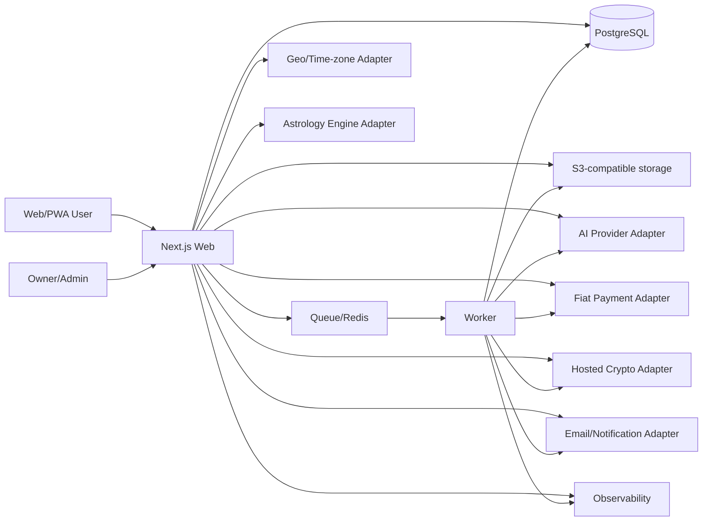

# Software Architecture

## 1. Architectural goal

Build a production-capable system that one owner can understand, deploy, and recover. Optimize for strong module boundaries, managed infrastructure, auditability, and gradual scale—not premature distribution.

## 2. Default stack

Use current stable supported versions at implementation time and pin them in the lockfile.

- Monorepo: pnpm workspaces + Turborepo.
- Language: TypeScript with `strict`, `noUncheckedIndexedAccess`, and boundary validation.
- Web/PWA: Next.js App Router, React, server components by default, route handlers/server actions only where appropriate.
- Worker: Node.js TypeScript process for queues, scheduled jobs, webhooks/reconciliation, exports, email, and content generation.
- Database: managed PostgreSQL; Prisma schema/migrations unless an ADR changes it.
- Cache/queue: managed Redis-compatible service only for queues, idempotency locks, rate limits, and short-lived cache.
- Files: S3-compatible object storage with signed access.
- Auth: provider adapter supporting passkey/magic link/social; local database is authorization/profile truth.
- AI: provider adapter with typed structured outputs, prompt/content versions, evals, and fallbacks.
- Payments: provider adapters for fiat and hosted crypto checkout.
- Observability: OpenTelemetry-compatible traces/metrics plus error monitoring.
- Email/notifications: provider adapters with consent and frequency controls.
- Testing: unit/property, integration with real PostgreSQL in CI, browser E2E, accessibility, contract, load smoke, AI evals.

## 3. Repository layout

```text
apps/
  web/                 # Public product, account, and protected admin shell
  worker/              # Queue consumers and scheduled/reconciliation jobs
  admin/               # Optional separate admin app only if isolation proves necessary
packages/
  config/              # Typed environment, feature flags, brand config
  domain/              # Entities, value objects, policies, use cases
  db/                  # Prisma schema, migrations, repositories, transactions
  ui/                  # Accessible design system
  i18n/                # Locale routing, messages, formatters, content contracts
  divination/          # Tarot, numerology, astrology adapter; no AI prose
  ai/                  # Prompt assembly, retrieval, schemas, safety, evals
  payments/            # Catalog/order/ledger/provider adapters/reconciliation
  country-policy/      # Versioned eligibility and routing
  analytics/           # Event taxonomy and privacy-safe emitters
  observability/       # Logging, tracing, redaction
  security/            # Crypto helpers, rate limits, audit helpers
  testing/             # Fixtures, factories, test containers, E2E helpers
content/
  sources/             # Curated source records and licenses
  traditions/          # Versioned structured spiritual content
  locales/             # Editorial/translation content
  prompts/             # Prompt templates with version metadata
```

A separate `apps/admin` is optional. Prefer a protected route group in `apps/web` until isolation, deployment, or bundle needs justify separation.

`@rituvia/analytics` currently implements strict core-loop event contracts, bounded synthetic test
storage, deterministic funnel/WMRS projections, and a fail-closed offline SEO/GEO operations
projection over aggregate exports and reviewed public-content authority. Web composition supplies
purpose-scoped identity and consent checks; production collection, persistence, browser ingestion,
vendors, provider APIs, and network export remain safe-off.

## 4. System context



## 5. Module boundaries

### Identity

Owns anonymous subjects, users, sessions, auth links, role/permission mapping, account merge, consent, and privacy requests.

### Divination

Owns deterministic draw/calculation requests and immutable result facts. It does not call an LLM and does not know commerce presentation.

Western astrology uses the provider-neutral
`rituvia_astrology_ephemeris_adapter_v1` boundary selected historically in D-066 and relicensed
through D-069. The selected implementation is
Swiss Ephemeris library `2.10.03`; the later `v2.10.3final` source/data snapshot is a separate
provenance dimension. `@rituvia/divination` owns only the pure interface and deterministic facts.
The native implementation lives in the separately registered
`@rituvia/astrology-engine-native` server-only adapter zone;
provider C types, paths, flags, binaries, and data formats cannot enter the pure package. Domain
inputs and outputs carry exact library, adapter, source commit, ephemeris-data digest, ABI,
compiler/flags, house-system, returned engine-flag, and calculation-schema versions. Runtime
calculation is offline; an unexpected engine/data flag returns unavailable without placements.
Selection V2 permits local integration only after independently verified owner AGPL approval and
the root whole-project license. Production still requires independently authorized source/data,
Corresponding Source, build, SBOM, ABI, reference-vector, supply-chain, method, and
`experience.astrology` kill-switch
evidence. Selection V1 cannot activate production.

Web server composition reads the live database-backed `experience.astrology` decision before
loading native metadata or touching the executable. An enabled calculation lazily loads an
absolute production build-metadata JSON file, rejects sanitizer/security build profiles, attests
the binary and both ephemeris files, and composes the native executor into the pure adapter.
Metadata-load failures are not cached; emergency-off versions take effect before the next native
load or execution. No client or route imports the native package.

Location and historical time-zone resolution use a separate provider-neutral V1 contract. The
intended production gazetteer is a self-hosted GeoNames export with an immutable snapshot version
and SHA-256 digest; no request-time public geocoder dependency is allowed. `@rituvia/divination`
owns strict search/result and local-time resolution facts only. `apps/web/server` owns the pinned
Node `24.18.0` / ICU `78.3` / tzdata `2026b` runtime, timeout cancellation, and bounded private
process cache capped at 64 entries and 15 minutes. Cache keys are HMAC-only and partitioned by
provider, adapter, and data versions. Resolution rereads the opaque location ID, never trusts
client coordinates/zone data, never caches birth time, and returns explicit fold/gap states without
current-offset, nearest-place, or UTC fallback.

### Interpretation

Consumes a validated fact bundle plus approved content and returns a structured interpretation. It cannot mutate deterministic facts.

### Reflection

Owns intentions, actions, journals, revisit schedules, and ritual completion.

### Sanctuary/catalog

Owns ritual object definitions, rendering metadata, collections, and required entitlements. It does not decide whether a payment succeeded.
The versioned ritual catalog distinguishes free objects, permanent objects, and consumable ritual
experiences. It exposes only abstract access requirements; Commerce remains authoritative for
Credit cost, fulfillment, permanent entitlement state, and atomic pass consumption. Historical
reflection codes resolve through exact replay mappings rather than being silently renamed.

### Commerce

Owns products, prices, orders, ledger entries, payment attempts, subscriptions, refunds, disputes, entitlements, provider events, and reconciliation.

### Country policy

Owns versioned eligibility and required disclosure decisions. Every sensitive operation records the policy version evaluated.

### Content

Owns structured source material, editorial state, translations, licenses, and publication workflow.

### Growth/analytics

Owns privacy-safe events, attribution, experiments, and SEO metadata. It cannot read journal/prayer raw text.

## 6. Dependency direction

- UI depends on application/use-case contracts, not database clients.
- Application services depend on domain interfaces.
- Adapters implement interfaces and may depend on vendor SDKs.
- Domain packages do not import Next.js, Prisma, payment SDKs, or AI SDKs.
- `divination` never imports `ai`.
- `payments` never trusts `web` client values.
- `analytics` receives explicit safe event fields; it cannot serialize arbitrary domain objects.

Enforce boundaries with TypeScript project references where the build graph benefits, a
repository-owned architecture verifier, lint/type checks, and mutation tests. The verifier runs as
an explicit immutable CI step and fails closed when it encounters an unregistered module, unsafe
source form, alias, export, or dependency.

Current enforcement:

- Every active app/package has a registered identity, is private, extends the strict root TypeScript
  contract, and uses exact `workspace:*` internal dependencies from a central allow matrix.
- Cross-module relative imports, package self-imports, unexported/deep entry points, wildcard or
  unsafe export targets, path/package aliases, runtime use of dev-only dependencies, and module or
  source-file dependency cycles are rejected.
- `domain` has no runtime, environment, network, framework, vendor, or host-global dependency.
  `divination` has the same purity boundary and may depend only on `domain`.
- Browser-entry closures must remain browser safe. Local bridge files cannot hide Node/server,
  database, AI, payment, provider, or server-only dependencies from client code.
- Provider SDKs are default-deny and belong only to the registered adapter owner and its explicit
  adapter/provider zone. Other external and Node built-in runtime dependencies are also
  default-deny per module; dynamic reflection/loading and non-literal runtime property access are
  rejected.
- `apps/web` is the server composition root. Database access is permitted only below its reviewed
  `server/` or `composition/` roots, never from a page, route-independent UI, or client closure.
- Package runtime code and public export targets must live below `src/`; app runtime roots are
  explicitly registered. Next configuration must remain a statically auditable allowlisted object.

## 7. Request lifecycle example: tarot

1. Client submits a safe validated theme/question token and idempotency key.
2. Server authenticates anonymous/user subject, rate limits, and evaluates country policy/product limits.
3. Divination module creates server-authoritative draw facts in a database transaction.
4. Interpretation job receives a fact/content bundle and prompt version.
5. AI output is schema-validated and post-checked.
6. Safe result is stored and streamed/polled to the client; deterministic fallback is available.
7. User may create intention/ritual/journal records.
8. Analytics receives only allowed categorical/event metadata.

## 8. Request lifecycle example: purchase

1. Client selects a catalog product identifier—not a price.
2. Server evaluates country policy, product/price version, user/anonymous eligibility, and existing entitlement.
3. Server creates immutable internal order and payment attempt with idempotency key.
4. Provider adapter creates hosted checkout using server-calculated values.
5. Redirect return page displays pending state only.
6. Signed webhook is stored as an immutable provider event and processed idempotently.
7. Commerce ledger transitions order and grants/revokes entitlement in one durable workflow.
8. Reconciliation job compares provider state, ledger, orders, and payouts.

## 9. Data consistency

- PostgreSQL is the source of truth.
- Use database transactions for state/ledger/entitlement changes.
- Use an outbox pattern for events that must survive process failure.
- All consumers are idempotent and tolerate duplicates/out-of-order delivery.
- Do not use distributed transactions.
- Cache may accelerate reads but never authorize payment, entitlement, country eligibility, or privacy actions by itself.

## 10. Background jobs

Job envelope MUST include:

- Job ID and type.
- Schema version.
- Subject/order/resource identifiers.
- Idempotency/deduplication key.
- Created/available/attempt timestamps.
- Trace/correlation ID.
- Locale and policy/content/prompt versions where relevant.
- No raw sensitive free text unless the job's purpose requires it and the payload is encrypted/short-lived.

Classify jobs as at-most-once, at-least-once, or effectively-once through idempotency. Define retry/backoff/dead-letter and manual replay behavior.

RIT-045 implements one narrow effectively-once Revisit email job using the
`revisit_reminder_subscription` table as both current preference and privacy-minimal queue. Claims
use database time, `FOR UPDATE SKIP LOCKED`, a hashed lease token, three attempts, bounded
deterministic backoff, and terminal dead-letter state. The Worker receives only account-safe
identifiers and exact versions, reauthorizes immediately before provider use, and uses the
subscription ID as the stable provider idempotency key. This is not a generic queue platform; the
only composed provider is hard disabled and no production scheduler or email vendor is activated.

RIT-104 binds each queued reminder to an immutable template ID, version, source checksum, resolved
locale, and fallback flag. The Domain registry and checksummed i18n runtime projection must agree
before the Worker can render; prior versions must remain registered while database rows reference
them. Rendering occurs only after send-time authorization rechecks ownership, preference,
scheduled local date, time zone, due threshold, and quiet hours. Missing or unknown template
bindings terminate safely before provider use. Production runtime remains safe-off before claims:
no scheduler, provider, support mailbox, or delivery capability is composed.

## 11. Environment strategy

The canonical, machine-verified matrix is the
[Environment contract](21_ENVIRONMENT_CONTRACT.md). Local is the only currently implemented
standing environment. RIT-016 proved one bounded loopback compatibility rehearsal; it did not
provision a reusable staging service. Preview, standing staging, and production remain
`required before use`.

Never share databases, signing secrets, webhook endpoints, storage buckets, analytics projects,
email authority, provider projects, or AI logs between environments. Never copy production secrets
or private production content downward.

## 12. Configuration

- Validate all environment variables at startup.
- Brand, locale, country, feature, price, provider, safety, and model settings are configuration—not scattered constants.
- Secrets come from the deployment secret manager.
- `.env.example` contains names and descriptions, never values.
- A config snapshot/version is attached to important generated/purchased artifacts.

## 13. Feature flags

Flags must have:

- Owner, purpose, creation date, lifecycle, country/locale scope, removal date, and cleanup task.
- Server-side enforcement.
- Safe default off for payments, crypto, new countries, new traditions, and sensitive AI behavior.
- Audit log for production changes.
- A cleanup task after full rollout.

The M0 raw registry capability lives only on `@rituvia/config/feature-flags`; architecture policy
allows that subpath only in `apps/web/server/feature-flags.ts`. The general server configuration
entry and client projection expose no raw parser, factory, flag key, state, evaluator, or persisted
version. The zero-argument Web loader obtains a process-level bounded database client from the
reviewed server-only composition boundary and therefore cannot accept a caller-supplied snapshot or
Prisma-like object. Feature-flag and anonymous-identity access share that client; neither creates or
disconnects a pool per request. Before reading, the loader performs a live privilege attestation and fails closed unless
the connected role is a read-only, non-owner, non-DDL, non-superuser identity for the registry
table with the same authenticated session/current identity and no role-membership path to an owner,
writer, or privileged identity. The attestation follows all role-membership paths, including
currently non-settable membership, so membership administration cannot become a post-check upgrade.
Registry version 3 defines exact typed keys for astrology and the owner-gated country, fiat
checkout, hosted crypto checkout, and regional-tradition boundaries. Every definition is immutable
metadata with owner, purpose, creation date, active/retired lifecycle, required scope, approval gate,
safe-off default, removal date, and a real BACKLOG cleanup reference.

D-089 records the completed protected compatibility window and removes the retired
`experience.public_shell` key, adapter, and request-delivery branches in registry v3. The reviewed
public shell is now the completed rollout behavior. SEO inventory freshness controls robots,
sitemap, and indexing, not general page/API availability.

Persisted snapshots are strict and bounded. They reject unknown keys/fields, wrong registry
versions, duplicate or non-monotonic creation versions, non-canonical scope, invalid UTC instants,
and enabled owner-gated records without the required gate reference. Evaluation uses a server-owned
clock, selects the highest effective version, never resurrects an older version after expiry, and
fails off for missing scope, retirement, expiry, or an overdue removal date. `effectiveAt` need not
increase with version: a later-created emergency-off version may become effective immediately and
continues to outrank an earlier scheduled activation. Results carry registry and flag versions for
decision provenance. Country and locale inputs must come from the future server-owned RIT-060
policy boundary, never directly from a client header or form field.

PostgreSQL stores only bounded operational metadata in `feature_flag_version`. A non-superuser
migrator owns the database, public schema, and tables. The runtime login is a non-owner with schema
usage and table reads only; it cannot create, insert, update, delete, truncate, alter RLS, or drop a
policy. A distinct control login inherits only the feature-flag reader/writer capabilities and can
append through forced RLS. Legacy registry v1/v2 rows may append only `off`; enabled registry v3
rows must match an exact active key, required owner-gate prefix, and scope shape. It cannot
update/delete/truncate history or change DDL, and no migration creates an enabled row. There is
deliberately no activation endpoint: granting control credentials and recording the referenced
owner approval remain operational approval actions.

Registry upgrades are rolling-safe. Storage uniqueness is `(registryVersion, flagKey, version)`,
and each deployed reader queries only its exact registry version, so v1, v2, and v3 histories can
coexist and a rollback cannot ingest another registry version's keys. A key is first marked
`retired` and therefore forced off; its referenced cleanup task must reach Done before a later
registry version removes the tombstone. The preceding registry history remains in append-only
storage and is ignored, not reparsed, by the new reader.

## 14. API and rendering

- Public SEO content is server-rendered/static where appropriate.
- Private data is never put into shared/full-route caches or public metadata.
- Use progressive enhancement; core forms work without unnecessary client JavaScript.
- Use streaming for AI UX, but persist/validate the final structured result before treating it as complete.
- Use Problem Details-style errors with stable machine codes and localized messages.

## 15. Vendor abstraction requirements

Every vendor integration has:

- Domain interface.
- Primary adapter.
- Test/fake adapter.
- Timeout, retry, circuit/fallback behavior.
- Idempotency strategy.
- Observability and cost metrics.
- Data-processing inventory.
- Exit/migration notes.

Do not over-abstract vendors that are not yet selected; define the minimal domain contract and implement when chosen.

## 16. Scaling path

Scale vertically and with managed read/queue capabilities first. Extract a service only when at least one is true:

- Independent security/compliance boundary is required.
- Independent scaling produces material cost/reliability benefit.
- Deployment cadence or failure isolation is demonstrably blocked.
- A module has a stable contract and operational owner strategy.

Record evidence in an ADR before extraction.

## 17. Deployment default

Use a managed Web platform plus managed PostgreSQL, Redis-compatible queue/cache, and object storage. Keep deployment provider swappable through standard containers/build outputs where practical. Production deploy requires owner approval and an automated preflight/rollback path.

## 18. Local share-artifact boundary

The RIT-115 one-card share path is a client-local projection and serializer, not a persistence or
publication service. The flow passes only brand, public canonical, reviewed card title,
orientation, and bounded theme labels into `TarotShareCard`; it does not pass the reading ID,
private prompts, AI output, or the full response object.

`tarot-share-card.v1` validates the exact public projection and serializes one self-contained SVG.
Preview, download, and native file sharing consume the same bytes. The CSP allows `blob:` only in
`img-src`; connect, script, object, worker, frame, and external image restrictions remain closed.
There is no upload, database, worker, cache, object storage, public token, or analytics event.
