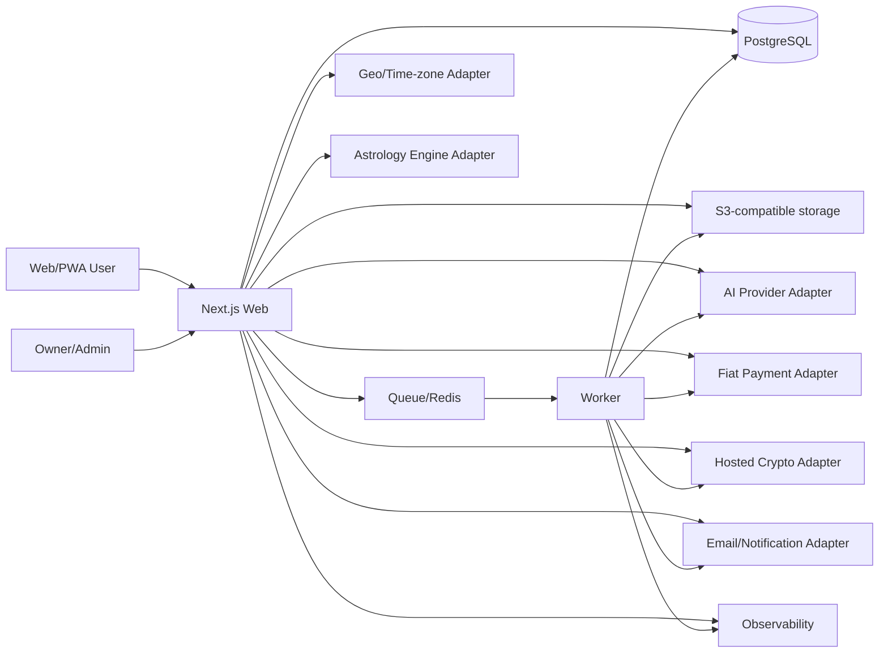

# Software Architecture

## 1. Architectural goal

Build a production-capable system that one owner can understand, deploy, and recover. Optimize for strong module boundaries, managed infrastructure, auditability, and gradual scale—not premature distribution.

## 2. Default stack

Use current stable supported versions at implementation time and pin them in the lockfile.

- Monorepo: pnpm workspaces + Turborepo.
- Language: TypeScript with `strict`, `noUncheckedIndexedAccess`, and boundary validation.
- Web/PWA: Next.js App Router, React, server components by default, route handlers/server actions only where appropriate.
- Worker: Node.js TypeScript process for queues, scheduled jobs, webhooks/reconciliation, exports, email, and content generation.
- Database: managed PostgreSQL; Prisma schema/migrations unless an ADR changes it.
- Cache/queue: managed Redis-compatible service only for queues, idempotency locks, rate limits, and short-lived cache.
- Files: S3-compatible object storage with signed access.
- Auth: provider adapter supporting passkey/magic link/social; local database is authorization/profile truth.
- AI: provider adapter with typed structured outputs, prompt/content versions, evals, and fallbacks.
- Payments: provider adapters for fiat and hosted crypto checkout.
- Observability: OpenTelemetry-compatible traces/metrics plus error monitoring.
- Email/notifications: provider adapters with consent and frequency controls.
- Testing: unit/property, integration with real PostgreSQL in CI, browser E2E, accessibility, contract, load smoke, AI evals.

## 3. Repository layout

```text
apps/
  web/                 # Public product, account, and protected admin shell
  worker/              # Queue consumers and scheduled/reconciliation jobs
  admin/               # Optional separate admin app only if isolation proves necessary
packages/
  config/              # Typed environment, feature flags, brand config
  domain/              # Entities, value objects, policies, use cases
  db/                  # Prisma schema, migrations, repositories, transactions
  ui/                  # Accessible design system
  i18n/                # Locale routing, messages, formatters, content contracts
  divination/          # Tarot, numerology, astrology adapter; no AI prose
  ai/                  # Prompt assembly, retrieval, schemas, safety, evals
  payments/            # Catalog/order/ledger/provider adapters/reconciliation
  country-policy/      # Versioned eligibility and routing
  analytics/           # Event taxonomy and privacy-safe emitters
  observability/       # Logging, tracing, redaction
  security/            # Crypto helpers, rate limits, audit helpers
  testing/             # Fixtures, factories, test containers, E2E helpers
content/
  sources/             # Curated source records and licenses
  traditions/          # Versioned structured spiritual content
  locales/             # Editorial/translation content
  prompts/             # Prompt templates with version metadata
```

A separate `apps/admin` is optional. Prefer a protected route group in `apps/web` until isolation, deployment, or bundle needs justify separation.

## 4. System context



## 5. Module boundaries

### Identity

Owns anonymous subjects, users, sessions, auth links, role/permission mapping, account merge, consent, and privacy requests.

### Divination

Owns deterministic draw/calculation requests and immutable result facts. It does not call an LLM and does not know commerce presentation.

### Interpretation

Consumes a validated fact bundle plus approved content and returns a structured interpretation. It cannot mutate deterministic facts.

### Reflection

Owns intentions, actions, journals, revisit schedules, and ritual completion.

### Sanctuary/catalog

Owns ritual object definitions, rendering metadata, collections, and required entitlements. It does not decide whether a payment succeeded.

### Commerce

Owns products, prices, orders, ledger entries, payment attempts, subscriptions, refunds, disputes, entitlements, provider events, and reconciliation.

### Country policy

Owns versioned eligibility and required disclosure decisions. Every sensitive operation records the policy version evaluated.

### Content

Owns structured source material, editorial state, translations, licenses, and publication workflow.

### Growth/analytics

Owns privacy-safe events, attribution, experiments, and SEO metadata. It cannot read journal/prayer raw text.

## 6. Dependency direction

- UI depends on application/use-case contracts, not database clients.
- Application services depend on domain interfaces.
- Adapters implement interfaces and may depend on vendor SDKs.
- Domain packages do not import Next.js, Prisma, payment SDKs, or AI SDKs.
- `divination` never imports `ai`.
- `payments` never trusts `web` client values.
- `analytics` receives explicit safe event fields; it cannot serialize arbitrary domain objects.

Enforce boundaries with TypeScript project references where the build graph benefits, a
repository-owned architecture verifier, lint/type checks, and mutation tests. The verifier runs as
an explicit immutable CI step and fails closed when it encounters an unregistered module, unsafe
source form, alias, export, or dependency.

Current enforcement:

- Every active app/package has a registered identity, is private, extends the strict root TypeScript
  contract, and uses exact `workspace:*` internal dependencies from a central allow matrix.
- Cross-module relative imports, package self-imports, unexported/deep entry points, wildcard or
  unsafe export targets, path/package aliases, runtime use of dev-only dependencies, and module or
  source-file dependency cycles are rejected.
- `domain` has no runtime, environment, network, framework, vendor, or host-global dependency.
  `divination` has the same purity boundary and may depend only on `domain`.
- Browser-entry closures must remain browser safe. Local bridge files cannot hide Node/server,
  database, AI, payment, provider, or server-only dependencies from client code.
- Provider SDKs are default-deny and belong only to the registered adapter owner and its explicit
  adapter/provider zone. Other external and Node built-in runtime dependencies are also
  default-deny per module; dynamic reflection/loading and non-literal runtime property access are
  rejected.
- `apps/web` is the server composition root. Database access is permitted only below its reviewed
  `server/` or `composition/` roots, never from a page, route-independent UI, or client closure.
- Package runtime code and public export targets must live below `src/`; app runtime roots are
  explicitly registered. Next configuration must remain a statically auditable allowlisted object.

## 7. Request lifecycle example: tarot

1. Client submits a safe validated theme/question token and idempotency key.
2. Server authenticates anonymous/user subject, rate limits, and evaluates country policy/product limits.
3. Divination module creates server-authoritative draw facts in a database transaction.
4. Interpretation job receives a fact/content bundle and prompt version.
5. AI output is schema-validated and post-checked.
6. Safe result is stored and streamed/polled to the client; deterministic fallback is available.
7. User may create intention/ritual/journal records.
8. Analytics receives only allowed categorical/event metadata.

## 8. Request lifecycle example: purchase

1. Client selects a catalog product identifier—not a price.
2. Server evaluates country policy, product/price version, user/anonymous eligibility, and existing entitlement.
3. Server creates immutable internal order and payment attempt with idempotency key.
4. Provider adapter creates hosted checkout using server-calculated values.
5. Redirect return page displays pending state only.
6. Signed webhook is stored as an immutable provider event and processed idempotently.
7. Commerce ledger transitions order and grants/revokes entitlement in one durable workflow.
8. Reconciliation job compares provider state, ledger, orders, and payouts.

## 9. Data consistency

- PostgreSQL is the source of truth.
- Use database transactions for state/ledger/entitlement changes.
- Use an outbox pattern for events that must survive process failure.
- All consumers are idempotent and tolerate duplicates/out-of-order delivery.
- Do not use distributed transactions.
- Cache may accelerate reads but never authorize payment, entitlement, country eligibility, or privacy actions by itself.

## 10. Background jobs

Job envelope MUST include:

- Job ID and type.
- Schema version.
- Subject/order/resource identifiers.
- Idempotency/deduplication key.
- Created/available/attempt timestamps.
- Trace/correlation ID.
- Locale and policy/content/prompt versions where relevant.
- No raw sensitive free text unless the job's purpose requires it and the payload is encrypted/short-lived.

Classify jobs as at-most-once, at-least-once, or effectively-once through idempotency. Define retry/backoff/dead-letter and manual replay behavior.

## 11. Environment strategy

- Local: reproducible containers/emulators; synthetic data only.
- Preview: per-PR, no production secrets or real payment capture.
- Staging: production-like, provider sandboxes, synthetic/consented test accounts.
- Production: least privilege, separate projects/accounts, protected deployment, backups, monitoring.

Never share databases, signing secrets, webhook endpoints, storage buckets, analytics projects, or AI logs between staging and production.

## 12. Configuration

- Validate all environment variables at startup.
- Brand, locale, country, feature, price, provider, safety, and model settings are configuration—not scattered constants.
- Secrets come from the deployment secret manager.
- `.env.example` contains names and descriptions, never values.
- A config snapshot/version is attached to important generated/purchased artifacts.

## 13. Feature flags

Flags must have:

- Owner, purpose, creation date, rollout state, country/locale scope, and removal date.
- Server-side enforcement.
- Safe default off for payments, crypto, new countries, new traditions, and sensitive AI behavior.
- Audit log for production changes.
- A cleanup task after full rollout.

## 14. API and rendering

- Public SEO content is server-rendered/static where appropriate.
- Private data is never put into shared/full-route caches or public metadata.
- Use progressive enhancement; core forms work without unnecessary client JavaScript.
- Use streaming for AI UX, but persist/validate the final structured result before treating it as complete.
- Use Problem Details-style errors with stable machine codes and localized messages.

## 15. Vendor abstraction requirements

Every vendor integration has:

- Domain interface.
- Primary adapter.
- Test/fake adapter.
- Timeout, retry, circuit/fallback behavior.
- Idempotency strategy.
- Observability and cost metrics.
- Data-processing inventory.
- Exit/migration notes.

Do not over-abstract vendors that are not yet selected; define the minimal domain contract and implement when chosen.

## 16. Scaling path

Scale vertically and with managed read/queue capabilities first. Extract a service only when at least one is true:

- Independent security/compliance boundary is required.
- Independent scaling produces material cost/reliability benefit.
- Deployment cadence or failure isolation is demonstrably blocked.
- A module has a stable contract and operational owner strategy.

Record evidence in an ADR before extraction.

## 17. Deployment default

Use a managed Web platform plus managed PostgreSQL, Redis-compatible queue/cache, and object storage. Keep deployment provider swappable through standard containers/build outputs where practical. Production deploy requires owner approval and an automated preflight/rollback path.
