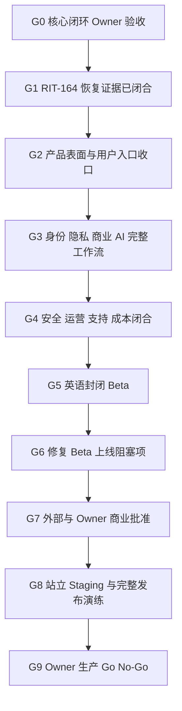

# RITUVIA 从当前状态到上线前的执行方案

> 基准日期：2026-08-03
>
> 适用范围：从当前本地/受保护环境状态，到 Owner 可以作出有限生产上线 go/no-go 决定之前
>
> 权威边界：本方案不替代 `AGENTS.md`、`DECISIONS.md`、生产资料包、环境合同、上线与恢复
> runbook，也不批准部署、DNS、真实支付、生产 AI、法律文本或公开上线

## 1. 先给结论

项目还没有上线，不是因为核心闭环不存在，而是因为“代码能跑”和“可以安全服务真实用户”
之间仍有五类缺口：

1. **生产级恢复仍未闭合**：RIT-164 已逐项解释本地恢复后的 schema drift，并让仓库级恢复门通过；
   provider-level PITR、外部备份隔离、生产 RPO/RTO 和跨环境恢复演练仍缺失。
2. **核心入口已收口，其他产品表面仍未收口**：RIT-166 已让首页两个单张免费入口先进入安全
   intake，并通过完整匿名闭环验证；Daily Tarot、Readings、独立 Journal、Account
   Privacy/Billing/Orders 等生产资料包目的地仍没有完整用户入口，移动导航当前是换行堆叠，
   不是资料包要求的语义折叠菜单。
3. **已有能力不等于完整产品**：账户、隐私、支付、订阅、占星、AI 等存在大量后端和测试能力，
   但部分没有按钮、没有完整客户工作流、默认关闭，或只允许本地/Test Mode。
4. **上线运营门未完成**：威胁模型收口、滥用控制、SLO/告警、支持队列、成本上限、故障演练、
   站立 staging、独立渗透测试和完整发布演练仍未完成。
5. **外部和 Owner 门仍阻塞**：品牌、法律实体、国家、税务/MoR、支付承销、预算、法律文本、
   支持方式、生产密钥、生产 AI 和最终公开发布均没有被本仓库自行批准。

因此，接下来的目标不是继续横向堆功能，而是把现有能力压缩成一个可以逐门验收、逐步回滚的
上线候选。**当前不仅是公开/付费生产 NO-GO，连受保护封闭 Beta 也尚未过门；封闭 Beta 是最近的
安全目标，不是当前已经获得的状态。**

## 2. Owner 已批准的两级首发定义

### 2.1 已批准的最近首发：受保护英语封闭 Beta

D-097 已将最近一个可以实际交付给外部测试者的“上线”定义为 Wave B / M13 封闭 Beta：

- 受邀请成年用户；
- 英语；
- 受保护、noindex、allowlist 的 staging；
- 只开放匿名免费核心闭环；
- 使用 synthetic 或明确同意的专用 Beta 数据，绝不接入生产数据；
- 不要求账户，不收真钱，不开放 Credits、订阅、生产 AI、占星激活、真实邮件、crypto、公开索引
  或营销投放。

这一级上线的目的，是验证产品是否真正可理解、可信、可访问、可恢复，不是把测试环境伪装成生产。

### 2.2 完成封闭 Beta 后的目标：有限付费英语生产上线

如果 Owner 所说的“上线”特指可收费的公开生产服务，则继续完成本方案 G6–G9，并把目标定义为：

- 英语；
- 18+；
- 一个或少数经书面批准的国家；
- 小规模、可停止、可回滚的 cohort；
- 匿名免费核心闭环始终完整；
- 账户是保存跨设备体验和商业能力的可选入口，不得阻挡首次免费价值；
- 首发支付只使用经书面承销批准的 hosted fiat flow；
- Deep Reading 只有在生产 AI、隐私、费用和安全门全部通过后才开放；
- 西方占星只有在完整用户入口、运行开关、部署版本和 Corresponding Source 发布证据通过后才开放；
- Coinbase/USDC、更多语言、更多国家、区域传统和增长自动化不与首发捆绑。

### 2.3 为什么不建议“一次全部上线”

加密支付、多语言、更多国家和区域传统会同时扩大法律、支付、文化、客服、退款、隐私和故障面。
首发将这些能力保持 safe-off，并由 Country Policy 和服务端开关隐藏，比把未验证能力带入同一
上线批次更安全，也更容易判断核心产品是否真正有用。

### 2.4 付费产品方向已选择，外部合同仍待闭合

根 `AGENTS.md` 的支付规则要求直接销售清楚描述的订阅、报告或数字体验，并明确“不要求用户先
预充 Credits”；2026-07-23 生产资料包则定义 Plus、Credit packs 和按 Credit 消费的 Deep Reading。
由于根规则优先级更高，这个差异不能由实现者静默选择更方便的一方。D-097 已由 Owner 明确选择：

- 直接销售名称、范围和权益清楚的订阅、报告或数字体验；
- 不要求用户预充 Credits；
- 冻结 Credit packs 和按 Credit 消费作为生产产品合同；
- 保留现有 Test Mode Credit/订阅/退款/对账实现作为历史回放与完整性证据，直到逐文件审计证明
  哪些部分可以安全退休。

该方向批准不等于生产商业合同已完成。OWN-018 仍要求精确 SKU、权益、价格、退款、客户文案以及
法律和支付商书面 review；在这些证据完成前，不恢复生产付费 UI、定价或激活。

### 2.5 首发不是删掉长期产品合同

生产资料包要求的 Readings、Daily Tarot、独立 Journal、Account Billing、Orders、Privacy、About
等非商业目的地继续作为长期产品表面要求；Plus、Credit packs 和按 Credit 消费的商业细节由 D-097
的直接销售/no-preload 决定取代。首发范围的任何收缩都必须满足两个条件：

1. 未开放能力在服务端、路由、导航和文案上都不会伪装成可用；
2. Owner 用明确决定批准该 launch profile；Codex 不能把“默认关闭”自行解释为产品合同变更。

## 3. 当前真实起点

| 领域                   | 当前真实状态                                                                        | 上线前还缺什么                                                                       |
| ---------------------- | ----------------------------------------------------------------------------------- | ------------------------------------------------------------------------------------ |
| 匿名核心闭环           | 本地生产构建已验证；首页已 intake-first                                             | Owner 完整走查、真实受邀用户理解性测试、其余导航收口                                 |
| 塔罗                   | 单张、三张、恢复、分享、报告存在                                                    | Daily Tarot 和 Readings 总入口；生产 UI fidelity 复核                                |
| 意图/仪式/日记/Revisit | 匿名完整链路存在，免费线香和蜡烛存在                                                | 产品入口收口；提醒生产投递另行审批                                                   |
| 数秘                   | 匿名计算器和公开方法页存在                                                          | 决定是否进入首发导航；保持公式和隐私证据                                             |
| 账户                   | 本地安全登录、资料、历史、会话存在                                                  | 生产邮件/身份供应商；完整隐私和商业客户入口                                          |
| 隐私                   | 导出、删除、授权和加密后端通过专项证据；综合浏览器仍有 V1/V2 断言漂移               | 修复浏览器证据；补普通用户按钮/状态页和生产留存/法律/交付运维                        |
| 占星                   | 引擎、加密数据、只读结果查看器存在                                                  | 创建入口、真实位置数据、safe-off 激活、部署源码证据                                  |
| AI                     | 结构、安全、验证和 fallback 基础存在                                                | 生产供应商、私密内容条款、双语/首发范围 eval、成本门                                 |
| Credits/支付           | Credit 内核仅保留为 Test Mode/历史完整性证据；D-097 冻结其生产产品合同              | 设计直接销售 SKU；客户中心、争议支持、kill switch、书面承销、生产配置                |
| 订阅                   | Test Mode 后端生命周期存在；生产 offer 尚未定义                                     | 按直接销售/no-preload 重新定义购买、管理、取消、发票、恢复和审批                     |
| 内容/SEO               | 45 个英语公开内容路由在仓库中通过质量门                                             | 站立生产环境、域名、robots/sitemap/indexing Owner 批准                               |
| 环境                   | Local 已实现；staging 只有演练证据                                                  | 独立站立 staging、隔离密钥/数据/供应商、不可变晋级                                   |
| 恢复                   | RIT-164 仓库级恢复和 schema drift 审阅通过                                          | 生产备份/PITR/外部恢复演练                                                           |
| 运营                   | 有基础日志、审计、对账和 runbook                                                    | SLO、告警、支持、状态页、预算、game day、渗透测试                                    |
| 配置边界               | 类型化配置、精确 intake activation、隔离生产构建和 finite-route/direct-RSC 门已通过 | 在 release evidence 中持续运行；不得用近似 activation reference 或客户端 secret 绕过 |

## 4. 唯一关键路径

任何一个 Gate 没有证据，就不能用后面的“演练成功”掩盖前面的缺口。

## 5. Gate 逐项方案

### G0 — Owner 验收唯一核心闭环

**当前状态：已通过。** 2026-08-01，Owner 在受保护本地产品与逐按钮手册并排打开后明确回复
“接受”，未提交优先问题清单。RIT-167 和 D-098 记录该结论；它不批准 Beta 部署或生产上线。

**目标**：Owner 能从 `/en` 开始，不注册、不付款，完成单张解读、意图、小行动、免费仪式、
私密反思和 Revisit，并明确指出不理解、找不到或不可信的步骤。

**执行**：

1. 使用本手册的“核心闭环”逐按钮走查。
2. 分别检查桌面、320px 移动端、键盘、减少动态模式。
3. 记录每一个入口、文案、顺序和恢复问题；不在验收中顺带扩展新产品。
4. Owner 明确给出“接受核心闭环”或带优先级的问题清单。

**通过证据**：连续完成；免费价值不需要账户或支付；没有私密文本泄漏；用户知道可以停止；
Owner 的验收结论进入记录。

**失败处理/回滚**：冻结非核心范围，只修影响主线的 P0/P1 问题；不恢复商业、占星或增长扩张。

### G1 — RIT-164 仓库级恢复阻塞已关闭

**当前状态**：2026-07-31 已完成。161 条差异全部映射到不可变 migration，Node 26.5.1 下的
本地隔离备份、恢复、快照一致性、最小权限和清理验证通过。生产 provider 级恢复仍属于 G4/G8。

**目标**：解释恢复后 schema fingerprint 的每一处差异，并让备份恢复 gate 在 Node 26.5.1 下通过。

**执行**：

1. 复现实际 fingerprint 和规范化 SQL。
2. 对照 39 个不可变 migration、Prisma schema、grant、view、trigger 和近期商业表逐项解释。
3. 只修验证器或经审阅的基线，不修改历史 migration，不降低 fail-closed 检查。
4. 重跑恢复、migration、记录和生成证据 gate。

**通过证据**：`pnpm test:backup-recovery-database` 通过；差异报告可审阅；没有生产数据或凭据。

**失败处理/回滚**：恢复旧验证器/基线；保持发布阻塞，不能用跳过或更新 hash 代替解释。

### G2 — 产品表面与用户入口收口

**目标**：导航、页面和按钮与首发产品合同一致；用户不会遇到“后端有、前端找不到”或“按钮看似
可用、实际安全关闭”的产品。

**必须解决的已知项目**：

- **已完成**：D-097/RIT-166 已让首页 `Begin a free reading` 和 `Draw one card` 先进入
  `/en/intake`；只有 allowed 或用户主动采用建议并重新通过的结果可以继续，blocked/crisis 无解读入口。
- 增加或明确处理 Readings、Daily Tarot、独立 Journal、About、Account Billing、Orders、
  Privacy 等生产资料包目的地。
- 把移动导航改为资料包要求的语义折叠菜单，或通过 ADR、前后截图和 Owner 批准接受差异。
- 为隐私导出、下载、选择性删除和账户删除提供完整用户界面；当前只有 API/测试，没有按钮。
- 明确占星创建入口的首发处置；当前只有“查看已经保存的结果”。
- 所有 safe-off 能力从导航、卡片、CTA 和搜索暴露中一致隐藏或显示真实不可用状态。

**通过证据**：路由/按钮 inventory 与实际构建一致；黄金截图未被擅自更新；桌面、移动、键盘、
400% zoom、reduced motion、Firefox、WebKit、VoiceOver/NVDA 手动证据通过；不存在开发/Test Mode
语言泄漏到生产 UI。还必须实现对黄金截图的实际像素/视觉比较；当前 PNG 尺寸、metadata 和隐私
canary 检查不能替代视觉 fidelity regression。当前专用浏览器门尚未覆盖私密三张塔罗、Plans 和
checkout 客户路径；它们若进入首发范围，必须补齐独立的 UI/E2E、失败恢复和无障碍证据。

**失败处理/回滚**：按功能开关隐藏未完成入口；保留免费核心闭环；不以假按钮、静态模拟或
浏览器 local state 填补缺口。

### G3 — 完成首发范围内的完整用户工作流

**目标**：首发中显示的每项能力都从按钮一直通到服务端权威、数据、失败恢复和客户支持。

**执行顺序**：

1. 账户/身份：生产邮件或已批准身份供应商、登录恢复、匿名数据只合并一次、会话撤销。
2. 隐私：账户中的导出、下载、删除、状态、失败、重试、最近认证和支持入口。
   同时把综合隐私浏览器门从过期的 export V1 预期更新为当前权威的 V2 contract，并证明不是通过
   降低断言或跳过测试获得绿色。
3. 商业客户界面：按 D-097 重定义并执行 RIT-072；直接销售订单、收据/发票、订阅、取消、恢复、
   退款/支持状态完整，不提供预充 Credit pack 入口。
4. 争议与支持：RIT-074 已完成 existing payment-event 到 immutable metadata-only support work item
   的异步投影；
   不把私密日记当支付证据，真实 chargeback response 仍由 Owner/provider gate 控制。
5. 支付 kill switch：RIT-075/D-110 已完成 repository-local 合同；新购买按
   country/fiat-or-crypto/provider/method 精确安全关闭，没有隐式 fallback，生产控制写入与激活仍需
   staging/Owner 证据。
6. AI：生产供应商仍关闭，先完成首发 prompt/schema/model/content 版本、eval、费用、超时、fallback、
   直接购买 entitlement、失败释放和无重复收费证据。
7. 占星：只有首发决定包含时，才完成出生资料创建、位置数据、运行开关和完整隐私路径。

付费产品方向已经由 D-097 解决为直接销售/no-preload，但仍受 OWN-018 的精确 SKU、法律和支付 review
阻塞；不能因为 Test Mode 流程存在就先做生产 UI 或定价承诺。

**通过证据**：生产资料包的 required E2E journeys 对首发范围 100% 通过；任何未纳入首发的能力
都有服务端 safe-off、无入口和 Owner 记录。

**失败处理/回滚**：禁用具体 feature/provider/country；保留账户和免费核心；支付返回页永不自行
授予权益，AI 失败永不形成最终收费或消费。旧 Credit 行为只允许在隔离 Test Mode 回放。

### G4 — 安全、运营、支持和成本闭合

**目标**：不是只“发现错误”，而是有人能看见、停止、恢复和向用户解释错误。

**对应工作**：

- RIT-120：Owner/admin 运营面板；
- RIT-121：最终威胁模型和 Critical/High 清零；
- RIT-122：速率、bot、滥用和 denial-of-wallet 控制；
- RIT-124：SLO、告警、runbook、状态和只读/kill-switch 演练；
- RIT-125：支持、隐私、安全和内容报告队列；
- RIT-127：AI、基础设施、退款/欺诈和营销预算/异常上限；
- RIT-128：安全、支付、AI、供应商和数据库故障 tabletop/game day。

RIT-121 已确认完整历史 Gitleaks 命中的是公开幂等 schema 版本，并只加入该历史提交、路径、规则和
行号的精确 fingerprint；默认规则、全历史扫描、redaction 和未来发现行为不变。重跑覆盖 85 个提交
且无剩余泄漏；不得把该精确例外扩展为路径、正则或全局关闭。

RIT-122 已完成仓库侧受保护 Beta admission：问题 intake 和匿名私密修改共享两个固定 scope 的
数据库原子 session 预算，超限返回有界 `429`/`Retry-After`，浏览器不自动重试，也不采集问题、
IP、User-Agent、设备 ID 或指纹。它没有解决 session farming 或部署边缘防护；D-104 已精确批准
`own-019.protected-beta-abuse.v1` 的阈值、邀请 cohort、allowlist/edge、观察窗口和回滚阈值，但
RIT-130 仍须在 standing staging 中实现和验证这些控制，批准本身不构成部署或 Beta candidate。

RIT-125 已完成仓库侧四类运营 case 内核：新 reading report、privacy export/deletion 和 refund source
在同一事务入队，queue/priority/local SLA/draft/expiry 由数据库 source 派生；operator 必须具备对应
role、最近认证、同 session passkey MFA、reason 和 ticket。case、draft 和 audit 不复制问题、解读、
日记、出生资料或 email，固定 draft 不自动发送。当前仍没有普通用户 Support/Case Status Button、
Admin Dashboard、admin HTTP route、外部 Pager 或正式 SLA；RIT-120 负责把安全 projection 接入 Owner
运营面板，生产 contact/营业时间/承诺/retention 仍需批准。

生产恢复还必须在经批准的托管环境中配置加密备份/PITR，并完成隔离 provider-level restore；
当前仓库 synthetic logical restore 不能替代该证据。目标 RPO 不超过 15 分钟、RTO 不超过 4 小时，
仍需结合实际供应商和 Owner 批准确认。

**通过证据**：0 个开放 Critical/High；告警能到负责人并关联 runbook；恢复、对账、dead-letter、
provider outage、kill switch、只读模式和状态沟通演练通过；支持 SLA 和升级责任明确。

**失败处理/回滚**：降低 cohort、关闭付费/AI/占星、进入只读或维护模式；未知私密数据风险直接
停止，不以继续观察代替隔离。

### G5 — 英语封闭 Beta

**目标**：用受邀成年测试者验证可理解性、信任、安全、无障碍和恢复，而不是验证“测试数很多”。

**执行**：RIT-130 准备范围、邀请、同意、支持、指标和回滚；RIT-131 执行；只收集必要的事件，
不收集问题、意图、日记、出生资料或自由文本。

**必须观察**：

- 用户能否找到首次入口；
- 是否理解“反思而非预测”；
- 在哪里退出、重试和恢复；
- 从解读到小行动、仪式、日记和 Revisit 的完成/放弃原因；
- 移动、键盘、屏幕阅读器、放大和低速/离线问题；
- 支持、安全和隐私报告是否能够被及时处理。

**通过证据**：数据质量已验证；质性反馈可追溯到工作流；没有开放上线阻塞项。

**失败处理/回滚**：停止邀请、关闭受影响入口、保留数据最小化；进入 RIT-132 修复，不扩大 cohort。

### G6 — 修复 Beta 上线阻塞项

**目标**：RIT-132 只关闭 Beta 暴露的安全、UX、无障碍和可靠性阻塞项，并加入回归证据。

**通过证据**：问题可复现、修复可验证、风险有回滚；核心路径和受影响 package/browser/database
gate 通过。

**失败处理/回滚**：未关闭问题保持发布阻塞；不得把“用户可以绕开”当作完成。

### G7 — 外部与 Owner 商业批准

**目标**：完成 RIT-140 的依赖，不用内部代码替代外部书面证据。

| 阻塞项                           | 必须由谁完成                    | 最小证据                                                                        |
| -------------------------------- | ------------------------------- | ------------------------------------------------------------------------------- |
| OWN-001 品牌/域名/语言 clearance | Owner + 专业顾问                | 检索/意见、域名/账号、申请决定                                                  |
| OWN-002 支付承销                 | Owner + 主/备支付商             | 精确产品、国家、价格、退款的书面批准                                            |
| OWN-004 实体/国家/税务/MoR/法律  | Owner + 合资格顾问              | 卖方、国家、18+、税务、条款/隐私/退款                                           |
| OWN-005 预算                     | Owner                           | 月度、AI、基础设施、退款/欺诈、营销上限                                         |
| OWN-018 直接销售 offer 外部闭合  | Owner + 法律/支付 review        | 符合 D-097 的唯一直接销售 SKU、权益、价格、退款和客户文案；不得要求预充 Credits |
| 生产 AI/私密内容                 | Owner + provider/privacy review | 模型、数据条款、保留、地区、费用、安全批准                                      |
| 支持和 SLA                       | Owner                           | 联系方式、营业/响应、升级和事件沟通责任                                         |

**失败处理/回滚**：保持 Stripe Live、生产 AI、公开索引和生产发布关闭；继续只做独立的非生产工作。

### G8 — 站立 Staging 和完整上线/回滚演练

**目标**：RIT-141 和 RIT-142 在隔离的 production-like staging 上对 exact release candidate 演练，
而不是把本地构建当 staging。

**必须完成**：

1. 独立数据库、缓存/队列、对象存储、密钥、供应商 sandbox、邮件测试域和观测目的地。
2. 不可变构建、SBOM、配置和完整 Corresponding Source 绑定到 exact SHA。
3. migration、备份、恢复、roll-forward/rollback、seed-free smoke。
4. 核心、账户、隐私、支付、退款/取消、AI、安全、无障碍、搜索和支持 journeys。
5. kill switch、provider outage、queue pause/replay、只读模式和应用 artifact 回滚。
6. 对应源码 archive 上传、回读、digest 和公开源码链接绑定。

**通过证据**：所有 release acceptance 数字达标；演练记录包含 commit SHA、命令、退出码、版本、
trace/screenshot、provider fixture、限制和剩余 gate。

**失败处理/回滚**：不晋级；修复后创建新的不可变 release candidate 并重复受影响及完整演练。

### G9 — Owner 生产 Go/No-Go

**目标**：Owner 审阅 RIT-143 清单并决定 limited production launch；Codex 不能代签。

**Go 必须同时满足**：

- Gate A–H 对首发 profile 的证据完整；
- Gate I 的外部/商业批准齐全；
- production secrets 只在 secret manager 中；
- cohort、country、provider、预算和 stop threshold 已配置；
- 监控、支持、状态、备份、恢复、回滚和责任人在岗；
- 功能逐个开启，不一次打开所有 provider；
- 任何排除功能都保持无入口、服务端 safe-off 和可审计。

**No-Go 条件**：恢复失败、私密数据风险、金钱/权益不一致、国家/法律暴露、Critical/High、核心
严重不可用、取消/退款不可用、生产来源义务未满足、没有可执行回滚。

## 6. 当前生产资料包 Gate 状态

| Gate                        | 当前判断                                | 说明                                                                                                                                                                                                                                                                                     |
| --------------------------- | --------------------------------------- | ---------------------------------------------------------------------------------------------------------------------------------------------------------------------------------------------------------------------------------------------------------------------------------------- |
| A Repository reality        | **当前 release candidate 不通过**       | 已审计，但当前工作树有 staged 未提交变更；必须在 clean exact SHA 上重建全部发布证据                                                                                                                                                                                                      |
| B Foundation/UI fidelity    | **部分通过**                            | Chromium 核心浏览器通过；生产目的地、移动语义菜单、pixel visual regression、Firefox/WebKit 和手动 AT 未闭合                                                                                                                                                                              |
| C Identity/private data     | **当前综合门不通过**                    | 本地账户、授权、加密、导出删除后端通过，但隐私浏览器仍期待 export V1、实现已是 V2；生产身份和完整用户按钮也缺失                                                                                                                                                                          |
| D Credits/entitlements      | **旧内核冻结，直接销售合同阻塞**        | D-097 已选择直接销售/no-preload；Credit 内核只保留 Test Mode/历史证据，OWN-018 外部合同未闭合                                                                                                                                                                                            |
| E Stripe Test Mode          | **大部分内核通过，产品/外部证据未闭合** | Test Mode 支付完整性、RIT-074 dispute support 和 RIT-075 provider safe-off/no-fallback 已通过；RIT-072 和承销仍缺                                                                                                                                                                         |
| F USDC/Base test            | **已排除首发**                          | D-097 已批准免费封闭 Beta profile；保持关闭，不能显示为可用                                                                                                                                                                                                                              |
| G AI test integration       | **基础实现存在，生产 Gate 未通过**      | 结构/eval/fallback 有证据；生产 provider、隐私、费用和首发 eval 缺失                                                                                                                                                                                                                     |
| H Operational/security beta | **未通过**                              | RIT-168 已完成仓库内 25-seat invite/session 原子准入、撤销和 `/en/beta`；但 RIT-129 派生状态仍是 blocked/incomplete，站立 staging、实际邀请/edge、真实告警送达、provider restore、staging outage/rollback、外部 DAST/渗透测试和 staging support/admin 仍缺，且 RIT-127 等待 Option B/原子预算证据 |
| I Legal/commercial approval | **Blocked**                             | OWN-001/002/004/005 和相关 Owner 决定未完成                                                                                                                                                                                                                                              |
| J Limited production launch | **Blocked**                             | 依赖完整演练和 Owner go/no-go；当前无 standing staging 或生产服务，封闭 Beta 也仍是 NO-GO                                                                                                                                                                                                |

## 7. 工作顺序和并行边界

### 主线必须串行

封闭 Beta：`G0 → G1 → G2 → G3（只完成免费 Beta 适用部分）→ G4 → G5`

有限付费生产：`G5 → G6 → G7 → G8 → G9`

其中外部批准材料可以从现在开始准备，但在 G7 前不能被内部假设替代。

### 可以并行的只读/准备工作

- 品牌、法律、支付承销和预算材料准备；
- staging 资源设计和 IaC review，不创建/激活生产资源；
- 威胁模型、支持流程、SLO 和 game-day 场景草案；
- 用户手册、客服 runbook、可访问性人工检查清单；
- provider sandbox fixture 和生产配置模板；
- 受邀 Beta 招募和同意材料草案，实际发送仍需批准。

### 不得并行激活

- Stripe Live、真实 Coinbase/USDC；
- 生产 AI 处理私密内容；
- 公开 DNS、索引和生产发布；
- 法律/隐私/退款政策生效；
- 不可逆生产 migration、生产数据修改、密钥销毁或备份删除。

## 8. 每个任务的交付格式

以后每个上线前任务必须用同一格式收口：

1. **用户结果**：用户从哪里进入，最终得到什么。
2. **当前状态**：本地、staging、Test Mode、safe-off、生产可用中的哪一个。
3. **正常路径**：按钮、API、数据和完成状态。
4. **失败与恢复**：loading、empty、error、offline、retry、重复请求、恢复和回滚。
5. **安全与隐私**：所有权、CSRF、加密、日志/分析、删除/导出和 negative tests。
6. **验证**：受影响 package、数据库、浏览器、无障碍、安全和生成证据。
7. **Owner gate**：哪些只是准备，哪些需要明确批准。
8. **下一项**：只推荐一个 Ready 任务。

## 9. 当前下一步

RIT-164、RIT-166、RIT-167、RIT-120、RIT-121、RIT-122、RIT-124、RIT-125 和 RIT-168 已完成，Owner 已接受 intake-first 核心闭环，
版本化威胁模型保持零开放 Critical/High，仓库侧匿名 admission 已通过并发、权限、恢复、构建和
Chromium 全闭环；D-101 已固定六项 Beta SLO、告警责任/runbook、关联 ID、全局 Web 只读控制，
并通过 registry v3 的数据库 `off → on → off` Kill Switch 与恢复演练。当前仍没有外部监控、Pager、
公开状态页、动态全局控制面或 Gate H 通过证据。四类 metadata-only 运营 case 已通过角色/MFA、
SLA、幂等状态、审计链和恢复验证。D-103 已把八个运营域汇入 private/offline、source/freshness
标注、缺失即 unknown 的 Owner 日报；入口是 `pnpm report:owner-operations`，没有 Web/Admin Button，
也不代表实时生产监控。D-098 只恢复受保护封闭 Beta 关键路径；D-105 只新增固定注册表的 private
safe-off 成本模拟，D-106 批准 Option A 并明确让 RIT-127 等待 Option B 和原子预算/固定告警证据。
RIT-128 已完成仓库本地安全、AI、支付、通知、数据库、依赖故障矩阵和统一 runbook，且零开放
Critical/High；它不代表 standing staging 或 Gate H。OWN-019 已按推荐方案在 D-104 下完成，固定
`own-019.protected-beta-abuse.v1` 的精确 abuse 阈值、邀请 cohort、allowlist/edge、观察期和回滚
profile；D-112 已补齐 25-seat 原子邀请准入/撤销、旧 cookie 拒绝、私有运营发放命令和 `/en/beta`
Button。站立 staging、实际邀请发送/edge、provider restore、外部安全证据、Gate H 和 RIT-130 发布包继续
保持 NO-GO，且任何部署仍需单独批准。RIT-130 已把 RIT-127 写成显式依赖。D-108 已批准 OWN-020
Option A：RIT-126 的三张 Codex 定时复核卡继续暂停且不产生定时模型调用；硬隔离、单独模型使用批准
和三次 clean-run 证据仍缺失。RIT-129 已在 D-109 下完成 provider-free staging/Gate H 证据合同，
但当前八项派生状态全部 blocked，Gate H 仍 incomplete；没有部署或供应商激活。RIT-075 和 RIT-074
现已分别完成 provider/country/method safe-off/no-fallback 与 existing payment-event 到 immutable
metadata-only support work item 的异步投影；都没有选择/激活供应商或恢复付费产品范围。RIT-127 仍
等待精确 Option B、durable atomic budget 和固定告警送达证据，RIT-130 继续被 RIT-127 和其他
Gate H 外部证据阻塞。Owner 的推荐选择和精确批准文本已集中在
`docs/reports/RITUVIA_PRE_LAUNCH_BLOCKER_OWNER_DECISION_REQUEST_2026-08-03.md`。这些状态不恢复商业、占星、生产 AI、
语言、国家或增长扩张。
