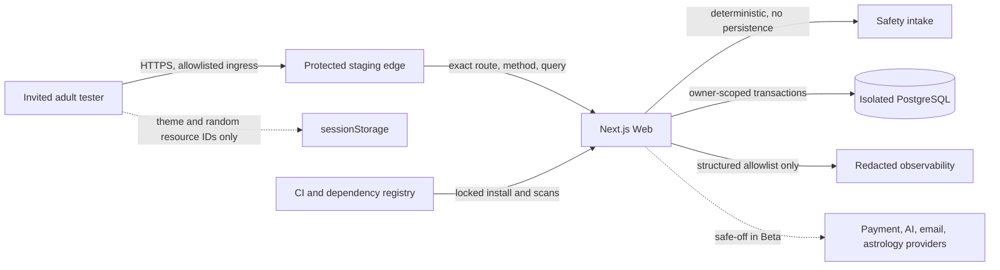

# RITUVIA RIT-121 Protected-Beta Threat Model

**Version:** `2026-08-01-v1`
**Task:** RIT-121
**Approved profile:** D-097 and D-098
**Repository baseline:** `6c0698b88dff` plus the staged RIT-161 through RIT-121 candidate
**Status:** RIT-121 complete; protected Beta, public launch, and production remain NO-GO

## 1. Executive result

This model covers the approved English, anonymous, free, invite-only, allowlisted, noindex closed
Beta of the reflection core loop:

`Question/Theme -> Interpretation -> Intention -> Small Action -> Free Ritual -> Private Reflection -> Revisit`

The review found no open Critical or High vulnerability in that repository scope. One security-job
blocker was reproduced: default Gitleaks classified the immutable version label
`commercial.fulfillment.v1` as a generic API key in historical commit `b99f523`. The value is a
non-secret database idempotency schema version. RIT-121 added only its exact
commit/path/rule/line fingerprint to the temporary full-history ignore file; default rules, current
repository scanning, redaction, and future finding behavior remain unchanged. Gitleaks then scanned
85 commits and reported no leaks.

This is not a release approval. There is no standing protected staging environment, DAST target,
external penetration-test result, managed secret store, provider-level restore evidence, or
immutable hosted run for the current staged candidate. Those missing external and operational
controls remain release gates under RIT-122, RIT-124, RIT-128, and RIT-130.

## 2. Scope and authority

### Included Beta behavior

- `/en` and the primary `Begin a free reading` entry.
- Deterministic private intake at `/en/intake`.
- One-card Tarot creation, reveal, reviewed deterministic interpretation, and resume.
- Intention and small-action creation and owner-scoped mutation.
- Free candle or incense ritual start and completion.
- Encrypted private journal reflection.
- Revisit scheduling, retrieval, completion, and same-session continuity.
- Anonymous session issuance, session-bound CSRF, exact origin checks, owner scoping, encryption,
  private response headers, redacted observability, configuration, dependencies, CI, and rollback.

### Retained but excluded behavior

Account-required value, production email, OAuth/passkeys/wallet identity, three-card expansion,
numerology, astrology activation, Credits, subscriptions, paid reports, Stripe, crypto, production
AI, admin UI, extra locales/countries, public indexing, marketing, and public launch are not Beta
features. Their code is included in attack-surface review only to prove that the Beta profile does
not activate them and that missing configuration fails closed.

### Explicitly not authorized

No deployment, DNS change, production credential, production data, live payment, real crypto,
production AI, new country/locale, legal-policy activation, destructive migration, golden-screen
change, or public indexing is authorized by RIT-121.

## 3. Assets and required properties

| Asset | Classification | Required property |
| --- | --- | --- |
| Raw intake question | Sensitive transient free text | Never persisted, placed in URLs/metadata/storage, or emitted to logs/analytics |
| Theme code | Bounded private context | One-time categorical handoff only |
| Reading, intention, ritual, journal, Revisit | Private pseudonymous records | Random IDs, anonymous-owner scope, private/no-store responses |
| Small action and journal text | Sensitive private content | Field ciphertext at rest; plaintext only inside authorized Web boundary |
| Anonymous session token | Authentication secret | Random, hashed at rest, Secure/HttpOnly/Strict `__Host-` cookie, fixed expiry |
| CSRF token | Session-derived browser capability | Memory-only response header, exact session binding, constant-time verification |
| Tarot draw facts and catalog | Integrity-sensitive deterministic facts | Approved checksum, immutable facts, no AI authority |
| Encryption/integrity keys | Server secret | Exact typed configuration, no browser projection, unique purpose |
| Database and backup evidence | Integrity/recovery asset | Least privilege, RLS/owner scope, migration and isolated-restore evidence |
| Source, lockfile, CI policy | Supply-chain authority | Exact Node/pnpm versions, immutable dependency/action references, scans |

## 4. Threat actors and abuse cases

- An unauthenticated Internet user guessing IDs, replaying requests, or sending cross-site traffic.
- An invited tester attempting to read or mutate another anonymous subject's records.
- A script automating session, intake, reading, or ritual requests to exhaust capacity.
- A malicious browser extension or injected script reading browser-visible state.
- A dependency, registry, CI action, or source-history compromise.
- A misconfigured operator accidentally enabling retained payment, AI, astrology, identity, or
  indexing surfaces in the Beta environment.
- An insider or compromised service credential attempting broad database reads or private logging.
- A user seeking certainty, medical/legal/financial decisions, control over another person, or
  crisis guidance through the reflection intake.

## 5. Trust boundaries and data flow

The browser is untrusted. Cookies and browser storage are not database authority. The Web process
must validate method, path, query, content type, size, origin, idempotency, CSRF, schema, and owner
scope before a state transition. PostgreSQL remains the system of record. No external provider is
part of the approved Beta data path.

## 6. Reachable integration disposition

| Integration | Beta state | Security disposition |
| --- | --- | --- |
| Public Web shell | Reachable | Exact route registry, production-only indexing, otherwise noindex |
| Question intake | Reachable when exact activation reference exists | Deterministic, body-bounded, same-origin, no persistence, private/no-store |
| Anonymous session | Reachable | Empty-body POST, exact origin, idempotency, issuance cap, hashed token |
| Tarot one-card | Reachable only in current local composition | Approved catalog/checksum, database + integrity key required, owner scope |
| Reflection loop | Reachable with anonymous session | Session CSRF, owner-scoped persistence, encryption, revision/idempotency |
| Browser storage | Reachable | Theme and random IDs only; no question, interpretation, action, or journal text |
| Account/auth | Excluded | Local provider only; no production provider; account value absent from Beta navigation |
| Payment/Credits/subscription | Excluded | Production rejects Stripe configuration; local provider rejected outside local; no Beta navigation |
| Production AI | Excluded | Interpretation start and polling composition returns unavailable; no provider call |
| Astrology | Excluded | Database/config/feature flag/native metadata all required; otherwise unavailable |
| Worker provider loops | Excluded | Missing dedicated provider/database configuration prevents loop composition |
| Admin | Excluded | No Admin HTTP/UI runtime; database kernels retain separate privileged requirements |
| CI/dependency registry | Build-time | Lockfile, exact toolchain, pinned actions/tools, SCA and secret scans |
| External staging/monitoring/restore | Not provisioned | Required before Beta; cannot be inferred from repository tests |

## 7. Beta threat register

| ID | Threat and attack path | Impact | Controls/evidence | Residual status |
| --- | --- | --- | --- | --- |
| BETA-AUTH-01 | Guess or steal anonymous token | Cross-user private access | 256-bit token, hash at rest, Secure HttpOnly Strict `__Host-` cookie, expiry/revocation, owner-scoped DB | No High/Critical open |
| BETA-AUTH-02 | Cross-site state mutation | Private record creation/change | Exact Origin/Sec-Fetch-Site, session-derived CSRF, SameSite Strict, negative route tests | No High/Critical open |
| BETA-AUTH-03 | Session issuance/replay abuse | Capacity exhaustion or duplicate subject | Idempotency, atomic issuance, global privacy-minimal cap, Retry-After, fixed-row per-session intake/mutation budgets | Repository gap closed by RIT-122; OWN-019/RIT-130 still own aggregate protected ingress |
| BETA-API-01 | IDOR/BOLA using random resource ID | Private record disclosure/mutation | Owner-scoped reads/writes, indistinguishable 404, RLS/role gates, cross-user tests | No High/Critical open |
| BETA-API-02 | Mass assignment or malformed body | Authority or lifecycle tampering | Typed allowlist schemas, bounded JSON, server-owned fields, revision and state-machine checks | No High/Critical open |
| BETA-API-03 | XSS through question/journal/output | Session/private-data theft | Escaped React text, strict structured projections, no raw private HTML, CSP, XSS tests | Medium CSP hardening remains |
| BETA-API-04 | SSRF/command/SQL injection | Internal access or code execution | No user URL fetch in core, parameterized DB, architecture provider zones, no shell construction | No High/Critical open |
| BETA-DATA-01 | Private text in URL/storage/log/analytics | Sensitive disclosure | No question persistence, categorical storage, private canaries, redacted structured observability | No High/Critical open |
| BETA-DATA-02 | Database theft exposes private text | Journal/action disclosure | AES-256-GCM field encryption and dedicated key configuration | External KMS/rotation still required |
| BETA-DATA-03 | Cached or indexed private response | Search/cache disclosure | Private no-store, noindex/noarchive, strict query allowlists | No High/Critical open |
| BETA-FACT-01 | Client or AI changes Tarot facts | Misleading/false result | Server deterministic draw, catalog checksum, integrity record, AI unavailable | No High/Critical open |
| BETA-SAFE-01 | High-stakes or coercive intake | User harm | Deterministic allowed/reframed/blocked/crisis policy; blocked/crisis cannot continue | No High/Critical open |
| BETA-RITUAL-01 | Reuse or race free ritual state | Duplicate session/inconsistent loop | Transactional owner scope, idempotency/revision, concurrency tests | No High/Critical open |
| BETA-CONFIG-01 | Operator enables excluded provider | Payment/data/compliance exposure | Typed fail-closed config; production Stripe and local adapters rejected; AI safe-off; feature flags | RIT-130 must bind exact Beta profile |
| BETA-SUPPLY-01 | Malicious dependency or action | Build/runtime compromise | Locked graph, exact Node/pnpm, pinned actions/tools, architecture gate, audit, source/history scan | 2 Moderate Prisma-tool advisories recorded |
| BETA-OPS-01 | Provider/database outage or failed deploy | Loss of service/data | Core has no provider dependency; isolated logical restore rehearsal; rollback contract | Standing staging/monitoring/provider restore absent |

## 8. Production security-matrix disposition

`contracts/security-test-matrix.csv` remains the complete production minimum. RIT-121 maps every
row below without claiming excluded integrations are Beta-complete.

| Matrix ID | Beta disposition | Current evidence or next gate |
| --- | --- | --- |
| SEC-AUTH-01 | Excluded account flow | Local-only auth tests retained; production email remains safe-off |
| SEC-AUTH-02 | Anonymous session equivalent applies | Rotation/old-token denial covered in current auth/session suite |
| SEC-AUTH-03 | Excluded account flow | Uniform local start behavior retained; no production email provider |
| SEC-OAUTH-01 | Not implemented/activated | Must remain unavailable; future identity task owns evidence |
| SEC-PASSKEY-01 | Not implemented/activated | Must remain unavailable; future identity task owns evidence |
| SEC-WAL-01 | Not implemented/activated | No wallet route/provider in Beta |
| SEC-WAL-02 | Not implemented/activated | No wallet route/provider in Beta |
| SEC-WAL-03 | Not implemented/activated | No wallet route/provider in Beta |
| SEC-WAL-04 | Not implemented/activated | No wallet discovery/metadata rendering in Beta |
| SEC-WAL-05 | Not implemented/activated | No wallet-link route in Beta |
| SEC-WAL-06 | Not implemented/activated | No crypto checkout or wallet identity in Beta |
| SEC-CSRF-01 | Applicable | Same-origin + session-CSRF route tests pass |
| SEC-BOLA-ALL | Applicable | Core owner-scope and composed authorization tests retained; current focused routes pass |
| SEC-MASS-01 | Applicable | Strict request schemas and server-owned fields pass route/domain tests |
| SEC-XSS-01 | Applicable | React escaping/structured output and private-content browser tests retained |
| SEC-SSRF-01 | Applicable by absence | Core accepts no URL and architecture confines provider/network code |
| SEC-LOG-01 | Applicable | Redaction, observability, full-loop private canary evidence passes |
| SEC-PAY-01 | Excluded payment flow | Server catalog/Test Mode evidence retained; provider omitted from Beta |
| SEC-PAY-02 | Excluded payment flow | Stripe Test Mode signature tests retained; Stripe rejected in production |
| SEC-PAY-03 | Excluded payment flow | Duplicate webhook tests retained; no Beta provider |
| SEC-PAY-04 | Excluded payment flow | Ordered Test Mode state tests retained; no Beta provider |
| SEC-PAY-05 | Excluded payment flow | Return-route authority tests retained; no Beta navigation/provider |
| SEC-CRYPTO-01 | Not implemented/activated | No Coinbase integration or Beta crypto |
| SEC-CRYPTO-02 | Not implemented/activated | No Coinbase integration or Beta crypto |
| SEC-CRYPTO-03 | Not implemented/activated | No Coinbase integration or Beta crypto |
| CONC-PAY-01 | Excluded payment flow | Test Mode DB evidence retained; no Beta provider |
| CONC-CRD-01 | Excluded Credit flow | Credit kernel frozen; no Beta Credit authority |
| CONC-RIT-01 | Applicable | Free ritual atomic-start/concurrency evidence retained |
| AI-INJECT-01 | Production AI excluded | Deterministic intake only; provider composition unavailable |
| AI-INJECT-02 | Production AI excluded | No copied user text is sent to an AI provider |
| AI-SAFE-01 | Intake equivalent applies | Relationship/control prompts deterministically reframe |
| AI-SAFE-02 | Intake equivalent applies | Medical/legal/financial prompts block or redirect |
| AI-SAFE-03 | Intake equivalent applies | Predictive certainty is not rendered as authority |
| AI-OUTPUT-01 | Production AI excluded | Strict output contracts retained; no provider response in Beta |
| AI-FAIL-01 | Production AI excluded | No Credit reservation/provider call in Beta |
| AI-COST-01 | Production AI excluded | No AI spend path; RIT-122 owns general endpoint abuse controls |
| DATA-ENC-01 | Applicable | Private action/journal encryption tests pass |
| DATA-DEL-01 | Account deletion excluded | Retained account deletion tests do not substitute for anonymous retention policy |
| OPS-REC-01 | Provider reconciliation excluded | No provider in Beta; later paid release gate |
| OPS-RESTORE-01 | Partially applicable | Synthetic isolated logical restore passes; provider-level staging restore still required |
| OPS-KILL-01 | Partially applicable | Excluded providers default off; staging emergency controls remain RIT-124/RIT-130 |

## 9. Finding disposition

### Closed during RIT-121

| Finding | Initial effect | Root cause | Remediation | Verification |
| --- | --- | --- | --- | --- |
| RIT121-F01 | Security CI blocked, severity not a vulnerability | Default entropy rule treated a public schema-version label as a generic API key | Added one exact historical fingerprint; no regex/rule/path broadening | 85-commit Gitleaks scan: no leaks; pinned-tool contract: 1/1 pass |

### Open Critical/High

None in the approved repository Beta scope after RIT121-F01 closure.

### Lower-severity and release-evidence gaps

| ID | Level | Gap | Compensating control | Required closure |
| --- | --- | --- | --- | --- |
| RIT121-M01 | Moderate | `@hono/node-server` 1.19.13 and `valibot` 1.2.0 advisories under Prisma tooling | Not imported by Web/Worker source; no Windows static-file server; locked audit has 0 High/Critical | Upgrade through dependency review when Prisma supplies a compatible graph; re-audit before release candidate |
| RIT121-M02 | Moderate hardening | CSP still permits inline scripts required by current Next output instead of nonce/hash-only policy | No third-party scripts, no raw private HTML, strict output/input boundaries, `script-src-attr 'none'` | Inventory Next inline execution and move to nonce/hash policy before protected Beta completion |
| RIT121-M03 | Scope hardening | Retained direct routes/APIs exist outside Beta navigation | Provider/config fail-closed controls; browser loop makes no excluded requests | RIT-130 must enforce and test the exact protected-Beta route/profile contract |
| RIT121-L01 | Low defense-in-depth | Tarot create/report/interpretation mutations rely on exact Origin plus a Strict anonymous cookie instead of the session-CSRF header used by private reflection mutations | Cross-site and missing-origin requests are rejected; random owner-scoped IDs and Strict cookies remain required | Align the mutations with the session-CSRF contract before the Beta candidate, or record an exact reviewed origin-only exception |
| RIT121-E01 | Evidence gap | No standing allowlisted staging, DAST, or external penetration test | No external service is claimed or approved | Required before RIT-130 can authorize a Beta candidate |
| RIT121-E02 | Evidence gap | No general SAST, workspace license, or application SBOM/provenance command | Strict TypeScript/lint/architecture, lockfile, SCA, native SBOM, complete source archive | Add bounded release tooling before protected Beta candidate evidence |
| RIT121-E03 | Evidence gap | Current staged tree has no immutable hosted three-job run | Local focused evidence and previous full matrix are source-bound but not a release SHA | Run protected CI on the final clean candidate under RIT-130 |
| RIT121-E04 | Evidence gap | Browser release evidence is Chromium-heavy | Keyboard/mobile/reduced-motion/Axe pass in Chromium | Firefox, WebKit, manual AT remain Gate B/H evidence |
| RIT121-E05 | Release-evidence gap | Repository-side protected-Beta admission is complete; exact production thresholds, invite assumptions, and protected ingress/edge controls are not approved or deployed | RIT-122 fixed-row per-session intake/mutation budgets, anonymous issuance cap, Tarot quota, body limits, no AI/payment cost path | OWN-019 and RIT-130 before Beta candidate; no deployment is claimed |

## 10. Verification evidence

Executed with exact Node `26.5.1` and pnpm `11.13.1` unless stated otherwise:

- `pnpm check:ci-contract` — pass.
- `pnpm check:architecture` — pass for 568 source files across 16 active modules.
- `pnpm check:environment-contract` — pass for four environments, ten sections, ten references.
- `pnpm scan:secrets` — pass for 1,146 tracked/unignored files.
- Focused Vitest security set — 19 files, 412 tests, all pass.
- Pinned-tool contract after the exact fingerprint change — 1 file, 1 test, pass.
- `pnpm audit --audit-level=high` — exit 0; 0 Critical, 0 High, 2 Moderate.
- `node scripts/run-pinned-ci-tool.mjs gitleaks` — 85 commits, about 13.38 MB, no leaks.
- `pnpm test:identity-privacy-authorization` — all ten focused, configuration, database, and browser
  boundaries pass after aligning one stale browser expectation with the migrated
  `privacy-export-package.v2` contract.
- `BRAND_CANONICAL_ORIGIN=http://127.0.0.1:4175 pnpm build` — 16 workspace packages, 61 generated
  routes, and 121 build artifacts/runtime exports pass the repository production-build policy.
- `pnpm test:full-loop-browser` — six stages and twelve continuous Home-to-Revisit transitions;
  zero account creation, payment request, serious/critical Axe violation, console/page error,
  unexpected request, touch-target/layout failure, or private storage/metadata/history leak.
- Production-pack golden prototype SHA-256 remains
  `e9d75c9c118be64cc779d182f01ec332d150b520fa9f0eb497f58fbf5fea5740`.
- Independent read-only route, integration, and threat review reproduced no Critical or High
  finding; it separately identified the lower-severity CSP, route-profile, intake-abuse, and Tarot
  CSRF defense-in-depth gaps recorded above.

The existing RIT-166 production-artifact Home-to-Revisit browser evidence remains valid because
RIT-121 changes no Web runtime, database schema, route, product copy, provider, or golden artifact.
Task closure also passes the affected format, lint, type, record, generated-evidence, secret,
configuration, production-build, and full-loop browser gates.

## 11. Release decision and rollback

RIT-121 closes after final gates confirm this report and the exact Gitleaks change. That closure
means only that the repository has a versioned threat model and zero open Critical/High findings
for the approved Beta scope. It does not pass Gate H or authorize Beta deployment.

Rollback removes the exact historical fingerprint and this report, then returns RIT-121 to its
prior queue state. Because removal reopens a known false-positive CI failure, rollback should occur
only when a later Gitleaks rule/tool no longer reports that immutable version label. Never rewrite
shared Git history, broaden a secret allowlist, disable Gitleaks, or expose the redacted match.
